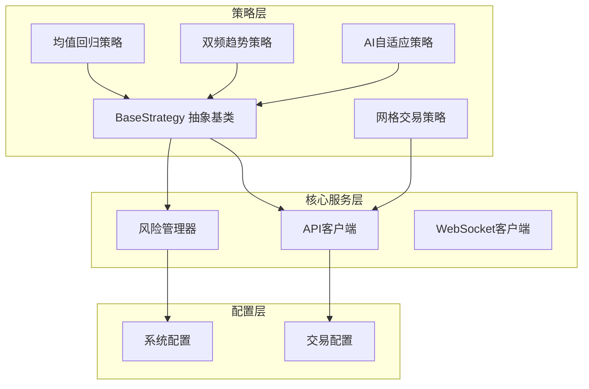
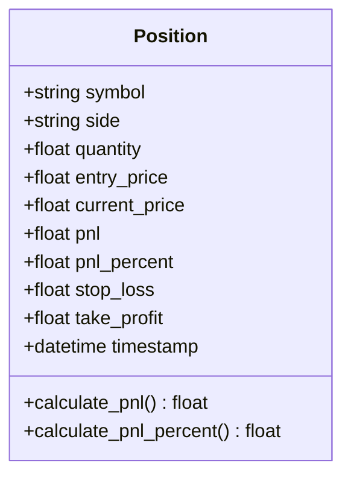
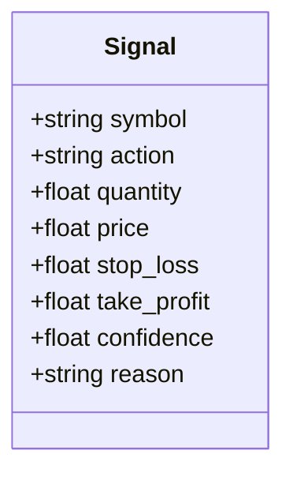
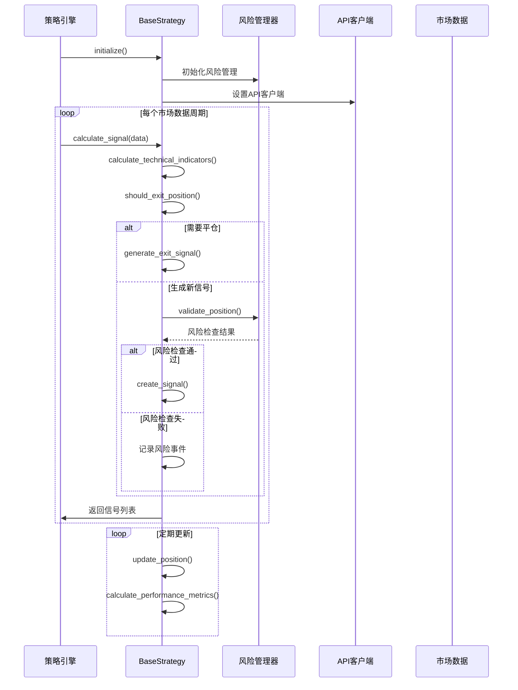
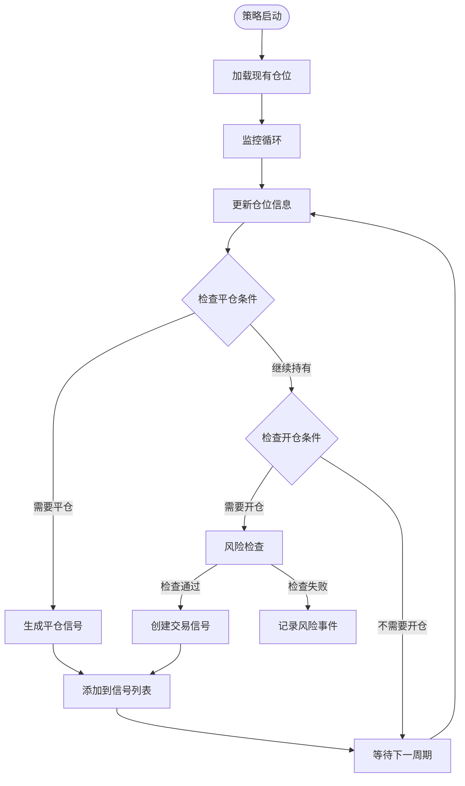
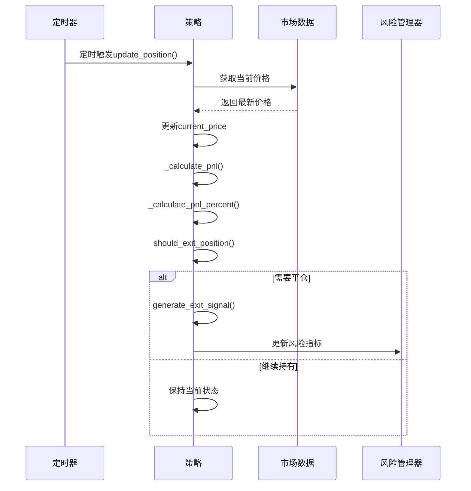
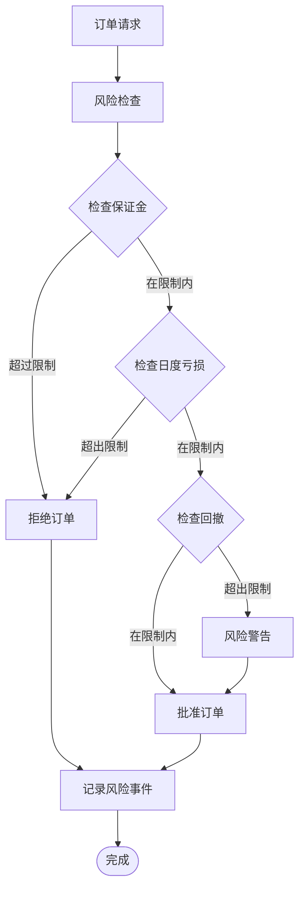
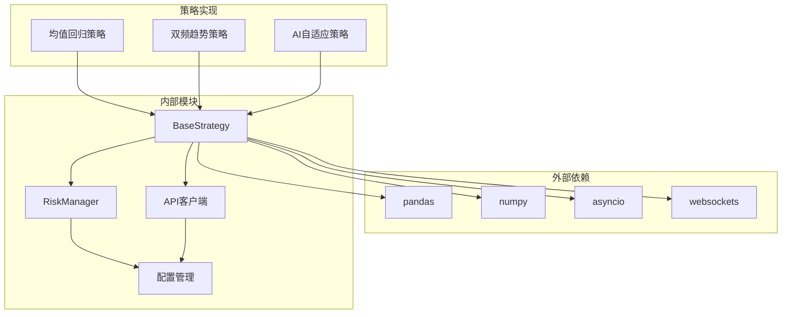

# BaseStrategy基类实现

<cite>
**本文档引用的文件**
- [base.py](file://backpack_quant_trading/strategy/base.py)
- [mean_reversion.py](file://backpack_quant_trading/strategy/mean_reversion.py)
- [dual_freq_trend.py](file://backpack_quant_trading/strategy/dual_freq_trend.py)
- [dual_freq_trend_tv.py](file://backpack_quant_trading/strategy/dual_freq_trend_tv.py)
- [ai_adaptive.py](file://backpack_quant_trading/strategy/ai_adaptive.py)
- [risk_manager.py](file://backpack_quant_trading/core/risk_manager.py)
- [api_client.py](file://backpack_quant_trading/core/api_client.py)
- [settings.py](file://backpack_quant_trading/config/settings.py)
</cite>

## 目录
1. [简介](#简介)
2. [项目结构](#项目结构)
3. [核心组件](#核心组件)
4. [架构概览](#架构概览)
5. [详细组件分析](#详细组件分析)
6. [依赖关系分析](#依赖关系分析)
7. [性能考虑](#性能考虑)
8. [故障排除指南](#故障排除指南)
9. [结论](#结论)

## 简介

BaseStrategy是本量化交易系统的核心抽象基类，为所有交易策略提供了统一的框架和基础设施。该基类实现了策略模板方法模式，定义了策略生命周期管理和风险控制的基础架构。

本实现包含了完整的仓位管理、信号生成、风险控制和性能监控功能，支持多种交易场景和策略类型。

## 项目结构



**图表来源**
- [base.py:41-212](file://backpack_quant_trading/strategy/base.py#L41-L212)
- [risk_manager.py:48-566](file://backpack_quant_trading/core/risk_manager.py#L48-L566)
- [api_client.py:87-800](file://backpack_quant_trading/core/api_client.py#L87-L800)

**章节来源**
- [base.py:1-212](file://backpack_quant_trading/strategy/base.py#L1-L212)
- [settings.py:104-137](file://backpack_quant_trading/config/settings.py#L104-L137)

## 核心组件

### 数据结构定义

BaseStrategy定义了两个核心数据结构：

#### Position 仓位结构


**图表来源**
- [base.py:16-29](file://backpack_quant_trading/strategy/base.py#L16-L29)

#### Signal 信号结构


**图表来源**
- [base.py:30-41](file://backpack_quant_trading/strategy/base.py#L30-L41)

### 核心属性和方法

#### 初始化参数
- `name`: 策略名称
- `symbols`: 监控的交易对列表
- `api_client`: API客户端实例
- `risk_manager`: 风险管理器实例

#### 状态管理属性
- `positions`: 当前持仓字典
- `signals`: 交易信号列表
- `performance_metrics`: 性能指标字典
- `params`: 策略参数字典

**章节来源**
- [base.py:46-69](file://backpack_quant_trading/strategy/base.py#L46-L69)

## 架构概览



**图表来源**
- [base.py:71-112](file://backpack_quant_trading/strategy/base.py#L71-L112)
- [base.py:114-174](file://backpack_quant_trading/strategy/base.py#L114-L174)

## 详细组件分析

### 抽象方法实现要求

#### calculate_signal 方法
这是策略的核心抽象方法，必须实现以下要求：

**方法签名**
```python
async def calculate_signal(self, data: Dict[str, pd.DataFrame]) -> List[Signal]:
```

**实现要求**
1. **数据处理**: 接收市场数据字典，key为symbol，value为DataFrame
2. **技术指标计算**: 计算所需的技术指标
3. **信号生成**: 基于指标生成交易信号
4. **风险控制**: 调用风险管理器进行风险检查
5. **返回格式**: 返回Signal对象列表

**最佳实践**
- 使用异步编程模式处理数据获取
- 实现数据验证和错误处理
- 确保信号的时效性和准确性
- 合理设置信号置信度

#### should_exit_position 方法
```python
def should_exit_position(self, position: Position, current_data: pd.Series) -> bool:
```

**实现要求**
1. **平仓条件判断**: 基于当前位置和当前市场数据判断是否需要平仓
2. **多维度评估**: 考虑止损、止盈、时间止损等多种因素
3. **返回布尔值**: True表示需要平仓，False表示继续持有

**常见平仓场景**
- 价格触及止损或止盈
- 技术指标发出反转信号
- 持仓时间超过限制
- 风险指标触发预警

**章节来源**
- [base.py:71-112](file://backpack_quant_trading/strategy/base.py#L71-L112)

### 策略状态管理机制

#### 仓位管理


**图表来源**
- [base.py:114-174](file://backpack_quant_trading/strategy/base.py#L114-L174)

#### 性能指标管理
BaseStrategy内置了完整的性能监控体系：

**核心指标**
- 总持仓数
- 开仓数量
- 总盈亏
- 胜率
- 夏普比率
- 最大回撤

**实现细节**
- `get_performance_report()`: 生成完整性能报告
- `_calculate_win_rate()`: 计算胜率
- `_calculate_sharpe_ratio()`: 计算夏普比率
- `_calculate_max_drawdown()`: 计算最大回撤

**章节来源**
- [base.py:175-207](file://backpack_quant_trading/strategy/base.py#L175-L207)

### 参数配置系统

#### set_parameters 方法
```python
def set_parameters(self, **kwargs):
    """设置策略参数"""
    self.params.update(kwargs)
    logger.info(f"策略{self.name}参数更新:{kwargs}")
```

**使用示例**
```python
# 基础策略参数设置
strategy.set_parameters(
    rsi_period=14,
    ema_length=21,
    stop_loss_percent=0.02,
    take_profit_percent=0.05
)

# 风险控制参数
strategy.set_parameters(
    max_position_size=0.1,
    daily_loss_limit=0.05,
    max_drawdown=0.15
)
```

**参数配置最佳实践**
- 使用字典形式批量设置参数
- 确保参数名称的唯一性和一致性
- 实现参数验证和默认值设置
- 支持运行时动态调整参数

**章节来源**
- [base.py:170-174](file://backpack_quant_trading/strategy/base.py#L170-L174)

### 仓位更新和盈亏计算

#### 仓位更新机制


**图表来源**
- [base.py:114-131](file://backpack_quant_trading/strategy/base.py#L114-L131)

#### 盈亏计算算法
```mermaid
flowchart TD
Start([开始计算]) --> GetPrice[获取当前价格]
GetPrice --> CalcPnL{计算盈亏}
CalcPnL --> |多头仓位| LongCalc[多头盈亏计算]
CalcPnL --> |空头仓位| ShortCalc[空头盈亏计算]
LongCalc --> LongFormula[(current_price - entry_price) × quantity]
ShortCalc --> ShortFormula[(entry_price - current_price) × quantity]
LongFormula --> CalcPnLPercent[计算盈亏百分比]
ShortFormula --> CalcPnLPercent
CalcPnLPercent --> CalcPercent[entry_value = entry_price × quantity]
CalcPercent --> PercentFormula[PnL% = (PnL ÷ entry_value) × 100]
PercentFormula --> End([计算完成])
```

**图表来源**
- [base.py:132-152](file://backpack_quant_trading/strategy/base.py#L132-L152)

**章节来源**
- [base.py:132-152](file://backpack_quant_trading/strategy/base.py#L132-L152)

### 风险控制系统

#### 风险检查流程


**图表来源**
- [risk_manager.py:132-229](file://backpack_quant_trading/core/risk_manager.py#L132-L229)

#### 风险控制参数
- `MAX_POSITION_SIZE`: 单笔最大仓位比例
- `MAX_DAILY_LOSS`: 单日最大亏损
- `MAX_DRAWDOWN`: 最大回撤
- `STOP_LOSS_PERCENT`: 止损百分比
- `TAKE_PROFIT_PERCENT`: 止盈百分比

**章节来源**
- [risk_manager.py:87-229](file://backpack_quant_trading/core/risk_manager.py#L87-L229)
- [settings.py:55-64](file://backpack_quant_trading/config/settings.py#L55-L64)

## 依赖关系分析



**图表来源**
- [base.py:1-13](file://backpack_quant_trading/strategy/base.py#L1-L13)
- [risk_manager.py:1-12](file://backpack_quant_trading/core/risk_manager.py#L1-L12)
- [api_client.py:1-18](file://backpack_quant_trading/core/api_client.py#L1-L18)

**章节来源**
- [base.py:1-13](file://backpack_quant_trading/strategy/base.py#L1-L13)
- [risk_manager.py:1-12](file://backpack_quant_trading/core/risk_manager.py#L1-L12)

## 性能考虑

### 异步编程模式
- 使用async/await处理I/O密集型操作
- 实现非阻塞的市场数据获取
- 支持并发的多个交易对监控

### 内存管理
- 使用数据类减少内存占用
- 实现信号和仓位的生命周期管理
- 定期清理过期的历史数据

### 计算优化
- 缓存常用的技术指标
- 实现增量计算避免重复计算
- 使用向量化操作提升计算效率

## 故障排除指南

### 常见问题诊断

#### 策略参数配置问题
**症状**: 策略无法正常运行或参数不生效
**解决方案**:
1. 检查参数名称的正确性
2. 验证参数值的有效范围
3. 确认参数更新的时机

#### 仓位管理异常
**症状**: 仓位数量异常或盈亏计算错误
**解决方案**:
1. 检查价格数据的完整性
2. 验证仓位状态的一致性
3. 确认平仓信号的正确性

#### 风险控制失效
**症状**: 超过风险限额但未被阻止
**解决方案**:
1. 检查风险检查逻辑
2. 验证账户资金的准确性
3. 确认风险限额的设置

**章节来源**
- [base.py:170-174](file://backpack_quant_trading/strategy/base.py#L170-L174)
- [risk_manager.py:87-131](file://backpack_quant_trading/core/risk_manager.py#L87-L131)

## 结论

BaseStrategy抽象基类为量化交易系统提供了完整而灵活的策略框架。通过标准化的接口设计和完善的基础设施，开发者可以专注于具体的交易逻辑实现，而不必关心底层的基础设施细节。

该实现的关键优势包括：
- **模块化设计**: 清晰的职责分离和接口定义
- **扩展性强**: 支持多种策略类型的灵活实现
- **风险管理**: 内置完善的风险控制机制
- **性能优化**: 异步编程和计算优化
- **监控完善**: 全面的性能指标和风险监控

通过遵循本文档的实现指南和最佳实践，开发者可以构建出高效、稳定、可维护的量化交易策略系统。