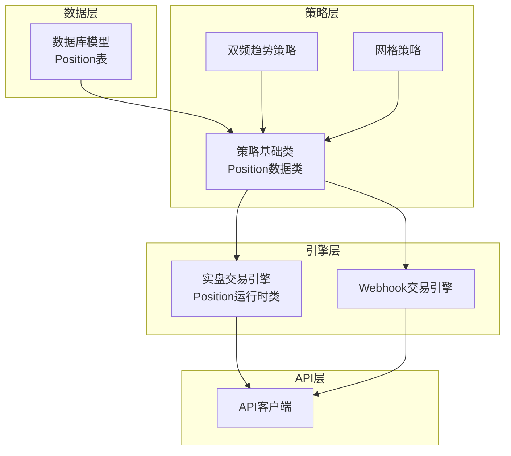
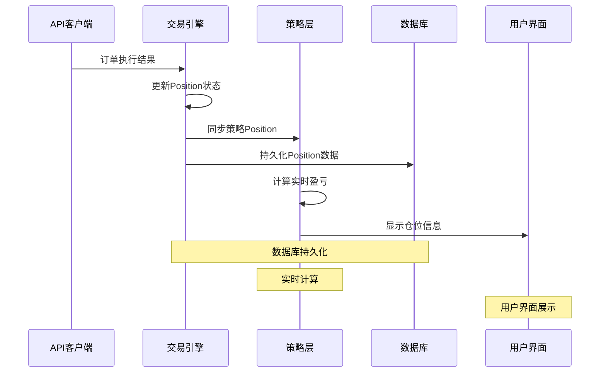
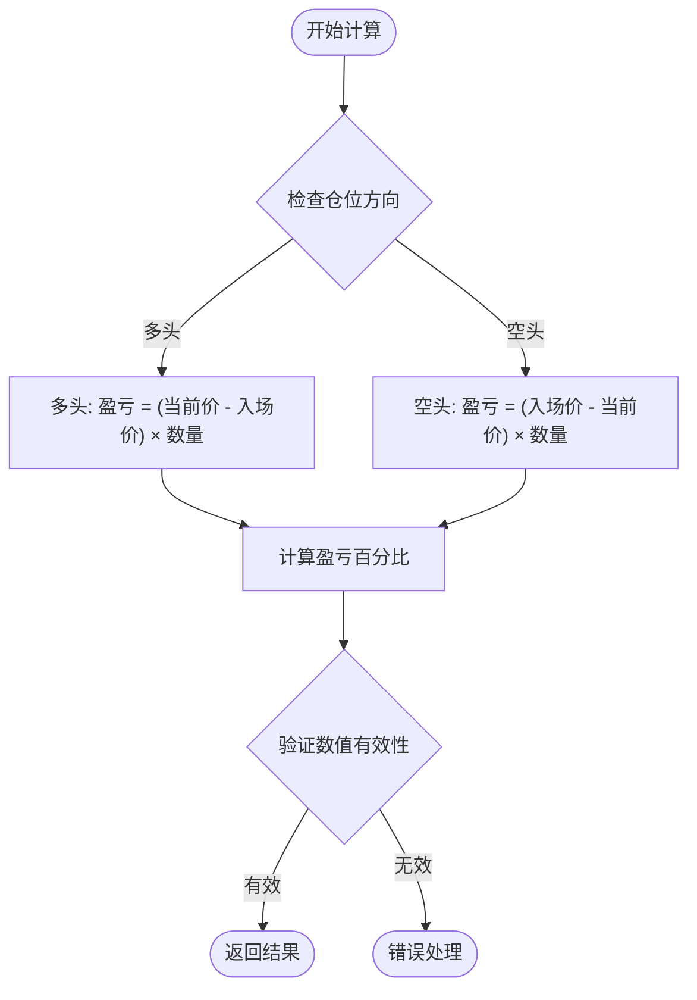
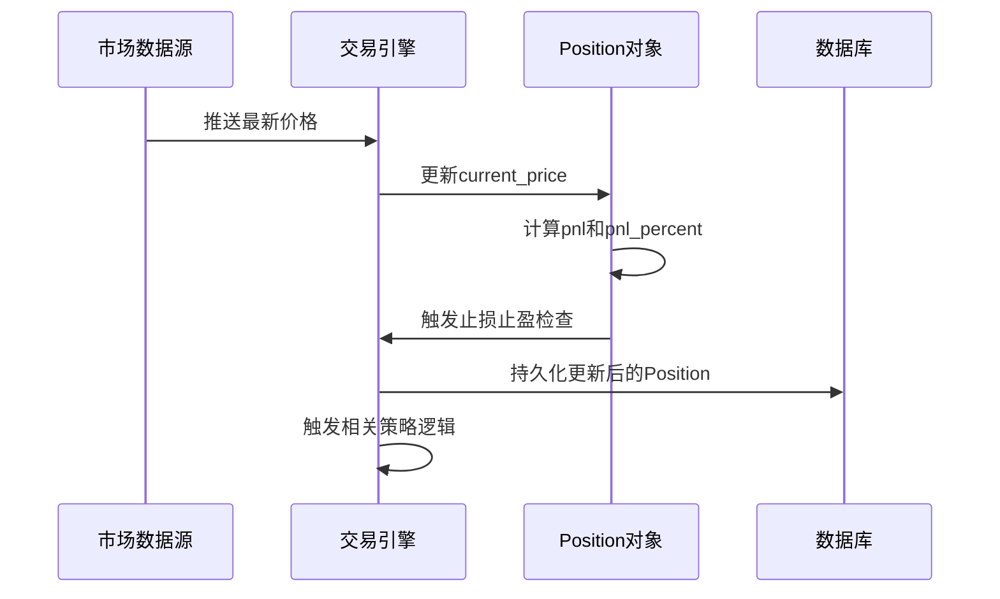
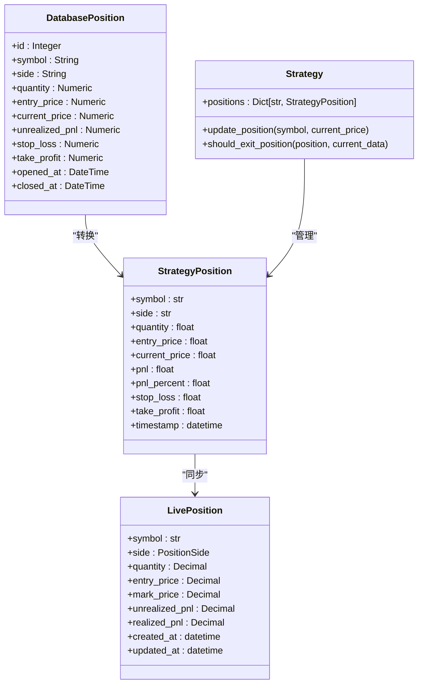

# Position数据结构

<cite>
**本文引用的文件**
- [database/models.py](file://database/models.py)
- [strategy/base.py](file://strategy/base.py)
- [engine/live_trading.py](file://engine/live_trading.py)
- [engine/webhook_trading.py](file://engine/webhook_trading.py)
- [strategy/dual_freq_trend.py](file://strategy/dual_freq_trend.py)
- [strategy/grid_strategy.py](file://strategy/grid_strategy.py)
</cite>

## 目录
1. [简介](#简介)
2. [项目结构](#项目结构)
3. [核心组件](#核心组件)
4. [架构概览](#架构概览)
5. [详细组件分析](#详细组件分析)
6. [依赖关系分析](#依赖关系分析)
7. [性能考虑](#性能考虑)
8. [故障排除指南](#故障排除指南)
9. [结论](#结论)

## 简介

Position数据结构是量化交易系统的核心数据模型，用于跟踪和管理用户的交易仓位。本文档深入解析Position数据类的设计，包括各个字段的含义和用途，详细说明多头(long)和空头(short)仓位的区别，以及盈亏计算公式。同时解释仓位状态管理机制，包括实时价格更新、盈亏动态计算和止损止盈检查，并提供在策略中的实际应用场景。

## 项目结构

该项目采用模块化架构，Position数据结构在多个层面发挥作用：

**图表来源**
- [database/models.py:92-121](file://database/models.py#L92-L121)
- [strategy/base.py:16-30](file://strategy/base.py#L16-L30)
- [engine/live_trading.py:84-96](file://engine/live_trading.py#L84-L96)

## 核心组件

### 数据库层Position模型

数据库层的Position模型提供了持久化存储能力，包含以下关键字段：

| 字段名 | 类型 | 描述 | 约束 |
|--------|------|------|------|
| id | Integer | 主键标识 | 自增 |
| source | String(50) | 数据来源 | 默认'backpack' |
| symbol | String(20) | 交易对符号 | 必填 |
| side | String(10) | 仓位方向 | 必填，'long'或'short' |
| quantity | Numeric(20,8) | 持仓数量 | 必填 |
| entry_price | Numeric(20,8) | 入场价格 | 必填 |
| current_price | Numeric(20,8) | 当前价格 | 可选 |
| unrealized_pnl | Numeric(20,8) | 未实现盈亏 | 可选 |
| unrealized_pnl_percent | Numeric(10,4) | 未实现盈亏百分比 | 可选 |
| stop_loss | Numeric(20,8) | 止损价格 | 可选 |
| take_profit | Numeric(20,8) | 止盈价格 | 可选 |
| trade_index | Integer | 交易索引 | 可选 |
| pair_id | Integer | 交易对ID | 可选 |
| collateral | Numeric(20,8) | 保证金 | 可选 |
| opened_at | DateTime | 开仓时间 | 必填 |
| updated_at | DateTime | 更新时间 | 默认当前时间 |
| closed_at | DateTime | 平仓时间 | 可选 |

### 策略层Position数据类

策略层的Position数据类提供实时计算能力：

| 字段名 | 类型 | 默认值 | 描述 |
|--------|------|--------|------|
| symbol | str | - | 交易对符号 |
| side | str | - | 'long'或'short' |
| quantity | float | - | 持仓数量 |
| entry_price | float | - | 入场价格 |
| current_price | float | - | 当前市场价格 |
| pnl | float | 0.0 | 盈亏金额 |
| pnl_percent | float | 0.0 | 盈亏百分比 |
| stop_loss | Optional[float] | None | 止损价格 |
| take_profit | Optional[float] | None | 止盈价格 |
| timestamp | datetime | 当前时间 | 创建时间戳 |

### 实盘引擎Position运行时类

实盘引擎中的Position类提供高性能的实时计算：

| 字段名 | 类型 | 默认值 | 描述 |
|--------|------|--------|------|
| symbol | str | - | 交易对符号 |
| side | PositionSide | - | 仓位方向枚举 |
| quantity | Decimal | - | 持仓数量 |
| entry_price | Decimal | - | 入场价格 |
| mark_price | Decimal | 0 | 标记价格 |
| unrealized_pnl | Decimal | 0 | 未实现盈亏 |
| realized_pnl | Decimal | 0 | 已实现盈亏 |
| created_at | datetime | 当前时间 | 创建时间 |
| updated_at | datetime | 当前时间 | 更新时间 |

**章节来源**
- [database/models.py:92-121](file://database/models.py#L92-L121)
- [strategy/base.py:16-30](file://strategy/base.py#L16-L30)
- [engine/live_trading.py:84-96](file://engine/live_trading.py#L84-L96)

## 架构概览

Position数据结构在整个系统中的交互关系如下：

**图表来源**
- [engine/live_trading.py:1395-1404](file://engine/live_trading.py#L1395-L1404)
- [database/models.py:428-447](file://database/models.py#L428-L447)

## 详细组件分析

### 多头(long)与空头(short)仓位区别

#### 多头仓位(Long Position)
- **定义**: 买入并持有，预期价格上涨获利
- **盈亏计算**: `盈亏 = (当前价格 - 入场价格) × 持仓数量`
- **止盈条件**: 当前价格达到或超过止盈价格
- **止损条件**: 当前价格达到或低于止损价格

#### 空头仓位(Short Position)
- **定义**: 卖出借入的资产，预期价格下跌后买回归还获利
- **盈亏计算**: `盈亏 = (入场价格 - 当前价格) × 持仓数量`
- **止盈条件**: 当前价格达到或低于止盈价格
- **止损条件**: 当前价格达到或超过止损价格

### 盈亏计算公式详解

#### 基础盈亏计算

#### 盈亏百分比计算
- **公式**: `盈亏百分比 = (盈亏金额 ÷ 入场价值) × 100`
- **入场价值**: `入场价格 × 持仓数量`
- **注意**: 避免除零错误，当入场价值为0时返回0%

**图表来源**
- [strategy/base.py:132-152](file://strategy/base.py#L132-L152)

### 仓位状态管理机制

#### 实时价格更新流程

#### 止损止盈检查机制
1. **实时监控**: 每次价格更新时检查
2. **策略优先**: 首先检查策略设定的价格
3. **全局阈值**: 如果策略未设定，则使用全局配置
4. **自动平仓**: 达到阈值时自动触发平仓

**图表来源**
- [engine/live_trading.py:1876-1963](file://engine/live_trading.py#L1876-L1963)

### Position字段详细说明

#### 基础字段
- **symbol**: 交易对标识符，如"BTC-USDT-PERP"
- **side**: 仓位方向，'long'或'short'
- **quantity**: 持仓数量，支持小数点后8位精度
- **entry_price**: 入场价格，用于计算盈亏的基础

#### 实时计算字段
- **current_price**: 当前市场价格，实时更新
- **pnl**: 未实现盈亏金额，实时计算
- **pnl_percent**: 未实现盈亏百分比，实时计算

#### 风险管理字段
- **stop_loss**: 止损价格，达到即强制平仓
- **take_profit**: 止盈价格，达到即强制平仓

#### 时间戳字段
- **opened_at**: 仓位开仓时间
- **updated_at**: 仓位最后更新时间
- **closed_at**: 仓位平仓时间

**章节来源**
- [database/models.py:98-116](file://database/models.py#L98-L116)
- [strategy/base.py:19-28](file://strategy/base.py#L19-L28)

## 依赖关系分析

### 组件耦合关系

**图表来源**
- [database/models.py:92-121](file://database/models.py#L92-L121)
- [strategy/base.py:16-30](file://strategy/base.py#L16-L30)
- [engine/live_trading.py:84-96](file://engine/live_trading.py#L84-L96)

### 关键依赖关系

1. **策略层依赖**: 所有策略都依赖基础Position类进行仓位管理
2. **引擎层依赖**: 实盘引擎依赖运行时Position类进行高性能计算
3. **数据库依赖**: 数据库层提供持久化存储，支持断电恢复
4. **API层集成**: 通过API客户端获取实时价格和执行交易

**章节来源**
- [strategy/base.py:60-65](file://strategy/base.py#L60-L65)
- [engine/live_trading.py:1395-1404](file://engine/live_trading.py#L1395-L1404)

## 性能考虑

### 数据精度优化
- **Decimal类型**: 实盘引擎使用Decimal类型避免浮点数精度问题
- **Numeric类型**: 数据库存储使用Numeric类型确保精度
- **小数位控制**: 支持最多8位小数精度

### 内存管理
- **实时计算**: 策略层Position对象支持实时计算，内存占用较小
- **批量更新**: 引擎层支持批量价格更新，减少计算开销
- **缓存机制**: 策略层维护positions字典，提供快速访问

### 并发安全
- **锁机制**: 实盘引擎使用position_lock确保并发安全性
- **原子操作**: 数据库操作使用事务保证数据一致性
- **状态同步**: 多层状态同步机制避免数据不一致

## 故障排除指南

### 常见问题及解决方案

#### 1. 仓位方向识别错误
**问题**: 多头和空头计算方向相反
**解决方案**: 
- 检查side字段值是否正确
- 确认盈亏计算公式的方向性
- 验证策略层和引擎层的一致性

#### 2. 盈亏计算精度问题
**问题**: 浮点数计算导致的精度误差
**解决方案**:
- 使用Decimal类型进行高精度计算
- 在数据库层使用Numeric类型存储
- 避免多次转换导致的精度损失

#### 3. 止损止盈触发异常
**问题**: 止损止盈价格不生效
**解决方案**:
- 检查stop_loss和take_profit字段是否正确设置
- 验证价格更新逻辑是否正常执行
- 确认策略层和引擎层的状态同步

#### 4. 数据库连接问题
**问题**: 仓位数据无法持久化
**解决方案**:
- 检查数据库连接配置
- 验证表结构和索引
- 确认事务提交和回滚机制

**章节来源**
- [engine/live_trading.py:1913-1942](file://engine/live_trading.py#L1913-L1942)
- [engine/webhook_trading.py:405-425](file://engine/webhook_trading.py#L405-L425)

## 结论

Position数据结构是量化交易系统的核心基础设施，通过三层架构设计实现了从数据库持久化到实时计算再到策略应用的完整闭环。其设计特点包括：

1. **多层一致性**: 数据库、策略层和引擎层的数据结构相互对应，确保数据一致性
2. **高精度计算**: 使用Decimal和Numeric类型确保金融计算的精确性
3. **实时响应**: 支持实时价格更新和动态盈亏计算
4. **风险管理**: 完善的止损止盈机制和仓位管理
5. **扩展性**: 支持多种交易策略和不同的数据来源

该设计为量化交易提供了可靠的数据基础，支持复杂的交易策略实现和风险管理需求。通过合理的架构设计和性能优化，Position数据结构能够满足高频交易和复杂策略的需求。