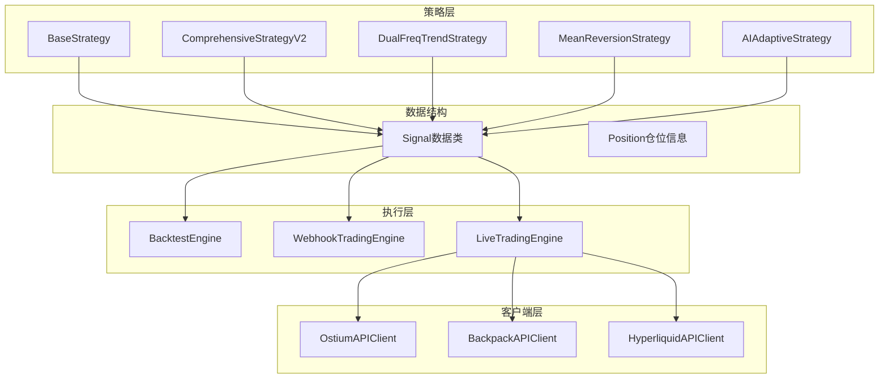
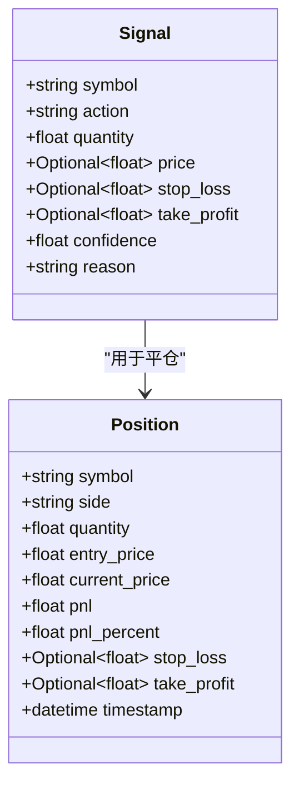
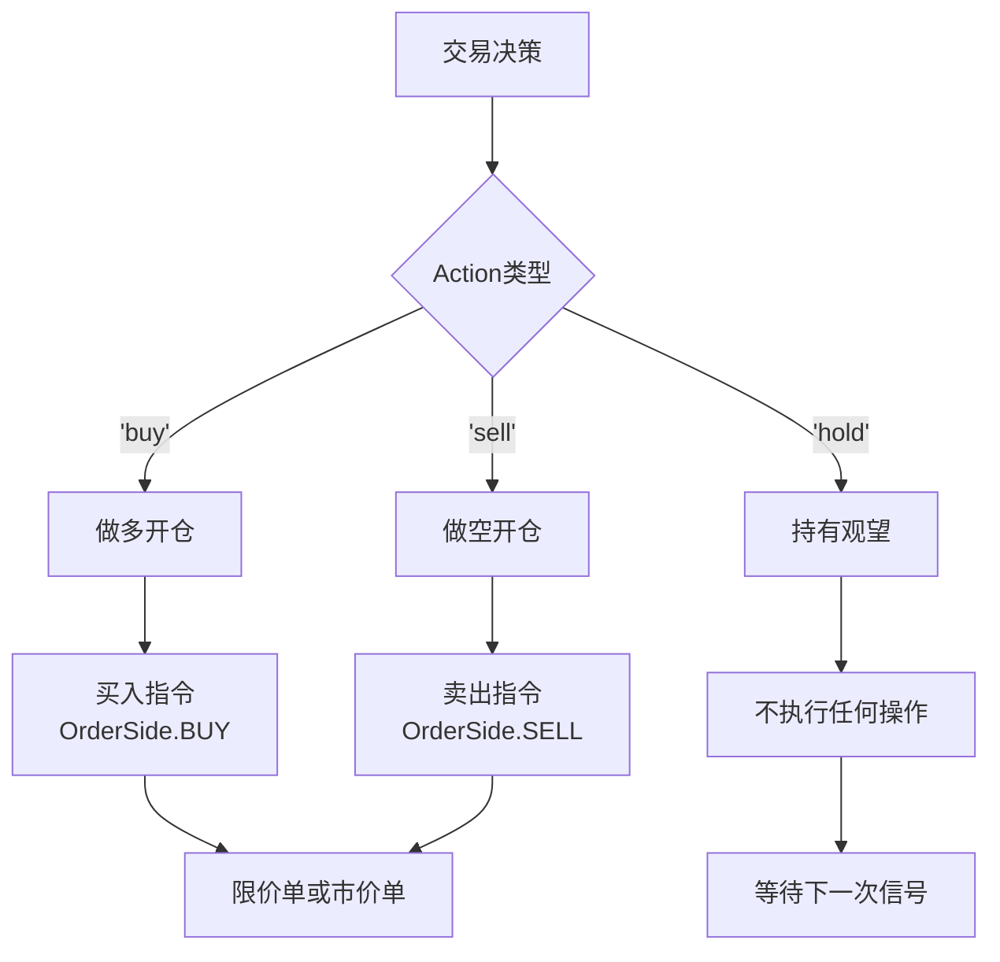
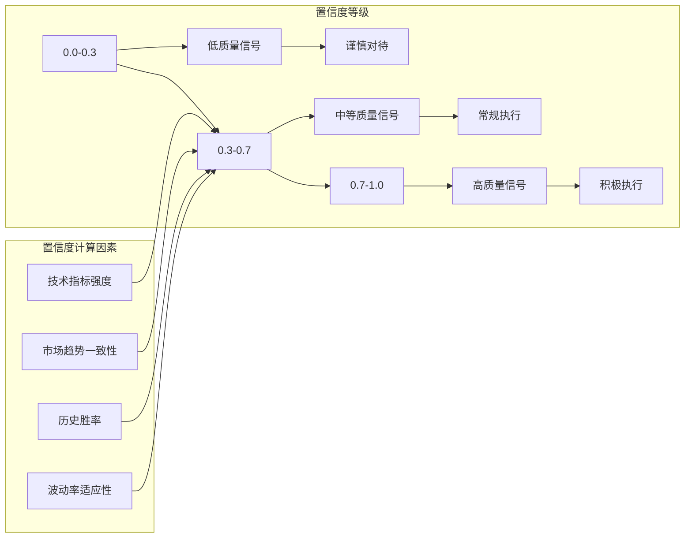
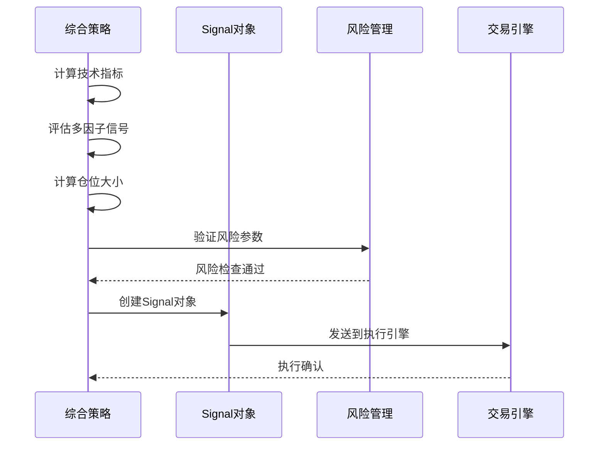
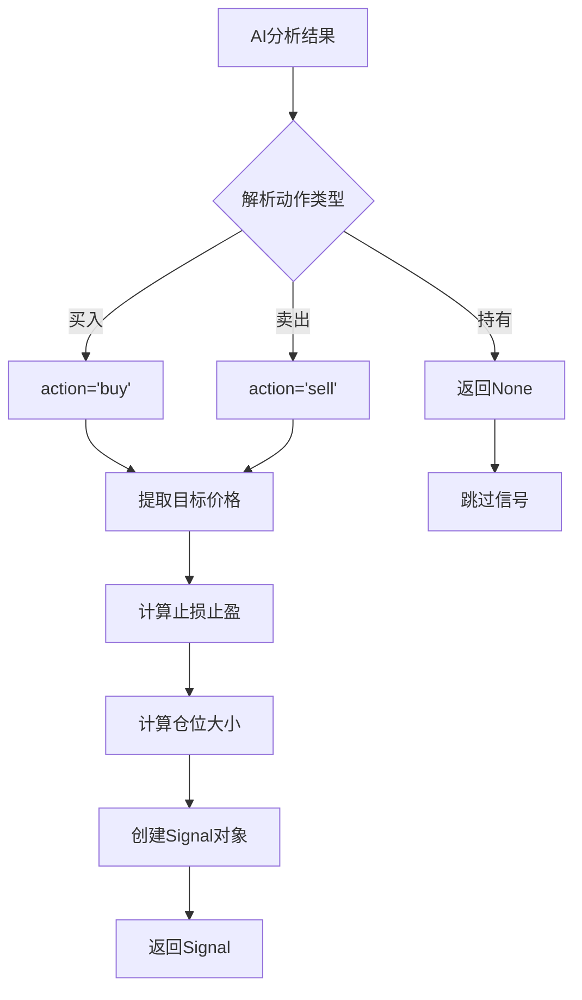
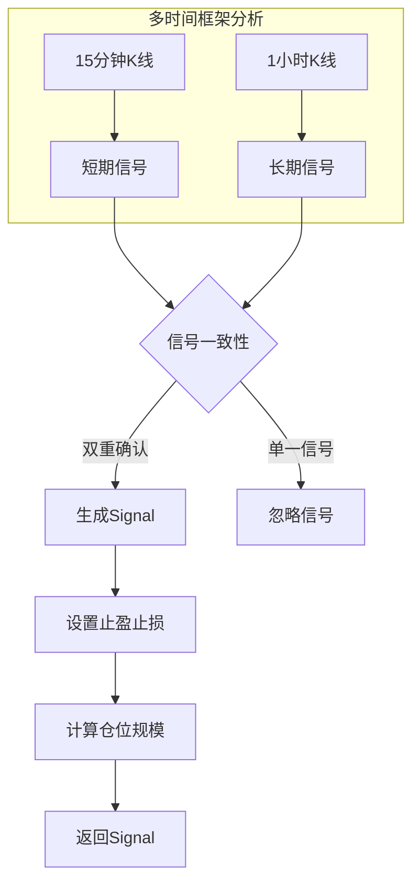
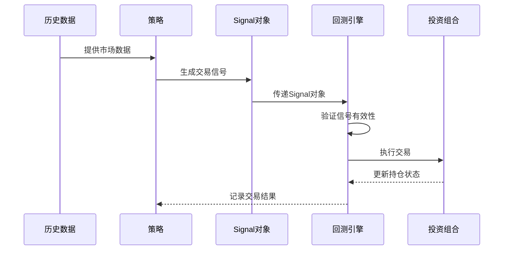
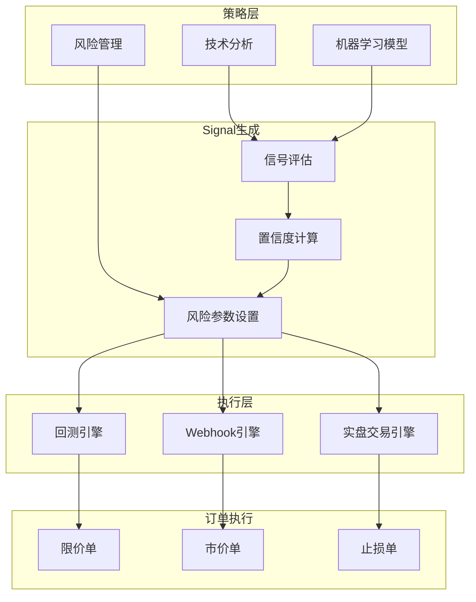
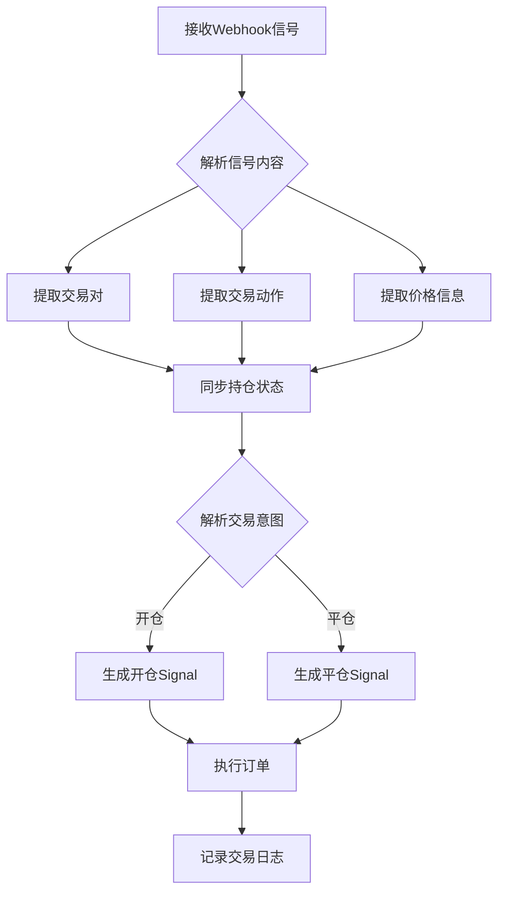

# Signal数据结构

<cite>
**本文档引用的文件**
- [strategy/base.py](file://strategy/base.py)
- [strategy/comprehensive.py](file://strategy/comprehensive.py)
- [strategy/dual_freq_trend.py](file://strategy/dual_freq_trend.py)
- [strategy/ai_adaptive.py](file://strategy/ai_adaptive.py)
- [strategy/mean_reversion.py](file://strategy/mean_reversion.py)
- [engine/backtest.py](file://engine/backtest.py)
- [engine/webhook_trading.py](file://engine/webhook_trading.py)
- [engine/live_trading.py](file://engine/live_trading.py)
- [core/api_client.py](file://core/api_client.py)
- [config/settings.py](file://config/settings.py)
</cite>

## 目录
1. [简介](#简介)
2. [项目结构概览](#项目结构概览)
3. [Signal数据结构详解](#signal数据结构详解)
4. [交易动作与订单类型](#交易动作与订单类型)
5. [信号置信度与平仓原因](#信号置信度与平仓原因)
6. [策略集成与使用示例](#策略集成与使用示例)
7. [架构设计与数据流](#架构设计与数据流)
8. [性能考虑与最佳实践](#性能考虑与最佳实践)
9. [故障排除指南](#故障排除指南)
10. [总结](#总结)

## 简介

Signal数据结构是量化交易系统的核心组件，它封装了完整的交易决策信息，包括交易标的、交易方向、仓位规模、价格参数、风险管理等关键要素。本文档将深入解析Signal数据类的设计理念、字段含义、使用场景以及在整个交易生态系统中的关键作用。

## 项目结构概览

该项目采用模块化架构设计，Signal数据结构作为核心基础组件，被广泛应用于多个策略模块和执行引擎中：

**图表来源**
- [strategy/base.py:31-40](file://strategy/base.py#L31-L40)
- [engine/backtest.py:16-46](file://engine/backtest.py#L16-L46)
- [engine/webhook_trading.py:40-84](file://engine/webhook_trading.py#L40-L84)

## Signal数据结构详解

### 核心字段定义

Signal数据类采用Python数据类装饰器，提供了类型安全和默认值管理：

**图表来源**
- [strategy/base.py:31-40](file://strategy/base.py#L31-L40)
- [strategy/base.py:17-29](file://strategy/base.py#L17-L29)

### 字段详细说明

#### symbol（交易标的）
- **类型**: string
- **含义**: 交易对标识符，如"ETH-USDT-SWAP"
- **用途**: 标识具体的金融工具或合约
- **特点**: 支持多种交易格式，包括现货、期货、永续合约

#### action（交易动作）
- **类型**: string（枚举值：'buy' | 'sell' | 'hold'）
- **含义**: 交易指令方向
- **用途**: 指导执行引擎进行相应的买卖操作

#### quantity（仓位数量）
- **类型**: float
- **含义**: 交易数量或合约张数
- **计算方式**: 由各策略根据资金管理规则计算得出
- **精度**: 通常保留4位小数

#### price（目标价格）
- **类型**: Optional[float]
- **含义**: 期望成交价格
- **特殊值**: None表示使用市价单
- **应用场景**: 限价单执行时指定目标价格

#### stop_loss（止损价格）
- **类型**: Optional[float]
- **含义**: 风险控制价格水平
- **计算**: 通常基于策略参数或技术指标计算
- **作用**: 控制最大损失幅度

#### take_profit（止盈价格）
- **类型**: Optional[float]
- **含义**: 盈利目标价格
- **计算**: 可基于ATR、固定比例或其他技术指标
- **作用**: 锁定利润，避免利润回吐

#### confidence（信号置信度）
- **类型**: float（默认值：1.0）
- **范围**: 0.0 - 1.0
- **含义**: 信号质量评估指标
- **计算**: 基于多因子分析和历史表现

#### reason（平仓原因）
- **类型**: string（默认值：空字符串）
- **含义**: 交易决策的业务说明
- **用途**: 记录交易逻辑和市场条件

**章节来源**
- [strategy/base.py:31-40](file://strategy/base.py#L31-L40)

## 交易动作与订单类型

### 三种交易动作的区别

**图表来源**
- [engine/live_trading.py:1776-1791](file://engine/live_trading.py#L1776-L1791)

### 限价单与市价单使用场景

#### 限价单（LIMIT ORDER）
- **适用场景**:
  - 价格到达预设目标位
  - 需要精确控制成交价格
  - 市场波动较大时锁定利润
- **执行特点**:
  - 可能无法立即成交
  - 成交价格优于或等于指定价格
  - 需要承担流动性风险

#### 市价单（MARKET ORDER）
- **适用场景**:
  - 紧急入场或出场
  - 流动性充足时快速成交
  - 止损单的默认类型
- **执行特点**:
  - 确保立即成交
  - 成交价格可能偏离预期
  - 需要承担滑点成本

**章节来源**
- [engine/live_trading.py:1776-1791](file://engine/live_trading.py#L1776-L1791)
- [core/api_client.py:422-450](file://core/api_client.py#L422-L450)

## 信号置信度与平仓原因

### 信号置信度概念

置信度是Signal数据结构中的重要质量指标，反映了交易信号的可靠性程度：

**图表来源**
- [strategy/mean_reversion.py:86-90](file://strategy/mean_reversion.py#L86-L90)

### 平仓原因分类体系

平仓原因提供了完整的交易生命周期记录：

| 原因类别 | 具体类型 | 描述 | 触发条件 |
|---------|---------|------|----------|
| 技术止盈 | `take_profit` | 达到预设止盈目标 | 价格触及take_profit价格 |
| 技术止损 | `stop_loss` | 达到预设止损限制 | 价格触及stop_loss价格 |
| 策略退出 | `strategy_exit` | 策略主动平仓 | 策略逻辑变化 |
| 时间止损 | `time_based_exit` | 超时未达目标 | 达到最大持仓时间 |
| 市场异常 | `market_volatility` | 市场剧烈波动 | 波动率超过阈值 |
| 风险控制 | `risk_management` | 主动风险管理 | 资金回撤超限 |

**章节来源**
- [strategy/base.py:153-169](file://strategy/base.py#L153-L169)

## 策略集成与使用示例

### 综合策略中的Signal生成

在综合性策略中，Signal的生成遵循严格的多因子评估流程：

**图表来源**
- [strategy/comprehensive.py:894-912](file://strategy/comprehensive.py#L894-L912)

### AI自适应策略的Signal处理

AI策略通过自然语言处理生成交易信号：

**图表来源**
- [strategy/ai_adaptive.py:750-822](file://strategy/ai_adaptive.py#L750-L822)

### 双频趋势策略的Signal生成

双频趋势策略结合不同时间框架生成信号：

**图表来源**
- [strategy/dual_freq_trend.py:894-912](file://strategy/dual_freq_trend.py#L894-L912)

### 回测引擎中的Signal处理

回测引擎对Signal进行验证和执行：

**图表来源**
- [engine/backtest.py:16-46](file://engine/backtest.py#L16-L46)

**章节来源**
- [strategy/comprehensive.py:894-912](file://strategy/comprehensive.py#L894-L912)
- [strategy/ai_adaptive.py:750-822](file://strategy/ai_adaptive.py#L750-L822)
- [strategy/dual_freq_trend.py:894-912](file://strategy/dual_freq_trend.py#L894-L912)
- [engine/backtest.py:16-46](file://engine/backtest.py#L16-L46)

## 架构设计与数据流

### Signal在交易系统中的流转

**图表来源**
- [strategy/base.py:31-40](file://strategy/base.py#L31-L40)
- [engine/webhook_trading.py:224-248](file://engine/webhook_trading.py#L224-L248)

### Webhook信号处理流程

Webhook引擎专门处理来自TradingView的外部信号：

**图表来源**
- [engine/webhook_trading.py:224-248](file://engine/webhook_trading.py#L224-L248)

**章节来源**
- [engine/webhook_trading.py:224-248](file://engine/webhook_trading.py#L224-L248)

## 性能考虑与最佳实践

### Signal数据结构优化

1. **内存效率**
   - 使用数据类装饰器自动优化内存布局
   - 可选字段使用Optional类型减少内存占用
   - 默认值设置合理，避免不必要的初始化

2. **类型安全**
   - 严格的类型注解确保编译时检查
   - Optional类型防止空值异常
   - 枚举类型的action字段保证数据完整性

3. **序列化支持**
   - 支持JSON序列化用于网络传输
   - 兼容各种数据库ORM框架
   - 便于日志记录和调试

### 交易执行优化

1. **批量处理**
   - 支持批量Signal处理提高效率
   - 合并相似的交易指令
   - 减少API调用次数

2. **并发控制**
   - 异步信号处理避免阻塞
   - 信号队列管理防止内存溢出
   - 锁机制确保线程安全

3. **错误处理**
   - 完善的异常捕获和恢复机制
   - 信号验证确保数据质量
   - 重试机制提高成功率

## 故障排除指南

### 常见问题诊断

#### 信号为空的问题
- **症状**: 策略生成的Signal为None
- **可能原因**:
  - 仓位计算结果为0
  - 风险控制参数限制
  - 市场条件不满足
- **解决方案**:
  - 检查资金管理和杠杆设置
  - 验证技术指标计算
  - 调整风险参数

#### 价格参数异常
- **症状**: Signal.price为None但期望限价单
- **可能原因**:
  - AI策略未提供目标价格
  - 市场数据缺失
  - 计算逻辑错误
- **解决方案**:
  - 实现默认价格回退机制
  - 验证数据源完整性
  - 添加边界检查

#### 订单执行失败
- **症状**: Signal无法执行或部分成交
- **可能原因**:
  - 价格偏离过大
  - 流动性不足
  - 账户余额不足
- **解决方案**:
  - 实现滑点控制
  - 添加流动性检查
  - 优化仓位规模

**章节来源**
- [strategy/ai_adaptive.py:797-801](file://strategy/ai_adaptive.py#L797-L801)
- [engine/webhook_trading.py:224-248](file://engine/webhook_trading.py#L224-L248)

## 总结

Signal数据结构作为量化交易系统的核心组件，通过精心设计的字段和严格的类型约束，为整个交易生态提供了坚实的基础。其设计理念体现了现代量化交易对准确性、效率和可靠性的追求。

### 关键优势

1. **完整性**: 包含交易所需的所有关键信息
2. **灵活性**: 支持多种交易场景和执行方式
3. **可扩展性**: 易于添加新的字段和功能
4. **类型安全**: 编译时检查确保数据完整性
5. **性能优化**: 高效的数据结构设计

### 应用价值

- **策略开发**: 为各种交易策略提供统一的信号接口
- **风险控制**: 通过stop_loss和take_profit实现自动化风险管理
- **性能监控**: 通过confidence和reason字段提供透明度
- **系统集成**: 支持多种执行引擎和交易环境

Signal数据结构不仅是一个简单的数据容器，更是连接策略理论与实际执行的桥梁，为构建可靠的量化交易系统奠定了重要基础。