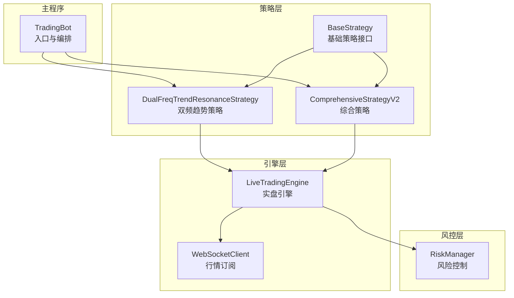
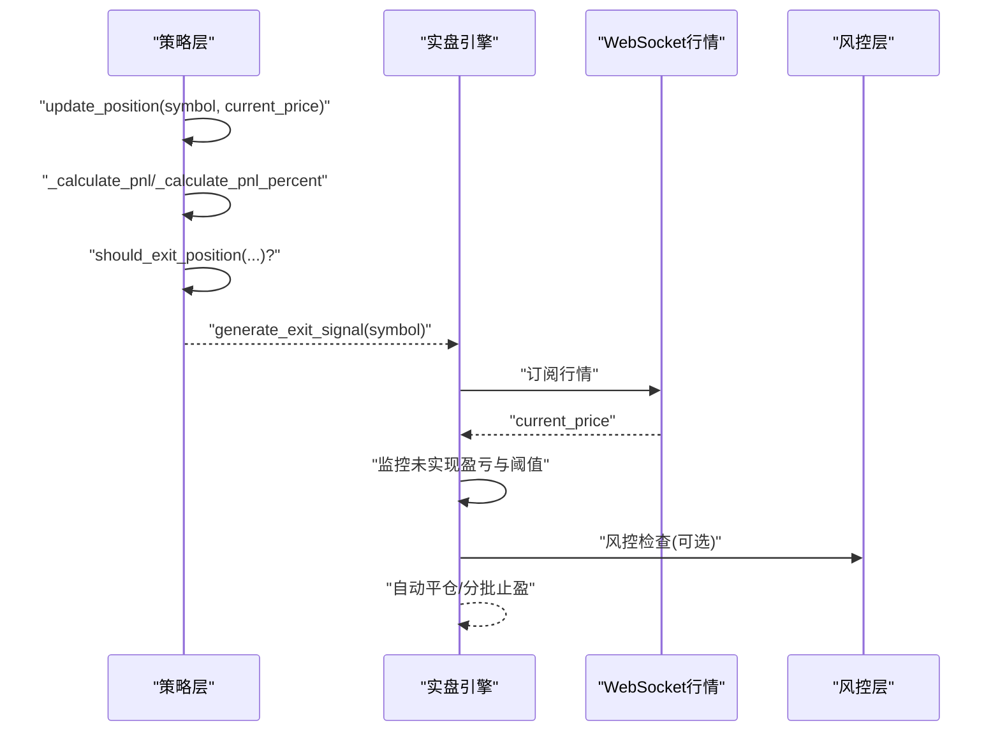
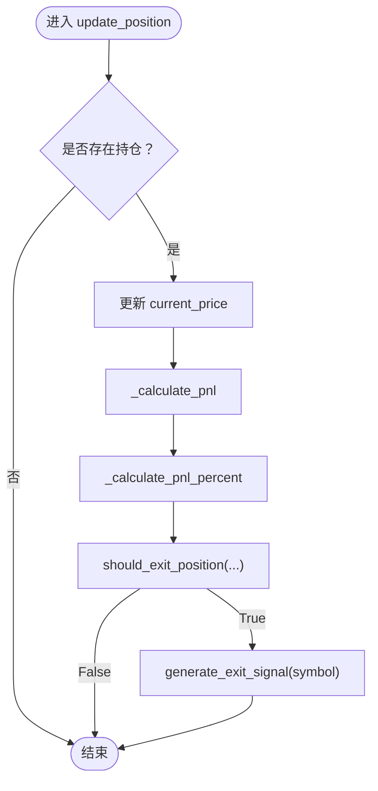
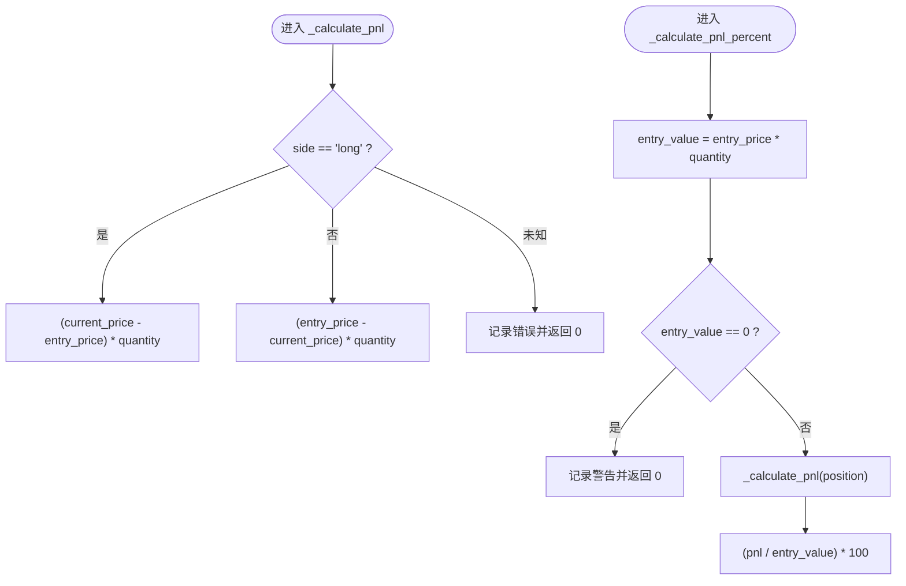
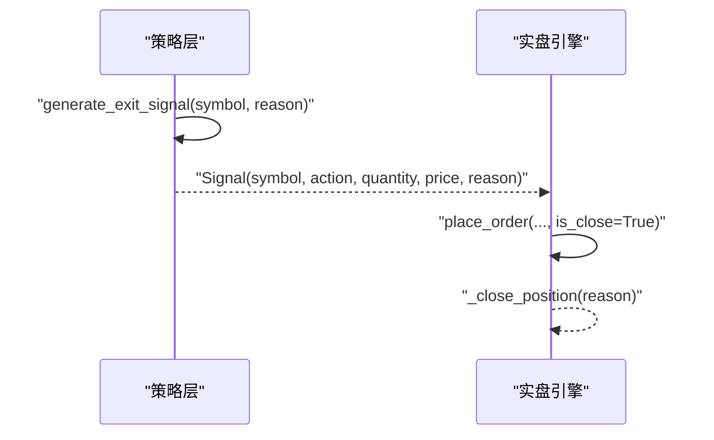
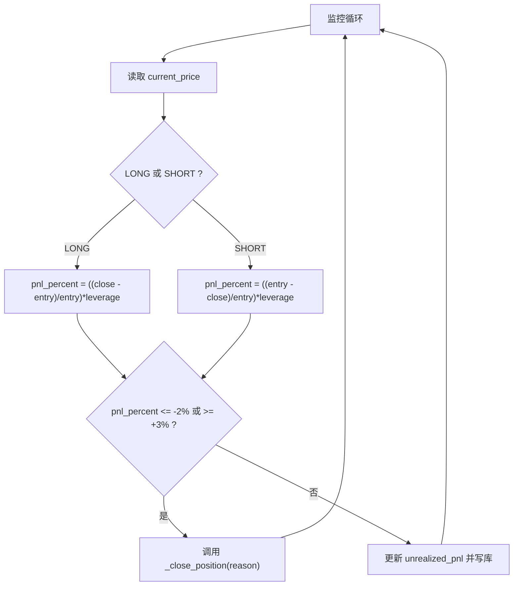
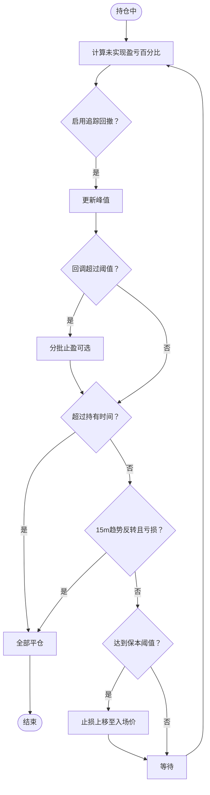
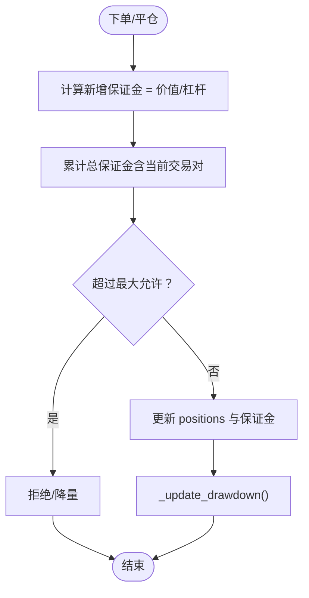
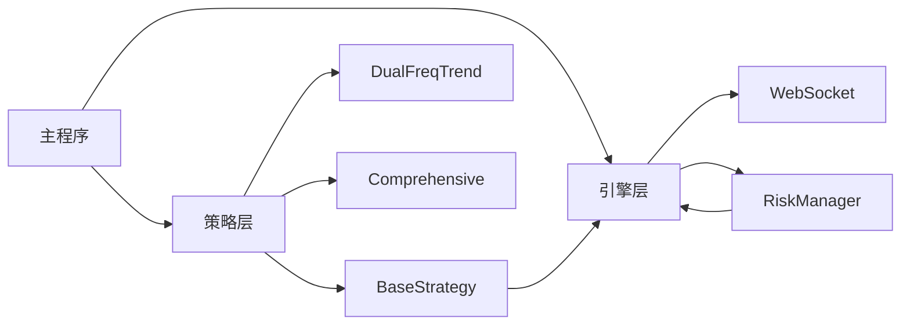
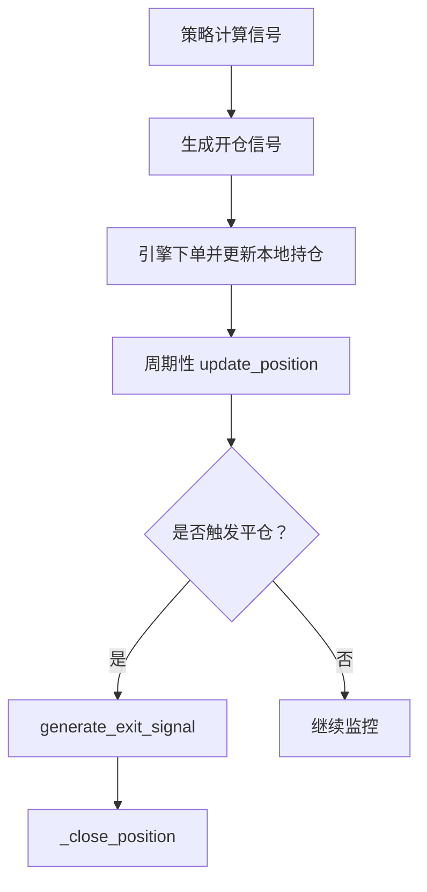

# 仓位管理机制

<cite>
**本文引用的文件**
- [strategy/base.py](file://strategy/base.py)
- [engine/live_trading.py](file://engine/live_trading.py)
- [core/risk_manager.py](file://core/risk_manager.py)
- [strategy/dual_freq_trend.py](file://strategy/dual_freq_trend.py)
- [strategy/comprehensive.py](file://strategy/comprehensive.py)
- [main.py](file://main.py)
</cite>

## 目录
1. [引言](#引言)
2. [项目结构](#项目结构)
3. [核心组件](#核心组件)
4. [架构概览](#架构概览)
5. [详细组件分析](#详细组件分析)
6. [依赖关系分析](#依赖关系分析)
7. [性能考虑](#性能考虑)
8. [故障排查指南](#故障排查指南)
9. [结论](#结论)
10. [附录](#附录)

## 引言
本文围绕量化交易系统的仓位管理机制展开，重点解析以下内容：
- update_position 方法的实现原理：实时价格更新、动态盈亏计算、自动平仓检查
- _calculate_pnl 与 _calculate_pnl_percent 内部方法的多空差异计算逻辑
- generate_exit_signal 方法的平仓信号生成机制：支持全部平仓与分批止盈
- 仓位状态监控、风险控制与自动交易的完整实现示例
- 在策略运行过程中如何有效管理仓位风险

## 项目结构
该系统采用模块化设计，策略层负责信号生成与平仓判断，引擎层负责实时行情、订单执行与仓位监控，风控层负责整体风险限额与回撤控制。

图表来源
- [main.py:116-149](file://main.py#L116-L149)
- [strategy/base.py:41-112](file://strategy/base.py#L41-L112)
- [strategy/dual_freq_trend.py:708-931](file://strategy/dual_freq_trend.py#L708-L931)
- [strategy/comprehensive.py:1038-1084](file://strategy/comprehensive.py#L1038-L1084)
- [engine/live_trading.py:126-2223](file://engine/live_trading.py#L126-L2223)
- [core/risk_manager.py:48-566](file://core/risk_manager.py#L48-L566)

章节来源
- [main.py:116-149](file://main.py#L116-L149)
- [strategy/base.py:41-112](file://strategy/base.py#L41-L112)
- [engine/live_trading.py:126-2223](file://engine/live_trading.py#L126-L2223)
- [core/risk_manager.py:48-566](file://core/risk_manager.py#L48-L566)

## 核心组件
- 基础策略 BaseStrategy：定义 Position、Signal 数据结构，提供 update_position、_calculate_pnl、_calculate_pnl_percent、generate_exit_signal 等通用方法
- 实盘引擎 LiveTradingEngine：负责实时行情订阅、订单执行、仓位监控与自动平仓
- 风控 RiskManager：负责保证金限额、日度风险、回撤与风险事件记录
- 具体策略：DualFreqTrendResonanceStrategy、ComprehensiveStrategyV2 等，实现 should_exit_position 与平仓条件

章节来源
- [strategy/base.py:16-174](file://strategy/base.py#L16-L174)
- [engine/live_trading.py:84-106](file://engine/live_trading.py#L84-L106)
- [core/risk_manager.py:48-300](file://core/risk_manager.py#L48-L300)

## 架构概览
系统通过策略层生成信号，引擎层接收并执行订单，同时持续监控仓位的未实现盈亏与触发条件，风控层贯穿始终进行限额与回撤控制。

图表来源
- [strategy/base.py:114-174](file://strategy/base.py#L114-L174)
- [engine/live_trading.py:1900-2100](file://engine/live_trading.py#L1900-L2100)
- [core/risk_manager.py:132-230](file://core/risk_manager.py#L132-L230)

## 详细组件分析

### update_position 方法详解
- 功能：定期更新持仓的当前价格，计算未实现盈亏，并检查是否需要自动平仓
- 流程：
  1) 若存在对应 symbol 的持仓，更新 current_price
  2) 调用 _calculate_pnl 与 _calculate_pnl_percent 计算未实现盈亏与百分比
  3) 调用 should_exit_position 判断是否触发平仓条件
  4) 若需要平仓，调用 generate_exit_signal 生成平仓信号

图表来源
- [strategy/base.py:114-131](file://strategy/base.py#L114-L131)
- [strategy/base.py:132-152](file://strategy/base.py#L132-L152)

章节来源
- [strategy/base.py:114-152](file://strategy/base.py#L114-L152)

### _calculate_pnl 与 _calculate_pnl_percent 计算逻辑
- _calculate_pnl（未实现盈亏金额）
  - 多头：(current_price - entry_price) × quantity
  - 空头：(entry_price - current_price) × quantity
  - 异常分支：未知方向记录错误并返回 0
- _calculate_pnl_percent（未实现盈亏百分比）
  - 入场价值 = entry_price × quantity
  - 避免除零：入场价值为 0 时记录警告并返回 0
  - 百分比 = (pnl / 入场价值) × 100

图表来源
- [strategy/base.py:132-152](file://strategy/base.py#L132-L152)

章节来源
- [strategy/base.py:132-152](file://strategy/base.py#L132-L152)

### generate_exit_signal 平仓信号生成机制
- 作用：为指定 symbol 生成平仓信号，用于通知引擎执行平仓
- 关键点：
  - 平仓方向：多头开仓则空头平仓，空头开仓则多头平仓
  - 数量：使用当前持仓 quantity（全部平仓）
  - 价格：使用当前价格（市价）
  - 原因：可自定义，默认为 "strategy_exit"

图表来源
- [strategy/base.py:153-174](file://strategy/base.py#L153-L174)
- [engine/live_trading.py:2043-2100](file://engine/live_trading.py#L2043-L2100)

章节来源
- [strategy/base.py:153-174](file://strategy/base.py#L153-L174)
- [engine/live_trading.py:2043-2100](file://engine/live_trading.py#L2043-L2100)

### 自动平仓检查与引擎监控
- 实盘引擎在监控循环中：
  - 计算未实现盈亏与未实现盈亏百分比（含杠杆）
  - 多头：(current_price - entry_price) / entry_price × 杠杆
  - 空头：(entry_price - current_price) / entry_price × 杠杆
  - 触发阈值：止损 ≤ -2%，止盈 ≥ +3%（示例）
  - 触发后调用 _close_position 执行市价平仓，并记录原因

图表来源
- [engine/live_trading.py:1945-2034](file://engine/live_trading.py#L1945-L2034)

章节来源
- [engine/live_trading.py:1945-2034](file://engine/live_trading.py#L1945-L2034)

### 分批止盈与追踪回撤止盈（策略层面）
- 分批止盈：当未实现盈亏达到阈值时，按比例部分平仓，标记 partial_tp_done
- 追踪回撤止盈：记录峰值未实现盈亏，回调超过阈值即触发全部平仓
- 时间止损：持仓超过设定分钟数触发全部平仓
- 保本机制：达到阈值后将止损上移至入场价

图表来源
- [strategy/dual_freq_trend.py:708-778](file://strategy/dual_freq_trend.py#L708-L778)
- [strategy/dual_freq_trend.py:779-931](file://strategy/dual_freq_trend.py#L779-L931)

章节来源
- [strategy/dual_freq_trend.py:708-931](file://strategy/dual_freq_trend.py#L708-L931)

### 风险控制与仓位限额
- 风控检查：
  - 保证金总额不超过账户资金的 MAX_POSITION_SIZE（如 5%）
  - 日度亏损、当前回撤超过阈值触发警告或拒绝
  - 生成止损/止盈价格建议
- 仓位更新：
  - 多头开仓：累加数量与平均成本，保证金 = 价值 / 杠杆
  - 平仓：减少数量，若归零则清空平均成本与保证金

图表来源
- [core/risk_manager.py:132-230](file://core/risk_manager.py#L132-L230)
- [core/risk_manager.py:231-257](file://core/risk_manager.py#L231-L257)

章节来源
- [core/risk_manager.py:132-257](file://core/risk_manager.py#L132-L257)

### 仓位状态监控与数据库持久化
- 实盘引擎在监控循环中：
  - 计算 unrealized_pnl 与 unrealized_pnl_percent（含杠杆）
  - 写入数据库，包含止损/止盈价格与开仓时间
- 休市监控：在非交易时段检测到持仓则自动平仓

章节来源
- [engine/live_trading.py:1913-1943](file://engine/live_trading.py#L1913-L1943)
- [engine/live_trading.py:1977-1991](file://engine/live_trading.py#L1977-L1991)
- [engine/webhook_trading.py:669-683](file://engine/webhook_trading.py#L669-L683)

## 依赖关系分析
- 策略层依赖：
  - BaseStrategy 提供统一的 Position/Signal 数据结构与通用方法
  - 具体策略实现 should_exit_position，结合技术指标与规则触发平仓
- 引擎层依赖：
  - WebSocket 订阅行情，驱动 update_position 与自动监控
  - RiskManager 提供风控检查与仓位更新
- 主程序编排：
  - TradingBot 注册策略与引擎，注入 api_client 与 risk_manager

图表来源
- [main.py:116-149](file://main.py#L116-L149)
- [strategy/base.py:41-112](file://strategy/base.py#L41-L112)
- [engine/live_trading.py:126-2223](file://engine/live_trading.py#L126-L2223)
- [core/risk_manager.py:48-566](file://core/risk_manager.py#L48-L566)

章节来源
- [main.py:116-149](file://main.py#L116-L149)
- [strategy/base.py:41-112](file://strategy/base.py#L41-L112)
- [engine/live_trading.py:126-2223](file://engine/live_trading.py#L126-L2223)
- [core/risk_manager.py:48-566](file://core/risk_manager.py#L48-L566)

## 性能考虑
- 实盘引擎监控频率：每 30 秒检查一次，避免频繁请求导致限流
- 未实现盈亏计算：在锁外进行，减少锁竞争
- 分批止盈与追踪回撤：在 bar close 触发，降低滑点影响
- 风控检查：在下单前进行，避免无效订单

## 故障排查指南
- 仓位未更新：
  - 确认 update_position 是否被周期性调用
  - 检查 should_exit_position 返回值与 generate_exit_signal 是否被正确调用
- 平仓未触发：
  - 检查引擎监控循环中的阈值与 p/l 计算逻辑
  - 确认 _close_position 是否被调用且 is_close=True
- 风控拒绝：
  - 查看 RiskCheckResult 的 violations/warnings
  - 检查账户资金与总保证金是否超限
- 休市未平仓：
  - 检查休市监控任务是否运行
  - 确认交易所实际持仓与本地记录一致性

章节来源
- [engine/live_trading.py:1945-2034](file://engine/live_trading.py#L1945-L2034)
- [core/risk_manager.py:132-230](file://core/risk_manager.py#L132-L230)
- [engine/webhook_trading.py:669-683](file://engine/webhook_trading.py#L669-L683)

## 结论
该仓位管理机制通过策略层的通用方法与具体策略的平仓规则、引擎层的实时监控与自动平仓、风控层的限额与回撤控制，形成了完整的闭环。update_position 作为核心入口，实现了实时价格更新、动态盈亏计算与自动平仓检查；generate_exit_signal 支持全部平仓与分批止盈；引擎监控与风控检查共同保障了策略运行过程中的风险可控。

## 附录
- 策略运行流程示例（概念图）

[此图为概念性流程示意，无需图表来源]