# 性能指标计算

<cite>
**本文档引用的文件**
- [base.py](file://backpack_quant_trading/strategy/base.py)
- [backtest.py](file://backpack_quant_trading/engine/backtest.py)
- [comprehensive.py](file://backpack_quant_trading/strategy/comprehensive.py)
- [dual_freq_trend.py](file://backpack_quant_trading/strategy/dual_freq_trend.py)
- [mean_reversion.py](file://backpack_quant_trading/strategy/mean_reversion.py)
- [ai_adaptive.py](file://backpack_quant_trading/strategy/ai_adaptive.py)
</cite>

## 目录
1. [引言](#引言)
2. [项目结构](#项目结构)
3. [核心组件](#核心组件)
4. [架构概览](#架构概览)
5. [详细组件分析](#详细组件分析)
6. [依赖分析](#依赖分析)
7. [性能考虑](#性能考虑)
8. [故障排除指南](#故障排除指南)
9. [结论](#结论)

## 引言

本文档深入解析量化交易系统中的性能指标计算机制，重点分析 `get_performance_report` 方法的实现原理和各性能指标的业务含义。通过对策略基类、回测引擎和具体策略实现的全面分析，帮助开发者和交易员更好地理解和运用这些关键指标进行策略优化和风险管理。

## 项目结构

量化交易系统采用模块化架构设计，主要包含以下核心模块：

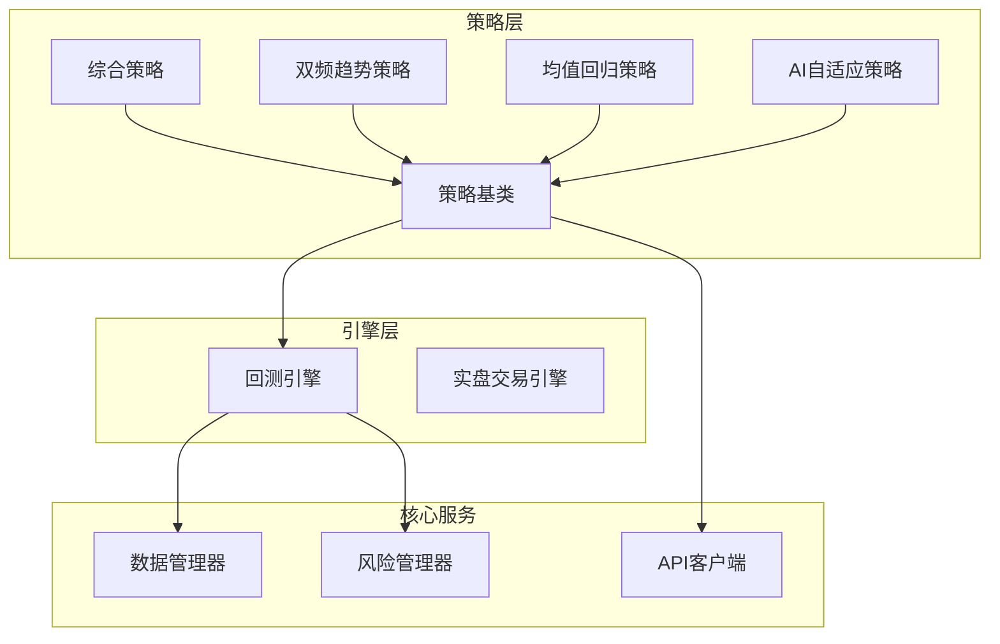

**图表来源**
- [base.py:41-75](file://backpack_quant_trading/strategy/base.py#L41-L75)
- [backtest.py:48-65](file://backpack_quant_trading/engine/backtest.py#L48-L65)

**章节来源**
- [base.py:1-212](file://backpack_quant_trading/strategy/base.py#L1-L212)
- [backtest.py:1-404](file://backpack_quant_trading/engine/backtest.py#L1-L404)

## 核心组件

### 策略基类架构

策略基类采用抽象基类设计模式，为所有具体策略提供统一的接口规范：

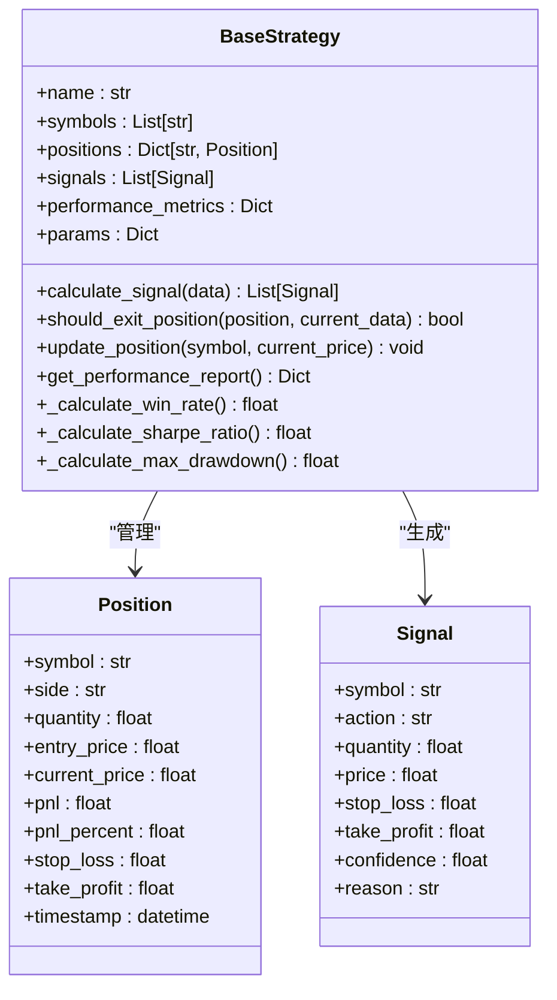

**图表来源**
- [base.py:16-41](file://backpack_quant_trading/strategy/base.py#L16-L41)
- [base.py:41-112](file://backpack_quant_trading/strategy/base.py#L41-L112)

### 性能指标计算框架

性能指标计算采用模板方法设计模式，基类提供统一接口，具体策略实现特定算法：

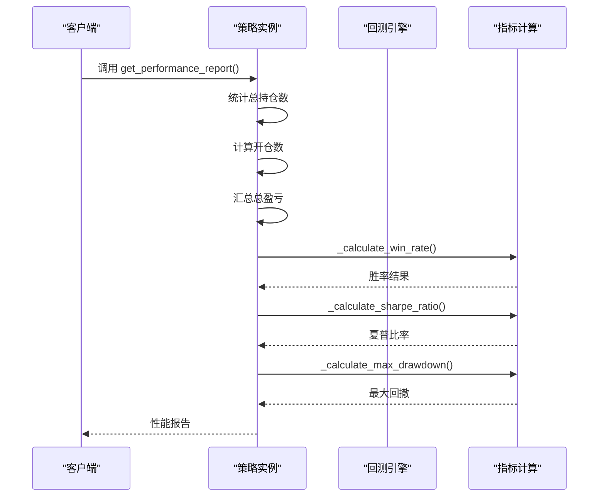

**图表来源**
- [base.py:175-207](file://backpack_quant_trading/strategy/base.py#L175-L207)

**章节来源**
- [base.py:16-212](file://backpack_quant_trading/strategy/base.py#L16-L212)

## 架构概览

### 性能报告生成流程

性能报告生成是一个多层次的数据处理过程，涉及多个组件的协同工作：

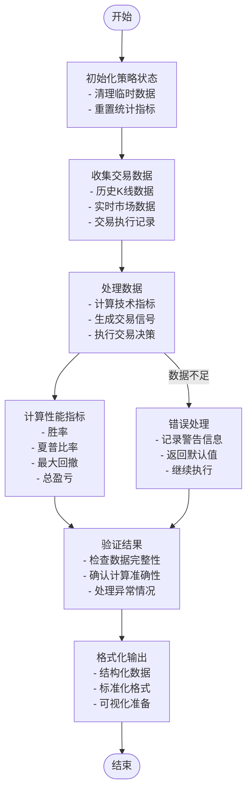

**图表来源**
- [backtest.py:65-187](file://backpack_quant_trading/engine/backtest.py#L65-L187)
- [base.py:175-207](file://backpack_quant_trading/strategy/base.py#L175-L207)

### 指标计算复杂度分析

各性能指标的计算复杂度和时间复杂度如下：

| 指标类型 | 计算复杂度 | 空间复杂度 | 数据依赖 |
|---------|-----------|-----------|----------|
| 胜率 | O(n) | O(1) | 交易记录 |
| 夏普比率 | O(n) | O(1) | 收益序列 |
| 最大回撤 | O(n) | O(n) | 净值曲线 |
| 总盈亏 | O(n) | O(1) | 持仓信息 |

其中 n 为交易次数或时间序列长度。

**章节来源**
- [backtest.py:333-383](file://backpack_quant_trading/engine/backtest.py#L333-L383)
- [base.py:175-207](file://backpack_quant_trading/strategy/base.py#L175-L207)

## 详细组件分析

### 胜率计算实现

胜率是衡量策略盈利能力的重要指标，表示盈利交易占总交易次数的比例。

#### 计算方法

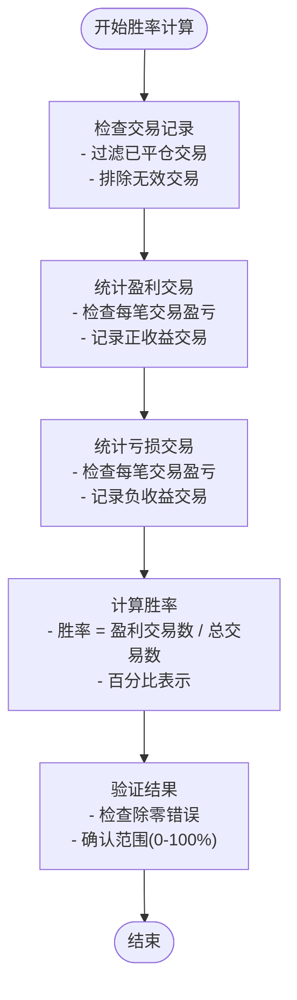

**图表来源**
- [backtest.py:359-364](file://backpack_quant_trading/engine/backtest.py#L359-L364)

#### 业务意义

- **策略质量评估**：高胜率通常表明策略具有较好的预测能力
- **风险管理**：结合盈亏比评估策略的整体风险收益特征
- **参数优化**：通过胜率变化监控策略参数调整效果

**章节来源**
- [backtest.py:359-364](file://backpack_quant_trading/engine/backtest.py#L359-L364)

### 夏普比率计算实现

夏普比率衡量单位风险所获得的风险溢价，是风险调整后收益的重要指标。

#### 计算公式

夏普比率 = (策略收益率 - 无风险利率) / 策略收益率标准差

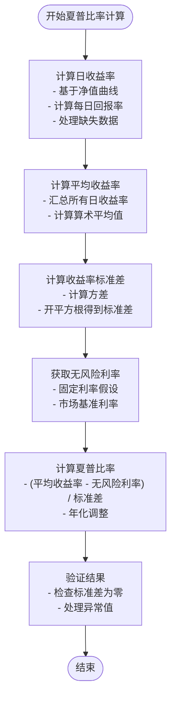

**图表来源**
- [backtest.py:347-351](file://backpack_quant_trading/engine/backtest.py#L347-L351)

#### 业务意义

- **风险调整收益**：评估策略在承担单位风险下的收益水平
- **策略比较**：跨策略风险调整收益对比
- **投资决策**：指导资金配置和组合优化

**章节来源**
- [backtest.py:347-351](file://backpack_quant_trading/engine/backtest.py#L347-L351)

### 最大回撤计算实现

最大回撤是衡量策略最大潜在损失的重要指标，反映策略的下行风险。

#### 计算方法

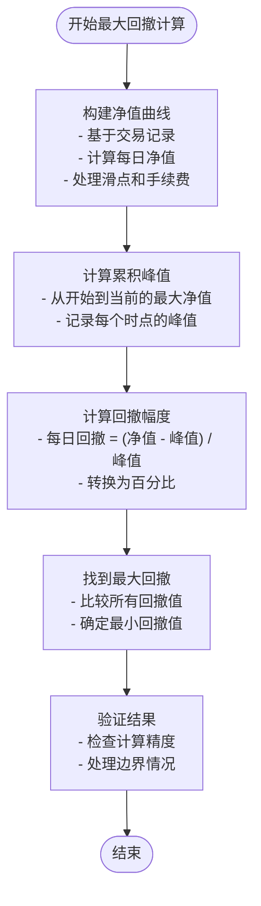

**图表来源**
- [backtest.py:353-357](file://backpack_quant_trading/engine/backtest.py#L353-L357)

#### 业务意义

- **风险控制**：评估策略的最大潜在损失
- **资金管理**：确定合理的仓位规模和止损点
- **策略筛选**：排除高风险策略，选择稳健策略

**章节来源**
- [backtest.py:353-357](file://backpack_quant_trading/engine/backtest.py#L353-L357)

### 净值曲线维护机制

净值曲线是性能分析的核心数据结构，需要精确维护以确保指标计算的准确性。

#### 数据结构设计

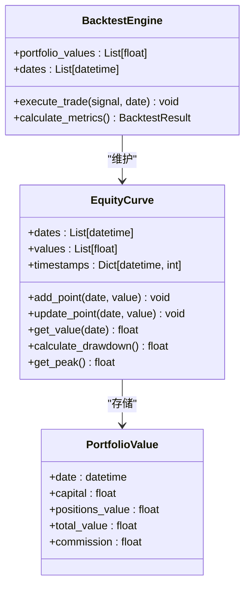

**图表来源**
- [backtest.py:54-64](file://backpack_quant_trading/engine/backtest.py#L54-L64)
- [backtest.py:181-183](file://backpack_quant_trading/engine/backtest.py#L181-L183)

#### 维护策略

1. **实时更新**：每次交易执行后立即更新净值
2. **数据完整性**：确保时间序列的连续性和完整性
3. **精度控制**：使用高精度数值计算避免累积误差
4. **内存管理**：定期清理历史数据释放内存空间

**章节来源**
- [backtest.py:54-64](file://backpack_quant_trading/engine/backtest.py#L54-L64)
- [backtest.py:181-183](file://backpack_quant_trading/engine/backtest.py#L181-L183)

### 策略性能报告生成

#### 报告结构设计

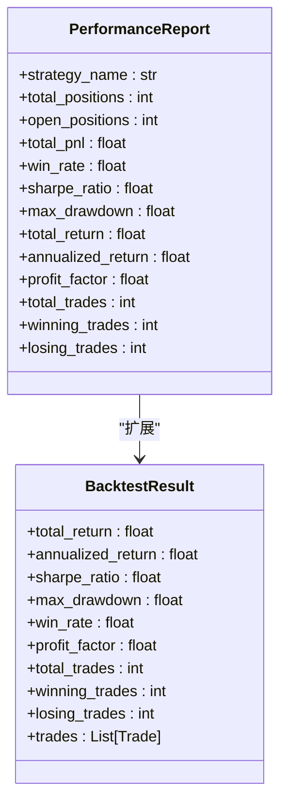

**图表来源**
- [backtest.py:16-30](file://backpack_quant_trading/engine/backtest.py#L16-L30)
- [base.py:175-185](file://backpack_quant_trading/strategy/base.py#L175-L185)

#### 报告生成流程

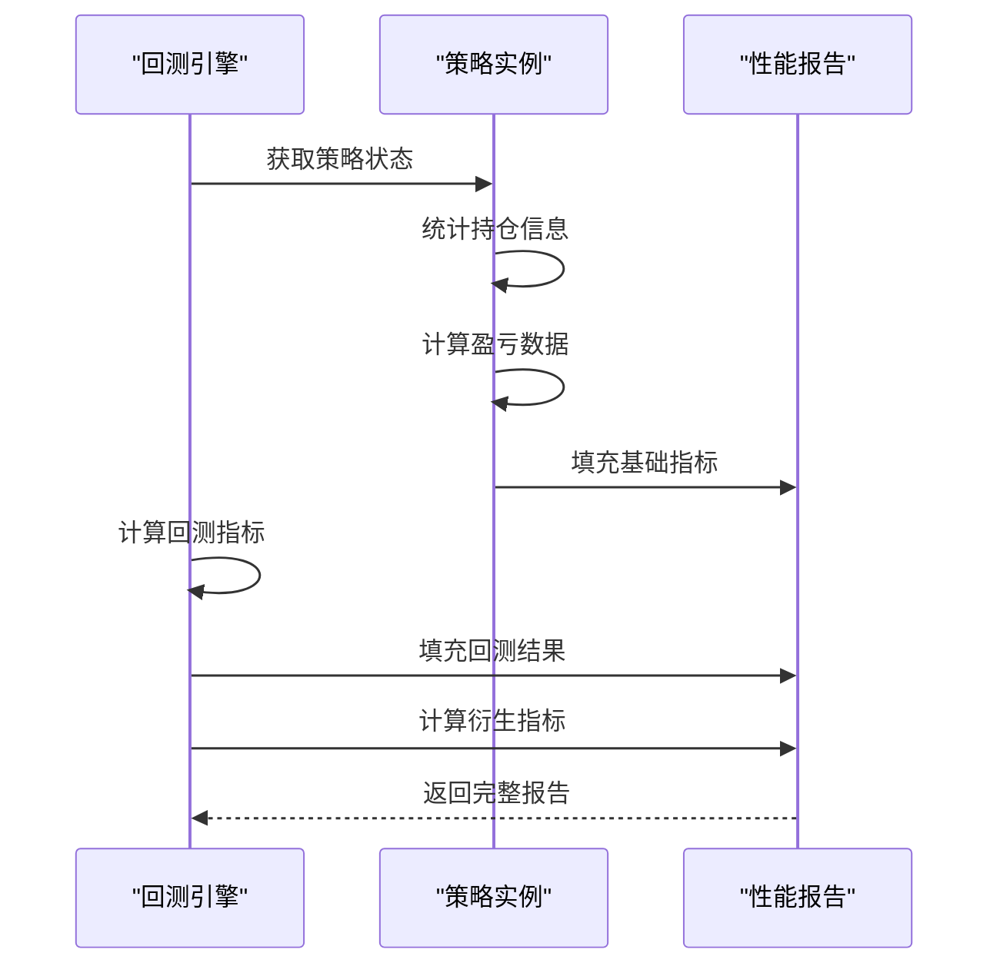

**图表来源**
- [backtest.py:185-187](file://backpack_quant_trading/engine/backtest.py#L185-L187)
- [base.py:175-185](file://backpack_quant_trading/strategy/base.py#L175-L185)

**章节来源**
- [backtest.py:16-404](file://backpack_quant_trading/engine/backtest.py#L16-L404)
- [base.py:175-207](file://backpack_quant_trading/strategy/base.py#L175-L207)

## 依赖分析

### 组件耦合关系

策略性能指标计算涉及多个组件的紧密协作：

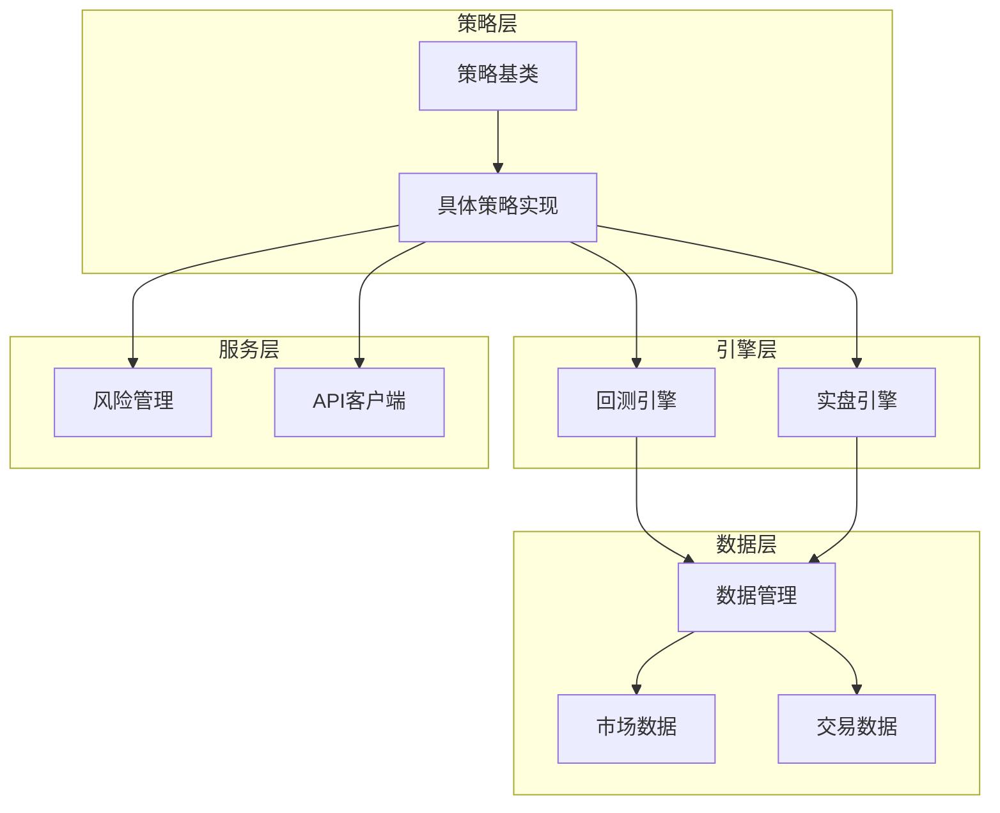

**图表来源**
- [base.py:9-13](file://backpack_quant_trading/strategy/base.py#L9-L13)
- [backtest.py:8-13](file://backpack_quant_trading/engine/backtest.py#L8-L13)

### 关键依赖关系

1. **策略基类依赖**：所有策略实现依赖于基类提供的统一接口
2. **回测引擎依赖**：性能指标计算依赖于回测引擎提供的数据
3. **风险管理依赖**：风险控制参数影响指标计算结果
4. **API客户端依赖**：实时数据获取影响指标的时效性

**章节来源**
- [base.py:9-13](file://backpack_quant_trading/strategy/base.py#L9-L13)
- [backtest.py:8-13](file://backpack_quant_trading/engine/backtest.py#L8-L13)

## 性能考虑

### 计算效率优化

针对大规模数据集的性能优化策略：

1. **向量化计算**：使用NumPy和Pandas进行批量数据处理
2. **内存管理**：及时释放不需要的数据引用
3. **缓存机制**：缓存中间计算结果避免重复计算
4. **并行处理**：利用多核CPU进行并行计算

### 内存使用优化

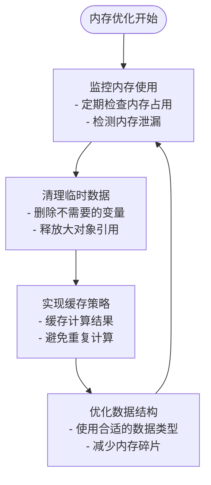

### 扩展性设计

- **插件化架构**：支持新增性能指标计算方法
- **配置驱动**：通过配置文件调整计算参数
- **接口标准化**：统一不同策略的指标计算接口

## 故障排除指南

### 常见问题及解决方案

#### 指标计算异常

**问题现象**：某些指标显示为NaN或异常值

**可能原因**：
1. 数据缺失或格式错误
2. 计算过程中出现除零错误
3. 数据类型不匹配

**解决方法**：
1. 检查数据完整性，填充缺失值
2. 添加异常处理机制
3. 确保数据类型一致性

#### 性能指标不准确

**问题现象**：计算结果与预期不符

**排查步骤**：
1. 验证数据源的准确性
2. 检查计算逻辑的正确性
3. 确认时间范围和频率设置

**章节来源**
- [backtest.py:333-383](file://backpack_quant_trading/engine/backtest.py#L333-L383)

### 调试技巧

1. **单元测试**：为每个指标编写独立的测试用例
2. **日志记录**：详细记录计算过程和中间结果
3. **可视化分析**：绘制指标变化趋势图
4. **边界测试**：测试极端情况下的计算结果

## 结论

量化交易系统的性能指标计算是一个复杂而精密的过程，涉及多个层面的技术实现和业务逻辑。通过深入理解 `get_performance_report` 方法的工作原理，以及各性能指标的计算方法和业务含义，开发者可以更好地：

1. **优化策略设计**：基于准确的性能指标进行策略参数调整
2. **风险管理**：合理控制风险暴露，避免过度回撤
3. **性能监控**：实时监控策略表现，及时发现异常情况
4. **策略比较**：客观评估不同策略的优劣，做出科学的投资决策

本文档提供了完整的理论分析和实践指导，希望能够帮助读者在量化交易领域取得更好的成绩。通过持续的学习和实践，相信每位开发者都能构建出更加优秀的量化交易系统。