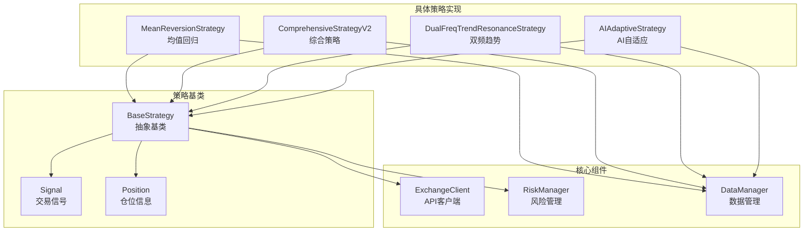
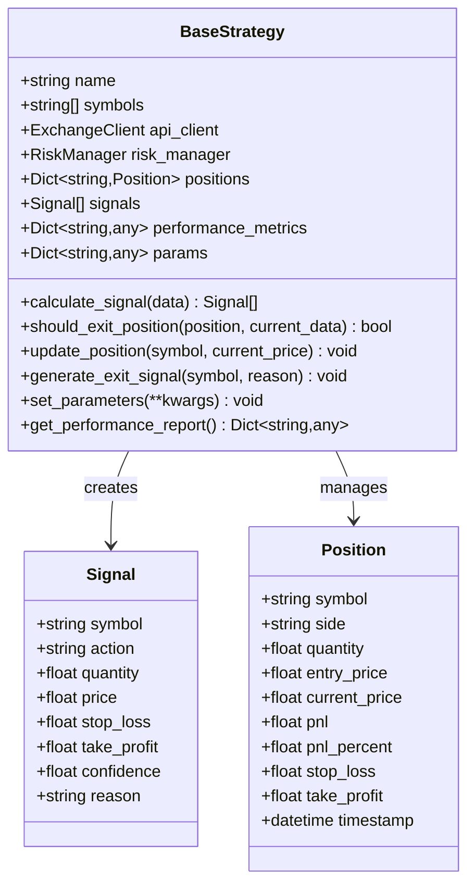
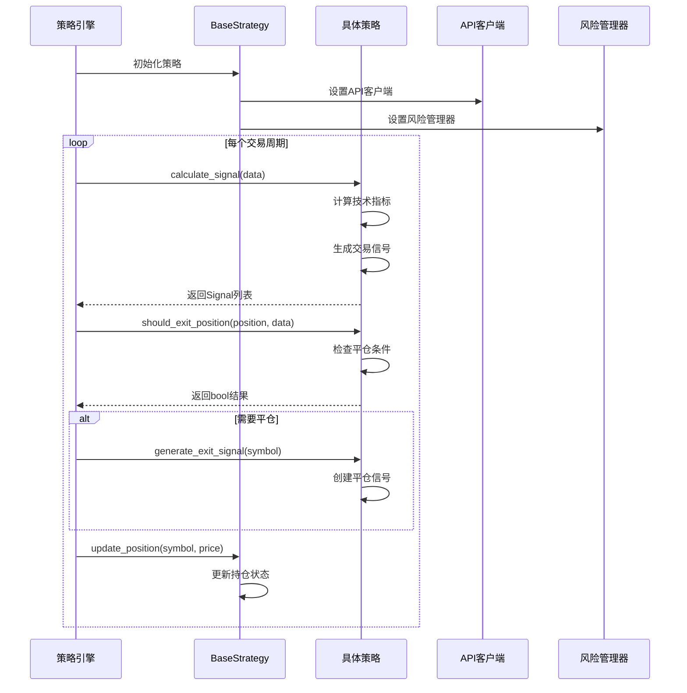
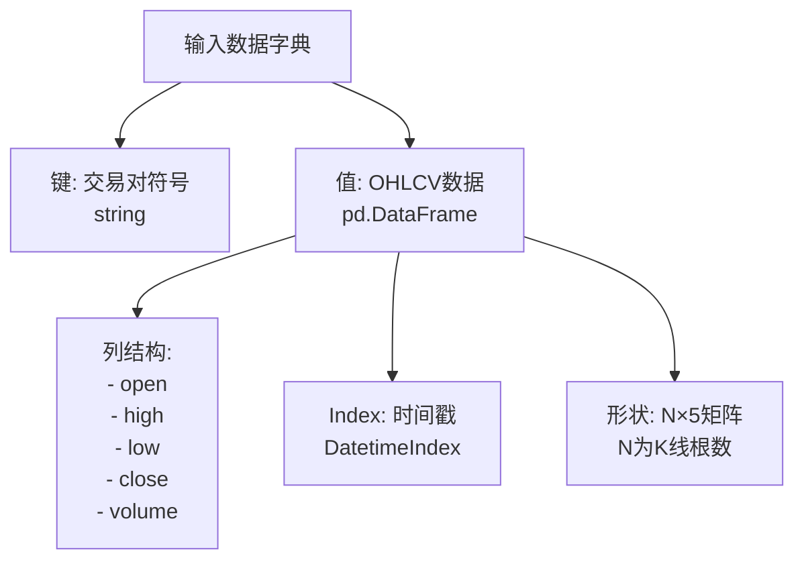
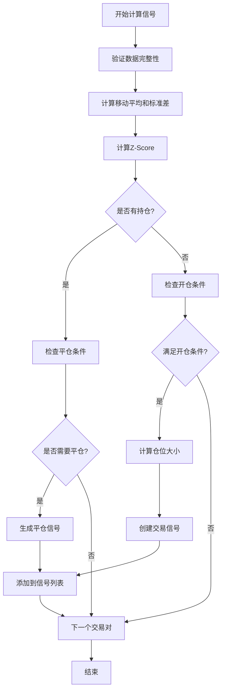
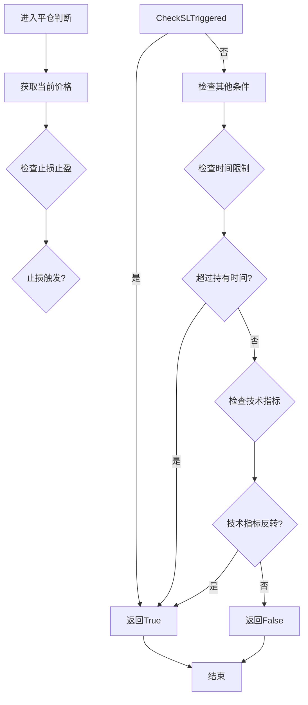
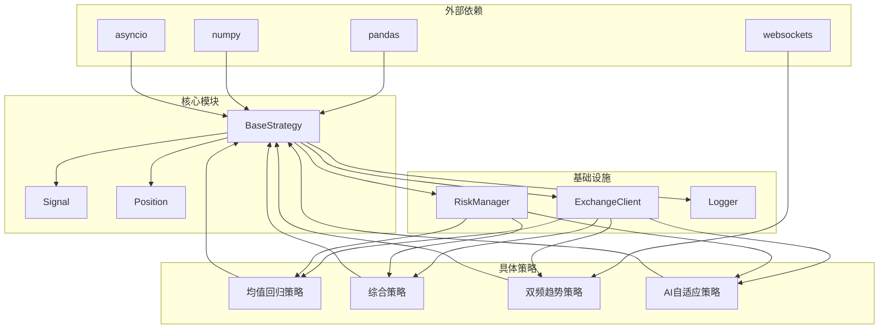

# 抽象方法实现

<cite>
**本文档引用的文件**
- [base.py](file://backpack_quant_trading/strategy/base.py)
- [mean_reversion.py](file://backpack_quant_trading/strategy/mean_reversion.py)
- [comprehensive.py](file://backpack_quant_trading/strategy/comprehensive.py)
- [dual_freq_trend.py](file://backpack_quant_trading/strategy/dual_freq_trend.py)
- [ai_adaptive.py](file://backpack_quant_trading/strategy/ai_adaptive.py)
</cite>

## 目录
1. [引言](#引言)
2. [项目结构](#项目结构)
3. [核心组件](#核心组件)
4. [架构概览](#架构概览)
5. [详细组件分析](#详细组件分析)
6. [依赖分析](#依赖分析)
7. [性能考虑](#性能考虑)
8. [故障排除指南](#故障排除指南)
9. [结论](#结论)

## 引言

本文档专注于BaseStrategy抽象方法的详细实现指南，深入解析calculate_signal和should_exit_position两个核心抽象方法的设计要求和实现规范。我们将详细说明calculate_signal方法的输入参数data格式（交易对数据字典）、返回值Signal列表的构建规则，以及不同策略类型的实现差异。同时解释should_exit_position方法的平仓判断逻辑，包括技术指标触发、价格突破、时间限制等条件。

## 项目结构

该项目采用模块化架构，核心策略基类位于strategy/base.py，具体策略实现分布在不同的策略文件中：

**图表来源**
- [base.py:41-112](file://backpack_quant_trading/strategy/base.py#L41-L112)
- [mean_reversion.py:23-117](file://backpack_quant_trading/strategy/mean_reversion.py#L23-L117)
- [comprehensive.py:17-1036](file://backpack_quant_trading/strategy/comprehensive.py#L17-L1036)
- [dual_freq_trend.py:18-931](file://backpack_quant_trading/strategy/dual_freq_trend.py#L18-L931)
- [ai_adaptive.py:12-881](file://backpack_quant_trading/strategy/ai_adaptive.py#L12-L881)

**章节来源**
- [base.py:1-212](file://backpack_quant_trading/strategy/base.py#L1-L212)

## 核心组件

### BaseStrategy抽象基类

BaseStrategy是所有具体交易策略的抽象基类，定义了策略的核心接口和通用功能：

**图表来源**
- [base.py:31-112](file://backpack_quant_trading/strategy/base.py#L31-L112)

### Signal数据结构

Signal类定义了交易信号的完整信息：

| 字段名 | 类型 | 描述 | 默认值 |
|--------|------|------|--------|
| symbol | string | 交易对符号 | - |
| action | string | 交易动作 buy/sell/hold | - |
| quantity | float | 交易数量 | - |
| price | float | 目标价格，None使用市价单 | None |
| stop_loss | float | 止损价格 | None |
| take_profit | float | 止盈价格 | None |
| confidence | float | 信号置信度 | 1.0 |
| reason | string | 信号产生原因 | "" |

### Position数据结构

Position类跟踪每个交易对的持仓状态：

| 字段名 | 类型 | 描述 | 默认值 |
|--------|------|------|--------|
| symbol | string | 交易对符号 | - |
| side | string | 持仓方向 long/short | - |
| quantity | float | 持仓数量 | - |
| entry_price | float | 入场价格 | - |
| current_price | float | 当前市场价格 | - |
| pnl | float | 盈亏金额 | 0.0 |
| pnl_percent | float | 盈亏百分比 | 0.0 |
| stop_loss | float | 止损价格 | None |
| take_profit | float | 止盈价格 | None |
| timestamp | datetime | 创建时间戳 | 当前时间 |

**章节来源**
- [base.py:16-112](file://backpack_quant_trading/strategy/base.py#L16-L112)

## 架构概览

策略系统的整体架构采用模板方法设计模式，基类定义抽象接口，具体策略实现各自独特的交易逻辑：

**图表来源**
- [base.py:71-131](file://backpack_quant_trading/strategy/base.py#L71-L131)
- [mean_reversion.py:31-117](file://backpack_quant_trading/strategy/mean_reversion.py#L31-L117)
- [comprehensive.py:956-1036](file://backpack_quant_trading/strategy/comprehensive.py#L956-L1036)

## 详细组件分析

### calculate_signal方法实现规范

#### 输入参数格式要求

calculate_signal方法接收一个字典格式的市场数据，具有以下结构：

**图表来源**
- [base.py:77-84](file://backpack_quant_trading/strategy/base.py#L77-L84)

#### 返回值Signal列表构建规则

每个具体策略需要返回一个Signal对象列表，每个Signal对象包含完整的交易信息：

**章节来源**
- [base.py:71-91](file://backpack_quant_trading/strategy/base.py#L71-L91)

#### 均值回归策略实现

均值回归策略展示了典型的calculate_signal实现模式：

**图表来源**
- [mean_reversion.py:31-117](file://backpack_quant_trading/strategy/mean_reversion.py#L31-L117)

**章节来源**
- [mean_reversion.py:31-117](file://backpack_quant_trading/strategy/mean_reversion.py#L31-L117)

#### 综合策略实现

综合策略展示了复杂的技术指标组合和评分系统：

**章节来源**
- [comprehensive.py:956-1036](file://backpack_quant_trading/strategy/comprehensive.py#L956-L1036)

#### 双频趋势策略实现

双频趋势策略实现了多时间框架的共振机制：

**章节来源**
- [dual_freq_trend.py:636-918](file://backpack_quant_trading/strategy/dual_freq_trend.py#L636-L918)

#### AI自适应策略实现

AI自适应策略展示了机器学习驱动的信号生成机制：

**章节来源**
- [ai_adaptive.py:266-670](file://backpack_quant_trading/strategy/ai_adaptive.py#L266-L670)

### should_exit_position方法实现规范

#### 平仓判断逻辑

should_exit_position方法负责判断当前持仓是否需要平仓，返回布尔值：

**图表来源**
- [base.py:93-112](file://backpack_quant_trading/strategy/base.py#L93-L112)

#### 具体策略实现差异

**均值回归策略的平仓逻辑**：
- 止损止盈检查
- Z-Score回归均值检查
- 接近均值时平仓

**综合策略的平仓逻辑**：
- 固定止盈止损
- 技术指标止盈（RSI、布林带）
- 趋势反转检查
- 时间止损

**双频趋势策略的平仓逻辑**：
- 15分钟趋势反转
- 时间止损
- 追踪止损
- 分批止盈

**AI自适应策略的平仓逻辑**：
- 基础止损检查
- AI逻辑平仓（在下一次分析中判断）

**章节来源**
- [mean_reversion.py:119-149](file://backpack_quant_trading/strategy/mean_reversion.py#L119-L149)
- [comprehensive.py:874-954](file://backpack_quant_trading/strategy/comprehensive.py#L874-L954)
- [dual_freq_trend.py:561-634](file://backpack_quant_trading/strategy/dual_freq_trend.py#L561-L634)
- [ai_adaptive.py:867-881](file://backpack_quant_trading/strategy/ai_adaptive.py#L867-L881)

## 依赖分析

策略系统的关键依赖关系如下：

**图表来源**
- [base.py:1-13](file://backpack_quant_trading/strategy/base.py#L1-L13)
- [mean_reversion.py:1-10](file://backpack_quant_trading/strategy/mean_reversion.py#L1-L10)
- [comprehensive.py:1-15](file://backpack_quant_trading/strategy/comprehensive.py#L1-L15)
- [dual_freq_trend.py:1-16](file://backpack_quant_trading/strategy/dual_freq_trend.py#L1-L16)
- [ai_adaptive.py:1-9](file://backpack_quant_trading/strategy/ai_adaptive.py#L1-L9)

**章节来源**
- [base.py:1-212](file://backpack_quant_trading/strategy/base.py#L1-L212)

## 性能考虑

### 计算效率优化

1. **数据预处理优化**：使用pandas向量化操作替代循环
2. **内存管理**：及时清理不需要的数据引用
3. **异步处理**：利用asyncio提升I/O密集型操作性能
4. **缓存机制**：缓存常用计算结果

### 内存使用优化

1. **数据切片**：只保留必要的历史数据
2. **对象池**：重用Signal和Position对象
3. **延迟计算**：按需计算技术指标

## 故障排除指南

### 常见问题及解决方案

**问题1：calculate_signal返回空列表**
- 检查输入数据格式是否正确
- 验证技术指标计算是否产生有效值
- 确认策略参数设置是否合理

**问题2：should_exit_position判断错误**
- 检查止损止盈价格设置
- 验证技术指标阈值配置
- 确认时间戳同步问题

**问题3：信号生成异常**
- 检查API客户端连接状态
- 验证风险管理器配置
- 确认仓位计算逻辑

**章节来源**
- [base.py:114-174](file://backpack_quant_trading/strategy/base.py#L114-L174)

## 结论

BaseStrategy抽象方法为量化交易策略提供了标准化的实现框架。通过规范化的calculate_signal和should_exit_position方法，策略开发者可以专注于具体的交易逻辑实现，而不必担心底层基础设施的复杂性。

关键要点总结：

1. **标准化接口**：统一的抽象方法定义确保了策略的一致性和可扩展性
2. **灵活实现**：不同类型策略可以采用最适合的实现方式
3. **性能优化**：内置的性能监控和优化机制
4. **风险管理**：集成的风险管理功能确保交易安全

通过遵循本文档的实现指南，开发者可以创建高质量、可维护的量化交易策略，并充分利用策略基类提供的各种便利功能。