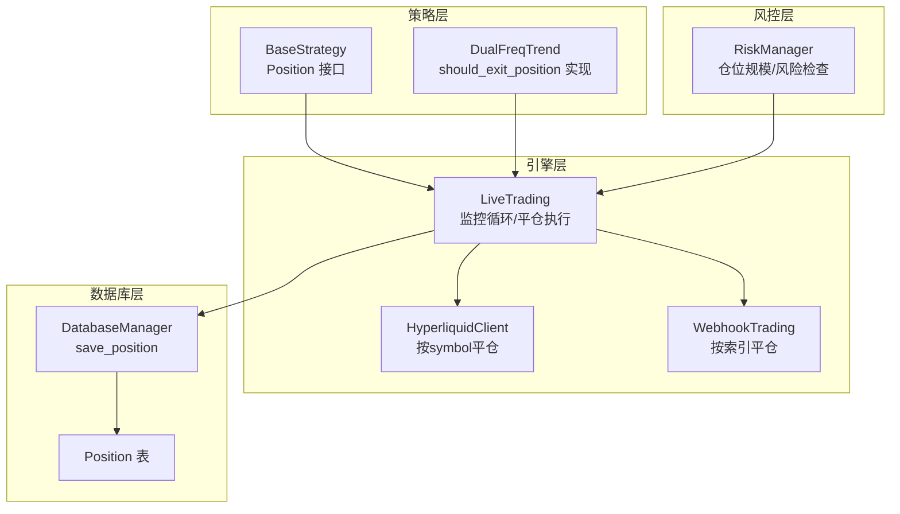
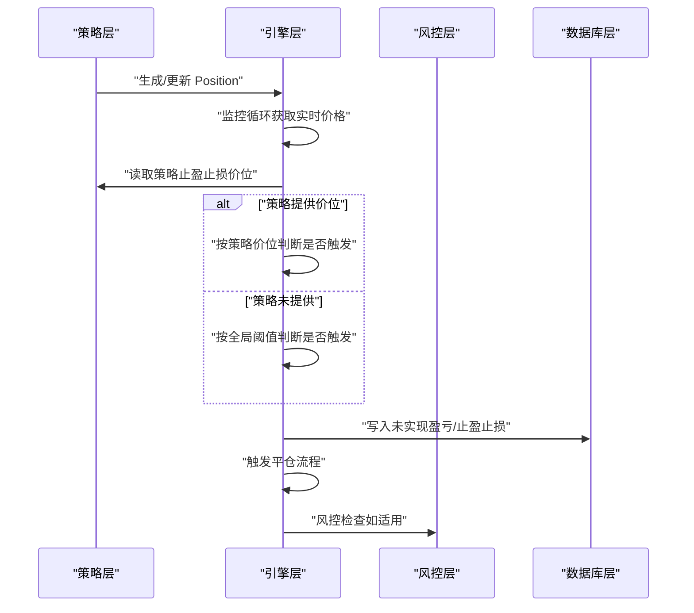
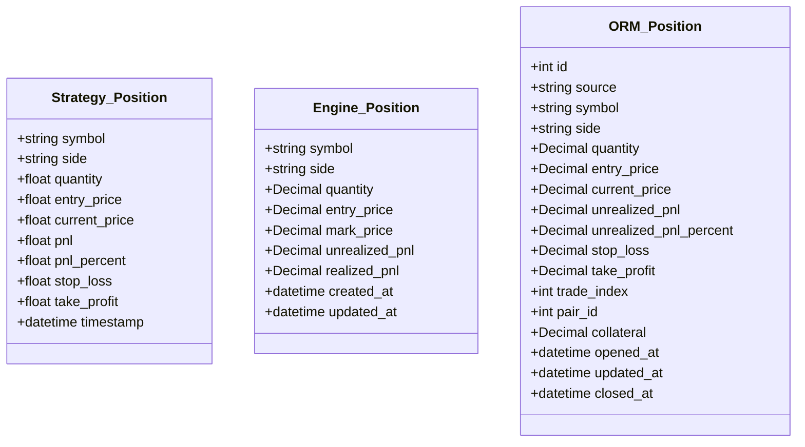
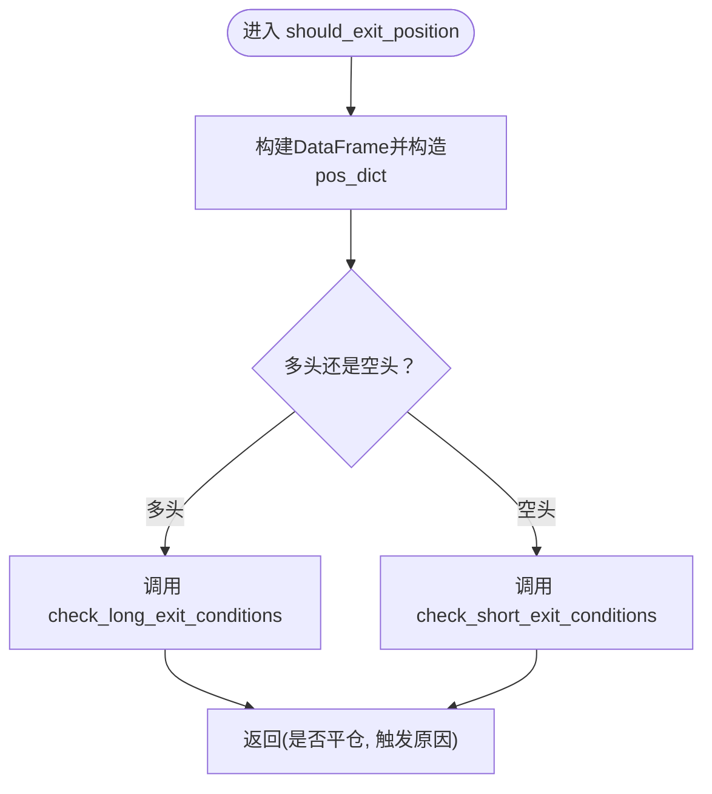
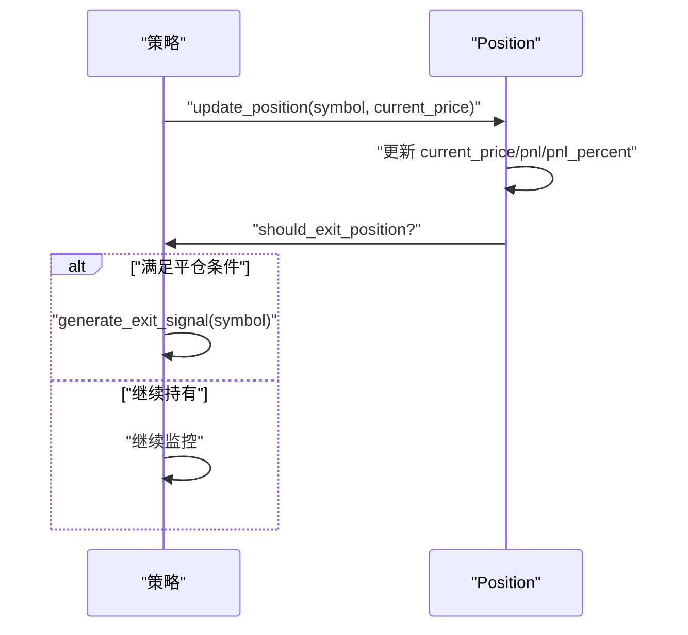
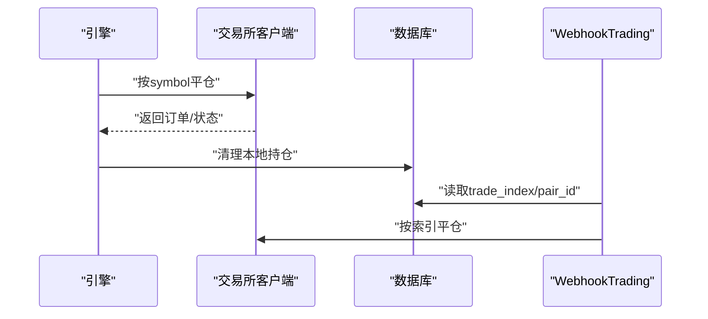
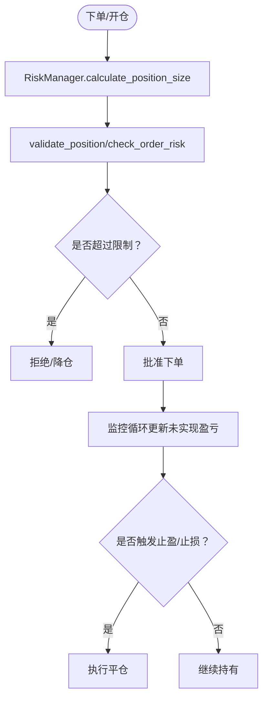
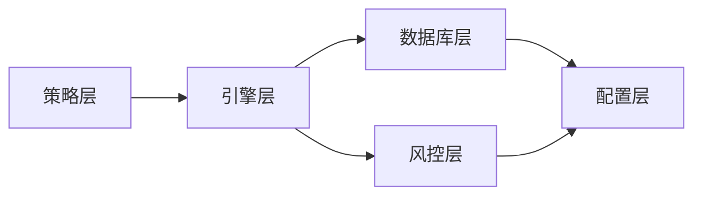

# 仓位管理

<cite>
**本文引用的文件**
- [backpack_quant_trading/engine/live_trading.py](file://backpack_quant_trading/engine/live_trading.py)
- [backpack_quant_trading/database/models.py](file://backpack_quant_trading/database/models.py)
- [backpack_quant_trading/core/risk_manager.py](file://backpack_quant_trading/core/risk_manager.py)
- [backpack_quant_trading/strategy/base.py](file://backpack_quant_trading/strategy/base.py)
- [backpack_quant_trading/strategy/dual_freq_trend.py](file://backpack_quant_trading/strategy/dual_freq_trend.py)
- [backpack_quant_trading/config/settings.py](file://backpack_quant_trading/config/settings.py)
- [backpack_quant_trading/core/hyperliquid_client.py](file://backpack_quant_trading/core/hyperliquid_client.py)
- [backpack_quant_trading/engine/webhook_trading.py](file://backpack_quant_trading/engine/webhook_trading.py)
- [backpack_quant_trading/write_hype_strategy.py](file://backpack_quant_trading/write_hype_strategy.py)
</cite>

## 目录
1. [简介](#简介)
2. [项目结构](#项目结构)
3. [核心组件](#核心组件)
4. [架构总览](#架构总览)
5. [详细组件分析](#详细组件分析)
6. [依赖分析](#依赖分析)
7. [性能考虑](#性能考虑)
8. [故障排查指南](#故障排查指南)
9. [结论](#结论)
10. [附录](#附录)

## 简介
本指南聚焦于量化交易系统中的仓位管理系统，围绕以下目标展开：
- Position数据结构的设计与使用：涵盖多头/空头仓位、止盈止损、实时监控与数据库持久化。
- should_exit_position方法的实现：解释止盈止盈逻辑、时间限制与平仓条件。
- 仓位更新机制update_position的工作原理与实时监控。
- 风险管理最佳实践：集中度控制、最大回撤限制、风险敞口管理。
- 平仓策略与强制平仓处理逻辑。

## 项目结构
本系统采用分层架构，涉及策略层、引擎层、风险管理与数据库层：
- 策略层：定义Position与BaseStrategy接口，提供should_exit_position与update_position等通用逻辑，并在具体策略中实现平仓条件。
- 引擎层：负责实时监控、止盈止损触发、平仓执行与数据库写入。
- 风控层：提供仓位规模计算、风险检查与日度/回撤指标。
- 数据库层：持久化Position与交易历史，支持查询与更新。



图表来源
- [backpack_quant_trading/engine/live_trading.py](file://backpack_quant_trading/engine/live_trading.py)
- [backpack_quant_trading/core/risk_manager.py](file://backpack_quant_trading/core/risk_manager.py)
- [backpack_quant_trading/database/models.py](file://backpack_quant_trading/database/models.py)
- [backpack_quant_trading/strategy/base.py](file://backpack_quant_trading/strategy/base.py)
- [backpack_quant_trading/strategy/dual_freq_trend.py](file://backpack_quant_trading/strategy/dual_freq_trend.py)
- [backpack_quant_trading/core/hyperliquid_client.py](file://backpack_quant_trading/core/hyperliquid_client.py)
- [backpack_quant_trading/engine/webhook_trading.py](file://backpack_quant_trading/engine/webhook_trading.py)

章节来源
- [backpack_quant_trading/engine/live_trading.py](file://backpack_quant_trading/engine/live_trading.py)
- [backpack_quant_trading/database/models.py](file://backpack_quant_trading/database/models.py)
- [backpack_quant_trading/core/risk_manager.py](file://backpack_quant_trading/core/risk_manager.py)
- [backpack_quant_trading/strategy/base.py](file://backpack_quant_trading/strategy/base.py)
- [backpack_quant_trading/strategy/dual_freq_trend.py](file://backpack_quant_trading/strategy/dual_freq_trend.py)
- [backpack_quant_trading/config/settings.py](file://backpack_quant_trading/config/settings.py)
- [backpack_quant_trading/core/hyperliquid_client.py](file://backpack_quant_trading/core/hyperliquid_client.py)
- [backpack_quant_trading/engine/webhook_trading.py](file://backpack_quant_trading/engine/webhook_trading.py)

## 核心组件
- Position数据结构
  - 策略层Position：包含symbol、side、quantity、entry_price、current_price、pnl、pnl_percent、stop_loss、take_profit、timestamp等字段，用于策略侧的实时计算与信号生成。
  - 引擎层Position：包含symbol、side、quantity、entry_price、mark_price、unrealized_pnl、realized_pnl、created_at、updated_at等字段，用于引擎侧的实时监控与数据库写入。
  - 数据库层Position：ORM模型，持久化字段包括source、symbol、side、quantity、entry_price、current_price、unrealized_pnl、unrealized_pnl_percent、stop_loss、take_profit、trade_index、pair_id、collateral、opened_at、updated_at、closed_at等。
- BaseStrategy.update_position：定期更新持仓的current_price、pnl、pnl_percent，并在满足should_exit_position时生成平仓信号。
- RiskManager：提供calculate_position_size、validate_position、check_order_risk、update_position等方法，用于仓位规模控制与风险检查。
- LiveTrading监控循环：定时拉取实时价格，计算未实现盈亏，优先使用策略提供的止盈止损价位，否则使用全局阈值触发平仓，并写入数据库。

章节来源
- [backpack_quant_trading/strategy/base.py](file://backpack_quant_trading/strategy/base.py)
- [backpack_quant_trading/engine/live_trading.py](file://backpack_quant_trading/engine/live_trading.py)
- [backpack_quant_trading/database/models.py](file://backpack_quant_trading/database/models.py)
- [backpack_quant_trading/core/risk_manager.py](file://backpack_quant_trading/core/risk_manager.py)

## 架构总览
系统通过策略层定义统一的Position与should_exit_position接口，引擎层负责实时监控与平仓执行，风控层提供风险约束，数据库层负责持久化。策略侧可提供自定义止盈止损价位，引擎侧优先使用策略价位，避免与全局阈值冲突。



图表来源
- [backpack_quant_trading/engine/live_trading.py](file://backpack_quant_trading/engine/live_trading.py)
- [backpack_quant_trading/strategy/base.py](file://backpack_quant_trading/strategy/base.py)
- [backpack_quant_trading/core/risk_manager.py](file://backpack_quant_trading/core/risk_manager.py)
- [backpack_quant_trading/database/models.py](file://backpack_quant_trading/database/models.py)

## 详细组件分析

### Position数据结构与使用
- 策略层Position：用于策略侧的实时计算与信号生成，包含止盈止损与时间戳等字段，便于策略侧自行管理。
- 引擎层Position：用于引擎侧的实时监控，包含mark_price与unrealized_pnl，便于计算未实现盈亏。
- 数据库层Position：ORM模型，支持持久化与查询，包含stop_loss、take_profit、collateral、trade_index、pair_id等扩展字段，便于跨平台与链上交易场景。



图表来源
- [backpack_quant_trading/strategy/base.py](file://backpack_quant_trading/strategy/base.py)
- [backpack_quant_trading/engine/live_trading.py](file://backpack_quant_trading/engine/live_trading.py)
- [backpack_quant_trading/database/models.py](file://backpack_quant_trading/database/models.py)

章节来源
- [backpack_quant_trading/strategy/base.py](file://backpack_quant_trading/strategy/base.py)
- [backpack_quant_trading/engine/live_trading.py](file://backpack_quant_trading/engine/live_trading.py)
- [backpack_quant_trading/database/models.py](file://backpack_quant_trading/database/models.py)

### should_exit_position方法实现
- 接口定义：BaseStrategy.should_exit_position(position, current_data)由子类实现，返回是否需要平仓。
- DualFreqTrend实现要点：
  - 计算当前pnl百分比，与策略配置的止盈/止损阈值比较。
  - 支持时间限制与其它条件（如趋势反转、技术指标变化）。
  - 返回布尔值与触发原因字符串，便于记录与展示。



图表来源
- [backpack_quant_trading/strategy/dual_freq_trend.py](file://backpack_quant_trading/strategy/dual_freq_trend.py)
- [backpack_quant_trading/strategy/base.py](file://backpack_quant_trading/strategy/base.py)

章节来源
- [backpack_quant_trading/strategy/dual_freq_trend.py](file://backpack_quant_trading/strategy/dual_freq_trend.py)
- [backpack_quant_trading/strategy/base.py](file://backpack_quant_trading/strategy/base.py)

### 仓位更新机制update_position
- 定时更新：BaseStrategy.update_position(symbol, current_price)定期调用，更新current_price、pnl、pnl_percent。
- 触发平仓：若满足should_exit_position，生成平仓信号（全仓平）。
- 策略集成：策略侧可结合技术指标与市场状态，动态调整止盈止损与仓位规模。



图表来源
- [backpack_quant_trading/strategy/base.py](file://backpack_quant_trading/strategy/base.py)

章节来源
- [backpack_quant_trading/strategy/base.py](file://backpack_quant_trading/strategy/base.py)

### 实时监控与止盈止损触发
- 监控循环：LiveTrading._position_monitor_loop定时获取实时价格，计算未实现盈亏。
- 策略优先：若策略提供stop_loss/take_profit，优先按策略价位触发；否则使用全局阈值（止损-2%，止盈+3%）。
- 数据写入：每次更新后写入数据库，保持字段与策略侧一致。
- 平仓执行：满足条件后调用_close_position，包含交易所持仓同步、订单提交与本地清理。

```mermaid
sequenceDiagram
participant Loop as "监控循环"
participant Price as "实时价格"
participant Strat as "策略位置"
participant Engine as "引擎"
participant DB as "数据库"
Loop->>Price : "获取最新价格"
Loop->>Loop : "计算未实现盈亏"
Loop->>Strat : "读取策略止盈止损"
alt "策略提供价位"
Strat-->>Loop : "返回策略价位"
Loop->>Loop : "按策略价位判断"
else "策略未提供"
Loop->>Loop : "按全局阈值判断"
end
Loop->>DB : "写入未实现盈亏/止盈止损"
alt "触发平仓"
Loop->>Engine : "_close_position(reason)"
else "继续持有"
Loop->>Loop : "等待下次轮询"
end
```

图表来源
- [backpack_quant_trading/engine/live_trading.py](file://backpack_quant_trading/engine/live_trading.py)
- [backpack_quant_trading/database/models.py](file://backpack_quant_trading/database/models.py)

章节来源
- [backpack_quant_trading/engine/live_trading.py](file://backpack_quant_trading/engine/live_trading.py)
- [backpack_quant_trading/database/models.py](file://backpack_quant_trading/database/models.py)

### 平仓策略与强制平仓
- 按symbol平仓：HyperliquidClient.close_position按symbol查找并reduce_only平仓。
- 按索引平仓：WebhookTrading根据数据库中保存的trade_index与pair_id执行平仓，避免错单。
- 强制平仓：引擎侧在监控循环中满足阈值或策略触发时，提交市价单并清理本地持仓，必要时重试同步。



图表来源
- [backpack_quant_trading/engine/live_trading.py](file://backpack_quant_trading/engine/live_trading.py)
- [backpack_quant_trading/core/hyperliquid_client.py](file://backpack_quant_trading/core/hyperliquid_client.py)
- [backpack_quant_trading/engine/webhook_trading.py](file://backpack_quant_trading/engine/webhook_trading.py)

章节来源
- [backpack_quant_trading/engine/live_trading.py](file://backpack_quant_trading/engine/live_trading.py)
- [backpack_quant_trading/core/hyperliquid_client.py](file://backpack_quant_trading/core/hyperliquid_client.py)
- [backpack_quant_trading/engine/webhook_trading.py](file://backpack_quant_trading/engine/webhook_trading.py)

### 风险管理最佳实践
- 仓位规模控制：RiskManager.calculate_position_size基于账户资金、最大单笔仓位比例与止损百分比计算，避免单笔风险过大。
- 风险检查：validate_position与check_order_risk综合保证金上限、日度亏损限制、最大回撤与杠杆，给出风险评分与建议。
- 日度与回撤监控：RiskManager维护日度PnL、峰值与当前回撤，辅助决策与风控提示。
- 动态止损止盈：策略侧可提供自定义止盈止损价位，引擎侧优先使用策略价位，避免与全局阈值冲突。



图表来源
- [backpack_quant_trading/core/risk_manager.py](file://backpack_quant_trading/core/risk_manager.py)
- [backpack_quant_trading/config/settings.py](file://backpack_quant_trading/config/settings.py)

章节来源
- [backpack_quant_trading/core/risk_manager.py](file://backpack_quant_trading/core/risk_manager.py)
- [backpack_quant_trading/config/settings.py](file://backpack_quant_trading/config/settings.py)

## 依赖分析
- 策略层依赖引擎层的Position与回调机制，以便在满足条件时生成信号。
- 引擎层依赖风控层的风险检查与数据库层的持久化能力。
- 数据库层依赖配置层的交易参数，保证阈值与杠杆的一致性。



图表来源
- [backpack_quant_trading/strategy/base.py](file://backpack_quant_trading/strategy/base.py)
- [backpack_quant_trading/engine/live_trading.py](file://backpack_quant_trading/engine/live_trading.py)
- [backpack_quant_trading/core/risk_manager.py](file://backpack_quant_trading/core/risk_manager.py)
- [backpack_quant_trading/database/models.py](file://backpack_quant_trading/database/models.py)
- [backpack_quant_trading/config/settings.py](file://backpack_quant_trading/config/settings.py)

章节来源
- [backpack_quant_trading/strategy/base.py](file://backpack_quant_trading/strategy/base.py)
- [backpack_quant_trading/engine/live_trading.py](file://backpack_quant_trading/engine/live_trading.py)
- [backpack_quant_trading/core/risk_manager.py](file://backpack_quant_trading/core/risk_manager.py)
- [backpack_quant_trading/database/models.py](file://backpack_quant_trading/database/models.py)
- [backpack_quant_trading/config/settings.py](file://backpack_quant_trading/config/settings.py)

## 性能考虑
- 监控频率：引擎侧监控循环每30秒轮询一次，避免频繁API调用导致限流。
- 锁粒度：在获取实时价格与更新未实现盈亏时尽量缩短持有锁的时间，提升并发性能。
- 数据库写入：批量写入与字段选择性更新，减少IO压力。
- 策略优先：优先使用策略提供的止盈止损价位，减少不必要的全局阈值判断。

## 故障排查指南
- 未实现盈亏异常：检查引擎侧是否正确计算pnl与pnl_percent，并确保在策略优先路径下也能更新数据库。
- 平仓失败：查看_close_position的异常处理与重试逻辑，确认交易所持仓同步与订单提交状态。
- 风控拒绝：核对validate_position与check_order_risk的输出，关注保证金上限、日度亏损与回撤限制。
- Webhook平仓错单：确认trade_index与pair_id是否来自数据库，避免硬编码导致的错单。

章节来源
- [backpack_quant_trading/engine/live_trading.py](file://backpack_quant_trading/engine/live_trading.py)
- [backpack_quant_trading/core/risk_manager.py](file://backpack_quant_trading/core/risk_manager.py)
- [backpack_quant_trading/engine/webhook_trading.py](file://backpack_quant_trading/engine/webhook_trading.py)

## 结论
本系统通过策略层与引擎层的清晰分工，实现了灵活的多头/空头仓位管理、可插拔的止盈止损逻辑与完善的实时监控与数据库持久化。结合风控层的风险检查与配置层的阈值设定，能够有效控制仓位集中度、最大回撤与风险敞口，满足实盘交易的稳定性与可追溯性需求。

## 附录
- 关键阈值参考
  - 止损阈值：-2%
  - 止盈阈值：+3%
  - 最大单笔仓位比例：50%
  - 最大日度亏损：0.5
  - 最大回撤：15%
  - 默认杠杆：5倍

章节来源
- [backpack_quant_trading/config/settings.py](file://backpack_quant_trading/config/settings.py)