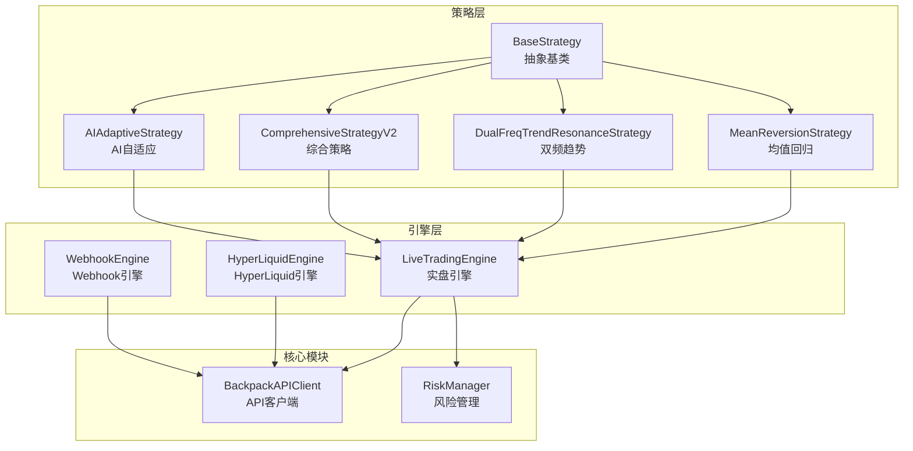
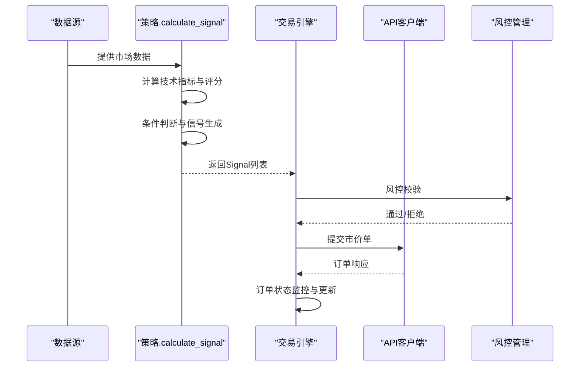
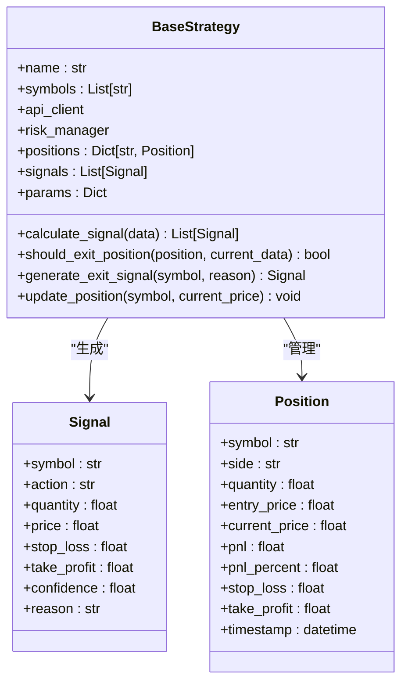
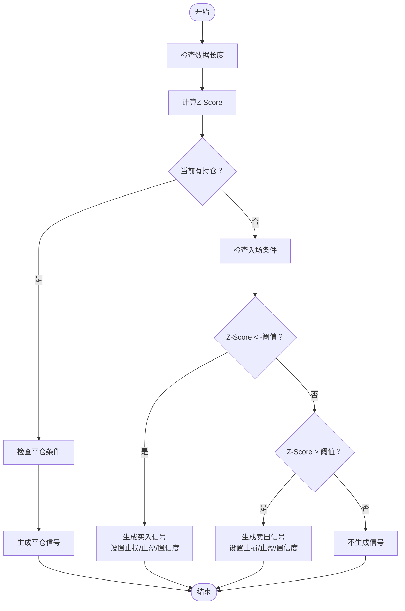
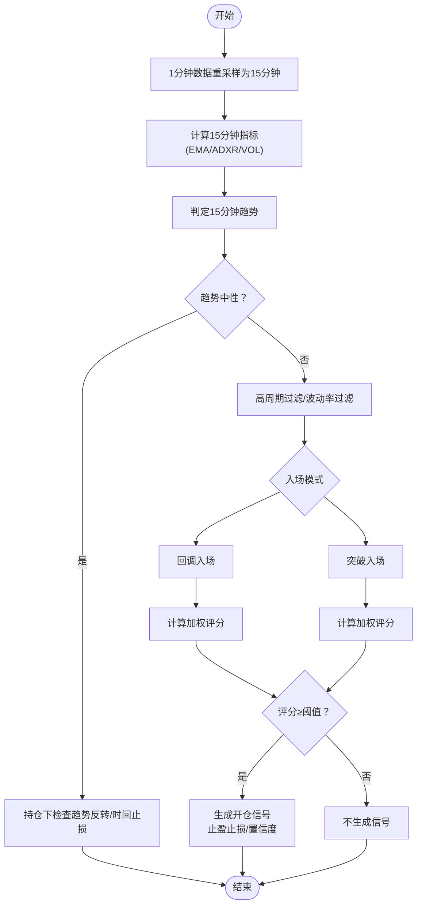
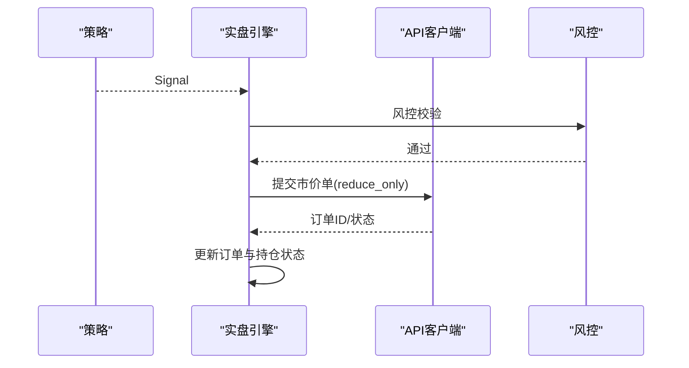
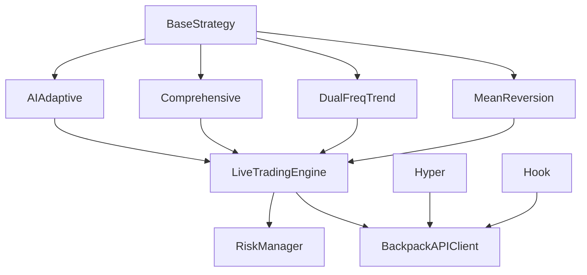

# 信号生成逻辑

<cite>
**本文档引用的文件**
- [strategy/base.py](file://strategy/base.py)
- [strategy/mean_reversion.py](file://strategy/mean_reversion.py)
- [strategy/dual_freq_trend.py](file://strategy/dual_freq_trend.py)
- [strategy/comprehensive.py](file://strategy/comprehensive.py)
- [strategy/ai_adaptive.py](file://strategy/ai_adaptive.py)
- [engine/live_trading.py](file://engine/live_trading.py)
- [engine/hyperliquid_trading.py](file://engine/hyperliquid_trading.py)
- [engine/webhook_trading.py](file://engine/webhook_trading.py)
- [core/api_client.py](file://core/api_client.py)
- [webhook_service.py](file://webhook_service.py)
</cite>

## 目录
1. [引言](#引言)
2. [项目结构](#项目结构)
3. [核心组件](#核心组件)
4. [架构概览](#架构概览)
5. [详细组件分析](#详细组件分析)
6. [依赖分析](#依赖分析)
7. [性能考虑](#性能考虑)
8. [故障排除指南](#故障排除指南)
9. [结论](#结论)

## 引言
本指南深入解析量化交易系统中的信号生成逻辑，重点围绕 `calculate_signal` 方法的实现原理，涵盖技术指标计算、信号条件判断与交易决策逻辑。文档提供三类信号生成模式：均值回归策略的价格突破信号、双频趋势策略的频率共振信号，以及AI自适应策略的目标价格信号。同时阐述信号置信度计算、信号过滤机制与多重确认逻辑，并说明信号与订单执行的关系及延迟处理机制。

## 项目结构
系统采用分层架构，策略层负责信号生成，引擎层负责订单执行与风控，核心模块提供API客户端与风险管理。

**图表来源**
- [strategy/base.py:41-91](file://strategy/base.py#L41-L91)
- [strategy/mean_reversion.py:31-117](file://strategy/mean_reversion.py#L31-L117)
- [strategy/dual_freq_trend.py:636-800](file://strategy/dual_freq_trend.py#L636-L800)
- [strategy/comprehensive.py:17-91](file://strategy/comprehensive.py#L17-L91)
- [strategy/ai_adaptive.py:12-55](file://strategy/ai_adaptive.py#L12-L55)
- [engine/live_trading.py:1750-1802](file://engine/live_trading.py#L1750-L1802)
- [engine/hyperliquid_trading.py:85-160](file://engine/hyperliquid_trading.py#L85-L160)
- [engine/webhook_trading.py:208-226](file://engine/webhook_trading.py#L208-L226)

**章节来源**
- [strategy/base.py:1-212](file://strategy/base.py#L1-L212)
- [engine/live_trading.py:1750-1802](file://engine/live_trading.py#L1750-L1802)

## 核心组件
- BaseStrategy：定义信号生成的抽象接口与通用逻辑，包括信号数据结构、平仓逻辑与盈亏计算。
- 各策略实现：在各自策略类中实现 `calculate_signal`，结合技术指标与业务规则生成买入、卖出或持有信号。
- 引擎层：负责接收信号、风控校验、下单执行与订单状态监控。
- API客户端：封装交易所API，支持下单、查询、风控等操作。

**章节来源**
- [strategy/base.py:31-91](file://strategy/base.py#L31-L91)
- [core/api_client.py:449-478](file://core/api_client.py#L449-L478)

## 架构概览
信号生成与执行的端到端流程如下：

**图表来源**
- [strategy/base.py:71-91](file://strategy/base.py#L71-L91)
- [engine/live_trading.py:1768-1802](file://engine/live_trading.py#L1768-L1802)
- [core/api_client.py:449-478](file://core/api_client.py#L449-L478)

## 详细组件分析

### BaseStrategy 抽象基类
- 信号数据结构：包含交易对、动作、数量、目标价格、止损止盈、置信度与原因。
- 平仓逻辑：根据止损止盈与策略特定条件生成平仓信号。
- 盈亏计算：提供多头/空头的未实现盈亏计算方法。

**图表来源**
- [strategy/base.py:31-91](file://strategy/base.py#L31-L91)
- [strategy/base.py:153-170](file://strategy/base.py#L153-L170)

**章节来源**
- [strategy/base.py:31-170](file://strategy/base.py#L31-L170)

### 均值回归策略（MeanReversionStrategy）
- 技术指标：滚动均值与标准差计算Z-Score，用于衡量价格偏离程度。
- 信号条件：
  - 买入：当Z-Score低于阈值且当前无持仓，生成买入信号，设置止损与止盈。
  - 卖出：当Z-Score高于阈值且当前无持仓，生成卖出信号。
  - 平仓：当触及止损止盈或Z-Score回归均值附近时生成平仓信号。
- 置信度：基于Z-Score绝对值与阈值的比值，归一化到[0,1]。
- 仓位管理：根据账户余额与配置的保证金计算下单数量，并进行风控校验。

**图表来源**
- [strategy/mean_reversion.py:31-117](file://strategy/mean_reversion.py#L31-L117)
- [strategy/mean_reversion.py:119-149](file://strategy/mean_reversion.py#L119-L149)

**章节来源**
- [strategy/mean_reversion.py:31-117](file://strategy/mean_reversion.py#L31-L117)
- [strategy/mean_reversion.py:119-149](file://strategy/mean_reversion.py#L119-L149)

### 双频趋势策略（DualFreqTrendResonanceStrategy）
- 技术指标：
  - 15分钟趋势：EMA9/EMA21连续同向确认，ADXR过滤。
  - 1分钟入场：EMA5/EMA13、RSI6、布林带、MACD柱等。
- 信号生成模式：
  - 回调做多/做空：价格接近EMA13或布林中轨，RSI反转，成交量配合。
  - 突破做多/做空：价格突破布林上轨/下轨，金叉/死叉，放量突破。
- 置信度与加权评分：基于趋势对齐、价格位置、RSI信号、均线状态、MACD柱方向、成交量与波动率等条件加权求和。
- 止盈止损：以保证金收益百分比定义，按杠杆换算为价格移动。
- 多重确认：趋势确认、高周期过滤、波动率过滤、时间止损与趋势反转退出。

**图表来源**
- [strategy/dual_freq_trend.py:170-201](file://strategy/dual_freq_trend.py#L170-L201)
- [strategy/dual_freq_trend.py:289-426](file://strategy/dual_freq_trend.py#L289-L426)
- [strategy/dual_freq_trend.py:451-543](file://strategy/dual_freq_trend.py#L451-L543)
- [strategy/dual_freq_trend.py:548-559](file://strategy/dual_freq_trend.py#L548-L559)

**章节来源**
- [strategy/dual_freq_trend.py:170-201](file://strategy/dual_freq_trend.py#L170-L201)
- [strategy/dual_freq_trend.py:289-426](file://strategy/dual_freq_trend.py#L289-L426)
- [strategy/dual_freq_trend.py:451-543](file://strategy/dual_freq_trend.py#L451-L543)
- [strategy/dual_freq_trend.py:548-559](file://strategy/dual_freq_trend.py#L548-L559)

### 综合策略（ComprehensiveStrategyV2）
- 多指标评分系统：趋势、价格位置、RSI、K线形态、成交量、KDJ、OBV、均线交叉、MACD等。
- 加权评分：不同指标赋予不同权重，累计评分决定开仓信号强度。
- 动态止盈止损：基于ATR计算，或使用默认百分比。
- 趋势过滤与波动率过滤：仅在强趋势与波动环境中开仓，避免震荡陷阱。

**章节来源**
- [strategy/comprehensive.py:17-91](file://strategy/comprehensive.py#L17-L91)
- [strategy/comprehensive.py:224-405](file://strategy/comprehensive.py#L224-L405)

### AI自适应策略（AIAdaptiveStrategy）
- 本地指标预筛选：在调用AI之前，使用RSI、MACD、布林带等指标进行快速筛选，降低AI调用成本。
- 信号生成：解析AI输出的目标价格，结合止损止盈比例与仓位计算生成Signal。
- 交易决策：根据当前持仓状态与AI信号匹配生成开仓或平仓信号。

**章节来源**
- [strategy/ai_adaptive.py:12-55](file://strategy/ai_adaptive.py#L12-L55)
- [strategy/ai_adaptive.py:776-821](file://strategy/ai_adaptive.py#L776-L821)

### 信号与订单执行关系
- 引擎接收策略生成的Signal，进行风控校验与下单。
- 实盘引擎强制使用市价单以确保立即成交，并根据信号方向自动设置reduce_only以避免反手。
- 引擎监控订单状态，同步策略与引擎的持仓状态，防止重复下单与信号丢失。

**图表来源**
- [engine/live_trading.py:1768-1802](file://engine/live_trading.py#L1768-L1802)
- [core/api_client.py:449-478](file://core/api_client.py#L449-L478)

**章节来源**
- [engine/live_trading.py:1768-1802](file://engine/live_trading.py#L1768-L1802)
- [core/api_client.py:449-478](file://core/api_client.py#L449-L478)

### 信号过滤机制与多重确认
- 数据完整性检查：策略在计算前检查数据长度，避免无效指标。
- 趋势过滤：双频策略使用15分钟EMA与ADXR过滤，综合策略使用多周期均线与ATR过滤。
- 波动率过滤：布林带宽度与ATR百分比过滤，避免横盘震荡。
- 时间过滤：冷却期与最小进场间隔，防止过度交易。
- 信号丢失自愈：引擎检测重复开仓信号时强平自愈，避免仓位错配。

**章节来源**
- [strategy/dual_freq_trend.py:636-800](file://strategy/dual_freq_trend.py#L636-L800)
- [engine/hyperliquid_trading.py:116-137](file://engine/hyperliquid_trading.py#L116-L137)

## 依赖分析
- 策略依赖BaseStrategy提供的抽象接口与通用工具。
- 引擎依赖API客户端与风险管理模块，确保下单与风控一致性。
- Webhook引擎与HyperLiquid引擎分别处理外部信号与特定交易所的执行细节。

**图表来源**
- [strategy/base.py:41-91](file://strategy/base.py#L41-L91)
- [engine/live_trading.py:1750-1802](file://engine/live_trading.py#L1750-L1802)
- [engine/hyperliquid_trading.py:85-160](file://engine/hyperliquid_trading.py#L85-L160)
- [engine/webhook_trading.py:208-226](file://engine/webhook_trading.py#L208-L226)

**章节来源**
- [strategy/base.py:41-91](file://strategy/base.py#L41-L91)
- [engine/live_trading.py:1750-1802](file://engine/live_trading.py#L1750-L1802)

## 性能考虑
- 指标计算复杂度：滚动窗口与指数平滑计算的时间复杂度与数据长度线性相关，建议在策略层缓存必要中间结果。
- 信号生成频率：不同策略的信号生成频率差异较大，应根据市场波动性与交易成本平衡信号频率。
- 引擎并发：使用锁保护共享状态，避免竞态条件；在无持仓时减少API调用频率以节省资源。
- 风控前置：在引擎层进行风控校验，减少无效下单带来的API压力。

## 故障排除指南
- 信号未执行：检查引擎是否处于熔断状态、是否检测到信号丢失并进入自愈模式。
- 仓位为0：确认账户余额、保证金配置与最小交易单位限制，确保风控校验通过。
- 订单未成交：检查订单状态与未成交订单清理逻辑，避免重复下单。
- 交易对不匹配：引擎对信号中的交易对进行模糊匹配，若不匹配将跳过执行。

**章节来源**
- [engine/webhook_trading.py:214-226](file://engine/webhook_trading.py#L214-L226)
- [engine/hyperliquid_trading.py:85-96](file://engine/hyperliquid_trading.py#L85-L96)
- [engine/live_trading.py:1760-1767](file://engine/live_trading.py#L1760-L1767)

## 结论
本系统通过抽象的策略基类与多样化的策略实现，提供了灵活而强大的信号生成框架。均值回归策略强调统计意义的突破信号，双频趋势策略结合高频与长线确认形成共振信号，AI自适应策略利用深度学习提升信号质量。引擎层通过风控、订单执行与状态监控确保信号可靠落地，同时具备信号丢失自愈与延迟处理机制，保障实盘交易的稳定性与安全性。