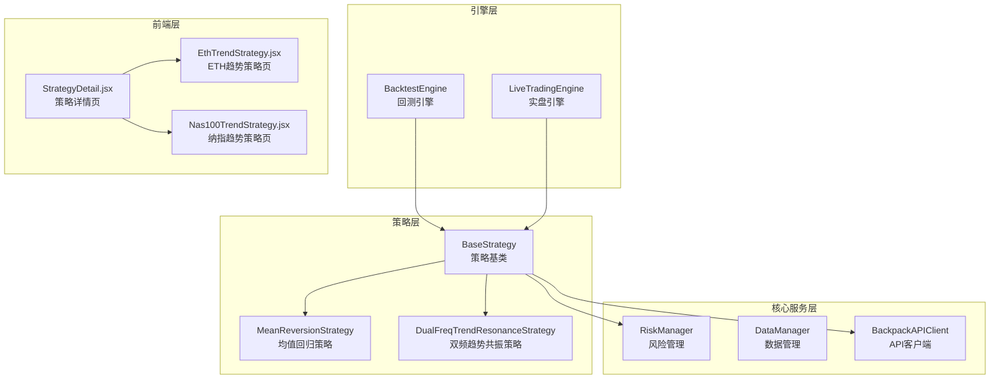
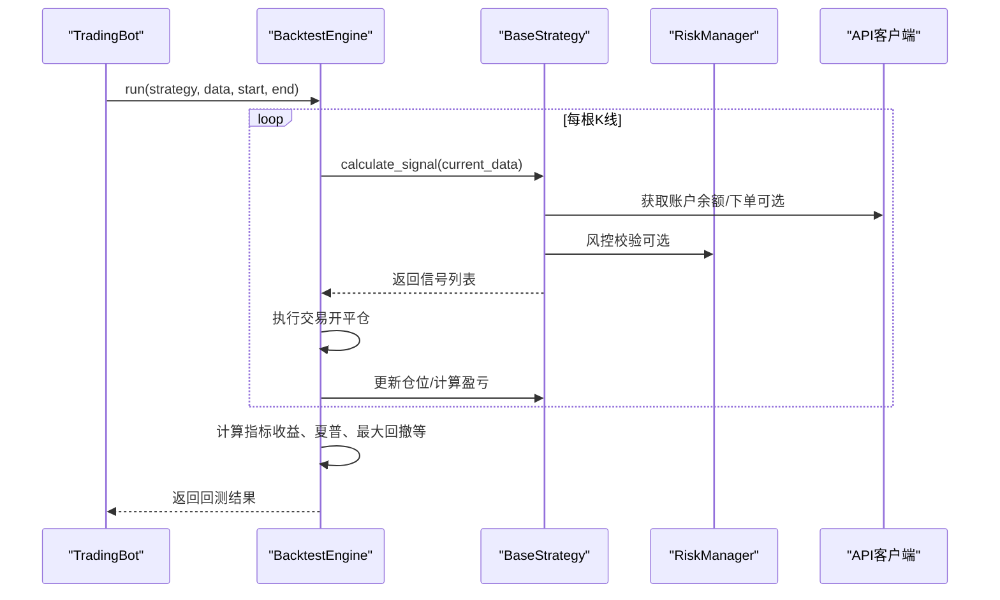
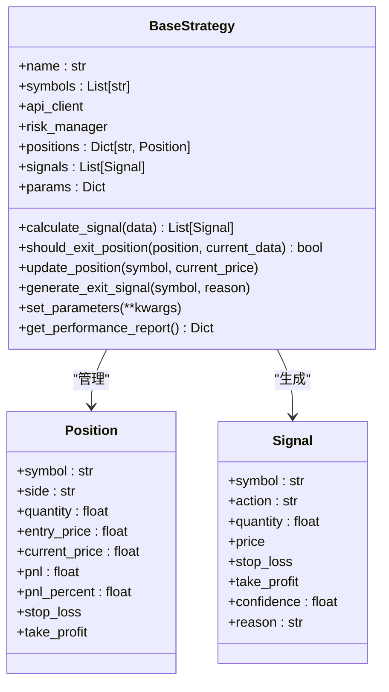
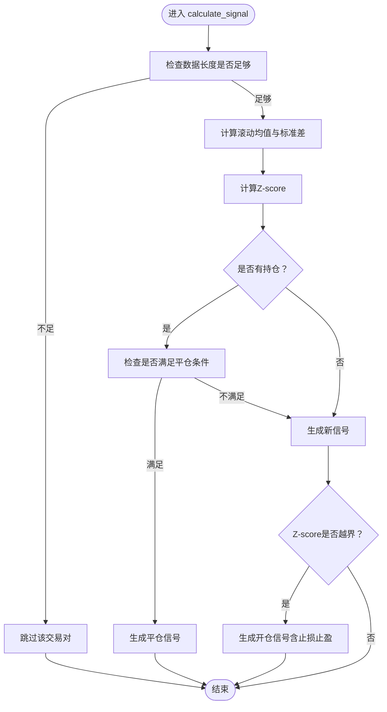
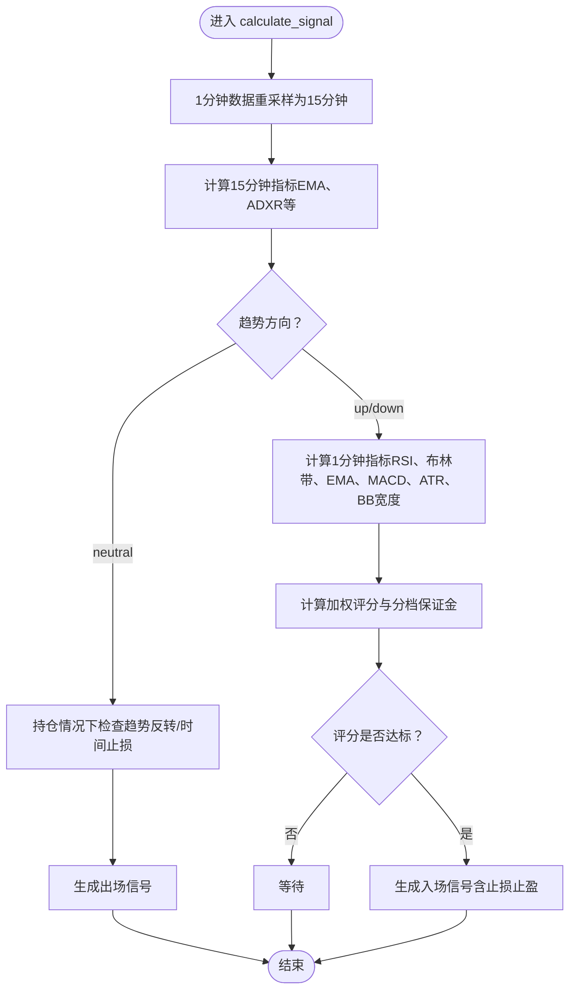
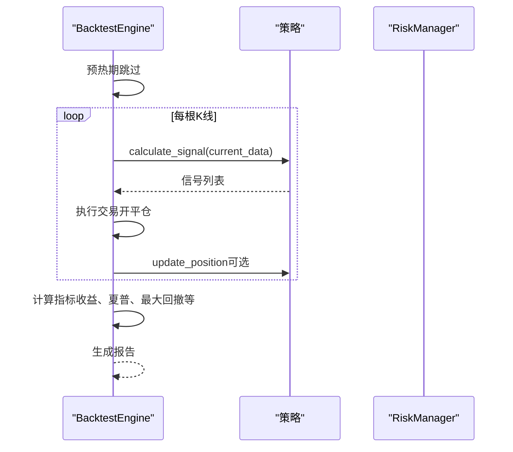
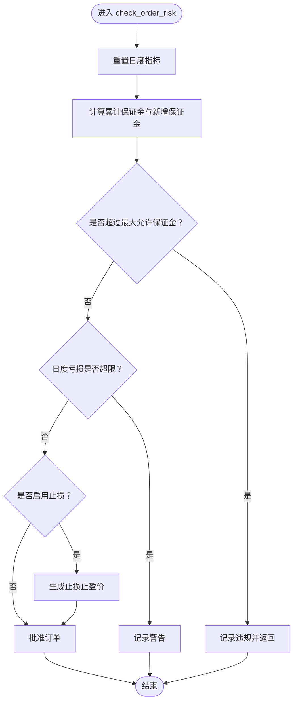
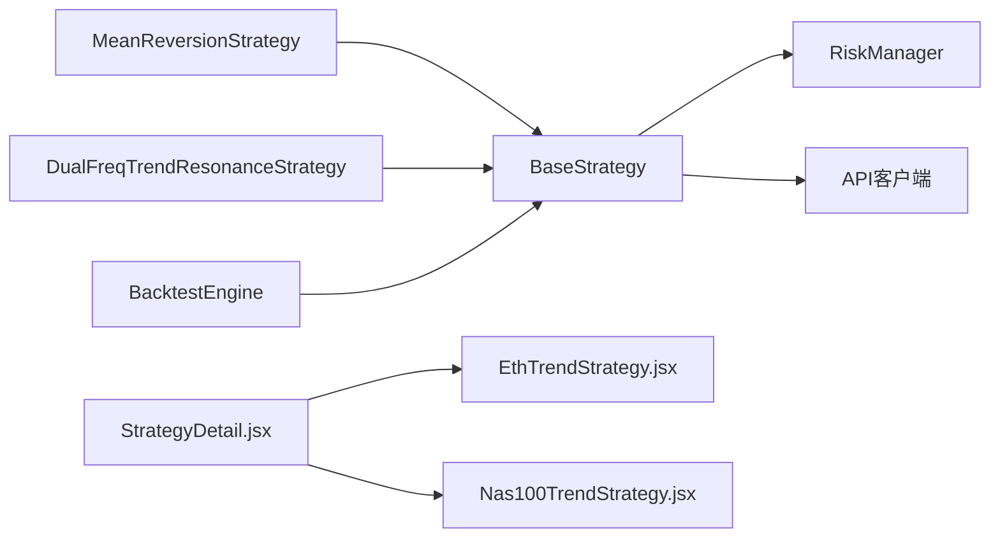

# 新策略开发

<cite>
**本文引用的文件**
- [strategy/base.py](file://backpack_quant_trading/strategy/base.py)
- [strategy/mean_reversion.py](file://backpack_quant_trading/strategy/mean_reversion.py)
- [strategy/dual_freq_trend.py](file://backpack_quant_trading/strategy/dual_freq_trend.py)
- [engine/backtest.py](file://backpack_quant_trading/engine/backtest.py)
- [core/risk_manager.py](file://backpack_quant_trading/core/risk_manager.py)
- [config/settings.py](file://backpack_quant_trading/config/settings.py)
- [main.py](file://backpack_quant_trading/main.py)
- [frontend/src/views/StrategyDetail.jsx](file://backpack_quant_trading/frontend/src/views/StrategyDetail.jsx)
- [frontend/src/views/EthTrendStrategy.jsx](file://backpack_quant_trading/frontend/src/views/EthTrendStrategy.jsx)
- [frontend/src/views/Nas100TrendStrategy.jsx](file://backpack_quant_trading/frontend/src/views/Nas100TrendStrategy.jsx)
</cite>

## 目录
1. [简介](#简介)
2. [项目结构](#项目结构)
3. [核心组件](#核心组件)
4. [架构总览](#架构总览)
5. [详细组件分析](#详细组件分析)
6. [依赖关系分析](#依赖关系分析)
7. [性能考量](#性能考量)
8. [故障排查指南](#故障排查指南)
9. [结论](#结论)
10. [附录](#附录)

## 简介
本指南面向希望在本量化交易系统中开发新交易策略的工程师与研究者。内容涵盖：
- BaseStrategy 抽象基类的职责、接口与实现要求
- 策略继承与扩展的最佳实践
- 从概念设计到代码实现、测试验证、部署上线的完整流程
- 策略参数配置、信号生成逻辑与风险管理机制
- 回测流程、性能评估指标与优化方法
- 实战案例：均值回归策略与双频趋势共振策略的完整实现步骤

## 项目结构
系统采用分层架构，策略层、引擎层、核心服务层与前端展示层清晰分离：
- 策略层：策略基类与具体策略实现
- 引擎层：回测引擎、实盘引擎
- 核心服务层：风险管理、数据管理、API 客户端
- 前端层：策略可视化与回测报告

图表来源
- [strategy/base.py:41-212](file://backpack_quant_trading/strategy/base.py#L41-L212)
- [strategy/mean_reversion.py:23-263](file://backpack_quant_trading/strategy/mean_reversion.py#L23-L263)
- [strategy/dual_freq_trend.py:18-931](file://backpack_quant_trading/strategy/dual_freq_trend.py#L18-L931)
- [engine/backtest.py:48-404](file://backpack_quant_trading/engine/backtest.py#L48-L404)
- [core/risk_manager.py:48-566](file://backpack_quant_trading/core/risk_manager.py#L48-L566)
- [frontend/src/views/StrategyDetail.jsx:87-800](file://backpack_quant_trading/frontend/src/views/StrategyDetail.jsx#L87-L800)
- [frontend/src/views/EthTrendStrategy.jsx:1-24](file://backpack_quant_trading/frontend/src/views/EthTrendStrategy.jsx#L1-L24)
- [frontend/src/views/Nas100TrendStrategy.jsx:1-23](file://backpack_quant_trading/frontend/src/views/Nas100TrendStrategy.jsx#L1-L23)

章节来源
- [main.py:31-56](file://backpack_quant_trading/main.py#L31-L56)

## 核心组件
- BaseStrategy 抽象基类：定义策略生命周期、信号生成、平仓判断、参数管理与性能报告接口
- MeanReversionStrategy：基于 Z-score 的均值回归策略实现
- DualFreqTrendResonanceStrategy：双频趋势共振高频策略实现
- BacktestEngine：回测引擎，负责执行回测、计算指标与生成报告
- RiskManager：风控模块，负责仓位校验、止损止盈建议与风险事件记录
- DataManager：数据管理与技术指标计算
- API 客户端：与交易所交互，获取账户余额、下单等

章节来源
- [strategy/base.py:41-212](file://backpack_quant_trading/strategy/base.py#L41-L212)
- [engine/backtest.py:48-404](file://backpack_quant_trading/engine/backtest.py#L48-L404)
- [core/risk_manager.py:48-566](file://backpack_quant_trading/core/risk_manager.py#L48-L566)

## 架构总览
策略开发遵循“模板方法 + 抽象接口”的设计模式。策略基类统一管理参数、信号、仓位与性能指标，具体策略实现 calculate_signal 与 should_exit_position 两个核心抽象方法。回测引擎通过异步调度策略生成信号并执行交易，最终输出标准化的回测报告。

图表来源
- [engine/backtest.py:65-187](file://backpack_quant_trading/engine/backtest.py#L65-L187)
- [strategy/base.py:71-112](file://backpack_quant_trading/strategy/base.py#L71-L112)
- [core/risk_manager.py:87-230](file://backpack_quant_trading/core/risk_manager.py#L87-L230)

## 详细组件分析

### BaseStrategy 抽象基类
- 职责
  - 统一管理策略参数、信号、仓位与性能指标
  - 提供抽象方法 calculate_signal 与 should_exit_position
  - 提供通用的仓位更新、盈亏计算与平仓信号生成
- 关键接口
  - calculate_signal：接收多交易对的历史数据，返回交易信号列表
  - should_exit_position：根据当前持仓与最新数据判断是否平仓
  - update_position/generate_exit_signal：更新实时盈亏与生成平仓信号
  - set_parameters/get_performance_report：参数注入与性能报告
- 设计要点
  - 使用 dataclass 定义 Position 与 Signal，保证数据结构一致性
  - 通过 RiskManager 与 API 客户端解耦，便于扩展与测试

图表来源
- [strategy/base.py:16-112](file://backpack_quant_trading/strategy/base.py#L16-L112)

章节来源
- [strategy/base.py:41-212](file://backpack_quant_trading/strategy/base.py#L41-L212)

### 均值回归策略（MeanReversionStrategy）
- 策略思想
  - 基于滚动均值与标准差计算 Z-score，当价格偏离均值达到阈值时反向建仓
  - 结合止损止盈与风控参数控制单笔风险
- 关键实现
  - calculate_signal：计算 MA、STD、Zscore，生成买卖信号
  - should_exit_position/_should_exit_with_reason：基于止损止盈与 Zscore 回归判断
  - _calculate_position_size：根据账户余额与风控配置计算可用仓位
- 参数配置
  - lookback_period、zscore_threshold、position_size、stop_loss_percent、take_profit_percent
- 风险管理
  - 通过 RiskManager.validate_position 与风控配置限制单笔/累计保证金

图表来源
- [strategy/mean_reversion.py:31-117](file://backpack_quant_trading/strategy/mean_reversion.py#L31-L117)
- [strategy/mean_reversion.py:119-149](file://backpack_quant_trading/strategy/mean_reversion.py#L119-L149)
- [strategy/mean_reversion.py:151-246](file://backpack_quant_trading/strategy/mean_reversion.py#L151-L246)

章节来源
- [strategy/mean_reversion.py:23-263](file://backpack_quant_trading/strategy/mean_reversion.py#L23-L263)

### 双频趋势共振策略（DualFreqTrendResonanceStrategy）
- 策略思想
  - 15 分钟趋势判定（EMA9/21 + 成交量）决定方向
  - 1 分钟精细入场（回调/突破 + RSI6 + 布林带 + EMA5/13）
  - 加权评分体系：趋势、价格位置、RSI、均线状态、MACD、成交量、波动率等维度加权
  - 止盈止损以“保证金收益%”定义，按杠杆换算为价格移动
- 关键实现
  - calculate_signal：计算 1 分钟与 15 分钟指标，生成入场/出场信号
  - check_long_exit_conditions/check_short_exit_conditions：基于止盈止损、时间止损与趋势反转判断
  - get_stop_take_profit_prices：将“保证金收益%”转换为具体价格
  - _calc_weighted_entry_score：评分与分档保证金
- 参数配置
  - EMA、RSI、布林带、MACD、ATR、波动率过滤、时间止损、冷却期、每日最大回撤等
- 风险管理
  - 日内风控：单日最大回撤限制
  - 保本与追踪止盈、分批止盈等出场优化

图表来源
- [strategy/dual_freq_trend.py:170-201](file://backpack_quant_trading/strategy/dual_freq_trend.py#L170-L201)
- [strategy/dual_freq_trend.py:228-270](file://backpack_quant_trading/strategy/dual_freq_trend.py#L228-L270)
- [strategy/dual_freq_trend.py:289-426](file://backpack_quant_trading/strategy/dual_freq_trend.py#L289-L426)
- [strategy/dual_freq_trend.py:636-800](file://backpack_quant_trading/strategy/dual_freq_trend.py#L636-L800)

章节来源
- [strategy/dual_freq_trend.py:18-931](file://backpack_quant_trading/strategy/dual_freq_trend.py#L18-L931)

### 回测引擎（BacktestEngine）
- 功能
  - 异步运行回测，逐根 K 线生成信号并执行交易
  - 支持多空双向持仓与滑点、手续费模拟
  - 计算总收益、年化收益、夏普比率、最大回撤、胜率、盈利因子等指标
- 关键流程
  - 预热期跳过（避免指标漂移）
  - K 线内止盈止损模拟（high/low 判断）
  - 调用策略计算信号并执行交易
  - 记录资金曲线与交易明细
  - 计算并生成报告

图表来源
- [engine/backtest.py:65-187](file://backpack_quant_trading/engine/backtest.py#L65-L187)
- [engine/backtest.py:333-383](file://backpack_quant_trading/engine/backtest.py#L333-L383)

章节来源
- [engine/backtest.py:48-404](file://backpack_quant_trading/engine/backtest.py#L48-L404)

### 风险管理（RiskManager）
- 功能
  - 仓位校验：累计保证金不超过账户资金的指定比例
  - 日度风控：日度亏损与最大回撤限制
  - 止损止盈建议：根据配置生成建议止损止盈价
  - 风险事件记录：记录违规与警告事件并可持久化
- 关键接口
  - validate_position：校验单笔/累计保证金
  - check_order_risk：订单级风控与建议
  - update_position/close_position：更新持仓与回撤

图表来源
- [core/risk_manager.py:87-230](file://backpack_quant_trading/core/risk_manager.py#L87-L230)

章节来源
- [core/risk_manager.py:48-566](file://backpack_quant_trading/core/risk_manager.py#L48-L566)

## 依赖关系分析
- 策略依赖
  - BaseStrategy 依赖 RiskManager 与 API 客户端，便于风控与实盘下单
  - 具体策略通过 config.trading.LEVERAGE 等全局配置影响仓位与止盈止损
- 引擎依赖
  - BacktestEngine 依赖策略接口，通过异步调用策略生成信号
  - 与 RiskManager 解耦，避免回测中误用实盘风控逻辑
- 前端依赖
  - StrategyDetail.jsx 通过 API 获取回测概览、交易明细与 K 线，渲染可视化图表

图表来源
- [strategy/base.py:41-112](file://backpack_quant_trading/strategy/base.py#L41-L112)
- [engine/backtest.py:48-64](file://backpack_quant_trading/engine/backtest.py#L48-L64)
- [frontend/src/views/StrategyDetail.jsx:87-146](file://backpack_quant_trading/frontend/src/views/StrategyDetail.jsx#L87-L146)

章节来源
- [main.py:31-56](file://backpack_quant_trading/main.py#L31-L56)

## 性能考量
- 回测效率
  - 预热期跳过：避免指标漂移带来的虚假信号
  - 滑点与手续费：在回测中模拟真实成本，提升结果可信度
- 指标计算
  - 夏普比率与最大回撤：基于资金曲线计算，建议使用较长样本期
  - 胜率与盈利因子：区分已平仓交易，避免未平仓影响
- 策略稳定性
  - 参数敏感性：通过网格搜索或贝叶斯优化寻找稳健参数组合
  - 过拟合防护：划分训练/验证/测试集，使用交叉验证

## 故障排查指南
- 回测无信号
  - 检查数据长度是否满足策略需求（如均值回归的 lookback_period）
  - 确认 calculate_signal 返回信号列表非空
- 仓位为 0
  - 检查账户余额与风控配置（MAX_POSITION_SIZE、LEVERAGE）
  - 确认 _calculate_position_size 中的最小交易单位与风控校验
- 回撤过大
  - 检查 RiskManager 的日度限制与最大回撤阈值
  - 调整止盈止损比例与冷却期
- 实盘下单失败
  - 检查 API 客户端配置与权限
  - 确认 RiskManager.validate_position 返回 True

章节来源
- [strategy/mean_reversion.py:151-246](file://backpack_quant_trading/strategy/mean_reversion.py#L151-L246)
- [core/risk_manager.py:87-230](file://backpack_quant_trading/core/risk_manager.py#L87-L230)

## 结论
本指南提供了从抽象基类到具体策略实现、从回测到实盘的完整开发路径。通过统一的接口与严谨的风险管理，开发者可以快速构建、验证并部署高质量的交易策略。建议在开发过程中：
- 明确策略边界与假设，严格实现抽象方法
- 重视参数配置与风控校验，确保策略稳健性
- 以回测为核心验证手段，持续迭代优化

## 附录

### 策略开发流程（从概念到上线）
- 概念设计
  - 明确交易逻辑（技术面/基本面/机器学习）
  - 定义输入输出（K线、指标、信号）
  - 设定参数范围与风控边界
- 代码实现
  - 继承 BaseStrategy，实现 calculate_signal 与 should_exit_position
  - 使用 config.trading.LEVERAGE 与 RiskManager 控制风险
- 测试验证
  - 回测：使用 BacktestEngine 在历史数据上验证策略
  - 风控：确保 validate_position 与 check_order_risk 通过
- 部署上线
  - 实盘：通过 LiveTradingEngine 注册策略并接入 API 客户端
  - 监控：利用前端策略详情页查看回测报告与交易明细

章节来源
- [main.py:160-286](file://backpack_quant_trading/main.py#L160-L286)
- [frontend/src/views/StrategyDetail.jsx:87-800](file://backpack_quant_trading/frontend/src/views/StrategyDetail.jsx#L87-L800)

### 实战案例：均值回归策略
- 步骤
  - 继承 BaseStrategy，定义 MeanReversionParams
  - 实现 calculate_signal：计算 MA/STD/Zscore，生成买卖信号
  - 实现 should_exit_position：基于止损止盈与 Zscore 回归判断
  - 实现 _calculate_position_size：读取账户余额、应用风控配置
- 关键点
  - lookback_period 与 zscore_threshold 的敏感性
  - stop_loss_percent 与 take_profit_percent 的风险收益平衡
  - 通过 RiskManager.validate_position 与 config.trading.LEVERAGE 控制风险

章节来源
- [strategy/mean_reversion.py:23-263](file://backpack_quant_trading/strategy/mean_reversion.py#L23-L263)

### 实战案例：双频趋势共振策略
- 步骤
  - 定义 15 分钟趋势参数与 1 分钟入场参数
  - 实现 calculate_signal：计算 1 分钟与 15 分钟指标，生成入场/出场信号
  - 实现 check_long_exit_conditions/check_short_exit_conditions：止盈止损、时间止损、趋势反转
  - 实现 get_stop_take_profit_prices：将“保证金收益%”转换为价格
  - 实现 _calc_weighted_entry_score：评分与分档保证金
- 关键点
  - 加权评分体系与分档保证金的联动
  - 日内风控与冷却期的设计
  - 与回测引擎的指标对齐（如止盈止损的 K 线内模拟）

章节来源
- [strategy/dual_freq_trend.py:18-931](file://backpack_quant_trading/strategy/dual_freq_trend.py#L18-L931)