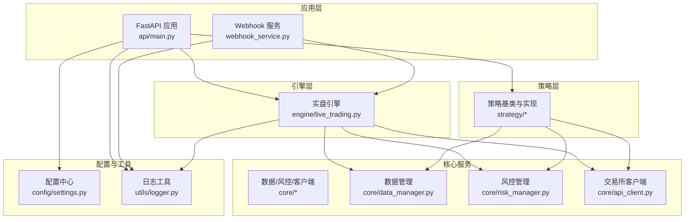
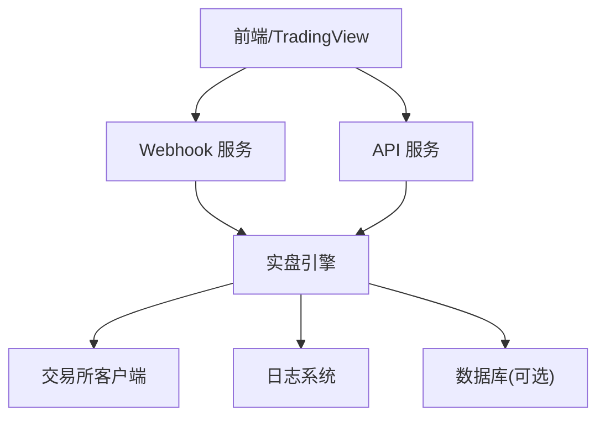
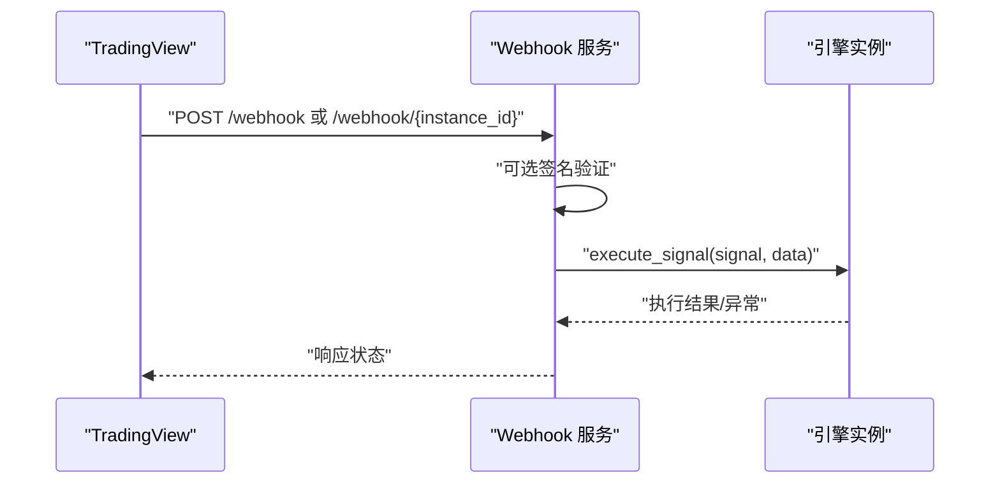
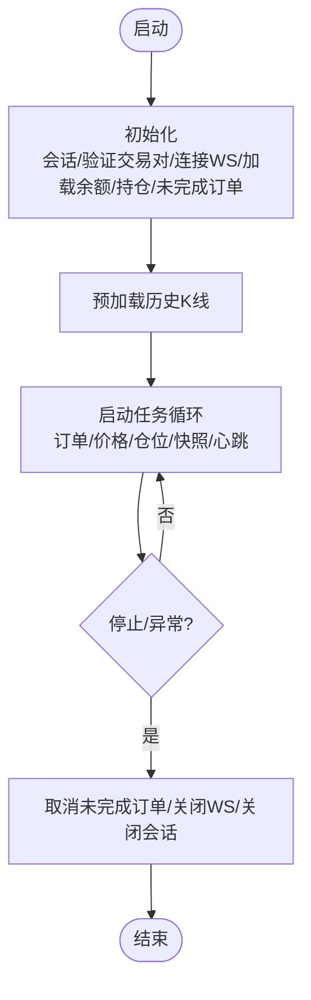
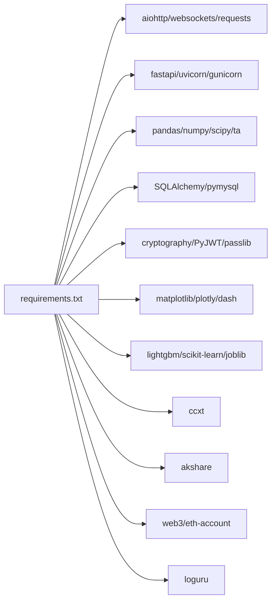

# 策略上线部署

<cite>
**本文引用的文件**   
- [main.py](file://backpack_quant_trading/main.py)
- [run_api.py](file://backpack_quant_trading/run_api.py)
- [webhook_service.py](file://backpack_quant_trading/webhook_service.py)
- [settings.py](file://backpack_quant_trading/config/settings.py)
- [requirements.txt](file://backpack_quant_trading/requirements.txt)
- [api/main.py](file://backpack_quant_trading/api/main.py)
- [live_trading.py](file://backpack_quant_trading/engine/live_trading.py)
- [logger.py](file://backpack_quant_trading/utils/logger.py)
</cite>

## 目录
1. [简介](#简介)
2. [项目结构](#项目结构)
3. [核心组件](#核心组件)
4. [架构总览](#架构总览)
5. [详细组件分析](#详细组件分析)
6. [依赖分析](#依赖分析)
7. [性能考虑](#性能考虑)
8. [故障排查指南](#故障排查指南)
9. [结论](#结论)
10. [附录](#附录)

## 简介
本指南面向生产环境的策略上线部署，涵盖配置管理、API 集成、监控设置、故障恢复、部署流程与运维最佳实践。文档基于仓库中的核心模块，提供从环境准备、依赖安装、服务启动到健康检查的完整操作路径，并结合策略管理建议（参数热更新、版本控制、灰度发布、A/B 测试）与监控告警、日志管理、性能优化等运维要点。

## 项目结构
项目采用分层组织：核心业务逻辑位于 engine、strategy、core 等包；API 层通过 FastAPI 提供 REST 接口；配置集中于 config/settings.py；日志通过 utils/logger.py 统一管理；生产部署可通过 run_api.py 启动 API 服务，webhook_service.py 提供 TradingView 信号接入与多实例引擎管理。

**图表来源**
- [api/main.py:1-98](file://backpack_quant_trading/api/main.py#L1-L98)
- [webhook_service.py:1-598](file://backpack_quant_trading/webhook_service.py#L1-L598)
- [live_trading.py:347-800](file://backpack_quant_trading/engine/live_trading.py#L347-L800)
- [settings.py:104-137](file://backpack_quant_trading/config/settings.py#L104-L137)
- [logger.py:1-180](file://backpack_quant_trading/utils/logger.py#L1-L180)

**章节来源**
- [api/main.py:1-98](file://backpack_quant_trading/api/main.py#L1-L98)
- [webhook_service.py:1-598](file://backpack_quant_trading/webhook_service.py#L1-L598)
- [live_trading.py:347-800](file://backpack_quant_trading/engine/live_trading.py#L347-L800)
- [settings.py:104-137](file://backpack_quant_trading/config/settings.py#L104-L137)
- [logger.py:1-180](file://backpack_quant_trading/utils/logger.py#L1-L180)

## 核心组件
- 配置中心：集中管理各平台 API 地址、密钥、交易风控参数、Webhook 与数据库连接等。
- 实盘引擎：负责 WebSocket 订阅、订单/仓位/余额管理、策略注册与执行、风控监控与心跳。
- API 服务：提供认证、实盘交易、网格、监控、AI 实验室、策略管理、OKX 集成等接口。
- Webhook 服务：接收 TradingView 信号，支持多实例注册/注销、广播路由、动态配置更新、熔断重置与余额查询。
- 日志系统：统一控制台与文件日志，支持交易明细、错误与常规日志分离与轮转。

**章节来源**
- [settings.py:104-137](file://backpack_quant_trading/config/settings.py#L104-L137)
- [live_trading.py:347-800](file://backpack_quant_trading/engine/live_trading.py#L347-L800)
- [api/main.py:1-98](file://backpack_quant_trading/api/main.py#L1-L98)
- [webhook_service.py:1-598](file://backpack_quant_trading/webhook_service.py#L1-L598)
- [logger.py:1-180](file://backpack_quant_trading/utils/logger.py#L1-L180)

## 架构总览
生产部署建议采用“API 服务 + Webhook 服务 + 实盘引擎”的组合模式，API 服务承载前端交互与策略管理，Webhook 服务承接外部信号，实盘引擎统一处理订单、风控与数据流。

**图表来源**
- [api/main.py:1-98](file://backpack_quant_trading/api/main.py#L1-L98)
- [webhook_service.py:1-598](file://backpack_quant_trading/webhook_service.py#L1-L598)
- [live_trading.py:347-800](file://backpack_quant_trading/engine/live_trading.py#L347-L800)
- [logger.py:1-180](file://backpack_quant_trading/utils/logger.py#L1-L180)

## 详细组件分析

### 配置管理（settings.py）
- 环境变量优先级：敏感配置通过 .env 注入，若未设置则使用默认值，避免被空值覆盖。
- 配置分类：交易所（Backpack/Hyperliquid/Ostium/Deepcoin）、数据库、交易风控、Webhook、网络等。
- 目录结构：统一项目根目录、数据与日志目录，自动创建缺失目录。
- 建议：生产环境务必通过环境变量注入密钥与端口，避免硬编码。

**章节来源**
- [settings.py:1-137](file://backpack_quant_trading/config/settings.py#L1-L137)

### API 服务（api/main.py）
- 路由组织：认证、实盘交易、网格、币种监控、数据大屏、AI 实验室、A股AI选股、策略、OKX Agent/Console 等。
- CORS：允许前端多域名访问。
- 静态资源：生产构建后挂载前端 dist，支持 SPA 子路由。
- 健康检查：/api/health 返回服务状态。

**章节来源**
- [api/main.py:1-98](file://backpack_quant_trading/api/main.py#L1-L98)

### Webhook 服务（webhook_service.py）
- 多实例引擎管理：注册/注销实例、广播路由、按策略名/交易对筛选。
- 安全校验：可选 HMAC 签名验证，支持密钥配置。
- 动态配置：支持在线更新保证金、止盈止损、杠杆、交易对等。
- 熔断与重置：实例熔断锁定与手动重置通知。
- 健康检查：/health 返回服务与实例数。
- 日志：统一格式化日志，便于审计与排障。

**图表来源**
- [webhook_service.py:319-478](file://backpack_quant_trading/webhook_service.py#L319-L478)

**章节来源**
- [webhook_service.py:1-598](file://backpack_quant_trading/webhook_service.py#L1-L598)

### 实盘引擎（engine/live_trading.py）
- WebSocket 订阅：K线/行情通道，指数退避重连，代理支持检测。
- 订单/仓位/余额：统一数据结构与回调通知，余额缓存降低 API 调用频率。
- 策略注册：支持多交易对与格式映射（Backpack/Deepcoin），自动建立 symbol 映射。
- 风险监控：止盈止损、资产快照、心跳与异常处理。
- 生命周期：initialize/start/stop，优雅关闭与资源回收。

**图表来源**
- [live_trading.py:443-586](file://backpack_quant_trading/engine/live_trading.py#L443-L586)

**章节来源**
- [live_trading.py:347-800](file://backpack_quant_trading/engine/live_trading.py#L347-L800)

### 日志系统（utils/logger.py）
- 多处理器：控制台与文件（交易/错误/常规），统一格式化。
- Windows 安全轮转：避免权限冲突，实时 flush。
- 交易日志：订单、成交、信号、风险事件与错误分级记录。

**章节来源**
- [logger.py:1-180](file://backpack_quant_trading/utils/logger.py#L1-L180)

## 依赖分析
- Python 版本与依赖：通过 requirements.txt 管理，包含异步网络、FastAPI/Uvicorn/Gunicorn、数据处理、数据库、加密、可视化、技术指标、交易所集成、Web3、日志等。
- 运行时依赖：uvicorn/gunicorn 用于服务启动；websockets/aiohttp 用于异步通信；SQLAlchemy/pymysql 用于数据库；loguru 用于日志；web3/eth-account 用于链上交易。

**图表来源**
- [requirements.txt:1-61](file://backpack_quant_trading/requirements.txt#L1-L61)

**章节来源**
- [requirements.txt:1-61](file://backpack_quant_trading/requirements.txt#L1-L61)

## 性能考虑
- WebSocket 连接：指数退避重连，支持代理检测；连接失败时清理状态并触发重连。
- 余额缓存：10 分钟 TTL，减少高频 API 调用。
- 订阅优化：标准化交易对格式，避免重复订阅；重连后恢复订阅。
- 日志轮转：文件处理器按大小轮转，Windows 安全处理避免权限冲突。
- 并发与异步：订单/价格/仓位/快照/心跳并行循环，提高吞吐。

**章节来源**
- [live_trading.py:153-235](file://backpack_quant_trading/engine/live_trading.py#L153-L235)
- [live_trading.py:408-442](file://backpack_quant_trading/engine/live_trading.py#L408-L442)
- [live_trading.py:536-567](file://backpack_quant_trading/engine/live_trading.py#L536-L567)
- [logger.py:10-55](file://backpack_quant_trading/utils/logger.py#L10-L55)

## 故障排查指南
- WebSocket 连接失败：检查代理设置与库版本，确认 supports_proxy 参数；查看重试日志与指数退避等待。
- 订单/仓位回调异常：回调函数异常会被捕获并记录，不影响主流程。
- 余额获取失败：使用过期缓存兜底，避免程序崩溃；检查交易所 API 可用性。
- Webhook 签名失败：确认 WEBHOOK_SECRET 配置与请求头 x-signature；支持单实例与广播模式。
- 熔断锁定：通过 /reset/{instance_id} 手动重置，同时发送钉钉通知。
- 健康检查：/api/health 与 /health 快速判断服务状态。

**章节来源**
- [live_trading.py:339-344](file://backpack_quant_trading/engine/live_trading.py#L339-L344)
- [live_trading.py:711-742](file://backpack_quant_trading/engine/live_trading.py#L711-L742)
- [live_trading.py:431-441](file://backpack_quant_trading/engine/live_trading.py#L431-L441)
- [webhook_service.py:34-45](file://backpack_quant_trading/webhook_service.py#L34-L45)
- [webhook_service.py:480-500](file://backpack_quant_trading/webhook_service.py#L480-L500)
- [api/main.py:51-53](file://backpack_quant_trading/api/main.py#L51-L53)
- [webhook_service.py:79-81](file://backpack_quant_trading/webhook_service.py#L79-L81)

## 结论
本指南提供了从配置、API、Webhook 到实盘引擎与日志的完整部署视图。生产环境建议采用独立的服务进程（API 与 Webhook），通过环境变量注入密钥与参数，结合健康检查与日志轮转，实现稳定可靠的策略上线与运维。

## 附录

### 部署流程（生产环境）
- 环境配置
  - 准备 .env 文件，设置交易所密钥、数据库凭据、Webhook 密钥与端口。
  - 确认日志与数据目录存在，或依赖配置自动创建。
- 依赖安装
  - 使用 requirements.txt 安装依赖；如需代理，确保 websockets 支持 proxy 参数。
- 服务启动
  - API 服务：通过 run_api.py 启动，监听 0.0.0.0:8100（开发模式 reload）。
  - Webhook 服务：通过 webhook_service.py 启动，监听配置的 HOST/PORT。
- 健康检查
  - 访问 /api/health 与 /health，确认服务与实例状态。
- 策略管理最佳实践
  - 参数热更新：通过 Webhook 的 /update_config/{instance_id} 在线调整止盈止损、杠杆与保证金。
  - 版本控制：策略参数与配置通过环境变量与配置文件管理，配合 Git 管理变更。
  - 灰度发布：先在少量实例上启用新策略，观察收益与风险指标再扩大范围。
  - A/B 测试：通过 /register_instance 与 /webhook 广播模式，按策略名筛选目标实例。
- 监控与告警
  - 日志：交易明细、错误与常规日志分离；使用轮转避免磁盘占用。
  - 健康检查：定期探测 /api/health 与 /health。
  - Webhook：开启签名验证，记录失败与重试日志。
- 故障恢复
  - WebSocket 断线自动重连；余额 API 失败使用过期缓存。
  - 熔断锁定可通过 /reset/{instance_id} 手动重置。
  - 引擎停止时自动取消未完成订单并关闭会话。

**章节来源**
- [settings.py:1-137](file://backpack_quant_trading/config/settings.py#L1-L137)
- [requirements.txt:1-61](file://backpack_quant_trading/requirements.txt#L1-L61)
- [run_api.py:1-32](file://backpack_quant_trading/run_api.py#L1-L32)
- [webhook_service.py:1-598](file://backpack_quant_trading/webhook_service.py#L1-L598)
- [api/main.py:1-98](file://backpack_quant_trading/api/main.py#L1-L98)
- [live_trading.py:347-800](file://backpack_quant_trading/engine/live_trading.py#L347-L800)
- [logger.py:1-180](file://backpack_quant_trading/utils/logger.py#L1-L180)