# 策略代码实现

<cite>
**本文档引用的文件**
- [base.py](file://backpack_quant_trading/strategy/base.py)
- [ai_adaptive.py](file://backpack_quant_trading/strategy/ai_adaptive.py)
- [comprehensive.py](file://backpack_quant_trading/strategy/comprehensive.py)
- [dual_freq_trend.py](file://backpack_quant_trading/strategy/dual_freq_trend.py)
- [mean_reversion.py](file://backpack_quant_trading/strategy/mean_reversion.py)
- [grid_strategy.py](file://backpack_quant_trading/strategy/grid_strategy.py)
- [risk_manager.py](file://backpack_quant_trading/core/risk_manager.py)
- [settings.py](file://backpack_quant_trading/config/settings.py)
- [logger.py](file://backpack_quant_trading/utils/logger.py)
</cite>

## 目录
1. [简介](#简介)
2. [项目结构](#项目结构)
3. [核心组件](#核心组件)
4. [架构概览](#架构概览)
5. [详细组件分析](#详细组件分析)
6. [依赖分析](#依赖分析)
7. [性能考虑](#性能考虑)
8. [故障排除指南](#故障排除指南)
9. [结论](#结论)
10. [附录](#附录)

## 简介

本文档提供了基于BaseStrategy抽象基类的策略代码实现详细指南。系统包含多种交易策略实现，涵盖技术分析、AI自适应、网格交易等不同类型。文档重点说明：

- BaseStrategy抽象基类的设计理念和接口规范
- 具体策略的实现模式：calculate_signal方法、should_exit_position方法
- 仓位管理和风险控制逻辑
- 策略开发模板和最佳实践
- 数据处理、信号生成、订单执行、性能监控
- 策略参数正确使用、异常情况处理、日志记录

## 项目结构

系统采用模块化设计，主要结构包括：

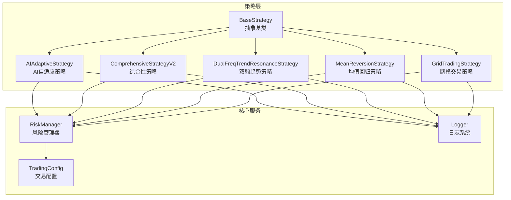

**图表来源**
- [base.py:41-212](file://backpack_quant_trading/strategy/base.py#L41-L212)
- [ai_adaptive.py:12-881](file://backpack_quant_trading/strategy/ai_adaptive.py#L12-L881)
- [comprehensive.py:17-1084](file://backpack_quant_trading/strategy/comprehensive.py#L17-L1084)
- [dual_freq_trend.py:18-931](file://backpack_quant_trading/strategy/dual_freq_trend.py#L18-L931)
- [mean_reversion.py:23-263](file://backpack_quant_trading/strategy/mean_reversion.py#L23-L263)
- [grid_strategy.py:38-1508](file://backpack_quant_trading/strategy/grid_strategy.py#L38-L1508)

**章节来源**
- [base.py:1-212](file://backpack_quant_trading/strategy/base.py#L1-L212)
- [settings.py:104-137](file://backpack_quant_trading/config/settings.py#L104-L137)

## 核心组件

### BaseStrategy抽象基类

BaseStrategy是所有策略的抽象基类，定义了统一的接口规范：

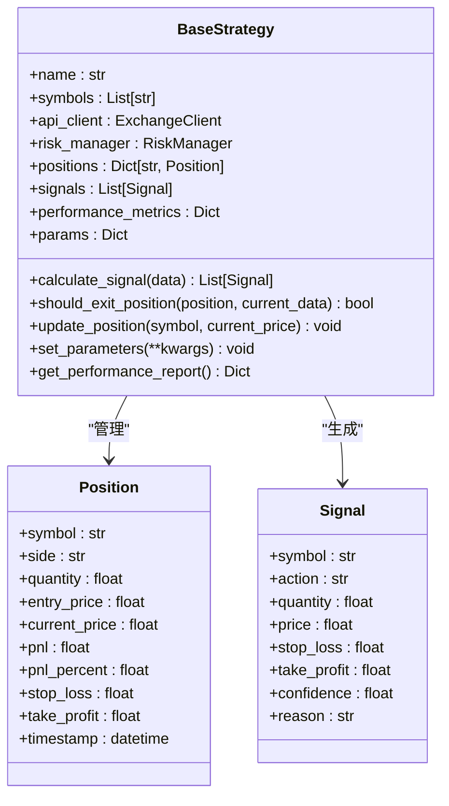

**图表来源**
- [base.py:16-41](file://backpack_quant_trading/strategy/base.py#L16-L41)
- [base.py:41-212](file://backpack_quant_trading/strategy/base.py#L41-L212)

### 策略参数系统

策略参数通过统一的参数管理系统：

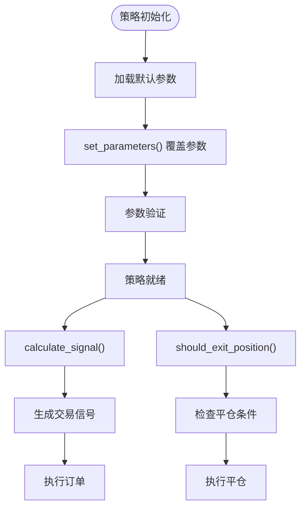

**图表来源**
- [base.py:170-174](file://backpack_quant_trading/strategy/base.py#L170-L174)
- [base.py:71-112](file://backpack_quant_trading/strategy/base.py#L71-L112)

**章节来源**
- [base.py:16-212](file://backpack_quant_trading/strategy/base.py#L16-L212)

## 架构概览

系统采用分层架构设计，各层职责清晰：

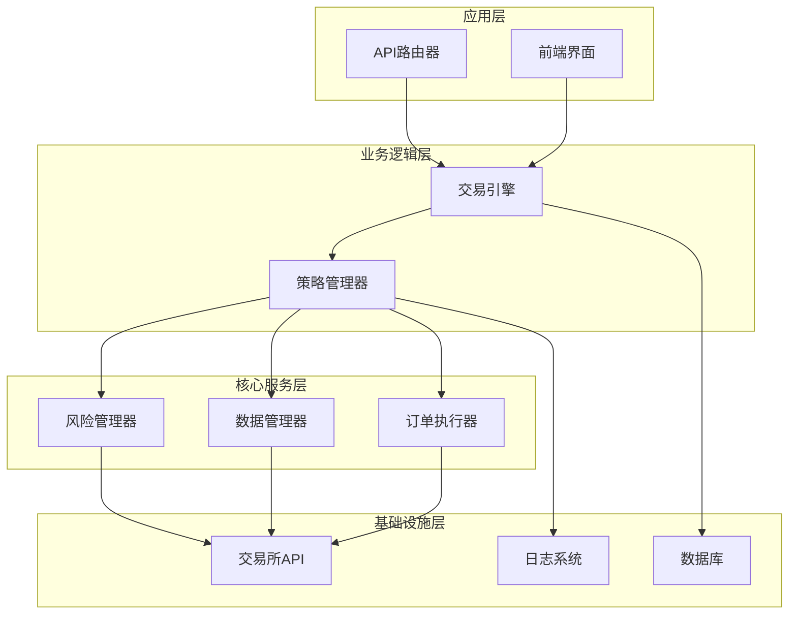

**图表来源**
- [risk_manager.py:48-566](file://backpack_quant_trading/core/risk_manager.py#L48-L566)
- [settings.py:55-65](file://backpack_quant_trading/config/settings.py#L55-L65)

## 详细组件分析

### AI自适应策略

AIAdaptiveStrategy展示了高级AI集成的最佳实践：

#### 计算信号流程

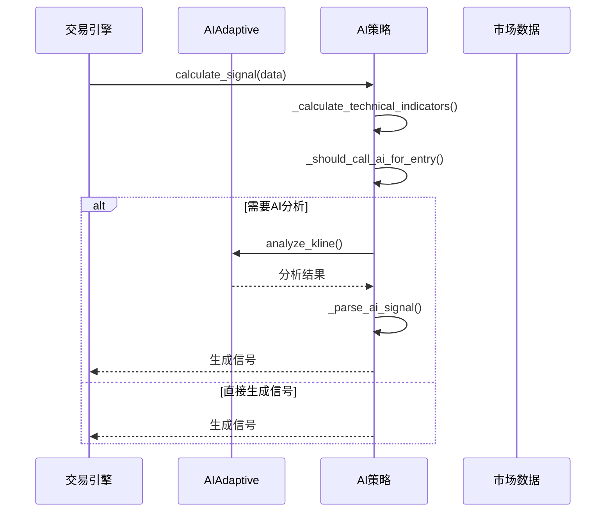

**图表来源**
- [ai_adaptive.py:266-670](file://backpack_quant_trading/strategy/ai_adaptive.py#L266-L670)
- [ai_adaptive.py:672-800](file://backpack_quant_trading/strategy/ai_adaptive.py#L672-L800)

#### 本地指标预筛选机制

AI策略实现了成本优化的本地指标预筛选：

| 指标类型 | 触发条件 | 作用 |
|---------|---------|------|
| RSI | <45 或 >55 | 超买超卖检测 |
| 布林带 | 距离轨道<1% | 支撑阻力检测 |
| MACD | 绝对值>0.5 | 动量信号 |

**章节来源**
- [ai_adaptive.py:80-265](file://backpack_quant_trading/strategy/ai_adaptive.py#L80-L265)

### 综合性策略

ComprehensiveStrategyV2体现了多指标评分系统的复杂逻辑：

#### 多指标评分体系

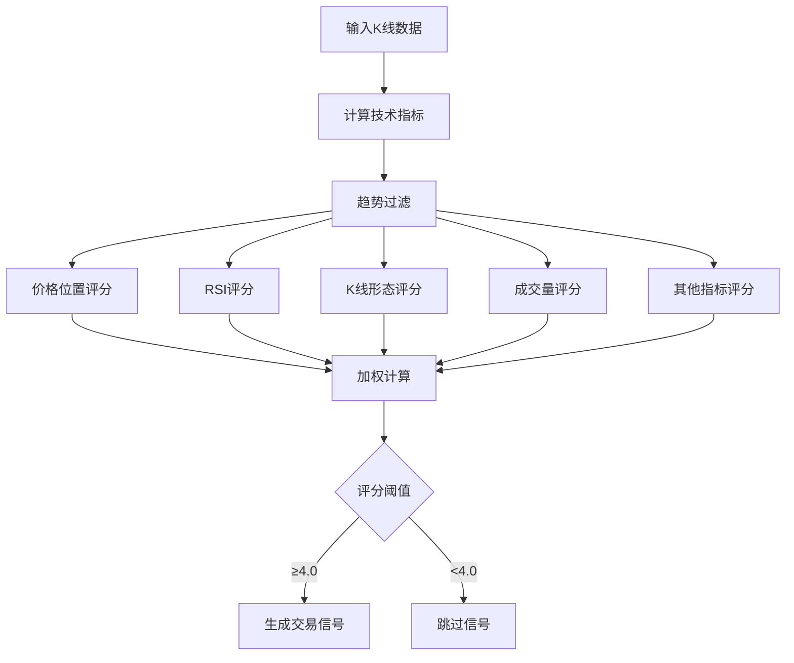

**图表来源**
- [comprehensive.py:224-405](file://backpack_quant_trading/strategy/comprehensive.py#L224-L405)
- [comprehensive.py:92-168](file://backpack_quant_trading/strategy/comprehensive.py#L92-L168)

#### 动态止盈止损机制

综合性策略采用基于ATR的动态风险管理：

| 指标 | 多头 | 空头 | 说明 |
|------|------|------|------|
| 止盈 | 3倍ATR | 3倍ATR | 动态调整 |
| 止损 | 1.5倍ATR | 1.5倍ATR | 风险控制 |
| 默认止盈 | 50% | 50% | 基准值 |
| 默认止损 | 40% | 40% | 风险控制 |

**章节来源**
- [comprehensive.py:782-800](file://backpack_quant_trading/strategy/comprehensive.py#L782-L800)

### 双频趋势策略

DualFreqTrendResonanceStrategy展示了高频交易策略的复杂性：

#### 双频分析框架

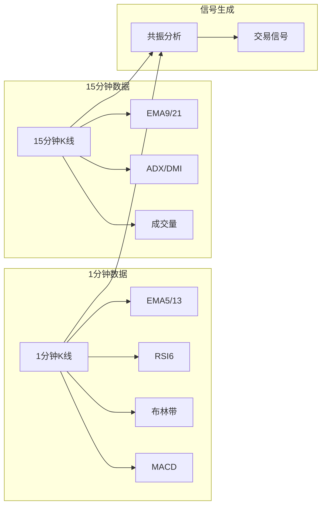

**图表来源**
- [dual_freq_trend.py:170-271](file://backpack_quant_trading/strategy/dual_freq_trend.py#L170-L271)
- [dual_freq_trend.py:289-427](file://backpack_quant_trading/strategy/dual_freq_trend.py#L289-L427)

#### 评分权重系统

| 条件类别 | 权重 | 说明 |
|----------|------|------|
| 趋势 | 1.5 | 趋势方向 |
| 价格位置 | 1.2 | 靠近关键位 |
| RSI信号 | 1.0 | 超买超卖 |
| EMA状态 | 0.9 | 均线方向 |
| MACD信号 | 0.8 | 动量确认 |
| 成交量 | 0.7 | 量价配合 |
| 波动率 | 0.6 | 过滤噪声 |

**章节来源**
- [dual_freq_trend.py:103-123](file://backpack_quant_trading/strategy/dual_freq_trend.py#L103-L123)

### 均值回归策略

MeanReversionStrategy展示了经典技术分析策略的实现：

#### Z-score计算逻辑

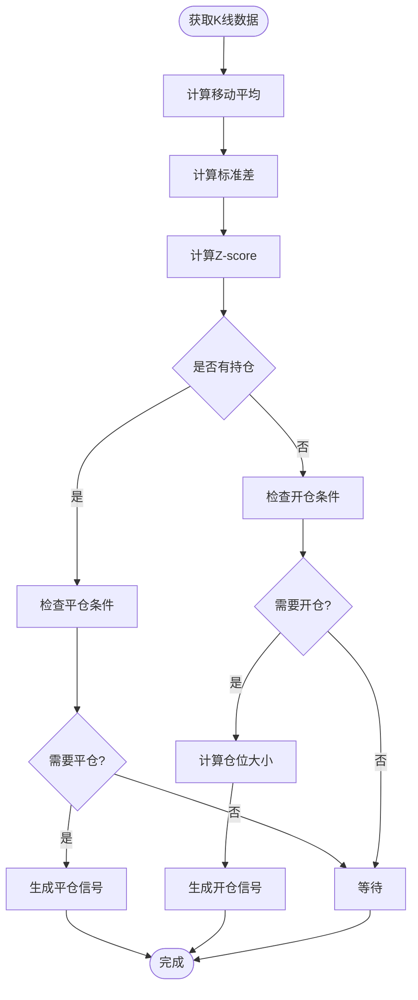

**图表来源**
- [mean_reversion.py:31-117](file://backpack_quant_trading/strategy/mean_reversion.py#L31-L117)
- [mean_reversion.py:119-149](file://backpack_quant_trading/strategy/mean_reversion.py#L119-L149)

#### 仓位管理算法

均值回归策略采用动态仓位管理：

```python
# 仓位计算公式
position_value = margin * leverage
quantity = position_value / price
```

其中：
- `margin`: 保证金（绝对数量）
- `leverage`: 杠杆倍数
- `price`: 当前价格

**章节来源**
- [mean_reversion.py:151-247](file://backpack_quant_trading/strategy/mean_reversion.py#L151-L247)

### 网格交易策略

GridTradingStrategy展示了复杂网格交易的完整实现：

#### 网格层级管理

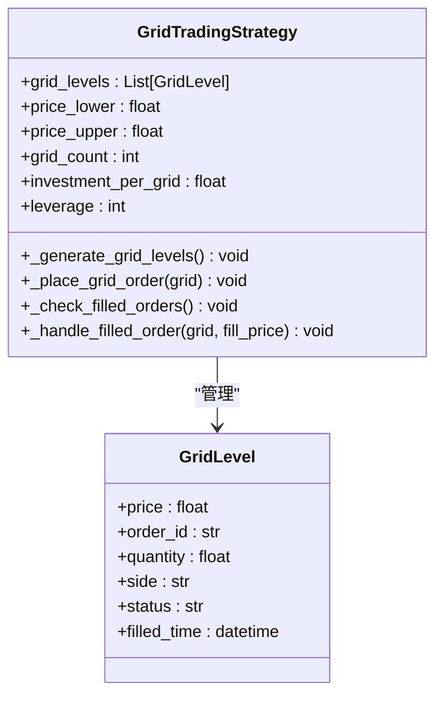

**图表来源**
- [grid_strategy.py:24-38](file://backpack_quant_trading/strategy/grid_strategy.py#L24-L38)
- [grid_strategy.py:157-177](file://backpack_quant_trading/strategy/grid_strategy.py#L157-L177)

#### 订单执行流程

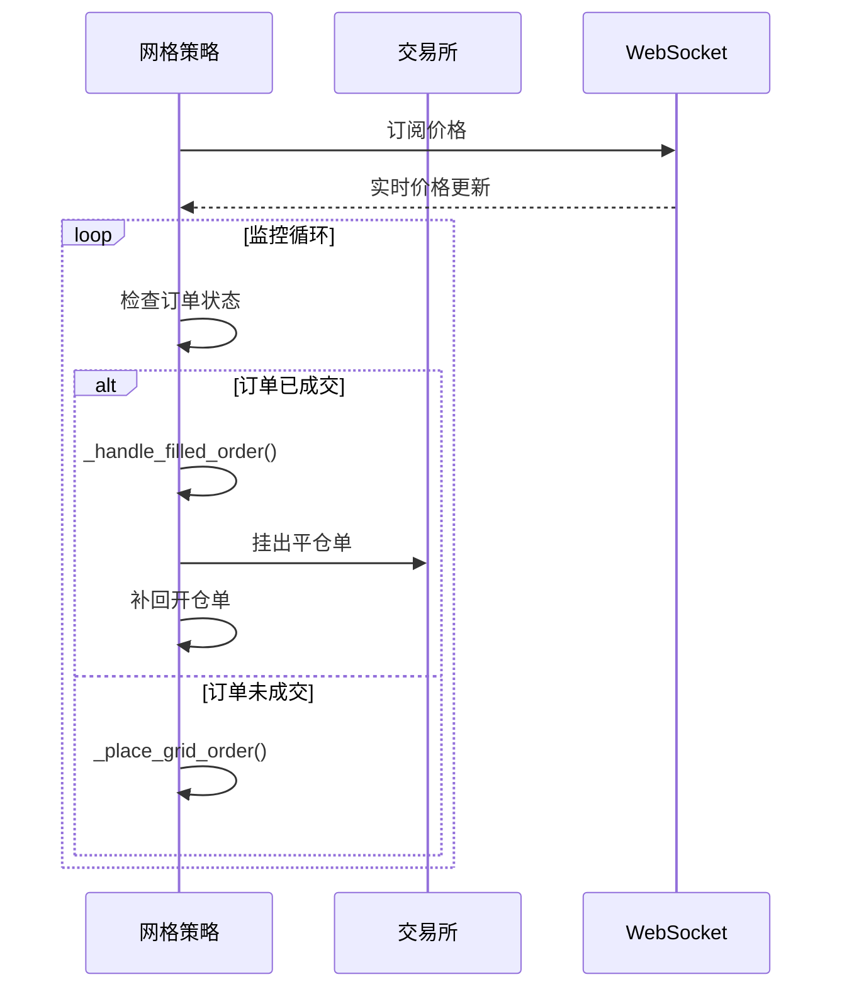

**图表来源**
- [grid_strategy.py:532-597](file://backpack_quant_trading/strategy/grid_strategy.py#L532-L597)
- [grid_strategy.py:599-754](file://backpack_quant_trading/strategy/grid_strategy.py#L599-L754)

**章节来源**
- [grid_strategy.py:38-1508](file://backpack_quant_trading/strategy/grid_strategy.py#L38-L1508)

## 依赖分析

### 核心依赖关系

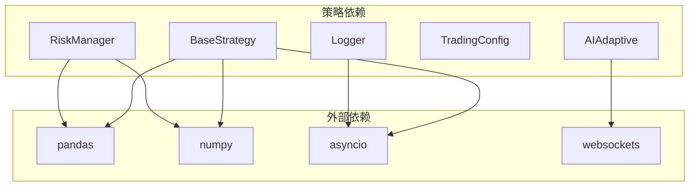

**图表来源**
- [base.py:1-13](file://backpack_quant_trading/strategy/base.py#L1-L13)
- [risk_manager.py:1-11](file://backpack_quant_trading/core/risk_manager.py#L1-L11)

### 策略间耦合度分析

| 策略 | 与其他策略交互 | 内聚性 | 复杂度 |
|------|----------------|--------|--------|
| BaseStrategy | 无 | 高 | 低 |
| AIAdaptive | 仅依赖RiskManager | 中 | 高 |
| Comprehensive | 仅依赖RiskManager | 高 | 中 |
| DualFreq | 仅依赖RiskManager | 中 | 高 |
| MeanReversion | 仅依赖RiskManager | 高 | 中 |
| GridTrading | 无直接依赖 | 低 | 高 |

**章节来源**
- [risk_manager.py:48-566](file://backpack_quant_trading/core/risk_manager.py#L48-L566)

## 性能考虑

### 计算性能优化

1. **AI策略成本优化**
   - 本地指标预筛选降低AI调用频率
   - 成本统计：AI调用次数 vs 节省次数
   - 预筛选通过率可达85%

2. **数据处理优化**
   - 批量数据处理减少API调用
   - 缓存机制避免重复计算
   - 异步处理提升响应速度

3. **内存管理**
   - 及时清理历史数据
   - 控制信号队列长度
   - 优化数据结构存储

### 并发处理

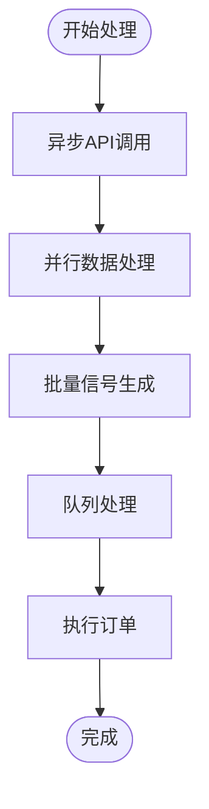

**图表来源**
- [ai_adaptive.py:266-670](file://backpack_quant_trading/strategy/ai_adaptive.py#L266-L670)

## 故障排除指南

### 常见异常处理

#### 网格交易异常

| 异常类型 | 触发条件 | 处理方式 |
|----------|----------|----------|
| 429限频 | API请求过于频繁 | 熔断5秒，降低请求频率 |
| 订单状态异常 | 订单状态查询失败 | 重试机制，最多3次 |
| 价格获取失败 | WebSocket断开 | 切换到REST API轮询 |
| 余额不足 | 账户资金不足 | 跳过开仓，记录警告 |

#### 风险管理异常

| 异常类型 | 触发条件 | 处理方式 |
|----------|----------|----------|
| 保证金超限 | 总保证金超过限制 | 拒绝订单，记录风险事件 |
| 日度亏损超限 | 当日亏损达到限制 | 暂停交易，通知用户 |
| 回撤超限 | 当前回撤接近最大回撤 | 自动平仓部分仓位 |

**章节来源**
- [grid_strategy.py:491-498](file://backpack_quant_trading/strategy/grid_strategy.py#L491-L498)
- [risk_manager.py:173-229](file://backpack_quant_trading/core/risk_manager.py#L173-L229)

### 日志记录最佳实践

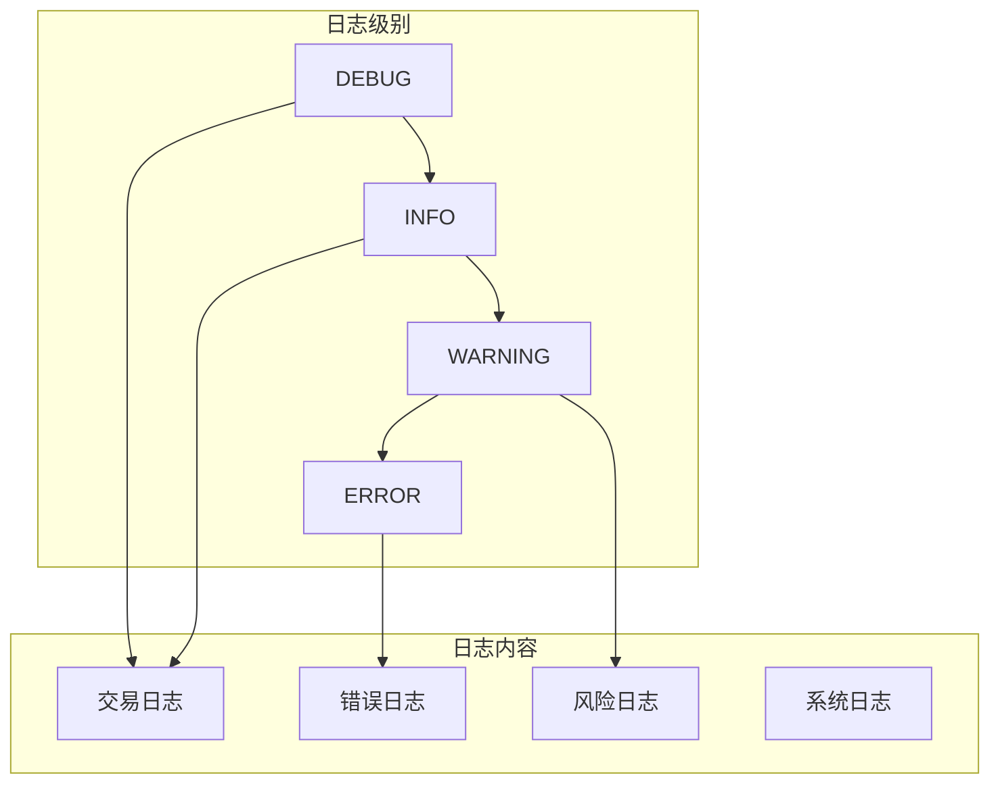

**图表来源**
- [logger.py:137-180](file://backpack_quant_trading/utils/logger.py#L137-L180)

**章节来源**
- [logger.py:57-125](file://backpack_quant_trading/utils/logger.py#L57-L125)

## 结论

本策略系统提供了完整的量化交易解决方案，具有以下特点：

1. **模块化设计**：BaseStrategy抽象基类确保了策略的一致性和可扩展性
2. **多样化策略**：涵盖技术分析、AI自适应、网格交易等多种交易模式
3. **风险管理**：完善的风控体系确保交易安全性
4. **性能优化**：针对不同策略类型进行了专门的性能优化
5. **异常处理**：全面的异常处理机制保证系统稳定性

推荐开发者在实现新策略时遵循以下原则：
- 严格实现BaseStrategy接口
- 合理使用参数系统
- 建立完善的日志记录
- 实施有效的风险管理
- 进行充分的性能测试

## 附录

### 策略开发模板

#### 基础策略模板

```python
from strategy.base import BaseStrategy, Signal, Position

class CustomStrategy(BaseStrategy):
    def __init__(self, symbols, api_client, risk_manager):
        super().__init__("CustomStrategy", symbols, api_client, risk_manager)
        # 初始化策略参数
        self.params = {
            'param1': 10,
            'param2': 0.05
        }
    
    async def calculate_signal(self, data: Dict[str, pd.DataFrame]) -> List[Signal]:
        """实现信号计算逻辑"""
        signals = []
        # 你的信号计算代码
        return signals
    
    def should_exit_position(self, position: Position, current_data: pd.Series) -> bool:
        """实现平仓判断逻辑"""
        # 你的平仓判断代码
        return False
```

#### 风险控制模板

```python
def validate_position(self, symbol: str, margin: float, account_capital: float = None) -> bool:
    """验证仓位大小"""
    # 检查日度风险指标
    self.reset_daily_metrics()
    
    # 检查保证金限制
    total_margin_used = sum(pos.get('margin', 0.0) for pos in self.positions.values())
    max_margin = account_capital * self.trading_config.MAX_POSITION_SIZE
    
    if total_margin_used > max_margin:
        return False
    
    return True
```

### 最佳实践清单

1. **参数管理**
   - 使用set_parameters()统一管理参数
   - 建立参数验证机制
   - 提供合理的默认值

2. **信号质量**
   - 实施多重确认机制
   - 设置置信度评估
   - 建立信号过滤规则

3. **风险管理**
   - 实施动态止损止盈
   - 建立日度限额
   - 监控最大回撤

4. **性能监控**
   - 记录关键指标
   - 建立性能报告
   - 实施异常告警

5. **代码质量**
   - 保持代码简洁
   - 添加详细注释
   - 实施单元测试