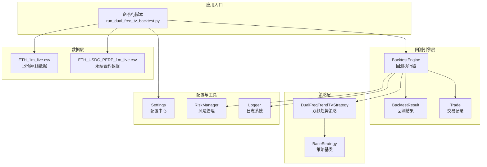
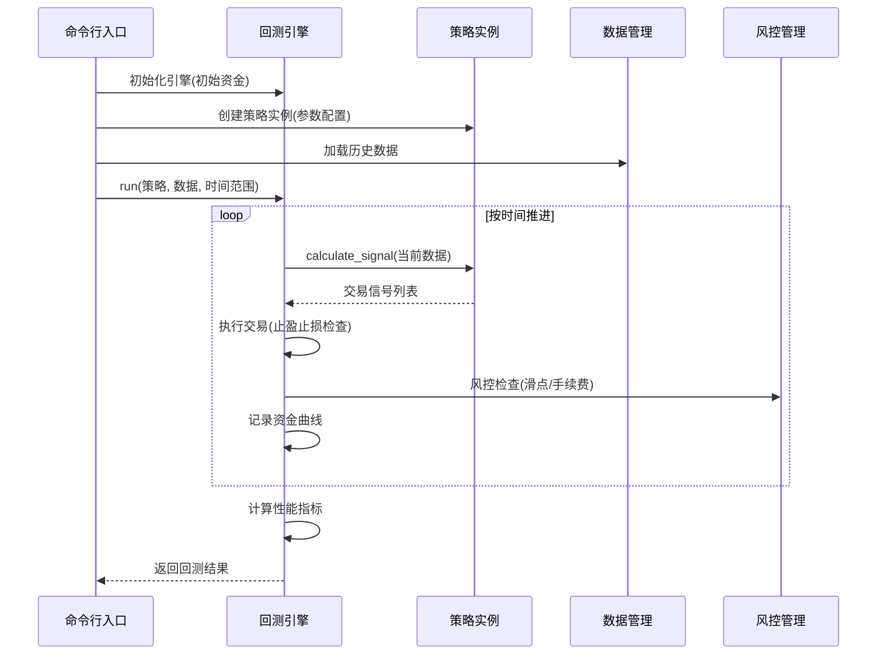
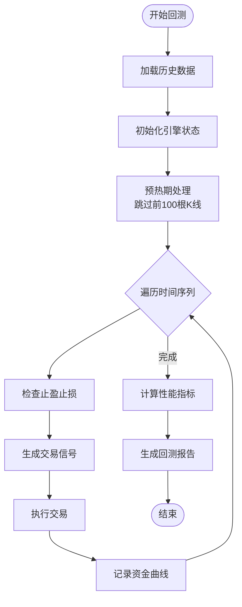
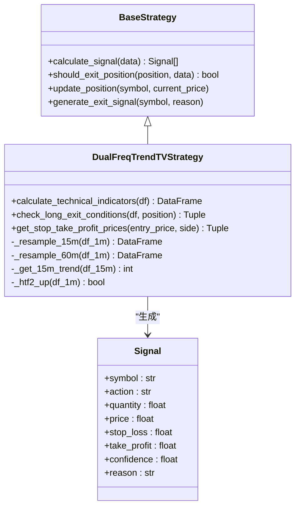
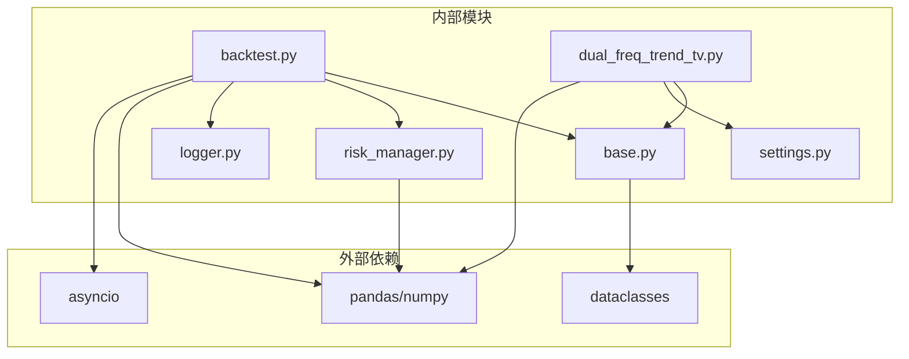

# 策略回测验证

<cite>
**本文档引用的文件**
- [backtest.py](file://backpack_quant_trading/engine/backtest.py)
- [base.py](file://backpack_quant_trading/strategy/base.py)
- [dual_freq_trend_tv.py](file://backpack_quant_trading/strategy/dual_freq_trend_tv.py)
- [run_dual_freq_tv_backtest.py](file://backpack_quant_trading/run_dual_freq_tv_backtest.py)
- [settings.py](file://backpack_quant_trading/config/settings.py)
- [risk_manager.py](file://backpack_quant_trading/core/risk_manager.py)
- [logger.py](file://backpack_quant_trading/utils/logger.py)
- [ETH_1m_live.csv](file://backpack_quant_trading/data/ETH_1m_live.csv)
- [ETH_USDC_PERP_1m_live.csv](file://backpack_quant_trading/data/ETH_USDC_PERP_1m_live.csv)
</cite>

## 目录
1. [简介](#简介)
2. [项目结构](#项目结构)
3. [核心组件](#核心组件)
4. [架构概览](#架构概览)
5. [详细组件分析](#详细组件分析)
6. [依赖关系分析](#依赖关系分析)
7. [性能考虑](#性能考虑)
8. [故障排除指南](#故障排除指南)
9. [结论](#结论)
10. [附录](#附录)

## 简介
本指南面向量化交易开发者，系统阐述如何使用项目中的回测框架验证策略有效性。内容涵盖历史数据准备、回测引擎使用、性能指标计算、结果分析，以及过拟合检测、样本外测试、压力测试等高级验证技术。通过双频趋势共振策略的完整回测流程，帮助读者建立从数据到决策的闭环验证体系。

## 项目结构
项目采用分层架构组织，核心回测能力集中在引擎层，策略层提供可扩展的策略实现，配置层统一管理交易参数，数据层提供历史K线数据。



**图表来源**
- [run_dual_freq_tv_backtest.py:1-125](file://backpack_quant_trading/run_dual_freq_tv_backtest.py#L1-L125)
- [backtest.py:48-187](file://backpack_quant_trading/engine/backtest.py#L48-L187)
- [dual_freq_trend_tv.py:17-360](file://backpack_quant_trading/strategy/dual_freq_trend_tv.py#L17-L360)

**章节来源**
- [run_dual_freq_tv_backtest.py:1-125](file://backpack_quant_trading/run_dual_freq_tv_backtest.py#L1-L125)
- [backtest.py:48-187](file://backpack_quant_trading/engine/backtest.py#L48-L187)
- [dual_freq_trend_tv.py:17-360](file://backpack_quant_trading/strategy/dual_freq_trend_tv.py#L17-L360)

## 核心组件
本节深入解析回测系统的关键组件及其职责分工。

### 回测引擎（BacktestEngine）
回测引擎是整个系统的核心执行器，负责：
- **数据驱动回放**：按时间序列逐根K线推进，模拟真实市场环境
- **信号执行**：根据策略信号执行买卖操作，支持双向持仓
- **风险控制**：内置滑点、手续费、冷却期等市场摩擦因素
- **指标计算**：自动计算收益率、最大回撤、胜率、夏普比率等关键指标

### 策略基类（BaseStrategy）
策略基类定义了所有策略的通用接口和基础设施：
- **信号生成**：统一的Signal数据结构，包含交易方向、价格、止盈止损等信息
- **仓位管理**：Position数据类封装持仓状态和实时盈亏计算
- **性能接口**：提供性能报告生成的基础能力

### 双频趋势策略（DualFreqTrendTVStrategy）
该策略实现了复杂的多指标组合：
- **多时间框架**：1分钟入场、15分钟趋势过滤、60分钟过滤
- **技术指标**：EMA、RSI、布林带、MACD、ATR等20+指标
- **入场条件**：结合价格位置、成交量、突破形态等多重信号
- **风控机制**：动态止盈止损、时间止损、日度损失控制

**章节来源**
- [backtest.py:48-187](file://backpack_quant_trading/engine/backtest.py#L48-L187)
- [base.py:41-212](file://backpack_quant_trading/strategy/base.py#L41-L212)
- [dual_freq_trend_tv.py:17-360](file://backpack_quant_trading/strategy/dual_freq_trend_tv.py#L17-L360)

## 架构概览
回测系统采用"策略-引擎-数据"三层架构，通过异步协程实现高效的数据流处理。



**图表来源**
- [run_dual_freq_tv_backtest.py:56-125](file://backpack_quant_trading/run_dual_freq_tv_backtest.py#L56-L125)
- [backtest.py:65-187](file://backpack_quant_trading/engine/backtest.py#L65-L187)
- [dual_freq_trend_tv.py:206-348](file://backpack_quant_trading/strategy/dual_freq_trend_tv.py#L206-L348)

## 详细组件分析

### 回测引擎执行流程
回测引擎的核心执行逻辑遵循严格的时序控制：



**图表来源**
- [backtest.py:65-187](file://backpack_quant_trading/engine/backtest.py#L65-L187)

#### 关键执行细节
- **预热期处理**：跳过前100根K线，确保技术指标充分计算
- **止盈止损优先**：持仓状态下优先检查技术指标和价格触发条件
- **信号冷却机制**：平仓后20根K线内禁止开新仓，避免过度交易
- **滑点与手续费**：买入加滑点、卖出减滑点，按保证金收取手续费

**章节来源**
- [backtest.py:82-187](file://backpack_quant_trading/engine/backtest.py#L82-L187)

### 策略信号生成机制
双频趋势策略的信号生成采用多指标融合算法：



**图表来源**
- [base.py:41-212](file://backpack_quant_trading/strategy/base.py#L41-L212)
- [dual_freq_trend_tv.py:17-360](file://backpack_quant_trading/strategy/dual_freq_trend_tv.py#L17-L360)

#### 技术指标计算
策略实现包含20+技术指标的计算：
- **趋势指标**：EMA5/13、EMA9/21、MACD
- **动量指标**：RSI(6)、KDJ、Momentum
- **波动率指标**：ATR、布林带宽度
- **成交量指标**：成交量均值、成交量比率

**章节来源**
- [dual_freq_trend_tv.py:103-132](file://backpack_quant_trading/strategy/dual_freq_trend_tv.py#L103-L132)
- [dual_freq_trend_tv.py:134-204](file://backpack_quant_trading/strategy/dual_freq_trend_tv.py#L134-L204)

### 性能指标计算详解
回测引擎提供完整的风险收益指标计算：

```mermaid
flowchart LR
subgraph "收益率计算"
A1[计算每日收益] --> A2[转换为百分比变化]
A2 --> A3[总收益率 = (期末/期初-1)*100%]
A3 --> A4[年化收益率 = ((1+总收益)^(365/天数)-1)*100%]
end
subgraph "风险指标"
B1[滚动最高净值] --> B2[计算回撤 = (净值-峰值)/峰值]
B2 --> B3[最大回撤 = min(回撤)*100%]
end
subgraph "夏普比率"
C1[日收益序列] --> C2[计算期望收益]
C2 --> C3[计算标准差]
C3 --> C4[夏普 = 期望收益*sqrt(252)/标准差]
end
subgraph "胜率与盈亏比"
D1[统计已平仓交易] --> D2[盈利交易/总交易*100%]
D2 --> D3[总盈利/总亏损]
end
```

**图表来源**
- [backtest.py:333-383](file://backpack_quant_trading/engine/backtest.py#L333-L383)

**章节来源**
- [backtest.py:333-383](file://backpack_quant_trading/engine/backtest.py#L333-L383)

## 依赖关系分析
系统采用松耦合设计，各组件通过清晰的接口交互。



**图表来源**
- [backtest.py:1-13](file://backpack_quant_trading/engine/backtest.py#L1-L13)
- [base.py:1-13](file://backpack_quant_trading/strategy/base.py#L1-L13)
- [dual_freq_trend_tv.py:8-14](file://backpack_quant_trading/strategy/dual_freq_trend_tv.py#L8-L14)

**章节来源**
- [backtest.py:1-13](file://backpack_quant_trading/engine/backtest.py#L1-L13)
- [base.py:1-13](file://backpack_quant_trading/strategy/base.py#L1-L13)

## 性能考虑
回测系统在性能方面采取了多项优化措施：

### 时间复杂度优化
- **数据预处理**：使用pandas向量化操作，避免Python循环
- **指标缓存**：技术指标计算结果复用，减少重复计算
- **内存管理**：及时清理不需要的历史数据，控制内存占用

### 并发处理
- **异步信号计算**：策略信号计算采用async模式，提升并发性能
- **批量数据处理**：支持多交易对同时回测

### 风险控制参数
系统配置了严格的风险控制参数：
- **最大单日亏损**：5%（可配置）
- **最大回撤限制**：15%（可配置）
- **单笔最大仓位**：50%（可配置）
- **滑点**：0.05%（可配置）
- **手续费**：0.1%（可配置）

**章节来源**
- [settings.py:55-65](file://backpack_quant_trading/config/settings.py#L55-L65)
- [risk_manager.py:48-58](file://backpack_quant_trading/core/risk_manager.py#L48-L58)

## 故障排除指南

### 常见问题诊断
1. **数据格式错误**
   - 确认CSV包含timestamp/open/high/low/close/volume列
   - 检查时间列为可解析格式
   - 验证数据无缺失值

2. **回测结果异常**
   - 检查预热期设置是否合理
   - 确认策略参数配置正确
   - 验证风险控制参数设置

3. **性能指标异常**
   - 检查交易记录完整性
   - 确认资金曲线连续性
   - 验证时间序列排序

### 日志分析
系统提供详细的日志记录：
- **交易日志**：记录每笔交易的详细信息
- **信号日志**：记录信号生成和执行过程
- **错误日志**：记录异常情况和错误信息

**章节来源**
- [logger.py:137-180](file://backpack_quant_trading/utils/logger.py#L137-L180)

## 结论
本回测验证体系提供了从数据准备到结果分析的完整解决方案。通过双频趋势策略的实际应用，展示了如何构建可靠的策略验证流程。建议在实际使用中重点关注数据质量、参数敏感性分析和风险控制参数的合理性设置。

## 附录

### 数据准备最佳实践
1. **数据质量检查**
   - 缺失值处理：使用前向填充或插值
   - 异常值检测：识别极端波动和跳空缺口
   - 数据连续性：确保时间序列无断点

2. **数据格式标准化**
   - 统一时间格式和精度
   - 标准化列名和数据类型
   - 建立数据质量报告

### 高级验证技术
1. **过拟合检测**
   - 随机游走检验：比较策略与随机买卖的差异
   - 参数扰动测试：微调参数观察收益稳定性
   - 时间分割验证：不同时间段独立验证

2. **样本外测试**
   - 时间分割：使用历史早期数据训练，后期数据测试
   - 交叉验证：多时间段轮换验证
   - 压力测试：极端市场条件下的表现评估

3. **压力测试**
   - 市场崩盘情景：30-50%跌幅情景
   - 流动性危机：交易量异常放大情景
   - 黑天鹅事件：监管政策变化情景

### 性能指标解释
- **总收益率**：策略在整个回测期内的总收益
- **年化收益率**：将总收益折算为年化水平
- **夏普比率**：风险调整后的收益指标
- **最大回撤**：从峰值到谷底的最大跌幅
- **胜率**：盈利交易占总交易的比例
- **盈亏比**：平均盈利与平均亏损的比值