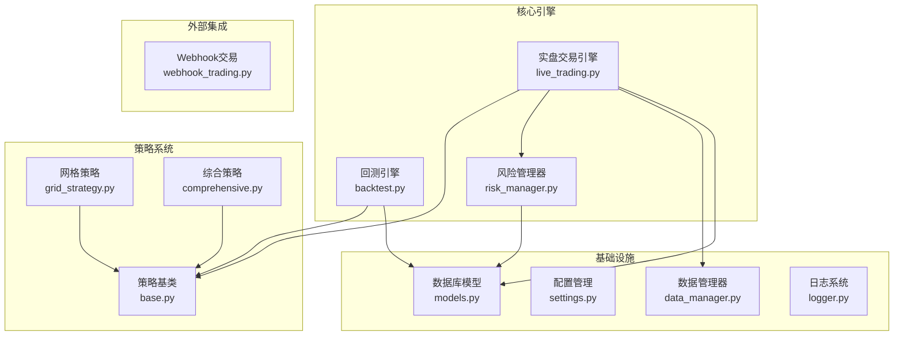
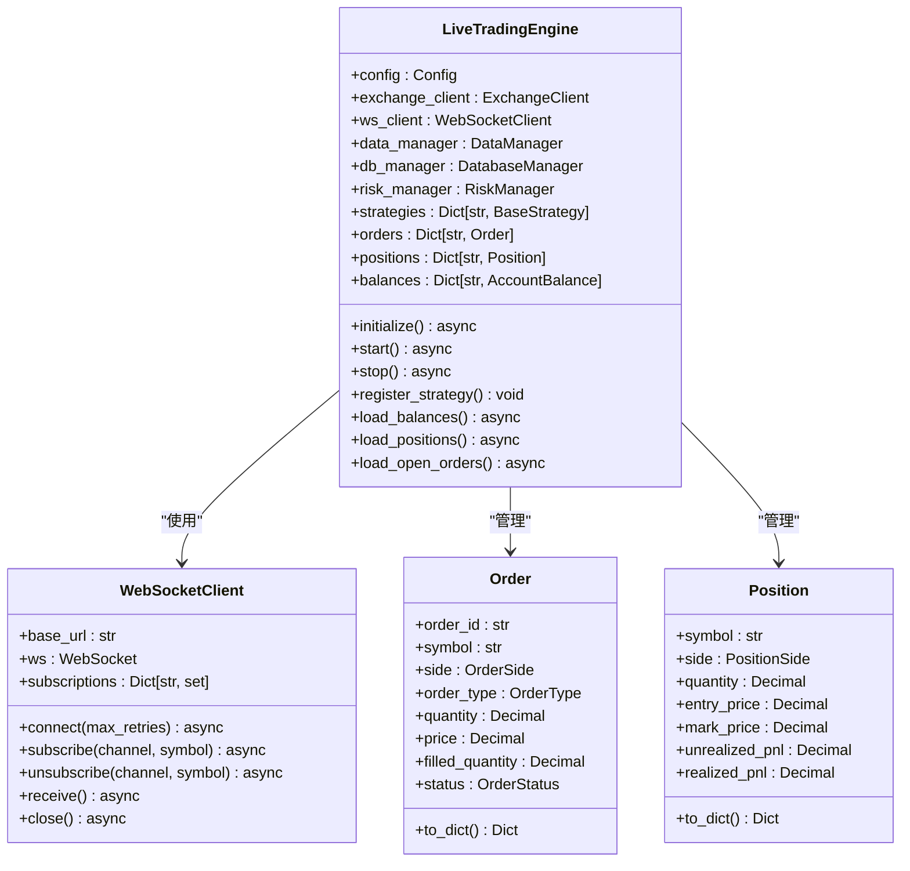
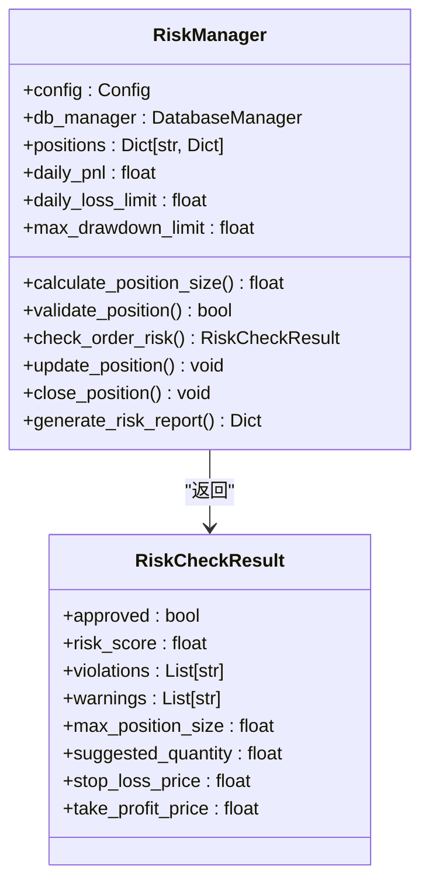
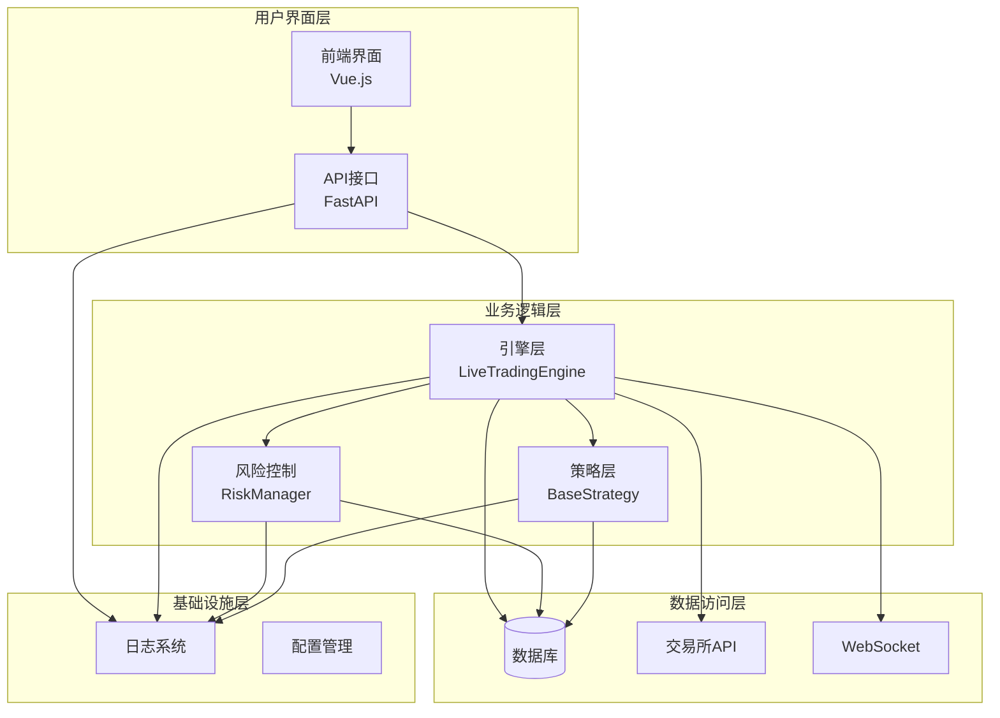
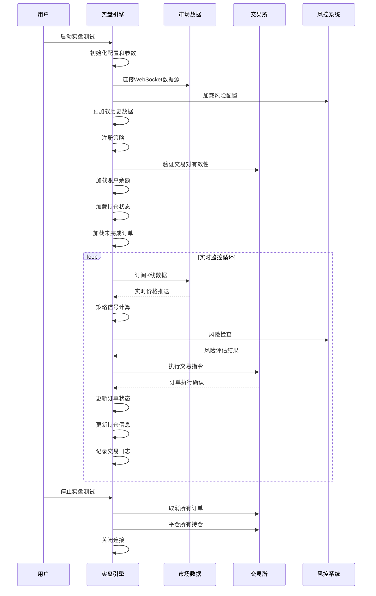
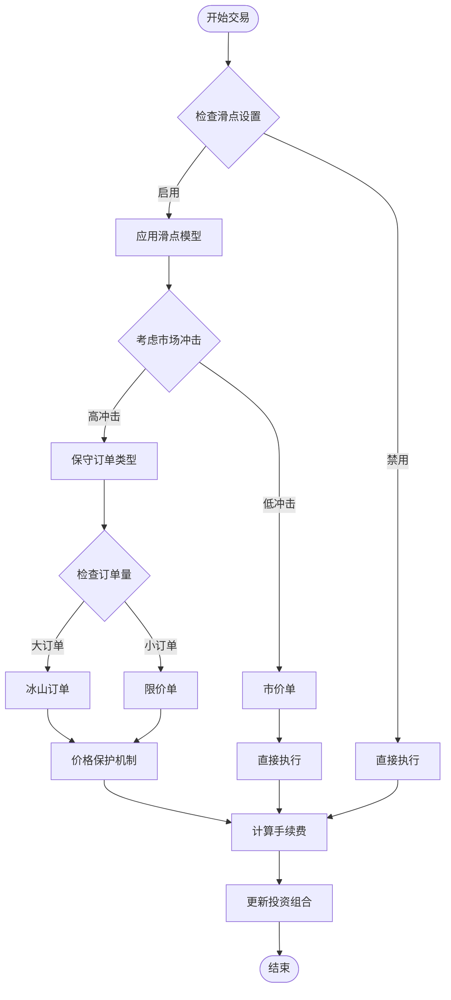
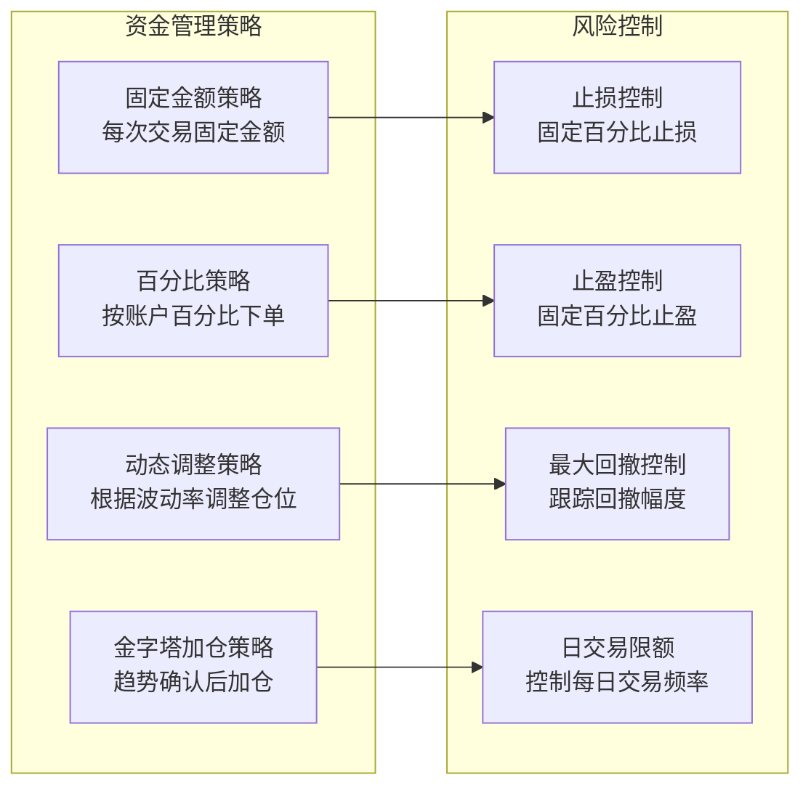
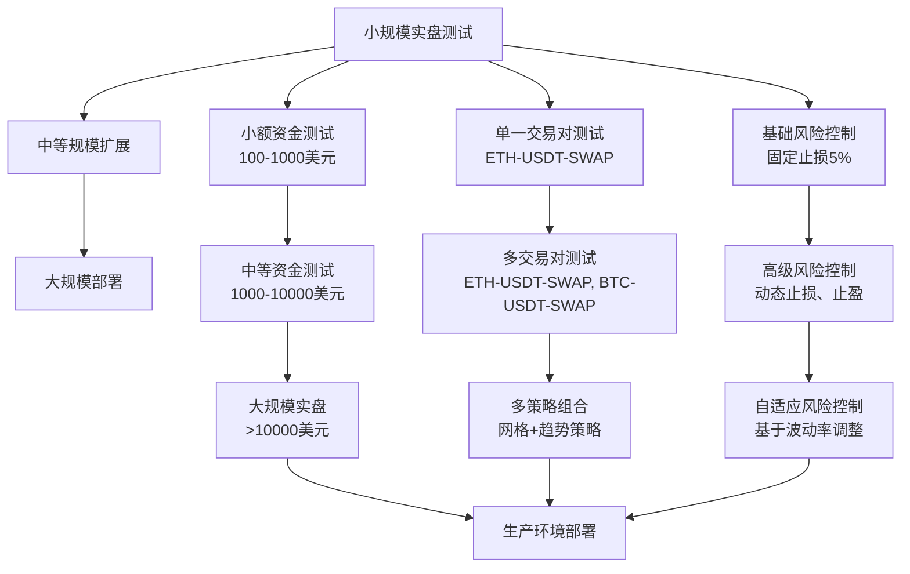
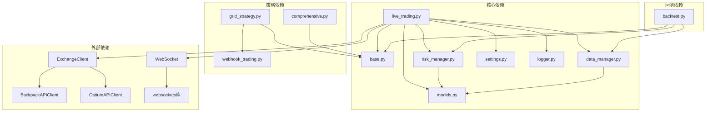

# 策略实盘测试

<cite>
**本文档引用的文件**
- [live_trading.py](file://backpack_quant_trading/engine/live_trading.py)
- [backtest.py](file://backpack_quant_trading/engine/backtest.py)
- [risk_manager.py](file://backpack_quant_trading/core/risk_manager.py)
- [settings.py](file://backpack_quant_trading/config/settings.py)
- [base.py](file://backpack_quant_trading/strategy/base.py)
- [data_manager.py](file://backpack_quant_trading/core/data_manager.py)
- [models.py](file://backpack_quant_trading/database/models.py)
- [logger.py](file://backpack_quant_trading/utils/logger.py)
- [grid_strategy.py](file://backpack_quant_trading/strategy/grid_strategy.py)
- [comprehensive.py](file://backpack_quant_trading/strategy/comprehensive.py)
- [webhook_trading.py](file://backpack_quant_trading/engine/webhook_trading.py)
</cite>

## 目录
1. [简介](#简介)
2. [项目结构](#项目结构)
3. [核心组件](#核心组件)
4. [架构概览](#架构概览)
5. [详细组件分析](#详细组件分析)
6. [依赖关系分析](#依赖关系分析)
7. [性能考虑](#性能考虑)
8. [故障排除指南](#故障排除指南)
9. [结论](#结论)
10. [附录](#附录)

## 简介

策略实盘测试是在真实市场环境中验证量化交易策略有效性的关键环节。本文档基于背包量化交易系统的完整代码库，详细阐述了实盘测试的实施方法，包括模拟交易、资金管理、风险控制、交易成本考虑等核心要素。

实盘测试与回测存在本质差异：回测使用历史数据进行"完美"模拟，而实盘测试面对真实的市场环境、流动性变化、滑点、手续费等现实因素。本文档提供了完整的实盘测试指南，帮助用户在真实市场环境中验证和优化交易策略。

## 项目结构

背包量化交易系统采用模块化架构设计，主要包含以下核心模块：



**图表来源**
- [live_trading.py:347-567](file://backpack_quant_trading/engine/live_trading.py#L347-L567)
- [backtest.py:48-187](file://backpack_quant_trading/engine/backtest.py#L48-L187)
- [risk_manager.py:48-229](file://backpack_quant_trading/core/risk_manager.py#L48-L229)

**章节来源**
- [live_trading.py:1-2223](file://backpack_quant_trading/engine/live_trading.py#L1-L2223)
- [backtest.py:1-404](file://backpack_quant_trading/engine/backtest.py#L1-L404)
- [risk_manager.py:1-566](file://backpack_quant_trading/core/risk_manager.py#L1-L566)

## 核心组件

### 实盘交易引擎

实盘交易引擎是系统的核心执行组件，负责连接真实市场数据、执行交易指令、管理订单状态和风险控制。



**图表来源**
- [live_trading.py:347-407](file://backpack_quant_trading/engine/live_trading.py#L347-L407)
- [live_trading.py:50-124](file://backpack_quant_trading/engine/live_trading.py#L50-L124)

### 风险管理系统

风险管理系统提供多层次的风险控制机制，包括仓位限制、止损止盈、最大回撤控制等。



**图表来源**
- [risk_manager.py:48-229](file://backpack_quant_trading/core/risk_manager.py#L48-L229)

**章节来源**
- [live_trading.py:347-567](file://backpack_quant_trading/engine/live_trading.py#L347-L567)
- [risk_manager.py:1-566](file://backpack_quant_trading/core/risk_manager.py#L1-L566)

## 架构概览

系统采用分层架构设计，确保各组件职责清晰、耦合度低：



**图表来源**
- [main.py:14-53](file://backpack_quant_trading/api/main.py#L14-L53)
- [live_trading.py:347-370](file://backpack_quant_trading/engine/live_trading.py#L347-L370)

## 详细组件分析

### 实盘测试实施流程

实盘测试的完整实施流程如下：



**图表来源**
- [live_trading.py:536-567](file://backpack_quant_trading/engine/live_trading.py#L536-L567)
- [live_trading.py:443-535](file://backpack_quant_trading/engine/live_trading.py#L443-L535)

### 滑点处理机制

系统实现了多种滑点处理策略：



**图表来源**
- [backtest.py:218-330](file://backpack_quant_trading/engine/backtest.py#L218-L330)

### 交易成本计算

系统提供全面的交易成本计算框架：

| 成本类型 | 计算公式 | 实盘考虑因素 |
|---------|---------|-------------|
| 交易手续费 | 交易额 × 手续费率 | 交易所费率结构、VIP等级 |
| 滑点成本 | 交易量 × 滑点率 × 均价 | 流动性、订单规模、市场波动 |
| 机会成本 | (基准收益 - 实际收益) × 交易频率 | 市场冲击、执行质量 |
| 资金占用成本 | 资金 × 无风险利率 × 时间 | 资金利用率、时间价值 |

**章节来源**
- [backtest.py:62-63](file://backpack_quant_trading/engine/backtest.py#L62-L63)
- [backtest.py:218-330](file://backpack_quant_trading/engine/backtest.py#L218-L330)

### 资金管理策略

系统实现多种资金管理策略：



**图表来源**
- [risk_manager.py:78-85](file://backpack_quant_trading/core/risk_manager.py#L78-L85)
- [risk_manager.py:132-229](file://backpack_quant_trading/core/risk_manager.py#L132-L229)

**章节来源**
- [risk_manager.py:78-131](file://backpack_quant_trading/core/risk_manager.py#L78-L131)

### 实盘测试关键要素

#### 1. 账户设置

实盘测试需要完善的账户配置：

- **交易所API配置**：设置API密钥、代理设置、请求频率限制
- **账户验证**：验证交易对有效性、检查账户余额
- **风险参数配置**：设置最大仓位、止损比例、最大回撤限制

#### 2. 参数调整

实盘测试参数需要根据市场环境动态调整：

- **滑点参数**：根据流动性调整滑点容忍度
- **手续费参数**：实时监控实际手续费率
- **风险参数**：根据市场波动调整风险控制参数

#### 3. 监控指标

实盘测试需要监控的关键指标：

- **交易执行质量**：订单填充率、执行价格偏差
- **风险指标**：最大回撤、日度亏损、风险评分
- **策略表现**：收益率、胜率、夏普比率

#### 4. 异常处理

实盘测试的异常处理机制：

- **网络异常**：WebSocket断线重连、API请求重试
- **系统异常**：订单状态异常、仓位同步异常
- **市场异常**：流动性枯竭、价格异常波动

**章节来源**
- [live_trading.py:153-235](file://backpack_quant_trading/engine/live_trading.py#L153-L235)
- [live_trading.py:569-586](file://backpack_quant_trading/engine/live_trading.py#L569-L586)

### 实盘测试与回测差异分析

| 方面 | 回测 | 实盘测试 |
|------|------|----------|
| **数据质量** | 历史数据，可能存在偏差 | 实时数据，包含噪声和缺失 |
| **执行环境** | 完美执行，无滑点 | 存在滑点、手续费、市场冲击 |
| **流动性假设** | 假设无限流动性 | 需要考虑流动性限制 |
| **交易成本** | 简化模型 | 实际手续费、滑点成本 |
| **风险控制** | 理想化控制 | 实际风险事件应对 |
| **系统可靠性** | 代码层面验证 | 生产环境稳定性考验 |

**章节来源**
- [backtest.py:65-187](file://backpack_quant_trading/engine/backtest.py#L65-L187)
- [live_trading.py:347-567](file://backpack_quant_trading/engine/live_trading.py#L347-L567)

### 逐步扩大实盘规模策略

系统提供了渐进式的实盘扩展机制：



**图表来源**
- [grid_strategy.py:132-140](file://backpack_quant_trading/strategy/grid_strategy.py#L132-L140)
- [comprehensive.py:65-70](file://backpack_quant_trading/strategy/comprehensive.py#L65-L70)

**章节来源**
- [grid_strategy.py:179-280](file://backpack_quant_trading/strategy/grid_strategy.py#L179-L280)
- [comprehensive.py:17-91](file://backpack_quant_trading/strategy/comprehensive.py#L17-L91)

## 依赖关系分析

系统组件之间的依赖关系如下：



**图表来源**
- [live_trading.py:14-18](file://backpack_quant_trading/engine/live_trading.py#L14-L18)
- [base.py:9-11](file://backpack_quant_trading/strategy/base.py#L9-L11)

**章节来源**
- [live_trading.py:1-50](file://backpack_quant_trading/engine/live_trading.py#L1-L50)
- [base.py:1-20](file://backpack_quant_trading/strategy/base.py#L1-L20)

## 性能考虑

实盘测试的性能优化策略：

### 1. 数据处理优化

- **缓存机制**：使用内存缓存减少API调用频率
- **批量处理**：合并多个交易对的数据处理
- **异步处理**：使用异步IO提高并发处理能力

### 2. 内存管理

- **数据清理**：定期清理过期的市场数据缓存
- **对象池**：复用订单和仓位对象减少GC压力
- **内存监控**：实时监控内存使用情况

### 3. 网络优化

- **连接池**：复用HTTP连接减少握手开销
- **压缩传输**：启用GZIP压缩减少网络流量
- **断线重连**：智能重连机制避免长时间离线

## 故障排除指南

### 常见问题及解决方案

#### 1. WebSocket连接问题

**问题症状**：无法接收实时数据，连接频繁断开

**诊断步骤**：
1. 检查网络连接状态
2. 验证代理设置
3. 检查防火墙配置

**解决方案**：
```python
# 检查WebSocket连接状态
if not ws_client._is_connected():
    await ws_client.connect(max_retries=3)

# 配置代理支持
proxy_url = os.environ.get('HTTPS_PROXY')
if proxy_url:
    # 检查websockets库版本
    import inspect
    connect_signature = inspect.signature(websockets.connect)
    supports_proxy = 'proxy' in connect_signature.parameters
```

#### 2. 交易执行异常

**问题症状**：订单提交失败，状态异常

**诊断步骤**：
1. 检查API密钥有效性
2. 验证账户余额充足
3. 确认交易对可用性

**解决方案**：
```python
# 风险检查
risk_result = risk_manager.check_order_risk(
    symbol=symbol,
    side=side,
    quantity=quantity,
    price=price,
    current_price=current_price
)

if risk_result.approved:
    # 执行交易
    await exchange_client.execute_order(...)
else:
    # 记录风险事件
    db_manager.save_risk_event(
        event_type='order_rejected',
        severity='high',
        description=f"订单被拒绝: {risk_result.violations}"
    )
```

#### 3. 数据同步问题

**问题症状**：订单状态不同步，仓位信息不准确

**诊断步骤**：
1. 检查订单查询API响应
2. 验证数据库连接状态
3. 确认事件处理队列

**解决方案**：
```python
# 异步订单状态检查
async def check_order_status(self, order_id: str):
    try:
        order = await self.exchange_client.get_order(order_id)
        if order:
            # 更新本地订单状态
            self.orders[order_id].status = order.status
            self.orders[order_id].filled_quantity = order.filled_quantity
            return True
    except Exception as e:
        logger.error(f"查询订单状态失败: {e}")
        return False
```

**章节来源**
- [live_trading.py:153-235](file://backpack_quant_trading/engine/live_trading.py#L153-L235)
- [live_trading.py:744-794](file://backpack_quant_trading/engine/live_trading.py#L744-L794)
- [risk_manager.py:206-229](file://backpack_quant_trading/core/risk_manager.py#L206-L229)

## 结论

策略实盘测试是量化交易系统开发过程中的关键环节。通过本文档介绍的完整实施指南，用户可以在真实市场环境中有效验证和优化交易策略。

实盘测试的核心在于：

1. **全面的风险控制**：建立多层次的风险管理体系
2. **精确的成本计算**：准确模拟交易成本对策略的影响
3. **渐进式扩展**：从小规模测试逐步扩大到生产环境
4. **完善的监控体系**：实时监控交易执行质量和系统稳定性

通过遵循本文档提供的实施步骤和最佳实践，用户可以建立可靠的实盘测试流程，为策略的最终部署奠定坚实基础。

## 附录

### 实盘测试检查清单

- [ ] 交易所API配置完成
- [ ] 风险参数设置合理
- [ ] 资金充足性验证
- [ ] 交易对有效性检查
- [ ] 网络连接测试
- [ ] 数据源连接验证
- [ ] 策略参数配置
- [ ] 监控系统启动
- [ ] 异常处理机制验证
- [ ] 测试报告生成

### 关键配置参数说明

| 参数名称 | 默认值 | 说明 |
|---------|--------|------|
| MAX_POSITION_SIZE | 0.5 | 单笔最大仓位比例 |
| STOP_LOSS_PERCENT | 0.05 | 止损百分比 |
| TAKE_PROFIT_PERCENT | 0.20 | 止盈百分比 |
| MAX_DAILY_LOSS | 0.5 | 单日最大亏损 |
| MAX_DRAWDOWN | 0.15 | 最大回撤限制 |
| LEVERAGE | 5 | 默认杠杆倍数 |