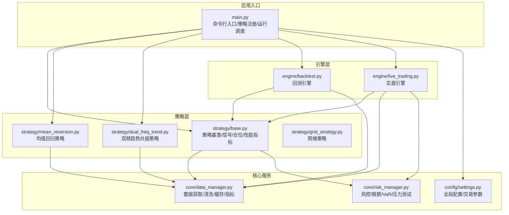
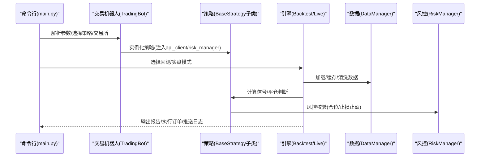
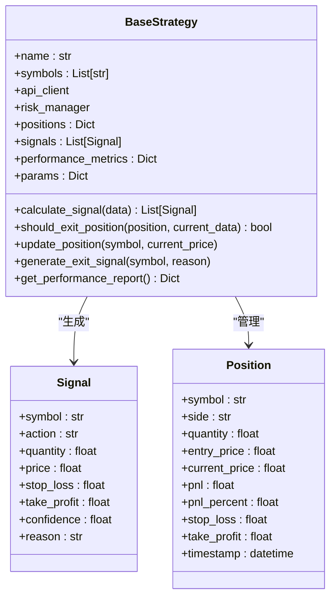
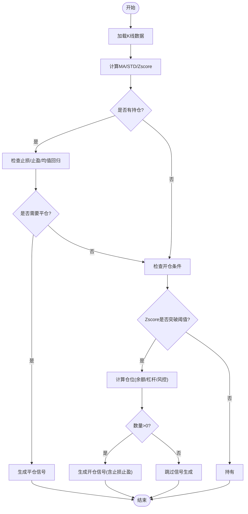
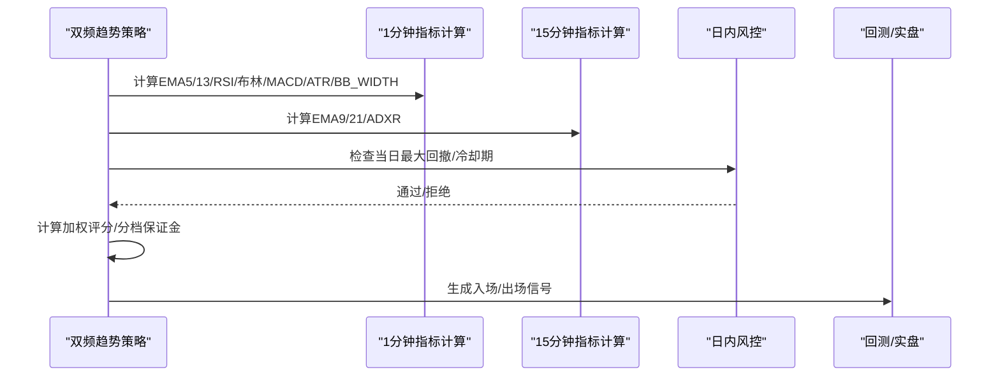
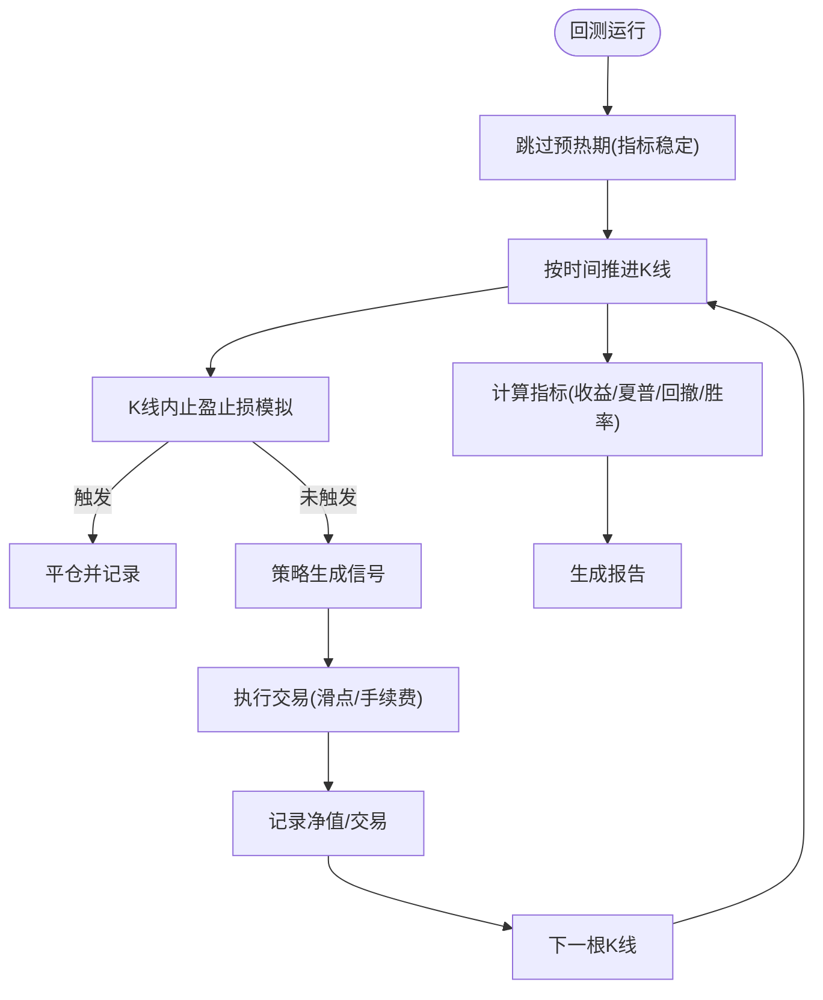
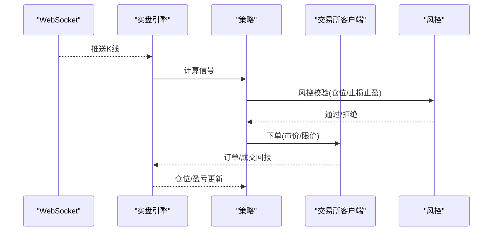
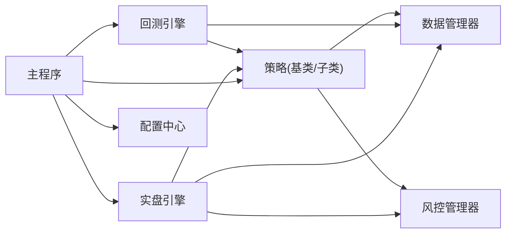

# 策略开发流程

<cite>
**本文档引用的文件**
- [main.py](file://backpack_quant_trading/main.py)
- [base.py](file://backpack_quant_trading/strategy/base.py)
- [mean_reversion.py](file://backpack_quant_trading/strategy/mean_reversion.py)
- [dual_freq_trend.py](file://backpack_quant_trading/strategy/dual_freq_trend.py)
- [backtest.py](file://backpack_quant_trading/engine/backtest.py)
- [live_trading.py](file://backpack_quant_trading/engine/live_trading.py)
- [data_manager.py](file://backpack_quant_trading/core/data_manager.py)
- [risk_manager.py](file://backpack_quant_trading/core/risk_manager.py)
- [settings.py](file://backpack_quant_trading/config/settings.py)
- [grid_strategy.py](file://backpack_quant_trading/strategy/grid_strategy.py)
</cite>

## 目录
1. [简介](#简介)
2. [项目结构](#项目结构)
3. [核心组件](#核心组件)
4. [架构总览](#架构总览)
5. [详细组件分析](#详细组件分析)
6. [依赖分析](#依赖分析)
7. [性能考虑](#性能考虑)
8. [故障排查指南](#故障排查指南)
9. [结论](#结论)
10. [附录](#附录)

## 简介
本指南面向量化策略开发者，系统阐述从策略概念到生产部署的完整流程：需求分析、技术方案设计、代码实现、单元测试、回测验证、实盘测试与上线部署。文档聚焦策略开发的关键环节：数据准备、信号生成、风险控制、性能评估与参数优化，并提供策略版本管理、测试策略与调试技巧。同时，结合仓库中的均值回归策略与双频趋势策略实现模式，给出可复用的开发模板与代码规范。

## 项目结构
项目采用分层架构，围绕策略基类、引擎（回测/实盘）、数据与风控模块组织，支持多策略注册与多交易所抽象。

**图表来源**
- [main.py:58-344](file://backpack_quant_trading/main.py#L58-L344)
- [base.py:41-212](file://backpack_quant_trading/strategy/base.py#L41-L212)
- [mean_reversion.py:23-263](file://backpack_quant_trading/strategy/mean_reversion.py#L23-L263)
- [dual_freq_trend.py:18-931](file://backpack_quant_trading/strategy/dual_freq_trend.py#L18-L931)
- [backtest.py:48-404](file://backpack_quant_trading/engine/backtest.py#L48-L404)
- [live_trading.py:347-800](file://backpack_quant_trading/engine/live_trading.py#L347-L800)
- [data_manager.py:18-518](file://backpack_quant_trading/core/data_manager.py#L18-L518)
- [risk_manager.py:48-566](file://backpack_quant_trading/core/risk_manager.py#L48-L566)
- [settings.py:104-137](file://backpack_quant_trading/config/settings.py#L104-L137)

**章节来源**
- [main.py:58-344](file://backpack_quant_trading/main.py#L58-L344)
- [base.py:41-212](file://backpack_quant_trading/strategy/base.py#L41-L212)
- [backtest.py:48-404](file://backpack_quant_trading/engine/backtest.py#L48-L404)
- [live_trading.py:347-800](file://backpack_quant_trading/engine/live_trading.py#L347-L800)
- [data_manager.py:18-518](file://backpack_quant_trading/core/data_manager.py#L18-L518)
- [risk_manager.py:48-566](file://backpack_quant_trading/core/risk_manager.py#L48-L566)
- [settings.py:104-137](file://backpack_quant_trading/config/settings.py#L104-L137)

## 核心组件
- 策略基类：定义信号、仓位、参数、性能指标与抽象方法（信号生成、平仓判断），统一策略接口。
- 回测引擎：按时间序列推进，支持K线内止盈止损模拟、滑点与手续费、指标预热期、冷却期等。
- 实盘引擎：通过WebSocket订阅K线，抽象下单客户端，支持多交易所切换，内置风控与余额缓存。
- 数据管理器：历史/实时数据获取、缓存、清洗、技术指标计算。
- 风控管理器：仓位限额、日度/回撤限制、止损止盈建议、VaR与压力测试。
- 配置中心：统一交易参数（杠杆、最大仓位、止损止盈比例等）。

**章节来源**
- [base.py:41-212](file://backpack_quant_trading/strategy/base.py#L41-L212)
- [backtest.py:48-404](file://backpack_quant_trading/engine/backtest.py#L48-L404)
- [live_trading.py:347-800](file://backpack_quant_trading/engine/live_trading.py#L347-L800)
- [data_manager.py:18-518](file://backpack_quant_trading/core/data_manager.py#L18-L518)
- [risk_manager.py:48-566](file://backpack_quant_trading/core/risk_manager.py#L48-L566)
- [settings.py:104-137](file://backpack_quant_trading/config/settings.py#L104-L137)

## 架构总览
策略开发遵循“策略基类 + 引擎 + 数据/风控”的解耦设计。策略通过基类接口与引擎交互，数据与风控模块提供基础设施能力。主程序负责策略注册、参数注入与运行模式切换。

**图表来源**
- [main.py:58-344](file://backpack_quant_trading/main.py#L58-L344)
- [base.py:41-212](file://backpack_quant_trading/strategy/base.py#L41-L212)
- [backtest.py:65-187](file://backpack_quant_trading/engine/backtest.py#L65-L187)
- [live_trading.py:536-567](file://backpack_quant_trading/engine/live_trading.py#L536-L567)
- [data_manager.py:114-167](file://backpack_quant_trading/core/data_manager.py#L114-L167)
- [risk_manager.py:87-229](file://backpack_quant_trading/core/risk_manager.py#L87-L229)

## 详细组件分析

### 策略基类与信号生成
- 信号结构：包含交易对、方向、数量、目标价格、止损止盈、置信度与原因。
- 仓位结构：记录方向、数量、入场/当前价格、盈亏与止盈止损。
- 抽象方法：
  - calculate_signal：基于市场数据生成交易信号。
  - should_exit_position：基于当前数据与持仓判断是否平仓。
- 辅助功能：更新仓位、计算盈亏、生成平仓信号、性能指标汇总。

**图表来源**
- [base.py:41-212](file://backpack_quant_trading/strategy/base.py#L41-L212)

**章节来源**
- [base.py:41-212](file://backpack_quant_trading/strategy/base.py#L41-L212)

### 均值回归策略（实现要点）
- 参数：回看周期、Z分数阈值、仓位比例、止损止盈比例。
- 信号生成：计算滚动均值/标准差与Z分数，依据阈值与当前持仓状态生成买卖信号。
- 仓位计算：优先使用USDT/USDC余额与杠杆，结合风控校验，考虑最小交易单位。
- 平仓判断：止损止盈触发或Z分数回归均值时平仓。

**图表来源**
- [mean_reversion.py:31-117](file://backpack_quant_trading/strategy/mean_reversion.py#L31-L117)
- [mean_reversion.py:119-149](file://backpack_quant_trading/strategy/mean_reversion.py#L119-L149)
- [mean_reversion.py:151-246](file://backpack_quant_trading/strategy/mean_reversion.py#L151-L246)

**章节来源**
- [mean_reversion.py:23-263](file://backpack_quant_trading/strategy/mean_reversion.py#L23-L263)

### 双频趋势共振策略（实现要点）
- 多周期融合：15分钟趋势（EMA9/21+成交量）+1分钟入场（回调/突破+RSI6+布林+EMA5/13）。
- 止盈止损：以“保证金收益%”定义，按杠杆换算为价格移动，支持时间止损与趋势反转出场。
- 加权评分：按趋势、价格位置、RSI、均线状态、MACD、量能、波动率等维度加权，决定分档保证金与入场强度。
- 日内风控：按账户余额近似权益，限制单日最大回撤；冷却期与最小进场间隔控制频率。

**图表来源**
- [dual_freq_trend.py:170-270](file://backpack_quant_trading/strategy/dual_freq_trend.py#L170-L270)
- [dual_freq_trend.py:428-449](file://backpack_quant_trading/strategy/dual_freq_trend.py#L428-L449)
- [dual_freq_trend.py:544-634](file://backpack_quant_trading/strategy/dual_freq_trend.py#L544-L634)

**章节来源**
- [dual_freq_trend.py:18-931](file://backpack_quant_trading/strategy/dual_freq_trend.py#L18-L931)

### 回测引擎（流程与指标）
- 时间序列推进：按时间戳排序，跳过指标预热期，逐根K线检查止盈止损与平仓。
- 交易执行：支持多空双向持仓，模拟滑点与手续费，记录交易明细与净值曲线。
- 指标计算：总收益、年化收益、夏普比率、最大回撤、胜率、盈利因子、总交易次数等。

**图表来源**
- [backtest.py:65-187](file://backpack_quant_trading/engine/backtest.py#L65-L187)
- [backtest.py:333-383](file://backpack_quant_trading/engine/backtest.py#L333-L383)

**章节来源**
- [backtest.py:48-404](file://backpack_quant_trading/engine/backtest.py#L48-L404)

### 实盘引擎（数据/订单/风控）
- 数据通道：通过WebSocket订阅K线，回退REST轮询；支持多交易所抽象。
- 订单执行：统一订单/持仓/余额结构，回调通知订单/仓位/成交；支持余额缓存与重连。
- 风控集成：实时风控校验、日度/回撤监控、VaR与压力测试报告输出。

**图表来源**
- [live_trading.py:536-567](file://backpack_quant_trading/engine/live_trading.py#L536-L567)
- [live_trading.py:744-800](file://backpack_quant_trading/engine/live_trading.py#L744-L800)
- [risk_manager.py:87-229](file://backpack_quant_trading/core/risk_manager.py#L87-L229)

**章节来源**
- [live_trading.py:347-800](file://backpack_quant_trading/engine/live_trading.py#L347-L800)
- [risk_manager.py:48-566](file://backpack_quant_trading/core/risk_manager.py#L48-L566)

### 数据管理器（数据准备）
- 历史数据：回测模式生成模拟数据；实盘模式调用REST接口并缓存。
- 实时数据：K线增量更新、缓存大小与TTL控制、文件落盘共享。
- 技术指标：通用指标（MA/BB/RSI/MACD/ATR等）与策略特定指标。

**章节来源**
- [data_manager.py:18-518](file://backpack_quant_trading/core/data_manager.py#L18-L518)

### 风控管理器（风险控制）
- 仓位限额：按账户资金与最大仓位比例计算总保证金上限，累计校验。
- 止损止盈：根据配置生成建议止损止盈价格，支持多空方向。
- 风险度量：VaR（历史/参数/蒙特卡洛）、压力测试、风险评分与建议。

**章节来源**
- [risk_manager.py:48-566](file://backpack_quant_trading/core/risk_manager.py#L48-L566)
- [settings.py:104-137](file://backpack_quant_trading/config/settings.py#L104-L137)

## 依赖分析
- 策略层依赖：基类接口、数据管理器、风控管理器。
- 引擎层依赖：策略接口、数据管理器、风控管理器（实盘）。
- 配置层依赖：全局交易参数贯穿策略、引擎与风控。

**图表来源**
- [main.py:58-344](file://backpack_quant_trading/main.py#L58-L344)
- [base.py:41-212](file://backpack_quant_trading/strategy/base.py#L41-L212)
- [backtest.py:48-404](file://backpack_quant_trading/engine/backtest.py#L48-L404)
- [live_trading.py:347-800](file://backpack_quant_trading/engine/live_trading.py#L347-L800)
- [data_manager.py:18-518](file://backpack_quant_trading/core/data_manager.py#L18-L518)
- [risk_manager.py:48-566](file://backpack_quant_trading/core/risk_manager.py#L48-L566)
- [settings.py:104-137](file://backpack_quant_trading/config/settings.py#L104-L137)

**章节来源**
- [main.py:58-344](file://backpack_quant_trading/main.py#L58-L344)

## 性能考虑
- 回测预热期：跳过前N根K线，避免指标漂移影响。
- 指标计算：批量/向量化计算，避免逐行迭代。
- 缓存策略：数据缓存与TTL、余额缓存、文件落盘共享。
- 滑点与手续费：合理设置，避免过度拟合。
- 实盘连接：指数退避重连、代理支持、WebSocket心跳与订阅恢复。

[本节为通用指导，无需特定文件引用]

## 故障排查指南
- 回测无数据：检查时间范围与数据源，确认预热期与指标列是否存在。
- 实盘连接失败：检查WebSocket连接参数、代理设置与重连逻辑。
- 仓位不足：核对余额、最小交易单位与风控限额，确认杠杆与保证金计算。
- 频率限制：关注429限频，增加冷却时间与节流策略。
- 日志与回调：通过回调函数监听订单/仓位/成交，定位执行问题。

**章节来源**
- [backtest.py:65-187](file://backpack_quant_trading/engine/backtest.py#L65-L187)
- [live_trading.py:153-235](file://backpack_quant_trading/engine/live_trading.py#L153-L235)
- [risk_manager.py:87-229](file://backpack_quant_trading/core/risk_manager.py#L87-L229)

## 结论
本指南提供了从策略概念到生产的完整方法论与工程实践。依托策略基类、回测/实盘引擎、数据与风控模块，开发者可快速构建、验证并部署策略。建议在开发中坚持“先回测、再实盘、再上线”的流程，配合严格的风控与可观测性，确保策略稳健运行。

[本节为总结，无需特定文件引用]

## 附录

### 策略开发模板与代码规范
- 继承策略基类，实现信号生成与平仓判断两个抽象方法。
- 参数化：将关键参数放入params，支持命令行/配置注入。
- 信号与仓位：使用Signal/Position结构，明确止损止盈与置信度。
- 风控前置：在生成信号前调用风控校验，避免违规下单。
- 指标计算：在策略内部或数据管理器中统一计算，避免重复计算。
- 日志与报告：记录关键决策与性能指标，便于回测与实盘复盘。

**章节来源**
- [base.py:41-212](file://backpack_quant_trading/strategy/base.py#L41-L212)
- [mean_reversion.py:23-263](file://backpack_quant_trading/strategy/mean_reversion.py#L23-L263)
- [dual_freq_trend.py:18-931](file://backpack_quant_trading/strategy/dual_freq_trend.py#L18-L931)

### 测试策略与调试技巧
- 单元测试：针对信号生成与风控校验编写测试用例，覆盖边界条件。
- 回测对比：多策略对比、参数扫描、样本外检验。
- 实盘沙盒：先在沙盒环境验证，逐步扩大规模。
- 调试技巧：开启详细日志、使用回调观察订单状态、记录关键中间变量。

**章节来源**
- [backtest.py:48-404](file://backpack_quant_trading/engine/backtest.py#L48-L404)
- [live_trading.py:347-800](file://backpack_quant_trading/engine/live_trading.py#L347-L800)

### 策略版本管理
- 版本号：策略文件名或元数据中包含版本号。
- 配置隔离：不同版本使用独立参数配置，避免相互污染。
- 回滚机制：保留历史版本与配置，出现问题可快速回滚。
- 文档同步：随版本更新策略说明与参数变更记录。

**章节来源**
- [main.py:31-47](file://backpack_quant_trading/main.py#L31-L47)

### 利用现有策略作为开发参考
- 均值回归策略：适合震荡市场，参数敏感度高，适合参数扫描与优化。
- 双频趋势策略：适合趋势市场，多周期融合与加权评分，适合复杂场景建模。
- 网格策略：适合震荡/窄幅市场，注意手续费与滑点成本。

**章节来源**
- [mean_reversion.py:23-263](file://backpack_quant_trading/strategy/mean_reversion.py#L23-L263)
- [dual_freq_trend.py:18-931](file://backpack_quant_trading/strategy/dual_freq_trend.py#L18-L931)
- [grid_strategy.py:38-800](file://backpack_quant_trading/strategy/grid_strategy.py#L38-L800)