# 策略概念设计

<cite>
**本文档引用的文件**
- [strategy/base.py](file://backpack_quant_trading/strategy/base.py)
- [strategy/comprehensive.py](file://backpack_quant_trading/strategy/comprehensive.py)
- [strategy/mean_reversion.py](file://backpack_quant_trading/strategy/mean_reversion.py)
- [strategy/dual_freq_trend.py](file://backpack_quant_trading/strategy/dual_freq_trend.py)
- [strategy/ai_adaptive.py](file://backpack_quant_trading/strategy/ai_adaptive.py)
- [strategy/grid_strategy.py](file://backpack_quant_trading/strategy/grid_strategy.py)
- [strategy/hype_adaptive_short.py](file://backpack_quant_trading/strategy/hype_adaptive_short.py)
- [config/settings.py](file://backpack_quant_trading/config/settings.py)
- [core/risk_manager.py](file://backpack_quant_trading/core/risk_manager.py)
</cite>

## 目录
1. [引言](#引言)
2. [项目结构](#项目结构)
3. [核心组件](#核心组件)
4. [架构概览](#架构概览)
5. [详细组件分析](#详细组件分析)
6. [依赖关系分析](#依赖关系分析)
7. [性能考虑](#性能考虑)
8. [故障排除指南](#故障排除指南)
9. [结论](#结论)

## 引言

本指南旨在为量化交易策略的设计提供系统性的概念框架和实践指导。通过对现有策略实现的深入分析，我们将阐述从零开始设计量化交易策略的完整流程，包括市场假设分析、交易逻辑构思、技术指标选择、信号生成规则设计等核心要素。

本项目提供了多种成熟的策略实现，涵盖了趋势识别、均值回归、动量分析、网格交易等多种策略思想，为策略设计提供了丰富的参考案例。

## 项目结构

该项目采用模块化架构设计，主要分为以下几个核心层次：

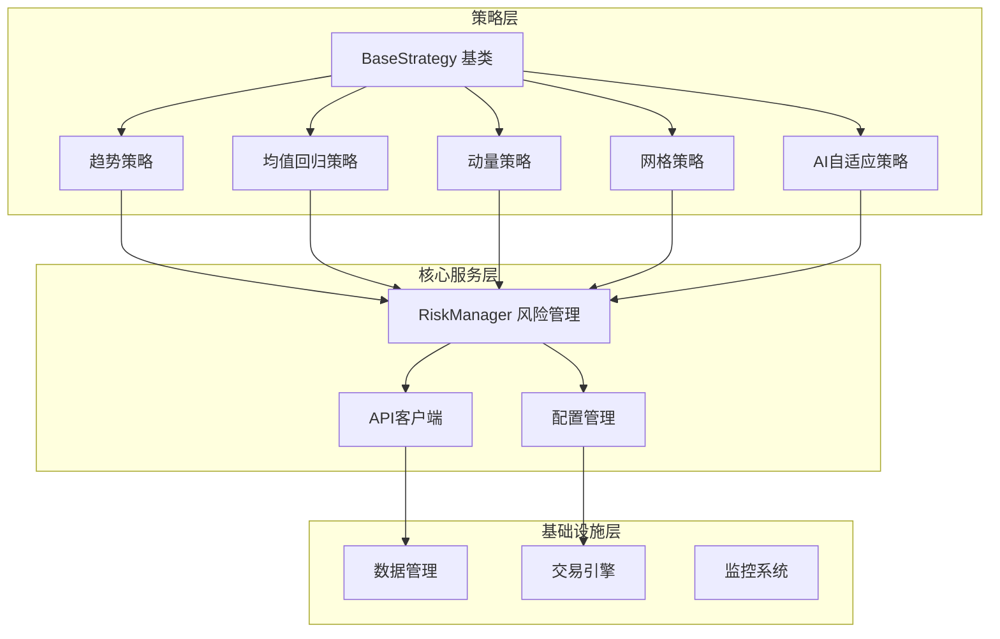

**图表来源**
- [strategy/base.py:41-91](file://backpack_quant_trading/strategy/base.py#L41-L91)
- [core/risk_manager.py:48-566](file://backpack_quant_trading/core/risk_manager.py#L48-L566)

**章节来源**
- [strategy/base.py:1-212](file://backpack_quant_trading/strategy/base.py#L1-L212)
- [config/settings.py:104-137](file://backpack_quant_trading/config/settings.py#L104-L137)

## 核心组件

### 策略基类设计

策略基类采用抽象基类设计模式，为所有具体策略提供统一的接口规范和通用功能：

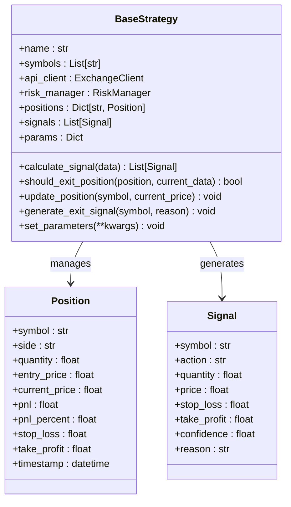

**图表来源**
- [strategy/base.py:16-91](file://backpack_quant_trading/strategy/base.py#L16-L91)

### 风险管理系统

风险管理系统提供了多层次的风险控制机制：

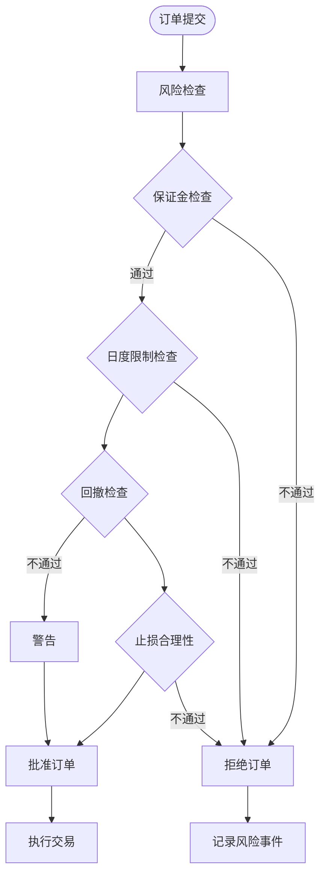

**图表来源**
- [core/risk_manager.py:132-229](file://backpack_quant_trading/core/risk_manager.py#L132-L229)

**章节来源**
- [strategy/base.py:41-212](file://backpack_quant_trading/strategy/base.py#L41-L212)
- [core/risk_manager.py:48-330](file://backpack_quant_trading/core/risk_manager.py#L48-L330)

## 架构概览

系统采用分层架构设计，确保策略开发的灵活性和可扩展性：

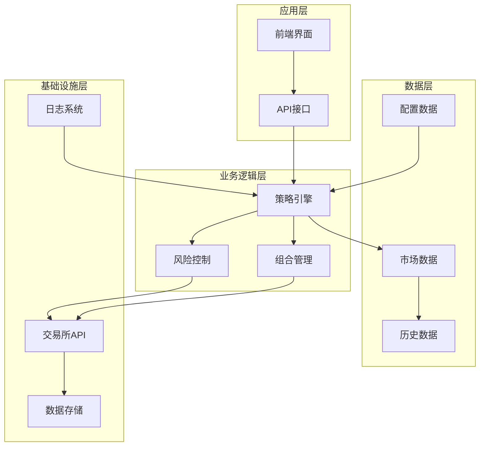

**图表来源**
- [strategy/base.py:46-69](file://backpack_quant_trading/strategy/base.py#L46-L69)
- [config/settings.py:104-137](file://backpack_quant_trading/config/settings.py#L104-L137)

## 详细组件分析

### 综合性策略设计

综合性策略实现了多指标评分系统，体现了现代量化策略设计的核心理念：

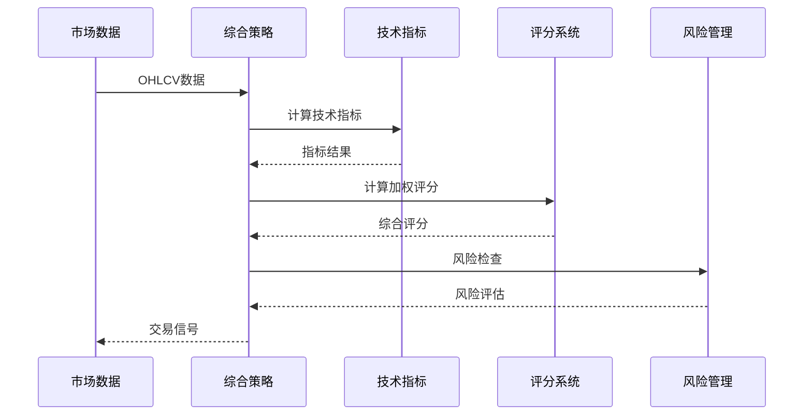

**图表来源**
- [strategy/comprehensive.py:17-91](file://backpack_quant_trading/strategy/comprehensive.py#L17-L91)
- [strategy/comprehensive.py:92-168](file://backpack_quant_trading/strategy/comprehensive.py#L92-L168)

#### 策略参数设计原则

综合性策略展示了参数设计的最佳实践：

| 参数类别 | 设计原则 | 示例参数 |
|---------|---------|---------|
| 时间周期 | 根据交易频率选择，避免过度拟合 | 5/10/20/50/100周期均线 |
| 阈值设定 | 基于统计显著性检验，避免过拟合 | RSI 35/65，ATR 1.5倍 |
| 过滤条件 | 多重过滤提高信号质量 | 趋势过滤、波动率过滤 |
| 仓位管理 | 动态调整，风险控制优先 | 25%最大仓位，75%总保证金 |

**章节来源**
- [strategy/comprehensive.py:17-91](file://backpack_quant_trading/strategy/comprehensive.py#L17-L91)
- [strategy/comprehensive.py:92-168](file://backpack_quant_trading/strategy/comprehensive.py#L92-L168)

### 均值回归策略

均值回归策略基于统计学原理，适用于震荡市场环境：

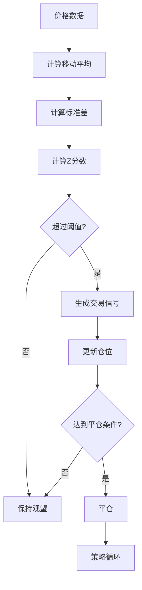

**图表来源**
- [strategy/mean_reversion.py:31-117](file://backpack_quant_trading/strategy/mean_reversion.py#L31-L117)

#### 策略参数设计

均值回归策略的关键参数设计：

| 参数 | 设计考虑 | 默认值 | 调整范围 |
|------|---------|--------|----------|
| lookback_period | 反映市场波动性，过短敏感过长滞后 | 5周期 | 3-10周期 |
| zscore_threshold | 基于历史Z分数分布，典型值1.0-2.0 | 1.0 | 0.5-1.5 |
| position_size | 风险控制，建议不超过总资金的25% | 0.03 | 0.01-0.1 |
| stop_loss_percent | 保护性止损，典型1-3% | 0.02 | 0.01-0.05 |

**章节来源**
- [strategy/mean_reversion.py:13-28](file://backpack_quant_trading/strategy/mean_reversion.py#L13-L28)
- [strategy/mean_reversion.py:31-117](file://backpack_quant_trading/strategy/mean_reversion.py#L31-L117)

### 双频趋势策略

双频趋势策略结合高频和低频信号，提高趋势识别的准确性：

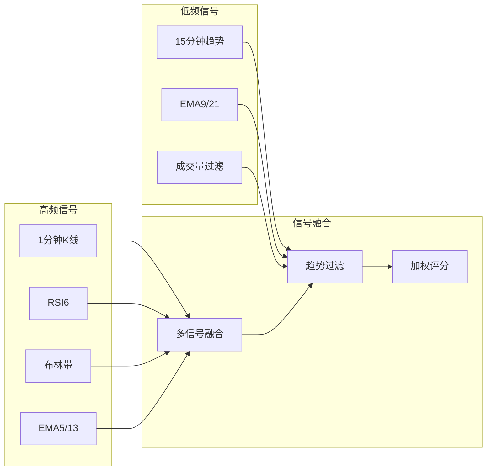

**图表来源**
- [strategy/dual_freq_trend.py:18-168](file://backpack_quant_trading/strategy/dual_freq_trend.py#L18-L168)

#### 信号生成规则

双频趋势策略的信号生成遵循严格的过滤机制：

1. **趋势过滤**：15分钟EMA9/21确认趋势方向
2. **形态确认**：1分钟K线形态识别
3. **成交量验证**：量价配合确认信号
4. **波动率过滤**：避免横盘假信号

**章节来源**
- [strategy/dual_freq_trend.py:170-271](file://backpack_quant_trading/strategy/dual_freq_trend.py#L170-L271)
- [strategy/dual_freq_trend.py:289-426](file://backpack_quant_trading/strategy/dual_freq_trend.py#L289-L426)

### AI自适应策略

AI自适应策略结合传统技术分析和人工智能技术：

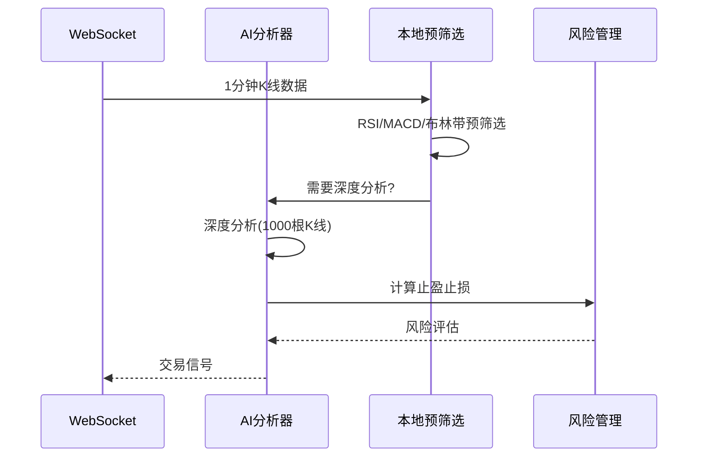

**图表来源**
- [strategy/ai_adaptive.py:266-332](file://backpack_quant_trading/strategy/ai_adaptive.py#L266-L332)

#### 成本优化机制

AI策略采用了多项成本优化措施：

| 优化措施 | 实现方式 | 效果 |
|---------|---------|------|
| 本地指标预筛选 | RSI<45或>55触发AI | 降低85%AI调用 |
| 深度分析间隔 | 2小时触发一次 | 减少不必要的深度分析 |
| WebSocket缓存 | 1分钟K线缓存 | 提高响应速度 |
| 信号去重机制 | 时间戳去重 | 避免重复信号 |

**章节来源**
- [strategy/ai_adaptive.py:166-264](file://backpack_quant_trading/strategy/ai_adaptive.py#L166-L264)
- [strategy/ai_adaptive.py:266-670](file://backpack_quant_trading/strategy/ai_adaptive.py#L266-L670)

### 网格交易策略

网格交易策略通过自动化的方式在价格区间内高抛低吸：

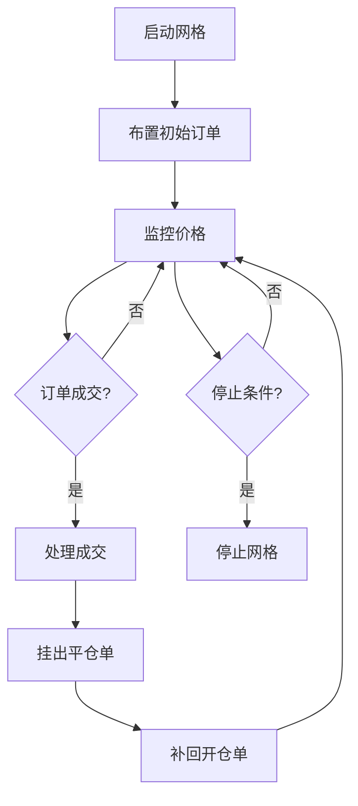

**图表来源**
- [strategy/grid_strategy.py:179-280](file://backpack_quant_trading/strategy/grid_strategy.py#L179-L280)

#### 网格参数设计

网格策略的关键参数配置：

| 参数 | 设计考虑 | 建议范围 |
|------|---------|----------|
| price_lower | 网格下限，基于历史支撑 | 市场最低价附近 |
| price_upper | 网格上限，基于历史阻力 | 市场最高价附近 |
| grid_count | 网格数量，平衡收益和风险 | 10-50档 |
| investment_per_grid | 单格投资，控制回撤 | 50-500美元 |
| leverage | 杠杆倍数，影响收益和风险 | 10-100倍 |

**章节来源**
- [strategy/grid_strategy.py:41-156](file://backpack_quant_trading/strategy/grid_strategy.py#L41-L156)
- [strategy/grid_strategy.py:179-280](file://backpack_quant_trading/strategy/grid_strategy.py#L179-L280)

## 依赖关系分析

策略系统采用松耦合设计，各组件间通过清晰的接口交互：

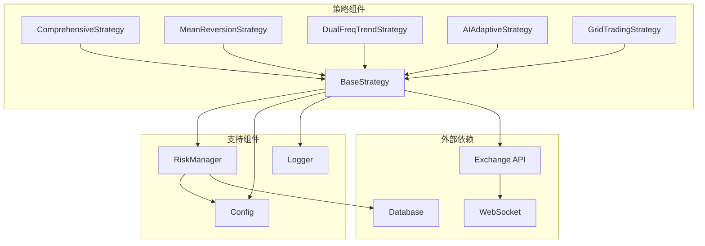

**图表来源**
- [strategy/base.py:9-13](file://backpack_quant_trading/strategy/base.py#L9-L13)
- [core/risk_manager.py:48-53](file://backpack_quant_trading/core/risk_manager.py#L48-L53)

**章节来源**
- [strategy/base.py:1-212](file://backpack_quant_trading/strategy/base.py#L1-L212)
- [core/risk_manager.py:1-566](file://backpack_quant_trading/core/risk_manager.py#L1-L566)

## 性能考虑

### 计算效率优化

策略系统在多个层面进行了性能优化：

1. **数据缓存机制**：利用WebSocket实时数据缓存，减少重复计算
2. **指标预计算**：批量计算技术指标，避免重复计算
3. **异步处理**：采用异步编程模型，提高并发处理能力
4. **内存管理**：使用deque等高效数据结构，控制内存使用

### 风险控制机制

系统内置多层次风险控制：

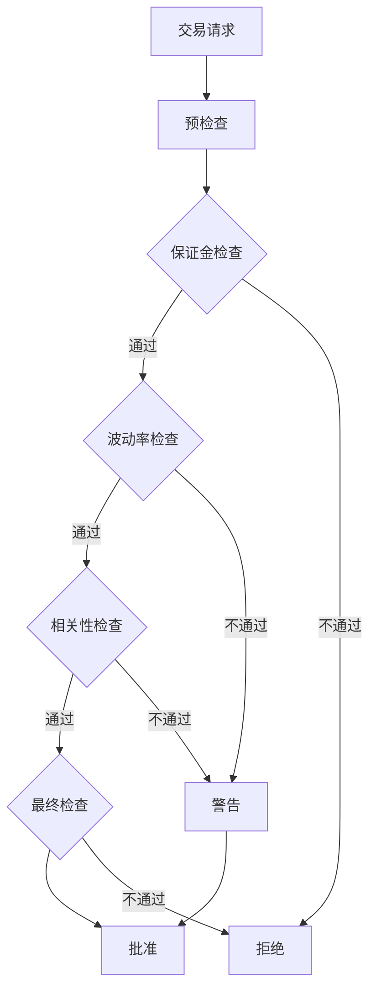

**图表来源**
- [core/risk_manager.py:132-229](file://backpack_quant_trading/core/risk_manager.py#L132-L229)

## 故障排除指南

### 常见问题诊断

| 问题类型 | 症状描述 | 解决方案 |
|---------|---------|---------|
| 策略无信号 | 交易信号频繁但质量不高 | 检查参数设置，增加过滤条件 |
| 风险控制失效 | 亏损超出预期 | 检查风险参数，调整止损设置 |
| 性能问题 | 策略响应缓慢 | 优化指标计算，启用缓存机制 |
| 数据异常 | 价格数据不准确 | 检查数据源连接，验证API密钥 |

### 调试工具使用

系统提供了完善的日志记录和监控功能：

1. **详细日志记录**：每个策略步骤都有详细的日志输出
2. **性能监控**：实时监控策略执行时间和资源使用
3. **错误追踪**：完整的异常堆栈信息和上下文数据
4. **性能分析**：策略执行时间统计和瓶颈识别

**章节来源**
- [core/risk_manager.py:302-330](file://backpack_quant_trading/core/risk_manager.py#L302-L330)
- [strategy/ai_adaptive.py:651-655](file://backpack_quant_trading/strategy/ai_adaptive.py#L651-L655)

## 结论

本指南通过分析项目中的多种策略实现，总结了量化交易策略设计的核心要素和最佳实践。成功的策略设计需要：

1. **明确的市场假设**：基于对市场的深入理解和假设检验
2. **严谨的逻辑设计**：从简单到复杂，逐步完善交易逻辑
3. **科学的参数设计**：基于统计学原理和回测验证
4. **完善的风控体系**：多层次的风险控制和监控机制
5. **持续的优化改进**：基于实证分析的迭代优化

通过借鉴项目中现有策略的设计思路和实现细节，开发者可以建立更加稳健和高效的量化交易策略体系。建议在实际应用中结合具体的市场环境和个人风险偏好，对策略参数进行针对性的调整和优化。