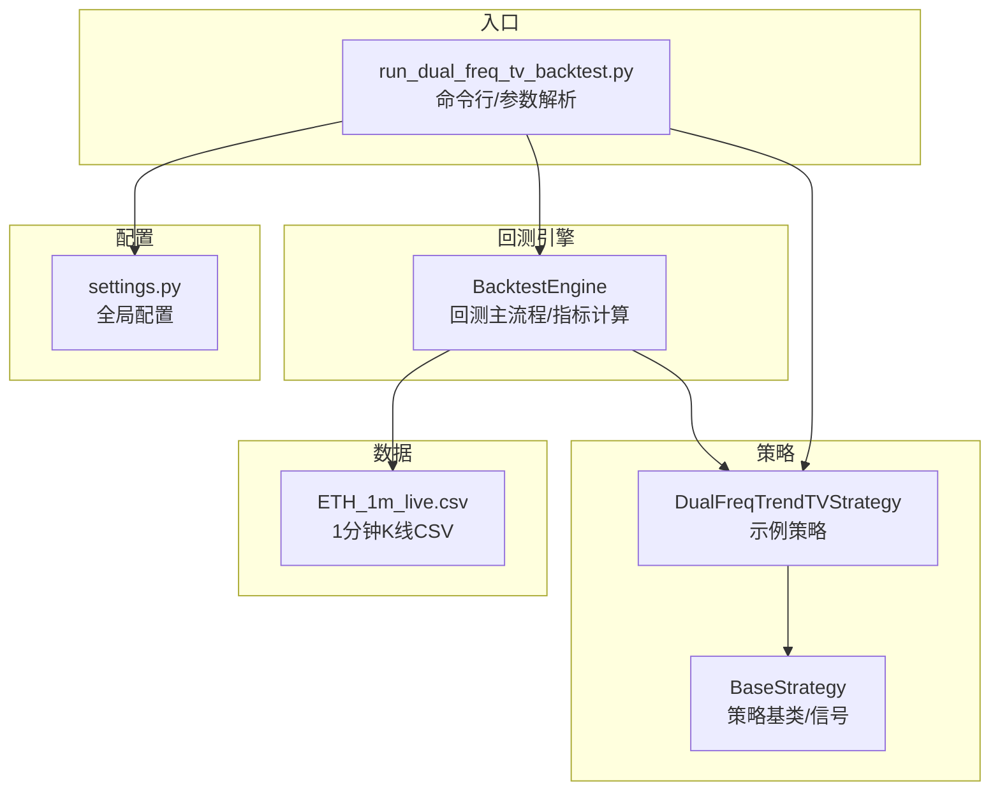
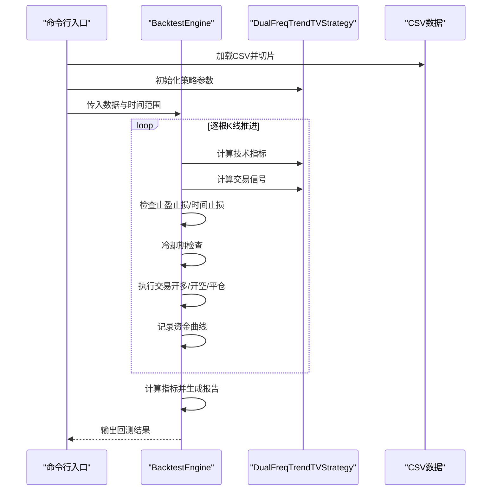
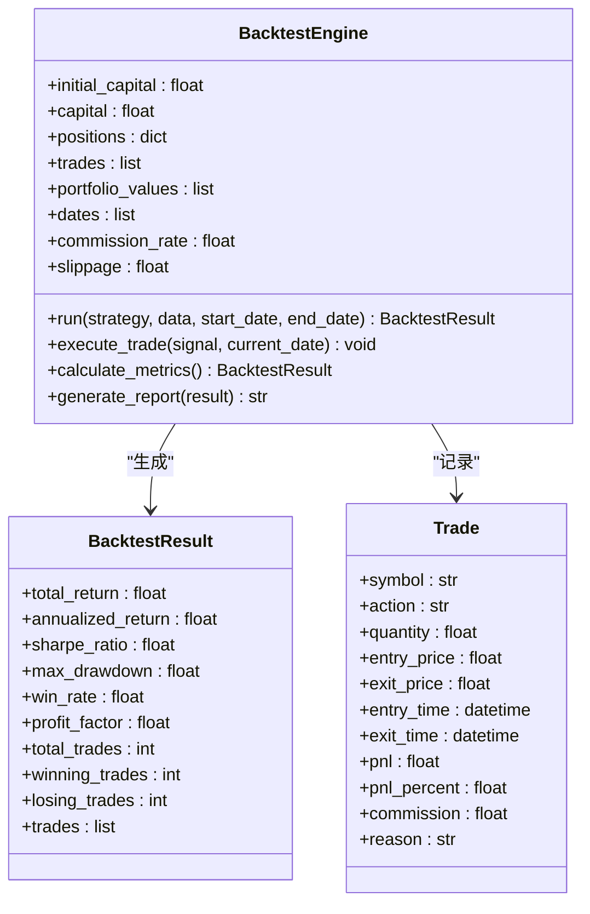
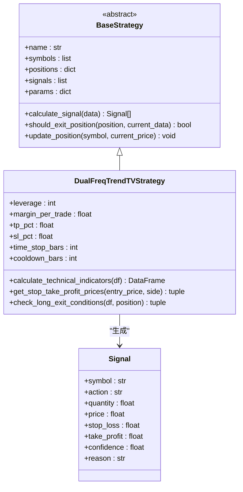
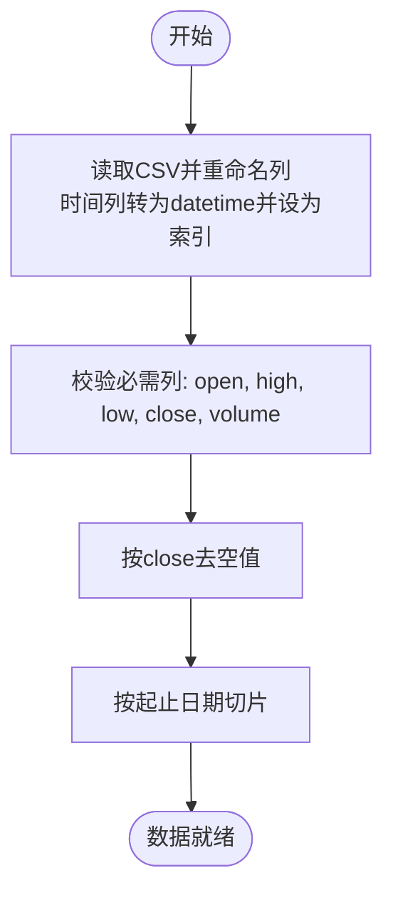
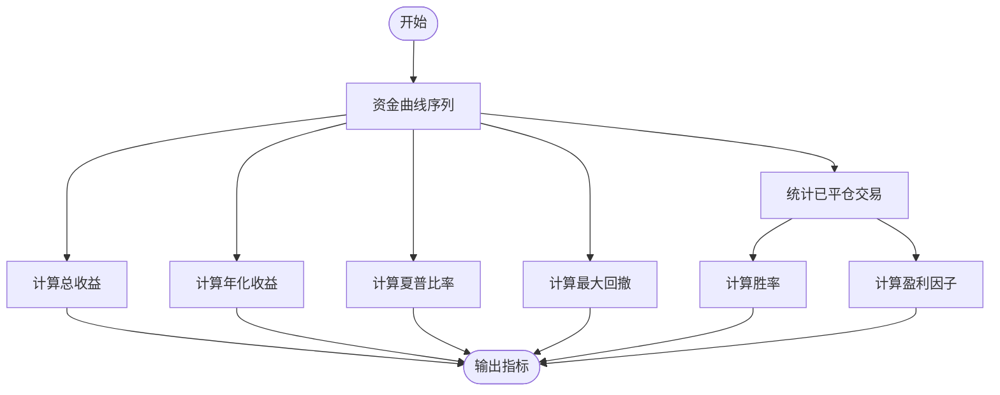
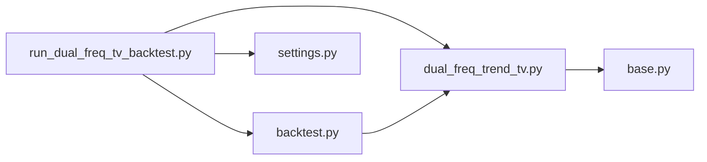

# 回测验证

<cite>
**本文引用的文件**
- [backtest.py](file://backpack_quant_trading/engine/backtest.py)
- [run_dual_freq_tv_backtest.py](file://backpack_quant_trading/run_dual_freq_tv_backtest.py)
- [dual_freq_trend_tv.py](file://backpack_quant_trading/strategy/dual_freq_trend_tv.py)
- [base.py](file://backpack_quant_trading/strategy/base.py)
- [ETH_1m_live.csv](file://backpack_quant_trading/data/ETH_1m_live.csv)
- [settings.py](file://backpack_quant_trading/config/settings.py)
</cite>

## 目录
1. [简介](#简介)
2. [项目结构](#项目结构)
3. [核心组件](#核心组件)
4. [架构总览](#架构总览)
5. [详细组件分析](#详细组件分析)
6. [依赖分析](#依赖分析)
7. [性能考虑](#性能考虑)
8. [故障排查指南](#故障排查指南)
9. [结论](#结论)
10. [附录](#附录)

## 简介
本指南面向量化策略开发者与回测使用者，系统讲解回测引擎的工作原理、参数配置、数据准备、指标计算与报告生成流程。重点围绕 BacktestEngine 类的职责、数据流处理、交易执行与风控、以及回测指标的数学定义与实现细节展开，帮助读者快速搭建稳定可靠的回测验证体系。

## 项目结构
回测相关的关键文件分布如下：
- 引擎层：engine/backtest.py 提供回测主流程与指标计算
- 策略层：strategy/dual_freq_trend_tv.py 实现示例策略（与 TradingView Pine 脚本对齐）
- 启动脚本：run_dual_freq_tv_backtest.py 提供 CSV 加载、参数解析与回测入口
- 基类与信号：strategy/base.py 定义策略基类与信号结构
- 示例数据：data/ETH_1m_live.csv 提供 1 分钟 K 线 CSV
- 配置：config/settings.py 提供全局配置（交易与风控参数）

图表来源
- [backtest.py](file://backpack_quant_trading/engine/backtest.py)
- [run_dual_freq_tv_backtest.py](file://backpack_quant_trading/run_dual_freq_tv_backtest.py)
- [dual_freq_trend_tv.py](file://backpack_quant_trading/strategy/dual_freq_trend_tv.py)
- [base.py](file://backpack_quant_trading/strategy/base.py)
- [ETH_1m_live.csv](file://backpack_quant_trading/data/ETH_1m_live.csv)
- [settings.py](file://backpack_quant_trading/config/settings.py)

章节来源
- [backtest.py](file://backpack_quant_trading/engine/backtest.py)
- [run_dual_freq_tv_backtest.py](file://backpack_quant_trading/run_dual_freq_tv_backtest.py)
- [dual_freq_trend_tv.py](file://backpack_quant_trading/strategy/dual_freq_trend_tv.py)
- [base.py](file://backpack_quant_trading/strategy/base.py)
- [ETH_1m_live.csv](file://backpack_quant_trading/data/ETH_1m_live.csv)
- [settings.py](file://backpack_quant_trading/config/settings.py)

## 核心组件
- BacktestEngine：负责回测主循环、交易执行、资金曲线记录与指标计算
- DualFreqTrendTVStrategy：示例策略，包含技术指标计算、止盈止损与时间止损逻辑
- BaseStrategy：策略基类，定义 Signal、Position 等数据结构与抽象接口
- run_dual_freq_tv_backtest.py：命令行入口，负责 CSV 加载、参数解析与回测运行
- ETH_1m_live.csv：示例历史数据，包含时间戳与 OHLCV 字段
- settings.py：全局配置，包含交易与风控参数

章节来源
- [backtest.py](file://backpack_quant_trading/engine/backtest.py)
- [dual_freq_trend_tv.py](file://backpack_quant_trading/strategy/dual_freq_trend_tv.py)
- [base.py](file://backpack_quant_trading/strategy/base.py)
- [run_dual_freq_tv_backtest.py](file://backpack_quant_trading/run_dual_freq_tv_backtest.py)
- [ETH_1m_live.csv](file://backpack_quant_trading/data/ETH_1m_live.csv)
- [settings.py](file://backpack_quant_trading/config/settings.py)

## 架构总览
回测从命令行入口读取 CSV，构建数据字典，传入策略计算信号，引擎逐根 K 线推进，执行止盈止损检查、冷却期控制与交易执行，同时记录资金曲线与交易明细，最终汇总指标并生成报告。

图表来源
- [backtest.py](file://backpack_quant_trading/engine/backtest.py)
- [run_dual_freq_tv_backtest.py](file://backpack_quant_trading/run_dual_freq_tv_backtest.py)
- [dual_freq_trend_tv.py](file://backpack_quant_trading/strategy/dual_freq_trend_tv.py)

## 详细组件分析

### BacktestEngine 类
BacktestEngine 是回测的核心，负责：
- 初始化资金、持仓、交易记录与冷却期
- 异步运行回测主循环，逐根 K 线推进
- 在每根 K 线上先检查止盈止损，再计算策略信号
- 支持冷却期（平仓后若干根 K 线内禁止新开仓）
- 记录资金曲线并计算各类指标

关键特性与实现要点：
- 预热期：跳过前 100 根 K 线，确保技术指标充分
- 止盈止损模拟：在 K 线内用 high/low 判断是否触及，避免超限
- 冷却期：通过策略的 cooldown_bars 或引擎默认值控制
- 交易执行：支持多空双向持仓，重复开仓在同一方向会被拒绝
- 滑点与手续费：统一在成交时加入，保证金按杠杆计算
- 指标计算：总收益、年化收益、夏普比率、最大回撤、胜率、盈利因子

图表来源
- [backtest.py](file://backpack_quant_trading/engine/backtest.py)

章节来源
- [backtest.py](file://backpack_quant_trading/engine/backtest.py)

### 策略与信号
DualFreqTrendTVStrategy 是示例策略，具备以下能力：
- 技术指标计算：EMA5/13、RSI6、布林带、MACD、ATR%、BB_WIDTH、VOLUME_MA5
- 止盈止损价格计算：基于杠杆与百分比换算为价格
- 时间止损：按分钟数判断是否强制平仓
- 15 分钟与 60 分钟趋势过滤，配合 1 分钟入场条件
- 与 TradingView Pine 脚本对齐的参数与逻辑

BaseStrategy 定义了策略基类与 Signal/Position 数据结构，策略需实现计算信号与平仓判断的抽象方法。

图表来源
- [base.py](file://backpack_quant_trading/strategy/base.py)
- [dual_freq_trend_tv.py](file://backpack_quant_trading/strategy/dual_freq_trend_tv.py)

章节来源
- [base.py](file://backpack_quant_trading/strategy/base.py)
- [dual_freq_trend_tv.py](file://backpack_quant_trading/strategy/dual_freq_trend_tv.py)

### 数据准备与格式要求
- CSV 必须包含时间列与 OHLCV 字段（大小写不敏感），时间列将作为索引
- 支持 timestamp、datetime、date、time 等常见命名，若无则默认第一列为时间列
- 缺失值处理：会丢弃 close 为空的行，确保回测数据连续性
- 时间范围可通过命令行参数指定，支持 YYYY-MM-DD 格式

图表来源
- [run_dual_freq_tv_backtest.py](file://backpack_quant_trading/run_dual_freq_tv_backtest.py)
- [ETH_1m_live.csv](file://backpack_quant_trading/data/ETH_1m_live.csv)

章节来源
- [run_dual_freq_tv_backtest.py](file://backpack_quant_trading/run_dual_freq_tv_backtest.py)
- [ETH_1m_live.csv](file://backpack_quant_trading/data/ETH_1m_live.csv)

### 回测参数设置
- 初始资金：命令行 --capital 指定
- 手续费：引擎内部固定 0.1%，可在引擎中调整
- 滑点：引擎内部固定 0.05%，可在引擎中调整
- 冷却期：策略的 cooldown_bars 或引擎默认 20 根 K 线
- 止盈止损：策略通过 get_stop_take_profit_prices 将百分比转换为价格
- 时间止损：按分钟数判断，策略参数 time_stop_bars 控制

章节来源
- [backtest.py](file://backpack_quant_trading/engine/backtest.py)
- [run_dual_freq_tv_backtest.py](file://backpack_quant_trading/run_dual_freq_tv_backtest.py)
- [dual_freq_trend_tv.py](file://backpack_quant_trading/strategy/dual_freq_trend_tv.py)

### 回测指标计算
BacktestEngine 的 calculate_metrics 实现了以下指标：
- 总收益率：最终资金与初始资金的相对变化百分比
- 年化收益率：基于天数的复利年化
- 夏普比率：日度收益序列的均值/标准差 × sqrt(252)，若样本不足则为 0
- 最大回撤：资金曲线滚动最高点与回撤的百分比
- 胜率：已平仓交易中盈利交易占比
- 盈利因子：总盈利 / 总亏损（绝对值）

图表来源
- [backtest.py](file://backpack_quant_trading/engine/backtest.py)

章节来源
- [backtest.py](file://backpack_quant_trading/engine/backtest.py)

### 交易执行与风控
- 交易执行：支持多空双向持仓，同一方向重复开仓会被拒绝
- 滑点与手续费：成交时加入，保证金按杠杆计算
- 冷却期：平仓后若干根 K 线内禁止新开仓
- 止盈止损：K 线内用 high/low 判断，未触发则用收盘价与策略条件判断
- 时间止损：按分钟数强制平仓

章节来源
- [backtest.py](file://backpack_quant_trading/engine/backtest.py)

### 报告生成与最佳实践
- 报告内容：包含初始资金、最终资金、总收益、年化收益、夏普比率、最大回撤、胜率、盈利因子、总交易次数、盈利/亏损交易数
- 输出方式：日志打印与字符串返回，便于进一步可视化或导出
- 最佳实践：
  - 明确参数来源：策略参数与引擎参数分离，避免混淆
  - 严格数据质量：确保 CSV 时间连续、无缺失 close
  - 合理设置冷却期：避免频繁交易导致额外成本
  - 指标解读：结合胜率与盈利因子评估策略稳定性，关注最大回撤与夏普比率

章节来源
- [backtest.py](file://backpack_quant_trading/engine/backtest.py)
- [run_dual_freq_tv_backtest.py](file://backpack_quant_trading/run_dual_freq_tv_backtest.py)

## 依赖分析
- BacktestEngine 依赖策略接口（calculate_signal、技术指标、止盈止损与时间止损）
- 策略依赖 pandas/numpy 进行指标计算
- 命令行入口依赖策略与引擎，负责参数解析与数据加载
- 配置模块提供全局参数（交易与风控），策略与引擎可按需使用

图表来源
- [run_dual_freq_tv_backtest.py](file://backpack_quant_trading/run_dual_freq_tv_backtest.py)
- [backtest.py](file://backpack_quant_trading/engine/backtest.py)
- [dual_freq_trend_tv.py](file://backpack_quant_trading/strategy/dual_freq_trend_tv.py)
- [base.py](file://backpack_quant_trading/strategy/base.py)
- [settings.py](file://backpack_quant_trading/config/settings.py)

章节来源
- [run_dual_freq_tv_backtest.py](file://backpack_quant_trading/run_dual_freq_tv_backtest.py)
- [backtest.py](file://backpack_quant_trading/engine/backtest.py)
- [dual_freq_trend_tv.py](file://backpack_quant_trading/strategy/dual_freq_trend_tv.py)
- [base.py](file://backpack_quant_trading/strategy/base.py)
- [settings.py](file://backpack_quant_trading/config/settings.py)

## 性能考虑
- 预热期：跳过前 100 根 K 线，确保技术指标稳定，避免早期噪音干扰
- 指标计算：尽量在策略侧完成，减少引擎重复计算
- 数据连续性：确保时间索引连续，避免回测过程中出现空窗期
- 指标计算复杂度：夏普比率与最大回撤涉及滚动计算，注意数据规模增长带来的内存与时间开销

## 故障排查指南
- 无数据回测：检查 CSV 是否存在、列名是否正确、时间列是否可解析
- 资金不足：确认初始资金与滑点、手续费叠加后仍能满足最小保证金
- 重复开仓：同一方向重复开仓会被拒绝，检查策略逻辑与冷却期设置
- 指标异常：当收益序列样本过少或标准差为 0 时，夏普比率为 0，属正常

章节来源
- [run_dual_freq_tv_backtest.py](file://backpack_quant_trading/run_dual_freq_tv_backtest.py)
- [backtest.py](file://backpack_quant_trading/engine/backtest.py)

## 结论
BacktestEngine 提供了完整的回测框架，涵盖数据准备、策略执行、风控与指标计算。通过清晰的参数分离与严谨的数据处理，能够稳定地评估策略表现。建议在实际应用中结合策略特性合理设置参数，并持续监控关键指标以指导策略优化。

## 附录

### 回测参数一览
- 初始资金：命令行 --capital
- 手续费：引擎内部固定 0.1%，可调整
- 滑点：引擎内部固定 0.05%，可调整
- 冷却期：策略 cooldown_bars 或引擎默认 20 根 K 线
- 止盈止损：策略 get_stop_take_profit_prices 将百分比换算为价格
- 时间止损：策略 time_stop_bars 控制分钟数

章节来源
- [backtest.py](file://backpack_quant_trading/engine/backtest.py)
- [run_dual_freq_tv_backtest.py](file://backpack_quant_trading/run_dual_freq_tv_backtest.py)
- [dual_freq_trend_tv.py](file://backpack_quant_trading/strategy/dual_freq_trend_tv.py)