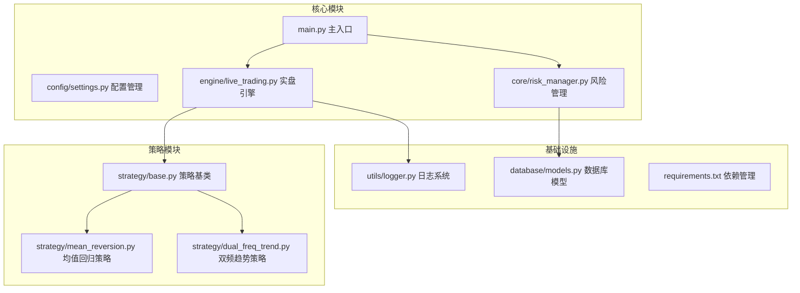
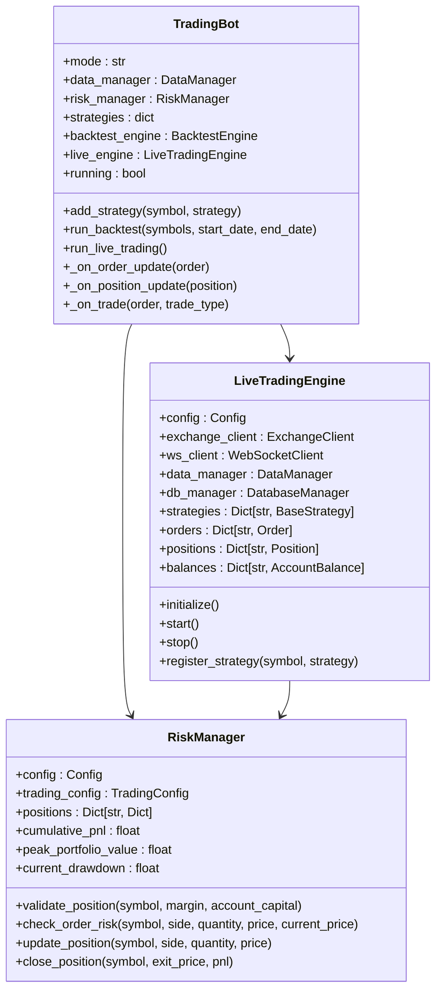
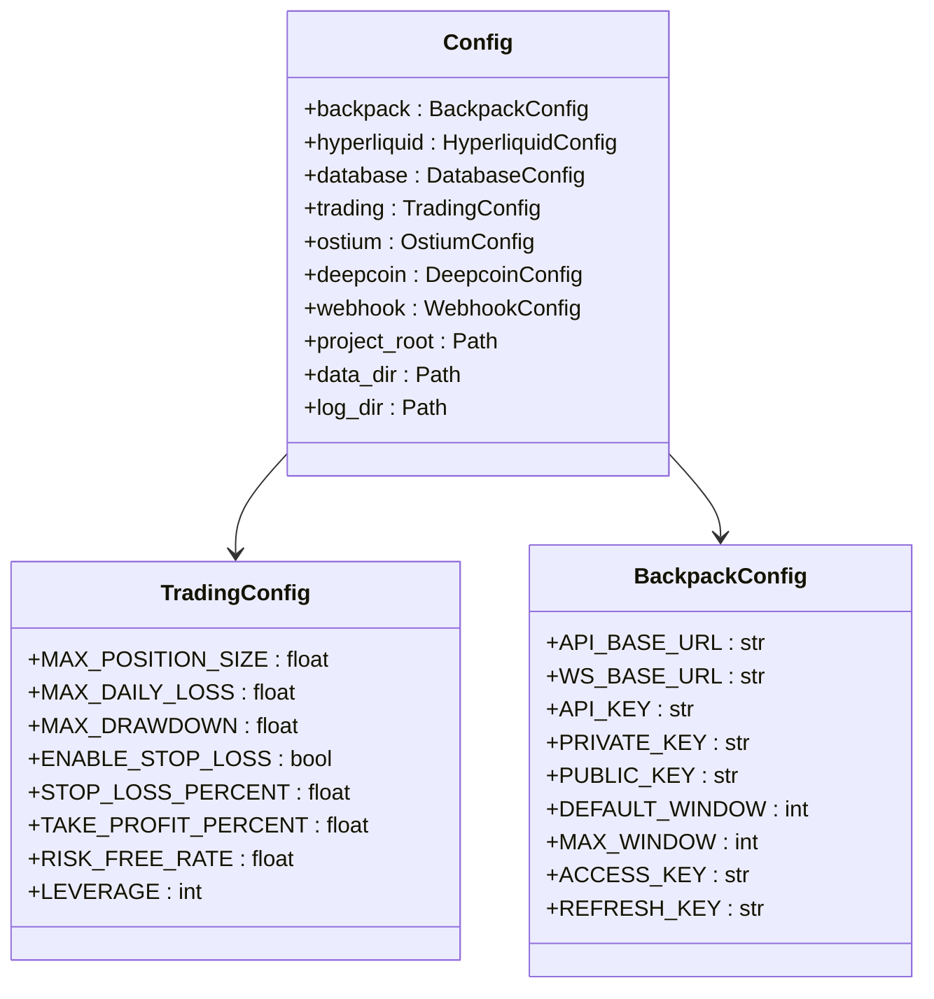
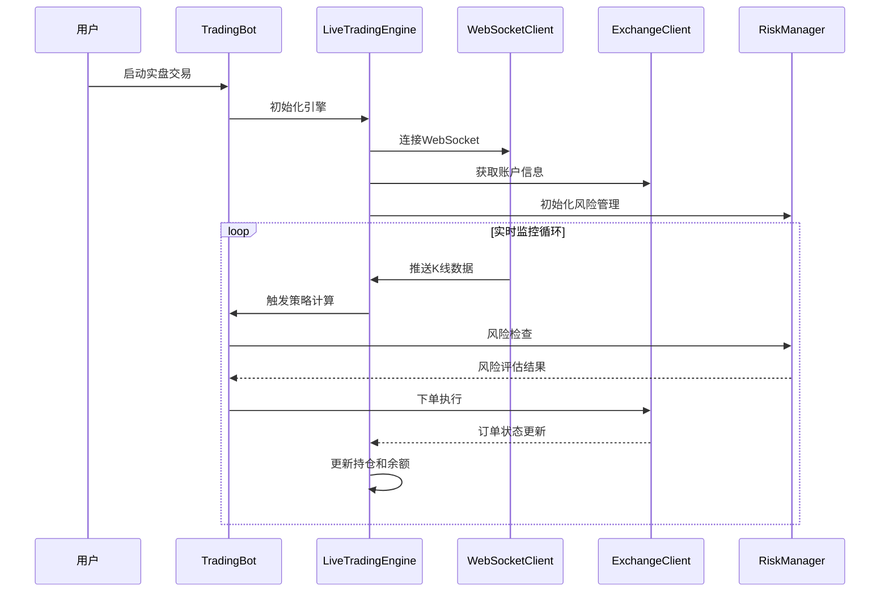
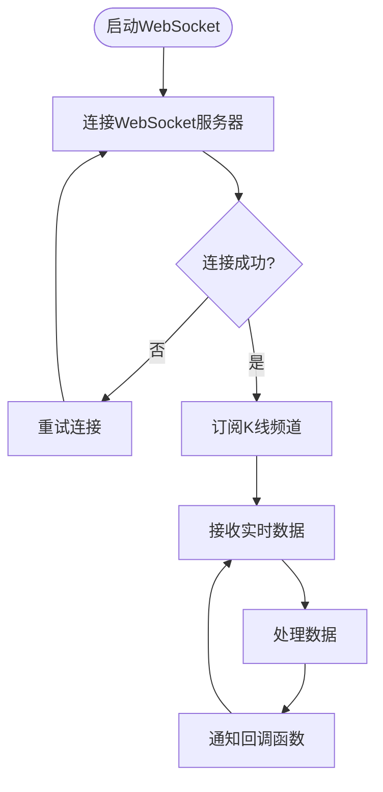
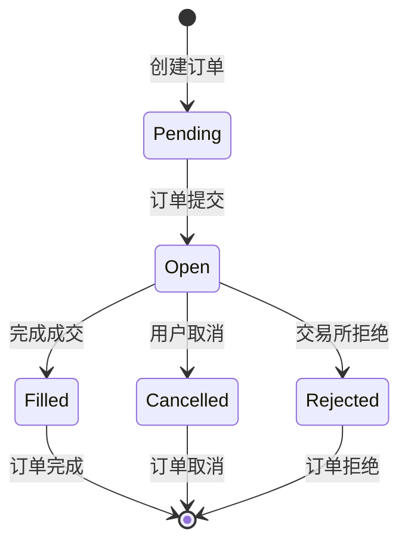
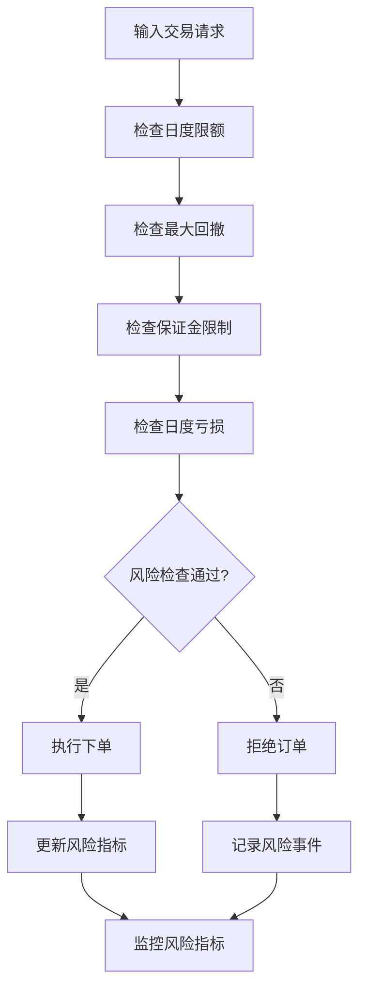
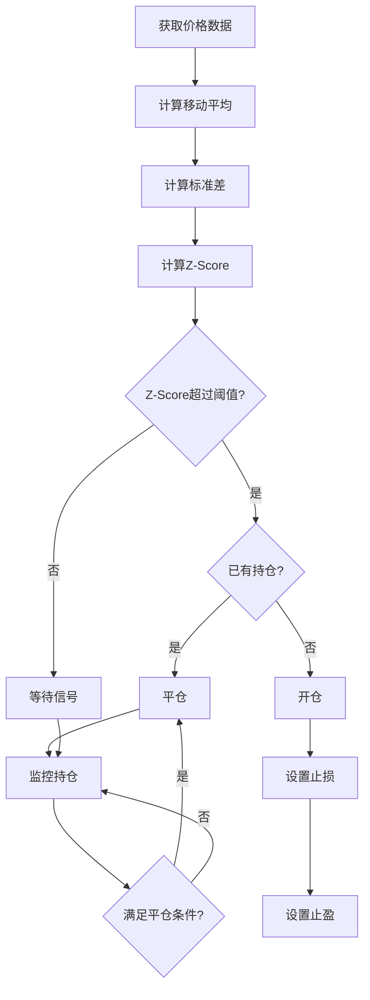
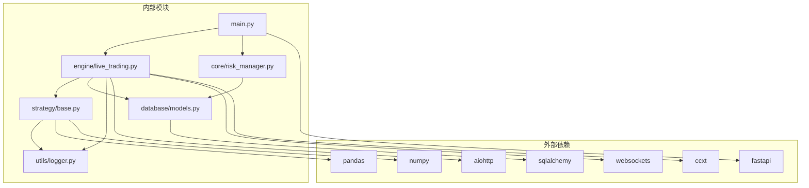
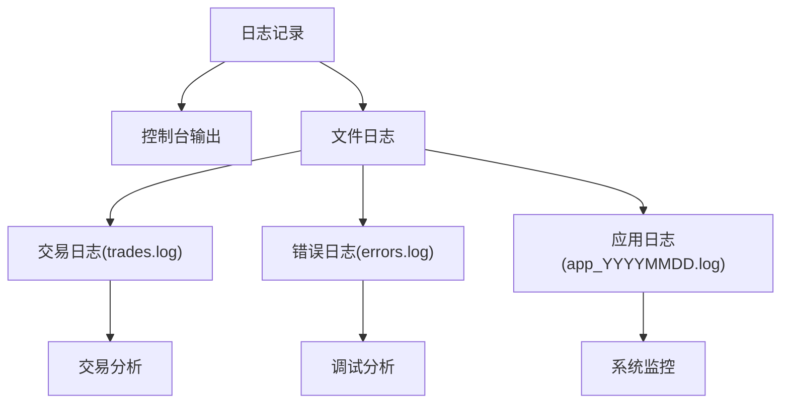

# 实盘测试准备

<cite>
**本文档引用的文件**
- [main.py](file://backpack_quant_trading/main.py)
- [settings.py](file://backpack_quant_trading/config/settings.py)
- [live_trading.py](file://backpack_quant_trading/engine/live_trading.py)
- [risk_manager.py](file://backpack_quant_trading/core/risk_manager.py)
- [base.py](file://backpack_quant_trading/strategy/base.py)
- [mean_reversion.py](file://backpack_quant_trading/strategy/mean_reversion.py)
- [dual_freq_trend.py](file://backpack_quant_trading/strategy/dual_freq_trend.py)
- [logger.py](file://backpack_quant_trading/utils/logger.py)
- [models.py](file://backpack_quant_trading/database/models.py)
- [requirements.txt](file://backpack_quant_trading/requirements.txt)
</cite>

## 目录
1. [项目概述](#项目概述)
2. [项目结构](#项目结构)
3. [核心组件](#核心组件)
4. [架构概览](#架构概览)
5. [详细组件分析](#详细组件分析)
6. [依赖关系分析](#依赖关系分析)
7. [性能考虑](#性能考虑)
8. [故障排除指南](#故障排除指南)
9. [结论](#结论)

## 项目概述

Backpack Quant Trading 是一个基于 Python 的量化交易系统，支持实盘交易、策略回测和多种交易策略。该系统提供了完整的实盘测试准备指南，包括模拟交易环境搭建、风险控制措施实施、实盘测试准备工作和监控设置。

## 项目结构

项目采用模块化架构设计，主要包含以下核心模块：

**图表来源**
- [main.py:1-344](file://backpack_quant_trading/main.py#L1-L344)
- [settings.py:1-137](file://backpack_quant_trading/config/settings.py#L1-L137)

**章节来源**
- [main.py:1-344](file://backpack_quant_trading/main.py#L1-L344)
- [settings.py:1-137](file://backpack_quant_trading/config/settings.py#L1-L137)

## 核心组件

### 交易机器人系统

系统的核心是 `TradingBot` 类，负责协调整个交易流程：

**图表来源**
- [main.py:58-158](file://backpack_quant_trading/main.py#L58-L158)
- [live_trading.py:347-402](file://backpack_quant_trading/engine/live_trading.py#L347-L402)
- [risk_manager.py:48-131](file://backpack_quant_trading/core/risk_manager.py#L48-L131)

### 配置管理系统

系统采用分层配置管理，支持多种交易所和交易参数：

**图表来源**
- [settings.py:104-137](file://backpack_quant_trading/config/settings.py#L104-L137)
- [settings.py:55-64](file://backpack_quant_trading/config/settings.py#L55-L64)
- [settings.py:13-32](file://backpack_quant_trading/config/settings.py#L13-L32)

**章节来源**
- [main.py:58-158](file://backpack_quant_trading/main.py#L58-L158)
- [settings.py:104-137](file://backpack_quant_trading/config/settings.py#L104-L137)

## 架构概览

系统采用事件驱动的架构模式，支持实时数据流和异步处理：

**图表来源**
- [main.py:116-149](file://backpack_quant_trading/main.py#L116-L149)
- [live_trading.py:536-568](file://backpack_quant_trading/engine/live_trading.py#L536-L568)

## 详细组件分析

### 实盘交易引擎

LiveTradingEngine 是系统的核心执行组件，负责处理所有实盘交易相关的操作：

#### WebSocket 数据订阅

引擎使用 WebSocket 实时获取市场数据：

**图表来源**
- [live_trading.py:153-236](file://backpack_quant_trading/engine/live_trading.py#L153-L236)
- [live_trading.py:241-322](file://backpack_quant_trading/engine/live_trading.py#L241-L322)

#### 订单生命周期管理

系统提供完整的订单生命周期管理：

**图表来源**
- [live_trading.py:36-42](file://backpack_quant_trading/engine/live_trading.py#L36-L42)

**章节来源**
- [live_trading.py:1-800](file://backpack_quant_trading/engine/live_trading.py#L1-L800)

### 风险管理系统

RiskManager 提供多层次的风险控制机制：

#### 仓位风险管理

**图表来源**
- [risk_manager.py:132-229](file://backpack_quant_trading/core/risk_manager.py#L132-L229)

#### 风险指标计算

系统支持多种风险指标计算：

| 指标类型 | 计算方法 | 阈值设置 |
|---------|---------|---------|
| 最大仓位比例 | 当前总保证金/账户资金 | 5% |
| 日度最大亏损 | 当日累计亏损 | 50% |
| 最大回撤 | (峰值-当前值)/峰值 | 15% |
| 风险评分 | 基于违规次数和严重程度 | 0-100 |

**章节来源**
- [risk_manager.py:48-330](file://backpack_quant_trading/core/risk_manager.py#L48-L330)

### 策略系统

系统支持多种交易策略，每种策略都有特定的风险参数和执行逻辑。

#### 均值回归策略

均值回归策略基于统计学原理，适用于震荡市场：

**图表来源**
- [mean_reversion.py:31-117](file://backpack_quant_trading/strategy/mean_reversion.py#L31-L117)

#### 双频趋势策略

双频趋势策略结合短期和长期趋势分析：

| 参数类型 | 名称 | 默认值 | 说明 |
|---------|------|--------|------|
| 时间框架 | 1分钟 | 1m | 短期趋势分析 |
| 时间框架 | 15分钟 | 15m | 长期趋势确认 |
| 指标周期 | EMA9/EMA21 | 9/21 | 趋势判断 |
| 指标周期 | EMA5/EMA13 | 5/13 | 精细入场 |
| RSI周期 | RSI6 | 6 | 超买超卖判断 |
| 布林周期 | BB20 | 20 | 波动率过滤 |

**章节来源**
- [mean_reversion.py:13-21](file://backpack_quant_trading/strategy/mean_reversion.py#L13-L21)
- [dual_freq_trend.py:18-88](file://backpack_quant_trading/strategy/dual_freq_trend.py#L18-L88)

## 依赖关系分析

系统采用模块化设计，各组件之间的依赖关系清晰：

**图表来源**
- [requirements.txt:1-61](file://backpack_quant_trading/requirements.txt#L1-L61)

**章节来源**
- [requirements.txt:1-61](file://backpack_quant_trading/requirements.txt#L1-L61)

## 性能考虑

### 数据缓存机制

系统实现了多层数据缓存以提高性能：

1. **市场数据缓存**: 使用内存缓存存储K线数据
2. **订单簿缓存**: 缓存深度数据减少API调用
3. **余额缓存**: 10分钟TTL避免频繁查询账户信息

### 异步处理

系统广泛使用异步编程模式：

- WebSocket连接使用异步I/O
- API请求采用异步并发处理
- 数据处理流水线支持异步操作

## 故障排除指南

### 常见问题及解决方案

| 问题类型 | 症状 | 解决方案 |
|---------|------|---------|
| WebSocket连接失败 | 订阅失败，数据不更新 | 检查网络连接，重试连接 |
| API限频 | 请求被拒绝，返回429错误 | 实施指数退避策略，增加请求间隔 |
| 杠杆设置错误 | 订单被拒绝 | 检查交易所支持的杠杆范围 |
| 风控拦截 | 订单被拒绝 | 检查风险参数配置，调整仓位大小 |

### 日志分析

系统提供详细的日志记录功能：

**图表来源**
- [logger.py:57-125](file://backpack_quant_trading/utils/logger.py#L57-L125)

**章节来源**
- [logger.py:1-180](file://backpack_quant_trading/utils/logger.py#L1-L180)

## 结论

Backpack Quant Trading 系统提供了完整的实盘测试准备解决方案。通过模块化的设计、多层次的风险控制和完善的监控机制，系统能够支持各种类型的量化交易策略。

### 关键优势

1. **灵活的策略架构**: 支持多种交易策略的快速开发和部署
2. **强大的风险管理**: 多层次风险控制确保交易安全
3. **实时监控能力**: 完善的监控和告警机制
4. **高性能设计**: 异步处理和缓存机制保证系统性能

### 实盘测试建议

1. **充分的回测验证**: 在实盘前进行充分的历史数据回测
2. **逐步资金投入**: 采用渐进式资金投入策略
3. **严格的风控设置**: 确保风险参数符合个人承受能力
4. **持续监控改进**: 实盘过程中持续监控和优化策略

通过遵循本指南，用户可以安全有效地进行实盘测试，为正式实盘交易做好充分准备。