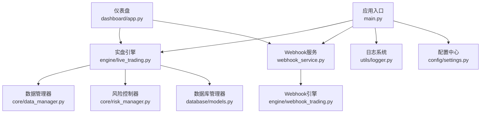
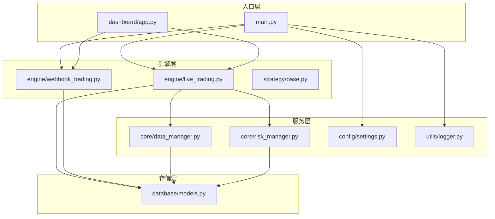
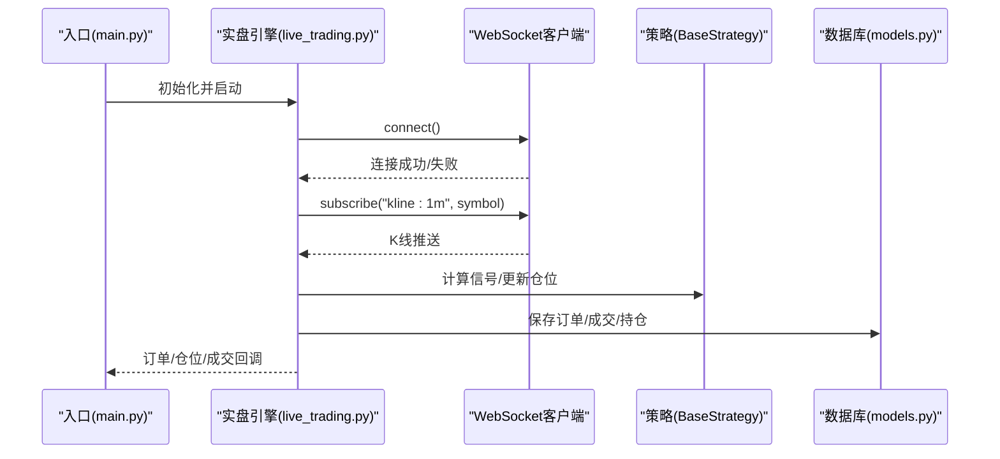
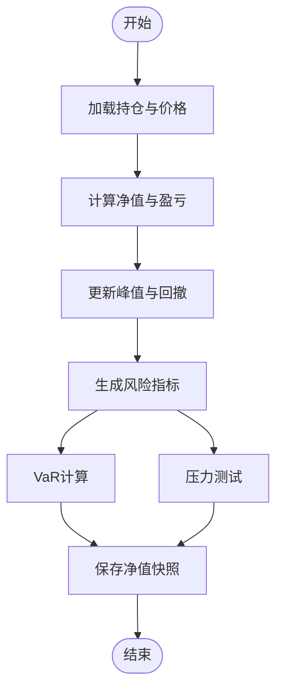
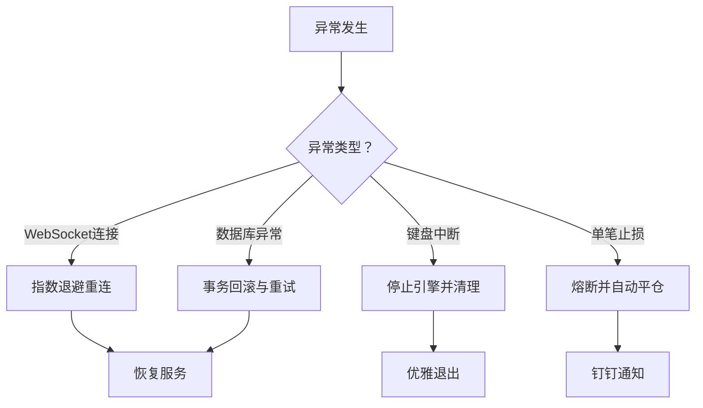
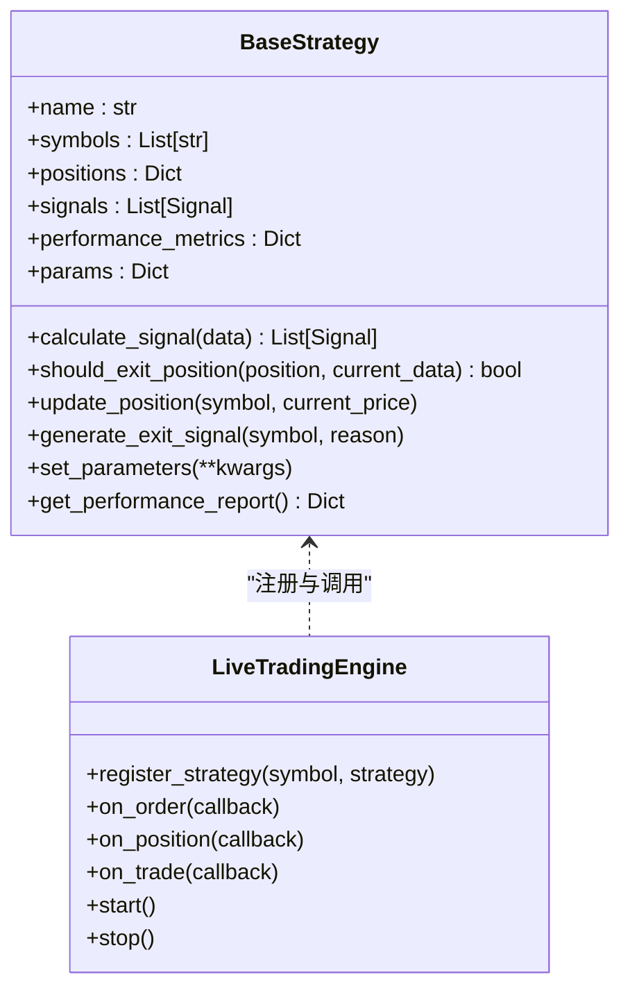
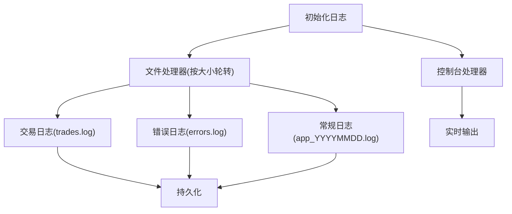
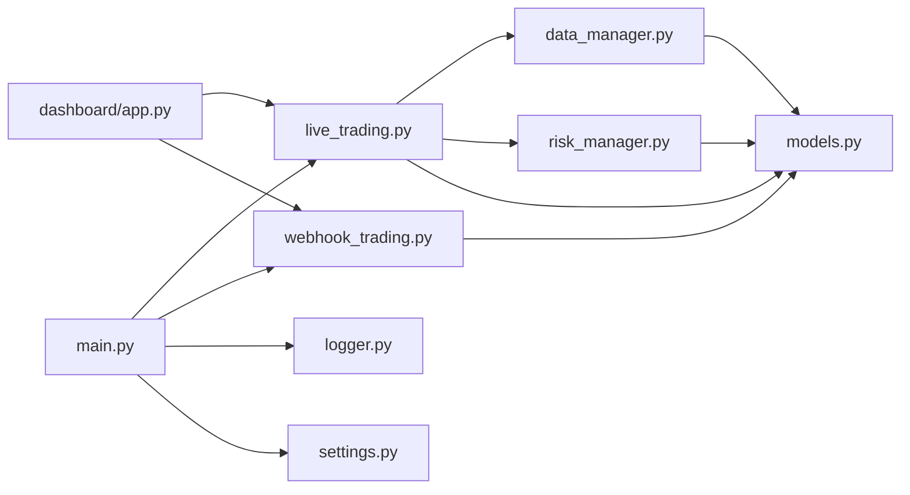

# 监控与维护

<cite>
**本文档引用的文件**
- [main.py](file://backpack_quant_trading/main.py)
- [logger.py](file://backpack_quant_trading/utils/logger.py)
- [settings.py](file://backpack_quant_trading/config/settings.py)
- [live_trading.py](file://backpack_quant_trading/engine/live_trading.py)
- [app.py](file://backpack_quant_trading/dashboard/app.py)
- [risk_manager.py](file://backpack_quant_trading/core/risk_manager.py)
- [models.py](file://backpack_quant_trading/database/models.py)
- [base.py](file://backpack_quant_trading/strategy/base.py)
- [webhook_service.py](file://backpack_quant_trading/webhook_service.py)
- [DATA_SOURCE_AND_CACHE.md](file://backpack_quant_trading/docs/DATA_SOURCE_AND_CACHE.md)
- [data_manager.py](file://backpack_quant_trading/core/data_manager.py)
- [webhook_trading.py](file://backpack_quant_trading/engine/webhook_trading.py)
</cite>

## 目录
1. [简介](#简介)
2. [项目结构](#项目结构)
3. [核心组件](#核心组件)
4. [架构总览](#架构总览)
5. [详细组件分析](#详细组件分析)
6. [依赖关系分析](#依赖关系分析)
7. [性能考虑](#性能考虑)
8. [故障排除指南](#故障排除指南)
9. [结论](#结论)
10. [附录](#附录)

## 简介
本指南面向量化交易系统的运维与维护人员，围绕监控与维护两大主题展开，涵盖实时数据监控、交易状态跟踪、性能指标监控、异常处理与故障恢复、策略维护最佳实践、日志管理与分析、以及维护计划与检查清单。通过对系统核心模块的深入分析，帮助读者建立完善的监控体系与稳健的维护流程。

## 项目结构
系统采用模块化设计，主要分为以下层次：
- 应用入口与运行模式：负责实盘/回测模式切换、策略注册与运行
- 引擎层：实盘交易引擎、Webhook交易引擎、回测引擎
- 核心服务：数据管理器、风险控制器、API客户端、数据库管理器
- 配置与日志：统一配置中心、日志系统与文件轮转
- 仪表盘：可视化界面，提供策略实例管理与监控展示
- 策略层：策略基类与多种策略实现

**图表来源**
- [main.py:1-344](file://backpack_quant_trading/main.py#L1-L344)
- [live_trading.py:347-800](file://backpack_quant_trading/engine/live_trading.py#L347-L800)
- [webhook_service.py:1-598](file://backpack_quant_trading/webhook_service.py#L1-L598)
- [data_manager.py:18-518](file://backpack_quant_trading/core/data_manager.py#L18-L518)
- [risk_manager.py:48-566](file://backpack_quant_trading/core/risk_manager.py#L48-L566)
- [models.py:267-721](file://backpack_quant_trading/database/models.py#L267-L721)
- [logger.py:1-180](file://backpack_quant_trading/utils/logger.py#L1-L180)
- [settings.py:104-137](file://backpack_quant_trading/config/settings.py#L104-L137)
- [app.py:1-800](file://backpack_quant_trading/dashboard/app.py#L1-L800)

**章节来源**
- [main.py:1-344](file://backpack_quant_trading/main.py#L1-L344)
- [settings.py:104-137](file://backpack_quant_trading/config/settings.py#L104-L137)

## 核心组件
- 应用入口与运行模式：负责解析命令行参数、选择运行模式（回测/实盘）、注册策略与交易所客户端、启动实盘引擎与日志系统
- 实时交易引擎：负责WebSocket连接、K线订阅、订单/仓位/成交回调、余额缓存、风险控制集成
- Webhook交易引擎：接收外部信号、执行开仓/平仓、休市与熔断监控、钉钉通知
- 数据管理器：历史与实时K线获取、缓存、技术指标计算、文件落盘
- 风险控制器：日度指标、最大回撤、保证金限制、VaR与压力测试、风险事件记录
- 数据库管理器：订单/成交/持仓/风险事件/净值快照等表的持久化
- 日志系统：控制台与文件轮转、交易专用日志、Windows安全文件处理器
- 仪表盘：策略实例管理、定时刷新、用户隔离与权限控制

**章节来源**
- [main.py:58-149](file://backpack_quant_trading/main.py#L58-L149)
- [live_trading.py:347-800](file://backpack_quant_trading/engine/live_trading.py#L347-L800)
- [webhook_trading.py:40-684](file://backpack_quant_trading/engine/webhook_trading.py#L40-L684)
- [data_manager.py:18-518](file://backpack_quant_trading/core/data_manager.py#L18-L518)
- [risk_manager.py:48-566](file://backpack_quant_trading/core/risk_manager.py#L48-L566)
- [models.py:267-721](file://backpack_quant_trading/database/models.py#L267-L721)
- [logger.py:1-180](file://backpack_quant_trading/utils/logger.py#L1-L180)
- [app.py:1-800](file://backpack_quant_trading/dashboard/app.py#L1-L800)

## 架构总览
系统采用“入口-引擎-服务-存储-监控”的分层架构。入口负责模式与策略调度，引擎负责实时数据与交易执行，服务层提供Webhook与仪表盘，存储层持久化交易与风险数据，监控贯穿各层。

**图表来源**
- [main.py:1-344](file://backpack_quant_trading/main.py#L1-L344)
- [live_trading.py:347-800](file://backpack_quant_trading/engine/live_trading.py#L347-L800)
- [webhook_trading.py:40-684](file://backpack_quant_trading/engine/webhook_trading.py#L40-L684)
- [data_manager.py:18-518](file://backpack_quant_trading/core/data_manager.py#L18-L518)
- [risk_manager.py:48-566](file://backpack_quant_trading/core/risk_manager.py#L48-L566)
- [models.py:267-721](file://backpack_quant_trading/database/models.py#L267-L721)
- [settings.py:104-137](file://backpack_quant_trading/config/settings.py#L104-L137)
- [logger.py:1-180](file://backpack_quant_trading/utils/logger.py#L1-L180)
- [app.py:1-800](file://backpack_quant_trading/dashboard/app.py#L1-L800)

## 详细组件分析

### 实时数据监控与交易状态跟踪
- WebSocket连接与K线订阅：实盘引擎通过WebSocket订阅K线频道，支持指数退避重连、代理兼容与连接状态检查
- 订单/仓位/成交回调：引擎注册回调，实时记录订单状态、仓位变化与成交信息
- 余额缓存：减少API调用频率，提升响应速度
- 仪表盘集成：通过仪表盘定时刷新与实例管理，实现可视化监控

**图表来源**
- [live_trading.py:536-568](file://backpack_quant_trading/engine/live_trading.py#L536-L568)
- [live_trading.py:744-800](file://backpack_quant_trading/engine/live_trading.py#L744-L800)
- [models.py:316-454](file://backpack_quant_trading/database/models.py#L316-L454)

**章节来源**
- [live_trading.py:126-345](file://backpack_quant_trading/engine/live_trading.py#L126-L345)
- [live_trading.py:536-568](file://backpack_quant_trading/engine/live_trading.py#L536-L568)
- [live_trading.py:744-800](file://backpack_quant_trading/engine/live_trading.py#L744-L800)

### 性能指标监控
- 风险指标：日度盈亏、最大回撤、净/总敞口、交易次数与成交量
- VaR与压力测试：历史法、参数法、蒙特卡洛法计算风险价值与压力情景影响
- 组合净值快照：每日净值、现金与持仓价值、日收益

**图表来源**
- [risk_manager.py:270-300](file://backpack_quant_trading/core/risk_manager.py#L270-L300)
- [risk_manager.py:331-402](file://backpack_quant_trading/core/risk_manager.py#L331-L402)
- [risk_manager.py:418-466](file://backpack_quant_trading/core/risk_manager.py#L418-L466)
- [models.py:475-496](file://backpack_quant_trading/database/models.py#L475-L496)

**章节来源**
- [risk_manager.py:270-300](file://backpack_quant_trading/core/risk_manager.py#L270-L300)
- [risk_manager.py:331-402](file://backpack_quant_trading/core/risk_manager.py#L331-L402)
- [risk_manager.py:418-466](file://backpack_quant_trading/core/risk_manager.py#L418-L466)
- [models.py:475-496](file://backpack_quant_trading/database/models.py#L475-L496)

### 异常处理与故障恢复
- WebSocket异常：连接超时、关闭、指数退避重连、代理兼容与Windows文件轮转安全
- 实盘异常：键盘中断、异常捕获、引擎停止与资源清理
- Webhook熔断：单笔止损触发熔断、休市自动平仓、钉钉通知
- 数据库一致性：重复交易ID防护、会话管理与回滚

**图表来源**
- [live_trading.py:153-235](file://backpack_quant_trading/engine/live_trading.py#L153-L235)
- [live_trading.py:569-586](file://backpack_quant_trading/engine/live_trading.py#L569-L586)
- [webhook_trading.py:627-684](file://backpack_quant_trading/engine/webhook_trading.py#L627-L684)
- [models.py:358-382](file://backpack_quant_trading/database/models.py#L358-L382)

**章节来源**
- [live_trading.py:153-235](file://backpack_quant_trading/engine/live_trading.py#L153-L235)
- [live_trading.py:569-586](file://backpack_quant_trading/engine/live_trading.py#L569-L586)
- [webhook_trading.py:627-684](file://backpack_quant_trading/engine/webhook_trading.py#L627-L684)
- [models.py:358-382](file://backpack_quant_trading/database/models.py#L358-L382)

### 策略维护最佳实践
- 参数优化：通过命令行参数覆盖策略参数，支持不同策略的差异化配置
- 策略注册与切换：策略注册表集中管理，便于扩展与维护
- 数据缓存与增量：数据管理器提供缓存与增量更新，减少API调用与IO开销
- 仪表盘策略实例：支持多实例管理与用户隔离，便于策略部署与监控

**图表来源**
- [base.py:41-212](file://backpack_quant_trading/strategy/base.py#L41-L212)
- [live_trading.py:588-608](file://backpack_quant_trading/engine/live_trading.py#L588-L608)

**章节来源**
- [main.py:32-56](file://backpack_quant_trading/main.py#L32-L56)
- [main.py:225-286](file://backpack_quant_trading/main.py#L225-L286)
- [data_manager.py:18-518](file://backpack_quant_trading/core/data_manager.py#L18-L518)
- [app.py:1-800](file://backpack_quant_trading/dashboard/app.py#L1-L800)

### 日志管理与分析
- 日志配置：控制台与文件轮转、Windows安全文件处理器、交易专用日志
- 日志分类：交易日志、错误日志、常规应用日志
- 日志收集：统一格式化输出，便于后续采集与分析

**图表来源**
- [logger.py:57-125](file://backpack_quant_trading/utils/logger.py#L57-L125)
- [logger.py:137-180](file://backpack_quant_trading/utils/logger.py#L137-L180)

**章节来源**
- [logger.py:1-180](file://backpack_quant_trading/utils/logger.py#L1-L180)
- [settings.py:124-131](file://backpack_quant_trading/config/settings.py#L124-L131)

### 维护计划与检查清单
- 系统健康检查：WebSocket连接状态、引擎运行标志、实例存活
- 数据完整性验证：数据库表结构、重复交易ID防护、缓存一致性
- 安全审计：API密钥与私钥管理、钉钉通知配置、用户实例隔离

**章节来源**
- [models.py:285-292](file://backpack_quant_trading/database/models.py#L285-L292)
- [models.py:358-382](file://backpack_quant_trading/database/models.py#L358-L382)
- [webhook_service.py:34-46](file://backpack_quant_trading/webhook_service.py#L34-L46)
- [app.py:560-571](file://backpack_quant_trading/dashboard/app.py#L560-L571)

## 依赖关系分析
- 组件耦合：引擎依赖数据管理器与风险控制器，日志与配置贯穿各层
- 外部依赖：数据库、交易所API、WebSocket、钉钉机器人
- 循环依赖规避：通过延迟导入与接口抽象避免循环依赖

**图表来源**
- [live_trading.py:14-18](file://backpack_quant_trading/engine/live_trading.py#L14-L18)
- [webhook_trading.py:16-18](file://backpack_quant_trading/engine/webhook_trading.py#L16-L18)
- [data_manager.py:10-13](file://backpack_quant_trading/core/data_manager.py#L10-L13)
- [risk_manager.py:8-9](file://backpack_quant_trading/core/risk_manager.py#L8-L9)
- [models.py:1-9](file://backpack_quant_trading/database/models.py#L1-L9)
- [main.py:11-23](file://backpack_quant_trading/main.py#L11-L23)
- [logger.py:1-7](file://backpack_quant_trading/utils/logger.py#L1-L7)
- [settings.py:1-10](file://backpack_quant_trading/config/settings.py#L1-L10)
- [app.py:29-47](file://backpack_quant_trading/dashboard/app.py#L29-L47)

**章节来源**
- [live_trading.py:14-18](file://backpack_quant_trading/engine/live_trading.py#L14-L18)
- [webhook_trading.py:16-18](file://backpack_quant_trading/engine/webhook_trading.py#L16-L18)
- [data_manager.py:10-13](file://backpack_quant_trading/core/data_manager.py#L10-L13)
- [risk_manager.py:8-9](file://backpack_quant_trading/core/risk_manager.py#L8-L9)
- [models.py:1-9](file://backpack_quant_trading/database/models.py#L1-L9)
- [main.py:11-23](file://backpack_quant_trading/main.py#L11-L23)
- [logger.py:1-7](file://backpack_quant_trading/utils/logger.py#L1-L7)
- [settings.py:1-10](file://backpack_quant_trading/config/settings.py#L1-L10)
- [app.py:29-47](file://backpack_quant_trading/dashboard/app.py#L29-L47)

## 性能考虑
- 缓存策略：余额缓存、K线缓存、指标计算缓存，减少API与IO开销
- 异步并发：WebSocket消息处理、订单/仓位/成交回调异步执行
- 数据源与缓存：支持多数据源与增量缓存，提高数据获取效率
- 资源管理：连接池、会话管理、锁保护，避免资源泄漏

**章节来源**
- [live_trading.py:408-442](file://backpack_quant_trading/engine/live_trading.py#L408-L442)
- [data_manager.py:23-30](file://backpack_quant_trading/core/data_manager.py#L23-L30)
- [data_manager.py:405-462](file://backpack_quant_trading/core/data_manager.py#L405-L462)
- [models.py:270-280](file://backpack_quant_trading/database/models.py#L270-L280)

## 故障排除指南
- WebSocket连接失败：检查代理设置、网络超时、指数退避重连日志
- 实盘异常：捕获异常、记录错误、停止引擎、清理资源
- Webhook熔断：单笔止损触发熔断、自动平仓、钉钉通知、手动重置
- 数据库异常：重复交易ID防护、事务回滚、会话管理

**章节来源**
- [live_trading.py:153-235](file://backpack_quant_trading/engine/live_trading.py#L153-L235)
- [live_trading.py:569-586](file://backpack_quant_trading/engine/live_trading.py#L569-L586)
- [webhook_trading.py:627-684](file://backpack_quant_trading/engine/webhook_trading.py#L627-L684)
- [models.py:358-382](file://backpack_quant_trading/database/models.py#L358-L382)

## 结论
通过完善的监控与维护体系，系统能够在复杂多变的市场环境中保持稳定运行。实时数据监控、交易状态跟踪、性能指标监控、异常处理与故障恢复、策略维护最佳实践、日志管理与分析、以及维护计划与检查清单共同构成了系统的运维保障。建议在生产环境中持续优化缓存策略、加强安全审计、完善自动化运维脚本，以进一步提升系统的可靠性与可维护性。

## 附录
- 数据源与缓存策略：支持多数据源与增量缓存，提高数据获取效率
- 配置中心：统一管理API密钥、数据库连接、交易参数与Webhook配置

**章节来源**
- [DATA_SOURCE_AND_CACHE.md:1-71](file://backpack_quant_trading/docs/DATA_SOURCE_AND_CACHE.md#L1-L71)
- [settings.py:104-137](file://backpack_quant_trading/config/settings.py#L104-L137)