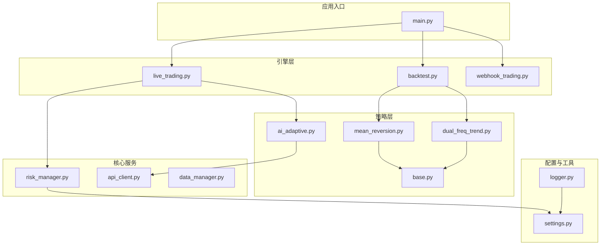
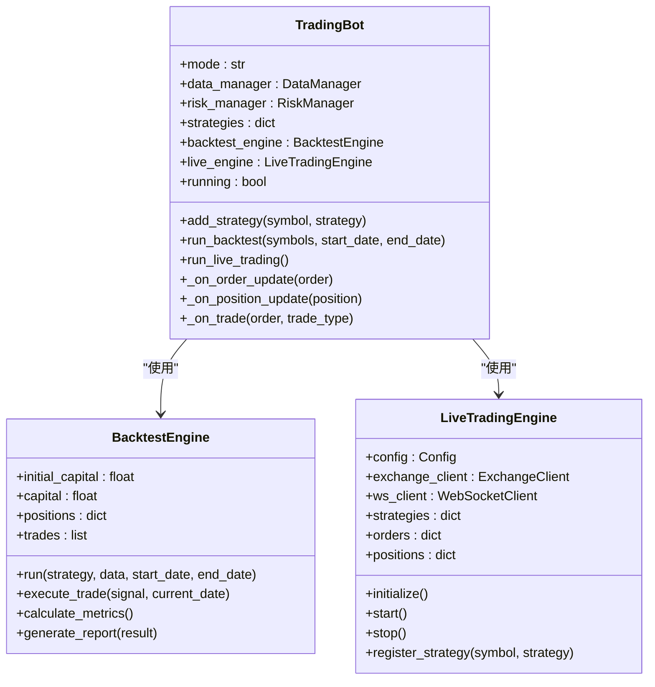
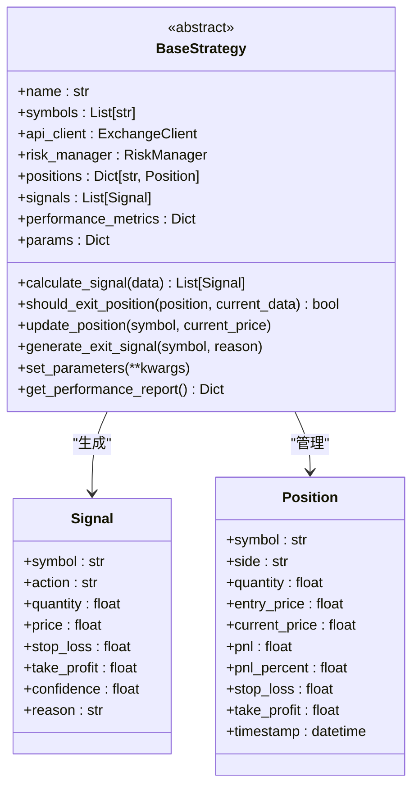
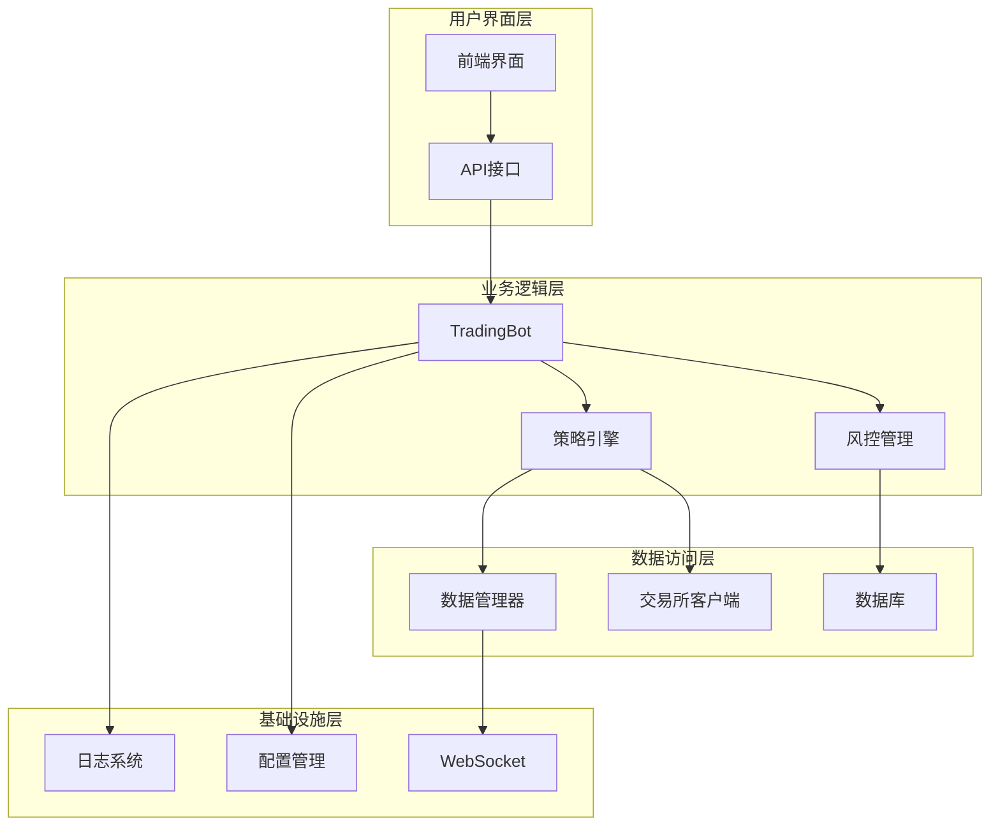
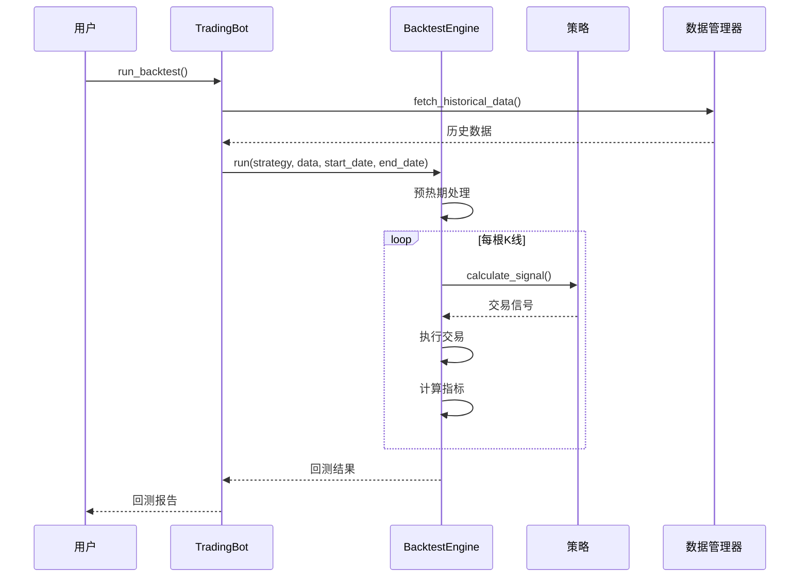
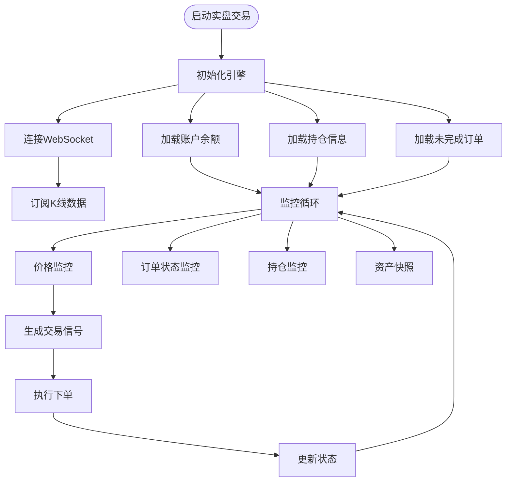
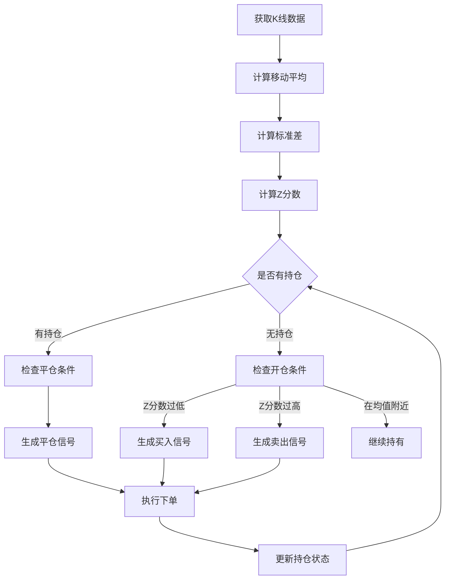
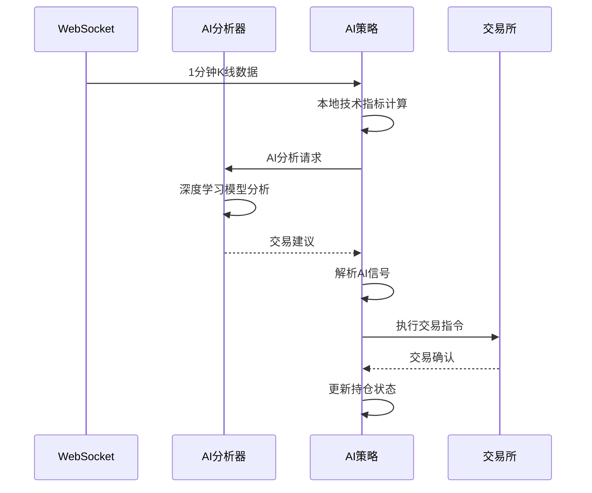
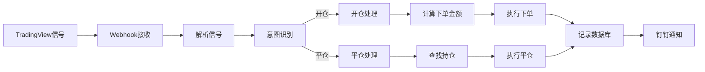
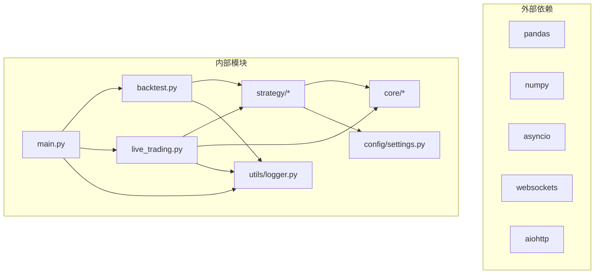

# 策略测试与部署

<cite>
**本文档引用的文件**
- [main.py](file://backpack_quant_trading/main.py)
- [backtest.py](file://backpack_quant_trading/engine/backtest.py)
- [live_trading.py](file://backpack_quant_trading/engine/live_trading.py)
- [base.py](file://backpack_quant_trading/strategy/base.py)
- [settings.py](file://backpack_quant_trading/config/settings.py)
- [logger.py](file://backpack_quant_trading/utils/logger.py)
- [risk_manager.py](file://backpack_quant_trading/core/risk_manager.py)
- [mean_reversion.py](file://backpack_quant_trading/strategy/mean_reversion.py)
- [ai_adaptive.py](file://backpack_quant_trading/strategy/ai_adaptive.py)
- [dual_freq_trend.py](file://backpack_quant_trading/strategy/dual_freq_trend.py)
- [run_dual_freq_tv_backtest.py](file://backpack_quant_trading/run_dual_freq_tv_backtest.py)
- [webhook_trading.py](file://backpack_quant_trading/engine/webhook_trading.py)
</cite>

## 目录
1. [引言](#引言)
2. [项目结构](#项目结构)
3. [核心组件](#核心组件)
4. [架构概览](#架构概览)
5. [详细组件分析](#详细组件分析)
6. [依赖关系分析](#依赖关系分析)
7. [性能考虑](#性能考虑)
8. [故障排除指南](#故障排除指南)
9. [结论](#结论)
10. [附录](#附录)

## 引言

本指南旨在为量化交易策略的测试与部署提供完整的操作手册。内容涵盖从单元测试、集成测试、回测验证到实盘测试的全流程，详细说明回测引擎的使用方法、实盘测试的准备工作、策略部署流程、监控与维护最佳实践，以及策略优化和迭代升级的方法。

## 项目结构

该项目采用模块化架构，主要分为以下层次：

**图表来源**
- [main.py:1-344](file://backpack_quant_trading/main.py#L1-L344)
- [backtest.py:1-404](file://backpack_quant_trading/engine/backtest.py#L1-L404)
- [live_trading.py:1-800](file://backpack_quant_trading/engine/live_trading.py#L1-L800)

**章节来源**
- [main.py:1-344](file://backpack_quant_trading/main.py#L1-L344)
- [settings.py:1-137](file://backpack_quant_trading/config/settings.py#L1-L137)

## 核心组件

### 交易机器人 (TradingBot)

TradingBot 是整个系统的协调者，负责策略注册、回测执行和实盘交易启动。

**图表来源**
- [main.py:58-158](file://backpack_quant_trading/main.py#L58-L158)
- [backtest.py:48-187](file://backpack_quant_trading/engine/backtest.py#L48-L187)
- [live_trading.py:347-586](file://backpack_quant_trading/engine/live_trading.py#L347-L586)

### 策略基类 (BaseStrategy)

所有策略都继承自 BaseStrategy，提供统一的接口和通用功能。

**图表来源**
- [base.py:41-212](file://backpack_quant_trading/strategy/base.py#L41-L212)

**章节来源**
- [main.py:31-70](file://backpack_quant_trading/main.py#L31-L70)
- [base.py:1-212](file://backpack_quant_trading/strategy/base.py#L1-L212)

## 架构概览

系统采用分层架构，各层职责清晰分离：

**图表来源**
- [main.py:58-158](file://backpack_quant_trading/main.py#L58-L158)
- [settings.py:104-137](file://backpack_quant_trading/config/settings.py#L104-L137)

## 详细组件分析

### 回测引擎 (BacktestEngine)

回测引擎提供了完整的策略回测功能，支持多策略、多交易对的并行回测。

**图表来源**
- [backtest.py:65-187](file://backpack_quant_trading/engine/backtest.py#L65-L187)
- [main.py:72-114](file://backpack_quant_trading/main.py#L72-L114)

#### 回测参数配置

回测引擎支持以下关键参数：

| 参数 | 类型 | 默认值 | 描述 |
|------|------|--------|------|
| initial_capital | float | 10000.0 | 初始资金 |
| commission_rate | float | 0.001 | 手续费率 |
| slippage | float | 0.0005 | 滑点 |
| cooldown_bars | int | 20 | 冷却期（根K线） |

#### 性能指标分析

回测引擎自动计算以下指标：

- **总收益率**: `(最终资金 - 初始资金) / 初始资金 * 100%`
- **年化收益率**: 基于投资期限计算的年化回报
- **夏普比率**: `(平均收益 - 无风险利率) / 标准差`
- **最大回撤**: 峰谷间的最大跌幅
- **胜率**: 盈利交易次数 / 总交易次数
- **盈利因子**: 盈利总额 / 亏损总额

**章节来源**
- [backtest.py:16-187](file://backpack_quant_trading/engine/backtest.py#L16-L187)
- [backtest.py:333-383](file://backpack_quant_trading/engine/backtest.py#L333-L383)

### 实盘交易引擎 (LiveTradingEngine)

实盘交易引擎负责连接真实市场数据和执行交易指令。

**图表来源**
- [live_trading.py:536-567](file://backpack_quant_trading/engine/live_trading.py#L536-L567)

#### 实盘交易流程

1. **初始化阶段**: 连接交易所API、加载账户信息、验证交易对有效性
2. **监控阶段**: 实时监控市场数据、订单状态、持仓变化
3. **执行阶段**: 根据策略信号执行交易指令
4. **结算阶段**: 更新账户状态、记录交易历史

**章节来源**
- [live_trading.py:443-567](file://backpack_quant_trading/engine/live_trading.py#L443-L567)

### 策略实现

#### 均值回归策略 (MeanReversionStrategy)

均值回归策略基于统计学原理，在价格偏离历史均值时进行反向交易。

**图表来源**
- [mean_reversion.py:31-117](file://backpack_quant_trading/strategy/mean_reversion.py#L31-L117)

#### AI自适应策略 (AIAdaptiveStrategy)

AI自适应策略结合机器学习和传统技术分析，提供智能化的交易决策。

**图表来源**
- [ai_adaptive.py:266-670](file://backpack_quant_trading/strategy/ai_adaptive.py#L266-L670)

**章节来源**
- [mean_reversion.py:1-263](file://backpack_quant_trading/strategy/mean_reversion.py#L1-L263)
- [ai_adaptive.py:1-881](file://backpack_quant_trading/strategy/ai_adaptive.py#L1-L881)

### Webhook交易引擎

Webhook交易引擎专门处理来自TradingView的自动化交易信号。

**图表来源**
- [webhook_trading.py:208-294](file://backpack_quant_trading/engine/webhook_trading.py#L208-L294)

**章节来源**
- [webhook_trading.py:1-684](file://backpack_quant_trading/engine/webhook_trading.py#L1-L684)

## 依赖关系分析

**图表来源**
- [main.py:1-25](file://backpack_quant_trading/main.py#L1-L25)
- [backtest.py:1-13](file://backpack_quant_trading/engine/backtest.py#L1-L13)
- [live_trading.py:1-19](file://backpack_quant_trading/engine/live_trading.py#L1-L19)

**章节来源**
- [main.py:1-344](file://backpack_quant_trading/main.py#L1-L344)
- [settings.py:1-137](file://backpack_quant_trading/config/settings.py#L1-L137)

## 性能考虑

### 回测性能优化

1. **数据预热**: 回测引擎自动跳过前100根K线的预热期，确保技术指标充分计算
2. **内存管理**: 使用pandas的高效数据结构，避免不必要的数据复制
3. **并发处理**: 异步回测支持多策略并行执行

### 实盘性能优化

1. **WebSocket连接池**: 复用WebSocket连接，减少连接开销
2. **缓存机制**: 余额信息缓存，减少API调用频率
3. **批量处理**: 订单状态批量查询，提高响应效率

### 风险控制

系统内置多层次风险控制机制：

- **日度风险**: 限制单日最大亏损
- **回撤控制**: 监控最大回撤，防止过度风险暴露
- **保证金管理**: 基于账户资金的动态保证金限额
- **止损止盈**: 自动化的止损止盈机制

**章节来源**
- [backtest.py:82-86](file://backpack_quant_trading/engine/backtest.py#L82-L86)
- [risk_manager.py:48-566](file://backpack_quant_trading/core/risk_manager.py#L48-L566)

## 故障排除指南

### 常见问题及解决方案

#### 回测数据缺失

**问题**: 回测结果显示数据不足
**解决方案**: 
1. 检查数据文件路径和格式
2. 确认CSV文件包含必需的列：timestamp/open/high/low/close/volume
3. 验证时间戳格式和时区设置

#### 实盘连接失败

**问题**: WebSocket连接超时或频繁断开
**解决方案**:
1. 检查网络连接和防火墙设置
2. 验证代理配置（如使用代理）
3. 检查API密钥的有效性和权限

#### 仓位计算错误

**问题**: 仓位大小计算异常
**解决方案**:
1. 确认账户余额获取正常
2. 检查杠杆设置和保证金计算
3. 验证最小交易单位限制

#### 日志记录问题

**问题**: 日志文件无法写入或权限不足
**解决方案**:
1. 检查log目录的写入权限
2. 确认磁盘空间充足
3. 验证文件锁定状态

**章节来源**
- [logger.py:1-180](file://backpack_quant_trading/utils/logger.py#L1-L180)
- [live_trading.py:153-235](file://backpack_quant_trading/engine/live_trading.py#L153-L235)

## 结论

本指南提供了量化交易策略从开发到部署的完整生命周期管理。通过系统化的测试流程、完善的回测框架、可靠的实盘执行机制和全面的风险控制体系，能够有效提升策略的质量和稳定性。建议在实际部署前充分进行各种场景的测试验证，并建立完善的监控和应急响应机制。

## 附录

### 策略测试流程清单

#### 单元测试
- [ ] 策略核心算法验证
- [ ] 边界条件测试
- [ ] 异常处理测试
- [ ] 性能基准测试

#### 集成测试
- [ ] 策略与数据源集成
- [ ] 策略与风控系统集成
- [ ] 多策略组合测试
- [ ] 交易费用模拟测试

#### 回测验证
- [ ] 历史数据回测
- [ ] 参数敏感性分析
- [ ] 最坏情况测试
- [ ] 市场风格切换测试

#### 实盘测试
- [ ] 模拟交易验证
- [ ] 风险控制测试
- [ ] 监控系统验证
- [ ] 应急预案演练

### 部署检查清单

- [ ] 配置文件验证
- [ ] API密钥配置
- [ ] 网络连接测试
- [ ] 日志系统检查
- [ ] 监控告警设置
- [ ] 备份策略制定