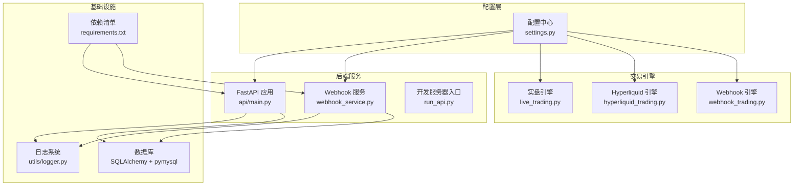
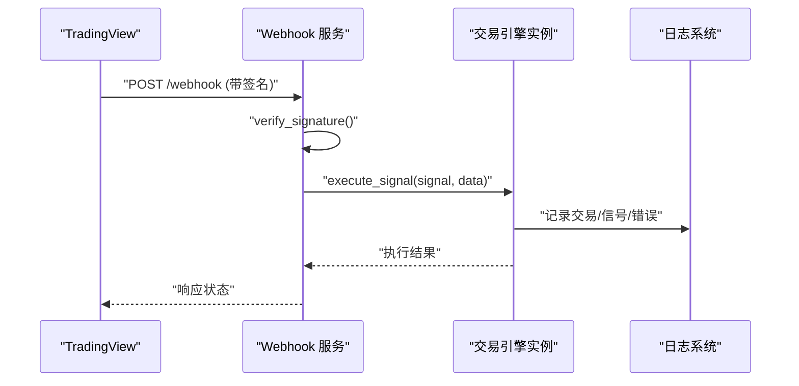
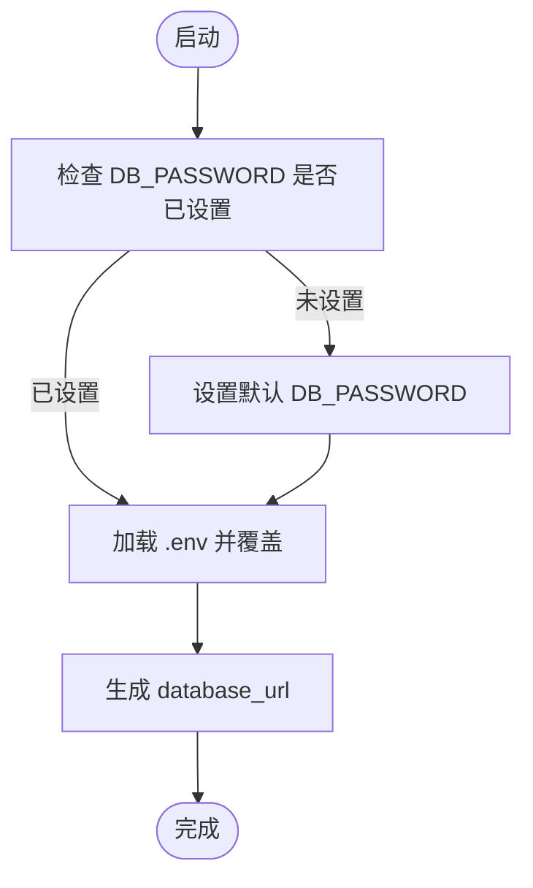
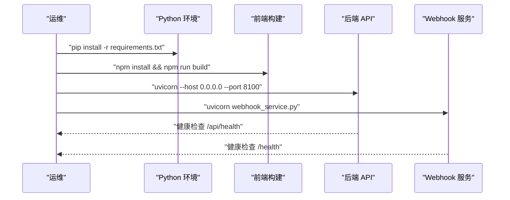
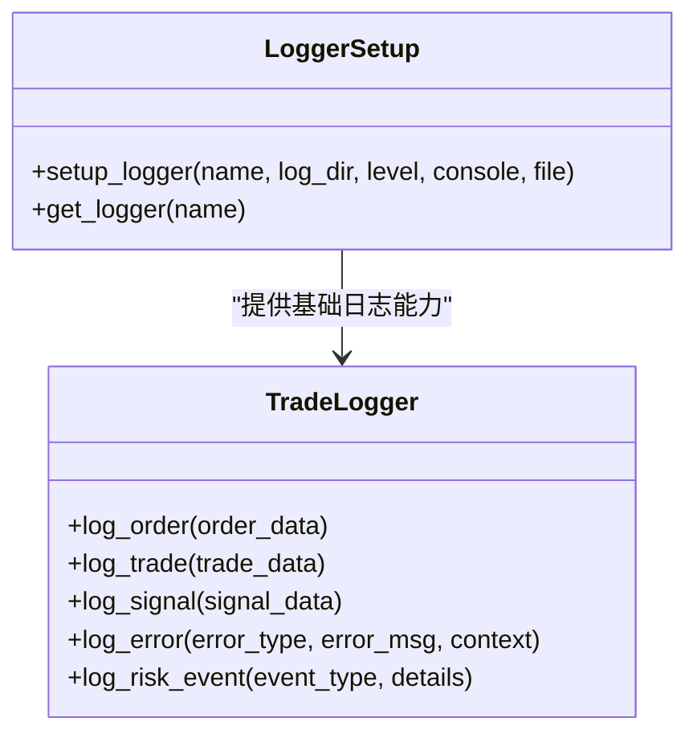
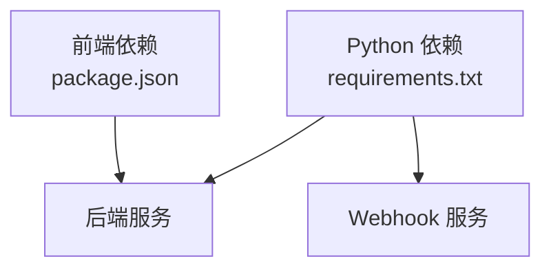

# 部署配置

<cite>
**本文档引用的文件**
- [settings.py](file://backpack_quant_trading/config/settings.py)
- [main.py](file://backpack_quant_trading/main.py)
- [run_api.py](file://backpack_quant_trading/run_api.py)
- [webhook_service.py](file://backpack_quant_trading/webhook_service.py)
- [requirements.txt](file://backpack_quant_trading/requirements.txt)
- [logger.py](file://backpack_quant_trading/utils/logger.py)
- [api_main.py](file://backpack_quant_trading/api/main.py)
- [deps.py](file://backpack_quant_trading/api/deps.py)
- [package.json](file://backpack_quant_trading/frontend/package.json)
</cite>

## 目录
1. [简介](#简介)
2. [项目结构](#项目结构)
3. [核心组件](#核心组件)
4. [架构总览](#架构总览)
5. [详细组件分析](#详细组件分析)
6. [依赖分析](#依赖分析)
7. [性能考虑](#性能考虑)
8. [故障排查指南](#故障排查指南)
9. [结论](#结论)
10. [附录](#附录)

## 简介
本指南面向量化交易系统的部署与运维，聚焦于策略部署的配置管理与部署流程实施。内容涵盖：
- 环境变量设置与优先级
- 数据库连接配置与连接池
- API密钥与安全配置
- 部署流程：代码打包、依赖安装、服务器配置
- 配置文件管理：开发/测试/生产环境差异
- 日志记录与监控配置：日志级别、错误追踪、性能监控
- 部署后验证：功能测试、性能测试、安全检查

## 项目结构
项目采用前后端分离与多引擎协同的架构，核心模块包括：
- 配置中心：集中管理各交易所、数据库、Webhook、交易风控等配置
- 后端API：FastAPI 提供认证、策略、交易、监控等接口
- 实盘引擎：支持多交易所（Backpack、Deepcoin、Ostium、Hyperliquid）
- Webhook服务：接收TradingView信号并驱动交易引擎
- 日志系统：统一的日志格式与轮转策略
- 前端：Vue 构建产物静态托管

**图表来源**
- [settings.py:104-132](file://backpack_quant_trading/config/settings.py#L104-L132)
- [api_main.py:14-53](file://backpack_quant_trading/api/main.py#L14-L53)
- [webhook_service.py:26-598](file://backpack_quant_trading/webhook_service.py#L26-L598)
- [logger.py:57-125](file://backpack_quant_trading/utils/logger.py#L57-L125)
- [requirements.txt:1-61](file://backpack_quant_trading/requirements.txt#L1-L61)

**章节来源**
- [settings.py:104-132](file://backpack_quant_trading/config/settings.py#L104-L132)
- [api_main.py:14-98](file://backpack_quant_trading/api/main.py#L14-L98)
- [webhook_service.py:26-598](file://backpack_quant_trading/webhook_service.py#L26-L598)
- [logger.py:57-125](file://backpack_quant_trading/utils/logger.py#L57-L125)
- [requirements.txt:1-61](file://backpack_quant_trading/requirements.txt#L1-L61)

## 核心组件
- 配置中心（Config）：统一管理数据库、交易所、Webhook、交易风控等配置，并生成数据库连接URL
- FastAPI 应用：提供认证、策略、交易、监控等接口，挂载前端静态资源
- Webhook 服务：接收 TradingView Webhook，支持单实例与广播模式，动态注册/注销引擎实例
- 日志系统：基于标准库与第三方库，提供文件轮转、按级别输出、Windows 安全写入
- 依赖清单：统一声明 Python 依赖，包含 Web 框架、数据库、加密、技术分析、机器学习等

**章节来源**
- [settings.py:104-132](file://backpack_quant_trading/config/settings.py#L104-L132)
- [api_main.py:14-98](file://backpack_quant_trading/api/main.py#L14-L98)
- [webhook_service.py:26-598](file://backpack_quant_trading/webhook_service.py#L26-L598)
- [logger.py:57-125](file://backpack_quant_trading/utils/logger.py#L57-L125)
- [requirements.txt:1-61](file://backpack_quant_trading/requirements.txt#L1-L61)

## 架构总览
系统通过配置中心集中管理环境变量与默认值，后端服务与 Webhook 服务分别承载业务接口与外部信号驱动，日志系统贯穿所有组件，数据库连接通过统一的 URL 生成。

**图表来源**
- [webhook_service.py:320-444](file://backpack_quant_trading/webhook_service.py#L320-L444)
- [logger.py:137-180](file://backpack_quant_trading/utils/logger.py#L137-L180)

## 详细组件分析

### 配置管理（环境变量与密钥）
- 环境变量加载顺序与覆盖策略：若未设置 DB_PASSWORD，则注入默认值；随后加载 .env 文件，允许运行时覆盖
- 数据库连接：通过 Config.database_url 生成 mysql+pymysql:// 用户名:密码@主机:端口/库名
- 交易所密钥：Backpack、Hyperliquid、Deepcoin、Ostium 等均从环境变量读取
- Webhook 密钥与监听：Webhook 服务从配置读取密钥、主机与端口，支持签名校验
- JWT 密钥：后端认证依赖 JWT_SECRET，建议生产环境强制设置

**图表来源**
- [settings.py:6-9](file://backpack_quant_trading/config/settings.py#L6-L9)
- [settings.py:124-130](file://backpack_quant_trading/config/settings.py#L124-L130)

**章节来源**
- [settings.py:6-9](file://backpack_quant_trading/config/settings.py#L6-L9)
- [settings.py:124-130](file://backpack_quant_trading/config/settings.py#L124-L130)
- [deps.py:11-14](file://backpack_quant_trading/api/deps.py#L11-L14)

### 数据库连接配置
- 主机、端口、用户名、密码、库名均可通过环境变量配置
- 连接池参数：POOL_SIZE 与 MAX_OVERFLOW 控制并发与溢出
- 连接 URL 通过 Config.database_url 动态拼装，确保一致性

**章节来源**
- [settings.py:44-52](file://backpack_quant_trading/config/settings.py#L44-L52)
- [settings.py:124-130](file://backpack_quant_trading/config/settings.py#L124-L130)

### API 密钥与安全配置
- 交易所密钥：Backpack（API_KEY、PRIVATE_KEY、PUBLIC_KEY、ACCESS_KEY、REFRESH_KEY）、Hyperliquid（PRIVATE_KEY、AGENT_ADDRESS）、Deepcoin（API_KEY、SECRET_KEY、PASSPHRASE、LEVERAGE）、Ostium（RPC_URL、PRIVATE_KEY、NETWORK、SYMBOL、LEVERAGE）
- Webhook 密钥：WEBHOOK_SECRET、WEBHOOK_HOST、WEBHOOK_PORT、DINGTALK_*、信号规则阈值
- JWT 密钥：JWT_SECRET（生产环境必须替换）

**章节来源**
- [settings.py:13-31](file://backpack_quant_trading/config/settings.py#L13-L31)
- [settings.py:34-41](file://backpack_quant_trading/config/settings.py#L34-L41)
- [settings.py:92-101](file://backpack_quant_trading/config/settings.py#L92-L101)
- [settings.py:68-74](file://backpack_quant_trading/config/settings.py#L68-L74)
- [settings.py:78-88](file://backpack_quant_trading/config/settings.py#L78-L88)
- [deps.py:11-14](file://backpack_quant_trading/api/deps.py#L11-L14)

### 部署流程实施步骤
- 代码打包与依赖安装
  - 后端：pip install -r requirements.txt
  - 前端：npm install（package.json 已声明依赖），构建产物位于 frontend/dist
- 服务器配置
  - 后端 API：run_api.py 使用 uvicorn 启动，绑定 0.0.0.0:8100，reload 开发模式
  - Webhook 服务：webhook_service.py 读取配置中的 HOST/PORT 启动
  - 前端静态资源：FastAPI 在 api/main.py 中挂载 frontend/dist 静态目录
- 环境变量准备
  - .env 文件中设置数据库、交易所、Webhook、JWT 等密钥
  - 生产环境务必设置 JWT_SECRET、各交易所私钥与 Webhook 密钥

**图表来源**
- [requirements.txt:1-61](file://backpack_quant_trading/requirements.txt#L1-L61)
- [package.json:6-10](file://backpack_quant_trading/frontend/package.json#L6-L10)
- [run_api.py:22-28](file://backpack_quant_trading/run_api.py#L22-L28)
- [webhook_service.py:590-594](file://backpack_quant_trading/webhook_service.py#L590-L594)
- [api_main.py:51-53](file://backpack_quant_trading/api/main.py#L51-L53)

**章节来源**
- [requirements.txt:1-61](file://backpack_quant_trading/requirements.txt#L1-L61)
- [package.json:6-10](file://backpack_quant_trading/frontend/package.json#L6-L10)
- [run_api.py:22-28](file://backpack_quant_trading/run_api.py#L22-L28)
- [webhook_service.py:590-594](file://backpack_quant_trading/webhook_service.py#L590-L594)
- [api_main.py:51-53](file://backpack_quant_trading/api/main.py#L51-L53)

### 配置文件管理（开发/测试/生产）
- 开发环境：run_api.py 使用 reload=True，便于本地调试；日志级别较低，输出到控制台与文件
- 测试环境：建议独立 .env 文件，隔离数据库与交易所密钥；Webhook 密钥可使用测试密钥
- 生产环境：严格限制日志级别至 INFO/ERROR；JWT_SECRET 必须强口令；数据库与交易所密钥通过只读环境注入；禁用 reload

**章节来源**
- [run_api.py:22-28](file://backpack_quant_trading/run_api.py#L22-L28)
- [logger.py:57-125](file://backpack_quant_trading/utils/logger.py#L57-L125)

### 日志记录与监控配置
- 日志级别：INFO/DEBUG/ERROR 分级输出
- 文件轮转：按大小轮转，Windows 下使用安全写入处理器
- 交易日志：专门的 TradeLogger 记录订单、成交、信号与风险事件
- Webhook 服务：统一格式化日志，落盘到 log_dir

**图表来源**
- [logger.py:57-125](file://backpack_quant_trading/utils/logger.py#L57-L125)
- [logger.py:137-180](file://backpack_quant_trading/utils/logger.py#L137-L180)

**章节来源**
- [logger.py:57-125](file://backpack_quant_trading/utils/logger.py#L57-L125)
- [logger.py:137-180](file://backpack_quant_trading/utils/logger.py#L137-L180)
- [webhook_service.py:14-24](file://backpack_quant_trading/webhook_service.py#L14-L24)

### 部署后验证
- 功能测试
  - 后端健康检查：GET /api/health
  - Webhook 健康检查：GET /health
  - 登录认证：JWT_SECRET 正确时可获取受保护资源
- 性能测试
  - 评估日志写入性能（Windows 安全写入与轮转）
  - 数据库连接池压力测试（POOL_SIZE 与 MAX_OVERFLOW）
- 安全检查
  - JWT_SECRET 是否正确设置
  - Webhook 签名验证是否开启
  - 交易所私钥是否仅通过环境注入

**章节来源**
- [api_main.py:51-53](file://backpack_quant_trading/api/main.py#L51-L53)
- [webhook_service.py:79-81](file://backpack_quant_trading/webhook_service.py#L79-L81)
- [deps.py:11-14](file://backpack_quant_trading/api/deps.py#L11-L14)

## 依赖分析
- 后端依赖：FastAPI、Uvicorn、SQLAlchemy、PyMySQL、JWT、加密与安全库、技术分析与机器学习库
- 前端依赖：React、ECharts、Axios、路由等
- 依赖版本集中在 requirements.txt 与 package.json

**图表来源**
- [requirements.txt:1-61](file://backpack_quant_trading/requirements.txt#L1-L61)
- [package.json:11-25](file://backpack_quant_trading/frontend/package.json#L11-L25)

**章节来源**
- [requirements.txt:1-61](file://backpack_quant_trading/requirements.txt#L1-L61)
- [package.json:11-25](file://backpack_quant_trading/frontend/package.json#L11-L25)

## 性能考虑
- 日志写入：Windows 下使用安全文件处理器，避免权限冲突；按大小轮转减少磁盘占用
- 数据库连接：合理设置连接池大小与溢出，避免高并发下的连接争用
- Webhook 并发：使用异步任务执行信号，避免阻塞请求处理
- 前端静态资源：构建后静态托管，减少后端 I/O 压力

[本节为通用指导，无需特定文件来源]

## 故障排查指南
- 启动失败
  - 检查 .env 是否正确设置数据库与密钥
  - 确认端口未被占用（API:8100、Webhook:配置端口）
- 认证失败
  - 确认 JWT_SECRET 已设置且与前端一致
- Webhook 无效
  - 确认 X-Signature 头与配置的 WEBHOOK_SECRET 匹配
  - 查看 /health 与 /instances 状态
- 日志异常
  - 检查 log 目录权限与磁盘空间
  - 确认日志轮转策略未导致文件锁定

**章节来源**
- [webhook_service.py:34-45](file://backpack_quant_trading/webhook_service.py#L34-L45)
- [webhook_service.py:79-81](file://backpack_quant_trading/webhook_service.py#L79-L81)
- [logger.py:57-125](file://backpack_quant_trading/utils/logger.py#L57-L125)

## 结论
通过集中化的配置中心、清晰的环境变量覆盖策略、完善的日志与监控体系，以及标准化的部署流程，本系统可在开发、测试与生产环境中稳定运行。建议在生产环境强化密钥管理与安全配置，持续监控日志与数据库连接池状态，确保交易引擎的可靠性与安全性。

[本节为总结性内容，无需特定文件来源]

## 附录
- 环境变量清单（示例）
  - 数据库：DB_HOST、DB_PORT、DB_USER、DB_PASSWORD、DB_NAME
  - 交易所：BACKPACK_*、HYPERLIQUID_*、DEEPCOIN_*、OSTIUM_*
  - Webhook：WEBHOOK_SECRET、WEBHOOK_HOST、WEBHOOK_PORT、DINGTALK_TOKEN、DINGTALK_SECRET
  - 认证：JWT_SECRET

[本节为概念性内容，无需特定文件来源]