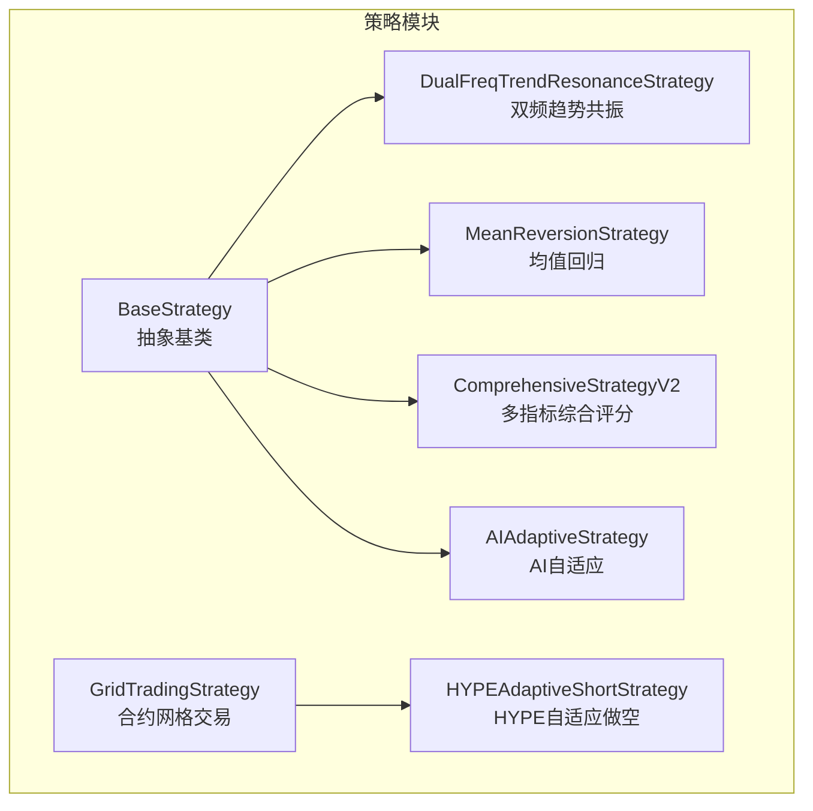
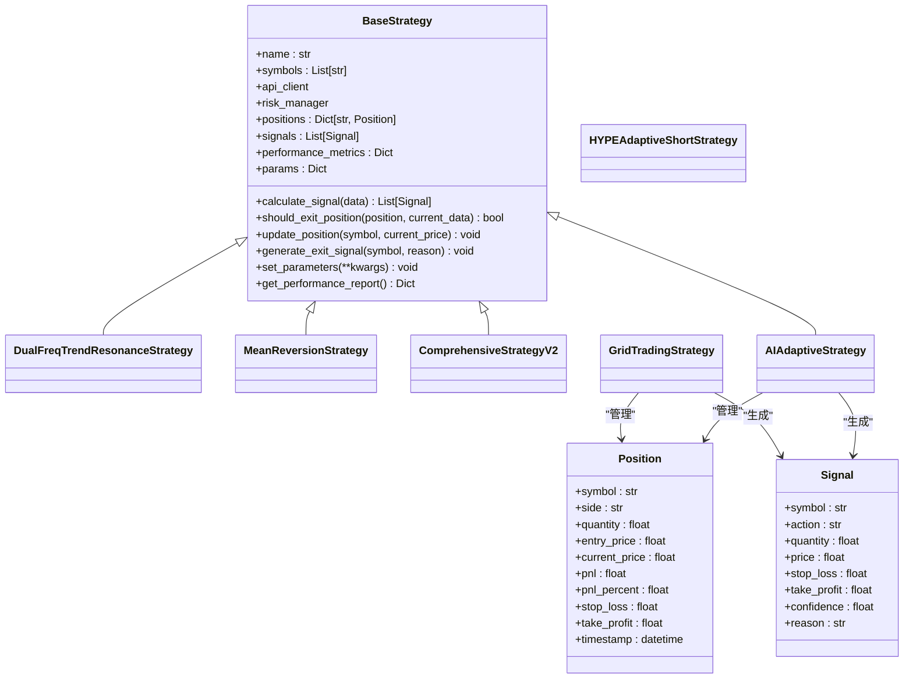
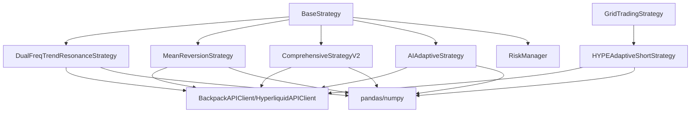

# 策略设计与概念

<cite>
**本文引用的文件**
- [strategy/base.py](file://backpack_quant_trading/strategy/base.py)
- [strategy/grid_strategy.py](file://backpack_quant_trading/strategy/grid_strategy.py)
- [strategy/dual_freq_trend.py](file://backpack_quant_trading/strategy/dual_freq_trend.py)
- [strategy/mean_reversion.py](file://backpack_quant_trading/strategy/mean_reversion.py)
- [strategy/comprehensive.py](file://backpack_quant_trading/strategy/comprehensive.py)
- [strategy/ai_adaptive.py](file://backpack_quant_trading/strategy/ai_adaptive.py)
- [strategy/hype_adaptive_short.py](file://backpack_quant_trading/strategy/hype_adaptive_short.py)
</cite>

## 目录
1. [引言](#引言)
2. [项目结构](#项目结构)
3. [核心组件](#核心组件)
4. [架构概览](#架构概览)
5. [详细组件分析](#详细组件分析)
6. [依赖分析](#依赖分析)
7. [性能考虑](#性能考虑)
8. [故障排除指南](#故障排除指南)
9. [结论](#结论)

## 引言
本文件系统性阐述量化交易策略的设计与概念，围绕技术分析原理、市场假设与交易逻辑构建展开，覆盖从市场现象观察到交易规则制定的完整流程，并结合项目中的策略实现，说明技术指标选择、信号生成逻辑与风险管理原则。文档还提供策略分类说明（趋势跟踪、均值回归、动量策略等）及其适用市场条件，策略参数设计原则与优化思路，以及基于BaseStrategy基类的策略接口设计与抽象方法实现要求。

## 项目结构
策略模块位于backpack_quant_trading/strategy目录，包含多个具体策略实现与一个通用基类。策略基类定义了统一的接口规范与通用功能（如仓位管理、信号生成、性能指标等），具体策略在此基础上扩展各自的技术分析与交易逻辑。

图表来源
- [strategy/base.py:41-212](file://backpack_quant_trading/strategy/base.py#L41-L212)
- [strategy/dual_freq_trend.py:18-168](file://backpack_quant_trading/strategy/dual_freq_trend.py#L18-L168)
- [strategy/mean_reversion.py:23-117](file://backpack_quant_trading/strategy/mean_reversion.py#L23-L117)
- [strategy/comprehensive.py:17-91](file://backpack_quant_trading/strategy/comprehensive.py#L17-L91)
- [strategy/grid_strategy.py:38-156](file://backpack_quant_trading/strategy/grid_strategy.py#L38-L156)
- [strategy/ai_adaptive.py:12-55](file://backpack_quant_trading/strategy/ai_adaptive.py#L12-L55)
- [strategy/hype_adaptive_short.py:197-254](file://backpack_quant_trading/strategy/hype_adaptive_short.py#L197-L254)

章节来源
- [strategy/base.py:1-212](file://backpack_quant_trading/strategy/base.py#L1-L212)
- [strategy/grid_strategy.py:1-156](file://backpack_quant_trading/strategy/grid_strategy.py#L1-L156)

## 核心组件
- BaseStrategy（抽象基类）
  - 定义策略生命周期与核心接口：calculate_signal（计算交易信号）、should_exit_position（判断平仓）、update_position（更新仓位）、generate_exit_signal（生成平仓信号）、set_parameters（设置参数）、get_performance_report（获取性能报告）等。
  - 提供通用状态管理（positions、signals、performance_metrics）与基础风控（盈亏计算、止盈止损触发）。
  - 通过数据类Position与Signal封装交易状态与信号信息。

- 具体策略
  - 趋势跟踪：DualFreqTrendResonanceStrategy（双频趋势共振），结合1分钟与15分钟指标进行高频入场与出场。
  - 均值回归：MeanReversionStrategy（Z-score回归），在偏离均值一定阈值时反向建仓。
  - 综合评分：ComprehensiveStrategyV2（多指标评分系统），通过加权评分与趋势过滤提升信号质量。
  - 网格交易：GridTradingStrategy（合约网格），在设定价格区间内自动高抛低吸。
  - AI自适应：AIAdaptiveStrategy（基于AI的自适应分析），通过本地指标预筛选与AI深度分析联动。
  - HYPE做空：HYPEAdaptiveShortStrategy（基于MACD死叉与日线WMA的自适应做空）。

章节来源
- [strategy/base.py:16-212](file://backpack_quant_trading/strategy/base.py#L16-L212)
- [strategy/dual_freq_trend.py:18-168](file://backpack_quant_trading/strategy/dual_freq_trend.py#L18-L168)
- [strategy/mean_reversion.py:23-117](file://backpack_quant_trading/strategy/mean_reversion.py#L23-L117)
- [strategy/comprehensive.py:17-91](file://backpack_quant_trading/strategy/comprehensive.py#L17-L91)
- [strategy/grid_strategy.py:38-156](file://backpack_quant_trading/strategy/grid_strategy.py#L38-L156)
- [strategy/ai_adaptive.py:12-55](file://backpack_quant_trading/strategy/ai_adaptive.py#L12-L55)
- [strategy/hype_adaptive_short.py:197-254](file://backpack_quant_trading/strategy/hype_adaptive_short.py#L197-L254)

## 架构概览
策略架构遵循“基类抽象 + 多策略扩展”的设计，所有策略共享统一的数据结构与接口契约，便于统一接入引擎、风控与回测系统。

图表来源
- [strategy/base.py:16-212](file://backpack_quant_trading/strategy/base.py#L16-L212)
- [strategy/dual_freq_trend.py:18-168](file://backpack_quant_trading/strategy/dual_freq_trend.py#L18-L168)
- [strategy/mean_reversion.py:23-117](file://backpack_quant_trading/strategy/mean_reversion.py#L23-L117)
- [strategy/comprehensive.py:17-91](file://backpack_quant_trading/strategy/comprehensive.py#L17-L91)
- [strategy/grid_strategy.py:38-156](file://backpack_quant_trading/strategy/grid_strategy.py#L38-L156)
- [strategy/ai_adaptive.py:12-55](file://backpack_quant_trading/strategy/ai_adaptive.py#L12-L55)
- [strategy/hype_adaptive_short.py:197-254](file://backpack_quant_trading/strategy/hype_adaptive_short.py#L197-L254)

## 详细组件分析

### 基类与接口设计（BaseStrategy）
- 设计要点
  - 抽象方法：calculate_signal与should_exit_position强制子类实现，保证策略行为的一致性。
  - 状态管理：集中维护positions、signals、performance_metrics，便于统一风控与报告。
  - 通用风控：内置盈亏计算、止盈止损触发与平仓信号生成，降低重复代码。
  - 参数化：set_parameters支持运行时参数注入，便于前端或引擎动态调整。

- 关键流程
  - 计算信号：子类基于市场数据计算并返回Signal列表。
  - 更新仓位：定期调用update_position更新实时盈亏与触发平仓。
  - 性能报告：get_performance_report汇总策略表现指标。

章节来源
- [strategy/base.py:41-212](file://backpack_quant_trading/strategy/base.py#L41-L212)

### 趋势跟踪策略：双频趋势共振（DualFreqTrendResonanceStrategy）
- 技术分析原理
  - 15分钟趋势：EMA9/21与ADX/DMI过滤，要求连续两根确认。
  - 1分钟入场：EMA5/13、RSI6、布林带、MACD柱方向与成交量确认。
  - 加权评分：将趋势、价格位置、RSI、均线状态、MACD、成交量、波动率、形态等纳入评分体系，按阈值与权重决定开仓与保证金分配。

- 交易逻辑
  - 入场：15分钟趋势与1分钟信号共振，且加权评分达到阈值。
  - 出场：固定止盈止损、时间止损、15分钟趋势反转或追踪回撤止盈。
  - 风险管理：日内最大回撤限制、冷却与最小进场间隔、分批止盈与移动止损。

- 参数设计
  - 周期参数：EMA、RSI、布林带、ADXR等。
  - 风控参数：tp_pct/sl_pct、time_stop_bars、cooldown_bars、min_entry_gap、daily_loss_pct。
  - 评分参数：condition_weights、min_weighted_score、score_margin_levels。

- 适用市场条件
  - 趋势明确、波动适中、流动性良好。
  - 避免震荡市与极端波动时段。

章节来源
- [strategy/dual_freq_trend.py:18-168](file://backpack_quant_trading/strategy/dual_freq_trend.py#L18-L168)
- [strategy/dual_freq_trend.py:170-270](file://backpack_quant_trading/strategy/dual_freq_trend.py#L170-L270)
- [strategy/dual_freq_trend.py:289-426](file://backpack_quant_trading/strategy/dual_freq_trend.py#L289-L426)
- [strategy/dual_freq_trend.py:428-598](file://backpack_quant_trading/strategy/dual_freq_trend.py#L428-L598)
- [strategy/dual_freq_trend.py:636-800](file://backpack_quant_trading/strategy/dual_freq_trend.py#L636-L800)

### 均值回归策略（MeanReversionStrategy）
- 技术分析原理
  - 使用滚动均值与标准差计算Z-score，当价格偏离均值超过阈值时反向建仓。
  - 结合止损止盈与Z-score回归到均值时平仓的逻辑。

- 交易逻辑
  - 入场：Z-score绝对值超过阈值，计算仓位大小并设置止盈止损。
  - 出场：触发止损止盈或Z-score接近均值时平仓。
  - 仓位管理：基于账户余额与配置杠杆计算实际持仓价值与数量。

- 参数设计
  - lookback_period：回看周期。
  - zscore_threshold：Z-score阈值。
  - stop_loss_percent/take_profit_percent：止盈止损比例。
  - position_size：保证金绝对数量（非比例）。

- 适用市场条件
  - 区间震荡或小幅波动，避免单边趋势过长的行情。

章节来源
- [strategy/mean_reversion.py:23-117](file://backpack_quant_trading/strategy/mean_reversion.py#L23-L117)
- [strategy/mean_reversion.py:119-149](file://backpack_quant_trading/strategy/mean_reversion.py#L119-L149)
- [strategy/mean_reversion.py:151-246](file://backpack_quant_trading/strategy/mean_reversion.py#L151-L246)

### 综合评分策略（ComprehensiveStrategyV2）
- 技术分析原理
  - 多周期均线、布林带、RSI、MACD、成交量、KDJ、OBV、ATR、动量等指标。
  - 加权评分系统：至少N个指标同向确认，且加权评分达到阈值才开仓。
  - 趋势过滤：仅顺势交易，要求价格在MA50上方（做多）或下方（做空）。

- 交易逻辑
  - 入场：趋势过滤通过 + 多指标共振 + 加权评分阈值。
  - 出场：RSI技术止盈、ATR动态止盈止损、趋势反转。
  - 风控：单品种最大仓位、总保证金上限、波动率过滤（布林带宽度）。

- 参数设计
  - 指标权重：condition_weights。
  - 评分阈值：min_score_to_open、min_weighted_score。
  - 仓位与风控：max_position_ratio、total_margin_ratio、min_bb_width、require_ma50_filter。

- 适用市场条件
  - 中等波动、趋势与震荡交替的市场环境。

章节来源
- [strategy/comprehensive.py:17-91](file://backpack_quant_trading/strategy/comprehensive.py#L17-L91)
- [strategy/comprehensive.py:92-168](file://backpack_quant_trading/strategy/comprehensive.py#L92-L168)
- [strategy/comprehensive.py:170-222](file://backpack_quant_trading/strategy/comprehensive.py#L170-L222)
- [strategy/comprehensive.py:224-405](file://backpack_quant_trading/strategy/comprehensive.py#L224-L405)
- [strategy/comprehensive.py:782-800](file://backpack_quant_trading/strategy/comprehensive.py#L782-L800)

### 网格交易策略（GridTradingStrategy）
- 交易逻辑
  - 在价格区间内按网格挂单，双向/做多/做空三种模式。
  - 订单成交后挂追踪平仓单，平仓后再补回同价位开仓挂单。
  - 实时监控与重试机制，支持WebSocket与REST API双通道。

- 风险管理
  - 日内最大回撤、总亏损限制、429限频熔断、冷却与边界保护。
  - 未实现盈亏估算、峰值利润与最大回撤统计。

- 参数设计
  - price_lower/price_upper：网格价格范围。
  - grid_count：网格数量。
  - investment_per_grid：单格投资。
  - leverage：杠杆倍数。
  - grid_mode：网格类型（long_short/long_only/short_only）。

- 适用市场条件
  - 区间震荡市场，适合震荡择时与低摩擦成本场景。

章节来源
- [strategy/grid_strategy.py:38-156](file://backpack_quant_trading/strategy/grid_strategy.py#L38-L156)
- [strategy/grid_strategy.py:179-280](file://backpack_quant_trading/strategy/grid_strategy.py#L179-L280)
- [strategy/grid_strategy.py:532-597](file://backpack_quant_trading/strategy/grid_strategy.py#L532-L597)
- [strategy/grid_strategy.py:599-754](file://backpack_quant_trading/strategy/grid_strategy.py#L599-L754)

### AI自适应策略（AIAdaptiveStrategy）
- 设计理念
  - 本地指标预筛选（RSI、MACD、布林带、ATR）大幅降低AI调用频率。
  - 日内交易模式：1分钟K线驱动，快速判断与深度分析相结合。
  - 严格开平仓配对，确保每笔开仓都有对应平仓目标。

- 信号生成流程
  - 每1分钟K线到达时，先计算本地指标，满足触发条件再调用AI分析。
  - AI分析输出标准化格式，解析后生成Signal并计算止盈止损与仓位。
  - 支持深度分析（1000根K线）与快速判断（WebSocket实时）两种模式。

- 参数设计
  - margin：单笔保证金。
  - leverage：杠杆。
  - stop_loss_ratio/take_profit_ratio：止损止盈比例。
  - deep_analysis_interval：深度分析间隔。

- 适用市场条件
  - 高频日内交易，波动性较强、信号频繁的市场。

章节来源
- [strategy/ai_adaptive.py:12-55](file://backpack_quant_trading/strategy/ai_adaptive.py#L12-L55)
- [strategy/ai_adaptive.py:266-333](file://backpack_quant_trading/strategy/ai_adaptive.py#L266-L333)
- [strategy/ai_adaptive.py:334-450](file://backpack_quant_trading/strategy/ai_adaptive.py#L334-L450)
- [strategy/ai_adaptive.py:672-774](file://backpack_quant_trading/strategy/ai_adaptive.py#L672-L774)

### HYPE自适应做空策略（HYPEAdaptiveShortStrategy）
- 交易逻辑
  - 基于TradingView Pine脚本逻辑：4H MACD死叉 + 价格跌破日线WMA15，满足双条件才做空。
  - 离场：MACD金叉离场优先；固定止盈止损与移动止损（盈利≥3%时将止损移至成本价）。
  - WebSocket实时K线接入，支持1分钟K线缓存与重采样（4H、日线）。

- 参数设计
  - macd_fast/slow/signal：MACD参数。
  - wma_len：日线WMA周期。
  - stop_loss_pct/take_profit_pct：固定止损止盈。
  - break_even_pct：保本触发比例。

- 适用市场条件
  - 单边下跌趋势明确、MACD与WMA信号稳定的市场。

章节来源
- [strategy/hype_adaptive_short.py:197-254](file://backpack_quant_trading/strategy/hype_adaptive_short.py#L197-L254)
- [strategy/hype_adaptive_short.py:255-372](file://backpack_quant_trading/strategy/hype_adaptive_short.py#L255-L372)
- [strategy/hype_adaptive_short.py:375-506](file://backpack_quant_trading/strategy/hype_adaptive_short.py#L375-L506)
- [strategy/hype_adaptive_short.py:619-689](file://backpack_quant_trading/strategy/hype_adaptive_short.py#L619-L689)
- [strategy/hype_adaptive_short.py:727-742](file://backpack_quant_trading/strategy/hype_adaptive_short.py#L727-L742)

## 依赖分析
- 组件耦合
  - BaseStrategy为所有策略提供统一接口与通用功能，降低策略间的耦合度。
  - 具体策略独立实现技术分析与交易逻辑，通过抽象方法与数据类解耦。
- 外部依赖
  - API客户端：BackpackAPIClient、HyperliquidAPIClient等，负责下单、查询与WebSocket订阅。
  - 风控模块：RiskManager，用于仓位校验与风控拦截。
  - 数据模块：pandas/numpy用于技术指标计算与数据处理。

图表来源
- [strategy/base.py:46-68](file://backpack_quant_trading/strategy/base.py#L46-L68)
- [strategy/dual_freq_trend.py:15-34](file://backpack_quant_trading/strategy/dual_freq_trend.py#L15-L34)
- [strategy/mean_reversion.py:7-28](file://backpack_quant_trading/strategy/mean_reversion.py#L7-L28)
- [strategy/comprehensive.py:13-26](file://backpack_quant_trading/strategy/comprehensive.py#L13-L26)
- [strategy/ai_adaptive.py:17-41](file://backpack_quant_trading/strategy/ai_adaptive.py#L17-L41)
- [strategy/hype_adaptive_short.py:24-25](file://backpack_quant_trading/strategy/hype_adaptive_short.py#L24-L25)

## 性能考虑
- 指标计算复杂度
  - 指数移动平均（EMA）与滚动窗口指标（如RSI、布林带）的时间复杂度通常为O(n)；多周期指标叠加需注意数据长度与缓存。
- 信号生成频率
  - 高频策略（如AI自适应、双频趋势）对实时数据处理与API调用频率敏感，需结合本地指标预筛选降低调用成本。
- 风控与回撤控制
  - 通过日最大回撤、冷却与最小间隔等参数限制单日风险暴露，避免过度交易导致的回撤扩大。
- I/O与网络
  - 网格策略与HYPE策略依赖WebSocket与REST API，需关注限频与熔断机制（如429），并实现重连与退避策略。

## 故障排除指南
- 常见问题
  - API限频（429）：网格策略与AI策略均实现熔断与冷却，检查冷却时间与请求频率。
  - 数据缺失或格式异常：检查K线数据长度与字段命名一致性，必要时降级到REST API。
  - 仓位计算为0：检查账户余额、最小交易单位与风控拦截。
- 排查步骤
  - 核对策略参数与市场数据长度是否满足指标计算要求。
  - 查看日志中的指标状态与信号生成过程，定位异常环节。
  - 验证API客户端连接状态与权限配置。

章节来源
- [strategy/grid_strategy.py:400-498](file://backpack_quant_trading/strategy/grid_strategy.py#L400-L498)
- [strategy/ai_adaptive.py:266-333](file://backpack_quant_trading/strategy/ai_adaptive.py#L266-L333)
- [strategy/mean_reversion.py:151-246](file://backpack_quant_trading/strategy/mean_reversion.py#L151-L246)

## 结论
本项目通过BaseStrategy抽象基类统一策略接口，结合多种具体策略实现，覆盖趋势跟踪、均值回归、动量与网格交易等主要策略类别。策略设计强调技术分析原理与市场假设的结合，通过指标选择、信号生成与风险管理三者协同，形成可配置、可扩展、可验证的策略体系。参数设计与优化思路贯穿策略开发全流程，既保证策略在不同市场条件下的稳健性，也为进一步迭代与自动化优化奠定基础。