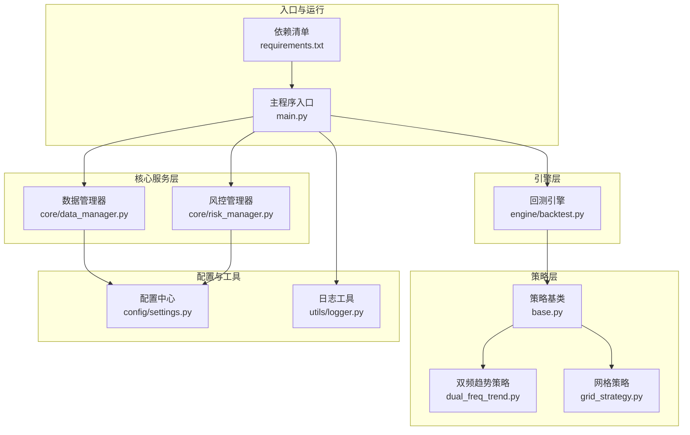
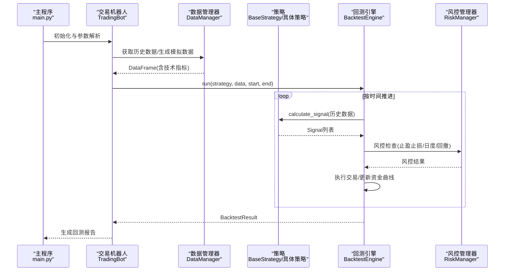
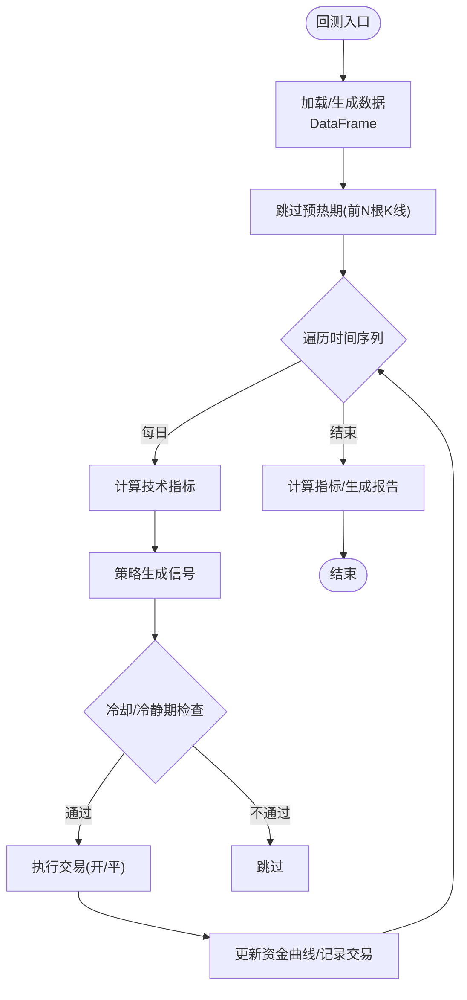
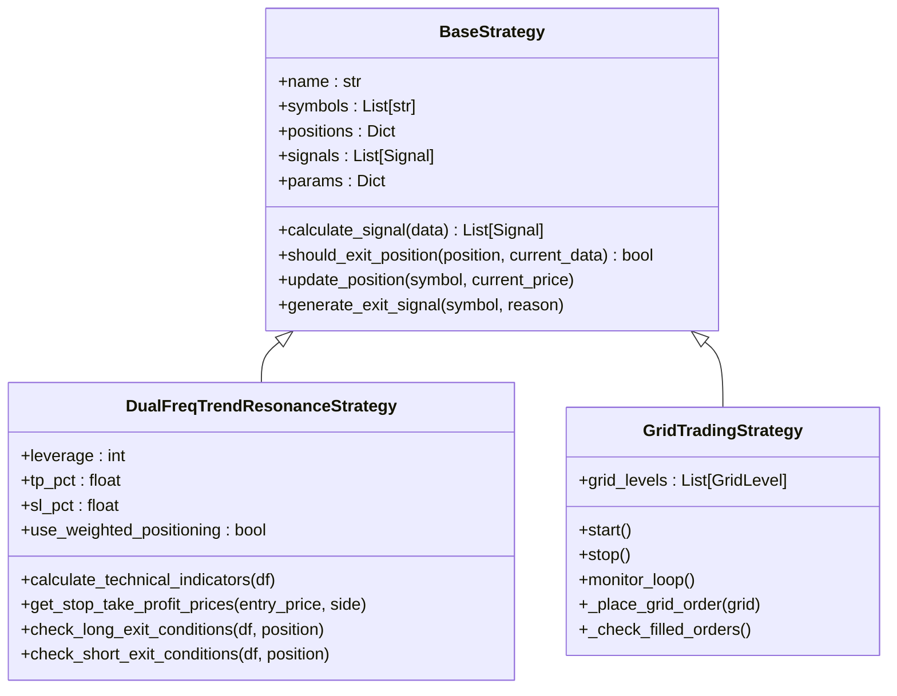
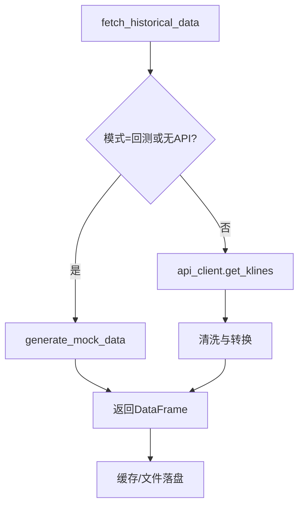
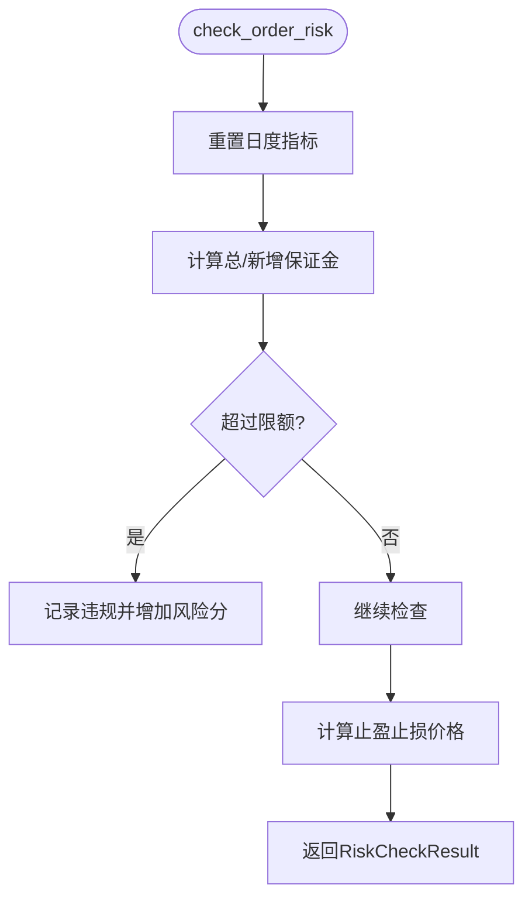
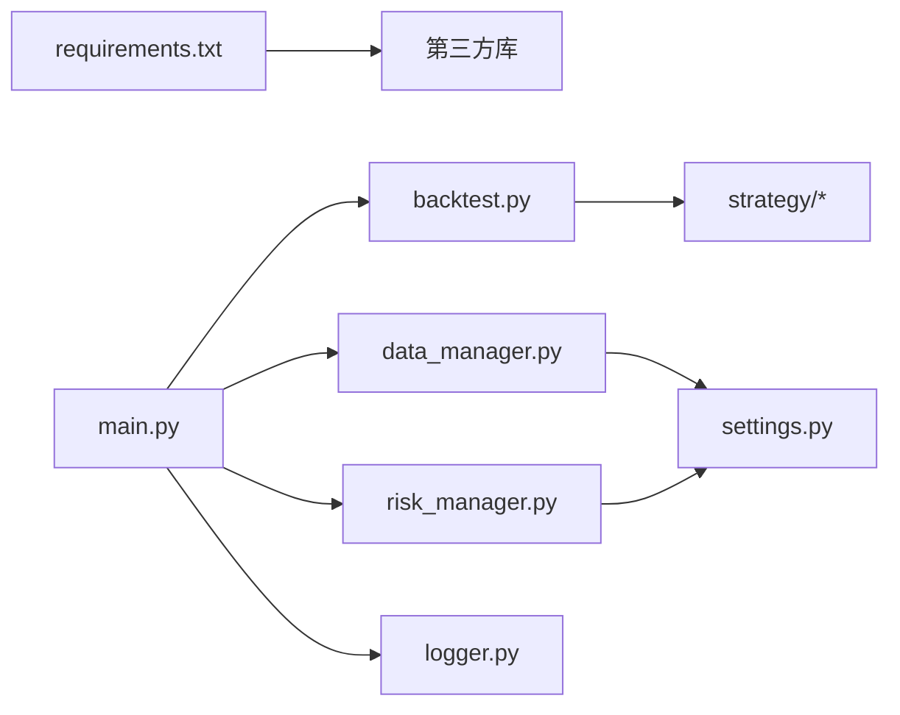

# 测试策略

<cite>
**本文引用的文件**   
- [main.py](file://backpack_quant_trading/main.py)
- [backtest.py](file://backpack_quant_trading/engine/backtest.py)
- [data_manager.py](file://backpack_quant_trading/core/data_manager.py)
- [risk_manager.py](file://backpack_quant_trading/core/risk_manager.py)
- [base.py](file://backpack_quant_trading/strategy/base.py)
- [dual_freq_trend.py](file://backpack_quant_trading/strategy/dual_freq_trend.py)
- [grid_strategy.py](file://backpack_quant_trading/strategy/grid_strategy.py)
- [settings.py](file://backpack_quant_trading/config/settings.py)
- [requirements.txt](file://backpack_quant_trading/requirements.txt)
- [logger.py](file://backpack_quant_trading/utils/logger.py)
</cite>

## 目录
1. [引言](#引言)
2. [项目结构](#项目结构)
3. [核心组件](#核心组件)
4. [架构总览](#架构总览)
5. [详细组件分析](#详细组件分析)
6. [依赖分析](#依赖分析)
7. [性能考虑](#性能考虑)
8. [故障排查指南](#故障排查指南)
9. [结论](#结论)
10. [附录](#附录)

## 引言
本测试策略文档面向量化交易系统，围绕单元测试、集成测试与端到端测试，构建完整的测试体系。重点覆盖策略回测测试框架、历史数据验证与性能基准测试、模拟交易测试、风险控制测试、异常处理测试、测试数据准备与测试环境配置、持续集成流程、测试覆盖率与性能指标、回归测试策略，以及测试自动化脚本与测试报告生成方法。

## 项目结构
系统采用分层架构：策略层（Strategy）、引擎层（Engine）、核心服务层（Core）、配置与工具（Config/Utils）、API与前端（API/Frontend）。测试将分别针对策略、引擎、数据与风控等模块进行分层测试，确保各层职责清晰、边界明确。

图表来源
- [main.py:1-344](file://backpack_quant_trading/main.py#L1-L344)
- [backtest.py:1-404](file://backpack_quant_trading/engine/backtest.py#L1-L404)
- [data_manager.py:1-518](file://backpack_quant_trading/core/data_manager.py#L1-L518)
- [risk_manager.py:1-566](file://backpack_quant_trading/core/risk_manager.py#L1-L566)
- [base.py:1-212](file://backpack_quant_trading/strategy/base.py#L1-L212)
- [dual_freq_trend.py:1-931](file://backpack_quant_trading/strategy/dual_freq_trend.py#L1-L931)
- [grid_strategy.py:1-1508](file://backpack_quant_trading/strategy/grid_strategy.py#L1-L1508)
- [settings.py:1-137](file://backpack_quant_trading/config/settings.py#L1-L137)
- [logger.py:1-180](file://backpack_quant_trading/utils/logger.py#L1-L180)
- [requirements.txt:1-61](file://backpack_quant_trading/requirements.txt#L1-L61)

章节来源
- [main.py:1-344](file://backpack_quant_trading/main.py#L1-L344)
- [requirements.txt:1-61](file://backpack_quant_trading/requirements.txt#L1-L61)

## 核心组件
- 策略基类与具体策略：策略基类定义统一的信号、仓位与性能接口；双频趋势策略与网格策略实现具体交易逻辑与风控参数。
- 回测引擎：负责按时间序列驱动策略、执行交易、计算指标与生成报告。
- 数据管理器：提供历史数据获取、模拟数据生成、缓存与清洗。
- 风控管理器：负责仓位校验、止损止盈、日度与回撤监控、风险事件记录与报告。
- 配置中心：集中管理交易、数据库、Webhook、交易所等配置。
- 日志工具：提供交易、错误、风险事件的结构化日志记录。

章节来源
- [base.py:1-212](file://backpack_quant_trading/strategy/base.py#L1-L212)
- [dual_freq_trend.py:1-931](file://backpack_quant_trading/strategy/dual_freq_trend.py#L1-L931)
- [grid_strategy.py:1-1508](file://backpack_quant_trading/strategy/grid_strategy.py#L1-L1508)
- [backtest.py:1-404](file://backpack_quant_trading/engine/backtest.py#L1-L404)
- [data_manager.py:1-518](file://backpack_quant_trading/core/data_manager.py#L1-L518)
- [risk_manager.py:1-566](file://backpack_quant_trading/core/risk_manager.py#L1-L566)
- [settings.py:1-137](file://backpack_quant_trading/config/settings.py#L1-L137)
- [logger.py:1-180](file://backpack_quant_trading/utils/logger.py#L1-L180)

## 架构总览
回测流程从主程序入口启动，加载策略与数据，调用回测引擎执行信号生成与交易执行，期间通过风控管理器进行风险校验与记录，最终生成回测报告。

图表来源
- [main.py:72-114](file://backpack_quant_trading/main.py#L72-L114)
- [backtest.py:65-187](file://backpack_quant_trading/engine/backtest.py#L65-L187)
- [data_manager.py:114-167](file://backpack_quant_trading/core/data_manager.py#L114-L167)
- [risk_manager.py:132-229](file://backpack_quant_trading/core/risk_manager.py#L132-L229)

## 详细组件分析

### 回测引擎测试（单元/集成）
- 测试目标
  - 信号生成与执行：验证策略信号在回测引擎中被正确执行，包括开多、开空、平仓与重复开仓阻断。
  - 止盈止损与时间止损：验证K线内止盈止损模拟、收盘价二次检查与时间止损。
  - 指标计算与预热期：验证技术指标计算、预热期跳过与多数据源合并。
  - 指标计算与预热期：验证技术指标计算、预热期跳过与多数据源合并。
  - 资金曲线与指标：验证总收益、年化收益、夏普比率、最大回撤、胜率、盈利因子等指标。
- 测试要点
  - 输入：多交易对DataFrame（含OHLCV与技术指标）、策略实例、起止时间。
  - 关键断言：交易记录数量与类型、最终资金、关键指标阈值。
  - 边界：空数据、滑点与手续费、冷静期与冷却期、重复开仓阻断。
- 测试数据
  - 使用数据管理器生成模拟数据或加载历史CSV，确保时间序列完整与指标列存在。
- 风控集成
  - 回测引擎内部不直接依赖策略，但可调用策略的风控辅助方法（如止盈止损价格）。

图表来源
- [backtest.py:65-187](file://backpack_quant_trading/engine/backtest.py#L65-L187)
- [backtest.py:333-383](file://backpack_quant_trading/engine/backtest.py#L333-L383)

章节来源
- [backtest.py:1-404](file://backpack_quant_trading/engine/backtest.py#L1-L404)
- [data_manager.py:1-518](file://backpack_quant_trading/core/data_manager.py#L1-L518)

### 策略测试（单元/集成）
- 双频趋势策略
  - 指标计算：1分钟与15分钟指标计算、ADXR/DMI计算、RSI、布林带、MACD柱、ATR与BB宽度。
  - 入场/出场：回调与突破两种模式、趋势一致性过滤、成交量确认、波动率过滤、时间止损与保本/追踪止盈。
  - 止盈止损：基于保证金收益百分比与杠杆换算的价格止盈止损。
  - 参数覆盖：通过构造函数与params覆盖关键参数，验证策略行为变化。
- 网格策略
  - 网格生成与挂单：价格区间、档位数量、单档投资与杠杆换算数量、双向/单向网格模式。
  - 订单监控：成交检查、平仓单补挂、429限频保护、WebSocket与REST API双通道。
  - 边界保护：日度/总亏损限制、最大持仓价值限制、冷却与安全补位。
- 测试要点
  - 单元：指标计算函数、评分与保证金选择、入场/出场条件判断。
  - 集成：策略与回测引擎协作、与风控管理器交互（止盈止损、日度限制）。

图表来源
- [base.py:41-212](file://backpack_quant_trading/strategy/base.py#L41-L212)
- [dual_freq_trend.py:18-168](file://backpack_quant_trading/strategy/dual_freq_trend.py#L18-L168)
- [grid_strategy.py:38-156](file://backpack_quant_trading/strategy/grid_strategy.py#L38-L156)

章节来源
- [dual_freq_trend.py:1-931](file://backpack_quant_trading/strategy/dual_freq_trend.py#L1-L931)
- [grid_strategy.py:1-1508](file://backpack_quant_trading/strategy/grid_strategy.py#L1-L1508)
- [base.py:1-212](file://backpack_quant_trading/strategy/base.py#L1-L212)

### 数据管理器测试（单元/集成）
- 测试目标
  - 历史数据获取：Backpack API与缓存、数据清洗与去重、时间戳转换与时区处理。
  - 模拟数据生成：随机游走模拟、波动率与时间频率控制、K线完整性。
  - 实时数据接入：WebSocket/K线增量更新、缓存大小与TTL、文件落盘。
  - 技术指标：移动平均、布林带、RSI、MACD、ATR、Volatility、ZScore。
- 测试要点
  - 输入：symbol、interval、start/end、limit。
  - 断言：数据长度、列完整性、数值范围、时间连续性。
  - 边界：空数据、异常时间戳、无效K线、缓存过期与清理。

图表来源
- [data_manager.py:114-167](file://backpack_quant_trading/core/data_manager.py#L114-L167)
- [data_manager.py:56-112](file://backpack_quant_trading/core/data_manager.py#L56-L112)
- [data_manager.py:405-446](file://backpack_quant_trading/core/data_manager.py#L405-L446)

章节来源
- [data_manager.py:1-518](file://backpack_quant_trading/core/data_manager.py#L1-L518)

### 风控管理器测试（单元/集成）
- 测试目标
  - 仓位校验：总保证金与账户资金关系、重复开仓阻断、日度限制与回撤监控。
  - 止损止盈：基于价格与百分比的止盈止损计算、方向性校验。
  - 风险事件：事件记录、严重性分级、数据库持久化。
  - 风险度量：VaR（历史/参数/蒙特卡洛）、压力测试场景与恢复时间估计。
- 测试要点
  - 输入：symbol、side、quantity、price、current_price、account_capital。
  - 断言：风控结果批准/警告/违规项、建议数量、止盈止损价格。
  - 边界：空账户资金、极端波动、多交易对累计保证金。

图表来源
- [risk_manager.py:132-229](file://backpack_quant_trading/core/risk_manager.py#L132-L229)
- [risk_manager.py:331-416](file://backpack_quant_trading/core/risk_manager.py#L331-L416)
- [risk_manager.py:418-466](file://backpack_quant_trading/core/risk_manager.py#L418-L466)

章节来源
- [risk_manager.py:1-566](file://backpack_quant_trading/core/risk_manager.py#L1-L566)

### 配置与日志测试（集成）
- 配置中心
  - 交易配置：最大仓位、日度亏损、最大回撤、止损止盈开关与比例、杠杆。
  - 数据库与Webhook：连接串、主机端口、密钥与令牌。
  - 环境变量加载与默认值覆盖。
- 日志工具
  - 交易、错误、风险事件结构化日志，文件轮转与Windows安全处理。
- 测试要点
  - 配置读取与默认值、环境变量覆盖、数据库URL拼装。
  - 日志级别、文件轮转、错误与风险事件记录格式。

章节来源
- [settings.py:1-137](file://backpack_quant_trading/config/settings.py#L1-L137)
- [logger.py:1-180](file://backpack_quant_trading/utils/logger.py#L1-L180)

## 依赖分析
- 组件耦合
  - 回测引擎依赖策略接口（信号生成、止盈止损），不直接依赖具体策略实现。
  - 数据管理器与风控管理器通过配置中心注入参数，降低外部依赖。
  - 策略与引擎通过统一接口交互，便于替换与扩展。
- 外部依赖
  - 第三方库：aiohttp/websockets/pandas/numpy/scipy/SQLAlchemy/ccxt/lightgbm等。
  - 交易所API：Backpack/Hyperliquid/Ostium/Deepcoin等（通过客户端抽象）。
- 循环依赖
  - 未发现循环导入；策略与引擎通过接口解耦。

图表来源
- [requirements.txt:1-61](file://backpack_quant_trading/requirements.txt#L1-L61)
- [main.py:11-24](file://backpack_quant_trading/main.py#L11-L24)
- [settings.py:104-132](file://backpack_quant_trading/config/settings.py#L104-L132)

章节来源
- [requirements.txt:1-61](file://backpack_quant_trading/requirements.txt#L1-L61)
- [main.py:1-344](file://backpack_quant_trading/main.py#L1-L344)

## 性能考虑
- 回测性能
  - 预热期跳过：减少指标计算偏差，提升回测效率。
  - 滑点与手续费：内置滑点与手续费参数，避免过度拟合。
  - 多数据源合并：按时间索引对齐，避免重复计算。
- 数据与缓存
  - 缓存TTL与容量限制，避免内存膨胀。
  - 文件落盘与增量更新，保障多进程共享。
- 风控与引擎
  - 风控检查前置，减少无效交易。
  - 冷静期与冷却期参数可调，平衡交易频率与效果。

## 故障排查指南
- 回测异常
  - 空数据：检查数据管理器时间范围与缓存状态。
  - 指标缺失：确认技术指标计算与列名一致性。
  - 重复开仓：检查引擎对多空双向持仓的阻断逻辑。
- 策略异常
  - 止盈止损：核对保证金收益%与杠杆换算是否正确。
  - 评分与分档：检查加权评分阈值与保证金档位映射。
- 风控异常
  - 保证金超限：核对账户资金估算与总保证金累计。
  - 日度限制：确认日度重置逻辑与drawdown计算。
- 日志与报告
  - 使用交易日志、错误日志与风险事件日志定位问题。
  - 回测报告包含关键指标，便于快速评估策略表现。

章节来源
- [backtest.py:189-331](file://backpack_quant_trading/engine/backtest.py#L189-L331)
- [risk_manager.py:87-131](file://backpack_quant_trading/core/risk_manager.py#L87-L131)
- [logger.py:137-180](file://backpack_quant_trading/utils/logger.py#L137-L180)

## 结论
通过分层测试策略，结合回测引擎、策略与风控模块的单元/集成测试，能够有效验证系统在历史数据上的稳定性与鲁棒性。建议在CI中引入自动化脚本，定期运行关键策略的回测与性能指标对比，确保回归质量与持续交付效率。

## 附录

### 测试策略实施清单
- 单元测试
  - 策略指标计算函数、信号生成与风控辅助方法。
  - 数据管理器的模拟数据生成与清洗逻辑。
  - 风控管理器的仓位校验与风险事件记录。
- 集成测试
  - 回测引擎与策略协作、止盈止损与时间止损联动。
  - 多交易对数据合并与资金曲线一致性。
- 端到端测试
  - 主程序入口参数解析与回测/实盘模式切换。
  - 配置中心与日志工具在真实运行中的正确性。

### 测试数据准备
- 历史CSV：ETH_1m_live.csv、ETH-USDT-SWAP_1m_live.csv等，确保时间连续与列完整。
- 模拟数据：通过数据管理器生成，覆盖不同波动率与时间频率。
- 风控测试：构造极端行情与多交易对累计场景。

### 测试环境配置
- 环境变量：API密钥、数据库凭据、Webhook密钥等。
- 日志目录：./log，确保可写权限与轮转。
- 依赖安装：requirements.txt，确保第三方库版本一致。

### 持续集成流程
- CI任务建议
  - 安装依赖 → 运行单元测试（覆盖率阈值≥80%）→ 运行关键策略回测 → 生成测试报告与覆盖率报告。
- 触发方式
  - PR/MR触发 → 主分支保护 → 失败阻断发布。

### 测试覆盖率与性能指标
- 覆盖率
  - 关键模块（策略、引擎、数据、风控）覆盖率≥80%，核心函数≥90%。
- 性能指标
  - 回测：总收益、年化收益、夏普比率、最大回撤、胜率、盈利因子。
  - 风控：日度亏损、回撤、风险评分与风险等级。

### 回归测试策略
- 关键策略回归：双频趋势、网格策略在历史数据上的指标对比。
- 配置变更回归：交易配置、风控参数变更后的稳定性验证。
- 异常场景回归：429限频、WebSocket断连、空数据与异常时间戳。

### 测试自动化脚本与报告
- 自动化脚本
  - pytest + fixtures：准备测试数据与配置，批量运行策略回测。
  - CI流水线：GitHub Actions/GitLab CI，执行测试与覆盖率收集。
- 测试报告
  - HTML报告：pytest-html；覆盖率报告：coverage.xml/html。
  - 回测报告：回测引擎生成的关键指标摘要。