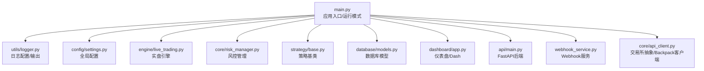
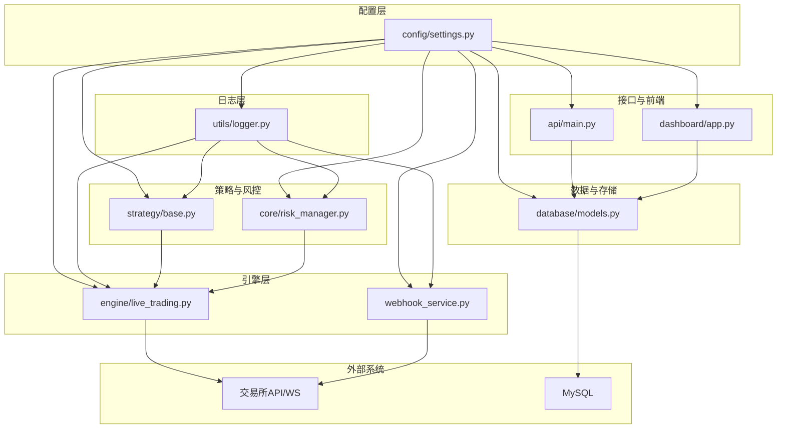
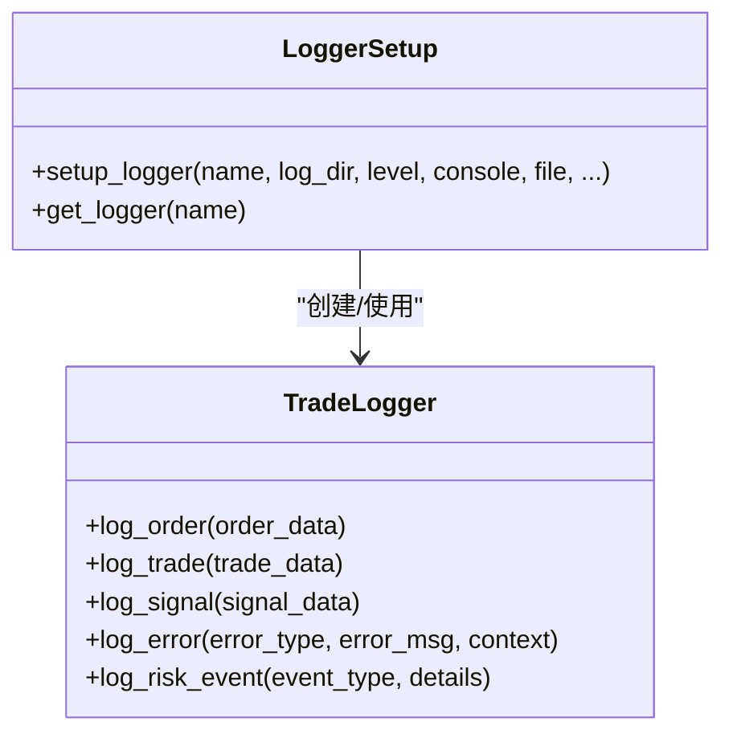
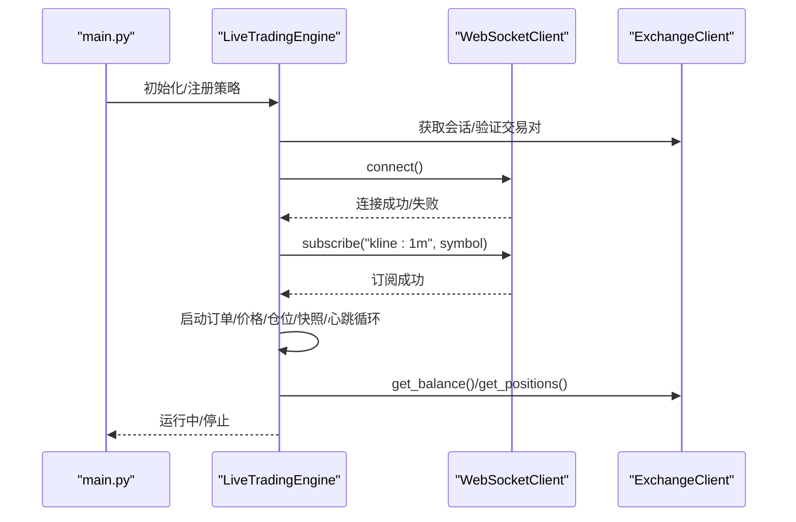
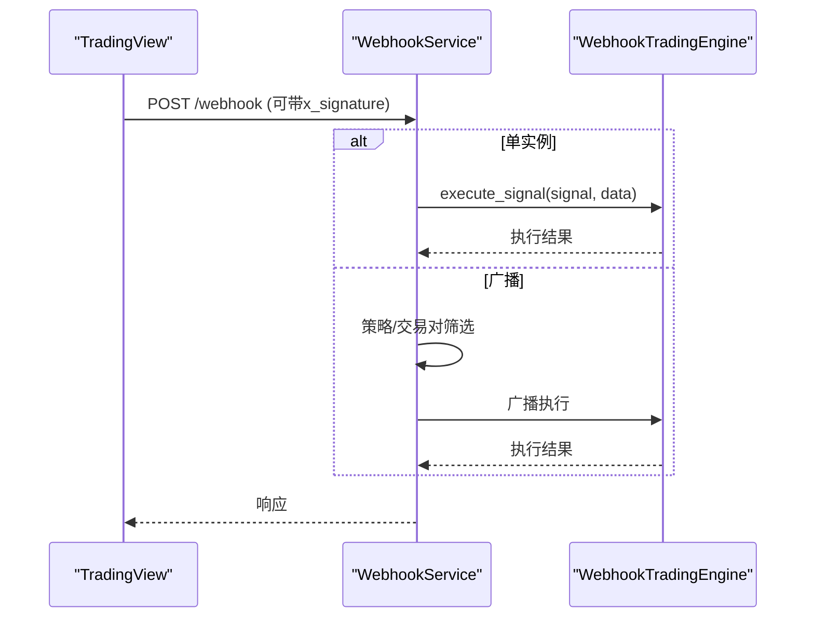
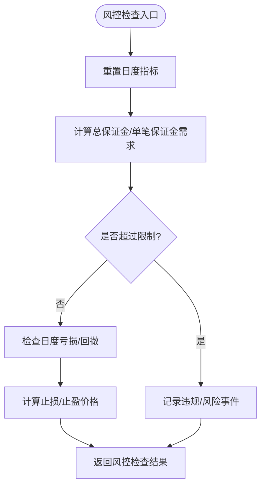
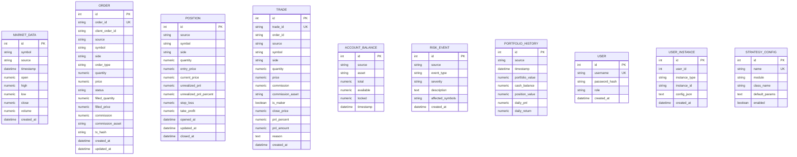
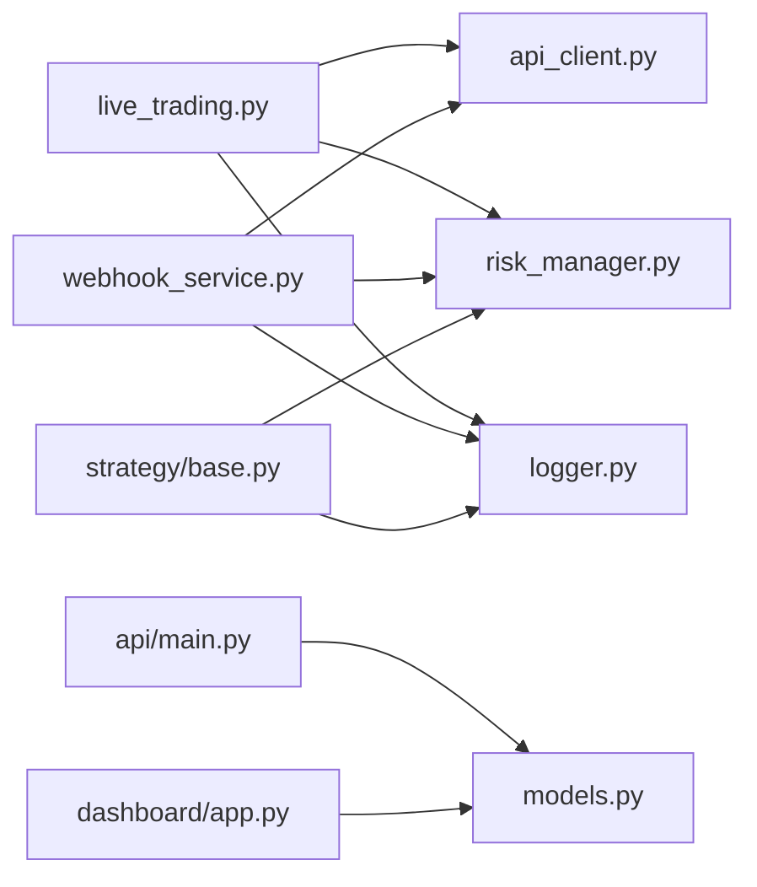

# 调试与故障排除

<cite>
**本文引用的文件**
- [main.py](file://backpack_quant_trading/main.py)
- [logger.py](file://backpack_quant_trading/utils/logger.py)
- [settings.py](file://backpack_quant_trading/config/settings.py)
- [app.py](file://backpack_quant_trading/dashboard/app.py)
- [main.py](file://backpack_quant_trading/api/main.py)
- [live_trading.py](file://backpack_quant_trading/engine/live_trading.py)
- [risk_manager.py](file://backpack_quant_trading/core/risk_manager.py)
- [models.py](file://backpack_quant_trading/database/models.py)
- [webhook_service.py](file://backpack_quant_trading/webhook_service.py)
- [base.py](file://backpack_quant_trading/strategy/base.py)
- [api_client.py](file://backpack_quant_trading/core/api_client.py)
- [requirements.txt](file://backpack_quant_trading/requirements.txt)
</cite>

## 目录
1. [简介](#简介)
2. [项目结构](#项目结构)
3. [核心组件](#核心组件)
4. [架构总览](#架构总览)
5. [详细组件分析](#详细组件分析)
6. [依赖分析](#依赖分析)
7. [性能考虑](#性能考虑)
8. [故障排除指南](#故障排除指南)
9. [结论](#结论)
10. [附录](#附录)

## 简介
本指南面向量化交易系统的运维与开发人员，聚焦于系统调试与故障排除。内容涵盖日志系统使用、日志级别设置、关键日志点识别、常见问题诊断流程、错误代码分析、性能瓶颈定位、实时监控工具、WebSocket连接排查、API调用失败处理、数据库连接问题、内存泄漏检测与系统资源监控、调试工具与性能分析方法、以及生产环境问题处理流程。文中所有技术细节均基于仓库现有代码进行提炼与总结。

## 项目结构
系统采用模块化分层设计：
- 应用入口与运行模式：命令行参数驱动回测/实盘切换，统一初始化日志与配置。
- 日志系统：独立的日志模块，支持控制台与文件输出、按大小轮转、交易/错误/常规日志分离。
- 配置中心：集中管理各交易所、数据库、交易风控、Webhook等配置。
- 引擎层：实盘交易引擎、Webhook交易引擎、回测引擎等。
- 策略层：策略基类与具体策略实现，负责信号生成与风控校验。
- 数据与风控：数据管理、风险控制、数据库模型与持久化。
- 前端与仪表盘：Dash应用提供可视化监控与实例管理。
- API后端：FastAPI提供认证、交易、监控等接口。
- Webhook服务：接收TradingView信号并路由到多实例引擎。

图表来源
- [main.py:1-344](file://backpack_quant_trading/main.py#L1-344)
- [logger.py:1-180](file://backpack_quant_trading/utils/logger.py#L1-180)
- [settings.py:1-137](file://backpack_quant_trading/config/settings.py#L1-137)
- [live_trading.py:1-800](file://backpack_quant_trading/engine/live_trading.py#L1-800)
- [risk_manager.py:1-566](file://backpack_quant_trading/core/risk_manager.py#L1-566)
- [base.py:1-212](file://backpack_quant_trading/strategy/base.py#L1-212)
- [models.py:1-721](file://backpack_quant_trading/database/models.py#L1-721)
- [app.py:1-800](file://backpack_quant_trading/dashboard/app.py#L1-800)
- [main.py:1-98](file://backpack_quant_trading/api/main.py#L1-98)
- [webhook_service.py:1-598](file://backpack_quant_trading/webhook_service.py#L1-598)
- [api_client.py:1-800](file://backpack_quant_trading/core/api_client.py#L1-800)

章节来源
- [main.py:1-344](file://backpack_quant_trading/main.py#L1-344)
- [settings.py:1-137](file://backpack_quant_trading/config/settings.py#L1-137)

## 核心组件
- 日志系统
  - 控制台与文件输出，按大小轮转，交易/错误/常规日志分离。
  - 交易专用记录器，支持订单、成交、信号、错误、风险事件记录。
- 配置中心
  - 交易所、数据库、交易风控、Webhook等配置集中管理。
- 实盘引擎
  - WebSocket连接、K线订阅、订单/仓位/余额管理、回调通知。
- Webhook服务
  - 多实例引擎管理、签名校验、广播/单实例路由、动态配置更新。
- 风控管理
  - 保证金上限、日度亏损、最大回撤、止损止盈建议、风险事件记录。
- 数据库模型
  - 订单、仓位、成交、账户余额、风险事件、组合净值等表结构。
- 策略基类
  - 信号、仓位、盈亏计算、参数设置、性能指标占位。
- API客户端
  - 交易所抽象接口、Backpack客户端、ED25519签名、会话管理、公开/私有接口。

章节来源
- [logger.py:1-180](file://backpack_quant_trading/utils/logger.py#L1-180)
- [settings.py:1-137](file://backpack_quant_trading/config/settings.py#L1-137)
- [live_trading.py:1-800](file://backpack_quant_trading/engine/live_trading.py#L1-800)
- [webhook_service.py:1-598](file://backpack_quant_trading/webhook_service.py#L1-598)
- [risk_manager.py:1-566](file://backpack_quant_trading/core/risk_manager.py#L1-566)
- [models.py:1-721](file://backpack_quant_trading/database/models.py#L1-721)
- [base.py:1-212](file://backpack_quant_trading/strategy/base.py#L1-212)
- [api_client.py:1-800](file://backpack_quant_trading/core/api_client.py#L1-800)

## 架构总览
系统采用“配置驱动 + 抽象接口 + 多引擎并行”的架构：
- 配置中心统一提供数据库、交易所、风控、Webhook等配置。
- 引擎层通过抽象接口解耦交易所实现，便于扩展。
- 日志系统贯穿全链路，提供统一的可观测性。
- 前端仪表盘与API后端提供可视化与远程控制能力。
- Webhook服务实现信号路由与多实例并发执行。

图表来源
- [settings.py:1-137](file://backpack_quant_trading/config/settings.py#L1-137)
- [logger.py:1-180](file://backpack_quant_trading/utils/logger.py#L1-180)
- [live_trading.py:1-800](file://backpack_quant_trading/engine/live_trading.py#L1-800)
- [webhook_service.py:1-598](file://backpack_quant_trading/webhook_service.py#L1-598)
- [base.py:1-212](file://backpack_quant_trading/strategy/base.py#L1-212)
- [risk_manager.py:1-566](file://backpack_quant_trading/core/risk_manager.py#L1-566)
- [models.py:1-721](file://backpack_quant_trading/database/models.py#L1-721)
- [main.py:1-98](file://backpack_quant_trading/api/main.py#L1-98)
- [app.py:1-800](file://backpack_quant_trading/dashboard/app.py#L1-800)

## 详细组件分析

### 日志系统与使用指南
- 日志配置
  - 控制台输出：行缓冲，便于实时查看。
  - 文件输出：交易日志、错误日志、常规日志分离，按大小轮转。
  - 交易专用记录器：统一订单/成交/信号/错误/风险事件格式。
- 日志级别
  - INFO/DEBUG/WARNING/ERROR，按场景选择合适级别。
- 关键日志点
  - WebSocket连接/重连、订阅/取消订阅、消息接收与解析。
  - 订单执行、订单状态变更、仓位更新、成交通知。
  - API请求/响应、签名错误、400/401/429/5xx错误。
  - 风控检查通过/拒绝、风险事件记录、VaR/压力测试结果。
  - Webhook签名校验、实例注册/注销、广播/单实例路由。
  - 数据库连接、事务提交/回滚、重复插入防护。
- 实时查看
  - Windows下使用安全文件处理器，避免权限问题；tail/实时查看。

图表来源
- [logger.py:1-180](file://backpack_quant_trading/utils/logger.py#L1-180)

章节来源
- [logger.py:1-180](file://backpack_quant_trading/utils/logger.py#L1-180)
- [live_trading.py:126-345](file://backpack_quant_trading/engine/live_trading.py#L126-345)
- [webhook_service.py:14-24](file://backpack_quant_trading/webhook_service.py#L14-24)

### 实盘引擎与WebSocket连接
- WebSocket客户端
  - 连接/重连、订阅/取消订阅、消息接收与解析、连接状态检查。
  - 代理支持、超时与指数退避重连、连接关闭自动触发重连。
- 实盘引擎
  - 初始化：会话获取、交易对验证、WebSocket连接、余额/持仓/未成交单加载、历史K线预加载。
  - 启动：K线订阅、订单状态/价格/仓位/快照/心跳循环。
  - 停止：取消所有订单、关闭WebSocket与会话。
- 关键日志点
  - 连接建立、订阅成功/失败、消息接收异常、余额缓存命中/失效、风控检查结果、订单执行结果。

图表来源
- [live_trading.py:347-587](file://backpack_quant_trading/engine/live_trading.py#L347-587)
- [api_client.py:87-546](file://backpack_quant_trading/core/api_client.py#L87-546)

章节来源
- [live_trading.py:126-800](file://backpack_quant_trading/engine/live_trading.py#L126-800)
- [api_client.py:87-800](file://backpack_quant_trading/core/api_client.py#L87-800)

### Webhook服务与信号路由
- 多实例管理
  - 注册/注销实例、健康检查、实例列表查询、余额查询。
- 签名校验
  - HMAC-SHA256签名验证，支持可选Header校验。
- 广播/单实例路由
  - 单实例模式：按instance_id路由。
  - 广播模式：按策略名/交易对筛选目标实例。
- 动态配置更新
  - 保证金范围、止损/止盈比例、杠杆、交易对等。
- 关键日志点
  - 实例注册/更新/注销、签名校验失败、广播路由、动态配置更新、服务重置。

图表来源
- [webhook_service.py:199-444](file://backpack_quant_trading/webhook_service.py#L199-444)

章节来源
- [webhook_service.py:1-598](file://backpack_quant_trading/webhook_service.py#L1-598)

### 风控管理与风险事件
- 风控检查
  - 保证金上限、日度亏损、最大回撤、止损止盈建议、风险评分。
- 风险事件记录
  - 订单拒绝/风险警告等事件持久化至数据库。
- VaR与压力测试
  - 历史法、参数法、蒙特卡洛法计算VaR，压力情景模拟。
- 关键日志点
  - 风控检查通过/拒绝、风险事件记录、VaR/压力测试结果。

图表来源
- [risk_manager.py:87-229](file://backpack_quant_trading/core/risk_manager.py#L87-229)

章节来源
- [risk_manager.py:1-566](file://backpack_quant_trading/core/risk_manager.py#L1-566)
- [models.py:192-207](file://backpack_quant_trading/database/models.py#L192-207)

### 数据库连接与模型
- 连接池
  - 池大小、溢出、pre_ping、echo开关。
- 模型与表
  - 市场数据、订单、仓位、成交、账户余额、风险事件、组合净值、用户与实例、策略配置。
- 写入保护
  - 重复trade_id防护、字段截断、merge/add策略。
- 关键日志点
  - 创建/删除表、会话获取、事务提交/回滚、异常捕获与回滚。

图表来源
- [models.py:45-264](file://backpack_quant_trading/database/models.py#L45-264)

章节来源
- [models.py:1-721](file://backpack_quant_trading/database/models.py#L1-721)
- [settings.py:44-53](file://backpack_quant_trading/config/settings.py#L44-53)

### 策略基类与信号处理
- 信号与仓位数据结构
  - Signal包含交易对、方向、数量、价格、止损、止盈、置信度、原因。
  - Position包含符号、方向、数量、入场/当前价格、盈亏、止损/止盈、时间戳。
- 抽象方法
  - calculate_signal：计算交易信号。
  - should_exit_position：判断是否平仓。
- 仓位更新与盈亏计算
  - 定期更新当前价格、计算实时盈亏与百分比。
- 关键日志点
  - 策略参数更新、性能指标占位、平仓信号生成。

章节来源
- [base.py:16-212](file://backpack_quant_trading/strategy/base.py#L16-212)

### API客户端与签名机制
- 交易所抽象接口
  - get_markets/get_ticker/get_depth/get_klines/get_account/get_balances/get_positions/place_order/cancel_order/cancel_all_orders/get_open_orders/get_order/get_order_history。
- Backpack客户端
  - ED25519签名：instruction、参数排序、查询字符串、时间戳与窗口、签名生成与请求头。
  - Cookie认证：Access Key/Refresh Key。
  - 会话管理：同步requests.Session封装为异步接口。
- 关键日志点
  - 签名生成与请求头、API响应状态码与内容、400错误原因提示。

章节来源
- [api_client.py:22-85](file://backpack_quant_trading/core/api_client.py#L22-85)
- [api_client.py:158-269](file://backpack_quant_trading/core/api_client.py#L158-269)

## 依赖分析
- 组件耦合
  - 实盘引擎依赖交易所抽象接口与WebSocket客户端。
  - Webhook服务依赖多实例引擎，通过FastAPI提供HTTP接口。
  - 风控管理依赖配置与数据库模型，用于记录风险事件。
  - 日志系统被广泛使用，贯穿引擎、服务、策略与数据库层。
- 外部依赖
  - MySQL连接池、websockets、requests、cryptography、SQLAlchemy等。
- 潜在循环依赖
  - 实盘引擎与API客户端通过抽象接口解耦，避免循环导入。

图表来源
- [live_trading.py:14-18](file://backpack_quant_trading/engine/live_trading.py#L14-18)
- [api_client.py:1-85](file://backpack_quant_trading/core/api_client.py#L1-85)
- [risk_manager.py:1-11](file://backpack_quant_trading/core/risk_manager.py#L1-11)
- [logger.py:1-11](file://backpack_quant_trading/utils/logger.py#L1-11)
- [webhook_service.py:1-25](file://backpack_quant_trading/webhook_service.py#L1-25)
- [models.py:1-11](file://backpack_quant_trading/database/models.py#L1-11)
- [main.py:1-35](file://backpack_quant_trading/api/main.py#L1-35)
- [app.py:1-47](file://backpack_quant_trading/dashboard/app.py#L1-47)

章节来源
- [requirements.txt](file://backpack_quant_trading/requirements.txt)

## 性能考虑
- 日志性能
  - 控制台行缓冲与文件轮转，避免频繁磁盘写入阻塞。
  - 交易/错误/常规日志分离，减少无关日志干扰。
- WebSocket与网络
  - 指数退避重连、心跳检测、代理支持，提升稳定性。
  - 订阅去重与重连恢复，减少无效流量。
- 数据库
  - 连接池参数调优，避免高并发下的连接争用。
  - 写入前去重与字段截断，减少异常与重复写入。
- API调用
  - 会话复用、签名参数规范化、错误分类与重试策略。
- 风控与计算
  - 保证金累计与阈值检查、VaR/压力测试计算复杂度控制。

[本节为通用指导，无需特定文件引用]

## 故障排除指南

### 日志系统使用与关键日志点
- 使用方法
  - 在模块中获取logger：get_logger(__name__)。
  - 交易专用：TradeLogger统一记录订单/成交/信号/错误/风险事件。
- 关键日志点
  - WebSocket：连接/重连、订阅/取消订阅、消息接收异常。
  - 实盘引擎：初始化阶段、余额/持仓/未成交单加载、订单执行。
  - Webhook：签名校验、实例注册/注销、广播路由、动态配置更新。
  - 数据库：表创建/删除、事务提交/回滚、重复插入防护。
  - API：请求头、响应状态码、400错误原因。
- 日志级别建议
  - 开发/联调：DEBUG；生产：INFO；严重问题：ERROR；风险事件：WARNING。

章节来源
- [logger.py:128-180](file://backpack_quant_trading/utils/logger.py#L128-180)
- [live_trading.py:126-345](file://backpack_quant_trading/engine/live_trading.py#L126-345)
- [webhook_service.py:14-24](file://backpack_quant_trading/webhook_service.py#L14-24)
- [models.py:285-314](file://backpack_quant_trading/database/models.py#L285-314)
- [api_client.py:254-268](file://backpack_quant_trading/core/api_client.py#L254-268)

### WebSocket连接问题排查
- 常见症状
  - 连接超时、连接关闭、订阅失败、消息接收异常。
- 排查步骤
  - 检查代理设置与websockets库版本，确保支持proxy参数。
  - 查看连接/重连日志，确认指数退避是否生效。
  - 验证订阅格式与交易对有效性。
  - 检查心跳与pong响应，确认连接存活。
- 处理建议
  - 升级websockets库以支持代理。
  - 适当增大超时与ping间隔，避免网络抖动导致误判。
  - 订阅失败时重试并记录失败原因。

章节来源
- [live_trading.py:153-235](file://backpack_quant_trading/engine/live_trading.py#L153-235)
- [live_trading.py:241-345](file://backpack_quant_trading/engine/live_trading.py#L241-345)

### API调用失败处理
- 常见错误
  - 400：签名错误、时间戳过期、请求频率限制、参数缺失。
  - 401：认证失败。
  - 429：请求频率过高。
  - 5xx：服务器内部错误。
- 排查步骤
  - 检查请求头：X-API-Key、X-Signature、X-Timestamp、X-Window。
  - 校验时间戳与系统时间偏差。
  - 检查instruction与参数序列化。
  - 查看响应内容与状态码。
- 处理建议
  - 重试策略与退避等待。
  - 参数规范化与必填项校验。
  - 记录详细上下文便于定位。

章节来源
- [api_client.py:158-269](file://backpack_quant_trading/core/api_client.py#L158-269)

### 数据库连接问题
- 常见症状
  - 连接池耗尽、连接超时、事务回滚。
- 排查步骤
  - 检查连接池参数：pool_size、max_overflow、pre_ping。
  - 查看表创建/删除日志，确认数据库可用。
  - 检查重复插入与字段截断导致的异常。
- 处理建议
  - 调整连接池参数以适配负载。
  - 优化写入路径，避免重复与异常。
  - 增加连接健康检查与自动重建。

章节来源
- [settings.py:44-53](file://backpack_quant_trading/config/settings.py#L44-53)
- [models.py:270-287](file://backpack_quant_trading/database/models.py#L270-287)
- [models.py:350-387](file://backpack_quant_trading/database/models.py#L350-387)

### 内存泄漏检测与系统资源监控
- 检测方法
  - 定期检查进程内存占用与对象数量。
  - 监控WebSocket连接数与消息队列长度。
  - 观察日志中异常与重连频率。
- 建议
  - 及时关闭会话与连接，避免句柄泄露。
  - 控制回调与任务数量，避免堆积。
  - 使用资源监控工具（如psutil）辅助定位。

章节来源
- [app.py:1-800](file://backpack_quant_trading/dashboard/app.py#L1-800)
- [live_trading.py:569-586](file://backpack_quant_trading/engine/live_trading.py#L569-586)

### 实时监控工具与仪表盘
- Dash仪表盘
  - 提供实例监控、余额刷新、策略配置与状态展示。
  - 使用Interval组件定时刷新，确保数据实时性。
- 建议
  - 合理设置刷新间隔，避免过度刷新。
  - 结合日志与数据库状态，实现多维度监控。

章节来源
- [app.py:340-753](file://backpack_quant_trading/dashboard/app.py#L340-753)

### 生产环境问题处理流程
- 快速定位
  - 查看最近日志文件与错误日志，定位异常时间点。
  - 检查WebSocket连接状态与API响应。
- 降级与恢复
  - 临时关闭高风险策略或降低杠杆。
  - 重启Webhook服务或实盘引擎实例。
- 预防措施
  - 配置健康检查与自动重启。
  - 建立告警与通知机制（如钉钉）。
  - 定期演练故障恢复流程。

章节来源
- [webhook_service.py:53-68](file://backpack_quant_trading/webhook_service.py#L53-68)
- [live_trading.py:569-586](file://backpack_quant_trading/engine/live_trading.py#L569-586)

## 结论
本指南基于仓库现有代码，提供了系统调试与故障排除的完整方法论。通过合理使用日志系统、掌握关键日志点、结合WebSocket与API的异常排查、数据库连接与性能优化、以及生产环境的监控与恢复流程，能够有效提升系统的稳定性与可维护性。建议在日常开发中持续完善日志覆盖与监控告警，形成闭环的运维体系。

[本节为总结，无需特定文件引用]

## 附录
- 常用命令与工具
  - 查看日志：tail -f ./log/*.log
  - 启动Webhook服务：uvicorn webhook_service:app --host 0.0.0.0 --port 8005
  - 启动实盘：python main.py --mode live --strategy mean_reversion --exchange backpack
  - 启动回测：python main.py --mode backtest
- 常见错误代码与含义
  - 400：参数或签名错误，检查instruction与时间戳。
  - 401：认证失败，检查API Key/Secret或Cookie。
  - 429：请求频率过高，增加退避或降低请求频率。
  - 5xx：服务器内部错误，检查上游服务与依赖。

章节来源
- [webhook_service.py:590-598](file://backpack_quant_trading/webhook_service.py#L590-598)
- [main.py:289-344](file://backpack_quant_trading/main.py#L289-344)
- [api_client.py:254-268](file://backpack_quant_trading/core/api_client.py#L254-268)