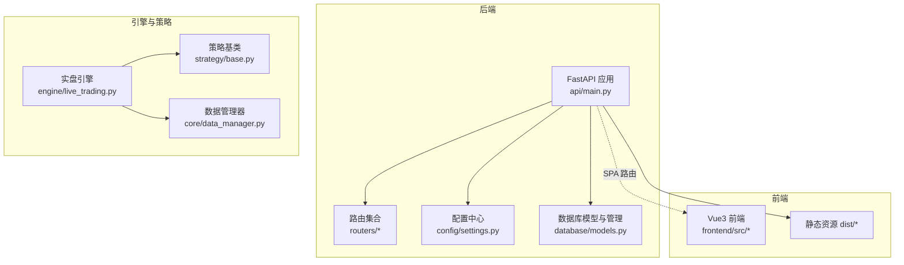
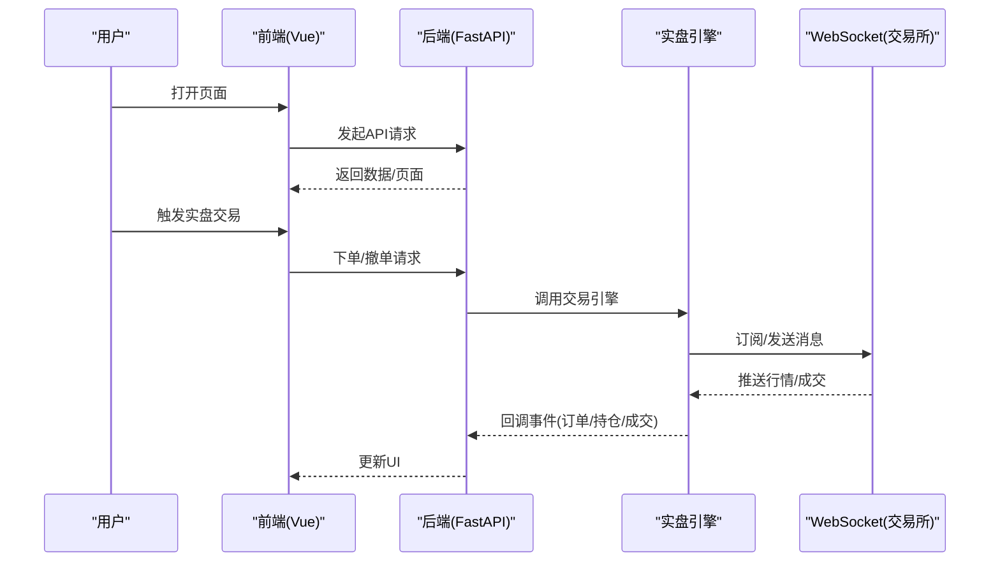
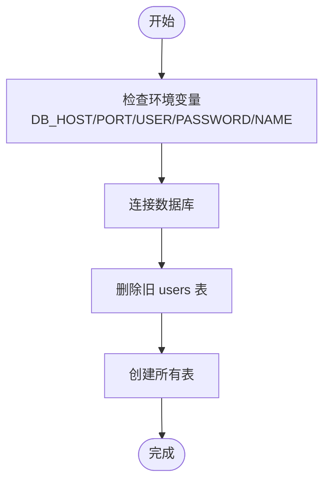
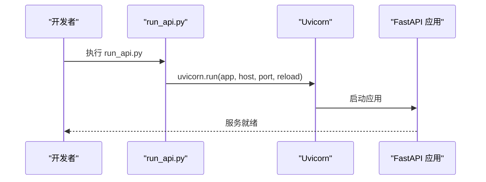
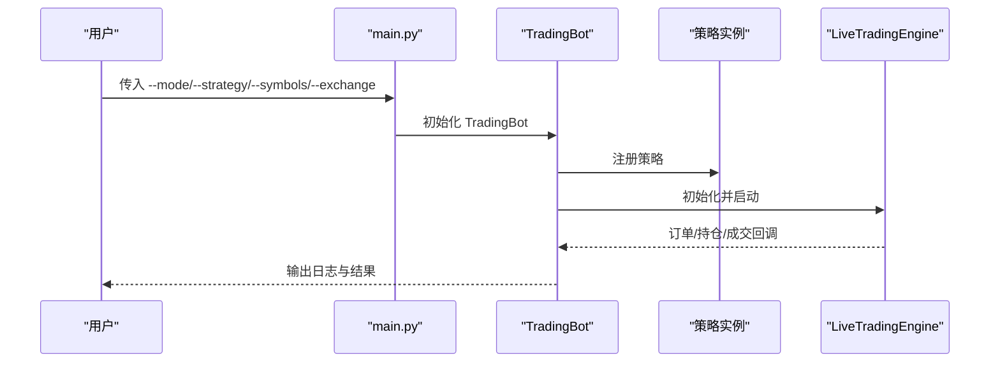
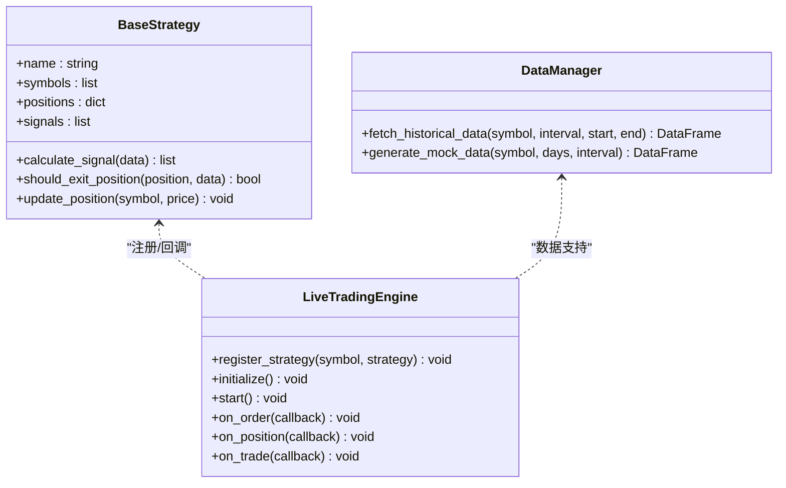

# 快速开始

<cite>
**本文引用的文件**
- [main.py](file://backpack_quant_trading/main.py)
- [run_api.py](file://backpack_quant_trading/run_api.py)
- [requirements.txt](file://backpack_quant_trading/requirements.txt)
- [settings.py](file://backpack_quant_trading/config/settings.py)
- [models.py](file://backpack_quant_trading/database/models.py)
- [init_db.py](file://init_db.py)
- [migrate_user_instances.py](file://backpack_quant_trading/database/migrate_user_instances.py)
- [main.py](file://backpack_quant_trading/api/main.py)
- [Frontend_README.md](file://backpack_quant_trading/Frontend_README.md)
- [base.py](file://backpack_quant_trading/strategy/base.py)
- [live_trading.py](file://backpack_quant_trading/engine/live_trading.py)
- [data_manager.py](file://backpack_quant_trading/core/data_manager.py)
</cite>

## 目录
1. [简介](#简介)
2. [项目结构](#项目结构)
3. [核心组件](#核心组件)
4. [架构总览](#架构总览)
5. [详细组件分析](#详细组件分析)
6. [依赖分析](#依赖分析)
7. [性能考虑](#性能考虑)
8. [故障排除指南](#故障排除指南)
9. [结论](#结论)
10. [附录](#附录)

## 简介
本指南面向首次接触量化交易系统的用户，帮助你在30分钟内完成环境准备、依赖安装、数据库初始化、API服务启动与基本验证，从而看到系统的基本效果。文档同时提供Windows与Linux平台的操作要点与常见问题解决方案。

## 项目结构
系统采用“后端（FastAPI）+ 前端（Vue3）+ 引擎（回测/实盘）+ 策略（策略基类与多种策略）+ 数据库（SQLAlchemy）”的分层架构。核心入口包括：
- 后端API入口：backpack_quant_trading/api/main.py
- 前端静态资源挂载与路由：在API入口中统一挂载
- 后端启动脚本：backpack_quant_trading/run_api.py
- 主程序入口（CLI/演示）：backpack_quant_trading/main.py
- 数据库模型与初始化：backpack_quant_trading/database/models.py 与 init_db.py
- 配置中心：backpack_quant_trading/config/settings.py
- 策略基类与策略实现：backpack_quant_trading/strategy/base.py 与具体策略
- 实盘引擎：backpack_quant_trading/engine/live_trading.py
- 数据管理器：backpack_quant_trading/core/data_manager.py

**图示来源**
- [main.py:1-98](file://backpack_quant_trading/api/main.py#L1-L98)
- [settings.py:104-137](file://backpack_quant_trading/config/settings.py#L104-L137)
- [models.py:267-288](file://backpack_quant_trading/database/models.py#L267-L288)
- [live_trading.py:1-200](file://backpack_quant_trading/engine/live_trading.py#L1-L200)
- [base.py:41-91](file://backpack_quant_trading/strategy/base.py#L41-L91)
- [data_manager.py:18-42](file://backpack_quant_trading/core/data_manager.py#L18-L42)

**章节来源**
- [Frontend_README.md:1-78](file://backpack_quant_trading/Frontend_README.md#L1-L78)
- [main.py:1-98](file://backpack_quant_trading/api/main.py#L1-L98)

## 核心组件
- 配置中心：集中管理数据库、交易、Webhook、交易所等配置，支持通过环境变量覆盖。
- 数据库模型：定义订单、成交、持仓、账户、策略性能、风险事件、用户与实例等表结构。
- 实盘引擎：负责WebSocket连接、订单/持仓/账户状态管理、回调事件处理与交易执行。
- 策略基类：定义信号、仓位、风控、性能指标等抽象接口，具体策略继承实现。
- 数据管理器：负责历史数据获取、模拟数据生成、缓存与清洗。
- API入口：统一注册路由、CORS、静态资源挂载与健康检查。

**章节来源**
- [settings.py:104-137](file://backpack_quant_trading/config/settings.py#L104-L137)
- [models.py:45-226](file://backpack_quant_trading/database/models.py#L45-L226)
- [live_trading.py:1-200](file://backpack_quant_trading/engine/live_trading.py#L1-L200)
- [base.py:41-91](file://backpack_quant_trading/strategy/base.py#L41-L91)
- [data_manager.py:18-42](file://backpack_quant_trading/core/data_manager.py#L18-L42)
- [main.py:14-54](file://backpack_quant_trading/api/main.py#L14-L54)

## 架构总览
系统采用“后端API + 前端SPA”的前后端分离架构。后端通过FastAPI提供REST API与静态资源挂载，前端通过Vite代理访问后端API。实盘引擎通过WebSocket订阅市场数据，策略基于数据生成交易信号并驱动下单。

**图示来源**
- [main.py:36-49](file://backpack_quant_trading/api/main.py#L36-L49)
- [live_trading.py:126-200](file://backpack_quant_trading/engine/live_trading.py#L126-L200)

## 详细组件分析

### 环境与依赖准备
- Python版本要求：建议使用Python 3.10及以上，确保与依赖版本兼容。
- 安装后端依赖：在项目根目录执行安装命令，确保requirements.txt中的包正确安装。
- 安装前端依赖：进入frontend目录，执行npm install安装Vue3相关依赖。
- 环境变量：配置数据库连接信息（主机、端口、用户名、密码、数据库名），以及交易所API密钥（如Backpack、Hyperliquid等）。

**章节来源**
- [requirements.txt:1-61](file://backpack_quant_trading/requirements.txt#L1-L61)
- [Frontend_README.md:28-37](file://backpack_quant_trading/Frontend_README.md#L28-L37)
- [settings.py:44-52](file://backpack_quant_trading/config/settings.py#L44-L52)

### 数据库初始化
- 初始化流程：执行init_db.py脚本，自动删除旧的users表并重建所有表结构。
- 用户实例迁移：若需要，可执行migrate_user_instances.py创建user_instances表。
- 数据库URL：由配置中心根据环境变量动态生成，确保连接参数正确。

**图示来源**
- [init_db.py:9-24](file://init_db.py#L9-L24)
- [settings.py:124-130](file://backpack_quant_trading/config/settings.py#L124-L130)

**章节来源**
- [init_db.py:1-25](file://init_db.py#L1-L25)
- [migrate_user_instances.py:1-15](file://backpack_quant_trading/database/migrate_user_instances.py#L1-L15)
- [settings.py:124-130](file://backpack_quant_trading/config/settings.py#L124-L130)

### API服务启动
- 开发模式：在项目根目录执行run_api.py，启动FastAPI应用，监听0.0.0.0:8100，开启热重载。
- 生产模式：前端打包后，后端启动时会挂载frontend/dist，统一对外提供服务。
- 健康检查：访问/api/health确认服务可用。

**图示来源**
- [run_api.py:22-28](file://backpack_quant_trading/run_api.py#L22-L28)
- [main.py:51-53](file://backpack_quant_trading/api/main.py#L51-L53)

**章节来源**
- [run_api.py:1-32](file://backpack_quant_trading/run_api.py#L1-L32)
- [main.py:56-97](file://backpack_quant_trading/api/main.py#L56-L97)

### 前端启动与访问
- 开发模式：终端1启动后端，终端2进入frontend并执行npm run dev，访问http://localhost:5173。
- 生产模式：在frontend执行npm run build，回到项目根目录执行run_api.py，访问http://localhost:8000。
- API代理：Vite将/api前缀代理到后端，无需额外CORS配置。

**章节来源**
- [Frontend_README.md:39-64](file://backpack_quant_trading/Frontend_README.md#L39-L64)

### 策略与实盘运行（CLI演示）
- CLI入口：backpack_quant_trading/main.py提供命令行参数，支持回测与实盘两种模式。
- 回测演示：内置回测示例，自动加载模拟数据并运行策略，输出汇总统计。
- 实盘演示：根据参数选择策略与交易所，注入策略参数并启动LiveTradingEngine。

**图示来源**
- [main.py:197-286](file://backpack_quant_trading/main.py#L197-L286)
- [main.py:160-195](file://backpack_quant_trading/main.py#L160-L195)

**章节来源**
- [main.py:197-286](file://backpack_quant_trading/main.py#L197-L286)
- [main.py:160-195](file://backpack_quant_trading/main.py#L160-L195)

### 关键类关系（策略与引擎）

**图示来源**
- [base.py:41-91](file://backpack_quant_trading/strategy/base.py#L41-L91)
- [live_trading.py:1-200](file://backpack_quant_trading/engine/live_trading.py#L1-L200)
- [data_manager.py:114-168](file://backpack_quant_trading/core/data_manager.py#L114-L168)

## 依赖分析
- 后端依赖：FastAPI、Uvicorn、SQLAlchemy、PyMySQL、Web框架与数据库相关依赖。
- 数据处理：pandas、numpy、scipy、ta（技术指标）、numba（加速）。
- 机器学习：lightgbm、scikit-learn、joblib（模型训练与预测）。
- 交易所集成：ccxt（通用）、Web3相关（Ostium支持）。
- 可视化：matplotlib、plotly、dash。
- 安全与加密：cryptography、PyJWT、passlib[bcrypt]。

**章节来源**
- [requirements.txt:1-61](file://backpack_quant_trading/requirements.txt#L1-L61)

## 性能考虑
- 数据缓存：DataManager对历史K线进行缓存，减少重复请求与数据库压力。
- 连接池：数据库使用SQLAlchemy连接池，合理配置pool_size与max_overflow。
- WebSocket代理：实盘引擎支持代理设置，注意websockets库版本兼容性。
- 日志与调试：配置日志级别，避免在生产环境输出过多调试信息。

[本节为通用指导，不直接分析特定文件]

## 故障排除指南

### 环境与依赖问题
- Python版本不匹配：确保使用Python 3.10及以上，避免与依赖库冲突。
- 依赖安装失败：优先使用国内镜像源，必要时升级pip与setuptools；逐项安装失败的包。
- 前端依赖：在frontend目录执行npm install，若网络受限可配置npm镜像源。

**章节来源**
- [requirements.txt:1-61](file://backpack_quant_trading/requirements.txt#L1-L61)
- [Frontend_README.md:28-37](file://backpack_quant_trading/Frontend_README.md#L28-L37)

### 数据库初始化失败
- 权限不足：确保数据库用户具备CREATE/ALTER/DROP权限。
- 连接参数错误：核对DB_HOST、DB_PORT、DB_USER、DB_PASSWORD、DB_NAME。
- 表结构冲突：init_db.py会删除旧users表并重建，注意备份重要数据。

**章节来源**
- [init_db.py:9-24](file://init_db.py#L9-L24)
- [settings.py:44-52](file://backpack_quant_trading/config/settings.py#L44-L52)

### API服务无法启动
- 端口占用：默认端口8100或8000被占用，修改run_api.py中的端口或释放端口。
- CORS问题：前端访问后端时出现跨域，确认CORS配置允许的origins。
- 静态资源挂载：生产模式下需先构建前端，再启动后端。

**章节来源**
- [run_api.py:22-28](file://backpack_quant_trading/run_api.py#L22-L28)
- [main.py:20-34](file://backpack_quant_trading/api/main.py#L20-L34)
- [Frontend_README.md:55-64](file://backpack_quant_trading/Frontend_README.md#L55-L64)

### 实盘交易异常
- 代理设置：若使用代理，确保websockets库支持proxy参数，否则会忽略代理。
- WebSocket连接：检查交易所WebSocket地址与网络连通性，关注重连机制。
- 策略参数：确认策略参数（杠杆、止盈止损、仓位）符合预期，避免极端风险。

**章节来源**
- [live_trading.py:153-200](file://backpack_quant_trading/engine/live_trading.py#L153-L200)
- [main.py:197-286](file://backpack_quant_trading/main.py#L197-L286)

### 常见验证步骤
- 后端健康检查：访问http://localhost:8000/api/health，确认返回{"status":"ok","service":"backpack-quant-api"}。
- 前端页面：开发模式访问http://localhost:5173，生产模式访问http://localhost:8000。
- 回测演示：在项目根目录执行CLI回测示例，观察控制台输出的汇总统计。
- 实盘演示：在CLI中选择实盘模式与策略，观察日志输出与回调事件。

**章节来源**
- [main.py:51-53](file://backpack_quant_trading/api/main.py#L51-L53)
- [Frontend_README.md:66-78](file://backpack_quant_trading/Frontend_README.md#L66-L78)
- [main.py:160-195](file://backpack_quant_trading/main.py#L160-L195)
- [main.py:197-286](file://backpack_quant_trading/main.py#L197-L286)

## 结论
通过本快速开始指南，你可以在30分钟内完成环境准备、依赖安装、数据库初始化与API服务启动，并验证系统基本功能。建议在实盘前充分测试策略与参数，确保理解各组件职责与交互关系，逐步扩展到更复杂的策略与场景。

[本节为总结性内容，不直接分析特定文件]

## 附录

### Windows平台注意事项
- 控制台编码：主程序强制stdout/stderr使用UTF-8，避免中文字符导致的UnicodeEncodeError。
- 代理与防火墙：若网络受限，配置HTTPS_PROXY或HTTP_PROXY环境变量，确保websockets库支持。
- 文件路径：在Windows上使用正斜杠或双反斜杠，避免路径解析问题。

**章节来源**
- [main.py:290-298](file://backpack_quant_trading/main.py#L290-L298)

### Linux平台注意事项
- Python虚拟环境：建议使用venv创建独立环境，避免系统Python冲突。
- 端口权限：非特权端口（如8000/8001）无需sudo，若使用1024以下端口需管理员权限。
- 依赖权限：某些依赖可能需要系统库支持，如编译工具链与头文件。

[本节为通用指导，不直接分析特定文件]