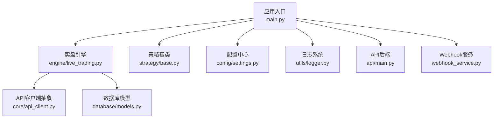
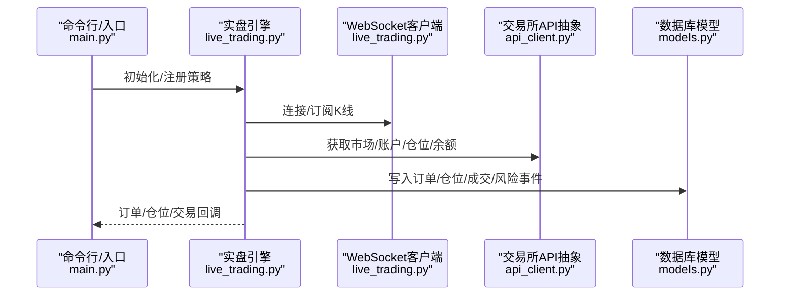
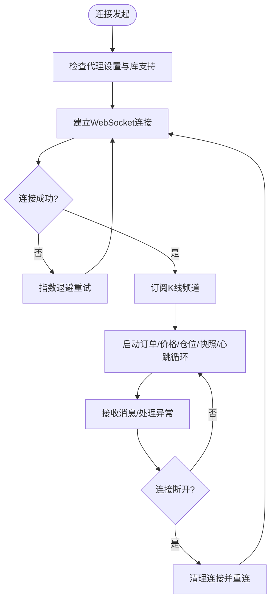
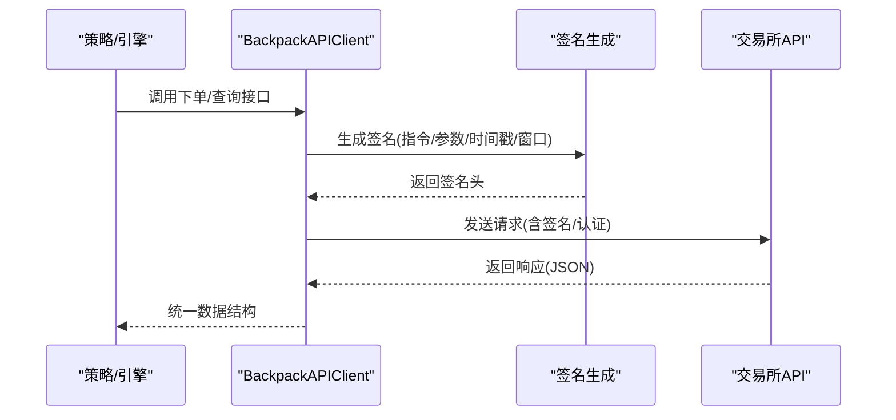
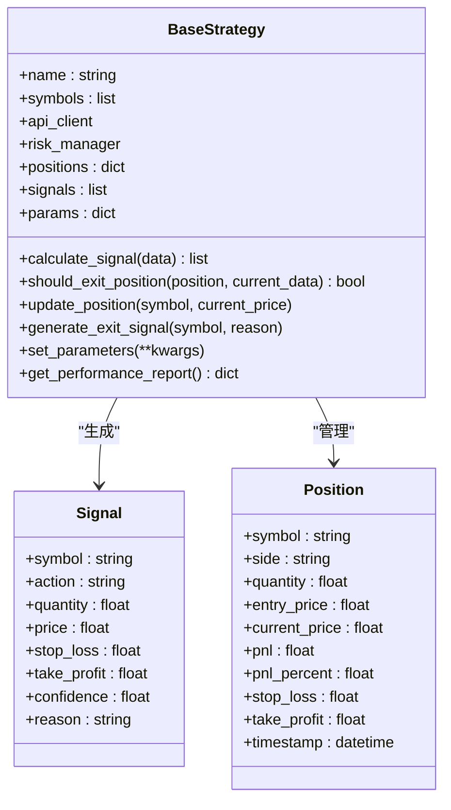
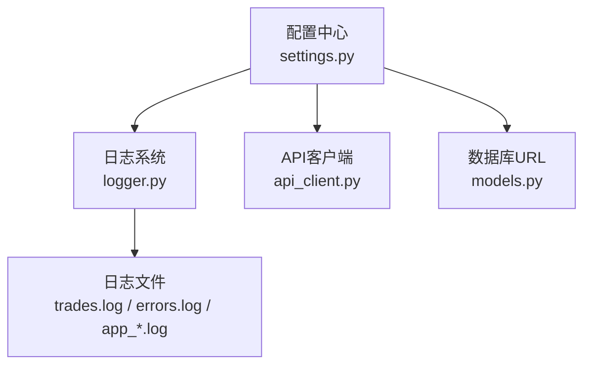
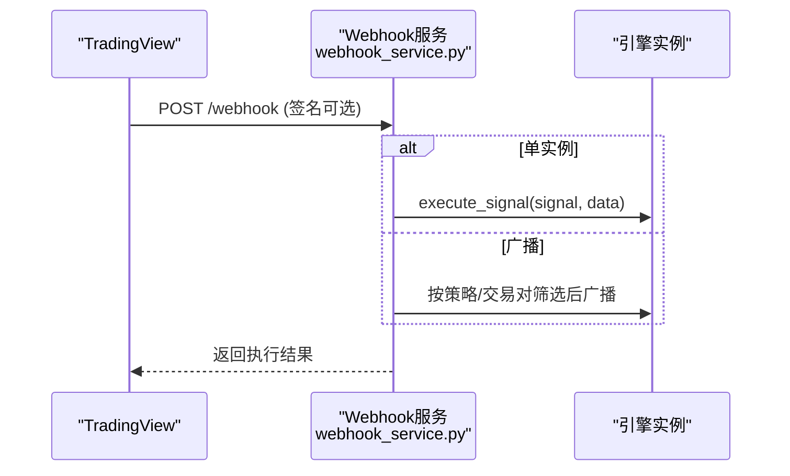

# 故障排除

<cite>
**本文引用的文件**   
- [main.py](file://backpack_quant_trading/main.py)
- [run_api.py](file://backpack_quant_trading/run_api.py)
- [requirements.txt](file://backpack_quant_trading/requirements.txt)
- [settings.py](file://backpack_quant_trading/config/settings.py)
- [logger.py](file://backpack_quant_trading/utils/logger.py)
- [api_main.py](file://backpack_quant_trading/api/main.py)
- [live_trading.py](file://backpack_quant_trading/engine/live_trading.py)
- [api_client.py](file://backpack_quant_trading/core/api_client.py)
- [base_strategy.py](file://backpack_quant_trading/strategy/base.py)
- [webhook_service.py](file://backpack_quant_trading/webhook_service.py)
- [models.py](file://backpack_quant_trading/database/models.py)
</cite>

## 目录
1. [简介](#简介)
2. [项目结构](#项目结构)
3. [核心组件](#核心组件)
4. [架构总览](#架构总览)
5. [详细组件分析](#详细组件分析)
6. [依赖分析](#依赖分析)
7. [性能考虑](#性能考虑)
8. [故障排除指南](#故障排除指南)
9. [结论](#结论)
10. [附录](#附录)

## 简介
本指南面向系统运维与开发者，聚焦于量化交易系统在环境配置、依赖安装、API连接、策略运行、日志分析、错误追踪与性能定位等方面的常见问题与系统化排查方法。文档基于代码仓库的实际实现，提供可操作的诊断步骤、错误信息解读与预防性维护建议。

## 项目结构
系统采用模块化分层设计：
- 应用入口与主控制器：backpack_quant_trading/main.py
- API后端：backpack_quant_trading/api/main.py
- 实盘引擎：backpack_quant_trading/engine/live_trading.py
- 交易所API封装：backpack_quant_trading/core/api_client.py
- 策略基类：backpack_quant_trading/strategy/base.py
- 配置与日志：backpack_quant_trading/config/settings.py、backpack_quant_trading/utils/logger.py
- 数据库模型与管理：backpack_quant_trading/database/models.py
- Webhook服务：backpack_quant_trading/webhook_service.py
- 依赖声明：backpack_quant_trading/requirements.txt

图表来源
- [main.py:1-344](file://backpack_quant_trading/main.py#L1-L344)
- [live_trading.py:1-800](file://backpack_quant_trading/engine/live_trading.py#L1-L800)
- [api_client.py:1-800](file://backpack_quant_trading/core/api_client.py#L1-L800)
- [base_strategy.py:1-212](file://backpack_quant_trading/strategy/base.py#L1-L212)
- [settings.py:1-137](file://backpack_quant_trading/config/settings.py#L1-L137)
- [logger.py:1-180](file://backpack_quant_trading/utils/logger.py#L1-L180)
- [api_main.py:1-98](file://backpack_quant_trading/api/main.py#L1-L98)
- [webhook_service.py:1-571](file://backpack_quant_trading/webhook_service.py#L1-L571)
- [models.py:1-721](file://backpack_quant_trading/database/models.py#L1-L721)

章节来源
- [main.py:1-344](file://backpack_quant_trading/main.py#L1-L344)
- [api_main.py:1-98](file://backpack_quant_trading/api/main.py#L1-L98)

## 核心组件
- 应用入口与模式切换：支持回测与实盘模式，参数驱动策略与交易所选择，统一日志初始化与UTF-8输出保障。
- 实盘引擎：负责WebSocket连接、K线订阅、订单/仓位/余额管理、回调通知、缓存与重连机制。
- API客户端抽象：统一交易所接口，支持Backpack、Deepcoin、Hyperliquid等，提供签名、限价/市价、止盈止损等能力。
- 策略基类：定义信号、仓位、止盈止损、盈亏计算与性能指标接口。
- 配置中心：集中管理API地址、密钥、数据库连接、交易风控参数、Webhook配置等。
- 日志系统：多处理器（控制台/文件/交易日志），Windows安全轮转，支持实时查看与错误追踪。
- 数据库模型：订单、仓位、成交、账户余额、风险事件、组合净值等持久化结构。
- Webhook服务：多实例管理、签名验证、广播/单实例路由、动态配置更新与熔断重置。

章节来源
- [main.py:58-344](file://backpack_quant_trading/main.py#L58-L344)
- [live_trading.py:347-800](file://backpack_quant_trading/engine/live_trading.py#L347-L800)
- [api_client.py:22-800](file://backpack_quant_trading/core/api_client.py#L22-L800)
- [base_strategy.py:41-212](file://backpack_quant_trading/strategy/base.py#L41-L212)
- [settings.py:104-137](file://backpack_quant_trading/config/settings.py#L104-L137)
- [logger.py:57-180](file://backpack_quant_trading/utils/logger.py#L57-L180)
- [models.py:267-721](file://backpack_quant_trading/database/models.py#L267-L721)
- [webhook_service.py:26-571](file://backpack_quant_trading/webhook_service.py#L26-L571)

## 架构总览
系统通过入口脚本选择模式与策略，实盘模式下由LiveTradingEngine统一管理WebSocket与交易所API，策略通过抽象接口与引擎交互，数据库模型支撑订单、仓位、成交与风险事件的持久化。

图表来源
- [main.py:197-344](file://backpack_quant_trading/main.py#L197-L344)
- [live_trading.py:536-800](file://backpack_quant_trading/engine/live_trading.py#L536-L800)
- [api_client.py:87-800](file://backpack_quant_trading/core/api_client.py#L87-L800)
- [models.py:267-721](file://backpack_quant_trading/database/models.py#L267-L721)

## 详细组件分析

### 实盘引擎与WebSocket连接
- WebSocket连接具备指数退避重连、代理适配、连接状态检查与消息接收异常处理。
- 订阅频道支持kline:1m等，消息格式标准化，异常连接自动清理并触发重连。
- 余额/仓位/订单加载与缓存，降低API调用频率，提升稳定性。

图表来源
- [live_trading.py:153-345](file://backpack_quant_trading/engine/live_trading.py#L153-L345)
- [live_trading.py:536-567](file://backpack_quant_trading/engine/live_trading.py#L536-L567)

章节来源
- [live_trading.py:126-800](file://backpack_quant_trading/engine/live_trading.py#L126-L800)

### API客户端抽象与签名流程
- 支持ED25519签名与Cookie认证，签名参数序列化、时间戳与窗口校验。
- 提供市场、账户、订单、历史等接口，统一返回格式与错误日志。
- 订单执行映射Backpack规范，兼容多种返回形态。

图表来源
- [api_client.py:158-269](file://backpack_quant_trading/core/api_client.py#L158-L269)
- [api_client.py:413-478](file://backpack_quant_trading/core/api_client.py#L413-L478)

章节来源
- [api_client.py:22-800](file://backpack_quant_trading/core/api_client.py#L22-L800)

### 策略基类与信号管理
- 定义Signal/Position数据结构与抽象方法，策略需实现信号计算与平仓条件。
- 提供盈亏计算、止盈止损触发与性能指标模板方法。

图表来源
- [base_strategy.py:41-212](file://backpack_quant_trading/strategy/base.py#L41-L212)

章节来源
- [base_strategy.py:1-212](file://backpack_quant_trading/strategy/base.py#L1-L212)

### 配置中心与日志系统
- 配置集中于settings.py，包含API地址、密钥、数据库、交易风控、Webhook等。
- 日志系统支持多处理器、安全轮转、实时输出与交易专用日志器。

图表来源
- [settings.py:104-137](file://backpack_quant_trading/config/settings.py#L104-L137)
- [logger.py:57-180](file://backpack_quant_trading/utils/logger.py#L57-L180)
- [models.py:267-287](file://backpack_quant_trading/database/models.py#L267-L287)

章节来源
- [settings.py:1-137](file://backpack_quant_trading/config/settings.py#L1-137)
- [logger.py:1-180](file://backpack_quant_trading/utils/logger.py#L1-L180)
- [models.py:267-721](file://backpack_quant_trading/database/models.py#L267-L721)

### Webhook服务与多实例管理
- 支持单实例与广播模式，签名校验，动态配置更新，熔断重置与通知。
- 多实例隔离与锁，按策略名/交易对筛选路由。

图表来源
- [webhook_service.py:292-451](file://backpack_quant_trading/webhook_service.py#L292-L451)

章节来源
- [webhook_service.py:1-571](file://backpack_quant_trading/webhook_service.py#L1-L571)

## 依赖分析
- Python版本与核心库：aiohttp、websockets、requests、fastapi、uvicorn、pandas、numpy、SQLAlchemy、cryptography、web3、loguru等。
- 依赖安装建议：使用requirements.txt，确保网络可访问，必要时配置镜像源。

章节来源
- [requirements.txt:1-61](file://backpack_quant_trading/requirements.txt#L1-L61)

## 性能考虑
- WebSocket连接采用指数退避与代理适配，避免频繁重连导致抖动。
- 余额/仓位/订单加载使用缓存与批量处理，降低API压力。
- 数据库写入采用merge/add与幂等检查，避免重复与锁竞争。
- 日志轮转与实时刷新，兼顾磁盘占用与可观测性。

[本节为通用指导，无需特定文件引用]

## 故障排除指南

### 一、环境配置问题
- Python与依赖
  - 症状：安装依赖报错、模块缺失、版本冲突。
  - 排查：确认Python版本满足依赖要求；使用requirements.txt安装；若网络受限，配置国内镜像源。
  - 参考
    - [requirements.txt:1-61](file://backpack_quant_trading/requirements.txt#L1-L61)
- 环境变量与密钥
  - 症状：API调用400/鉴权失败、签名错误。
  - 排查：核对BACKPACK_*、DB_*、WEBHOOK_*等环境变量；确认ED25519公私钥与Cookie密钥配置正确。
  - 参考
    - [settings.py:104-137](file://backpack_quant_trading/config/settings.py#L104-L137)
    - [api_client.py:158-269](file://backpack_quant_trading/core/api_client.py#L158-L269)
- 控制台编码
  - 症状：Windows控制台输出异常、Unicode错误导致实盘中断。
  - 处理：入口脚本已强制UTF-8输出，确保终端与日志编码一致。
  - 参考
    - [main.py:289-344](file://backpack_quant_trading/main.py#L289-L344)

章节来源
- [requirements.txt:1-61](file://backpack_quant_trading/requirements.txt#L1-L61)
- [settings.py:104-137](file://backpack_quant_trading/config/settings.py#L104-L137)
- [api_client.py:158-269](file://backpack_quant_trading/core/api_client.py#L158-L269)
- [main.py:289-344](file://backpack_quant_trading/main.py#L289-L344)

### 二、依赖安装问题
- 常见错误
  - cryptography/web3等原生扩展编译失败：检查编译工具链与Python版本。
  - aiohttp/websockets版本不兼容：按requirements约束安装。
- 建议
  - 使用虚拟环境隔离依赖。
  - 在容器或CI中固定依赖版本，避免漂移。
- 参考
  - [requirements.txt:1-61](file://backpack_quant_trading/requirements.txt#L1-L61)

章节来源
- [requirements.txt:1-61](file://backpack_quant_trading/requirements.txt#L1-L61)

### 三、API连接问题
- WebSocket连接失败
  - 症状：连接超时、连接断开、重连失败。
  - 排查：检查代理设置与库支持；确认网络可达；观察重连指数退避日志。
  - 参考
    - [live_trading.py:153-235](file://backpack_quant_trading/engine/live_trading.py#L153-L235)
- 交易所API签名/鉴权失败
  - 症状：400错误、签名参数缺失、时间戳过期。
  - 排查：核对指令、参数排序、时间戳与窗口；确认ED25519密钥与Cookie配置。
  - 参考
    - [api_client.py:158-269](file://backpack_quant_trading/core/api_client.py#L158-L269)
- 速率限制与熔断
  - 症状：频繁429/5xx；接口超时。
  - 处理：降低请求频率，增加等待；检查风控配置。
  - 参考
    - [api_client.py:269-269](file://backpack_quant_trading/core/api_client.py#L269-L269)

章节来源
- [live_trading.py:153-235](file://backpack_quant_trading/engine/live_trading.py#L153-L235)
- [api_client.py:158-269](file://backpack_quant_trading/core/api_client.py#L158-L269)

### 四、策略运行问题
- 策略未生成信号/未下单
  - 症状：日志无信号，仓位未变化。
  - 排查：确认策略实现calculate_signal/should_exit_position；核对参数与数据源。
  - 参考
    - [base_strategy.py:71-112](file://backpack_quant_trading/strategy/base.py#L71-L112)
- 止盈止损未生效
  - 症状：价格触及目标未平仓。
  - 排查：检查策略止盈止损逻辑与引擎回调；确认风控配置。
  - 参考
    - [base_strategy.py:94-112](file://backpack_quant_trading/strategy/base.py#L94-L112)
    - [live_trading.py:561-562](file://backpack_quant_trading/engine/live_trading.py#L561-L562)

章节来源
- [base_strategy.py:71-112](file://backpack_quant_trading/strategy/base.py#L71-L112)
- [live_trading.py:561-562](file://backpack_quant_trading/engine/live_trading.py#L561-L562)

### 五、日志分析与错误追踪
- 日志位置与分类
  - trades.log：交易明细与信号。
  - errors.log：错误级别日志。
  - app_YYYYMMDD.log：常规应用日志。
- 常见错误模式
  - WebSocket连接异常：关注连接超时、断开与重连日志。
  - API请求异常：关注400/401/429/5xx与签名参数。
  - 数据库写入异常：关注重复主键、字段截断与事务回滚。
- 参考
  - [logger.py:57-180](file://backpack_quant_trading/utils/logger.py#L57-L180)
  - [live_trading.py:153-235](file://backpack_quant_trading/engine/live_trading.py#L153-L235)
  - [models.py:316-454](file://backpack_quant_trading/database/models.py#L316-L454)

章节来源
- [logger.py:57-180](file://backpack_quant_trading/utils/logger.py#L57-L180)
- [live_trading.py:153-235](file://backpack_quant_trading/engine/live_trading.py#L153-L235)
- [models.py:316-454](file://backpack_quant_trading/database/models.py#L316-L454)

### 六、性能问题定位
- WebSocket与API调用
  - 检查重连频率与延迟；评估代理对性能的影响。
  - 参考
    - [live_trading.py:153-235](file://backpack_quant_trading/engine/live_trading.py#L153-L235)
- 数据库写入
  - 关注重复插入与索引命中；必要时调整批处理与事务粒度。
  - 参考
    - [models.py:316-454](file://backpack_quant_trading/database/models.py#L316-L454)
- 日志IO
  - Windows安全轮转避免权限冲突；合理设置轮转大小与备份数。
  - 参考
    - [logger.py:9-56](file://backpack_quant_trading/utils/logger.py#L9-L56)

章节来源
- [live_trading.py:153-235](file://backpack_quant_trading/engine/live_trading.py#L153-L235)
- [models.py:316-454](file://backpack_quant_trading/database/models.py#L316-L454)
- [logger.py:9-56](file://backpack_quant_trading/utils/logger.py#L9-L56)

### 七、API后端与前端联调
- 后端启动
  - 症状：端口占用、CORS跨域失败。
  - 处理：确认端口未被占用；核对CORS白名单；开发模式reload。
  - 参考
    - [run_api.py:9-32](file://backpack_quant_trading/run_api.py#L9-L32)
    - [api_main.py:20-34](file://backpack_quant_trading/api/main.py#L20-L34)
- 健康检查
  - 调用/api/health确认服务可用。
  - 参考
    - [api_main.py:51-53](file://backpack_quant_trading/api/main.py#L51-L53)

章节来源
- [run_api.py:9-32](file://backpack_quant_trading/run_api.py#L9-L32)
- [api_main.py:20-53](file://backpack_quant_trading/api/main.py#L20-L53)

### 八、Webhook服务排障
- 症状：签名验证失败、广播无响应、实例未注册。
- 排查：确认WEBHOOK_SECRET；核对实例ID与策略/交易对筛选；检查熔断与重置。
- 参考
  - [webhook_service.py:34-46](file://backpack_quant_trading/webhook_service.py#L34-L46)
  - [webhook_service.py:292-451](file://backpack_quant_trading/webhook_service.py#L292-L451)

章节来源
- [webhook_service.py:34-46](file://backpack_quant_trading/webhook_service.py#L34-L46)
- [webhook_service.py:292-451](file://backpack_quant_trading/webhook_service.py#L292-L451)

### 九、数据库与数据一致性
- 常见问题：重复插入、字段截断、索引缺失。
- 处理：使用merge/add与幂等检查；确保字段长度与类型匹配；创建必要索引。
- 参考
  - [models.py:316-454](file://backpack_quant_trading/database/models.py#L316-L454)

章节来源
- [models.py:316-454](file://backpack_quant_trading/database/models.py#L316-L454)

### 十、预防性维护与健康检查
- 定期检查
  - 环境变量与密钥轮换；依赖版本审计；日志空间清理。
- 健康检查清单
  - WebSocket连接状态；API鉴权与签名；数据库连接池；Webhook实例存活。
- 参考
  - [settings.py:104-137](file://backpack_quant_trading/config/settings.py#L104-L137)
  - [logger.py:57-180](file://backpack_quant_trading/utils/logger.py#L57-L180)
  - [models.py:267-287](file://backpack_quant_trading/database/models.py#L267-L287)

章节来源
- [settings.py:104-137](file://backpack_quant_trading/config/settings.py#L104-L137)
- [logger.py:57-180](file://backpack_quant_trading/utils/logger.py#L57-L180)
- [models.py:267-287](file://backpack_quant_trading/database/models.py#L267-L287)

## 结论
本指南提供了从环境配置、依赖安装、API连接、策略运行到日志分析与性能定位的系统化排障方法。建议在生产环境中结合健康检查清单与自动化告警，持续监控WebSocket连接、API鉴权、数据库写入与Webhook路由，确保系统稳定运行。

[本节为总结性内容，无需特定文件引用]

## 附录
- 快速定位步骤
  - 确认环境变量与密钥；检查依赖安装；验证WebSocket与API连通性；核对策略实现与参数；分析日志与数据库写入；必要时降级与熔断重置。
- 参考文件
  - [main.py:1-344](file://backpack_quant_trading/main.py#L1-L344)
  - [live_trading.py:1-800](file://backpack_quant_trading/engine/live_trading.py#L1-L800)
  - [api_client.py:1-800](file://backpack_quant_trading/core/api_client.py#L1-L800)
  - [base_strategy.py:1-212](file://backpack_quant_trading/strategy/base.py#L1-L212)
  - [settings.py:1-137](file://backpack_quant_trading/config/settings.py#L1-L137)
  - [logger.py:1-180](file://backpack_quant_trading/utils/logger.py#L1-L180)
  - [api_main.py:1-98](file://backpack_quant_trading/api/main.py#L1-L98)
  - [webhook_service.py:1-571](file://backpack_quant_trading/webhook_service.py#L1-L571)
  - [models.py:1-721](file://backpack_quant_trading/database/models.py#L1-L721)
  - [requirements.txt:1-61](file://backpack_quant_trading/requirements.txt#L1-L61)