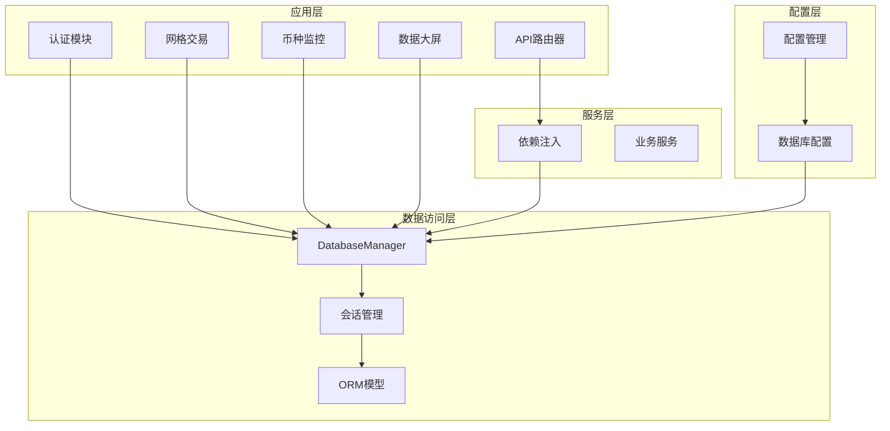
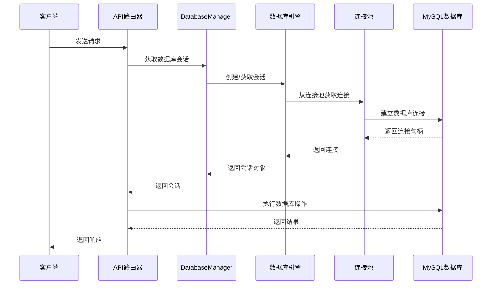
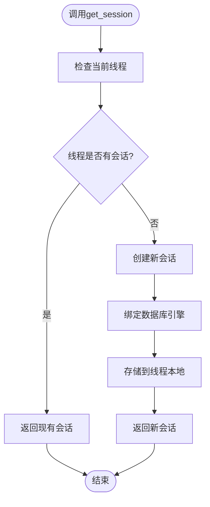
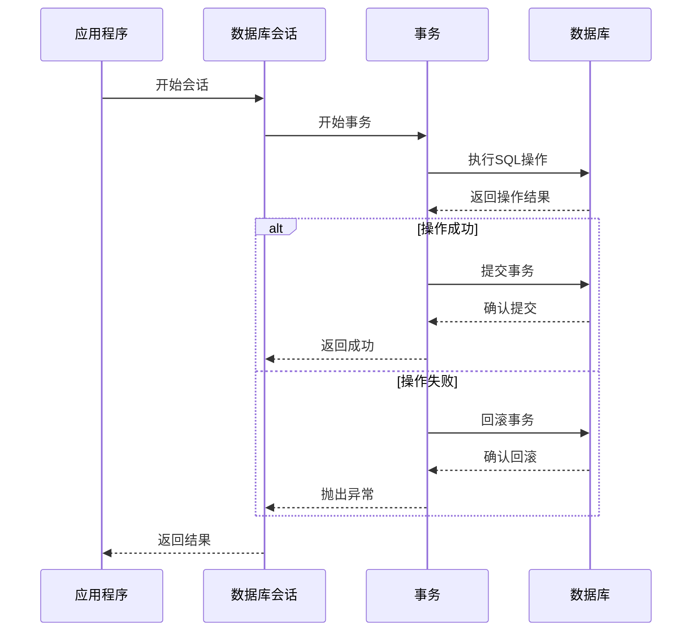
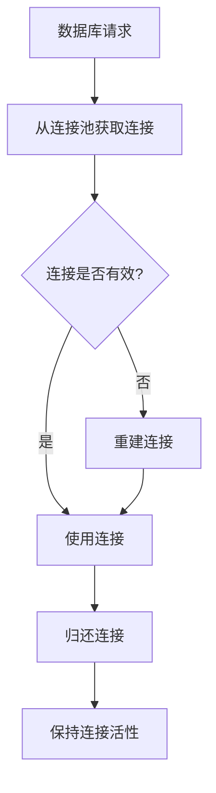
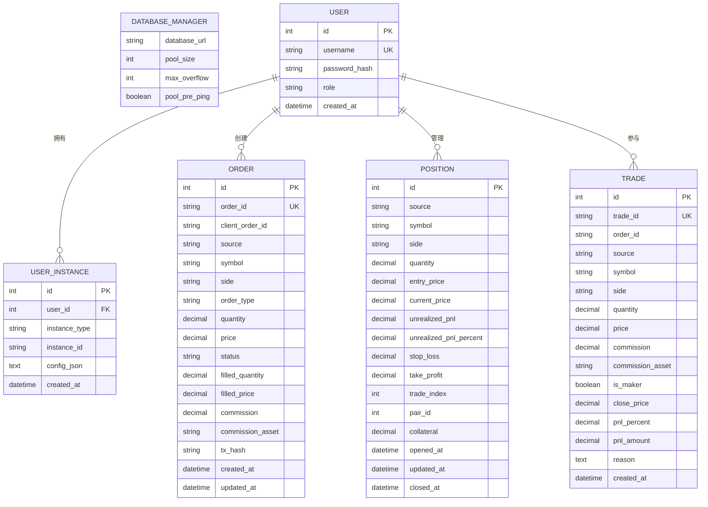
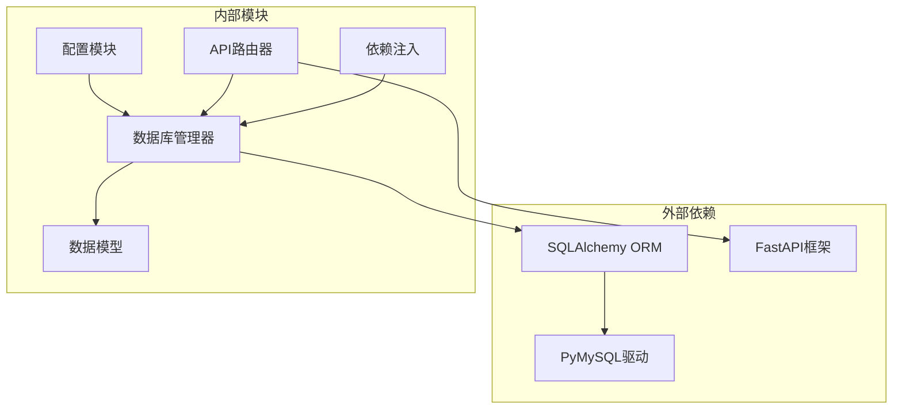
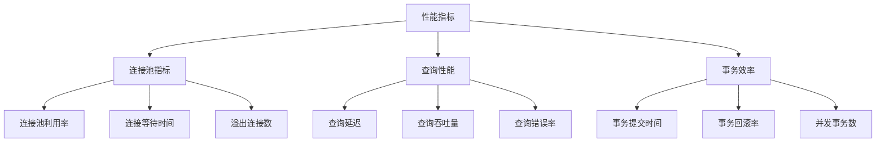
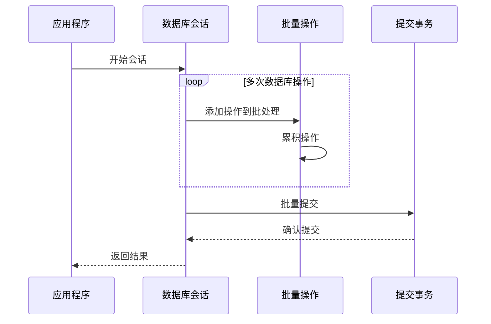

# 数据库会话管理

<cite>
**本文档引用的文件**
- [database/models.py](file://backpack_quant_trading/database/models.py)
- [config/settings.py](file://backpack_quant_trading/config/settings.py)
- [api/deps.py](file://backpack_quant_trading/api/deps.py)
- [api/routers/auth.py](file://backpack_quant_trading/api/routers/auth.py)
- [api/routers/grid.py](file://backpack_quant_trading/api/routers/grid.py)
- [api/routers/currency_monitor.py](file://backpack_quant_trading/api/routers/currency_monitor.py)
- [api/routers/dashboard.py](file://backpack_quant_trading/api/routers/dashboard.py)
</cite>

## 目录
1. [简介](#简介)
2. [项目结构](#项目结构)
3. [核心组件](#核心组件)
4. [架构概览](#架构概览)
5. [详细组件分析](#详细组件分析)
6. [依赖关系分析](#依赖关系分析)
7. [性能考虑](#性能考虑)
8. [故障排除指南](#故障排除指南)
9. [结论](#结论)

## 简介

本文档详细介绍了项目中的数据库会话管理系统，重点分析了DatabaseManager类的设计与实现。该系统基于SQLAlchemy ORM框架，提供了完整的数据库连接池配置、会话生命周期管理、事务处理机制以及异常恢复策略。

系统采用scoped_session模式，通过线程本地存储确保每个线程拥有独立的数据库会话实例，有效避免了并发访问冲突。连接池配置支持动态调整，能够适应不同负载场景下的性能需求。

## 项目结构

项目采用分层架构设计，数据库相关的核心文件位于backpack_quant_trading/database目录下：



**图表来源**
- [database/models.py:267-280](file://backpack_quant_trading/database/models.py#L267-L280)
- [config/settings.py:44-53](file://backpack_quant_trading/config/settings.py#L44-L53)

**章节来源**
- [database/models.py:1-721](file://backpack_quant_trading/database/models.py#L1-L721)
- [config/settings.py:1-137](file://backpack_quant_trading/config/settings.py#L1-L137)

## 核心组件

### DatabaseManager类

DatabaseManager是整个数据库会话管理的核心组件，负责数据库连接池的初始化和会话管理。

#### 初始化过程

DatabaseManager的初始化过程包括以下关键步骤：

1. **配置加载**：从全局配置对象config中读取数据库连接参数
2. **引擎创建**：使用create_engine函数创建数据库引擎
3. **会话工厂**：配置sessionmaker并绑定到引擎
4. **作用域会话**：使用scoped_session包装会话工厂

#### 连接池配置

系统支持以下连接池参数配置：

| 参数名称 | 类型 | 默认值 | 描述 |
|---------|------|--------|------|
| pool_size | int | 20 | 连接池初始大小 |
| max_overflow | int | 30 | 超出初始大小后的最大溢出连接数 |
| pool_pre_ping | bool | True | 连接前执行ping验证 |

#### 会话生命周期管理

系统采用scoped_session模式，确保：
- 每个线程拥有独立的会话实例
- 自动处理会话的创建和销毁
- 防止跨线程会话共享导致的数据竞争

**章节来源**
- [database/models.py:267-280](file://backpack_quant_trading/database/models.py#L267-L280)
- [config/settings.py:44-53](file://backpack_quant_trading/config/settings.py#L44-L53)

## 架构概览

系统采用分层架构，各层职责明确：



**图表来源**
- [database/models.py:281-283](file://backpack_quant_trading/database/models.py#L281-L283)
- [config/settings.py:124-130](file://backpack_quant_trading/config/settings.py#L124-L130)

## 详细组件分析

### 会话获取机制

get_session方法实现了统一的会话获取接口：



**图表来源**
- [database/models.py:281-283](file://backpack_quant_trading/database/models.py#L281-L283)

#### 使用模式

系统中会话的典型使用模式：

1. **一次性会话**：每个数据库操作创建一个会话，操作完成后立即关闭
2. **批量操作**：在同一个事务中执行多个相关操作
3. **查询优化**：对于只读查询，使用轻量级会话实例

**章节来源**
- [database/models.py:281-283](file://backpack_quant_trading/database/models.py#L281-L283)

### 事务处理机制

系统实现了标准的事务处理流程：



**图表来源**
- [database/models.py:310-312](file://backpack_quant_trading/database/models.py#L310-L312)
- [database/models.py:344-346](file://backpack_quant_trading/database/models.py#L344-L346)

#### 异常恢复策略

系统采用标准的异常处理模式：

1. **try-except块**：捕获数据库操作异常
2. **事务回滚**：在异常情况下自动回滚事务
3. **资源清理**：确保会话正确关闭
4. **异常传播**：将异常向上层抛出

**章节来源**
- [database/models.py:310-314](file://backpack_quant_trading/database/models.py#L310-L314)
- [database/models.py:344-348](file://backpack_quant_trading/database/models.py#L344-L348)

### 连接池参数配置

#### pool_size（连接池大小）

连接池大小直接影响系统的并发处理能力：

| pool_size范围 | 性能特征 | 适用场景 |
|--------------|----------|----------|
| 1-10 | 低并发，内存占用小 | 开发环境、测试环境 |
| 10-50 | 中等并发，平衡性能 | 生产环境基础配置 |
| 50+ | 高并发，资源消耗大 | 大流量生产环境 |

#### max_overflow（最大溢出连接）

溢出连接允许在峰值期间临时增加连接数：


**图表来源**
- [database/models.py:273-275](file://backpack_quant_trading/database/models.py#L273-L275)

#### pool_pre_ping（连接预检测）

pool_pre_ping=True时的连接验证流程：



**图表来源**
- [database/models.py](file://backpack_quant_trading/database/models.py#L275)

**章节来源**
- [config/settings.py:51-52](file://backpack_quant_trading/config/settings.py#L51-L52)

### 数据模型与表结构

系统定义了完整的交易数据模型：



**图表来源**
- [database/models.py:228-251](file://backpack_quant_trading/database/models.py#L228-L251)
- [database/models.py:65-90](file://backpack_quant_trading/database/models.py#L65-L90)
- [database/models.py:93-121](file://backpack_quant_trading/database/models.py#L93-L121)
- [database/models.py:124-151](file://backpack_quant_trading/database/models.py#L124-L151)

**章节来源**
- [database/models.py:45-251](file://backpack_quant_trading/database/models.py#L45-L251)

## 依赖关系分析

### 组件耦合度分析



**图表来源**
- [database/models.py:1-8](file://backpack_quant_trading/database/models.py#L1-L8)
- [config/settings.py:1-10](file://backpack_quant_trading/config/settings.py#L1-L10)

### 关键依赖路径

1. **配置依赖**：DatabaseManager → Config → DatabaseConfig
2. **ORM依赖**：Models → SQLAlchemy Base → DatabaseManager
3. **API依赖**：Routers → DatabaseManager → Models
4. **认证依赖**：Deps → DatabaseManager → User模型

**章节来源**
- [database/models.py:9-11](file://backpack_quant_trading/database/models.py#L9-L11)
- [config/settings.py:104-132](file://backpack_quant_trading/config/settings.py#L104-L132)

## 性能考虑

### 连接池性能优化

#### 连接池参数调优建议

| 场景类型 | pool_size建议 | max_overflow建议 | pool_pre_ping |
|----------|---------------|------------------|---------------|
| 开发环境 | 5-10 | 10-15 | True |
| 测试环境 | 10-20 | 15-25 | True |
| 生产环境 | 20-50 | 25-50 | True |
| 高并发环境 | 50+ | 50+ | True |

#### 性能监控指标



### 会话管理最佳实践

#### 会话生命周期管理

1. **及时关闭**：每个会话使用完毕后立即关闭
2. **异常处理**：确保异常情况下也能正确关闭会话
3. **资源清理**：避免会话泄漏导致的资源耗尽

#### 批量操作优化



**图表来源**
- [database/models.py:295-314](file://backpack_quant_trading/database/models.py#L295-L314)
- [database/models.py:352-387](file://backpack_quant_trading/database/models.py#L352-L387)

## 故障排除指南

### 常见数据库连接问题

#### 连接超时问题

**症状**：数据库操作超时，连接池耗尽

**诊断步骤**：
1. 检查连接池利用率
2. 分析慢查询日志
3. 监控数据库连接数

**解决方案**：
1. 增加pool_size参数
2. 优化查询语句
3. 实施连接池回收策略

#### 事务死锁问题

**症状**：事务长时间无法提交，出现死锁错误

**诊断方法**：
1. 查看数据库死锁日志
2. 分析事务执行顺序
3. 检查锁等待情况

**预防措施**：
1. 规范事务操作顺序
2. 缩短事务持续时间
3. 实施超时机制

#### 内存泄漏问题

**症状**：应用程序内存持续增长

**排查方法**：
1. 监控会话数量
2. 检查会话关闭情况
3. 分析对象引用关系

**解决策略**：
1. 确保会话正确关闭
2. 实施会话池清理机制
3. 使用弱引用避免循环引用

### 诊断工具和命令

#### 数据库连接状态检查

```sql
-- 检查当前连接数
SHOW STATUS LIKE 'Threads_connected';

-- 查看连接池状态
SHOW ENGINE INNODB STATUS;

-- 监控慢查询
SHOW VARIABLES LIKE 'slow_query_log';
```

#### 应用程序性能监控

```python
# 连接池状态监控
def monitor_pool_status():
    pool = db_manager.engine.pool
    print(f"连接池大小: {pool.size()}")
    print(f"活跃连接: {pool.checkedout()}")
    print(f"等待连接: {pool.waiting()}")

# 查询性能分析
def analyze_query_performance():
    # 实施查询计时和日志记录
    pass
```

**章节来源**
- [database/models.py:310-314](file://backpack_quant_trading/database/models.py#L310-L314)
- [database/models.py:344-348](file://backpack_quant_trading/database/models.py#L344-L348)

## 结论

数据库会话管理系统通过合理的架构设计和配置优化，为整个交易系统提供了稳定可靠的数据访问层。系统的主要优势包括：

1. **高可用性**：通过连接池管理和异常恢复机制，确保数据库连接的稳定性
2. **高性能**：合理的连接池参数配置和会话管理策略，优化了数据库访问性能
3. **易维护性**：清晰的代码结构和标准化的API接口，便于后续维护和扩展
4. **安全性**：完善的事务处理和异常管理，保障了数据的一致性和完整性

建议在生产环境中根据实际负载情况进行连接池参数的动态调整，并建立完善的监控告警机制，确保系统的长期稳定运行。