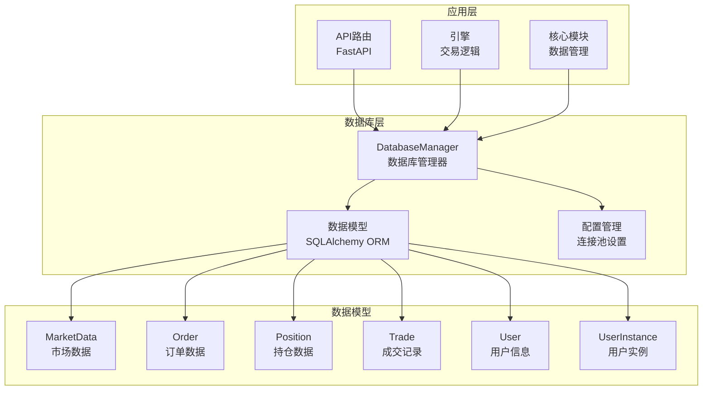
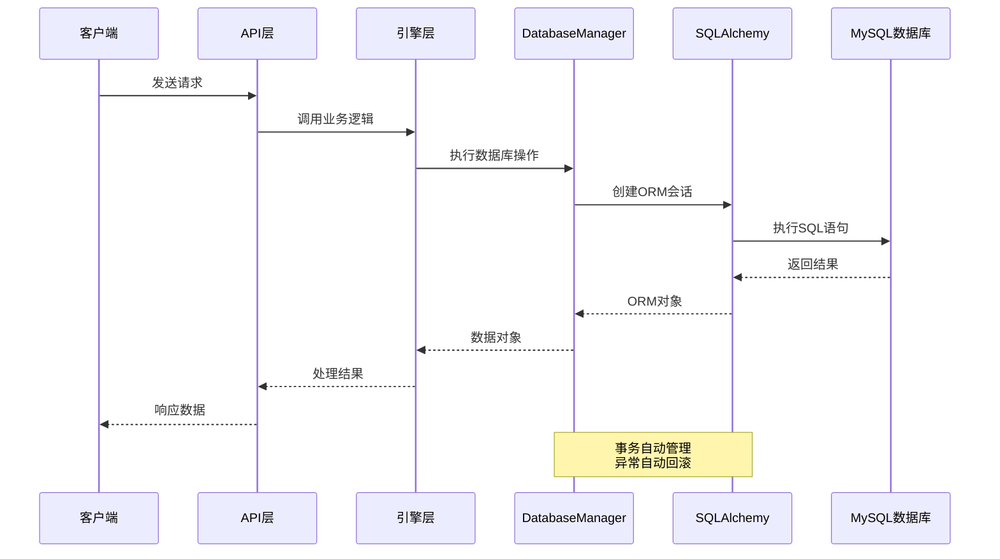
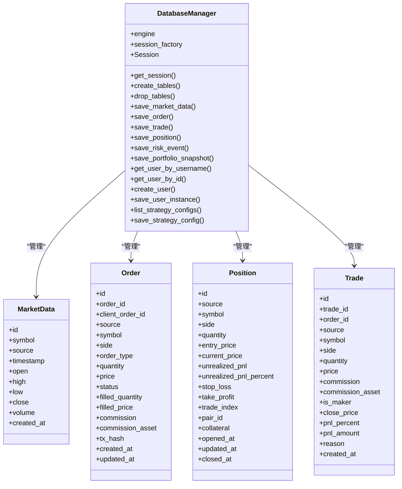
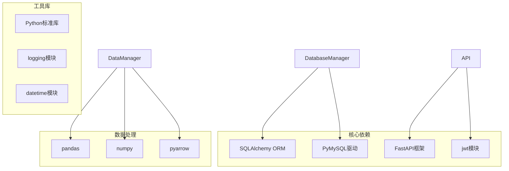
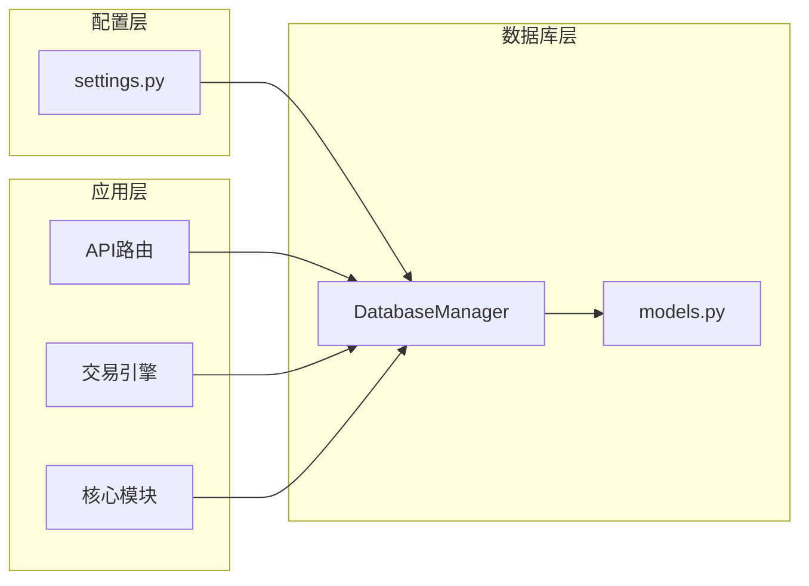
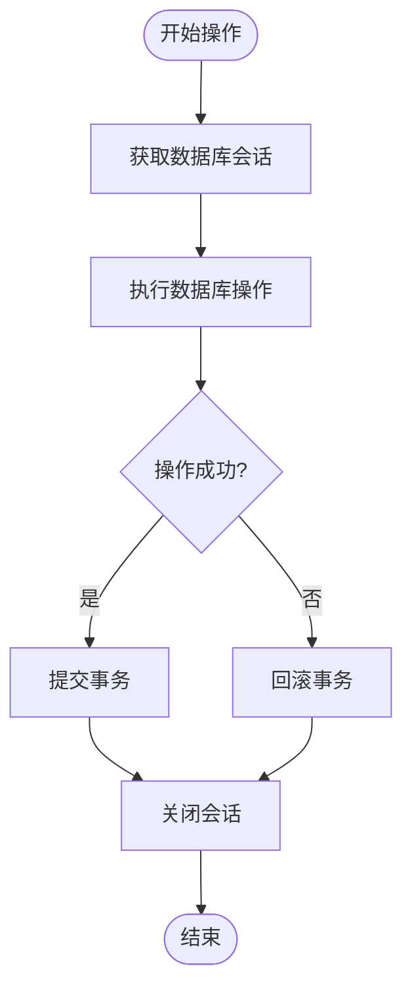

# 数据库操作接口

<cite>
**本文档引用的文件**
- [models.py](file://backpack_quant_trading/database/models.py)
- [settings.py](file://backpack_quant_trading/config/settings.py)
- [migrate_user_instances.py](file://backpack_quant_trading/database/migrate_user_instances.py)
- [deps.py](file://backpack_quant_trading/api/deps.py)
- [strategy.py](file://backpack_quant_trading/api/routers/strategy.py)
- [live_trading.py](file://backpack_quant_trading/engine/live_trading.py)
- [data_manager.py](file://backpack_quant_trading/core/data_manager.py)
</cite>

## 目录
1. [简介](#简介)
2. [项目结构](#项目结构)
3. [核心组件](#核心组件)
4. [架构概览](#架构概览)
5. [详细组件分析](#详细组件分析)
6. [依赖关系分析](#依赖关系分析)
7. [性能考虑](#性能考虑)
8. [故障排除指南](#故障排除指南)
9. [结论](#结论)

## 简介

本文档详细介绍了项目中的数据库操作接口，重点围绕 `DatabaseManager` 类进行全面的API文档说明。该类提供了完整的数据持久化功能，包括数据保存、查询、更新和删除操作，支持多种交易相关数据类型的存储和管理。

数据库层基于 SQLAlchemy ORM 构建，采用 MySQL 作为后端存储，实现了完整的数据模型定义和事务管理机制。系统通过连接池优化数据库连接性能，并提供了完善的异常处理和数据一致性保障。

## 项目结构

项目采用分层架构设计，数据库相关的核心文件位于 `backpack_quant_trading/database/` 目录下：

**图表来源**
- [models.py:267-720](file://backpack_quant_trading/database/models.py#L267-L720)
- [settings.py:44-53](file://backpack_quant_trading/config/settings.py#L44-L53)

**章节来源**
- [models.py:1-721](file://backpack_quant_trading/database/models.py#L1-L721)
- [settings.py:1-137](file://backpack_quant_trading/config/settings.py#L1-L137)

## 核心组件

### DatabaseManager 类

`DatabaseManager` 是整个数据库操作的核心类，负责数据库连接管理、数据模型操作和事务处理。该类提供了完整的 CRUD 操作接口，支持多种数据类型的持久化存储。

#### 主要特性

- **连接池管理**: 基于 SQLAlchemy 的连接池配置，支持连接复用和超时处理
- **事务管理**: 自动化的事务处理，确保数据一致性
- **异常处理**: 完善的异常捕获和回滚机制
- **数据验证**: 对输入数据进行类型转换和长度限制
- **多表支持**: 支持市场数据、订单、持仓、成交等多种数据模型

**章节来源**
- [models.py:267-284](file://backpack_quant_trading/database/models.py#L267-L284)

## 架构概览

系统采用分层架构，各层职责明确，通过依赖注入实现松耦合：

**图表来源**
- [models.py:281-314](file://backpack_quant_trading/database/models.py#L281-L314)
- [deps.py:62-66](file://backpack_quant_trading/api/deps.py#L62-L66)

## 详细组件分析

### 数据模型设计

系统定义了完整的交易数据模型，涵盖市场数据、订单、持仓、成交等核心业务实体：

**图表来源**
- [models.py:45-251](file://backpack_quant_trading/database/models.py#L45-L251)
- [models.py:267-720](file://backpack_quant_trading/database/models.py#L267-L720)

### 数据保存操作

#### 市场数据保存

`save_market_data` 方法用于保存市场数据，支持批量数据处理和去重机制：

**方法签名**: `save_market_data(symbol: str, data: list, source: str = 'backpack')`

**参数说明**:
- `symbol`: 交易对符号，如 'ETH-USDT'
- `data`: 市场数据列表，每条数据包含时间戳、开盘价、最高价、最低价、收盘价、成交量
- `source`: 数据源标识，默认为 'backpack'

**返回值**: 无（void）

**异常处理**: 
- 数据库异常时自动回滚并抛出原始异常
- 支持批量数据的原子性操作

**数据处理**:
- 自动将时间戳转换为 datetime 对象
- 使用 Decimal 类型确保精度
- 通过 merge 操作实现去重和更新

**章节来源**
- [models.py:293-315](file://backpack_quant_trading/database/models.py#L293-L315)

#### 订单数据保存

`save_order` 方法处理订单数据的保存，包含完整的订单生命周期管理：

**方法签名**: `save_order(order_data: dict, source: str = 'backpack')`

**参数说明**:
- `order_data`: 订单数据字典，包含订单ID、交易对、方向、类型、数量、价格等信息
- `source`: 数据源标识

**返回值**: 无（void）

**异常处理**: 
- 完整的事务管理和异常回滚
- 支持订单状态的动态更新

**数据验证**:
- 自动截断过长的订单ID和交易哈希
- 类型转换和数据完整性检查
- 时间戳格式统一处理

**章节来源**
- [models.py:316-348](file://backpack_quant_trading/database/models.py#L316-L348)

#### 成交记录保存

`save_trade` 方法专门处理成交记录的保存，具有防重复机制：

**方法签名**: `save_trade(trade_data: dict, source: str = 'backpack')`

**参数说明**:
- `trade_data`: 成交数据字典，包含成交ID、订单ID、价格、数量、手续费等
- `source`: 数据源标识

**返回值**: 无（void）

**异常处理**: 
- 重复成交ID检测和跳过机制
- 完整的事务回滚支持

**关键特性**:
- 自动检测重复的 trade_id 并跳过重复插入
- 使用 add 而非 merge 确保新记录正确创建
- 支持复杂的成交统计字段

**章节来源**
- [models.py:350-387](file://backpack_quant_trading/database/models.py#L350-L387)

#### 持仓数据保存

`save_position` 方法管理持仓数据的创建和更新：

**方法签名**: `save_position(position_data: dict, source: str = 'backpack')`

**参数说明**:
- `position_data`: 持仓数据字典，包含交易对、方向、数量、入场价等
- `source`: 数据源标识

**返回值**: 无（void）

**异常处理**: 
- 持仓状态的智能判断和更新
- 支持持仓的开仓、平仓和更新操作

**智能逻辑**:
- 自动查找未平仓的相同持仓并更新
- 支持 Ostium 扩展字段的处理
- 时间戳格式的灵活处理

**章节来源**
- [models.py:389-454](file://backpack_quant_trading/database/models.py#L389-L454)

### 查询操作

#### 用户管理查询

系统提供了完整的用户管理查询功能：

**用户名查询**: `get_user_by_username(username: str)`
- 参数: 用户名
- 返回: User 对象或 None
- 特点: 自动刷新和分离对象，避免会话绑定

**用户ID查询**: `get_user_by_id(user_id: int)`
- 参数: 用户ID
- 返回: User 对象或 None

**用户创建**: `create_user(username: str, password_hash: str, role: str = 'user')`
- 参数: 用户名、密码哈希、角色
- 返回: 新创建的 User 对象
- 特点: 自动分配ID并返回完整对象

**章节来源**
- [models.py:500-538](file://backpack_quant_trading/database/models.py#L500-L538)

#### 实例管理查询

用户实例管理提供了多租户隔离功能：

**实例ID获取**: `get_user_instance_ids(user_id: int, instance_type: str) -> list`
- 获取用户特定类型的所有实例ID

**实例配置获取**: `get_user_instance_configs(user_id: int, instance_type: str) -> list`
- 获取用户特定类型的所有实例配置

**全局配置管理**: 
- `get_currency_monitor_config()`: 获取全局币种监视配置
- `get_currency_monitor_config_for_user(user_id: int)`: 获取指定用户的币种监视配置
- `save_currency_monitor_config(config_json: str)`: 保存全局配置
- `save_currency_monitor_config_for_user(user_id: int, config_json: str)`: 保存用户配置

**章节来源**
- [models.py:559-636](file://backpack_quant_trading/database/models.py#L559-L636)

### 策略配置管理

系统支持策略配置的动态管理：

**策略配置列表**: `list_strategy_configs()`
- 返回所有策略配置对象

**策略配置保存**: `save_strategy_config(name: str, module: str, class_name: str, default_params: Optional[str] = None)`
- 保存或更新策略配置
- 支持默认参数的JSON序列化

**章节来源**
- [models.py:685-717](file://backpack_quant_trading/database/models.py#L685-L717)

## 依赖关系分析

### 外部依赖

系统依赖以下主要外部库：

**图表来源**
- [models.py:1-8](file://backpack_quant_trading/database/models.py#L1-L8)
- [data_manager.py:1-15](file://backpack_quant_trading/core/data_manager.py#L1-L15)

### 内部依赖关系

**图表来源**
- [settings.py:104-132](file://backpack_quant_trading/config/settings.py#L104-L132)
- [models.py:267-720](file://backpack_quant_trading/database/models.py#L267-L720)

**章节来源**
- [settings.py:1-137](file://backpack_quant_trading/config/settings.py#L1-137)
- [models.py:1-721](file://backpack_quant_trading/database/models.py#L1-721)

## 性能考虑

### 连接池配置

系统采用优化的连接池配置，平衡性能和资源使用：

**连接池参数**:
- `POOL_SIZE`: 20 - 连接池大小
- `MAX_OVERFLOW`: 30 - 超额连接数
- `pool_pre_ping`: True - 连接健康检查
- `echo`: False - SQL日志开关

**配置来源**: [settings.py:51-52](file://backpack_quant_trading/config/settings.py#L51-L52)

### 事务管理策略

系统实现了自动化的事务管理，确保数据一致性和操作原子性：

**图表来源**
- [models.py:295-314](file://backpack_quant_trading/database/models.py#L295-L314)

### 数据一致性保证

系统通过多种机制确保数据一致性：

1. **事务隔离**: 每个操作都在独立事务中执行
2. **异常处理**: 自动捕获异常并回滚
3. **数据验证**: 输入数据的类型转换和长度限制
4. **重复检测**: 成交记录的重复ID检测机制

**章节来源**
- [models.py:310-312](file://backpack_quant_trading/database/models.py#L310-L312)
- [models.py:358-362](file://backpack_quant_trading/database/models.py#L358-L362)

## 故障排除指南

### 常见问题及解决方案

#### 连接池耗尽

**症状**: 数据库操作超时或连接失败
**原因**: 连接池中的连接被长时间占用
**解决方案**:
- 检查是否有未正确关闭的会话
- 优化长时间运行的操作
- 调整连接池参数

#### 数据重复插入

**症状**: 数据库唯一约束冲突
**原因**: 重复的主键或唯一键
**解决方案**:
- 使用 merge 而非 add 进行更新操作
- 实施重复检测机制
- 检查数据源的唯一性

#### 性能问题

**症状**: 数据库响应缓慢
**原因**: 缺少适当的索引或查询优化不足
**解决方案**:
- 分析慢查询日志
- 添加必要的数据库索引
- 优化查询条件

### 调试技巧

1. **启用SQL日志**: 将 `echo` 参数设为 `True` 进行调试
2. **检查连接状态**: 使用 `pool_pre_ping` 确保连接有效性
3. **监控连接池**: 定期检查连接池使用情况

**章节来源**
- [models.py:275-277](file://backpack_quant_trading/database/models.py#L275-L277)

## 结论

DatabaseManager 类为项目提供了完整、可靠的数据库操作接口。通过精心设计的数据模型、完善的事务管理机制和优化的连接池配置，系统能够高效地处理各种交易相关的数据操作。

### 主要优势

1. **完整的CRUD支持**: 支持所有基本的数据库操作
2. **数据一致性**: 通过事务和异常处理确保数据完整性
3. **性能优化**: 连接池配置和批量操作优化
4. **易于使用**: 简洁的API设计和清晰的错误处理
5. **扩展性强**: 支持新的数据模型和业务需求

### 最佳实践建议

1. **始终使用会话管理**: 确保每个操作都在正确的会话上下文中执行
2. **合理处理异常**: 利用内置的异常处理机制
3. **监控连接池**: 定期检查连接池使用情况
4. **优化查询**: 为常用查询添加适当的索引
5. **定期维护**: 定期清理历史数据和优化数据库性能

该数据库接口为整个量化交易系统的数据持久化提供了坚实的基础，支持从实时数据采集到历史数据分析的完整数据生命周期管理。