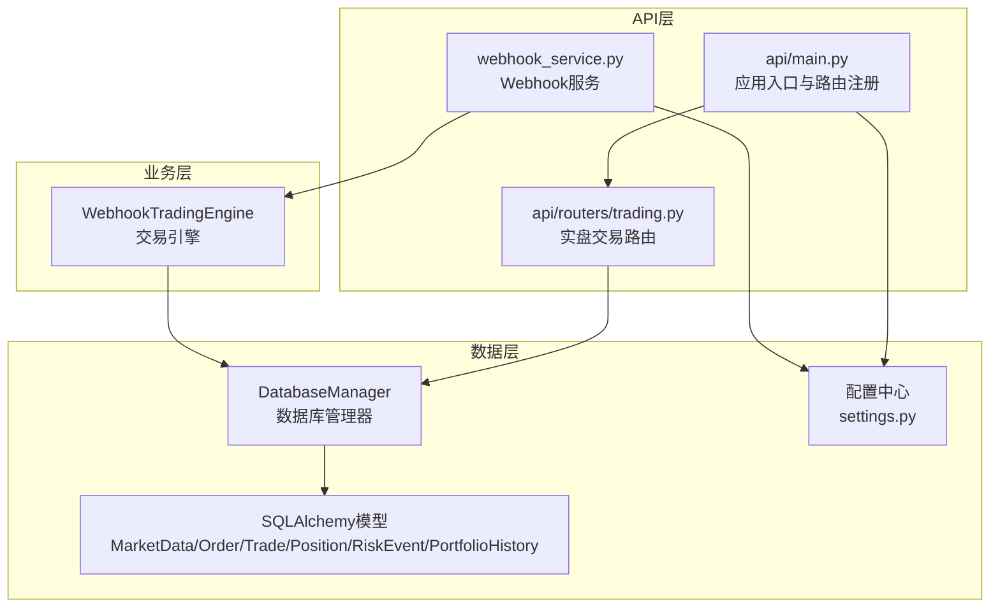
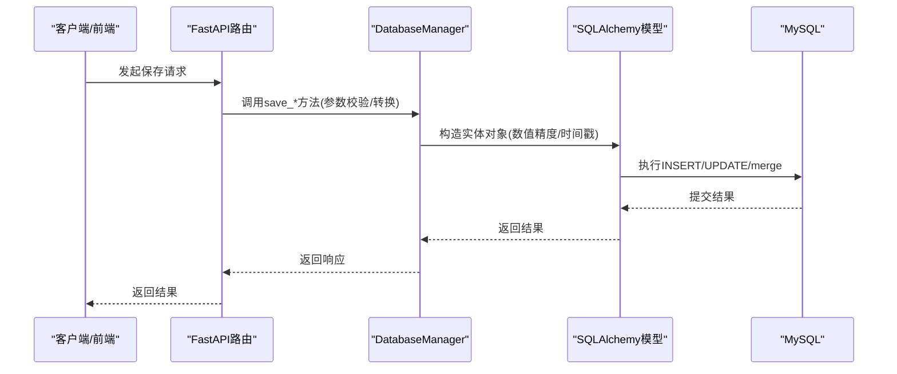
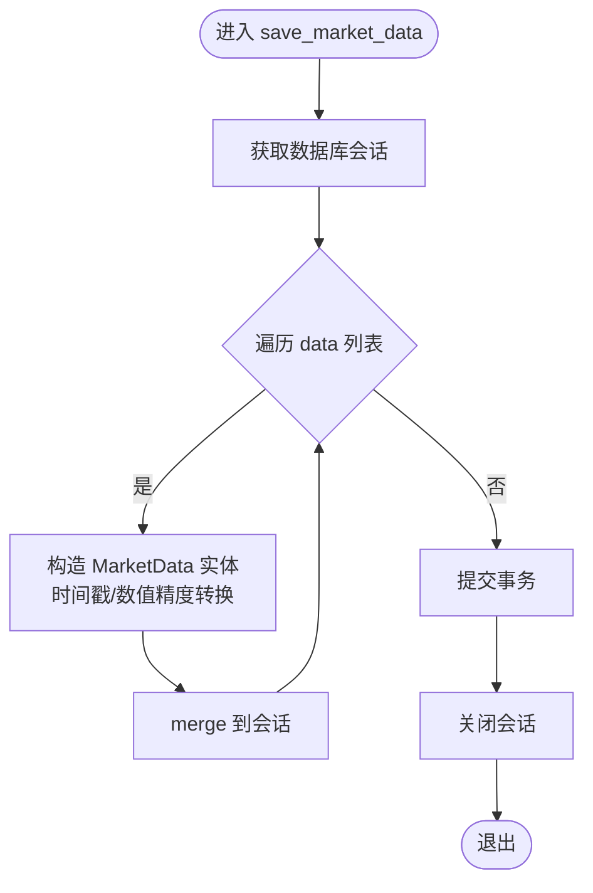
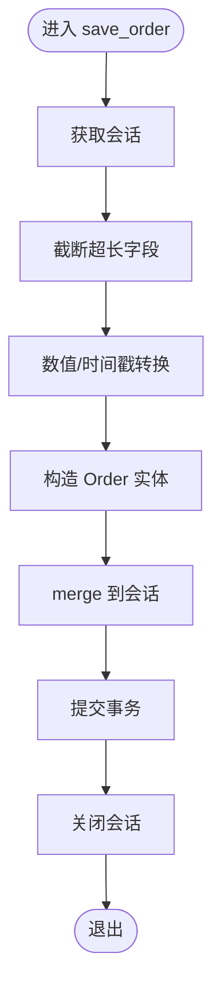
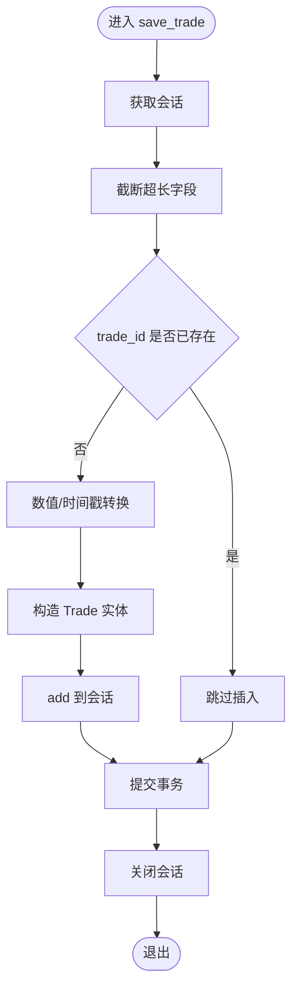
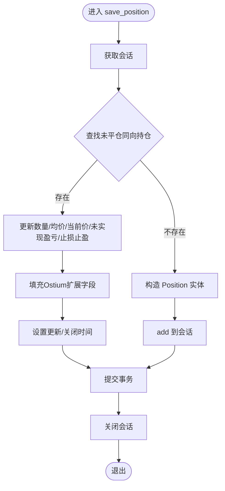
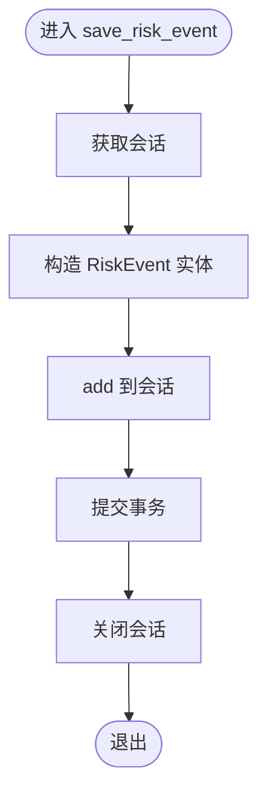
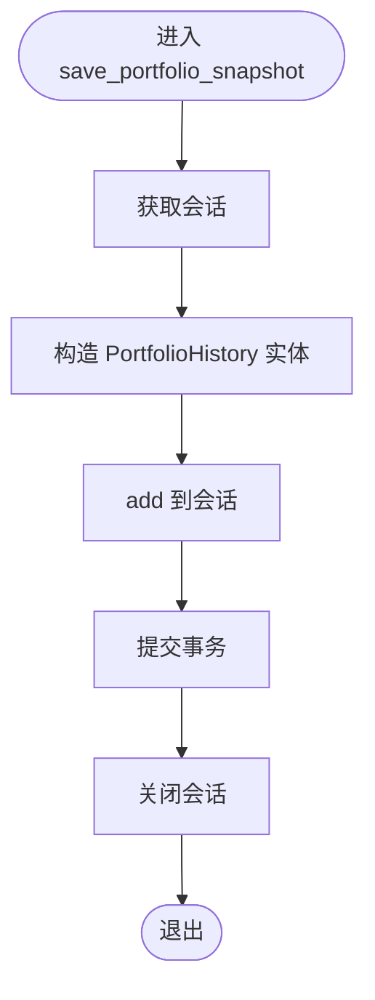
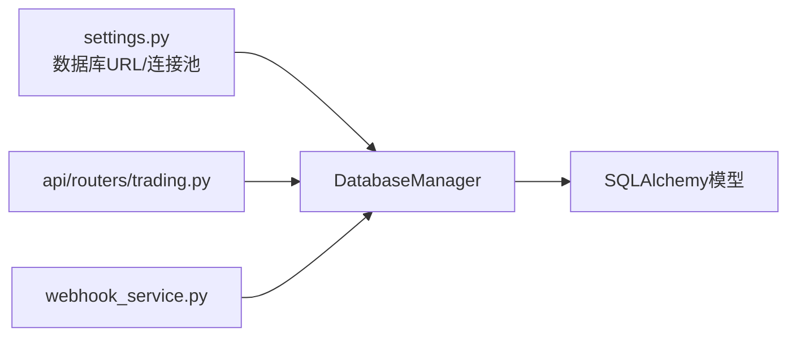

# 数据持久化API

<cite>
**本文档引用的文件**
- [models.py](file://backpack_quant_trading/database/models.py)
- [settings.py](file://backpack_quant_trading/config/settings.py)
- [main.py](file://backpack_quant_trading/api/main.py)
- [trading.py](file://backpack_quant_trading/api/routers/trading.py)
- [webhook_service.py](file://backpack_quant_trading/webhook_service.py)
</cite>

## 目录
1. [简介](#简介)
2. [项目结构](#项目结构)
3. [核心组件](#核心组件)
4. [架构总览](#架构总览)
5. [详细组件分析](#详细组件分析)
6. [依赖关系分析](#依赖关系分析)
7. [性能考虑](#性能考虑)
8. [故障排查指南](#故障排查指南)
9. [结论](#结论)
10. [附录](#附录)

## 简介
本文件面向数据持久化API，聚焦以下核心方法的详细说明与最佳实践：
- save_market_data：批量保存市场K线数据
- save_order：单条订单数据保存
- save_trade：单条成交记录保存
- save_position：单条/更新持仓数据
- save_risk_event：风险事件记录
- save_portfolio_snapshot：组合净值快照

内容涵盖参数类型、数据验证规则、异常处理机制、时间戳与数值精度处理、批量与单条处理差异、数据格式示例与错误处理最佳实践。

## 项目结构
围绕数据持久化API，涉及的关键模块如下：
- 数据库模型与管理器：定义表结构与统一的保存方法
- 配置中心：数据库连接与池化参数
- API入口与路由：对外暴露的HTTP接口
- Webhook服务：交易引擎与信号触发的外部集成

图表来源
- [main.py:36-48](file://backpack_quant_trading/api/main.py#L36-L48)
- [trading.py:105-200](file://backpack_quant_trading/api/routers/trading.py#L105-L200)
- [webhook_service.py:83-241](file://backpack_quant_trading/webhook_service.py#L83-L241)
- [models.py:267-496](file://backpack_quant_trading/database/models.py#L267-L496)
- [settings.py:104-132](file://backpack_quant_trading/config/settings.py#L104-L132)

章节来源
- [main.py:36-48](file://backpack_quant_trading/api/main.py#L36-L48)
- [settings.py:104-132](file://backpack_quant_trading/config/settings.py#L104-L132)

## 核心组件
- DatabaseManager：封装数据库连接、会话管理与各类save_*方法，提供统一的事务控制与异常回滚
- SQLAlchemy模型：MarketData、Order、Trade、Position、RiskEvent、PortfolioHistory
- 配置中心：提供数据库URL与连接池参数

章节来源
- [models.py:267-496](file://backpack_quant_trading/database/models.py#L267-L496)
- [settings.py:104-132](file://backpack_quant_trading/config/settings.py#L104-L132)

## 架构总览
数据持久化API通过FastAPI路由调用DatabaseManager的save_*方法，完成数据入库。Webhook服务在收到外部信号后，同样通过引擎调用DatabaseManager进行持久化。

图表来源
- [trading.py:105-200](file://backpack_quant_trading/api/routers/trading.py#L105-L200)
- [models.py:293-496](file://backpack_quant_trading/database/models.py#L293-L496)

## 详细组件分析

### save_market_data（批量市场数据）
- 功能：批量保存K线数据（分钟级/多周期）
- 参数
  - symbol: 交易对字符串
  - data: 列表，元素为字典，包含timestamp、open、high、low、close、volume
  - source: 数据源标识，默认'backpack'
- 数据验证与转换
  - timestamp：支持秒/毫秒时间戳，统一转换为datetime
  - OHLCV：转换为高精度十进制数值
  - 去重与索引：基于symbol+timestamp+source复合索引保证唯一性
- 处理流程
  - 逐条构造MarketData实体并merge，最后commit
- 异常处理
  - 事务内捕获异常并回滚，finally关闭会话
- 批量与单条
  - 批量：传入列表，逐条入库
  - 单条：将单条包装为列表传入

图表来源
- [models.py:293-314](file://backpack_quant_trading/database/models.py#L293-L314)

章节来源
- [models.py:293-314](file://backpack_quant_trading/database/models.py#L293-L314)

### save_order（单条订单）
- 功能：保存订单信息
- 参数
  - order_data: 字典，包含必要字段如order_id、symbol、side、type、quantity、status等
  - source: 数据源标识，默认'backpack'
- 数据验证与转换
  - 截断超长字段：order_id、tx_hash至250字符
  - 数值精度：quantity、price、filled_quantity、filled_price、commission等转换为高精度十进制
  - 时间戳：createdTime支持秒/毫秒，转换为datetime
- 处理流程
  - 构造Order实体并merge，提交
- 异常处理
  - 事务内捕获异常并回滚，finally关闭会话

图表来源
- [models.py:316-348](file://backpack_quant_trading/database/models.py#L316-L348)

章节来源
- [models.py:316-348](file://backpack_quant_trading/database/models.py#L316-L348)

### save_trade（单条成交）
- 功能：保存成交记录
- 参数
  - trade_data: 字典，包含tradeId、orderId、symbol、side、quantity、price、commission等
  - source: 数据源标识，默认'backpack'
- 数据验证与转换
  - 截断超长字段：trade_id、order_id至250字符
  - 去重保护：若trade_id已存在则静默跳过
  - 数值精度：quantity、price、commission等转换为高精度十进制
  - 时间戳：timestamp支持秒/毫秒，转换为datetime
- 处理流程
  - 查询去重 -> 构造Trade实体 -> add提交
- 异常处理
  - 事务内捕获异常并回滚，finally关闭会话

图表来源
- [models.py:350-387](file://backpack_quant_trading/database/models.py#L350-L387)

章节来源
- [models.py:350-387](file://backpack_quant_trading/database/models.py#L350-L387)

### save_position（单条/更新持仓）
- 功能：保存或更新持仓
- 参数
  - position_data: 字典，包含symbol、side、quantity、entry_price等
  - source: 数据源标识，默认'backpack'
- 数据验证与转换
  - 唯一性：按symbol+side+source且closed_at为空查找
  - 更新：若存在则更新数量、均价、当前价、未实现盈亏等
  - 新建：若不存在则创建，支持Ostium扩展字段（index/pair_id/collateral）
  - 时间戳：支持秒/毫秒，自动归一化为秒
- 处理流程
  - 查询是否存在未平仓同向持仓 -> 更新或新建 -> 提交
- 异常处理
  - 事务内捕获异常并回滚，finally关闭会话

图表来源
- [models.py:389-454](file://backpack_quant_trading/database/models.py#L389-L454)

章节来源
- [models.py:389-454](file://backpack_quant_trading/database/models.py#L389-L454)

### save_risk_event（风险事件）
- 功能：记录风险事件
- 参数
  - event_type: 事件类型
  - severity: 严重程度（枚举）
  - description: 描述
  - affected_symbols: 受影响交易对（可选）
  - source: 数据源标识，默认'backpack'
- 处理流程
  - 构造RiskEvent实体并add，提交
- 异常处理
  - 事务内捕获异常并回滚，finally关闭会话

图表来源
- [models.py:456-473](file://backpack_quant_trading/database/models.py#L456-L473)

章节来源
- [models.py:456-473](file://backpack_quant_trading/database/models.py#L456-L473)

### save_portfolio_snapshot（组合净值快照）
- 功能：保存组合净值快照
- 参数
  - portfolio_value: 组合总价值
  - cash_balance: 现金余额
  - position_value: 持仓价值
  - daily_pnl/daily_return: 日度盈亏与收益率（可选）
  - source: 数据源标识，默认'backpack'
- 处理流程
  - 构造PortfolioHistory实体并add，提交
- 异常处理
  - 事务内捕获异常并回滚，finally关闭会话

图表来源
- [models.py:475-496](file://backpack_quant_trading/database/models.py#L475-L496)

章节来源
- [models.py:475-496](file://backpack_quant_trading/database/models.py#L475-L496)

## 依赖关系分析
- DatabaseManager依赖配置中心提供的数据库URL与连接池参数
- API路由通过DatabaseManager调用各save_*方法
- Webhook服务在引擎执行信号时，同样通过DatabaseManager持久化

图表来源
- [settings.py:124-132](file://backpack_quant_trading/config/settings.py#L124-L132)
- [models.py:267-288](file://backpack_quant_trading/database/models.py#L267-L288)
- [trading.py:105-200](file://backpack_quant_trading/api/routers/trading.py#L105-L200)
- [webhook_service.py:83-241](file://backpack_quant_trading/webhook_service.py#L83-L241)

章节来源
- [settings.py:124-132](file://backpack_quant_trading/config/settings.py#L124-L132)
- [models.py:267-288](file://backpack_quant_trading/database/models.py#L267-L288)

## 性能考虑
- 连接池与预检：配置POOL_SIZE与MAX_OVERFLOW，启用pool_pre_ping降低连接失效
- 批量写入：save_market_data采用merge逐条入库，建议在上游聚合足够批次再调用
- 索引优化：各表均建立关键查询索引（如idx_symbol_timestamp_source、idx_symbol_status_source等）
- 数值精度：统一使用高精度十进制，避免浮点误差累积
- 事务粒度：每个save_*方法独立事务，避免长时间持有锁

章节来源
- [settings.py:44-53](file://backpack_quant_trading/config/settings.py#L44-L53)
- [models.py:60-62](file://backpack_quant_trading/database/models.py#L60-L62)
- [models.py:87-90](file://backpack_quant_trading/database/models.py#L87-L90)
- [models.py:118-121](file://backpack_quant_trading/database/models.py#L118-L121)
- [models.py:148-151](file://backpack_quant_trading/database/models.py#L148-L151)
- [models.py:204-207](file://backpack_quant_trading/database/models.py#L204-L207)
- [models.py:223-225](file://backpack_quant_trading/database/models.py#L223-L225)

## 故障排查指南
- 数据库连接失败
  - 检查数据库URL与凭据配置
  - 端口/主机可达性
- 写入异常
  - save_*方法内部捕获异常并回滚，确认上游是否正确处理HTTP 5xx
- 重复数据
  - save_trade对trade_id进行去重保护；若仍出现重复，检查上游是否重复发送
- 字段长度超限
  - save_order/save_trade对超长字段进行截断；若业务需要更长ID，需评估数据库schema变更
- 时间戳问题
  - 保存前统一转换为datetime；注意时区与单位（秒/毫秒）

章节来源
- [models.py:310-314](file://backpack_quant_trading/database/models.py#L310-L314)
- [models.py:358-362](file://backpack_quant_trading/database/models.py#L358-L362)
- [models.py:320-322](file://backpack_quant_trading/database/models.py#L320-L322)

## 结论
本文档梳理了数据持久化API的六大核心方法，明确了参数类型、数据验证规则、异常处理机制与转换逻辑，并结合批量与单条处理场景给出最佳实践。通过统一的DatabaseManager与SQLAlchemy模型，系统实现了高可靠、高性能的数据落库能力。

## 附录

### 数据格式示例（字段说明）
- 市场数据（save_market_data）
  - symbol: 交易对字符串
  - data: 列表，元素为字典，包含timestamp、open、high、low、close、volume
- 订单（save_order）
  - order_id、client_id、symbol、side、type、quantity、price、status、filledQuantity、avgPrice、commission、commissionAsset、tx_hash、createdTime
- 成交（save_trade）
  - tradeId、orderId、symbol、side、quantity、price、commission、commissionAsset、isMaker、close_price、pnl_percent、pnl_amount、reason、timestamp
- 持仓（save_position）
  - symbol、side、quantity、entry_price、current_price、unrealized_pnl、unrealized_pnl_percent、stop_loss、take_profit、opened_at、closed_at、index/pair_id/collateral
- 风险事件（save_risk_event）
  - event_type、severity、description、affected_symbols
- 组合快照（save_portfolio_snapshot）
  - portfolio_value、cash_balance、position_value、daily_pnl、daily_return

### 错误处理最佳实践
- 上游统一捕获HTTP异常并记录日志
- 对超长字段进行显式截断，避免数据库约束失败
- 对重复ID进行幂等处理（如trade_id去重）
- 在高并发场景下，合理设置连接池参数与事务粒度
- 对时间戳进行统一转换，避免跨系统时区与单位差异