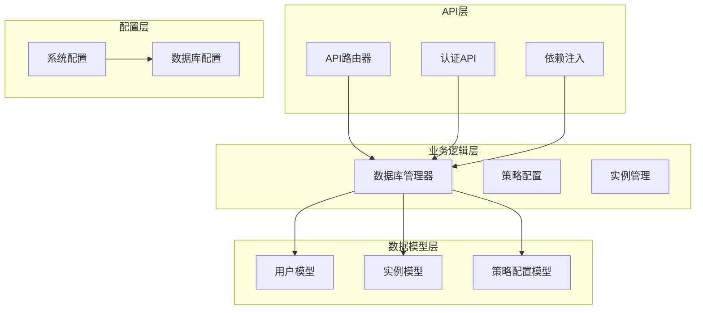
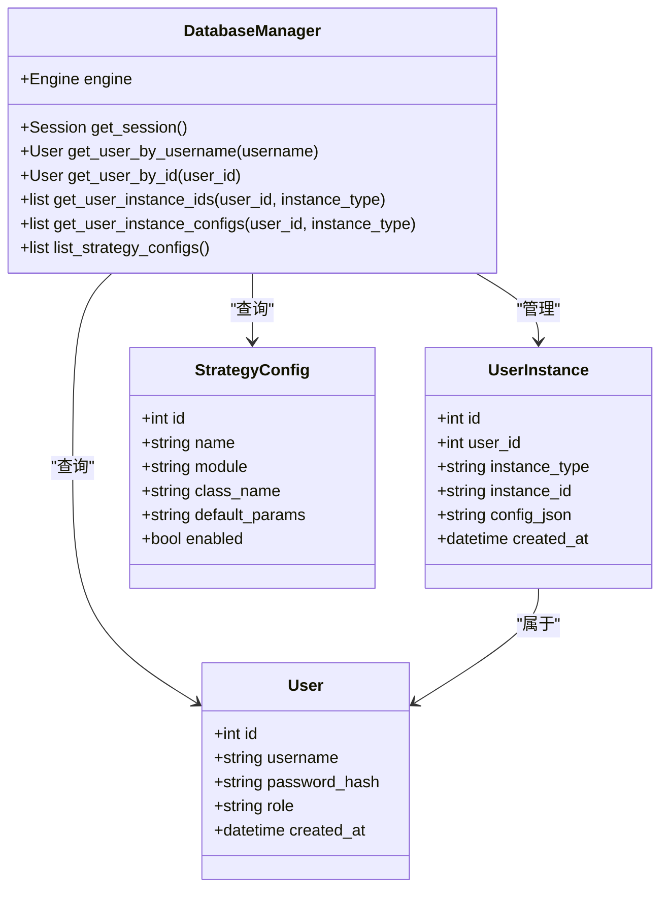
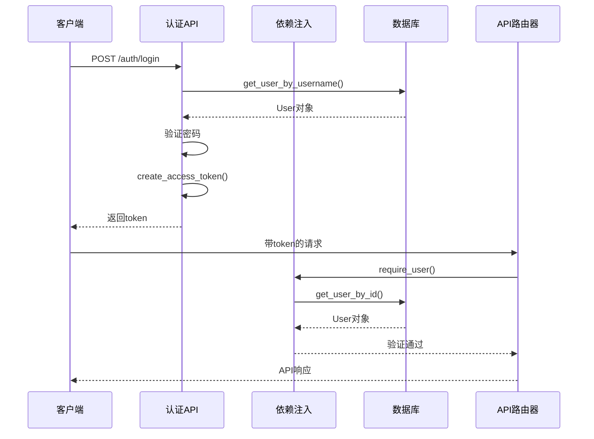
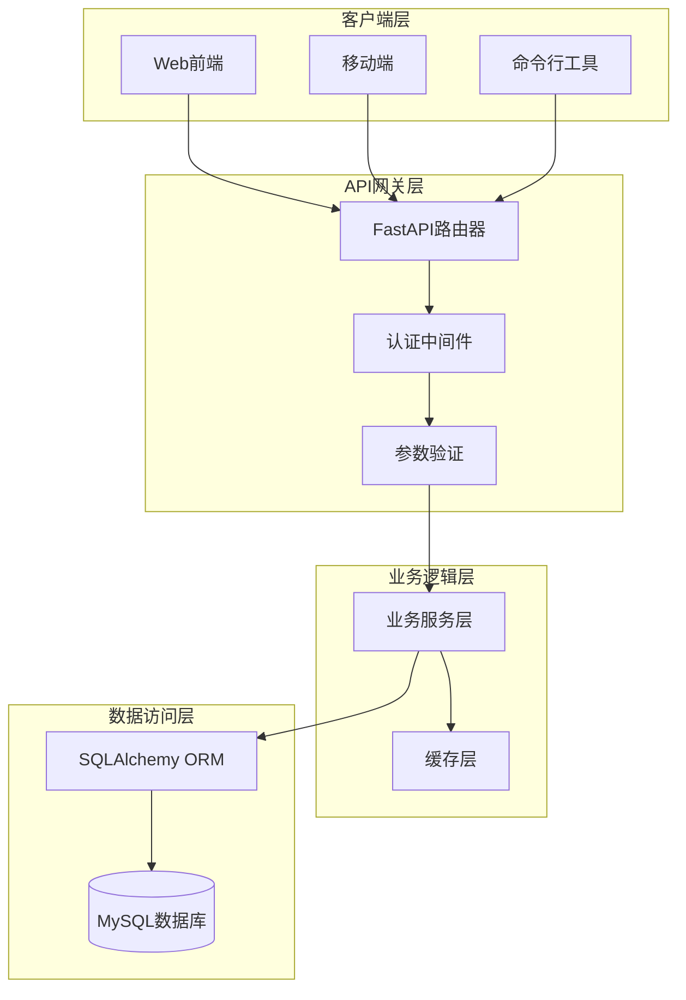
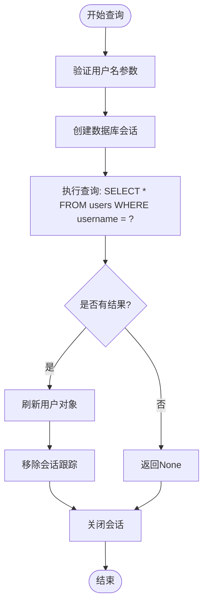
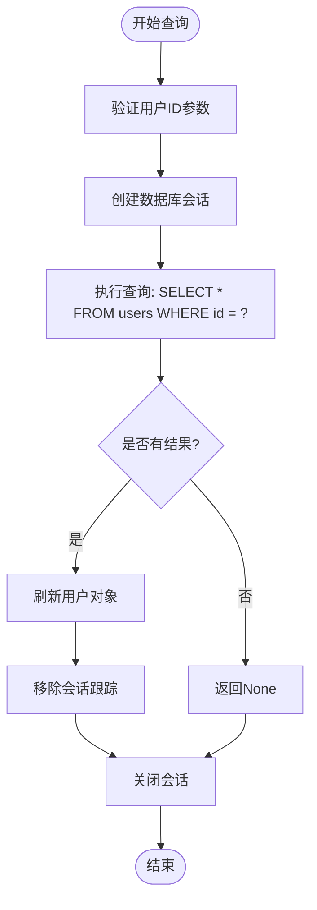
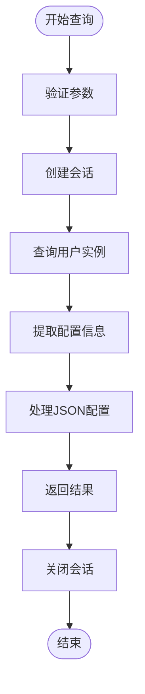
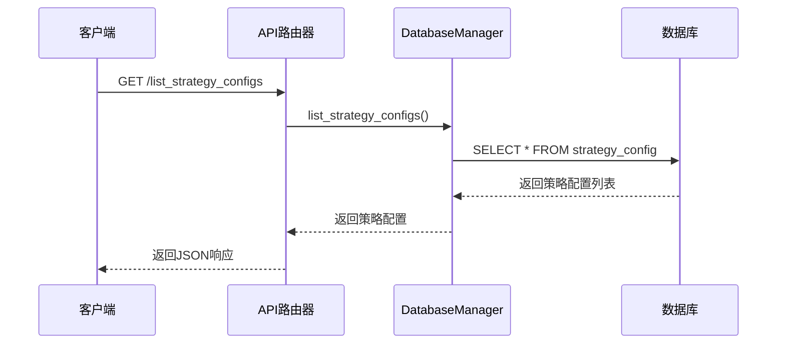
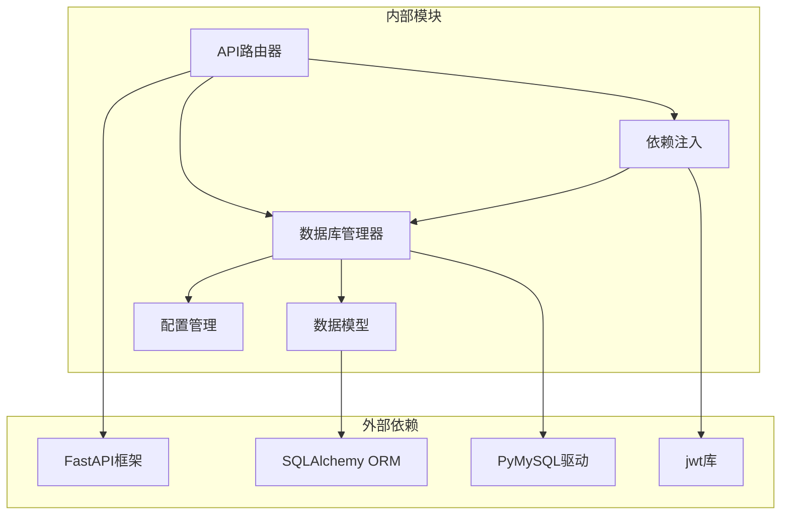
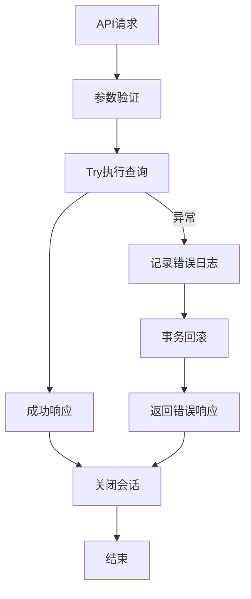

# 查询检索API

<cite>
**本文档引用的文件**
- [trading.py](file://backpack_quant_trading/api/routers/trading.py)
- [models.py](file://backpack_quant_trading/database/models.py)
- [deps.py](file://backpack_quant_trading/api/deps.py)
- [settings.py](file://backpack_quant_trading/config/settings.py)
- [auth.py](file://backpack_quant_trading/api/routers/auth.py)
</cite>

## 目录
1. [简介](#简介)
2. [项目结构](#项目结构)
3. [核心组件](#核心组件)
4. [架构概览](#架构概览)
5. [详细组件分析](#详细组件分析)
6. [依赖分析](#依赖分析)
7. [性能考虑](#性能考虑)
8. [故障排除指南](#故障排除指南)
9. [结论](#结论)

## 简介

本文档详细介绍了量化交易系统的查询检索API，重点涵盖以下查询方法：
- `get_user_by_username` - 根据用户名获取用户信息
- `get_user_by_id` - 根据用户ID获取用户信息  
- `get_user_instance_ids` - 获取用户的所有实例ID
- `get_user_instance_configs` - 获取用户的实例配置
- `list_strategy_configs` - 列出所有策略配置

这些API提供了完整的用户管理和实例查询功能，支持分页处理、查询优化和复杂的查询场景。

## 项目结构

量化交易系统采用模块化架构，主要包含以下核心模块：



**图表来源**
- [trading.py:1-561](file://backpack_quant_trading/api/routers/trading.py#L1-L561)
- [models.py:267-721](file://backpack_quant_trading/database/models.py#L267-L721)
- [deps.py:1-73](file://backpack_quant_trading/api/deps.py#L1-L73)

**章节来源**
- [trading.py:1-561](file://backpack_quant_trading/api/routers/trading.py#L1-L561)
- [models.py:1-721](file://backpack_quant_trading/database/models.py#L1-L721)

## 核心组件

### 数据库模型架构

系统采用SQLAlchemy ORM框架，定义了完整的数据模型层次：



**图表来源**
- [models.py:228-264](file://backpack_quant_trading/database/models.py#L228-L264)
- [models.py:267-721](file://backpack_quant_trading/database/models.py#L267-L721)

### 认证和授权机制

系统实现了基于JWT的认证体系，确保API的安全访问：



**图表来源**
- [auth.py:33-44](file://backpack_quant_trading/api/routers/auth.py#L33-L44)
- [deps.py:69-73](file://backpack_quant_trading/api/deps.py#L69-L73)
- [models.py:500-522](file://backpack_quant_trading/database/models.py#L500-L522)

**章节来源**
- [models.py:228-264](file://backpack_quant_trading/database/models.py#L228-L264)
- [deps.py:1-73](file://backpack_quant_trading/api/deps.py#L1-L73)
- [auth.py:1-51](file://backpack_quant_trading/api/routers/auth.py#L1-L51)

## 架构概览

### 查询API架构

系统采用分层架构设计，每层职责明确：



**图表来源**
- [trading.py:15-23](file://backpack_quant_trading/api/routers/trading.py#L15-L23)
- [models.py:267-283](file://backpack_quant_trading/database/models.py#L267-L283)

### 数据库索引策略

系统针对查询性能进行了专门的索引优化：

| 表名 | 索引列 | 索引类型 | 查询用途 |
|------|--------|----------|----------|
| users | username | 唯一索引 | 用户名查询 |
| user_instances | user_id | 普通索引 | 用户实例查询 |
| user_instances | instance_type | 普通索引 | 实例类型过滤 |
| user_instances | instance_id | 普通索引 | 实例ID查询 |
| user_instances | (user_id, instance_type, instance_id) | 复合索引 | 多条件查询 |
| strategy_config | name | 唯一索引 | 策略名称查询 |

**章节来源**
- [models.py:233](file://backpack_quant_trading/database/models.py#L233)
- [models.py:245-251](file://backpack_quant_trading/database/models.py#L245-L251)
- [models.py:259](file://backpack_quant_trading/database/models.py#L259)

## 详细组件分析

### 用户查询API

#### get_user_by_username 方法

该方法提供基于用户名的用户查询功能：

**方法签名**: `get_user_by_username(username: str)`

**查询条件**:
- `username`: 用户名（唯一约束）

**返回数据结构**:
```json
{
  "id": 1,
  "username": "john_doe",
  "password_hash": "hashed_password",
  "role": "user",
  "created_at": "2024-01-01T00:00:00Z"
}
```

**查询流程**:


**图表来源**
- [models.py:500-510](file://backpack_quant_trading/database/models.py#L500-L510)

**章节来源**
- [models.py:500-510](file://backpack_quant_trading/database/models.py#L500-L510)

#### get_user_by_id 方法

该方法提供基于用户ID的用户查询功能：

**方法签名**: `get_user_by_id(user_id: int)`

**查询条件**:
- `id`: 用户ID（主键）

**返回数据结构**: 与用户名查询相同

**查询流程**:


**图表来源**
- [models.py:512-522](file://backpack_quant_trading/database/models.py#L512-L522)

**章节来源**
- [models.py:512-522](file://backpack_quant_trading/database/models.py#L512-L522)

### 实例查询API

#### get_user_instance_ids 方法

该方法获取指定用户和实例类型的实例ID列表：

**方法签名**: `get_user_instance_ids(user_id: int, instance_type: str)`

**查询条件**:
- `user_id`: 用户ID
- `instance_type`: 实例类型（'live' | 'grid' | 'currency_monitor'）

**返回数据结构**:
```json
["instance_1", "instance_2", "instance_3"]
```

**查询流程**:
```mermaid
sequenceDiagram
participant API as API调用者
participant DBM as DatabaseManager
participant DB as MySQL数据库
API->>DBM : get_user_instance_ids(user_id, instance_type)
DBM->>DBM : get_session()
DBM->>DB : SELECT instance_id FROM user_instances
WHERE user_id = ? AND instance_type = ?
DB-->>DBM : 返回查询结果
DBM->>DBM : 提取instance_id列表
DBM-->>API : 返回实例ID数组
```

**图表来源**
- [models.py:559-566](file://backpack_quant_trading/database/models.py#L559-L566)

**章节来源**
- [models.py:559-566](file://backpack_quant_trading/database/models.py#L559-L566)

#### get_user_instance_configs 方法

该方法获取用户的实例配置信息：

**方法签名**: `get_user_instance_configs(user_id: int, instance_type: str)`

**查询条件**:
- `user_id`: 用户ID
- `instance_type`: 实例类型

**返回数据结构**:
```json
[
  ["instance_1", "{config_json_1}"],
  ["instance_2", "{config_json_2}"]
]
```

**查询流程**:


**图表来源**
- [models.py:568-575](file://backpack_quant_trading/database/models.py#L568-L575)

**章节来源**
- [models.py:568-575](file://backpack_quant_trading/database/models.py#L568-L575)

### 策略配置查询API

#### list_strategy_configs 方法

该方法列出所有可用的策略配置：

**方法签名**: `list_strategy_configs()`

**查询条件**: 无（全表查询）

**返回数据结构**:
```json
[
  {
    "id": 1,
    "name": "strategy_name",
    "module": "module_path",
    "class_name": "ClassName",
    "default_params": "{json_params}",
    "enabled": true
  }
]
```

**查询流程**:


**图表来源**
- [models.py:685-691](file://backpack_quant_trading/database/models.py#L685-L691)

**章节来源**
- [models.py:685-691](file://backpack_quant_trading/database/models.py#L685-L691)

### 分页处理机制

虽然当前查询API没有内置的分页参数，但系统提供了完整的分页头部信息支持：

**分页响应头**:
- `X-PAGE-COUNT`: 总页数
- `X-CURRENT-PAGE`: 当前页码
- `X-PAGE-SIZE`: 每页大小
- `X-TOTAL`: 总记录数

**章节来源**
- [openapi (2).json:5489-5535](file://openapi%20(2).json#L5489-L5535)

## 依赖分析

### 组件耦合关系



**图表来源**
- [trading.py:15-23](file://backpack_quant_trading/api/routers/trading.py#L15-L23)
- [models.py:267-283](file://backpack_quant_trading/database/models.py#L267-L283)
- [deps.py:1-17](file://backpack_quant_trading/api/deps.py#L1-L17)

### 错误处理策略

系统实现了多层次的错误处理机制：



**章节来源**
- [models.py:500-510](file://backpack_quant_trading/database/models.py#L500-L510)
- [models.py:559-566](file://backpack_quant_trading/database/models.py#L559-L566)

## 性能考虑

### 查询优化策略

#### 索引优化

系统针对高频查询建立了专门的索引：

1. **用户查询优化**
   - `users.username` 唯一索引，支持快速用户名查找
   - 时间复杂度: O(log n)

2. **实例查询优化**
   - `user_instances.user_id` 普通索引
   - `user_instances.instance_type` 普通索引  
   - `(user_id, instance_type, instance_id)` 复合索引
   - 支持多条件精确匹配

3. **策略配置优化**
   - `strategy_config.name` 唯一索引
   - 支持快速策略名称查询

#### 连接池管理

系统配置了高效的数据库连接池：

| 参数 | 值 | 说明 |
|------|-----|------|
| pool_size | 20 | 连接池大小 |
| max_overflow | 30 | 超额连接数 |
| pool_pre_ping | True | 连接健康检查 |

**章节来源**
- [settings.py:51-52](file://backpack_quant_trading/config/settings.py#L51-L52)
- [models.py:270-277](file://backpack_quant_trading/database/models.py#L270-L277)

### 复杂查询场景

#### 多条件查询优化

对于复杂的多条件查询，建议使用复合索引：

```sql
-- 推荐的复合查询索引
CREATE INDEX idx_user_instance_query ON user_instances(user_id, instance_type, instance_id);

-- 查询示例
SELECT instance_id, config_json FROM user_instances 
WHERE user_id = ? AND instance_type = ? 
ORDER BY created_at DESC 
LIMIT 100 OFFSET 0;
```

#### 缓存策略

对于频繁查询的数据，建议实现二级缓存：

1. **Redis缓存层**
   - 用户信息缓存
   - 策略配置缓存
   - 实例配置缓存

2. **应用层缓存**
   - 冷热数据分离
   - 缓存失效策略
   - 缓存预热机制

### 性能监控指标

建议监控以下关键指标：

| 指标 | 目标值 | 监控频率 |
|------|--------|----------|
| 查询响应时间 | < 100ms | 每分钟 |
| 数据库连接池利用率 | < 80% | 每5分钟 |
| 缓存命中率 | > 95% | 每分钟 |
| 错误率 | < 0.1% | 每分钟 |

## 故障排除指南

### 常见问题诊断

#### 数据库连接问题

**症状**: 查询超时或连接失败

**诊断步骤**:
1. 检查数据库连接池配置
2. 验证数据库服务状态
3. 查看连接池使用情况

**解决方案**:
```python
# 增加连接池大小
config.database.POOL_SIZE = 50
config.database.MAX_OVERFLOW = 50
```

#### 查询性能问题

**症状**: 查询响应缓慢

**诊断步骤**:
1. 分析SQL执行计划
2. 检查索引使用情况
3. 监控数据库负载

**优化方案**:
```sql
-- 添加缺失的索引
CREATE INDEX idx_user_instances_user_type ON user_instances(user_id, instance_type);
```

#### 认证失败问题

**症状**: 401未授权错误

**诊断步骤**:
1. 验证JWT令牌有效性
2. 检查用户是否存在
3. 验证令牌过期时间

**解决方案**:
```python
# 重新生成令牌
token = create_access_token({"sub": str(user.id)})
```

**章节来源**
- [deps.py:36-41](file://backpack_quant_trading/api/deps.py#L36-L41)
- [models.py:500-510](file://backpack_quant_trading/database/models.py#L500-L510)

### 最佳实践指南

#### 查询优化最佳实践

1. **合理使用索引**
   - 为常用查询条件建立索引
   - 避免在WHERE子句中使用函数
   - 使用复合索引优化多条件查询

2. **查询设计原则**
   - 只选择需要的列
   - 使用LIMIT限制结果集
   - 避免SELECT *
   - 使用参数化查询防止SQL注入

3. **缓存策略**
   - 实现多级缓存
   - 设置合理的缓存失效时间
   - 处理缓存一致性问题

#### 安全最佳实践

1. **认证安全**
   - 使用HTTPS传输
   - 实施JWT令牌刷新机制
   - 验证用户权限

2. **数据安全**
   - 敏感数据加密存储
   - 防止数据泄露
   - 定期安全审计

3. **API安全**
   - 实施速率限制
   - 输入参数验证
   - 错误信息脱敏

## 结论

本查询检索API提供了完整的用户管理和实例查询功能，具有以下特点：

1. **高性能设计**: 通过合理的索引设计和连接池配置，确保查询性能
2. **安全可靠**: 基于JWT的认证机制和完善的错误处理
3. **扩展性强**: 模块化设计支持功能扩展和维护
4. **易于使用**: 清晰的API接口和详细的文档说明

建议在生产环境中实施以下改进：
- 添加查询结果缓存机制
- 实现更精细的权限控制
- 增强查询参数的验证和过滤
- 部署监控和告警系统

通过遵循本文档的最佳实践，可以确保查询API的稳定性和高性能运行。