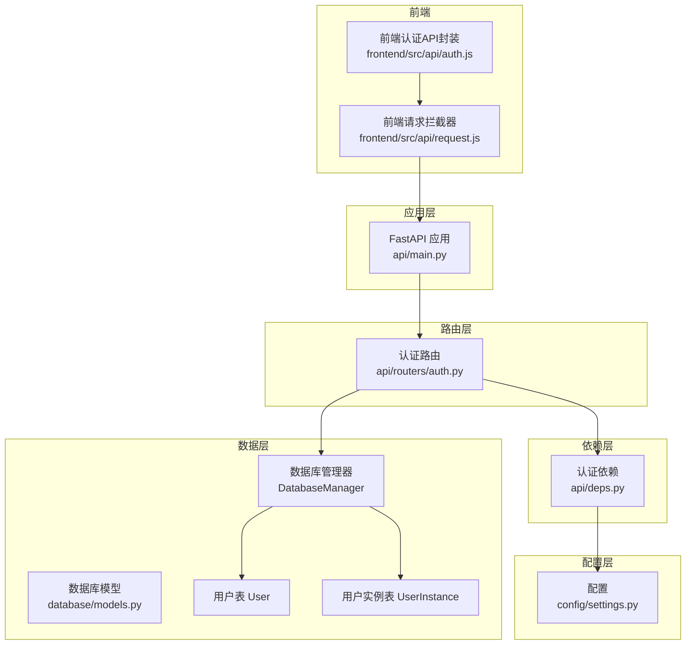
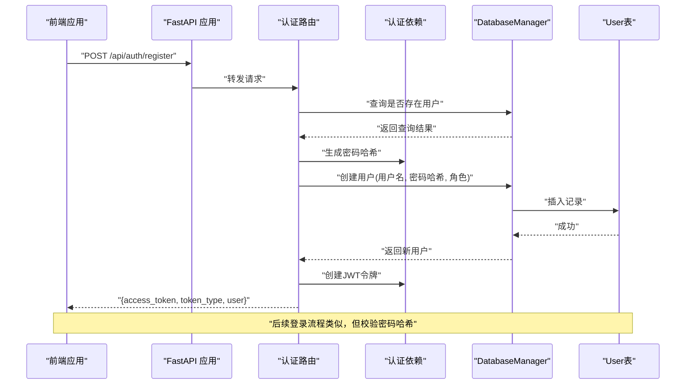
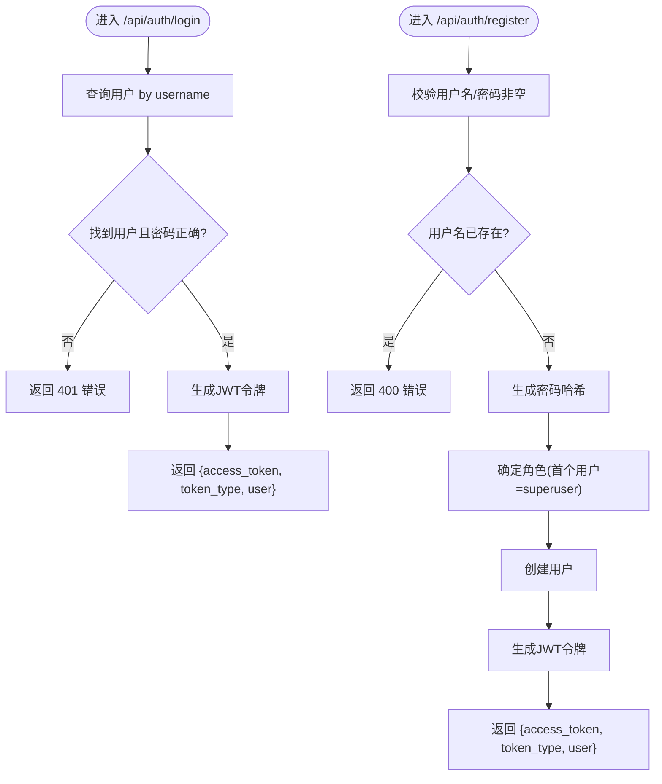
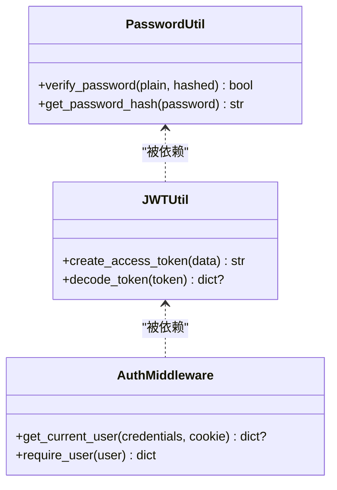
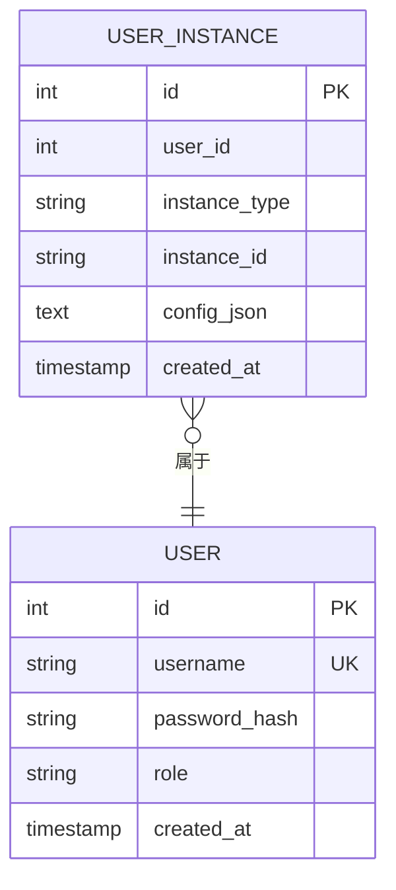
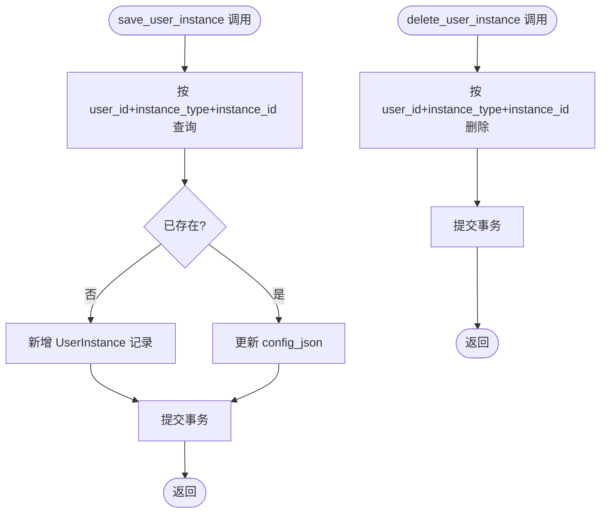
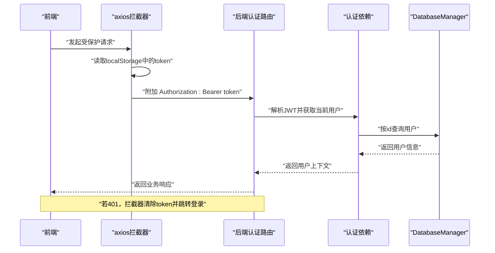
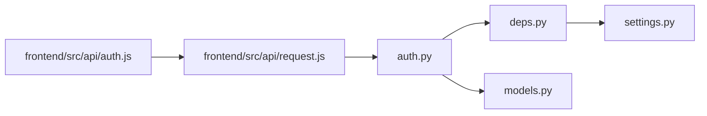

# 用户管理API

<cite>
**本文档引用的文件**
- [auth.py](file://backpack_quant_trading/api/routers/auth.py)
- [models.py](file://backpack_quant_trading/database/models.py)
- [deps.py](file://backpack_quant_trading/api/deps.py)
- [main.py](file://backpack_quant_trading/api/main.py)
- [settings.py](file://backpack_quant_trading/config/settings.py)
- [migrate_user_instances.py](file://backpack_quant_trading/database/migrate_user_instances.py)
- [auth.js](file://backpack_quant_trading/frontend/src/api/auth.js)
- [request.js](file://backpack_quant_trading/frontend/src/api/request.js)
</cite>

## 目录
1. [简介](#简介)
2. [项目结构](#项目结构)
3. [核心组件](#核心组件)
4. [架构总览](#架构总览)
5. [详细组件分析](#详细组件分析)
6. [依赖关系分析](#依赖关系分析)
7. [性能考量](#性能考量)
8. [故障排除指南](#故障排除指南)
9. [结论](#结论)
10. [附录](#附录)

## 简介
本文件面向用户管理API，聚焦以下能力与流程：
- 用户创建与注册：create_user（通过注册接口间接调用）
- 用户查询：get_user_by_username、get_user_by_id
- 密码哈希与校验：密码安全存储与验证
- 角色管理：user、superuser
- 权限控制：基于JWT的认证中间件与依赖注入
- 用户实例管理：save_user_instance、delete_user_instance
- 用户隔离策略：按用户维度隔离实盘/网格/币种监视等实例
- 用户认证流程与安全考虑：令牌生成、刷新、失效与前端集成
- 最佳实践与常见问题解决方案

## 项目结构
用户管理API位于FastAPI应用中，采用分层设计：
- 路由层：认证路由定义登录、注册、当前用户信息、登出
- 依赖层：认证与授权依赖（JWT解析、密码哈希、当前用户解析）
- 数据层：数据库模型与管理器（用户、用户实例、策略配置等）
- 应用入口：FastAPI应用注册路由并配置CORS与静态资源

**图表来源**
- [main.py:37-48](file://backpack_quant_trading/api/main.py#L37-L48)
- [auth.py:1-79](file://backpack_quant_trading/api/routers/auth.py#L1-L79)
- [deps.py:1-73](file://backpack_quant_trading/api/deps.py#L1-L73)
- [models.py:228-252](file://backpack_quant_trading/database/models.py#L228-L252)
- [settings.py:104-132](file://backpack_quant_trading/config/settings.py#L104-L132)
- [auth.js:1-6](file://backpack_quant_trading/frontend/src/api/auth.js#L1-L6)
- [request.js:1-33](file://backpack_quant_trading/frontend/src/api/request.js#L1-L33)

**章节来源**
- [main.py:37-48](file://backpack_quant_trading/api/main.py#L37-L48)
- [auth.py:1-79](file://backpack_quant_trading/api/routers/auth.py#L1-L79)
- [models.py:228-252](file://backpack_quant_trading/database/models.py#L228-L252)
- [deps.py:1-73](file://backpack_quant_trading/api/deps.py#L1-L73)
- [settings.py:104-132](file://backpack_quant_trading/config/settings.py#L104-L132)
- [auth.js:1-6](file://backpack_quant_trading/frontend/src/api/auth.js#L1-L6)
- [request.js:1-33](file://backpack_quant_trading/frontend/src/api/request.js#L1-L33)

## 核心组件
- 认证路由（/api/auth）
  - POST /login：用户名+密码登录，返回JWT令牌与用户信息
  - POST /register：注册新用户，自动分配角色（首个用户为superuser，其余为user），返回JWT令牌与用户信息
  - GET /me：获取当前登录用户信息（需认证）
  - POST /logout：登出（当前实现为空操作，可用于扩展）
- 依赖注入与认证
  - 密码哈希：generate_password_hash
  - 密码校验：check_password_hash
  - JWT生成与解码：HS256算法，7天有效期
  - 当前用户解析：从Bearer Token或Cookie提取payload，查询用户并返回基础信息
  - require_user：强制认证中间件，未登录返回401
- 数据库模型与管理器
  - User：用户表（username唯一、password_hash、role）
  - UserInstance：用户实例归属表（按user_id+instance_type+instance_id隔离）
  - DatabaseManager：提供用户查询、创建、用户实例保存/删除等方法
- 前端集成
  - axios拦截器自动携带Authorization头
  - 401时清理本地token并跳转登录页

**章节来源**
- [auth.py:33-78](file://backpack_quant_trading/api/routers/auth.py#L33-L78)
- [deps.py:20-73](file://backpack_quant_trading/api/deps.py#L20-L73)
- [models.py:228-252](file://backpack_quant_trading/database/models.py#L228-L252)
- [models.py:500-538](file://backpack_quant_trading/database/models.py#L500-L538)
- [models.py:540-683](file://backpack_quant_trading/database/models.py#L540-L683)
- [auth.js:1-6](file://backpack_quant_trading/frontend/src/api/auth.js#L1-L6)
- [request.js:9-30](file://backpack_quant_trading/frontend/src/api/request.js#L9-L30)

## 架构总览
用户管理API遵循“路由-依赖-数据层”的清晰分层，配合JWT实现无状态认证，并通过DatabaseManager统一访问数据库。

**图表来源**
- [auth.py:47-68](file://backpack_quant_trading/api/routers/auth.py#L47-L68)
- [deps.py:24-33](file://backpack_quant_trading/api/deps.py#L24-L33)
- [models.py:524-538](file://backpack_quant_trading/database/models.py#L524-L538)

**章节来源**
- [auth.py:47-68](file://backpack_quant_trading/api/routers/auth.py#L47-L68)
- [deps.py:24-33](file://backpack_quant_trading/api/deps.py#L24-L33)
- [models.py:524-538](file://backpack_quant_trading/database/models.py#L524-L538)

## 详细组件分析

### 认证路由与控制器
- 登录流程
  - 输入：用户名、密码
  - 处理：查询用户、校验密码哈希、签发JWT
  - 输出：access_token、token_type、user(id, username, role)
- 注册流程
  - 输入：用户名、密码
  - 处理：校验必填、检查用户名唯一、计算密码哈希、首次用户赋予superuser，其余user
  - 输出：access_token、token_type、user
- 当前用户
  - 依赖require_user，返回当前用户基础信息
- 登出
  - 当前为空操作，建议扩展为黑名单或服务端会话清理

**图表来源**
- [auth.py:33-44](file://backpack_quant_trading/api/routers/auth.py#L33-L44)
- [auth.py:47-68](file://backpack_quant_trading/api/routers/auth.py#L47-L68)

**章节来源**
- [auth.py:33-78](file://backpack_quant_trading/api/routers/auth.py#L33-L78)

### 依赖注入与认证机制
- 密码处理
  - 生成：Werkzeug generate_password_hash
  - 校验：Werkzeug check_password_hash
- JWT配置
  - 算法：HS256
  - 有效期：7天
  - 从环境变量读取密钥（开发默认值）
- 当前用户解析
  - 支持从Authorization Bearer或Cookie读取令牌
  - 解码payload获取user_id，查询User表并返回基础信息
- require_user中间件
  - 未登录返回401

**图表来源**
- [deps.py:20-42](file://backpack_quant_trading/api/deps.py#L20-L42)
- [deps.py:44-73](file://backpack_quant_trading/api/deps.py#L44-L73)

**章节来源**
- [deps.py:20-73](file://backpack_quant_trading/api/deps.py#L20-L73)
- [settings.py:12-14](file://backpack_quant_trading/config/settings.py#L12-L14)

### 数据模型与数据库管理器
- User表
  - 字段：id、username(唯一)、password_hash、role、created_at
  - 角色：user、superuser
- UserInstance表
  - 字段：id、user_id、instance_type、instance_id、config_json、created_at
  - 索引：(user_id, instance_type, instance_id)
  - 用途：按用户隔离实盘/网格/币种监视等实例
- DatabaseManager方法
  - 用户：get_user_by_username、get_user_by_id、create_user
  - 用户实例：save_user_instance、delete_user_instance、get_user_instance_ids、get_user_instance_configs
  - 全局配置：save_currency_monitor_config、save_minute_alert_config等（使用首个用户id作为键）

**图表来源**
- [models.py:228-252](file://backpack_quant_trading/database/models.py#L228-L252)

**章节来源**
- [models.py:228-252](file://backpack_quant_trading/database/models.py#L228-L252)
- [models.py:500-538](file://backpack_quant_trading/database/models.py#L500-L538)
- [models.py:540-683](file://backpack_quant_trading/database/models.py#L540-L683)

### 用户实例管理与隔离策略
- 保存用户实例
  - save_user_instance：按(user_id, instance_type, instance_id)去重，不存在则新增，存在则更新config_json
- 删除用户实例
  - delete_user_instance：按条件删除，常用于停止实例时清理
- 查询用户实例
  - get_user_instance_ids：返回某用户某类型的所有instance_id
  - get_user_instance_configs：返回(instance_id, config_json)列表
- 隔离策略
  - 实盘/网格/币种监视等实例均以user_id隔离，避免跨用户数据污染
  - 全局配置（如币种监视）通过首个用户id进行共享，兼容旧逻辑

**图表来源**
- [models.py:540-557](file://backpack_quant_trading/database/models.py#L540-L557)
- [models.py:671-683](file://backpack_quant_trading/database/models.py#L671-L683)

**章节来源**
- [models.py:540-557](file://backpack_quant_trading/database/models.py#L540-L557)
- [models.py:671-683](file://backpack_quant_trading/database/models.py#L671-L683)

### 前端集成与认证流程
- 请求拦截器
  - 自动从localStorage读取token并附加到Authorization头
  - 401时清除token并跳转登录页
- 认证API封装
  - login、register、getMe、logout对应后端路由

**图表来源**
- [request.js:9-30](file://backpack_quant_trading/frontend/src/api/request.js#L9-L30)
- [deps.py:44-66](file://backpack_quant_trading/api/deps.py#L44-L66)

**章节来源**
- [auth.js:1-6](file://backpack_quant_trading/frontend/src/api/auth.js#L1-L6)
- [request.js:9-30](file://backpack_quant_trading/frontend/src/api/request.js#L9-L30)
- [deps.py:44-66](file://backpack_quant_trading/api/deps.py#L44-L66)

## 依赖关系分析
- 路由依赖依赖层：认证路由依赖deps中的密码处理、JWT工具与当前用户解析
- 依赖层依赖配置层：JWT密钥来自环境变量（settings.py）
- 路由依赖数据层：认证路由通过DatabaseManager访问User/UserInstance
- 前端依赖后端：axios拦截器统一处理认证头与401处理

**图表来源**
- [auth.py:1-12](file://backpack_quant_trading/api/routers/auth.py#L1-L12)
- [deps.py:1-17](file://backpack_quant_trading/api/deps.py#L1-L17)
- [settings.py:12-14](file://backpack_quant_trading/config/settings.py#L12-L14)
- [auth.js:1-6](file://backpack_quant_trading/frontend/src/api/auth.js#L1-L6)
- [request.js:1-7](file://backpack_quant_trading/frontend/src/api/request.js#L1-L7)

**章节来源**
- [auth.py:1-12](file://backpack_quant_trading/api/routers/auth.py#L1-L12)
- [deps.py:1-17](file://backpack_quant_trading/api/deps.py#L1-L17)
- [settings.py:12-14](file://backpack_quant_trading/config/settings.py#L12-L14)
- [auth.js:1-6](file://backpack_quant_trading/frontend/src/api/auth.js#L1-L6)
- [request.js:1-7](file://backpack_quant_trading/frontend/src/api/request.js#L1-L7)

## 性能考量
- 会话与连接池
  - DatabaseManager使用scoped_session与连接池配置，减少连接开销
  - 建议在高并发场景下适当调整池大小与溢出配置
- 密码哈希成本
  - Werkzeug默认哈希成本适中，可根据服务器性能调优
- JWT负载
  - payload仅包含用户id，体积小，解析开销低
- 前端拦截器
  - 统一注入Authorization头，避免重复代码与遗漏

[本节为通用性能讨论，无需特定文件引用]

## 故障排除指南
- 401 未授权
  - 检查前端是否正确携带Authorization头或Cookie
  - 确认JWT未过期，secret_key正确
- 用户名已存在
  - 注册时出现400，确认用户名唯一性
- 密码错误
  - 登录时401，确认密码哈希匹配
- 用户实例保存失败
  - 检查(user_id, instance_type, instance_id)组合是否唯一
  - 确认config_json格式正确
- 表缺失
  - 如user_instances表不存在，执行迁移脚本创建

**章节来源**
- [auth.py:49-53](file://backpack_quant_trading/api/routers/auth.py#L49-L53)
- [auth.py:37-38](file://backpack_quant_trading/api/routers/auth.py#L37-L38)
- [migrate_user_instances.py:8-14](file://backpack_quant_trading/database/migrate_user_instances.py#L8-L14)

## 结论
用户管理API通过清晰的分层设计与JWT认证机制，提供了安全、可扩展的用户与实例管理能力。核心特性包括：
- 安全的密码哈希与校验
- 基于角色的权限控制
- 按用户隔离的实例管理
- 前后端一体化的认证流程

建议在生产环境中：
- 使用强secret_key并从环境变量注入
- 启用HTTPS与安全的Cookie属性
- 对注册/登录接口增加速率限制
- 定期审计用户与实例访问日志

[本节为总结性内容，无需特定文件引用]

## 附录

### API定义与行为摘要
- POST /api/auth/login
  - 请求体：用户名、密码
  - 成功：返回access_token、token_type、user
  - 失败：401
- POST /api/auth/register
  - 请求体：用户名、密码
  - 成功：返回access_token、token_type、user（角色自动分配）
  - 失败：400（用户名已存在或参数缺失）
- GET /api/auth/me
  - 成功：返回当前用户信息
  - 失败：401
- POST /api/auth/logout
  - 当前为空操作，建议扩展

**章节来源**
- [auth.py:33-78](file://backpack_quant_trading/api/routers/auth.py#L33-L78)

### 数据模型与方法参考
- User
  - 字段：id、username、password_hash、role、created_at
  - 方法：get_user_by_username、get_user_by_id、create_user
- UserInstance
  - 字段：id、user_id、instance_type、instance_id、config_json、created_at
  - 方法：save_user_instance、delete_user_instance、get_user_instance_ids、get_user_instance_configs
- DatabaseManager
  - 提供用户与实例管理的完整CRUD与查询接口

**章节来源**
- [models.py:228-252](file://backpack_quant_trading/database/models.py#L228-L252)
- [models.py:500-538](file://backpack_quant_trading/database/models.py#L500-L538)
- [models.py:540-683](file://backpack_quant_trading/database/models.py#L540-L683)

### 前端调用示例
- 登录：调用后端 /api/auth/login，保存返回的access_token
- 注册：调用后端 /api/auth/register，保存返回的access_token
- 获取当前用户：调用 /api/auth/me
- 登出：调用 /api/auth/logout（当前为空操作）

**章节来源**
- [auth.js:1-6](file://backpack_quant_trading/frontend/src/api/auth.js#L1-L6)
- [request.js:9-30](file://backpack_quant_trading/frontend/src/api/request.js#L9-L30)