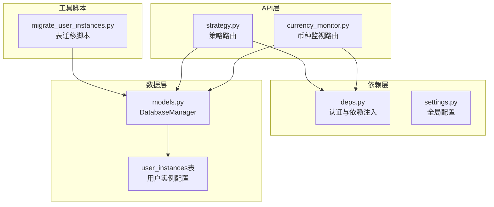
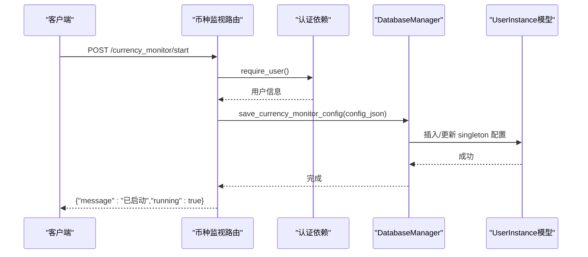
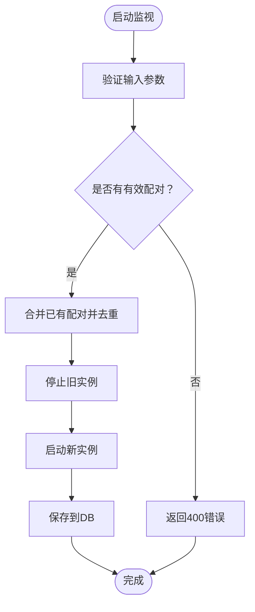
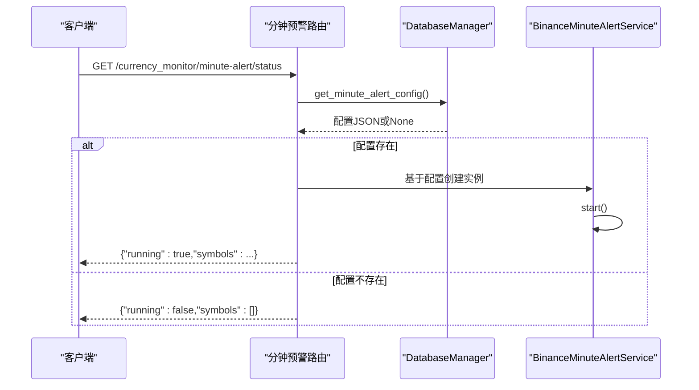
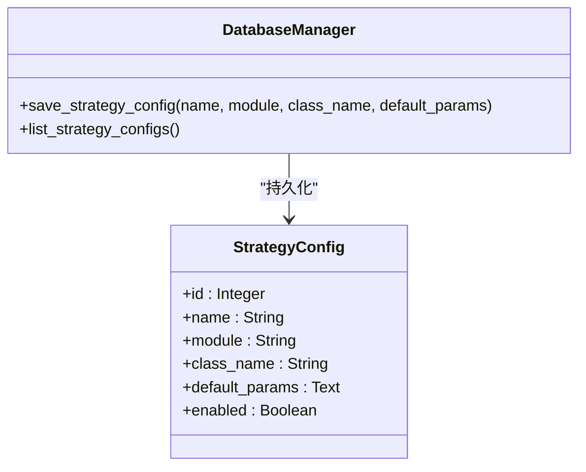
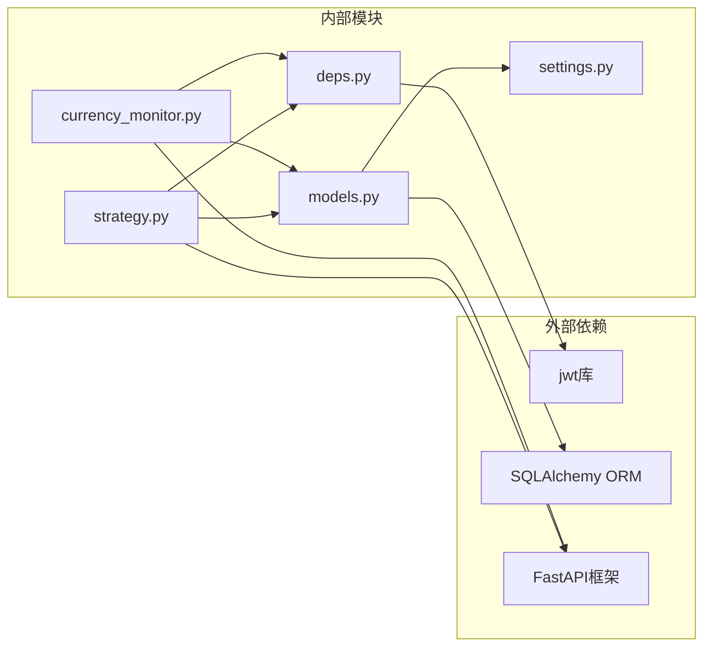

# 配置管理API

<cite>
**本文档引用的文件**
- [currency_monitor.py](file://backpack_quant_trading/api/routers/currency_monitor.py)
- [models.py](file://backpack_quant_trading/database/models.py)
- [settings.py](file://backpack_quant_trading/config/settings.py)
- [deps.py](file://backpack_quant_trading/api/deps.py)
- [migrate_user_instances.py](file://backpack_quant_trading/database/migrate_user_instances.py)
- [strategy.py](file://backpack_quant_trading/api/routers/strategy.py)
</cite>

## 目录
1. [简介](#简介)
2. [项目结构](#项目结构)
3. [核心组件](#核心组件)
4. [架构概览](#架构概览)
5. [详细组件分析](#详细组件分析)
6. [依赖分析](#依赖分析)
7. [性能考虑](#性能考虑)
8. [故障排除指南](#故障排除指南)
9. [结论](#结论)

## 简介
本文件为配置管理API的详细技术文档，重点覆盖以下配置管理方法：
- save_currency_monitor_config：保存币种监视全局配置
- get_currency_monitor_config：获取币种监视配置
- save_strategy_config：保存策略配置
- save_minute_alert_config：保存1分钟预警配置

文档内容涵盖配置数据存储格式、版本控制与继承关系、用户级配置与全局配置的区别、配置验证、热更新机制、配置迁移策略，以及最佳实践与故障排除指南。

## 项目结构
配置管理API位于FastAPI路由层，通过数据库模型进行持久化存储。整体结构如下：

**图表来源**
- [currency_monitor.py:1-243](file://backpack_quant_trading/api/routers/currency_monitor.py#L1-L243)
- [strategy.py:1-200](file://backpack_quant_trading/api/routers/strategy.py#L1-L200)
- [models.py:267-721](file://backpack_quant_trading/database/models.py#L267-L721)
- [settings.py:104-137](file://backpack_quant_trading/config/settings.py#L104-L137)
- [deps.py:1-73](file://backpack_quant_trading/api/deps.py#L1-L73)
- [migrate_user_instances.py:1-15](file://backpack_quant_trading/database/migrate_user_instances.py#L1-L15)

**章节来源**
- [currency_monitor.py:1-243](file://backpack_quant_trading/api/routers/currency_monitor.py#L1-L243)
- [strategy.py:1-200](file://backpack_quant_trading/api/routers/strategy.py#L1-L200)
- [models.py:267-721](file://backpack_quant_trading/database/models.py#L267-L721)
- [settings.py:104-137](file://backpack_quant_trading/config/settings.py#L104-L137)
- [deps.py:1-73](file://backpack_quant_trading/api/deps.py#L1-L73)
- [migrate_user_instances.py:1-15](file://backpack_quant_trading/database/migrate_user_instances.py#L1-L15)

## 核心组件
本节概述配置管理API的关键组件及其职责：
- FastAPI路由：提供REST接口，处理请求与响应
- 认证依赖：基于JWT与Cookie的用户身份验证
- 数据库管理器：封装数据库操作，提供配置持久化能力
- 配置模型：定义配置存储结构与迁移脚本

关键实现路径：
- 币种监视配置API：[currency_monitor.py:56-137](file://backpack_quant_trading/api/routers/currency_monitor.py#L56-L137)
- 策略配置API：[strategy.py:685-717](file://backpack_quant_trading/api/routers/strategy.py#L685-L717)
- 数据库管理器：[models.py:267-721](file://backpack_quant_trading/database/models.py#L267-L721)
- 认证与依赖：[deps.py:44-73](file://backpack_quant_trading/api/deps.py#L44-L73)
- 全局配置：[settings.py:104-137](file://backpack_quant_trading/config/settings.py#L104-L137)

**章节来源**
- [currency_monitor.py:56-137](file://backpack_quant_trading/api/routers/currency_monitor.py#L56-L137)
- [strategy.py:685-717](file://backpack_quant_trading/api/routers/strategy.py#L685-L717)
- [models.py:267-721](file://backpack_quant_trading/database/models.py#L267-L721)
- [deps.py:44-73](file://backpack_quant_trading/api/deps.py#L44-L73)
- [settings.py:104-137](file://backpack_quant_trading/config/settings.py#L104-L137)

## 架构概览
配置管理API采用分层架构，路由层负责HTTP请求处理，依赖层提供认证与配置，数据层通过ORM模型持久化配置。

**图表来源**
- [currency_monitor.py:89-125](file://backpack_quant_trading/api/routers/currency_monitor.py#L89-L125)
- [deps.py:69-73](file://backpack_quant_trading/api/deps.py#L69-L73)
- [models.py:608-618](file://backpack_quant_trading/database/models.py#L608-L618)

## 详细组件分析

### 币种监视配置API
币种监视配置采用全局共享模式，不按用户隔离，使用singleton实例ID进行存储与恢复。

- 接口定义
  - 启动监视：POST /currency_monitor/start
  - 停止监视：POST /currency_monitor/stop
  - 获取状态：GET /currency_monitor/status
  - 移除监视对：POST /currency_monitor/remove-pair

- 存储格式
  - JSON对象，包含监视对列表pairs及可选参数
  - pairs元素为(symbol, timeframe)二元组

- 验证逻辑
  - 必须提供有效的symbols与timeframes
  - 支持合并已有配对，去重处理
  - 停止时清除DB配置与恢复标记

- 热更新机制
  - 服务启动后自动从DB恢复配置
  - 用户主动停止后不再从缓存恢复，避免刷新导致的异常重启

- 关键实现路径
  - 启动逻辑：[currency_monitor.py:89-125](file://backpack_quant_trading/api/routers/currency_monitor.py#L89-L125)
  - 停止逻辑：[currency_monitor.py:128-137](file://backpack_quant_trading/api/routers/currency_monitor.py#L128-L137)
  - 状态查询：[currency_monitor.py:56-86](file://backpack_quant_trading/api/routers/currency_monitor.py#L56-L86)
  - 配对移除：[currency_monitor.py:140-154](file://backpack_quant_trading/api/routers/currency_monitor.py#L140-L154)

**图表来源**
- [currency_monitor.py:89-125](file://backpack_quant_trading/api/routers/currency_monitor.py#L89-L125)

**章节来源**
- [currency_monitor.py:56-154](file://backpack_quant_trading/api/routers/currency_monitor.py#L56-L154)

### 1分钟预警配置API
1分钟预警配置同样采用全局共享模式，支持独立的状态查询与启动/停止控制。

- 接口定义
  - 启动预警：POST /currency_monitor/minute-alert/start
  - 停止预警：POST /currency_monitor/minute-alert/stop
  - 获取状态：GET /currency_monitor/minute-alert/status

- 存储格式
  - JSON对象，包含symbols列表与预警阈值参数
  - 参数包括interval、vol_pct_threshold、volume_mult_threshold、ob_notional_threshold、ob_distance_pct、depth_levels、cooldown_sec

- 验证逻辑
  - 必须提供有效的symbols列表
  - 参数具有默认值，支持部分参数覆盖

- 热更新机制
  - 服务启动后自动从DB恢复配置
  - 状态查询时支持从DB恢复并启动

- 关键实现路径
  - 状态查询：[currency_monitor.py:158-199](file://backpack_quant_trading/api/routers/currency_monitor.py#L158-L199)
  - 启动逻辑：[currency_monitor.py:202-232](file://backpack_quant_trading/api/routers/currency_monitor.py#L202-L232)
  - 停止逻辑：[currency_monitor.py:235-242](file://backpack_quant_trading/api/routers/currency_monitor.py#L235-L242)

**图表来源**
- [currency_monitor.py:158-199](file://backpack_quant_trading/api/routers/currency_monitor.py#L158-L199)
- [models.py:639-655](file://backpack_quant_trading/database/models.py#L639-L655)

**章节来源**
- [currency_monitor.py:158-242](file://backpack_quant_trading/api/routers/currency_monitor.py#L158-L242)

### 策略配置API
策略配置API提供策略元数据与默认参数的保存与查询能力。

- 接口定义
  - 保存策略配置：POST /strategy/save_strategy_config
  - 获取策略配置：GET /strategy/list_strategy_configs

- 存储格式
  - JSON字符串形式的默认参数
  - 包含策略名称、模块、类名、默认参数、启用状态

- 验证逻辑
  - 策略名称唯一性约束
  - 支持更新现有策略配置

- 关键实现路径
  - 保存策略配置：[strategy.py:693-717](file://backpack_quant_trading/api/routers/strategy.py#L693-L717)
  - 获取策略配置：[strategy.py:685-691](file://backpack_quant_trading/api/routers/strategy.py#L685-L691)

**图表来源**
- [strategy.py:685-717](file://backpack_quant_trading/api/routers/strategy.py#L685-L717)
- [models.py:254-264](file://backpack_quant_trading/database/models.py#L254-L264)

**章节来源**
- [strategy.py:685-717](file://backpack_quant_trading/api/routers/strategy.py#L685-L717)

### 用户级配置与全局配置
系统同时支持用户级配置与全局配置两种模式：

- 用户级配置
  - 存储在user_instances表中，按user_id隔离
  - 实例类型包括live、grid、currency_monitor
  - 适用于需要按用户隔离的配置场景

- 全局配置
  - 使用singleton实例ID进行存储
  - 适用于币种监视与1分钟预警等全局共享场景
  - 通过第一个用户ID作为存储键

- 关键实现路径
  - 用户级配置保存：[models.py:615-618](file://backpack_quant_trading/database/models.py#L615-L618)
  - 全局配置保存：[models.py:608-614](file://backpack_quant_trading/database/models.py#L608-L614)
  - 用户级配置删除：[models.py:634-636](file://backpack_quant_trading/database/models.py#L634-L636)
  - 全局配置删除：[models.py:620-629](file://backpack_quant_trading/database/models.py#L620-L629)

**章节来源**
- [models.py:586-636](file://backpack_quant_trading/database/models.py#L586-L636)

## 依赖分析
配置管理API的依赖关系清晰，遵循分层架构原则：

**图表来源**
- [currency_monitor.py:1-243](file://backpack_quant_trading/api/routers/currency_monitor.py#L1-L243)
- [strategy.py:1-200](file://backpack_quant_trading/api/routers/strategy.py#L1-L200)
- [deps.py:1-73](file://backpack_quant_trading/api/deps.py#L1-L73)
- [models.py:1-721](file://backpack_quant_trading/database/models.py#L1-L721)
- [settings.py:1-137](file://backpack_quant_trading/config/settings.py#L1-L137)

**章节来源**
- [currency_monitor.py:1-243](file://backpack_quant_trading/api/routers/currency_monitor.py#L1-L243)
- [strategy.py:1-200](file://backpack_quant_trading/api/routers/strategy.py#L1-L200)
- [deps.py:1-73](file://backpack_quant_trading/api/deps.py#L1-L73)
- [models.py:1-721](file://backpack_quant_trading/database/models.py#L1-L721)
- [settings.py:1-137](file://backpack_quant_trading/config/settings.py#L1-L137)

## 性能考虑
- 数据库连接池：使用预配置的连接池参数，避免频繁创建连接
- 查询优化：针对用户实例配置使用复合索引，提升查询效率
- 缓存策略：全局配置在内存中有实例缓存，减少DB访问频率
- 并发安全：数据库操作使用事务保证一致性

## 故障排除指南
常见问题与解决方案：

- 配置无法恢复
  - 检查DB中是否存在singleton配置记录
  - 确认用户ID是否正确映射到第一个用户
  - 查看服务启动日志中的异常信息

- 权限不足
  - 确保请求携带有效的JWT令牌或Cookie
  - 检查用户角色是否具备相应权限

- 数据库连接失败
  - 验证数据库连接URL配置
  - 检查网络连通性和防火墙设置

- 配置冲突
  - 检查是否存在重复的实例ID
  - 清理无效的配置记录后重新保存

**章节来源**
- [deps.py:44-73](file://backpack_quant_trading/api/deps.py#L44-L73)
- [models.py:267-287](file://backpack_quant_trading/database/models.py#L267-L287)

## 结论
配置管理API提供了完整的配置生命周期管理能力，包括保存、查询、验证、热更新与迁移。通过用户级与全局级配置的分离，满足了不同场景下的配置需求。建议在生产环境中结合监控与备份策略，确保配置数据的安全性与可用性。