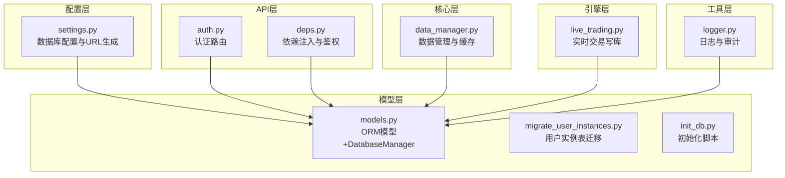
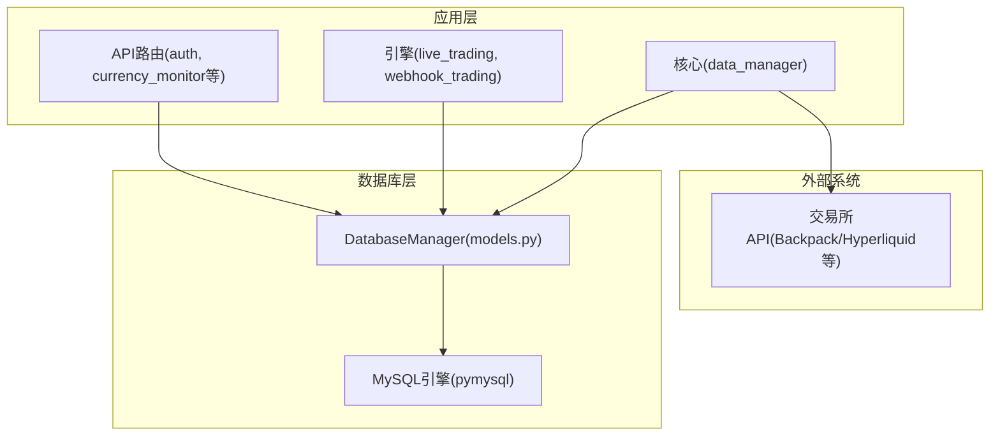
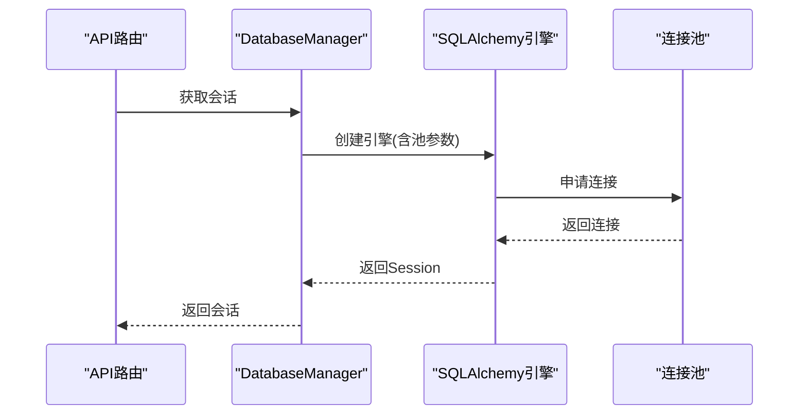
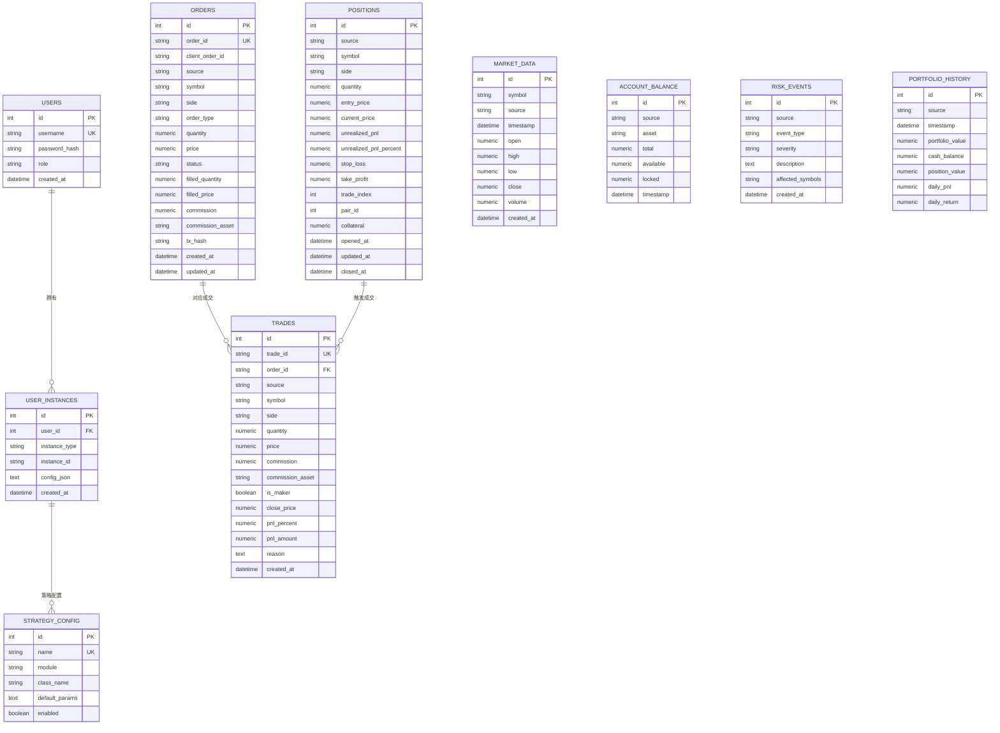
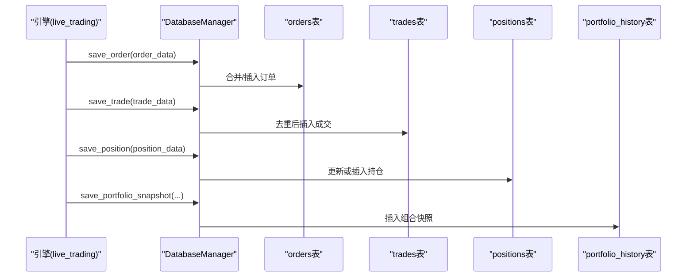
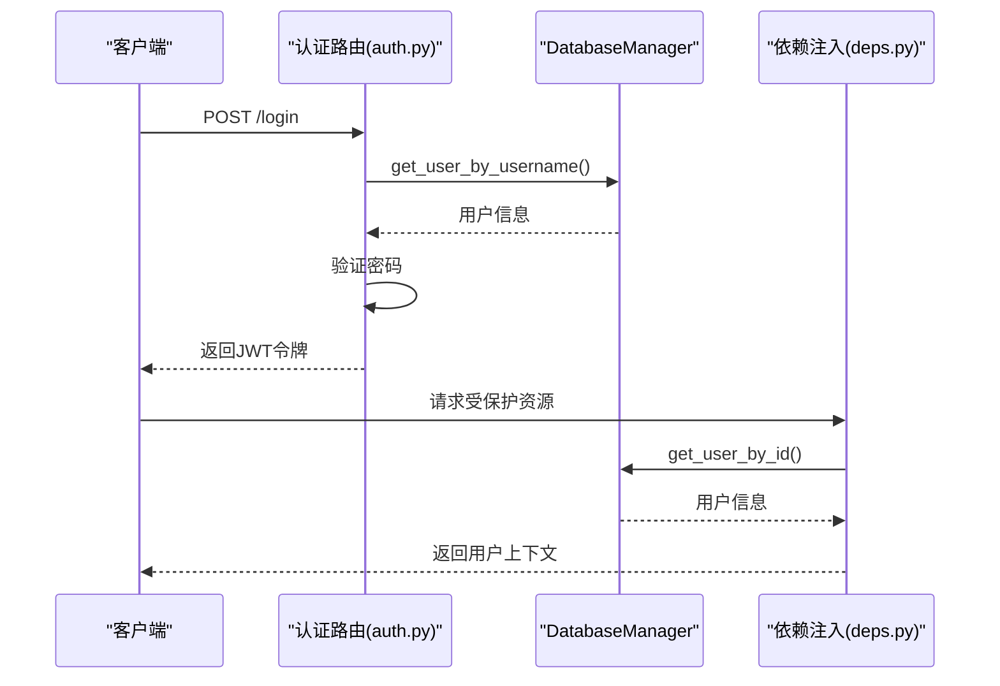
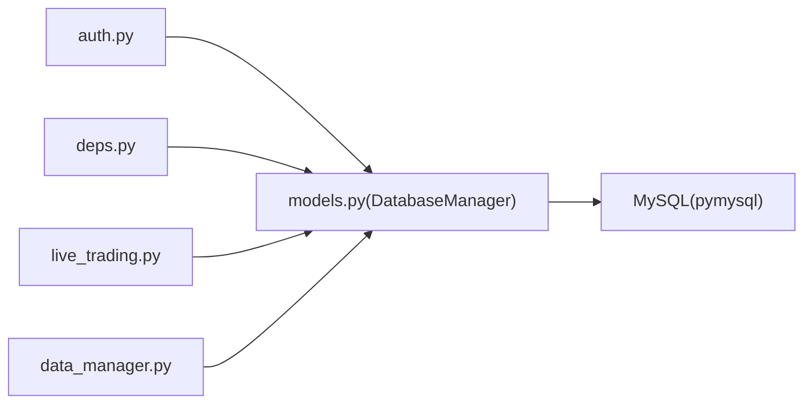

# 数据库架构设计

<cite>
**本文档引用的文件**
- [models.py](file://backpack_quant_trading/database/models.py)
- [settings.py](file://backpack_quant_trading/config/settings.py)
- [migrate_user_instances.py](file://backpack_quant_trading/database/migrate_user_instances.py)
- [init_db.py](file://init_db.py)
- [auth.py](file://backpack_quant_trading/api/routers/auth.py)
- [deps.py](file://backpack_quant_trading/api/deps.py)
- [data_manager.py](file://backpack_quant_trading/core/data_manager.py)
- [live_trading.py](file://backpack_quant_trading/engine/live_trading.py)
- [logger.py](file://backpack_quant_trading/utils/logger.py)
</cite>

## 目录
1. [简介](#简介)
2. [项目结构](#项目结构)
3. [核心组件](#核心组件)
4. [架构总览](#架构总览)
5. [详细组件分析](#详细组件分析)
6. [依赖关系分析](#依赖关系分析)
7. [性能考虑](#性能考虑)
8. [故障排除指南](#故障排除指南)
9. [结论](#结论)
10. [附录](#附录)

## 简介
本文件面向数据库架构设计，基于量化交易系统的实际代码实现，系统性阐述数据库整体设计模式、表间关系与数据流，记录连接配置与连接池参数，解释数据分区策略、备份恢复与高可用设计思路，并提供部署拓扑、监控告警与安全策略建议，以及迁移与版本升级指南。

## 项目结构
数据库相关代码主要分布在以下模块：
- 配置层：数据库连接参数与URL生成
- 模型层：ORM模型定义与数据库管理器
- API层：认证与权限控制
- 引擎层：实时交易与数据写入
- 核心层：数据管理与缓存
- 工具层：日志与审计

**图表来源**
- [settings.py:44-130](file://backpack_quant_trading/config/settings.py#L44-L130)
- [models.py:267-720](file://backpack_quant_trading/database/models.py#L267-L720)
- [auth.py:33-78](file://backpack_quant_trading/api/routers/auth.py#L33-L78)
- [deps.py:44-72](file://backpack_quant_trading/api/deps.py#L44-L72)
- [data_manager.py:18-518](file://backpack_quant_trading/core/data_manager.py#L18-L518)
- [live_trading.py:1069-2206](file://backpack_quant_trading/engine/live_trading.py#L1069-L2206)
- [logger.py:1-180](file://backpack_quant_trading/utils/logger.py#L1-L180)

**章节来源**
- [settings.py:1-137](file://backpack_quant_trading/config/settings.py#L1-L137)
- [models.py:1-721](file://backpack_quant_trading/database/models.py#L1-L721)

## 核心组件
- 数据库配置与连接
  - 数据库连接URL由配置模块统一生成，包含主机、端口、用户名、密码与数据库名。
  - 连接池参数通过配置对象传递给SQLAlchemy引擎：池大小与溢出数。
- ORM模型与表设计
  - 市场数据、订单、成交、持仓、账户余额、策略性能、风险事件、组合净值、用户、用户实例、策略配置等。
  - 每张表均设置合适的索引以优化查询性能。
- 数据库管理器
  - 封装引擎创建、会话管理、表创建/删除、数据写入与查询方法。
  - 提供批量写入与幂等写入（去重）能力，保证数据一致性。

**章节来源**
- [settings.py:44-130](file://backpack_quant_trading/config/settings.py#L44-L130)
- [models.py:45-264](file://backpack_quant_trading/database/models.py#L45-L264)
- [models.py:267-720](file://backpack_quant_trading/database/models.py#L267-L720)

## 架构总览
数据库层采用“配置驱动 + ORM模型 + 管理器封装”的三层架构，围绕交易数据生命周期（市场数据采集、订单/成交/持仓写库、风险事件记录、组合净值快照）构建。

**图表来源**
- [auth.py:33-78](file://backpack_quant_trading/api/routers/auth.py#L33-L78)
- [live_trading.py:1069-2206](file://backpack_quant_trading/engine/live_trading.py#L1069-L2206)
- [data_manager.py:114-167](file://backpack_quant_trading/core/data_manager.py#L114-L167)
- [models.py:267-287](file://backpack_quant_trading/database/models.py#L267-L287)

## 详细组件分析

### 数据库连接与连接池
- 连接URL
  - 由配置模块拼接，包含用户名、密码、主机、端口与数据库名。
- 连接池参数
  - 池大小与最大溢出数来自配置对象，开启pre_ping以自动检测失效连接。
- 会话管理
  - 使用scoped_session确保线程安全；每个操作独立获取/关闭会话。

**图表来源**
- [settings.py:124-130](file://backpack_quant_trading/config/settings.py#L124-L130)
- [models.py:270-279](file://backpack_quant_trading/database/models.py#L270-L279)

**章节来源**
- [settings.py:44-53](file://backpack_quant_trading/config/settings.py#L44-L53)
- [models.py:270-279](file://backpack_quant_trading/database/models.py#L270-L279)

### 表结构与关系
- 实体关系
  - 用户与用户实例：一对多，用于按用户隔离实盘/网格/币种监视配置。
  - 订单/成交/持仓：一对一或一对多，分别记录交易执行与头寸状态。
  - 市场数据：按symbol+timestamp+source建立唯一性约束，避免重复写入。
  - 风险事件与组合净值：记录风控与收益归因数据。
- 索引设计
  - 关键查询字段建立复合索引，如symbol/status/source、timestamp等，提升查询效率。

**图表来源**
- [models.py:45-264](file://backpack_quant_trading/database/models.py#L45-L264)

**章节来源**
- [models.py:45-264](file://backpack_quant_trading/database/models.py#L45-L264)

### 数据流与写入流程
- 实时交易数据写入
  - 引擎在订单成交/持仓变化/组合快照时调用数据库管理器写库。
  - 写入前进行数据清洗与长度截断，避免超长字段导致插入失败。
- 历史数据写入
  - 数据管理器负责从交易所API拉取K线并批量写入市场数据表。
- 幂等与去重
  - 成交表按trade_id去重，避免重复插入；订单表对过长字段进行截断。

**图表来源**
- [live_trading.py:1069-2206](file://backpack_quant_trading/engine/live_trading.py#L1069-L2206)
- [models.py:316-496](file://backpack_quant_trading/database/models.py#L316-L496)

**章节来源**
- [live_trading.py:1069-2206](file://backpack_quant_trading/engine/live_trading.py#L1069-L2206)
- [models.py:293-496](file://backpack_quant_trading/database/models.py#L293-L496)

### 认证与权限控制
- 用户模型与角色
  - 用户表包含用户名、密码哈希与角色字段，支持普通用户与超级用户。
- 登录注册流程
  - 注册时根据是否存在用户决定角色；登录时验证密码并签发JWT令牌。
- 依赖注入
  - 通过依赖函数解析Bearer Token或Cookie，获取当前用户上下文。

**图表来源**
- [auth.py:33-78](file://backpack_quant_trading/api/routers/auth.py#L33-L78)
- [deps.py:44-72](file://backpack_quant_trading/api/deps.py#L44-L72)
- [models.py:500-538](file://backpack_quant_trading/database/models.py#L500-L538)

**章节来源**
- [auth.py:17-78](file://backpack_quant_trading/api/routers/auth.py#L17-L78)
- [deps.py:28-72](file://backpack_quant_trading/api/deps.py#L28-L72)
- [models.py:228-237](file://backpack_quant_trading/database/models.py#L228-L237)

### 数据分区策略
- 当前实现
  - 未见显式的分表/分区实现，但通过source字段区分数据来源，结合symbol与timestamp建立复合索引，具备一定查询优化基础。
- 建议
  - 按时间维度（如月/季度）进行分表，结合symbol进行二级分区，降低单表数据量。
  - 对高频写入的orders/trades表可考虑按时间分桶，定期归档历史数据。

**章节来源**
- [models.py:50-62](file://backpack_quant_trading/database/models.py#L50-L62)
- [models.py:87-90](file://backpack_quant_trading/database/models.py#L87-L90)

### 备份恢复与高可用
- 备份
  - 建议使用逻辑备份（mysqldump）与物理备份（xtrabackup/LVM快照）相结合。
  - 定期全备+增量备份，保留至少7天的恢复点。
- 恢复
  - 制定恢复演练计划，验证备份完整性与恢复时间目标（RTO/RPO）。
- 高可用
  - 主从复制或Galera集群，配合健康检查与自动故障转移。
  - 应用侧通过连接池的pre_ping与重试机制提升容错。

**章节来源**
- [settings.py:44-53](file://backpack_quant_trading/config/settings.py#L44-L53)
- [models.py:270-279](file://backpack_quant_trading/database/models.py#L270-L279)

### 部署拓扑与监控告警
- 部署拓扑
  - 单机MySQL（开发/测试）或主从/集群（生产）。
  - 应用服务与数据库在同一内网或跨可用区部署，降低延迟。
- 监控
  - 关键指标：连接数、QPS/TPS、慢查询、锁等待、磁盘IO、缓冲池命中率。
  - 告警阈值：连接数接近上限、慢查询占比超阈、锁等待超时、磁盘空间不足。
- 日志与审计
  - 交易日志与错误日志分离，按大小轮转；记录关键业务事件（订单、成交、风险事件）。

**章节来源**
- [logger.py:57-125](file://backpack_quant_trading/utils/logger.py#L57-L125)

### 数据安全策略、访问控制与审计
- 密码与密钥
  - 数据库密码通过环境变量注入，避免硬编码；敏感配置（API Key、私钥）不存储在数据库中。
- 访问控制
  - 不同用户实例隔离，使用用户ID与实例类型联合索引保障数据边界。
- 审计
  - 记录风险事件与关键操作，便于事后追溯。

**章节来源**
- [settings.py:7-9](file://backpack_quant_trading/config/settings.py#L7-L9)
- [models.py:239-251](file://backpack_quant_trading/database/models.py#L239-L251)
- [models.py:192-207](file://backpack_quant_trading/database/models.py#L192-L207)

### 迁移与版本升级
- 表结构变更
  - 使用迁移脚本创建新表或更新现有表，避免破坏现有数据。
- 初始化脚本
  - 初始化时可选择删除特定表（如用户表）以便重建，确保字段长度与约束正确。
- 版本管理
  - 建议引入数据库迁移框架（如Alembic），记录版本号与变更集，确保多环境一致性。

**章节来源**
- [migrate_user_instances.py:1-15](file://backpack_quant_trading/database/migrate_user_instances.py#L1-L15)
- [init_db.py:9-24](file://init_db.py#L9-L24)

## 依赖关系分析
- 组件耦合
  - API路由依赖数据库管理器；引擎在运行时写库；数据管理器负责历史数据拉取与缓存。
- 外部依赖
  - MySQL驱动（pymysql）、SQLAlchemy ORM、FastAPI依赖注入。
- 循环依赖
  - 未发现循环导入；各模块职责清晰。

**图表来源**
- [auth.py:5-12](file://backpack_quant_trading/api/routers/auth.py#L5-L12)
- [deps.py:9-11](file://backpack_quant_trading/api/deps.py#L9-L11)
- [live_trading.py:14-18](file://backpack_quant_trading/engine/live_trading.py#L14-L18)
- [data_manager.py:10-13](file://backpack_quant_trading/core/data_manager.py#L10-L13)
- [models.py:267-287](file://backpack_quant_trading/database/models.py#L267-L287)

**章节来源**
- [auth.py:1-14](file://backpack_quant_trading/api/routers/auth.py#L1-L14)
- [deps.py:1-17](file://backpack_quant_trading/api/deps.py#L1-L17)
- [live_trading.py:1-20](file://backpack_quant_trading/engine/live_trading.py#L1-L20)
- [data_manager.py:1-15](file://backpack_quant_trading/core/data_manager.py#L1-L15)
- [models.py:1-11](file://backpack_quant_trading/database/models.py#L1-L11)

## 性能考虑
- 连接池参数
  - 池大小与溢出数需结合并发与硬件资源调整；开启pre_ping提升连接稳定性。
- 查询优化
  - 为高频查询字段建立复合索引；避免SELECT *，精确列名。
- 写入优化
  - 批量写入市场数据；对重复数据进行去重；对超长字段进行截断。
- 缓存策略
  - 内存级缓存（DataFrame）与文件缓存（CSV）结合，减少重复IO。

**章节来源**
- [settings.py:51-52](file://backpack_quant_trading/config/settings.py#L51-L52)
- [models.py:293-314](file://backpack_quant_trading/database/models.py#L293-L314)
- [models.py:350-387](file://backpack_quant_trading/database/models.py#L350-L387)
- [data_manager.py:24-30](file://backpack_quant_trading/core/data_manager.py#L24-L30)
- [data_manager.py:284-300](file://backpack_quant_trading/core/data_manager.py#L284-L300)

## 故障排除指南
- 连接失败
  - 检查数据库URL、凭据与网络连通性；确认池参数合理。
- 写入异常
  - 关注超长字段与重复主键；使用去重逻辑与异常捕获。
- 性能问题
  - 分析慢查询日志；评估索引使用情况；必要时增加索引或拆分表。
- 日志审计
  - 通过交易日志与错误日志定位问题；关注风险事件记录。

**章节来源**
- [models.py:316-348](file://backpack_quant_trading/database/models.py#L316-L348)
- [models.py:350-387](file://backpack_quant_trading/database/models.py#L350-L387)
- [logger.py:137-180](file://backpack_quant_trading/utils/logger.py#L137-L180)

## 结论
本数据库架构以配置驱动与ORM模型为核心，围绕交易数据生命周期提供完整的写入与查询能力。通过合理的索引设计、连接池参数与幂等写入策略，满足高频交易场景下的性能与可靠性需求。建议在生产环境中完善分区、备份与高可用方案，并引入标准化的数据库迁移流程。

## 附录
- 环境变量与配置项
  - 数据库主机、端口、用户名、密码、数据库名、连接池大小与溢出数。
- 常用操作
  - 初始化数据库表、创建用户实例表、保存用户配置与策略配置。

**章节来源**
- [settings.py:44-53](file://backpack_quant_trading/config/settings.py#L44-L53)
- [migrate_user_instances.py:1-15](file://backpack_quant_trading/database/migrate_user_instances.py#L1-L15)
- [models.py:685-717](file://backpack_quant_trading/database/models.py#L685-L717)