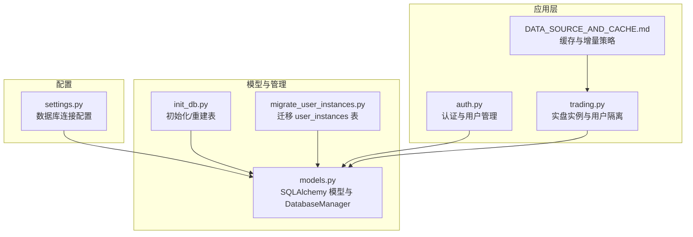
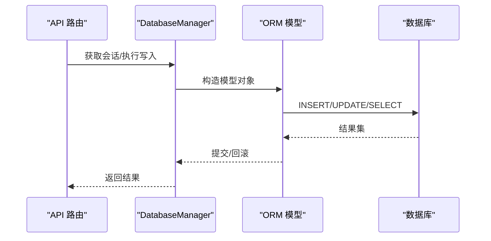
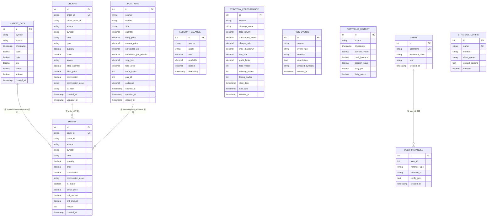
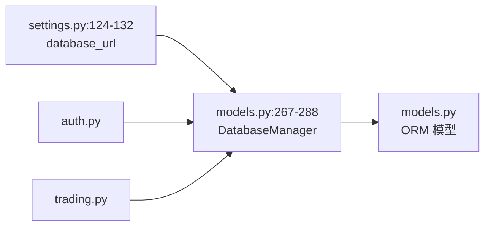

# 数据库设计

<cite>
**本文引用的文件**
- [models.py](file://backpack_quant_trading/database/models.py)
- [settings.py](file://backpack_quant_trading/config/settings.py)
- [init_db.py](file://init_db.py)
- [migrate_user_instances.py](file://backpack_quant_trading/database/migrate_user_instances.py)
- [DATA_SOURCE_AND_CACHE.md](file://backpack_quant_trading/docs/DATA_SOURCE_AND_CACHE.md)
- [auth.py](file://backpack_quant_trading/api/routers/auth.py)
- [trading.py](file://backpack_quant_trading/api/routers/trading.py)
</cite>

## 目录
1. [简介](#简介)
2. [项目结构](#项目结构)
3. [核心组件](#核心组件)
4. [架构总览](#架构总览)
5. [详细组件分析](#详细组件分析)
6. [依赖分析](#依赖分析)
7. [性能考量](#性能考量)
8. [故障排查指南](#故障排查指南)
9. [结论](#结论)
10. [附录](#附录)

## 简介
本文件面向数据库设计与实现，围绕量化交易系统的数据模型进行系统性梳理，涵盖实体关系、字段定义与数据类型、主键/外键与索引、约束与校验、数据访问模式、缓存策略与性能、数据生命周期与迁移、以及安全与访问控制。内容以仓库中的数据库模型文件为核心，并结合配置、初始化脚本与API路由中的数据交互点进行说明。

## 项目结构
数据库相关的核心文件与职责如下：
- 数据模型与管理器：backpack_quant_trading/database/models.py
- 数据库配置：backpack_quant_trading/config/settings.py
- 初始化与迁移：init_db.py、backpack_quant_trading/database/migrate_user_instances.py
- 数据访问与缓存策略说明：backpack_quant_trading/docs/DATA_SOURCE_AND_CACHE.md
- 认证与访问控制：backpack_quant_trading/api/routers/auth.py
- 实盘交易与实例管理：backpack_quant_trading/api/routers/trading.py

图表来源
- [settings.py:124-132](file://backpack_quant_trading/config/settings.py#L124-L132)
- [models.py:267-288](file://backpack_quant_trading/database/models.py#L267-L288)
- [init_db.py:9-24](file://init_db.py#L9-L24)
- [migrate_user_instances.py:8-14](file://backpack_quant_trading/database/migrate_user_instances.py#L8-L14)
- [auth.py:33-78](file://backpack_quant_trading/api/routers/auth.py#L33-L78)
- [trading.py:105-200](file://backpack_quant_trading/api/routers/trading.py#L105-L200)
- [DATA_SOURCE_AND_CACHE.md:22-71](file://backpack_quant_trading/docs/DATA_SOURCE_AND_CACHE.md#L22-L71)

章节来源
- [settings.py:124-132](file://backpack_quant_trading/config/settings.py#L124-L132)
- [models.py:267-288](file://backpack_quant_trading/database/models.py#L267-L288)
- [init_db.py:9-24](file://init_db.py#L9-L24)
- [migrate_user_instances.py:8-14](file://backpack_quant_trading/database/migrate_user_instances.py#L8-L14)
- [auth.py:33-78](file://backpack_quant_trading/api/routers/auth.py#L33-L78)
- [trading.py:105-200](file://backpack_quant_trading/api/routers/trading.py#L105-L200)
- [DATA_SOURCE_AND_CACHE.md:22-71](file://backpack_quant_trading/docs/DATA_SOURCE_AND_CACHE.md#L22-L71)

## 核心组件
本系统采用 SQLAlchemy 声明式映射，统一通过 DatabaseManager 提供连接池、会话与数据持久化能力。核心实体包括：
- 市场数据：记录 OHLCV 与来源标记
- 订单：记录委托下单、填充与手续费
- 成交：记录每笔成交明细与回测扩展字段
- 持仓：记录开仓、当前价、未实现盈亏与止损止盈
- 账户余额：记录资产总额、可用与冻结
- 策略性能：记录策略统计指标
- 风险事件：记录风控事件与严重等级
- 组合净值：记录每日净值快照
- 用户与用户实例：用户认证与实盘/网格/币种监视的实例隔离

章节来源
- [models.py:45-225](file://backpack_quant_trading/database/models.py#L45-L225)
- [models.py:228-252](file://backpack_quant_trading/database/models.py#L228-L252)
- [models.py:254-265](file://backpack_quant_trading/database/models.py#L254-L265)
- [models.py:267-288](file://backpack_quant_trading/database/models.py#L267-L288)

## 架构总览
数据库层通过 DatabaseManager 统一管理连接池与事务，各业务模块通过 ORM 模型进行读写。认证与实例管理模块在写入用户实例时，使用用户维度隔离不同类型的实盘/监控实例，保证资源与配置的独立性。

图表来源
- [models.py:281-287](file://backpack_quant_trading/database/models.py#L281-L287)
- [models.py:316-348](file://backpack_quant_trading/database/models.py#L316-L348)
- [models.py:350-387](file://backpack_quant_trading/database/models.py#L350-L387)
- [models.py:389-454](file://backpack_quant_trading/database/models.py#L389-L454)

## 详细组件分析

### 数据模型 ER 图
下图展示核心实体及其关系与关键字段类型（数值型统一使用高精度十进制，时间型使用 DateTime，字符串长度依据业务约束设定）：

图表来源
- [models.py:45-225](file://backpack_quant_trading/database/models.py#L45-L225)
- [models.py:228-265](file://backpack_quant_trading/database/models.py#L228-L265)

章节来源
- [models.py:45-225](file://backpack_quant_trading/database/models.py#L45-L225)
- [models.py:228-265](file://backpack_quant_trading/database/models.py#L228-L265)

### 字段定义与数据类型
- 数值型：使用高精度十进制（decimal）以避免浮点误差，适用于价格、数量、手续费、净值等
- 时间型：使用 DateTime，部分字段带默认值或显式转换（如毫秒时间戳处理）
- 字符串型：长度依据业务约束设定，如 symbol、asset、order_id、trade_id 等均有限长并建立索引
- 枚举型：订单方向、订单类型、订单状态、持仓方向、风险严重等级等以枚举形式约束取值
- 文本型：描述性字段使用 Text，支持较长文本

章节来源
- [models.py:14-43](file://backpack_quant_trading/database/models.py#L14-L43)
- [models.py:45-225](file://backpack_quant_trading/database/models.py#L45-L225)

### 主键/外键与索引
- 主键：所有表均使用自增主键（id）
- 外键：模型间通过业务键关联（如 TRADES.order_id 指向 ORDERS.order_id），未在数据库层面强制外键约束
- 索引：为高频查询字段建立复合索引，如 market_data 的 (symbol, timestamp, source)，orders 的 (symbol, status, source) 等，提升查询效率

章节来源
- [models.py:60-62](file://backpack_quant_trading/database/models.py#L60-L62)
- [models.py:87-90](file://backpack_quant_trading/database/models.py#L87-L90)
- [models.py:118-121](file://backpack_quant_trading/database/models.py#L118-L121)
- [models.py:148-151](file://backpack_quant_trading/database/models.py#L148-L151)
- [models.py:166](file://backpack_quant_trading/database/models.py#L166)
- [models.py:204-207](file://backpack_quant_trading/database/models.py#L204-L207)
- [models.py:223](file://backpack_quant_trading/database/models.py#L223)
- [models.py:232](file://backpack_quant_trading/database/models.py#L232)
- [models.py:251](file://backpack_quant_trading/database/models.py#L251)

### 约束与校验
- 非空约束：关键字段（如 symbol、quantity、status、created_at）均设为非空
- 唯一约束：order_id、trade_id、users.username、strategy_config.name 等
- 默认值：created_at、updated_at、role、source 等字段设置默认值
- 输入裁剪：在写入订单与成交时对过长的 id 进行截断，避免数据库异常
- 去重保护：保存成交时检查 trade_id 是否已存在，避免重复插入

章节来源
- [models.py:69-85](file://backpack_quant_trading/database/models.py#L69-L85)
- [models.py:128-146](file://backpack_quant_trading/database/models.py#L128-L146)
- [models.py:320-322](file://backpack_quant_trading/database/models.py#L320-L322)
- [models.py:354-356](file://backpack_quant_trading/database/models.py#L354-L356)
- [models.py:358-362](file://backpack_quant_trading/database/models.py#L358-L362)

### 数据访问模式
- 会话管理：DatabaseManager 使用 scoped_session 与连接池，提供 get_session、create_tables、drop_tables 等方法
- 写入策略：市场数据使用 merge，订单/成交/持仓使用 merge/add，结合事务与回滚保障一致性
- 查询策略：按用户维度隔离实例，通过 user_id、instance_type、instance_id 等字段检索

章节来源
- [models.py:267-288](file://backpack_quant_trading/database/models.py#L267-L288)
- [models.py:293-314](file://backpack_quant_trading/database/models.py#L293-L314)
- [models.py:316-348](file://backpack_quant_trading/database/models.py#L316-L348)
- [models.py:350-387](file://backpack_quant_trading/database/models.py#L350-L387)
- [models.py:389-454](file://backpack_quant_trading/database/models.py#L389-L454)
- [models.py:540-576](file://backpack_quant_trading/database/models.py#L540-L576)

### 缓存策略与性能
- 缓存与增量：项目内提供 A 股日线缓存与增量更新策略（SQLite），强调“只拉取最新交易日”与“全量打分取 top N”的高性能模式
- 数据库性能：通过复合索引与高精度数值类型降低查询与计算成本；连接池参数可在配置中调整

章节来源
- [DATA_SOURCE_AND_CACHE.md:22-71](file://backpack_quant_trading/docs/DATA_SOURCE_AND_CACHE.md#L22-L71)
- [settings.py:44-53](file://backpack_quant_trading/config/settings.py#L44-L53)

### 数据生命周期、保留策略与归档规则
- 未在模型中定义自动清理或归档逻辑；建议结合业务需求在应用层定期清理历史数据或进行分区归档
- 建议对高频表（如 market_data、trades）按时间分区，保留期可根据监管与审计要求设定

（本节为通用建议，不直接分析具体文件）

### 数据迁移路径与版本管理
- 初始化：init_db.py 删除旧 users 表后重建所有表，确保结构一致性
- 迁移：migrate_user_instances.py 仅创建 user_instances 表，不删除现有数据
- 版本管理：通过 DatabaseManager 的 create_tables/drop_tables 与脚本配合，实现结构演进

章节来源
- [init_db.py:9-24](file://init_db.py#L9-L24)
- [migrate_user_instances.py:8-14](file://backpack_quant_trading/database/migrate_user_instances.py#L8-L14)
- [models.py:285-291](file://backpack_quant_trading/database/models.py#L285-L291)

### 数据安全、隐私与访问控制
- 用户认证：auth.py 提供登录、注册、令牌签发与当前用户查询，注册时首个用户赋予超级权限
- 实例隔离：trading.py 通过 user_instances 按用户隔离实盘/网格/币种监视实例，避免跨用户资源访问
- 敏感信息：注释明确 config_json 仅存储平台/策略/符号等元数据，严禁存储 API Key、私钥等敏感信息

章节来源
- [auth.py:33-78](file://backpack_quant_trading/api/routers/auth.py#L33-L78)
- [trading.py:105-200](file://backpack_quant_trading/api/routers/trading.py#L105-L200)
- [models.py:239-241](file://backpack_quant_trading/database/models.py#L239-L241)

## 依赖分析
- DatabaseManager 依赖配置模块提供的数据库连接字符串
- API 路由依赖 DatabaseManager 与认证工具函数
- 模型文件之间通过业务键关联，未引入外键约束

图表来源
- [settings.py:124-132](file://backpack_quant_trading/config/settings.py#L124-L132)
- [models.py:267-288](file://backpack_quant_trading/database/models.py#L267-L288)
- [auth.py:33-78](file://backpack_quant_trading/api/routers/auth.py#L33-L78)
- [trading.py:105-200](file://backpack_quant_trading/api/routers/trading.py#L105-L200)

章节来源
- [settings.py:124-132](file://backpack_quant_trading/config/settings.py#L124-L132)
- [models.py:267-288](file://backpack_quant_trading/database/models.py#L267-L288)
- [auth.py:33-78](file://backpack_quant_trading/api/routers/auth.py#L33-L78)
- [trading.py:105-200](file://backpack_quant_trading/api/routers/trading.py#L105-L200)

## 性能考量
- 连接池：通过配置项控制池大小与溢出，减少连接创建开销
- 索引：针对高频查询字段建立复合索引，降低扫描成本
- 数值精度：使用高精度十进制避免累计误差，提升统计准确性
- 写入策略：批量 merge/add 与事务回滚，保障一致性与吞吐

章节来源
- [settings.py:44-53](file://backpack_quant_trading/config/settings.py#L44-L53)
- [models.py:60-62](file://backpack_quant_trading/database/models.py#L60-L62)
- [models.py:87-90](file://backpack_quant_trading/database/models.py#L87-L90)
- [models.py:293-314](file://backpack_quant_trading/database/models.py#L293-L314)
- [models.py:316-348](file://backpack_quant_trading/database/models.py#L316-L348)
- [models.py:350-387](file://backpack_quant_trading/database/models.py#L350-L387)

## 故障排查指南
- 初始化失败：检查数据库连接字符串与凭据，确认 init_db 正常重建表结构
- 写入异常：关注订单/成交/持仓写入时的异常捕获与回滚逻辑
- 重复数据：成交写入前检查 trade_id 是否已存在，避免重复插入
- 用户实例异常：确认 user_instances 的 user_id、instance_type、instance_id 组合唯一性与查询逻辑

章节来源
- [init_db.py:9-24](file://init_db.py#L9-L24)
- [models.py:358-362](file://backpack_quant_trading/database/models.py#L358-L362)
- [models.py:540-576](file://backpack_quant_trading/database/models.py#L540-L576)

## 结论
本数据库设计以高精度数值、复合索引与连接池为核心，结合业务键关联与实例隔离策略，满足量化交易场景下的数据完整性与性能需求。建议后续补充自动清理与分区归档机制，并完善外键约束与审计日志以增强一致性与可追溯性。

## 附录
- 示例数据（概念性说明）
  - 市场数据：按分钟级 OHLCV 记录，按 symbol+timestamp+source 唯一定位
  - 订单与成交：以 order_id/trade_id 唯一标识，记录委托与成交细节
  - 持仓：按 symbol+side+source 标识未平仓头寸，支持止损止盈与未实现盈亏
  - 用户与实例：按用户隔离实盘/网格/币种监视，config_json 仅存储元数据

（本节为概念性说明，不直接分析具体文件）