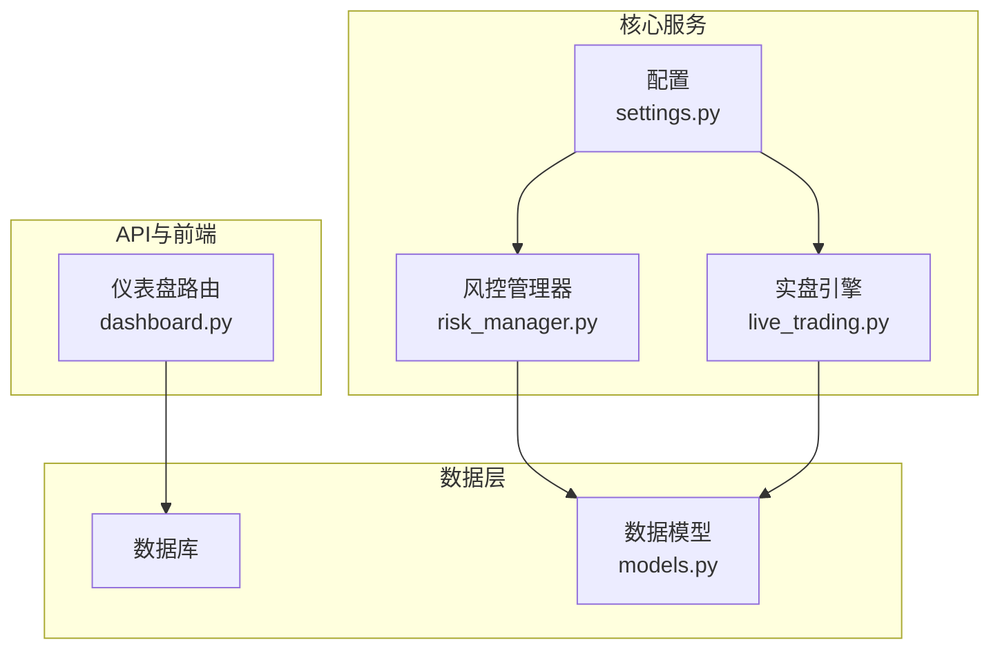
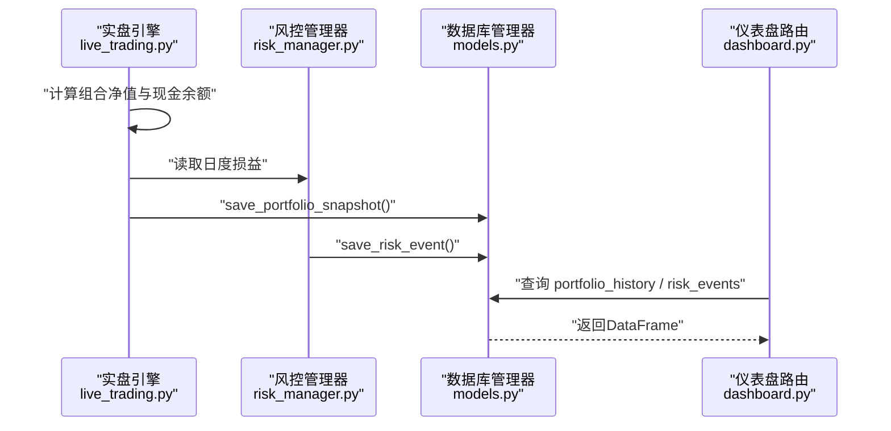
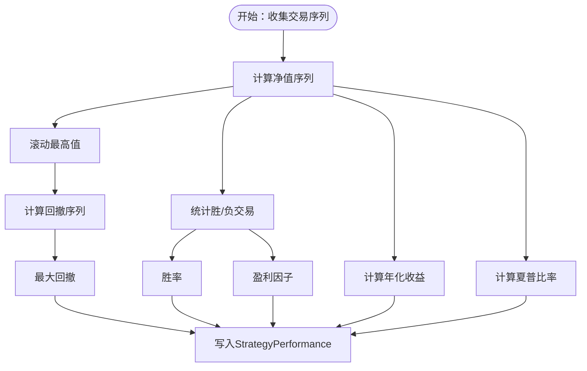
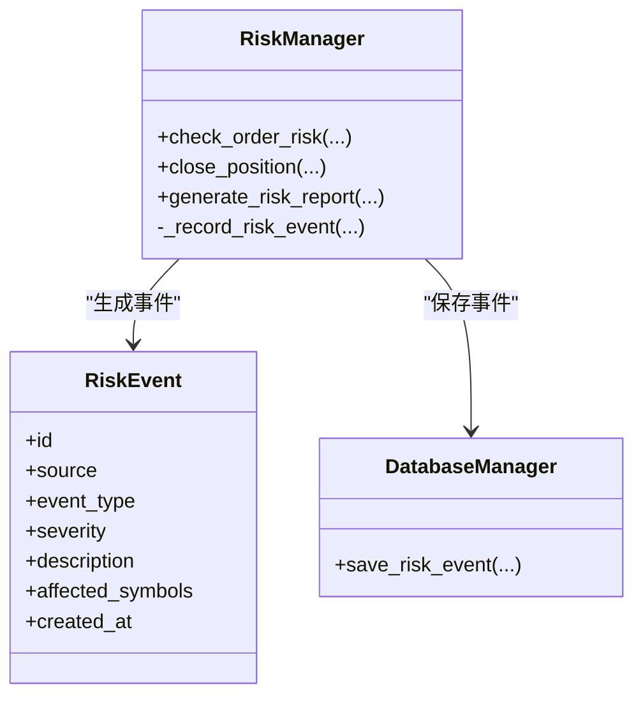
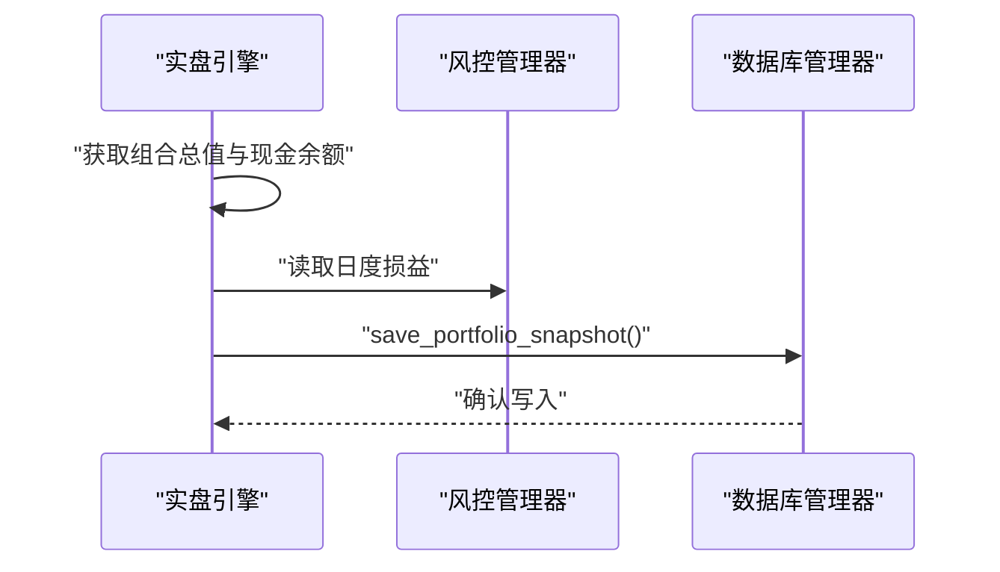
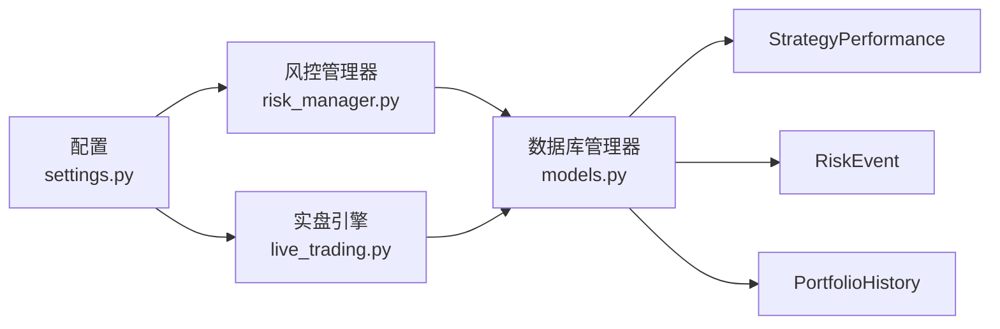

# 性能与风控模型

<cite>
**本文档引用的文件**
- [models.py](file://backpack_quant_trading/database/models.py)
- [risk_manager.py](file://backpack_quant_trading/core/risk_manager.py)
- [live_trading.py](file://backpack_quant_trading/engine/live_trading.py)
- [dashboard.py](file://backpack_quant_trading/api/routers/dashboard.py)
- [settings.py](file://backpack_quant_trading/config/settings.py)
- [backtest.py](file://backpack_quant_trading/engine/backtest.py)
- [strategy.py](file://backpack_quant_trading/api/routers/strategy.py)
</cite>

## 目录
1. [简介](#简介)
2. [项目结构](#项目结构)
3. [核心组件](#核心组件)
4. [架构总览](#架构总览)
5. [详细组件分析](#详细组件分析)
6. [依赖关系分析](#依赖关系分析)
7. [性能考量](#性能考量)
8. [故障排查指南](#故障排查指南)
9. [结论](#结论)
10. [附录](#附录)

## 简介
本文件面向交易性能与风控相关的数据模型，系统性梳理以下三类核心表：
- StrategyPerformance（策略性能）
- RiskEvent（风险事件）
- PortfolioHistory（组合历史净值）

并围绕以下主题展开：
- 设计目的与使用场景
- 性能指标计算字段的含义与计算方法
- 风险事件分类体系与严重程度等级
- 组合净值追踪机制与每日损益计算
- 性能分析查询示例与风控监控最佳实践

## 项目结构
本项目采用分层架构，数据库模型定义位于 database 层，风控与实时交易逻辑位于 core 与 engine 层，API 路由负责对外提供查询与仪表盘数据。

图表来源
- [models.py:171-225](file://backpack_quant_trading/database/models.py#L171-L225)
- [risk_manager.py:48-566](file://backpack_quant_trading/core/risk_manager.py#L48-L566)
- [live_trading.py:2180-2223](file://backpack_quant_trading/engine/live_trading.py#L2180-L2223)
- [dashboard.py:26-131](file://backpack_quant_trading/api/routers/dashboard.py#L26-L131)
- [settings.py:55-64](file://backpack_quant_trading/config/settings.py#L55-L64)

章节来源
- [models.py:1-721](file://backpack_quant_trading/database/models.py#L1-L721)
- [risk_manager.py:1-566](file://backpack_quant_trading/core/risk_manager.py#L1-L566)
- [live_trading.py:2180-2223](file://backpack_quant_trading/engine/live_trading.py#L2180-L2223)
- [dashboard.py:1-131](file://backpack_quant_trading/api/routers/dashboard.py#L1-L131)
- [settings.py:1-137](file://backpack_quant_trading/config/settings.py#L1-L137)

## 核心组件
本节聚焦三大数据模型及其职责边界与典型使用场景。

- StrategyPerformance（策略性能）
  - 设计目的：记录策略在特定时间段内的关键绩效指标，便于回测与实盘对比、策略筛选与归因分析。
  - 使用场景：策略回测报告生成、策略对比面板、年度化收益与最大回撤展示、胜率与盈利因子可视化。
  - 关键字段：策略名称、总收益、年化收益、夏普比率、最大回撤、胜率、盈利因子、总交易数、胜/负交易数、起止日期、创建时间。
  - 计算方法：见“详细组件分析”中的“策略性能指标计算”。

- RiskEvent（风险事件）
  - 设计目的：统一记录风控触发事件、异常行为与系统告警，支持事件分级与影响范围追踪。
  - 使用场景：风控仪表盘实时展示、事件溯源与复盘、风险评分与等级判定、推荐措施生成。
  - 关键字段：事件类型、严重程度、描述、受影响交易对、来源、时间戳。
  - 分类与严重度：见“详细组件分析”中的“风险事件分类与严重度”。

- PortfolioHistory（组合历史净值）
  - 设计目的：记录每日组合净值、现金余额、持仓价值、日度损益与日度收益率，支撑净值曲线与风控指标计算。
  - 使用场景：净值曲线可视化、日度损益追踪、回撤计算、风险报告生成。
  - 关键字段：时间戳、组合总值、现金余额、持仓价值、日度损益、日度收益率。
  - 追踪机制：见“详细组件分析”中的“组合净值追踪与日度损益”。

章节来源
- [models.py:171-225](file://backpack_quant_trading/database/models.py#L171-L225)
- [risk_manager.py:302-329](file://backpack_quant_trading/core/risk_manager.py#L302-L329)
- [live_trading.py:2180-2223](file://backpack_quant_trading/engine/live_trading.py#L2180-L2223)

## 架构总览
下图展示了从实时交易到数据落库与查询的端到端流程。

图表来源
- [live_trading.py:2180-2223](file://backpack_quant_trading/engine/live_trading.py#L2180-L2223)
- [risk_manager.py:302-329](file://backpack_quant_trading/core/risk_manager.py#L302-L329)
- [dashboard.py:26-131](file://backpack_quant_trading/api/routers/dashboard.py#L26-L131)

## 详细组件分析

### StrategyPerformance（策略性能）
- 设计目的
  - 提供策略层面的标准化指标，便于跨策略比较与长期跟踪。
- 字段与含义
  - 策略名称：区分不同策略实例
  - 总收益、年化收益：反映绝对与时间调整收益
  - 夏普比率：衡量风险调整收益
  - 最大回撤：反映最深的资本回撤
  - 胜率、盈利因子：衡量交易质量与盈亏结构
  - 总交易数、胜/负交易数：交易频率与方向性
  - 起止日期：评估观察期
  - 创建时间：记录指标生成时间
- 计算方法
  - 年化收益：基于总收益与观察期换算
  - 夏普比率：(策略年化收益 - 无风险利率) / 策略收益波动
  - 最大回撤：净值序列滚动最高值与当前净值之差的最大百分比
  - 胜率：已平仓交易中盈利交易占比
  - 盈利因子：总盈利 / 总亏损绝对值
  - 参考实现路径：
    - 回测端计算与填充：[backtest.py:354-385](file://backpack_quant_trading/engine/backtest.py#L354-L385)
    - 策略概览API聚合：[strategy.py:978-1005](file://backpack_quant_trading/api/routers/strategy.py#L978-L1005)

图表来源
- [backtest.py:354-385](file://backpack_quant_trading/engine/backtest.py#L354-L385)
- [strategy.py:978-1005](file://backpack_quant_trading/api/routers/strategy.py#L978-L1005)

章节来源
- [models.py:171-190](file://backpack_quant_trading/database/models.py#L171-L190)
- [backtest.py:354-385](file://backpack_quant_trading/engine/backtest.py#L354-L385)
- [strategy.py:978-1005](file://backpack_quant_trading/api/routers/strategy.py#L978-L1005)

### RiskEvent（风险事件）
- 设计目的
  - 统一记录风控触发事件、系统警告与异常行为，支持分级与溯源。
- 字段与含义
  - 事件类型：如 order_rejected、risk_warning、position_closed 等
  - 严重程度：low、medium、high、critical
  - 描述：事件详情文本
  - 受影响交易对：可选，用于定位风险范围
  - 来源：交易源（如 backpack、deepcoin 等）
  - 时间戳：事件发生时间
- 分类与严重度
  - 低：一般性提示或轻微违规
  - 中：常规风控触发或警告
  - 高：重大违规或高风险事件
  - 严重：系统级风险或重大损失风险
- 生成与落库
  - 实盘下单风控检查失败时记录：[risk_manager.py:206-217](file://backpack_quant_trading/core/risk_manager.py#L206-L217)
  - 日常风控事件记录与入库：[risk_manager.py:302-329](file://backpack_quant_trading/core/risk_manager.py#L302-L329)
  - 数据库保存接口：[models.py:456-473](file://backpack_quant_trading/database/models.py#L456-L473)

图表来源
- [models.py:192-207](file://backpack_quant_trading/database/models.py#L192-L207)
- [risk_manager.py:206-217](file://backpack_quant_trading/core/risk_manager.py#L206-L217)
- [risk_manager.py:302-329](file://backpack_quant_trading/core/risk_manager.py#L302-L329)
- [models.py:456-473](file://backpack_quant_trading/database/models.py#L456-L473)

章节来源
- [models.py:192-207](file://backpack_quant_trading/database/models.py#L192-L207)
- [risk_manager.py:206-217](file://backpack_quant_trading/core/risk_manager.py#L206-L217)
- [risk_manager.py:302-329](file://backpack_quant_trading/core/risk_manager.py#L302-L329)
- [models.py:456-473](file://backpack_quant_trading/database/models.py#L456-L473)

### PortfolioHistory（组合历史净值）
- 设计目的
  - 记录组合总值、现金余额、持仓价值、日度损益与日度收益率，支撑净值曲线与风控指标。
- 字段与含义
  - 时间戳：快照时间
  - 组合总值：总资产价值
  - 现金余额：可用资金
  - 持仓价值：总值 - 现金
  - 日度损益：当日累计盈亏
  - 日度收益率：日度损益 / 组合总值 × 100%
- 追踪机制
  - 实盘引擎定时采集并落库：每分钟一次
  - 计算逻辑：组合总值 = 现金 + 持仓；日度损益来自风控管理器；日度收益率按公式计算
  - 参考实现路径：
    - 快照循环与落库：[live_trading.py:2180-2223](file://backpack_quant_trading/engine/live_trading.py#L2180-L2223)
    - 数据库保存接口：[models.py:475-496](file://backpack_quant_trading/database/models.py#L475-L496)

图表来源
- [live_trading.py:2180-2223](file://backpack_quant_trading/engine/live_trading.py#L2180-L2223)
- [models.py:475-496](file://backpack_quant_trading/database/models.py#L475-L496)

章节来源
- [models.py:210-225](file://backpack_quant_trading/database/models.py#L210-L225)
- [live_trading.py:2180-2223](file://backpack_quant_trading/engine/live_trading.py#L2180-L2223)
- [models.py:475-496](file://backpack_quant_trading/database/models.py#L475-L496)

### 风控指标与报告
- 风控指标
  - 日度损益、累计盈亏、峰值组合价值、当前回撤、净/总敞口
- 风险报告
  - VaR（历史法、参数法、蒙特卡洛）与期望损失
  - 压力测试（多场景冲击）与恢复时间估计
  - 风险评分与等级（低/中/高），并生成建议
- 参考实现路径：
  - 风控指标与报告生成：[risk_manager.py:282-542](file://backpack_quant_trading/core/risk_manager.py#L282-L542)
  - 风险事件记录与入库：[risk_manager.py:302-329](file://backpack_quant_trading/core/risk_manager.py#L302-L329)

章节来源
- [risk_manager.py:282-542](file://backpack_quant_trading/core/risk_manager.py#L282-L542)
- [risk_manager.py:302-329](file://backpack_quant_trading/core/risk_manager.py#L302-L329)

## 依赖关系分析
- 数据模型依赖
  - StrategyPerformance、RiskEvent、PortfolioHistory 由 DatabaseManager 统一管理，提供保存与查询能力。
- 实时与回测差异
  - 实盘侧通过引擎循环写入净值快照；回测侧通过交易序列计算指标并填充模型。
- 配置驱动
  - 交易风控阈值（日损、回撤、最大仓位比例、止损/止盈比例、无风险利率、杠杆）由配置决定。

图表来源
- [settings.py:55-64](file://backpack_quant_trading/config/settings.py#L55-L64)
- [risk_manager.py:48-566](file://backpack_quant_trading/core/risk_manager.py#L48-L566)
- [live_trading.py:2180-2223](file://backpack_quant_trading/engine/live_trading.py#L2180-L2223)
- [models.py:267-721](file://backpack_quant_trading/database/models.py#L267-L721)

章节来源
- [settings.py:55-64](file://backpack_quant_trading/config/settings.py#L55-L64)
- [risk_manager.py:48-566](file://backpack_quant_trading/core/risk_manager.py#L48-L566)
- [live_trading.py:2180-2223](file://backpack_quant_trading/engine/live_trading.py#L2180-L2223)
- [models.py:267-721](file://backpack_quant_trading/database/models.py#L267-L721)

## 性能考量
- 数据库写入
  - PortfolioHistory 每分钟写入一次，建议开启索引与批量写入策略，避免高并发写入阻塞。
- 指标计算
  - 夏普比率与VaR计算依赖历史序列长度，建议至少30日以上数据以保证稳定性。
- 内存与事件数量
  - 风控事件列表有上限保护，避免内存膨胀；建议定期清理或归档。

[本节为通用指导，无需具体文件引用]

## 故障排查指南
- 组合净值缺失或异常
  - 检查实盘引擎快照循环是否运行：[live_trading.py:2180-2223](file://backpack_quant_trading/engine/live_trading.py#L2180-L2223)
  - 确认数据库连接与写入成功：[models.py:475-496](file://backpack_quant_trading/database/models.py#L475-L496)
- 风控事件未落库
  - 检查风控事件记录逻辑与数据库保存：[risk_manager.py:302-329](file://backpack_quant_trading/core/risk_manager.py#L302-L329)，[models.py:456-473](file://backpack_quant_trading/database/models.py#L456-L473)
- 仪表盘数据为空
  - 检查路由查询条件与来源过滤：[dashboard.py:26-131](file://backpack_quant_trading/api/routers/dashboard.py#L26-L131)

章节来源
- [live_trading.py:2180-2223](file://backpack_quant_trading/engine/live_trading.py#L2180-L2223)
- [models.py:456-496](file://backpack_quant_trading/database/models.py#L456-L496)
- [dashboard.py:26-131](file://backpack_quant_trading/api/routers/dashboard.py#L26-L131)

## 结论
本文件系统化梳理了策略性能、风险事件与组合净值的历史快照三类核心数据模型，明确了它们的设计目的、字段含义、计算方法与使用场景，并给出了实时追踪与查询的最佳实践。通过配置驱动的风控阈值与多维度的风险报告，系统能够在实盘运行中持续监控与预警，为策略优化与风险管理提供坚实的数据基础。

[本节为总结性内容，无需具体文件引用]

## 附录

### 性能分析查询示例
以下为常见查询思路（请根据实际部署的 exchange 来源选择 source 字段）：
- 查询最近N条净值快照
  - SELECT * FROM portfolio_history WHERE source = 'backpack' ORDER BY timestamp DESC LIMIT N;
- 查询某策略最近一次性能指标
  - SELECT * FROM strategy_performance WHERE strategy_name = '策略名' ORDER BY created_at DESC LIMIT 1;
- 查询最近风险事件（按严重度排序）
  - SELECT * FROM risk_events WHERE source = 'backpack' ORDER BY created_at DESC, severity DESC LIMIT M;

章节来源
- [dashboard.py:26-131](file://backpack_quant_trading/api/routers/dashboard.py#L26-L131)

### 风控监控最佳实践
- 阈值设定
  - 基于配置文件中的交易风控参数进行阈值设定，避免过度严格导致误拒。
- 事件分级
  - 将风控事件按严重度分级，结合风险评分与推荐措施，形成闭环。
- 报告生成
  - 定期生成VaR与压力测试报告，关注极端情景下的潜在影响与恢复时间。
- 数据保留
  - 对历史数据进行定期归档与清理，平衡存储成本与审计需求。

章节来源
- [settings.py:55-64](file://backpack_quant_trading/config/settings.py#L55-L64)
- [risk_manager.py:503-542](file://backpack_quant_trading/core/risk_manager.py#L503-L542)