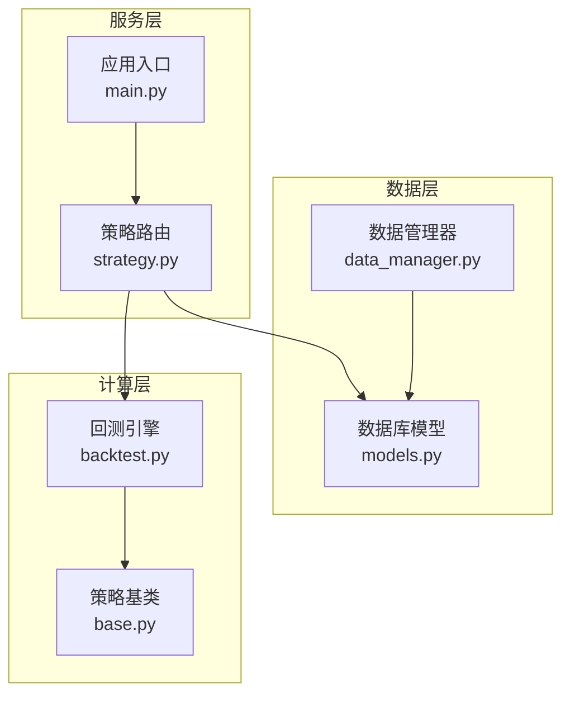
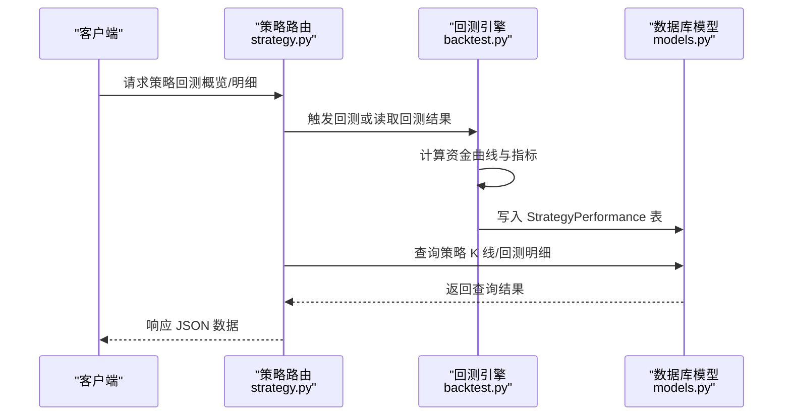
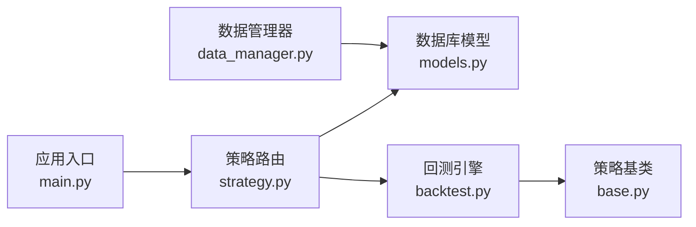

# 策略性能模型

<cite>
**本文档引用的文件**
- [models.py](file://backpack_quant_trading/database/models.py)
- [backtest.py](file://backpack_quant_trading/engine/backtest.py)
- [strategy.py](file://backpack_quant_trading/api/routers/strategy.py)
- [base.py](file://backpack_quant_trading/strategy/base.py)
- [data_manager.py](file://backpack_quant_trading/core/data_manager.py)
- [main.py](file://backpack_quant_trading/api/main.py)
</cite>

## 目录
1. [简介](#简介)
2. [项目结构](#项目结构)
3. [核心组件](#核心组件)
4. [架构总览](#架构总览)
5. [详细组件分析](#详细组件分析)
6. [依赖分析](#依赖分析)
7. [性能考虑](#性能考虑)
8. [故障排除指南](#故障排除指南)
9. [结论](#结论)
10. [附录](#附录)

## 简介
本文件围绕策略性能数据模型进行系统化说明，重点阐述 StrategyPerformance 表的设计目的与业务价值，详细解析总收益（total_return）、年化收益（annualized_return）、夏普比率（sharpe_ratio）、最大回撤（max_drawdown）、胜率（win_rate）、盈亏比（profit_factor）等核心指标的计算方法与业务含义，并给出性能数据的采集频率、存储格式与查询优化策略。同时提供性能指标对比分析示例与策略优劣判断标准，涵盖历史趋势分析与异常检测方法。

## 项目结构
该项目采用模块化分层架构，策略性能数据贯穿数据采集、存储、计算与展示四个层面：
- 数据采集与缓存：通过数据管理器统一获取与缓存市场数据，支持回测与实盘场景。
- 数据存储：使用 SQLAlchemy 定义数据库模型，StrategyPerformance 表承载策略性能指标。
- 性能计算：回测引擎负责计算各项指标，策略基类提供通用性能报告能力。
- 展示与查询：API 路由提供策略相关 K 线与回测交易明细查询，便于前端可视化与分析。

图表来源
- [data_manager.py:18-518](file://backpack_quant_trading/core/data_manager.py#L18-L518)
- [models.py:171-190](file://backpack_quant_trading/database/models.py#L171-L190)
- [backtest.py:48-404](file://backpack_quant_trading/engine/backtest.py#L48-L404)
- [base.py:41-212](file://backpack_quant_trading/strategy/base.py#L41-L212)
- [strategy.py:1-800](file://backpack_quant_trading/api/routers/strategy.py#L1-L800)
- [main.py:14-98](file://backpack_quant_trading/api/main.py#L14-L98)

章节来源
- [data_manager.py:18-518](file://backpack_quant_trading/core/data_manager.py#L18-L518)
- [models.py:171-190](file://backpack_quant_trading/database/models.py#L171-L190)
- [backtest.py:48-404](file://backpack_quant_trading/engine/backtest.py#L48-L404)
- [base.py:41-212](file://backpack_quant_trading/strategy/base.py#L41-L212)
- [strategy.py:1-800](file://backpack_quant_trading/api/routers/strategy.py#L1-L800)
- [main.py:14-98](file://backpack_quant_trading/api/main.py#L14-L98)

## 核心组件
本节聚焦 StrategyPerformance 表及其相关组件，明确其职责与数据结构。

- StrategyPerformance 表
  - 设计目的：统一存储策略在特定时间段内的关键绩效指标，支撑策略评估、对比与历史趋势分析。
  - 关键字段：
    - 策略标识：strategy_name
    - 时间范围：start_date、end_date
    - 收益与风险：total_return、annualized_return、max_drawdown
    - 风险调整收益：sharpe_ratio
    - 盈利质量：win_rate、profit_factor
    - 交易统计：total_trades、winning_trades、losing_trades
    - 记录时间：created_at
  - 存储格式：数值型精度为 Numeric(10, 4)，保证收益与比率类指标的高精度存储；时间字段使用 DateTime。
  - 查询优化：为 strategy_name、start_date、end_date 等常用筛选字段建立索引，提升按策略与时间范围查询效率。

- 回测引擎指标计算
  - 回测引擎在完成回测后，计算并填充 StrategyPerformance 表所需的关键指标，包括总收益、年化收益、夏普比率、最大回撤、胜率与盈亏比等。
  - 计算流程：引擎先生成资金曲线，再据此计算各指标，最终封装为 BacktestResult 并持久化到数据库。

- API 路由与数据展示
  - 策略路由提供策略 K 线与回测交易明细查询接口，支持前端可视化与进一步的性能分析。
  - 通过路由层的数据映射与汇总，形成策略总体表现视图，辅助策略比较与决策。

章节来源
- [models.py:171-190](file://backpack_quant_trading/database/models.py#L171-L190)
- [backtest.py:333-383](file://backpack_quant_trading/engine/backtest.py#L333-L383)
- [strategy.py:392-488](file://backpack_quant_trading/api/routers/strategy.py#L392-L488)

## 架构总览
策略性能数据在系统中的流转路径如下：
- 数据采集：数据管理器负责获取与缓存市场数据，支持回测与实盘。
- 回测计算：回测引擎基于策略信号与成交记录生成资金曲线与交易明细，计算各项指标。
- 数据持久化：将回测结果写入 StrategyPerformance 表，同时策略路由也维护策略 K 线与回测交易明细表。
- 查询与展示：API 路由提供查询接口，前端可基于这些接口进行可视化与对比分析。

图表来源
- [strategy.py:392-488](file://backpack_quant_trading/api/routers/strategy.py#L392-L488)
- [backtest.py:333-383](file://backpack_quant_trading/engine/backtest.py#L333-L383)
- [models.py:171-190](file://backpack_quant_trading/database/models.py#L171-L190)

## 详细组件分析

### StrategyPerformance 表设计与业务价值
- 设计目的
  - 统一存储策略在特定时间窗口内的关键绩效指标，便于横向对比与纵向趋势分析。
  - 为策略选择、参数优化与风控策略制定提供数据基础。
- 字段说明
  - 策略标识：strategy_name，用于区分不同策略。
  - 时间范围：start_date、end_date，限定回测或实盘评估的时间区间。
  - 收益指标：total_return、annualized_return，衡量绝对收益与风险调整后收益。
  - 风险指标：max_drawdown，衡量最大回撤幅度，反映策略潜在最大损失。
  - 风险调整收益：sharpe_ratio，衡量单位风险所获得的超额收益。
  - 盈利质量：win_rate、profit_factor，分别反映交易胜率与盈亏比。
  - 交易统计：total_trades、winning_trades、losing_trades，提供交易频次与分布信息。
  - 记录时间：created_at，便于审计与版本管理。
- 业务价值
  - 为策略评估提供标准化指标体系，支持多策略对比与择优。
  - 结合时间序列数据，可进行历史趋势分析与异常检测，辅助策略生命周期管理。

章节来源
- [models.py:171-190](file://backpack_quant_trading/database/models.py#L171-L190)

### 核心性能指标计算方法与业务含义
- 总收益（total_return）
  - 计算方法：(期末净值 / 初始资金 - 1) × 100%
  - 业务含义：反映策略在评估期内的总回报水平，直观体现盈利能力。
- 年化收益（annualized_return）
  - 计算方法：(1 + 总收益/100) ^ (365 / 天数) - 1，若天数为0则为0
  - 业务含义：将总收益折算为年化水平，便于跨时间窗口比较。
- 夏普比率（sharpe_ratio）
  - 计算方法：日收益率均值 × √252 / 日收益率标准差；若样本不足或标准差为0则为0
  - 业务含义：衡量单位波动带来的超额收益，数值越高代表风险调整后收益越好。
- 最大回撤（max_drawdown）
  - 计算方法：基于资金曲线滚动最高净值计算的最大回撤幅度
  - 业务含义：反映策略在回测期间可能面临的最大资金回撤，是风险控制的重要参考。
- 胜率（win_rate）
  - 计算方法：盈利交易数 / 已平仓交易总数 × 100%
  - 业务含义：衡量策略交易的稳定性与信号质量，高胜率通常意味着较低的错误交易频率。
- 盈亏比（profit_factor）
  - 计算方法：总盈利 / 总亏损；若总亏损为0则为0
  - 业务含义：衡量策略在盈利与亏损之间的平衡，反映单次交易的期望收益。

章节来源
- [backtest.py:333-383](file://backpack_quant_trading/engine/backtest.py#L333-L383)

### 性能数据采集频率、存储格式与查询优化策略
- 采集频率
  - 回测：按策略信号触发的回测周期（如分钟级、小时级）生成资金曲线与交易明细。
  - 实盘：通过数据管理器缓存与落库，支持按需查询与增量更新。
- 存储格式
  - 数值精度：Numeric(10, 4)，确保收益与比率类指标的高精度存储。
  - 时间字段：DateTime，支持精确到秒的时间范围查询。
- 查询优化
  - 索引策略：为 strategy_name、start_date、end_date 等常用筛选字段建立索引，提升查询效率。
  - 分页与范围查询：结合时间范围与策略名称进行分页查询，避免全表扫描。
  - 缓存策略：对热点查询结果进行缓存，降低数据库压力。

章节来源
- [models.py:171-190](file://backpack_quant_trading/database/models.py#L171-L190)
- [data_manager.py:18-518](file://backpack_quant_trading/core/data_manager.py#L18-L518)

### 性能指标对比分析示例与策略优劣判断标准
- 对比分析示例
  - 同一策略在不同时间窗口的对比：观察 total_return、annualized_return、sharpe_ratio 的变化趋势，判断策略稳定性与适应性。
  - 多策略横向对比：在同一时间窗口下比较 win_rate、profit_factor、max_drawdown，识别最优策略组合。
- 判断标准
  - 绝对收益优先：在同等风险水平下，annualized_return 更高的策略更优。
  - 风险调整收益优先：sharpe_ratio 更高的策略在风险可控前提下创造更高收益。
  - 风险控制优先：max_drawdown 更小的策略更适合保守型投资者。
  - 盈利质量优先：win_rate 与 profit_factor 更均衡的策略具备更好的可持续性。

章节来源
- [backtest.py:333-383](file://backpack_quant_trading/engine/backtest.py#L333-L383)

### 历史趋势分析与异常检测方法
- 历史趋势分析
  - 按月/季度/年度聚合 StrategyPerformance 指标，绘制趋势图，识别策略收益与风险的变化规律。
  - 结合外部市场环境（如波动率、宏观事件）进行归因分析。
- 异常检测方法
  - 统计异常：基于滚动均值与标准差识别偏离正常范围的指标异常。
  - 信号异常：对 win_rate、profit_factor 等指标进行阈值监控，当指标出现极端波动时触发告警。
  - 回撤异常：对 max_drawdown 进行阈值监控，结合资金曲线进行可视化告警。

章节来源
- [strategy.py:392-488](file://backpack_quant_trading/api/routers/strategy.py#L392-L488)

## 依赖分析
策略性能数据模型涉及以下关键依赖关系：
- 数据管理器依赖数据库模型进行数据落库与查询。
- 回测引擎依赖策略基类提供的信号与交易记录，生成资金曲线与指标。
- API 路由依赖数据库模型与回测引擎，提供查询接口与可视化数据。
- 应用入口负责注册路由，统一对外提供服务。

图表来源
- [data_manager.py:18-518](file://backpack_quant_trading/core/data_manager.py#L18-L518)
- [models.py:171-190](file://backpack_quant_trading/database/models.py#L171-L190)
- [backtest.py:48-404](file://backpack_quant_trading/engine/backtest.py#L48-L404)
- [base.py:41-212](file://backpack_quant_trading/strategy/base.py#L41-L212)
- [strategy.py:1-800](file://backpack_quant_trading/api/routers/strategy.py#L1-L800)
- [main.py:14-98](file://backpack_quant_trading/api/main.py#L14-L98)

章节来源
- [data_manager.py:18-518](file://backpack_quant_trading/core/data_manager.py#L18-L518)
- [models.py:171-190](file://backpack_quant_trading/database/models.py#L171-L190)
- [backtest.py:48-404](file://backpack_quant_trading/engine/backtest.py#L48-L404)
- [base.py:41-212](file://backpack_quant_trading/strategy/base.py#L41-L212)
- [strategy.py:1-800](file://backpack_quant_trading/api/routers/strategy.py#L1-L800)
- [main.py:14-98](file://backpack_quant_trading/api/main.py#L14-L98)

## 性能考虑
- 数据库性能
  - 为高频查询字段建立复合索引，减少全表扫描。
  - 控制单次查询返回的数据量，采用分页与时间范围限制。
- 计算性能
  - 回测指标计算采用向量化与滚动计算，避免循环冗余。
  - 对资金曲线与交易明细进行缓存，减少重复计算。
- 系统扩展
  - 通过 API 路由与应用入口解耦服务层，便于横向扩展与微服务化。

## 故障排除指南
- 数据缺失
  - 检查数据管理器的缓存与落库逻辑，确认时间戳与价格字段的有效性。
- 指标异常
  - 核对回测引擎的资金曲线生成逻辑，检查收益、波动率与交易明细的准确性。
- 查询缓慢
  - 确认索引是否生效，必要时重建索引或优化查询条件。

章节来源
- [data_manager.py:18-518](file://backpack_quant_trading/core/data_manager.py#L18-L518)
- [backtest.py:333-383](file://backpack_quant_trading/engine/backtest.py#L333-L383)

## 结论
StrategyPerformance 表为策略性能评估提供了标准化的数据基础，结合回测引擎的指标计算与 API 路由的数据展示，能够实现策略的多维度评估与持续优化。通过合理的采集频率、存储格式与查询优化策略，可有效支撑策略的长期运营与迭代。

## 附录
- 相关文件路径与用途
  - [models.py](file://backpack_quant_trading/database/models.py)：数据库模型定义，包含 StrategyPerformance 表。
  - [backtest.py](file://backpack_quant_trading/engine/backtest.py)：回测引擎与指标计算实现。
  - [strategy.py](file://backpack_quant_trading/api/routers/strategy.py)：策略路由与数据查询接口。
  - [base.py](file://backpack_quant_trading/strategy/base.py)：策略基类与通用性能报告能力。
  - [data_manager.py](file://backpack_quant_trading/core/data_manager.py)：数据管理与缓存机制。
  - [main.py](file://backpack_quant_trading/api/main.py)：应用入口与路由注册。