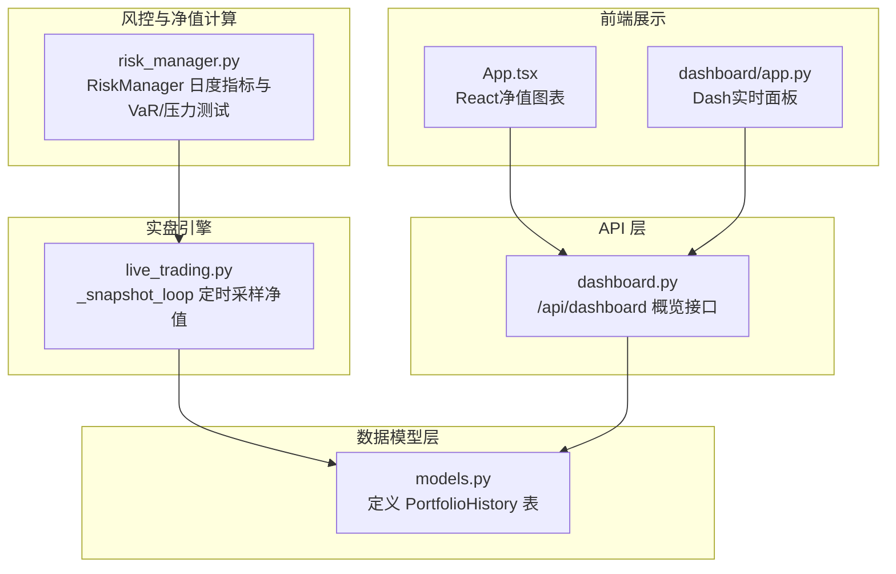
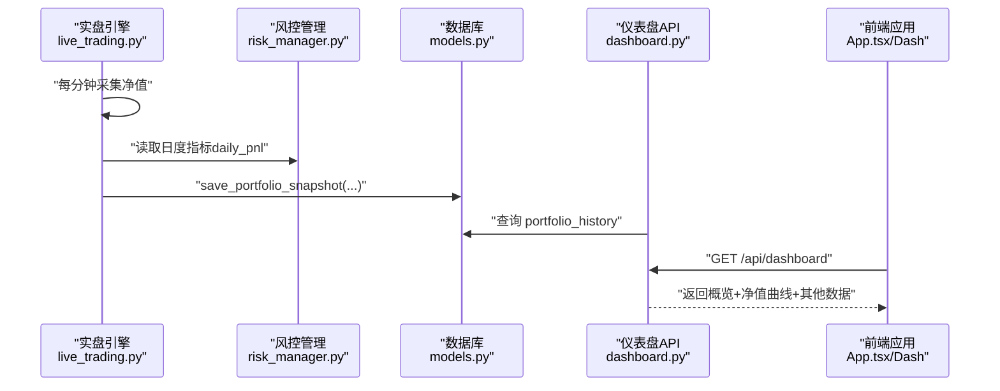
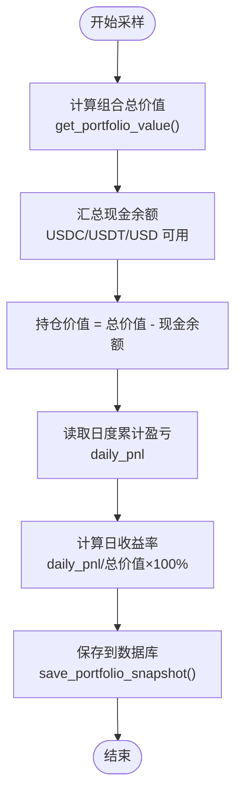
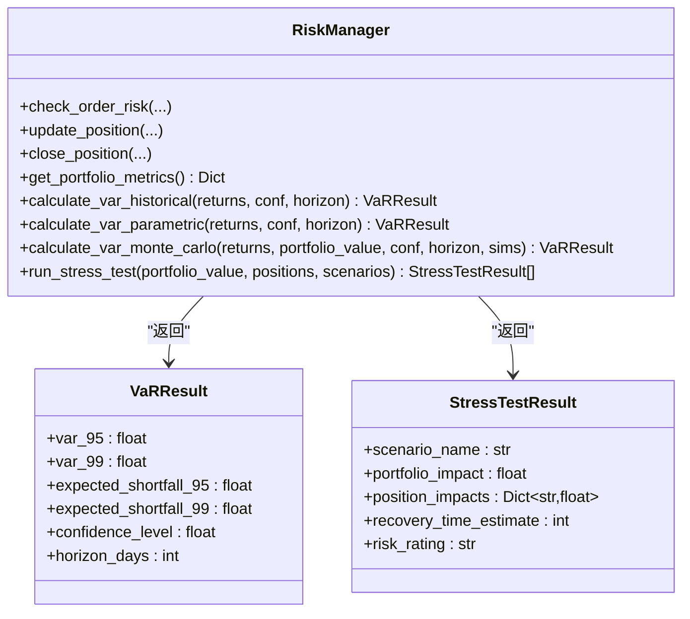
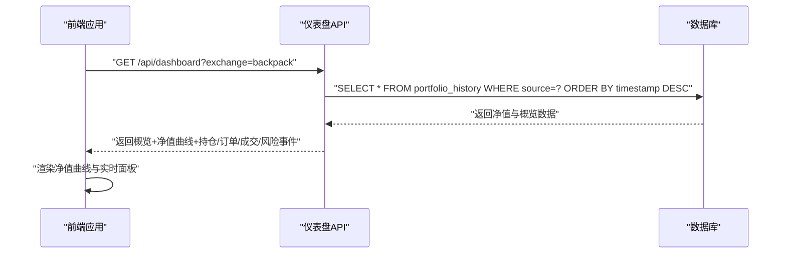
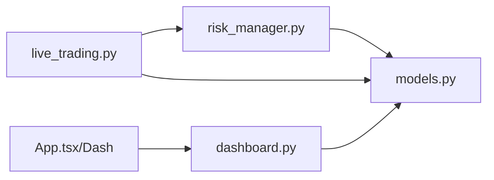

# 组合历史净值模型

<cite>
**本文档引用的文件**
- [models.py](file://backpack_quant_trading/database/models.py)
- [risk_manager.py](file://backpack_quant_trading/core/risk_manager.py)
- [live_trading.py](file://backpack_quant_trading/engine/live_trading.py)
- [dashboard.py](file://backpack_quant_trading/api/routers/dashboard.py)
- [App.tsx](file://backpack_quant_trading/frontend/src_dash/app/App.tsx)
- [app.py](file://backpack_quant_trading/dashboard/app.py)
</cite>

## 目录
1. [简介](#简介)
2. [项目结构](#项目结构)
3. [核心组件](#核心组件)
4. [架构总览](#架构总览)
5. [详细组件分析](#详细组件分析)
6. [依赖关系分析](#依赖关系分析)
7. [性能考量](#性能考量)
8. [故障排查指南](#故障排查指南)
9. [结论](#结论)
10. [附录](#附录)

## 简介
本文件面向“组合历史净值数据模型”，系统性阐述 PortfolioHistory 表的净值追踪机制，包括组合总价值（portfolio_value）、现金余额（cash_balance）、持仓价值（position_value）的计算逻辑与数据来源；详细说明日盈亏（daily_pnl）与日收益率（daily_return）的计算方法与时间维度；解释净值数据的采样频率与存储策略；提供组合风险分析查询示例（VaR 风险价值与压力测试）；并给出净值图表展示与实时监控面板的数据接口说明。

## 项目结构
围绕净值模型的关键模块与职责：
- 数据模型层：定义 PortfolioHistory 表结构与数据库访问方法
- 风控与净值计算：RiskManager 提供日度指标与风险度量
- 实盘引擎：LiveTradingEngine 定期采集净值并写入数据库
- API 层：Dashboard 路由提供净值与概览数据接口
- 前端展示：React/Dash 应用消费接口并可视化净值曲线

图示来源
- [models.py:210-226](file://backpack_quant_trading/database/models.py#L210-L226)
- [risk_manager.py:48-300](file://backpack_quant_trading/core/risk_manager.py#L48-L300)
- [live_trading.py:2180-2223](file://backpack_quant_trading/engine/live_trading.py#L2180-L2223)
- [dashboard.py:26-131](file://backpack_quant_trading/api/routers/dashboard.py#L26-L131)
- [App.tsx:162-213](file://backpack_quant_trading/frontend/src_dash/app/App.tsx#L162-L213)
- [app.py:2805-2834](file://backpack_quant_trading/dashboard/app.py#L2805-L2834)

章节来源
- [models.py:210-226](file://backpack_quant_trading/database/models.py#L210-L226)
- [risk_manager.py:48-300](file://backpack_quant_trading/core/risk_manager.py#L48-L300)
- [live_trading.py:2180-2223](file://backpack_quant_trading/engine/live_trading.py#L2180-L2223)
- [dashboard.py:26-131](file://backpack_quant_trading/api/routers/dashboard.py#L26-L131)
- [App.tsx:162-213](file://backpack_quant_trading/frontend/src_dash/app/App.tsx#L162-L213)
- [app.py:2805-2834](file://backpack_quant_trading/dashboard/app.py#L2805-L2834)

## 核心组件
- PortfolioHistory 表：记录每日净值快照，字段包括时间戳、组合总价值、现金余额、持仓价值、当日盈亏、当日收益率，并按时间与来源索引。
- RiskManager：维护日度指标（daily_pnl、daily_trades、daily_volume），并提供 VaR 与压力测试能力。
- LiveTradingEngine：每分钟采集一次净值，计算并持久化到数据库。
- Dashboard API：提供概览、净值曲线、持仓、订单、成交、风险事件等聚合数据。
- 前端应用：消费 API 并渲染净值曲线与实时面板。

章节来源
- [models.py:210-226](file://backpack_quant_trading/database/models.py#L210-L226)
- [risk_manager.py:48-300](file://backpack_quant_trading/core/risk_manager.py#L48-L300)
- [live_trading.py:2180-2223](file://backpack_quant_trading/engine/live_trading.py#L2180-L2223)
- [dashboard.py:26-131](file://backpack_quant_trading/api/routers/dashboard.py#L26-L131)
- [App.tsx:162-213](file://backpack_quant_trading/frontend/src_dash/app/App.tsx#L162-L213)
- [app.py:2805-2834](file://backpack_quant_trading/dashboard/app.py#L2805-L2834)

## 架构总览
净值数据流从实盘引擎采集，经过风控计算，最终落库并被 API 与前端消费。

图示来源
- [live_trading.py:2180-2223](file://backpack_quant_trading/engine/live_trading.py#L2180-L2223)
- [risk_manager.py:282-300](file://backpack_quant_trading/core/risk_manager.py#L282-L300)
- [models.py:475-496](file://backpack_quant_trading/database/models.py#L475-L496)
- [dashboard.py:26-131](file://backpack_quant_trading/api/routers/dashboard.py#L26-L131)
- [App.tsx:162-213](file://backpack_quant_trading/frontend/src_dash/app/App.tsx#L162-L213)

## 详细组件分析

### 组件A：PortfolioHistory 表与净值字段
- 字段定义与索引
  - 时间戳：timestamp（索引）
  - 组合总价值：portfolio_value（数值型）
  - 现金余额：cash_balance（数值型）
  - 持仓价值：position_value（数值型）
  - 当日盈亏：daily_pnl（数值型）
  - 当日收益率：daily_return（百分比数值型）
  - 来源标识：source（索引，便于多平台隔离）

- 数据来源与一致性
  - 来源于实盘引擎的净值快照循环，字段均来自引擎计算与风控模块。
  - 通过 source 字段区分不同平台（如 backpack、deepcoin），避免数据混淆。

- 存储策略
  - 每分钟一次采样，保证净值曲线的时间分辨率。
  - 采用数值型字段，避免字符串转换带来的精度问题。

章节来源
- [models.py:210-226](file://backpack_quant_trading/database/models.py#L210-L226)
- [models.py:475-496](file://backpack_quant_trading/database/models.py#L475-L496)

### 组件B：净值计算逻辑与数据来源
- 组合总价值（portfolio_value）
  - 来源：引擎实时计算，包含稳定币（USDC/USDT/USD）余额与所有持仓的市值之和。
  - 计算位置：get_portfolio_value 方法，遍历余额与持仓，累加得到总价值。

- 现金余额（cash_balance）
  - 来源：引擎从账户余额缓存中汇总 USDC/USDT/USD 的可用余额。
  - 保护性：使用异步锁保护余额读取，避免并发冲突。

- 持仓价值（position_value）
  - 来源：通过组合总价值减去现金余额得到。
  - 用途：用于前端展示与分析，直观反映杠杆与保证金占用情况。

- 日盈亏（daily_pnl）
  - 来源：RiskManager 的日度累计盈亏，由引擎在快照循环中读取。
  - 作用：用于计算日收益率与风险评估。

- 日收益率（daily_return）
  - 计算：daily_pnl / portfolio_value × 100%，当组合总价值为零时为 0。
  - 时间维度：以“日”为单位，日度指标在风控模块中按自然日重置。

图示来源
- [live_trading.py:2152-2161](file://backpack_quant_trading/engine/live_trading.py#L2152-L2161)
- [live_trading.py:2189-2214](file://backpack_quant_trading/engine/live_trading.py#L2189-L2214)
- [risk_manager.py:282-300](file://backpack_quant_trading/core/risk_manager.py#L282-L300)
- [models.py:475-496](file://backpack_quant_trading/database/models.py#L475-L496)

章节来源
- [live_trading.py:2152-2161](file://backpack_quant_trading/engine/live_trading.py#L2152-L2161)
- [live_trading.py:2189-2214](file://backpack_quant_trading/engine/live_trading.py#L2189-L2214)
- [risk_manager.py:282-300](file://backpack_quant_trading/core/risk_manager.py#L282-L300)
- [models.py:475-496](file://backpack_quant_trading/database/models.py#L475-L496)

### 组件C：采样频率与存储策略
- 采样频率
  - 每分钟一次，循环休眠 60 秒，确保高频净值曲线与实时监控。
- 存储策略
  - 使用 Decimal 转 float 写入数据库，避免混合类型运算导致的精度问题。
  - 通过 source 字段区分平台，便于多平台并行监控。
  - 采用数值型字段存储，便于后续统计分析与图表渲染。

章节来源
- [live_trading.py:2221](file://backpack_quant_trading/engine/live_trading.py#L2221)
- [models.py:475-496](file://backpack_quant_trading/database/models.py#L475-L496)

### 组件D：组合风险分析查询示例（VaR 与压力测试）
- VaR（风险价值）
  - 历史模拟法：基于历史收益序列分位数估计，支持 95%/99% 置信度与持有期扩展。
  - 参数法：假设收益正态分布，使用均值与标准差估计 VaR。
  - 蒙特卡洛法：基于正态分布随机抽样，模拟多期组合收益分布。
  - 简化估算：当样本过少时，采用固定波动率进行估算。

- 压力测试
  - 默认场景：市场崩盘、流动性危机、单币种剧烈波动、监管黑天鹅。
  - 影响评估：按各币种价格变化对持仓价值的影响，计算组合影响占比与恢复时间等级。

图示来源
- [risk_manager.py:14-46](file://backpack_quant_trading/core/risk_manager.py#L14-L46)
- [risk_manager.py:331-402](file://backpack_quant_trading/core/risk_manager.py#L331-L402)
- [risk_manager.py:418-466](file://backpack_quant_trading/core/risk_manager.py#L418-L466)

章节来源
- [risk_manager.py:331-402](file://backpack_quant_trading/core/risk_manager.py#L331-L402)
- [risk_manager.py:418-466](file://backpack_quant_trading/core/risk_manager.py#L418-L466)

### 组件E：净值图表展示与实时监控面板
- 图表数据
  - API 返回净值曲线数组，包含时间戳与净值值，前端使用 AreaChart 渲染。
- 实时面板
  - 概览卡片：总资产价值、可用现金、当日盈亏、当日收益率。
  - 支持平台过滤（backpack/deepcoin），并按时间倒序展示最新记录。

图示来源
- [dashboard.py:26-131](file://backpack_quant_trading/api/routers/dashboard.py#L26-L131)
- [App.tsx:162-213](file://backpack_quant_trading/frontend/src_dash/app/App.tsx#L162-L213)
- [app.py:2805-2834](file://backpack_quant_trading/dashboard/app.py#L2805-L2834)

章节来源
- [dashboard.py:26-131](file://backpack_quant_trading/api/routers/dashboard.py#L26-L131)
- [App.tsx:162-213](file://backpack_quant_trading/frontend/src_dash/app/App.tsx#L162-L213)
- [app.py:2805-2834](file://backpack_quant_trading/dashboard/app.py#L2805-L2834)

## 依赖关系分析
- 实盘引擎依赖风控模块提供的日度指标，依赖数据库模型进行持久化。
- API 层依赖数据库模型进行查询，前端依赖 API 提供的数据。
- 风控模块独立于平台，但通过数据库写入 source 字段实现多平台隔离。

图示来源
- [live_trading.py:2180-2223](file://backpack_quant_trading/engine/live_trading.py#L2180-L2223)
- [risk_manager.py:48-300](file://backpack_quant_trading/core/risk_manager.py#L48-L300)
- [models.py:267-721](file://backpack_quant_trading/database/models.py#L267-L721)
- [dashboard.py:26-131](file://backpack_quant_trading/api/routers/dashboard.py#L26-L131)
- [App.tsx:162-213](file://backpack_quant_trading/frontend/src_dash/app/App.tsx#L162-L213)

章节来源
- [live_trading.py:2180-2223](file://backpack_quant_trading/engine/live_trading.py#L2180-L2223)
- [risk_manager.py:48-300](file://backpack_quant_trading/core/risk_manager.py#L48-L300)
- [models.py:267-721](file://backpack_quant_trading/database/models.py#L267-L721)
- [dashboard.py:26-131](file://backpack_quant_trading/api/routers/dashboard.py#L26-L131)
- [App.tsx:162-213](file://backpack_quant_trading/frontend/src_dash/app/App.tsx#L162-L213)

## 性能考量
- 采样频率与存储成本
  - 每分钟一次采样，适合高频监控；若数据量增长过快，可考虑按小时聚合或压缩存储。
- 数据库写入
  - 使用 Decimal 转 float 写入，避免混合类型运算；批量写入可进一步优化（当前逐条写入）。
- 前端渲染
  - 净值曲线数据按时间排序，建议前端做数据分页与滑动窗口，避免一次性渲染过多点。
- 风控计算
  - VaR 与压力测试依赖历史数据长度，样本过少时采用简化估算，保证稳定性。

## 故障排查指南
- 仪表盘无数据
  - 检查 /api/dashboard 是否能连接数据库并查询到 portfolio_history。
  - 确认 source 参数与实际写入平台一致。
- 净值曲线为空
  - 检查实盘引擎快照循环是否运行，确认每分钟写入是否成功。
  - 核对组合总价值与现金余额计算逻辑，确保非空。
- 日收益率异常
  - 确认组合总价值大于零，避免除零；检查日度累计盈亏是否正确。
- VaR/压力测试结果异常
  - 确认历史收益序列长度满足阈值；样本过少时使用简化估算。

章节来源
- [dashboard.py:26-131](file://backpack_quant_trading/api/routers/dashboard.py#L26-L131)
- [live_trading.py:2180-2223](file://backpack_quant_trading/engine/live_trading.py#L2180-L2223)
- [risk_manager.py:331-402](file://backpack_quant_trading/core/risk_manager.py#L331-L402)

## 结论
PortfolioHistory 表提供了高频率、多平台隔离的净值快照能力，结合 RiskManager 的日度指标与风险分析工具，能够支撑实时监控、净值可视化与风险评估。通过明确的计算逻辑与稳定的采样策略，系统在保证数据准确性的同时兼顾了性能与可维护性。

## 附录
- 数据接口
  - GET /api/dashboard?exchange=platform：返回概览、净值曲线、持仓、订单、成交、风险事件。
- 前端图表
  - 使用 AreaChart 渲染净值曲线，支持自动刷新与平台切换。
- 风险分析
  - VaR：历史模拟/参数/蒙特卡洛三种方法；压力测试：内置多场景影响评估与恢复时间估计。