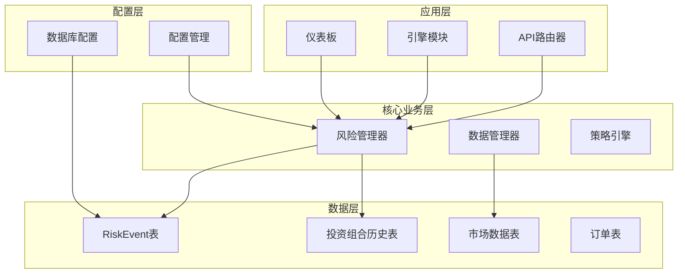
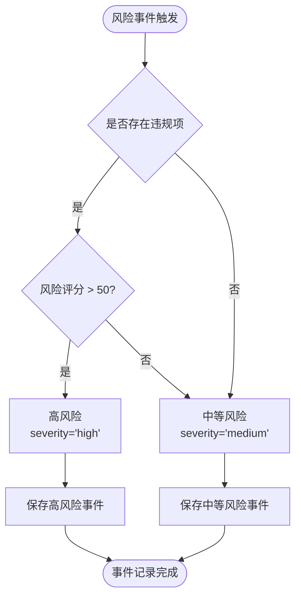
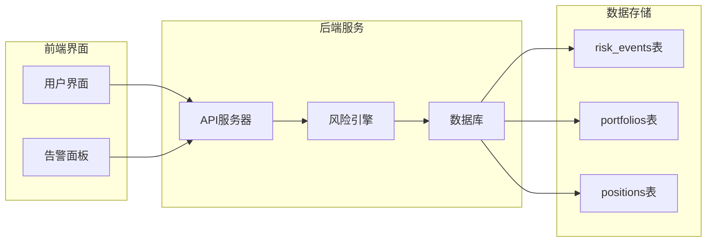
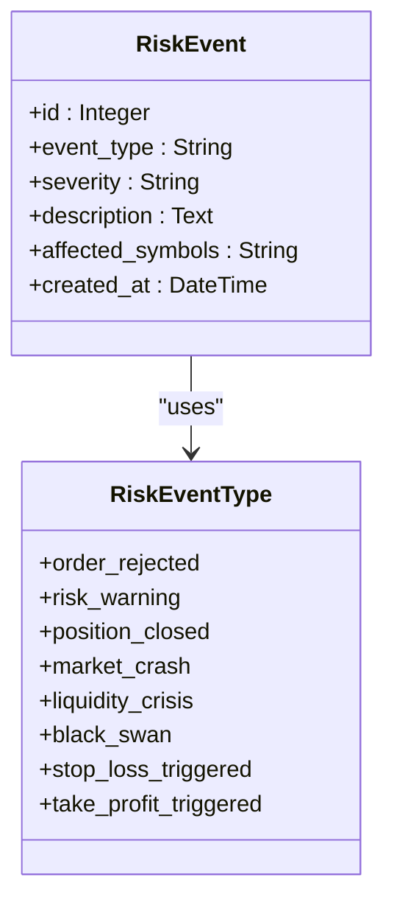
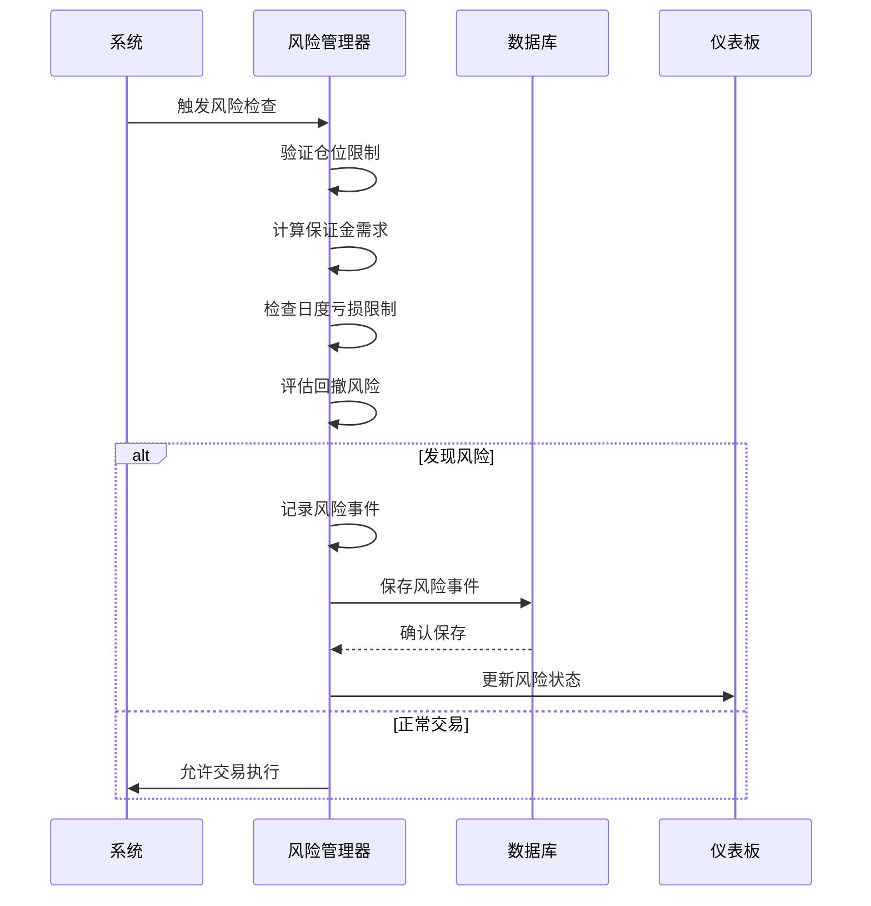
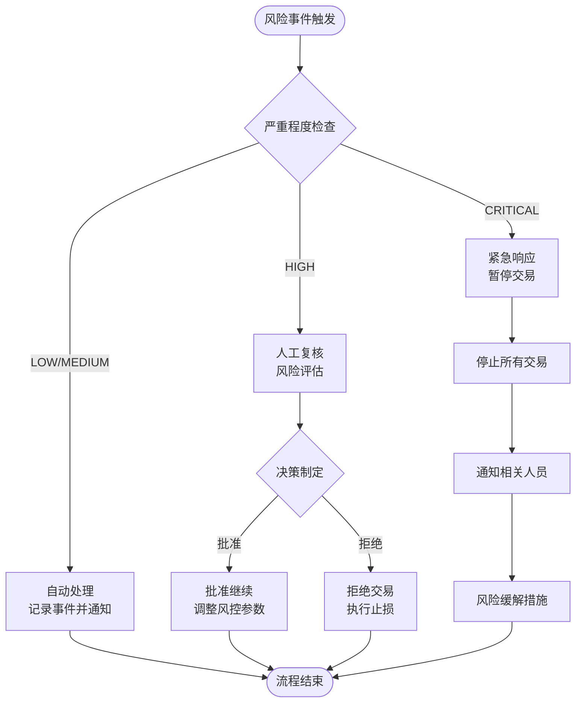
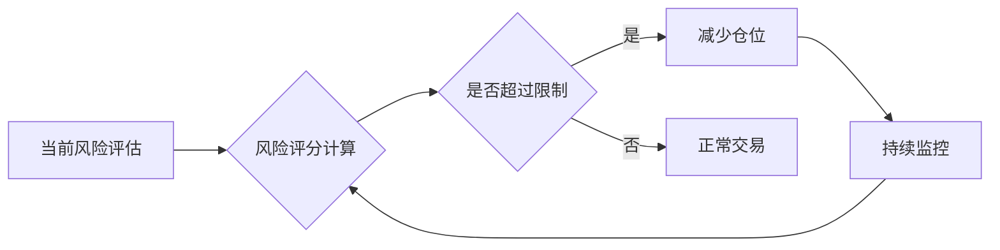
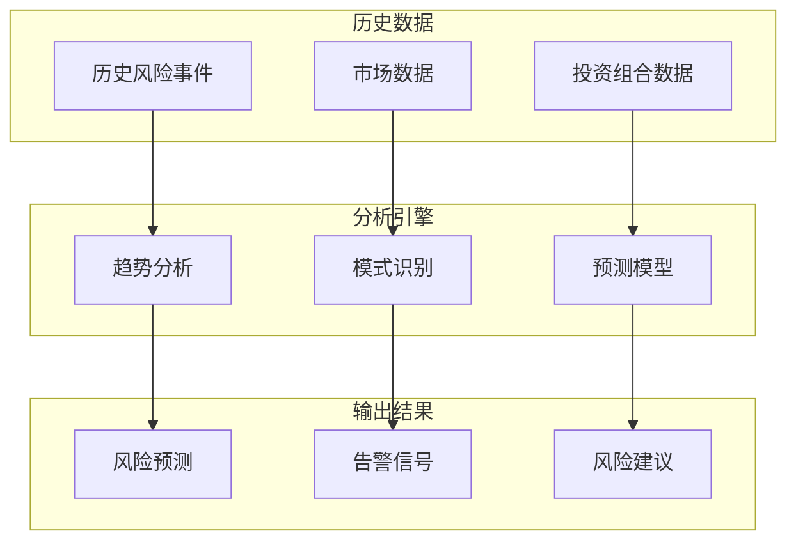
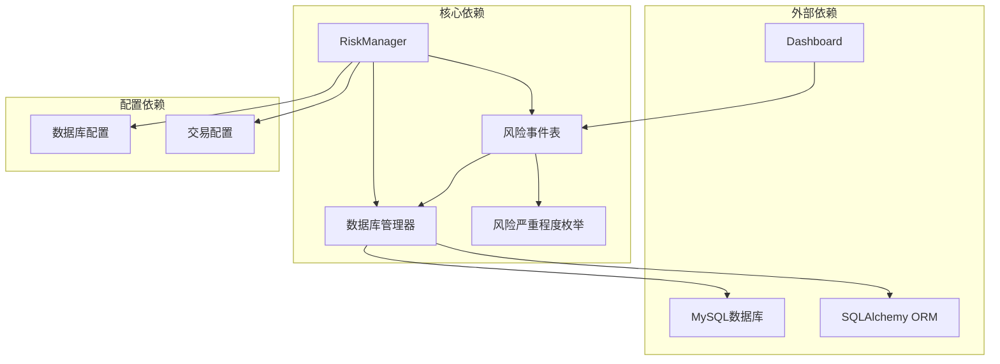

# 风险事件模型

<cite>
**本文档引用的文件**
- [models.py](file://backpack_quant_trading/database/models.py)
- [risk_manager.py](file://backpack_quant_trading/core/risk_manager.py)
- [settings.py](file://backpack_quant_trading/config/settings.py)
- [app.py](file://backpack_quant_trading/dashboard/app.py)
- [stock_predict_lgb.txt](file://backpack_quant_trading/models/stock_predict_lgb.txt)
- [daily_predict.json](file://backpack_quant_trading/models/daily_predict.json)
</cite>

## 目录
1. [简介](#简介)
2. [项目结构](#项目结构)
3. [核心组件](#核心组件)
4. [架构概览](#架构概览)
5. [详细组件分析](#详细组件分析)
6. [依赖分析](#依赖分析)
7. [性能考虑](#性能考虑)
8. [故障排除指南](#故障排除指南)
9. [结论](#结论)
10. [附录](#附录)

## 简介
本文档详细说明了风险事件数据模型的设计与实现，包括RiskEvent表的风险事件分类体系、事件类型分类标准、受影响交易对字段作用、自动检测机制、人工干预流程、监控告警配置以及风险控制策略实施方法。同时提供了历史数据分析和风险趋势预测模型的相关信息。

## 项目结构
该项目采用分层架构设计，风险事件模型位于数据库层，通过风险管理系统进行事件检测和记录，并在仪表板中进行可视化展示。



**图表来源**
- [models.py:192-207](file://backpack_quant_trading/database/models.py#L192-L207)
- [risk_manager.py:48-58](file://backpack_quant_trading/core/risk_manager.py#L48-L58)
- [settings.py:104-132](file://backpack_quant_trading/config/settings.py#L104-L132)

**章节来源**
- [models.py:1-721](file://backpack_quant_trading/database/models.py#L1-L721)
- [risk_manager.py:1-566](file://backpack_quant_trading/core/risk_manager.py#L1-L566)
- [settings.py:1-137](file://backpack_quant_trading/config/settings.py#L1-L137)

## 核心组件
风险事件模型的核心组件包括RiskEvent表、风险严重程度枚举、风险管理系统和数据库管理器。

### RiskEvent表结构
RiskEvent表是风险事件数据模型的核心，包含以下关键字段：
- id: 主键，自增整数
- source: 来源，字符串类型，默认为'backpack'
- event_type: 事件类型，字符串，非空
- severity: 严重程度，字符串，非空
- description: 描述，文本类型，非空
- affected_symbols: 受影响符号，字符串，可为空
- created_at: 创建时间，默认当前时间

### 风险严重程度分类
系统定义了完整的风险严重程度分类体系：



**图表来源**
- [risk_manager.py:314-323](file://backpack_quant_trading/core/risk_manager.py#L314-L323)

**章节来源**
- [models.py:38-43](file://backpack_quant_trading/database/models.py#L38-L43)
- [models.py:192-207](file://backpack_quant_trading/database/models.py#L192-L207)
- [risk_manager.py:302-329](file://backpack_quant_trading/core/risk_manager.py#L302-L329)

## 架构概览
风险事件模型在整个系统中的架构位置如下：



**图表来源**
- [models.py:267-473](file://backpack_quant_trading/database/models.py#L267-L473)
- [dashboard/app.py:3010-3025](file://backpack_quant_trading/dashboard/app.py#L3010-L3025)

## 详细组件分析

### 风险事件分类体系
系统实现了完整的风险事件分类体系，包括四个严重程度等级：

#### 严重程度等级定义
1. **LOW（低）**: 一般性风险提示，通常为系统监控产生的常规警告
2. **MEDIUM（中）**: 中等风险事件，需要关注但不需要立即干预
3. **HIGH（高）**: 高风险事件，需要立即关注和处理
4. **CRITICAL（严重）**: 严重风险事件，需要立即采取紧急措施

#### 触发条件
风险事件的严重程度主要由以下因素决定：
- 存在违规项（violations）
- 风险评分阈值（risk_score > 50）
- 事件类型的重要程度

### 事件类型分类标准
事件类型字段(event_type)用于标识风险事件的具体类型，常见的事件类型包括：



**图表来源**
- [risk_manager.py:206-217](file://backpack_quant_trading/core/risk_manager.py#L206-L217)

### affected_symbols字段作用
affected_symbols字段用于记录受风险事件影响的具体交易对或资产，其作用包括：

1. **精确追踪**: 精确标识受影响的交易对
2. **风险隔离**: 支持按交易对进行风险隔离和控制
3. **策略调整**: 为后续策略调整提供依据
4. **审计追踪**: 完整记录风险事件的影响范围

### 自动检测机制
系统实现了多层次的自动风险检测机制：



**图表来源**
- [risk_manager.py:132-229](file://backpack_quant_trading/core/risk_manager.py#L132-L229)
- [risk_manager.py:302-329](file://backpack_quant_trading/core/risk_manager.py#L302-L329)

### 人工干预流程
当系统检测到高风险事件时，会触发人工干预流程：



**图表来源**
- [risk_manager.py:314-323](file://backpack_quant_trading/core/risk_manager.py#L314-L323)

### 监控告警配置示例
系统支持灵活的监控告警配置：

#### 基础配置
```python
# 风险监控配置示例
risk_config = {
    'max_daily_loss': 0.5,           # 日度最大亏损限制
    'max_drawdown': 0.15,            # 最大回撤限制
    'max_position_size': 0.5,        # 最大仓位比例
    'enable_stop_loss': True,        # 启用止损
    'stop_loss_percent': 0.05,       # 止损百分比
    'take_profit_percent': 0.20,     # 止盈百分比
    'leverage': 5                   # 杠杆倍数
}
```

#### 告警阈值配置
```python
# 告警阈值配置
alert_thresholds = {
    'low_risk': {'score': 0-30, 'severity': 'LOW'},
    'medium_risk': {'score': 31-60, 'severity': 'MEDIUM'}, 
    'high_risk': {'score': 61-80, 'severity': 'HIGH'},
    'critical_risk': {'score': 81-100, 'severity': 'CRITICAL'}
}
```

### 风险控制策略实施方法
系统提供了多种风险控制策略：

#### 动态仓位控制


#### 多层次风控体系
1. **实时风控**: 基于市场数据的实时风险评估
2. **日度风控**: 基于日度表现的风险控制
3. **回撤风控**: 基于回撤情况的风险管理
4. **流动性风控**: 基于流动性状况的风险控制

**章节来源**
- [risk_manager.py:87-131](file://backpack_quant_trading/core/risk_manager.py#L87-L131)
- [risk_manager.py:132-229](file://backpack_quant_trading/core/risk_manager.py#L132-L229)
- [risk_manager.py:302-329](file://backpack_quant_trading/core/risk_manager.py#L302-L329)

### 风险事件历史数据分析
系统提供了完善的历史数据分析功能：

#### 历史事件查询
```sql
-- 查询特定时间段内的风险事件
SELECT * FROM risk_events 
WHERE created_at BETWEEN '2024-01-01' AND '2024-12-31'
ORDER BY created_at DESC;

-- 按严重程度统计风险事件
SELECT severity, COUNT(*) as count 
FROM risk_events 
GROUP BY severity;
```

#### 风险趋势分析
系统支持基于历史数据的风险趋势预测：



**图表来源**
- [models.py:210-225](file://backpack_quant_trading/database/models.py#L210-L225)

### 风险趋势预测模型
系统集成了机器学习预测模型用于风险趋势分析：

#### LightGBM模型特征
预测模型使用以下特征进行风险预测：

| 特征类别 | 特征名称 | 重要性权重 |
|---------|---------|-----------|
| 价格变动 | ret_1d, ret_5d, ret_20d | 高 |
| 波动率 | volatility_5d, volatility_20d | 高 |
| 技术指标 | rsi, macd_hist, macd_dif, macd_dea | 中高 |
| KDJ指标 | kdj_k, kdj_d, kdj_j | 中 |
| 成交量 | volume_ratio_5 | 中 |
| 均线指标 | ma5_ma20_cross, close_ma5_ratio, close_ma20_ratio | 中 |

#### 预测结果格式
```json
{
  "date": "2026-03-05",
  "list": [
    {
      "code": "600010",
      "name": "包钢股份",
      "proba_up": 0.2607,
      "close": 3.09,
      "date": "2026-03-05"
    }
  ]
}
```

**章节来源**
- [stock_predict_lgb.txt:71-87](file://backpack_quant_trading/models/stock_predict_lgb.txt#L71-L87)
- [daily_predict.json:1-145](file://backpack_quant_trading/models/daily_predict.json#L1-L145)

## 依赖分析
风险事件模型与其他组件的依赖关系如下：



**图表来源**
- [models.py:38-43](file://backpack_quant_trading/database/models.py#L38-L43)
- [models.py:267-473](file://backpack_quant_trading/database/models.py#L267-L473)
- [risk_manager.py:48-58](file://backpack_quant_trading/core/risk_manager.py#L48-L58)

**章节来源**
- [models.py:1-721](file://backpack_quant_trading/database/models.py#L1-L721)
- [risk_manager.py:1-566](file://backpack_quant_trading/core/risk_manager.py#L1-L566)

## 性能考虑
风险事件模型在设计时充分考虑了性能优化：

### 数据库性能优化
1. **索引优化**: 为event_type和created_at字段建立复合索引
2. **查询优化**: 提供高效的查询接口和批量操作
3. **连接池管理**: 使用连接池提高数据库访问效率

### 内存管理
1. **事件缓冲**: 限制风险事件数组大小，避免内存泄漏
2. **及时清理**: 定期清理过期的风险事件数据
3. **资源释放**: 确保数据库连接正确关闭

### 实时性能
1. **异步处理**: 支持异步风险事件记录
2. **批处理**: 支持批量风险事件处理
3. **缓存机制**: 缓存常用的配置和统计数据

## 故障排除指南
常见问题及解决方案：

### 风险事件记录失败
**问题**: 风险事件无法保存到数据库
**解决方案**:
1. 检查数据库连接配置
2. 验证数据库表结构完整性
3. 查看数据库日志获取详细错误信息

### 性能问题
**问题**: 风险事件查询响应缓慢
**解决方案**:
1. 检查数据库索引是否完整
2. 优化查询条件和过滤器
3. 考虑添加适当的数据库索引

### 内存泄漏
**问题**: 风险事件数组不断增长
**解决方案**:
1. 检查事件记录逻辑
2. 确保事件数组大小限制生效
3. 定期清理过期事件数据

**章节来源**
- [models.py:456-473](file://backpack_quant_trading/database/models.py#L456-L473)
- [risk_manager.py:327-329](file://backpack_quant_trading/core/risk_manager.py#L327-L329)

## 结论
风险事件数据模型为量化交易系统提供了完整、可靠的风险管理基础设施。通过四层严重程度分类、自动检测机制、人工干预流程和历史数据分析功能，系统能够有效识别、记录和处理各种风险事件。结合机器学习预测模型，系统还具备了风险趋势预测能力，为投资决策提供了有力支持。

该模型设计合理、扩展性强，能够适应不同规模和复杂度的量化交易需求，是构建稳健量化交易系统的重要组成部分。

## 附录

### 配置参数参考
- **MAX_DAILY_LOSS**: 日度最大亏损限制 (默认: 0.5)
- **MAX_DRAWDOWN**: 最大回撤限制 (默认: 0.15)  
- **MAX_POSITION_SIZE**: 最大仓位比例 (默认: 0.5)
- **STOP_LOSS_PERCENT**: 止损百分比 (默认: 0.05)
- **TAKE_PROFIT_PERCENT**: 止盈百分比 (默认: 0.20)
- **LEVERAGE**: 杠杆倍数 (默认: 5)

### API接口参考
- **POST /api/risk/events**: 创建风险事件
- **GET /api/risk/events**: 查询风险事件
- **GET /api/risk/report**: 获取风险报告