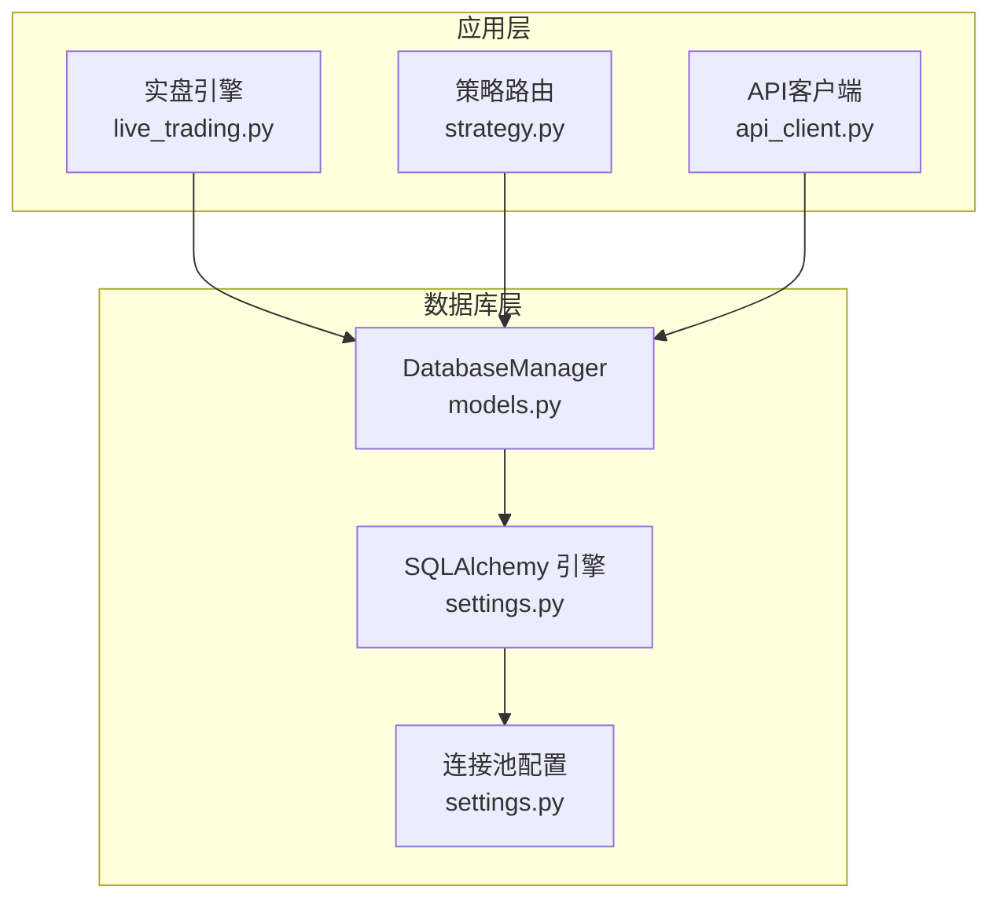
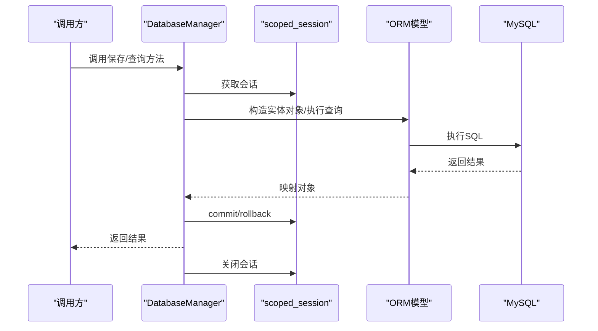
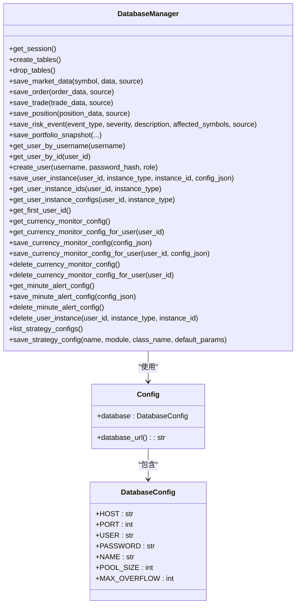

# 数据库操作接口

<cite>
**本文档引用的文件**
- [models.py](file://backpack_quant_trading/database/models.py)
- [settings.py](file://backpack_quant_trading/config/settings.py)
- [init_db.py](file://init_db.py)
- [migrate_user_instances.py](file://backpack_quant_trading/database/migrate_user_instances.py)
- [strategy.py](file://backpack_quant_trading/api/routers/strategy.py)
- [live_trading.py](file://backpack_quant_trading/engine/live_trading.py)
- [api_client.py](file://backpack_quant_trading/core/api_client.py)
</cite>

## 目录
1. [简介](#简介)
2. [项目结构](#项目结构)
3. [核心组件](#核心组件)
4. [架构总览](#架构总览)
5. [详细组件分析](#详细组件分析)
6. [依赖关系分析](#依赖关系分析)
7. [性能考虑](#性能考虑)
8. [故障排除指南](#故障排除指南)
9. [结论](#结论)
10. [附录](#附录)

## 简介
本文件为数据库管理器 DatabaseManager 的全面操作接口文档，涵盖数据保存方法（如保存市场数据、订单、持仓、成交等）、查询方法（如按用户名获取用户、获取用户实例ID列表等）以及管理方法（如创建/删除表、连接池管理）。文档还解释了事务处理机制、异常处理策略、连接池配置，并提供完整的API使用示例与错误处理指南，最后总结性能优化技巧与最佳实践。

## 项目结构
数据库相关的核心文件位于 backpack_quant_trading/database/models.py，数据库连接配置位于 backpack_quant_trading/config/settings.py，初始化脚本位于 init_db.py，迁移脚本位于 backpack_quant_trading/database/migrate_user_instances.py。实际业务引擎与API路由通过 db_manager 实例调用数据库管理器。

**图表来源**
- [models.py:267-280](file://backpack_quant_trading/database/models.py#L267-L280)
- [settings.py:44-53](file://backpack_quant_trading/config/settings.py#L44-L53)

**章节来源**
- [models.py:1-721](file://backpack_quant_trading/database/models.py#L1-L721)
- [settings.py:1-137](file://backpack_quant_trading/config/settings.py#L1-L137)

## 核心组件
- DatabaseManager：封装数据库连接、会话管理、事务控制、数据保存与查询方法。
- SQLAlchemy 模型：MarketData、Order、Position、Trade、AccountBalance、StrategyPerformance、RiskEvent、PortfolioHistory、User、UserInstance、StrategyConfig。
- 配置系统：DatabaseConfig 提供连接参数，Config.database_url 生成连接URL。

关键职责与特性
- 连接池管理：通过 create_engine 的 pool_size 与 max_overflow 控制并发连接数。
- 事务处理：每个方法内部使用 try/except/finally 确保 commit/rollback 与 session.close 的一致性。
- 数据完整性：对超长字段进行截断处理，避免数据库约束错误；对重复记录进行检测与跳过。
- 查询优化：为高频查询建立索引（如 symbol、status、timestamp 等）。

**章节来源**
- [models.py:267-280](file://backpack_quant_trading/database/models.py#L267-L280)
- [models.py:293-454](file://backpack_quant_trading/database/models.py#L293-L454)
- [models.py:500-684](file://backpack_quant_trading/database/models.py#L500-L684)
- [settings.py:44-53](file://backpack_quant_trading/config/settings.py#L44-L53)

## 架构总览
DatabaseManager 通过 SQLAlchemy ORM 对接 MySQL 数据库，采用 scoped_session 管理会话生命周期，结合连接池实现高并发下的稳定访问。业务模块通过 db_manager 单例调用数据库操作方法，确保数据一致性与事务隔离。

**图表来源**
- [models.py:281-314](file://backpack_quant_trading/database/models.py#L281-L314)
- [models.py:316-348](file://backpack_quant_trading/database/models.py#L316-L348)
- [models.py:500-510](file://backpack_quant_trading/database/models.py#L500-L510)

## 详细组件分析

### 数据保存方法

#### save_market_data(symbol, data, source)
- 功能：批量保存市场K线数据。
- 参数：
  - symbol: 交易对字符串
  - data: 列表，元素为包含 timestamp、open、high、low、close、volume 的字典
  - source: 数据源标识，默认 'backpack'
- 返回值：无（内部 commit）
- 事务与异常：try/except/finally 确保 rollback 与 session.close
- 性能要点：逐条 merge，适合批量写入；注意数据量过大时的内存占用

**章节来源**
- [models.py:293-315](file://backpack_quant_trading/database/models.py#L293-L315)

#### save_order(order_data, source)
- 功能：保存订单信息。
- 参数：
  - order_data: 字典，包含 order_id、client_id、symbol、side、type、quantity、price、status、filledQuantity、avgPrice、commission、commissionAsset、tx_hash、createdTime 等
  - source: 数据源标识，默认 'backpack'
- 返回值：无（内部 commit）
- 事务与异常：同上
- 安全措施：对 order_id 与 tx_hash 截断至 250 字符，防止数据库长度溢出

**章节来源**
- [models.py:316-348](file://backpack_quant_trading/database/models.py#L316-L348)

#### save_trade(trade_data, source)
- 功能：保存成交记录。
- 参数：
  - trade_data: 字典，包含 tradeId、orderId、symbol、side、quantity、price、commission、commissionAsset、isMaker、close_price、pnl_percent、pnl_amount、reason、timestamp 等
  - source: 数据源标识，默认 'backpack'
- 返回值：无（内部 commit）
- 事务与异常：同上
- 安全措施：对 trade_id 与 order_id 截断至 250 字符；若 trade_id 已存在则静默跳过，避免重复插入

**章节来源**
- [models.py:350-387](file://backpack_quant_trading/database/models.py#L350-L387)

#### save_position(position_data, source)
- 功能：保存或更新持仓信息。
- 参数：
  - position_data: 字典，包含 symbol、side、quantity、entry_price、current_price、unrealized_pnl、unrealized_pnl_percent、stop_loss、take_profit、closed_at、opened_at 等
  - source: 数据源标识，默认 'backpack'
- 返回值：无（内部 commit）
- 事务与异常：同上
- 逻辑要点：若存在未平仓相同 symbol+side+source 的记录则更新，否则新增；支持毫秒时间戳自动转换

**章节来源**
- [models.py:389-454](file://backpack_quant_trading/database/models.py#L389-L454)

#### save_risk_event(event_type, severity, description, affected_symbols, source)
- 功能：保存风险事件。
- 参数：event_type、severity、description、affected_symbols、source
- 返回值：无（内部 commit）

**章节来源**
- [models.py:456-473](file://backpack_quant_trading/database/models.py#L456-L473)

#### save_portfolio_snapshot(portfolio_value, cash_balance, position_value, daily_pnl, daily_return, source)
- 功能：保存组合净值快照。
- 参数：portfolio_value、cash_balance、position_value、daily_pnl、daily_return、source
- 返回值：无（内部 commit）

**章节来源**
- [models.py:475-496](file://backpack_quant_trading/database/models.py#L475-L496)

### 查询与管理方法

#### get_user_by_username(username)
- 功能：按用户名获取用户对象。
- 返回：User 对象或 None；内部使用 session.refresh + session.expunge 返回可序列化对象

**章节来源**
- [models.py:500-510](file://backpack_quant_trading/database/models.py#L500-L510)

#### get_user_by_id(user_id)
- 功能：按用户ID获取用户对象。
- 返回：User 对象或 None

**章节来源**
- [models.py:512-522](file://backpack_quant_trading/database/models.py#L512-L522)

#### create_user(username, password_hash, role)
- 功能：创建新用户。
- 返回：创建的 User 对象

**章节来源**
- [models.py:524-538](file://backpack_quant_trading/database/models.py#L524-L538)

#### save_user_instance(user_id, instance_type, instance_id, config_json)
- 功能：保存用户实例归属（实盘/网格/币种监视），若已存在则更新配置。
- 返回：无

**章节来源**
- [models.py:540-557](file://backpack_quant_trading/database/models.py#L540-L557)

#### get_user_instance_ids(user_id, instance_type)
- 功能：获取某用户某类型的所有 instance_id。
- 返回：列表

**章节来源**
- [models.py:559-566](file://backpack_quant_trading/database/models.py#L559-L566)

#### get_user_instance_configs(user_id, instance_type)
- 功能：获取某用户某类型的所有实例配置 (instance_id, config_json)。
- 返回：列表

**章节来源**
- [models.py:568-575](file://backpack_quant_trading/database/models.py#L568-L575)

#### get_first_user_id()
- 功能：获取系统中第一个用户的 id。
- 返回：整数或 None

**章节来源**
- [models.py:577-584](file://backpack_quant_trading/database/models.py#L577-L584)

#### get_currency_monitor_config() / get_currency_monitor_config_for_user(user_id)
- 功能：获取币种监视的全局配置或指定用户的币种监视配置。
- 返回：(instance_id, config_json) 或 None

**章节来源**
- [models.py:586-606](file://backpack_quant_trading/database/models.py#L586-L606)

#### save_currency_monitor_config(config_json) / save_currency_monitor_config_for_user(user_id, config_json)
- 功能：保存币种监视的全局配置或指定用户的币种监视配置。
- 返回：无

**章节来源**
- [models.py:608-618](file://backpack_quant_trading/database/models.py#L608-L618)

#### delete_currency_monitor_config() / delete_currency_monitor_config_for_user(user_id)
- 功能：删除币种监视的全局配置或指定用户的币种监视配置。
- 返回：无

**章节来源**
- [models.py:620-636](file://backpack_quant_trading/database/models.py#L620-L636)

#### get_minute_alert_config() / save_minute_alert_config(config_json) / delete_minute_alert_config()
- 功能：获取/保存/删除 1分钟预警的全局配置。
- 返回：(instance_id, config_json) 或 None

**章节来源**
- [models.py:639-669](file://backpack_quant_trading/database/models.py#L639-L669)

#### delete_user_instance(user_id, instance_type, instance_id)
- 功能：删除用户实例归属（停止时调用）。
- 返回：无

**章节来源**
- [models.py:671-683](file://backpack_quant_trading/database/models.py#L671-L683)

#### list_strategy_configs()
- 功能：获取所有策略配置。
- 返回：列表

**章节来源**
- [models.py:685-691](file://backpack_quant_trading/database/models.py#L685-L691)

#### save_strategy_config(name, module, class_name, default_params)
- 功能：保存或更新策略配置。
- 返回：StrategyConfig 对象

**章节来源**
- [models.py:693-717](file://backpack_quant_trading/database/models.py#L693-L717)

### 事务处理机制与异常处理策略
- 会话管理：每个方法通过 get_session() 获取 scoped_session，确保线程安全与上下文一致性。
- 事务控制：每个方法内部使用 try/except/finally，成功时 commit，异常时 rollback，最终 close 会话，避免资源泄漏。
- 并发安全：连接池由 SQLAlchemy 管理，通过 pool_size 与 max_overflow 控制并发；pool_pre_ping=true 自动检测连接失效并重连。
- 数据完整性：对超长字段进行截断；对重复 trade_id 进行检测；对时间戳进行统一转换。

**章节来源**
- [models.py:281-314](file://backpack_quant_trading/database/models.py#L281-L314)
- [models.py:316-348](file://backpack_quant_trading/database/models.py#L316-L348)
- [models.py:350-387](file://backpack_quant_trading/database/models.py#L350-L387)
- [models.py:389-454](file://backpack_quant_trading/database/models.py#L389-L454)
- [models.py:270-279](file://backpack_quant_trading/database/models.py#L270-L279)

### 连接池管理
- 连接参数：POOL_SIZE=20，MAX_OVERFLOW=30，pool_pre_ping=True，echo=False。
- 连接URL：由 Config.database_url 生成，包含主机、端口、用户名、密码与数据库名。
- 初始化：DatabaseManager 在 __init__ 中创建引擎与 scoped_session。

**章节来源**
- [settings.py:44-53](file://backpack_quant_trading/config/settings.py#L44-L53)
- [settings.py:124-130](file://backpack_quant_trading/config/settings.py#L124-L130)
- [models.py:270-279](file://backpack_quant_trading/database/models.py#L270-L279)

### API 使用示例与最佳实践

- 初始化数据库表
  - 使用 init_db.py 删除旧 users 表并重建所有表，适用于开发环境快速重置。
  - 使用 migrate_user_instances.py 仅创建 user_instances 表，不删除现有数据。

- 实盘引擎中的使用
  - 下单后保存订单：在下单成功后调用 db_manager.save_order(...)。
  - 更新持仓：在订单成交或仓位变化时调用 db_manager.save_position(...)。
  - 保存成交：在收到成交回报时调用 db_manager.save_trade(...)。

- API 路由中的使用
  - 在策略路由中确保表存在：Base.metadata.create_all(db_manager.engine)。
  - 用户鉴权：通过 db.get_user_by_username(...) 获取用户信息。

- 最佳实践
  - 批量写入：save_market_data 传入列表，减少会话开销。
  - 防重复：save_trade 对 trade_id 去重，避免重复入库。
  - 字段截断：save_order/save_trade 对超长字段进行截断，防止数据库约束错误。
  - 时间戳处理：统一转换为 datetime，支持秒/毫秒时间戳。
  - 事务一致性：每个方法内部保证 commit/rollback 与 session.close 的成对出现。

**章节来源**
- [init_db.py:1-25](file://init_db.py#L1-L25)
- [migrate_user_instances.py:1-15](file://backpack_quant_trading/database/migrate_user_instances.py#L1-L15)
- [strategy.py:108-109](file://backpack_quant_trading/api/routers/strategy.py#L108-L109)
- [live_trading.py:1069-1075](file://backpack_quant_trading/engine/live_trading.py#L1069-L1075)
- [api_client.py:1221-1224](file://backpack_quant_trading/core/api_client.py#L1221-L1224)

## 依赖关系分析

**图表来源**
- [models.py:267-720](file://backpack_quant_trading/database/models.py#L267-L720)
- [settings.py:44-53](file://backpack_quant_trading/config/settings.py#L44-L53)
- [settings.py:124-130](file://backpack_quant_trading/config/settings.py#L124-L130)

**章节来源**
- [models.py:267-720](file://backpack_quant_trading/database/models.py#L267-L720)
- [settings.py:44-53](file://backpack_quant_trading/config/settings.py#L44-L53)

## 性能考虑
- 连接池参数：POOL_SIZE=20，MAX_OVERFLOW=30，适合中等并发场景；可根据业务峰值调整。
- 事务粒度：每个方法独立事务，避免长时间持有锁；批量写入时建议合并多次调用。
- 索引优化：模型中已为高频查询字段建立索引（如 symbol/status/source、timestamp 等），提升查询效率。
- 数据类型：使用 Numeric(20,8)/Numeric(10,4) 存储浮点数值，避免精度丢失；使用 DateTime 存储时间戳。
- 缓存策略：业务层（如 DataManager）提供市场数据缓存，减少数据库压力。

[本节为通用性能指导，无需特定文件来源]

## 故障排除指南
- 连接失败
  - 检查数据库连接URL与凭据配置，确认 HOST/PORT/USER/PASSWORD/NAME。
  - 确认网络可达与防火墙放行。
- 字段长度溢出
  - 订单/成交等字段存在长度限制，确保传入数据不超过 250 字符。
- 重复数据
  - 成交去重：若 trade_id 已存在则静默跳过；可通过唯一约束或业务逻辑避免重复。
- 事务未提交
  - 确保异常被捕获并执行 rollback，同时 finally 中关闭会话。
- 表结构变更
  - 开发环境可用 init_db.py 重建表；生产环境谨慎使用，优先使用迁移脚本。

**章节来源**
- [models.py:320-322](file://backpack_quant_trading/database/models.py#L320-L322)
- [models.py:354-362](file://backpack_quant_trading/database/models.py#L354-L362)
- [models.py:310-314](file://backpack_quant_trading/database/models.py#L310-L314)
- [init_db.py:10-21](file://init_db.py#L10-L21)

## 结论
DatabaseManager 提供了完善的数据库操作接口，覆盖数据保存、查询与管理功能，并通过连接池与事务机制保障稳定性与一致性。配合业务层的缓存与索引策略，可在高并发场景下保持良好性能。建议在生产环境中谨慎管理表结构变更，遵循字段截断与去重等最佳实践，确保数据完整性与系统健壮性。

[本节为总结性内容，无需特定文件来源]

## 附录

### 数据模型与索引概览
- MarketData：按 symbol/timestamp/source 建立复合索引，适合高频查询。
- Order/Trade/Position/RiskEvent：针对 symbol/status/source、timestamp 等字段建立索引，提升查询效率。
- User/UserInstance/StrategyConfig：按主键与常用过滤字段建立索引。

**章节来源**
- [models.py:60-62](file://backpack_quant_trading/database/models.py#L60-L62)
- [models.py:87-90](file://backpack_quant_trading/database/models.py#L87-L90)
- [models.py:118-121](file://backpack_quant_trading/database/models.py#L118-L121)
- [models.py:148-151](file://backpack_quant_trading/database/models.py#L148-L151)
- [models.py:204-207](file://backpack_quant_trading/database/models.py#L204-L207)
- [models.py:251](file://backpack_quant_trading/database/models.py#L251)

### 初始化与迁移脚本
- init_db.py：删除旧 users 表并重建所有表，适合开发环境快速重置。
- migrate_user_instances.py：仅创建 user_instances 表，不删除现有数据。

**章节来源**
- [init_db.py:1-25](file://init_db.py#L1-L25)
- [migrate_user_instances.py:1-15](file://backpack_quant_trading/database/migrate_user_instances.py#L1-L15)