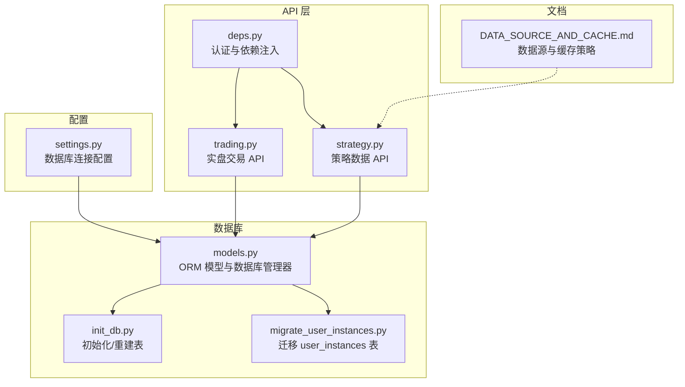
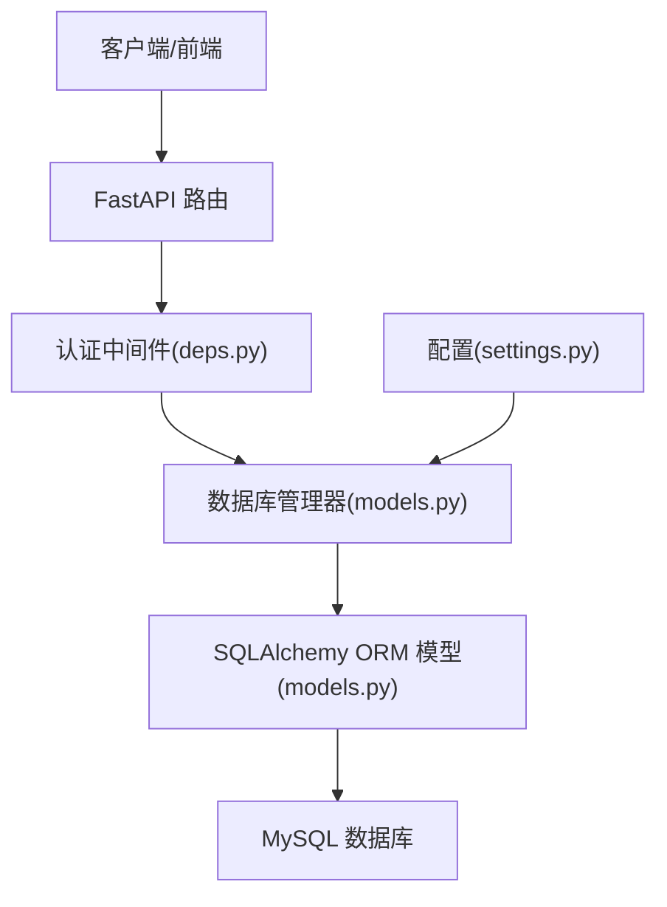
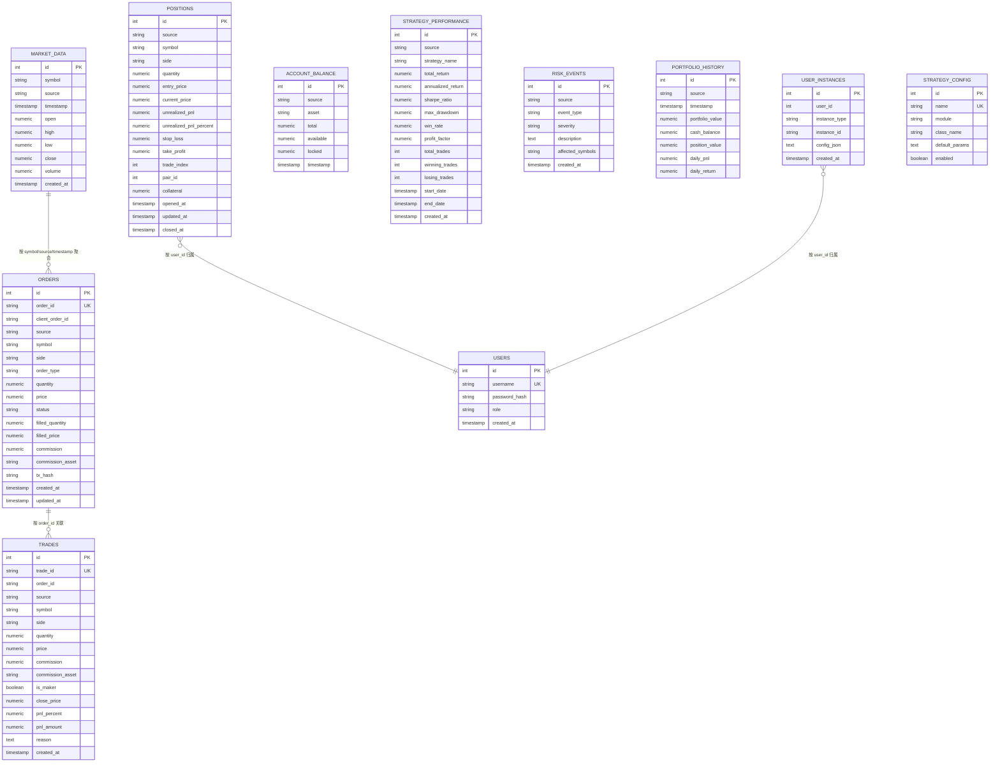
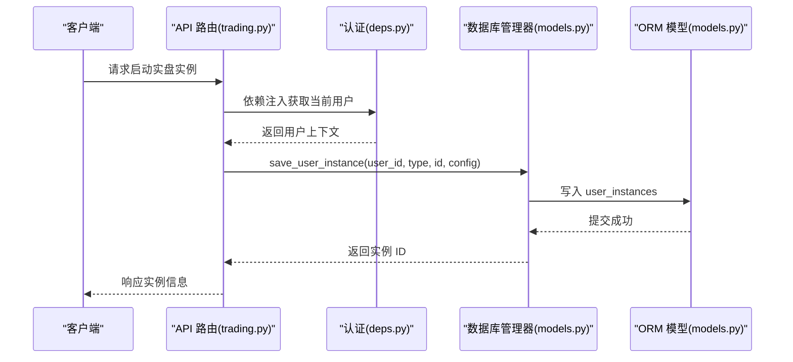
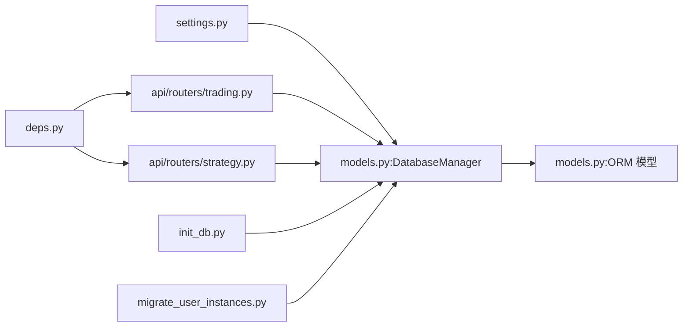

# 数据模型设计

<cite>
**本文引用的文件**
- [models.py](file://backpack_quant_trading/database/models.py)
- [settings.py](file://backpack_quant_trading/config/settings.py)
- [init_db.py](file://init_db.py)
- [migrate_user_instances.py](file://backpack_quant_trading/database/migrate_user_instances.py)
- [DATA_SOURCE_AND_CACHE.md](file://backpack_quant_trading/docs/DATA_SOURCE_AND_CACHE.md)
- [deps.py](file://backpack_quant_trading/api/deps.py)
- [trading.py](file://backpack_quant_trading/api/routers/trading.py)
- [strategy.py](file://backpack_quant_trading/api/routers/strategy.py)
</cite>

## 目录
1. [简介](#简介)
2. [项目结构](#项目结构)
3. [核心组件](#核心组件)
4. [架构总览](#架构总览)
5. [详细组件分析](#详细组件分析)
6. [依赖分析](#依赖分析)
7. [性能考虑](#性能考虑)
8. [故障排查指南](#故障排查指南)
9. [结论](#结论)
10. [附录](#附录)

## 简介
本文件面向量化交易系统的数据模型设计，系统以 SQLAlchemy ORM 映射 MySQL 数据库，围绕市场数据、订单、成交、持仓、账户余额、策略性能、风险事件、组合净值、用户与实例归属、策略配置等核心实体构建。本文将详细说明各表的实体关系、字段定义与数据类型、主键/外键、索引与约束、数据验证与业务规则，并给出数据库模式图、示例数据、数据访问模式、缓存策略与性能考量、数据生命周期与归档路径、迁移与版本管理、以及数据安全与隐私要求。

## 项目结构
数据库相关的核心文件集中在 database 目录，配合 config 提供数据库连接配置，API 层通过依赖注入与数据库管理器进行数据访问，文档中还包含数据源与缓存策略说明。

图表来源
- [settings.py:124-130](file://backpack_quant_trading/config/settings.py#L124-L130)
- [models.py:267-288](file://backpack_quant_trading/database/models.py#L267-L288)
- [init_db.py:9-24](file://init_db.py#L9-L24)
- [migrate_user_instances.py:8-14](file://backpack_quant_trading/database/migrate_user_instances.py#L8-L14)
- [deps.py:44-73](file://backpack_quant_trading/api/deps.py#L44-L73)
- [trading.py:105-200](file://backpack_quant_trading/api/routers/trading.py#L105-L200)
- [strategy.py:22-110](file://backpack_quant_trading/api/routers/strategy.py#L22-L110)
- [DATA_SOURCE_AND_CACHE.md:1-71](file://backpack_quant_trading/docs/DATA_SOURCE_AND_CACHE.md#L1-L71)

章节来源
- [settings.py:124-130](file://backpack_quant_trading/config/settings.py#L124-L130)
- [models.py:267-288](file://backpack_quant_trading/database/models.py#L267-L288)
- [init_db.py:9-24](file://init_db.py#L9-L24)
- [migrate_user_instances.py:8-14](file://backpack_quant_trading/database/migrate_user_instances.py#L8-L14)
- [deps.py:44-73](file://backpack_quant_trading/api/deps.py#L44-L73)
- [trading.py:105-200](file://backpack_quant_trading/api/routers/trading.py#L105-L200)
- [strategy.py:22-110](file://backpack_quant_trading/api/routers/strategy.py#L22-L110)
- [DATA_SOURCE_AND_CACHE.md:1-71](file://backpack_quant_trading/docs/DATA_SOURCE_AND_CACHE.md#L1-L71)

## 核心组件
- 数据库管理器：负责连接池配置、会话管理、表创建/删除、批量写入与查询辅助方法。
- 实体模型：涵盖市场数据、订单、成交、持仓、账户余额、策略性能、风险事件、组合净值、用户、用户实例归属、策略配置等。
- 认证与依赖注入：基于 JWT 的用户认证，API 路由依赖当前用户上下文。
- 数据访问模式：API 路由通过依赖注入获取当前用户，再调用数据库管理器执行 CRUD 与聚合查询。
- 缓存与数据源：策略数据 API 提供 K 线与回测交易的导入、同步与查询，文档说明了 A 股 K 线的缓存与增量策略。

章节来源
- [models.py:267-721](file://backpack_quant_trading/database/models.py#L267-L721)
- [deps.py:44-73](file://backpack_quant_trading/api/deps.py#L44-L73)
- [trading.py:105-200](file://backpack_quant_trading/api/routers/trading.py#L105-L200)
- [strategy.py:22-110](file://backpack_quant_trading/api/routers/strategy.py#L22-L110)
- [DATA_SOURCE_AND_CACHE.md:1-71](file://backpack_quant_trading/docs/DATA_SOURCE_AND_CACHE.md#L1-L71)

## 架构总览
系统采用“配置驱动连接 + ORM 模型 + API 路由 + 数据库管理器”的分层架构。API 层负责鉴权与业务编排，数据库管理器封装数据持久化细节，模型层定义实体与索引，配置层提供数据库连接参数。

图表来源
- [deps.py:44-73](file://backpack_quant_trading/api/deps.py#L44-L73)
- [models.py:267-288](file://backpack_quant_trading/database/models.py#L267-L288)
- [settings.py:124-130](file://backpack_quant_trading/config/settings.py#L124-L130)

## 详细组件分析

### 数据库模式与实体关系
系统以 MySQL 为持久化存储，使用 SQLAlchemy ORM 映射以下核心实体：

- 市场数据表（market_data）
- 订单表（orders）
- 成交记录表（trades）
- 仓位表（positions）
- 账户余额表（account_balance）
- 策略性能表（strategy_performance）
- 风险事件表（risk_events）
- 组合历史净值表（portfolio_history）
- 用户表（users）
- 用户实例归属表（user_instances）
- 策略配置表（strategy_config）

图表来源
- [models.py:45-264](file://backpack_quant_trading/database/models.py#L45-L264)

章节来源
- [models.py:45-264](file://backpack_quant_trading/database/models.py#L45-L264)

### 字段定义、数据类型与约束
- 主键与唯一性
  - 所有实体均定义主键（自增整数）。
  - 订单与成交表的关键字段（order_id、trade_id）定义为唯一索引，避免重复写入。
- 字段与数据类型
  - 数值型统一使用 Numeric(precision, scale)，保证高精度金融数值存储。
  - 时间戳使用 DateTime，部分表包含 created_at/updated_at。
  - 文本型使用 String(length)、Text，枚举型使用字符串存储（如 side、type、status、severity、role）。
- 索引与约束
  - 多表定义复合索引以支持高频查询（如 symbol+timestamp+source、symbol+status+source 等）。
  - 用户名字段建立唯一索引，确保登录唯一性。
  - 用户实例归属表对 user_id、instance_type、instance_id 建立复合索引，支持快速查询与去重。
- 业务规则与验证
  - 数据入库前进行长度截断（如 order_id、tx_hash、trade_id），防止超长导致的数据库异常。
  - 成交表写入前检查 trade_id 是否已存在，避免重复插入。
  - 持仓更新逻辑：同一 symbol+side+source 且未平仓的记录视为同一持仓，进行更新而非重复创建。
  - 用户实例归属表支持按用户隔离，同时提供全局共享配置（如币种监视）的读写接口。

章节来源
- [models.py:293-454](file://backpack_quant_trading/database/models.py#L293-L454)
- [models.py:456-496](file://backpack_quant_trading/database/models.py#L456-L496)
- [models.py:540-576](file://backpack_quant_trading/database/models.py#L540-L576)
- [models.py:608-636](file://backpack_quant_trading/database/models.py#L608-L636)
- [models.py:640-670](file://backpack_quant_trading/database/models.py#L640-L670)

### 示例数据
- 市场数据：包含 symbol、source、timestamp、OHLCV 等字段，典型用于回测与实时监控。
- 订单：包含 order_id、symbol、side、type、quantity、price、status、filled_*、commission 等字段。
- 成交：包含 trade_id、order_id、symbol、side、quantity、price、commission、is_maker、close_price、pnl_*、reason 等字段。
- 持仓：包含 symbol、side、quantity、entry_price、current_price、unrealized_pnl、stop_loss、take_profit、trade_index、pair_id、collateral、opened_at/closed_at 等字段。
- 账户余额：包含 asset、total、available、locked、timestamp。
- 策略性能：包含 strategy_name、return 指标、夏普比率、最大回撤、胜率、盈亏比、交易次数、起止时间等。
- 风险事件：包含 event_type、severity、description、affected_symbols。
- 组合净值：包含 timestamp、portfolio_value、cash_balance、position_value、daily_pnl、daily_return。
- 用户与实例：users、user_instances、strategy_config。

章节来源
- [models.py:45-264](file://backpack_quant_trading/database/models.py#L45-L264)

### 数据访问模式
- 会话管理：数据库管理器提供 get_session 方法，结合 scoped_session 确保线程安全。
- 写入模式：save_* 方法统一处理数据入库，包含异常捕获与回滚，finally 中关闭会话。
- 查询模式：API 路由通过依赖注入获取当前用户，再调用 db.get_user_*、db.get_user_instance_ids 等方法进行查询。
- 批量写入：save_market_data 支持批量 OHLCV 写入，merge 保证幂等。

图表来源
- [trading.py:105-200](file://backpack_quant_trading/api/routers/trading.py#L105-L200)
- [deps.py:44-73](file://backpack_quant_trading/api/deps.py#L44-L73)
- [models.py:540-576](file://backpack_quant_trading/database/models.py#L540-L576)

章节来源
- [trading.py:105-200](file://backpack_quant_trading/api/routers/trading.py#L105-L200)
- [deps.py:44-73](file://backpack_quant_trading/api/deps.py#L44-L73)
- [models.py:540-576](file://backpack_quant_trading/database/models.py#L540-L576)

### 缓存策略与性能考虑
- 策略数据缓存（文档说明）
  - 使用 SQLite 本地缓存 A 股日线，支持全量与增量更新，避免频繁请求外部数据源。
  - 增量逻辑：仅写入 trade_date > 缓存最大日期的记录，减少 IO。
  - 可插拔数据源：优先 pytdx，失败或未安装时尝试 Tushare，兜底 AKShare。
- 数据库性能
  - 多表建立复合索引，加速高频查询（如 symbol+timestamp+source、symbol+status+source 等）。
  - 连接池配置：POOL_SIZE、MAX_OVERFLOW、pool_pre_ping 提升并发与稳定性。
  - 批量写入：save_market_data 使用 merge，避免重复写入，提升吞吐。

章节来源
- [DATA_SOURCE_AND_CACHE.md:22-71](file://backpack_quant_trading/docs/DATA_SOURCE_AND_CACHE.md#L22-L71)
- [settings.py:44-53](file://backpack_quant_trading/config/settings.py#L44-L53)
- [models.py:293-315](file://backpack_quant_trading/database/models.py#L293-L315)

### 数据生命周期、保留策略与归档规则
- 生命周期
  - 实盘实例：通过 user_instances 记录用户与实例的归属关系，实例停止后删除对应记录。
  - 市场数据：按 symbol+timestamp+source 去重，支持增量写入。
  - 持仓：同一 symbol+side+source 未平仓的记录视为同一持仓，更新而非重复创建。
- 保留策略
  - 未在模型中定义显式的自动清理规则，建议结合业务需求在应用层定期清理历史数据（例如按月/季度归档）。
- 归档规则
  - 建议将历史 K 线与回测交易归档至冷存储，保留最近 N 期用于实时分析，其余归档压缩。

章节来源
- [models.py:390-454](file://backpack_quant_trading/database/models.py#L390-L454)
- [models.py:540-576](file://backpack_quant_trading/database/models.py#L540-L576)

### 数据迁移路径与版本管理
- 初始化与重建
  - init_db 脚本在首次运行或需要重建时，先删除旧 users 表（注意会清空数据），再创建所有表。
- 迁移脚本
  - migrate_user_instances 仅创建 user_instances 表，不删除现有数据，适用于增量迁移。
- 版本管理
  - 建议引入 Alembic 或自定义迁移工具，对表结构变更进行版本化管理，确保生产环境安全升级。

章节来源
- [init_db.py:9-24](file://init_db.py#L9-L24)
- [migrate_user_instances.py:8-14](file://backpack_quant_trading/database/migrate_user_instances.py#L8-L14)

### 数据安全、隐私要求与访问控制
- 认证与授权
  - 基于 JWT 的 Bearer Token 与 Cookie 登录态，API 路由依赖 require_user 强制登录。
  - 用户角色（role）支持区分普通用户与超级用户，可用于细粒度权限控制。
- 敏感信息保护
  - 用户表仅存储 password_hash，不存储明文密码。
  - 用户实例归属表 config_json 仅存储平台/策略/交易对等元数据，严禁存储 API Key、私钥等敏感信息。
- 数据访问隔离
  - 实盘实例按用户隔离，API 路由通过当前用户上下文限制可见范围。

章节来源
- [deps.py:44-73](file://backpack_quant_trading/api/deps.py#L44-L73)
- [models.py:228-251](file://backpack_quant_trading/database/models.py#L228-L251)
- [models.py:239-251](file://backpack_quant_trading/database/models.py#L239-L251)

## 依赖分析
- 配置依赖：settings.py 提供 database_url，供 DatabaseManager 初始化引擎。
- 模型依赖：所有实体继承自 Base，统一由 DatabaseManager 管理。
- API 依赖：trading.py、strategy.py 通过 deps.py 的 require_user 获取用户上下文，再调用 db_manager 执行数据操作。
- 迁移依赖：init_db 与 migrate_user_instances 分别负责全量初始化与增量迁移。

图表来源
- [settings.py:124-130](file://backpack_quant_trading/config/settings.py#L124-L130)
- [models.py:267-288](file://backpack_quant_trading/database/models.py#L267-L288)
- [deps.py:44-73](file://backpack_quant_trading/api/deps.py#L44-L73)
- [trading.py:105-200](file://backpack_quant_trading/api/routers/trading.py#L105-L200)
- [strategy.py:22-110](file://backpack_quant_trading/api/routers/strategy.py#L22-L110)
- [init_db.py:9-24](file://init_db.py#L9-L24)
- [migrate_user_instances.py:8-14](file://backpack_quant_trading/database/migrate_user_instances.py#L8-L14)

章节来源
- [settings.py:124-130](file://backpack_quant_trading/config/settings.py#L124-L130)
- [models.py:267-288](file://backpack_quant_trading/database/models.py#L267-L288)
- [deps.py:44-73](file://backpack_quant_trading/api/deps.py#L44-L73)
- [trading.py:105-200](file://backpack_quant_trading/api/routers/trading.py#L105-L200)
- [strategy.py:22-110](file://backpack_quant_trading/api/routers/strategy.py#L22-L110)
- [init_db.py:9-24](file://init_db.py#L9-L24)
- [migrate_user_instances.py:8-14](file://backpack_quant_trading/database/migrate_user_instances.py#L8-L14)

## 性能考虑
- 连接池与并发
  - 通过 POOL_SIZE 与 MAX_OVERFLOW 控制连接池规模，降低连接争用。
  - pool_pre_ping 保持连接有效性，减少无效连接导致的失败重试。
- 查询优化
  - 为高频查询字段建立复合索引，减少全表扫描。
  - 使用 scoped_session 确保线程内会话复用，降低会话创建开销。
- 写入优化
  - 批量写入 save_market_data 使用 merge，避免重复写入。
  - 成交写入前检查 trade_id，避免重复插入。
- 缓存策略
  - 策略数据缓存（文档说明）减少对外部数据源的依赖，提高响应速度。

章节来源
- [settings.py:44-53](file://backpack_quant_trading/config/settings.py#L44-L53)
- [models.py:293-315](file://backpack_quant_trading/database/models.py#L293-L315)
- [models.py:350-387](file://backpack_quant_trading/database/models.py#L350-L387)
- [DATA_SOURCE_AND_CACHE.md:22-71](file://backpack_quant_trading/docs/DATA_SOURCE_AND_CACHE.md#L22-L71)

## 故障排查指南
- 初始化失败
  - 现象：init_db 执行失败。
  - 排查：确认数据库连接参数正确，检查 settings.py 中 database_url 生成逻辑。
- 重复写入
  - 现象：订单/成交重复入库。
  - 排查：确认 order_id/trade_id 唯一性约束生效；检查 save_* 方法是否正确截断过长字段。
- 会话泄漏
  - 现象：数据库连接耗尽。
  - 排查：确保每个数据库操作都在 finally 中关闭会话；使用 scoped_session。
- 权限问题
  - 现象：API 返回 401。
  - 排查：确认 JWT Token 正确传递，secret key 与算法配置一致；检查用户是否存在。

章节来源
- [init_db.py:9-24](file://init_db.py#L9-L24)
- [models.py:293-454](file://backpack_quant_trading/database/models.py#L293-L454)
- [deps.py:44-73](file://backpack_quant_trading/api/deps.py#L44-L73)

## 结论
本数据模型围绕量化交易核心业务构建，通过 ORM 映射与索引优化满足高频查询与写入需求；通过 JWT 与用户实例归属实现访问控制与数据隔离；通过缓存策略与连接池配置提升性能。建议后续引入正式的迁移工具与归档策略，完善生命周期管理与合规要求。

## 附录
- 数据库连接 URL 生成逻辑参考：settings.py 中 database_url 属性。
- 初始化与迁移脚本：init_db.py、migrate_user_instances.py。
- 策略数据缓存与增量方案：DATA_SOURCE_AND_CACHE.md。

章节来源
- [settings.py:124-130](file://backpack_quant_trading/config/settings.py#L124-L130)
- [init_db.py:9-24](file://init_db.py#L9-L24)
- [migrate_user_instances.py:8-14](file://backpack_quant_trading/database/migrate_user_instances.py#L8-L14)
- [DATA_SOURCE_AND_CACHE.md:1-71](file://backpack_quant_trading/docs/DATA_SOURCE_AND_CACHE.md#L1-L71)