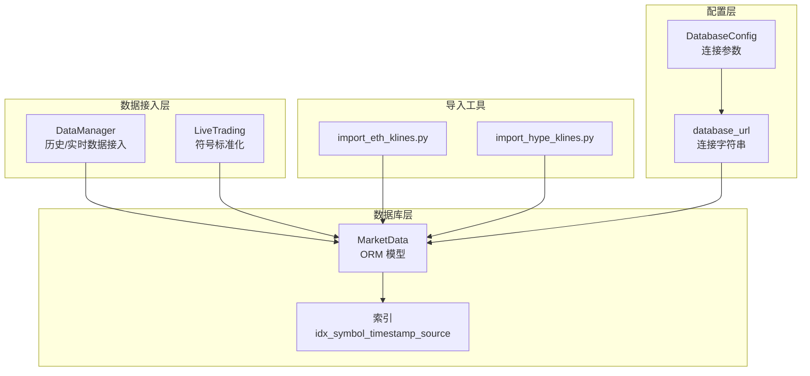
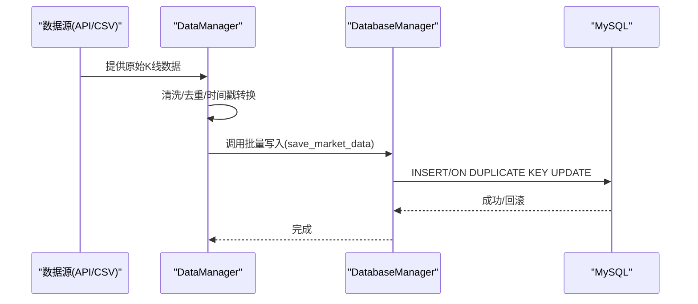
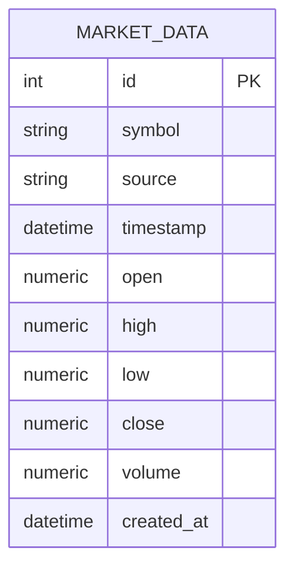
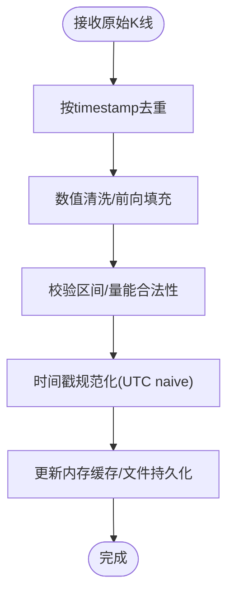
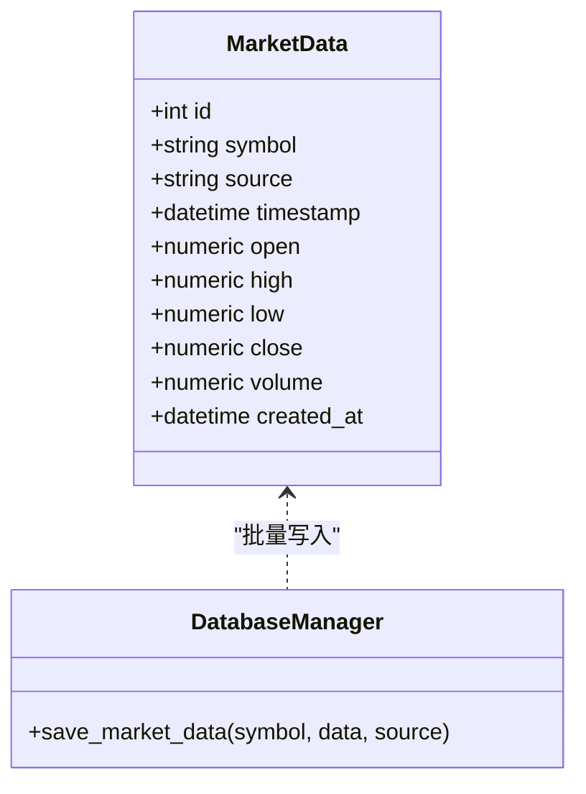
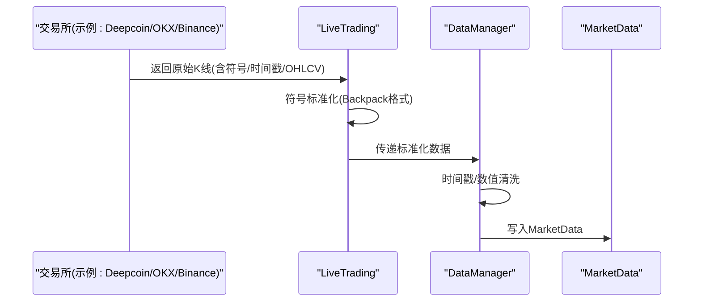
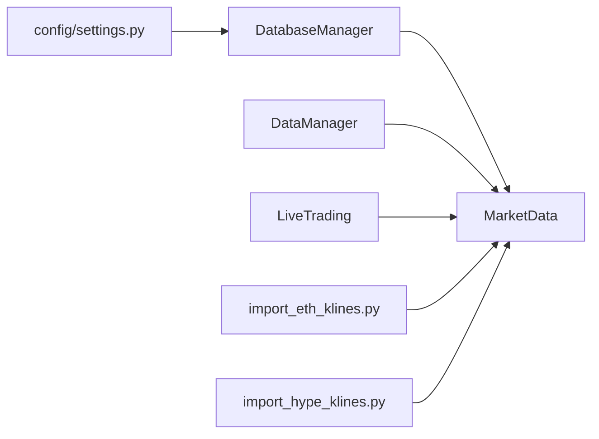

# 市场数据模型

<cite>
**本文档引用的文件**
- [database/models.py](file://backpack_quant_trading/database/models.py)
- [config/settings.py](file://backpack_quant_trading/config/settings.py)
- [core/data_manager.py](file://backpack_quant_trading/core/data_manager.py)
- [api/routers/strategy.py](file://backpack_quant_trading/api/routers/strategy.py)
- [import_eth_klines.py](file://import_eth_klines.py)
- [import_hype_klines.py](file://import_hype_klines.py)
- [engine/live_trading.py](file://backpack_quant_trading/engine/live_trading.py)
</cite>

## 目录
1. [简介](#简介)
2. [项目结构](#项目结构)
3. [核心组件](#核心组件)
4. [架构总览](#架构总览)
5. [详细组件分析](#详细组件分析)
6. [依赖分析](#依赖分析)
7. [性能考虑](#性能考虑)
8. [故障排查指南](#故障排查指南)
9. [结论](#结论)
10. [附录](#附录)

## 简介
本文件围绕市场数据模型（MarketData）进行系统化说明，涵盖字段定义、数据类型与约束、索引设计、时间序列存储策略、查询优化、多交易所数据格式转换与标准化、数据验证与精度控制，以及数据库操作示例（批量插入、时间范围查询、聚合统计）。目标是帮助开发者与使用者快速理解并高效使用 MarketData 表。

## 项目结构
与 MarketData 直接相关的核心文件与职责如下：
- database/models.py：定义 MarketData ORM 模型、数据库索引与批量写入方法
- config/settings.py：提供数据库连接配置，决定连接 URL 与连接池参数
- core/data_manager.py：负责历史数据抓取、清洗、缓存与实时数据接入，提供时间戳与数值清洗
- api/routers/strategy.py：包含策略专用 K 线表（StrategyKline）定义，便于对比与理解数据标准化思路
- import_eth_klines.py、import_hype_klines.py：展示如何将外部 CSV 数据标准化并批量导入数据库
- engine/live_trading.py：展示多交易所符号格式标准化与转换逻辑，为 MarketData 的 source 字段提供实践参考

图表来源
- [database/models.py:45-62](file://backpack_quant_trading/database/models.py#L45-L62)
- [config/settings.py:44-53](file://backpack_quant_trading/config/settings.py#L44-L53)
- [core/data_manager.py:114-167](file://backpack_quant_trading/core/data_manager.py#L114-L167)
- [engine/live_trading.py:645-697](file://backpack_quant_trading/engine/live_trading.py#L645-L697)
- [import_eth_klines.py:20-66](file://import_eth_klines.py#L20-L66)
- [import_hype_klines.py:18-61](file://import_hype_klines.py#L18-L61)

章节来源
- [database/models.py:45-62](file://backpack_quant_trading/database/models.py#L45-L62)
- [config/settings.py:44-53](file://backpack_quant_trading/config/settings.py#L44-L53)
- [core/data_manager.py:114-167](file://backpack_quant_trading/core/data_manager.py#L114-L167)
- [engine/live_trading.py:645-697](file://backpack_quant_trading/engine/live_trading.py#L645-L697)
- [import_eth_klines.py:20-66](file://import_eth_klines.py#L20-L66)
- [import_hype_klines.py:18-61](file://import_hype_klines.py#L18-L61)

## 核心组件
- MarketData 表：用于存储标准化后的 OHLCV 时间序列数据，支持多交易所 source 标识与高效查询
- 数据库管理器（DatabaseManager）：封装批量写入、会话管理与异常回滚
- DataManager：负责历史与实时数据的抓取、清洗与缓存，确保时间戳与数值的规范性
- 多交易所符号标准化：在引擎层将不同交易所符号转换为统一格式，便于 source 字段与查询优化

章节来源
- [database/models.py:267-315](file://backpack_quant_trading/database/models.py#L267-L315)
- [core/data_manager.py:114-167](file://backpack_quant_trading/core/data_manager.py#L114-L167)
- [engine/live_trading.py:645-697](file://backpack_quant_trading/engine/live_trading.py#L645-L697)

## 架构总览
MarketData 的数据流从数据源（API/CSV）进入 DataManager，经过清洗与标准化后写入数据库；查询侧通过复合索引与 source 字段实现高效检索。

图表来源
- [core/data_manager.py:114-167](file://backpack_quant_trading/core/data_manager.py#L114-L167)
- [database/models.py:293-315](file://backpack_quant_trading/database/models.py#L293-L315)

## 详细组件分析

### MarketData 表字段定义与约束
- id：整型主键，自增
- symbol：字符串，长度上限 20，非空，建立普通索引
- source：字符串，长度上限 50，默认值 'backpack'，非空，建立普通索引
- timestamp：日期时间，非空
- open/high/low/close：数值型，精度 20,8，非空
- volume：数值型，精度 20,8，非空
- created_at：日期时间，默认当前时间

复合索引设计
- idx_symbol_timestamp_source：联合索引，覆盖 symbol、timestamp、source，用于高频查询与聚合统计

图表来源
- [database/models.py:45-62](file://backpack_quant_trading/database/models.py#L45-L62)

章节来源
- [database/models.py:45-62](file://backpack_quant_trading/database/models.py#L45-L62)

### 时间序列存储策略
- 去重与清洗：基于 timestamp 去重，对 open/high/low/close/volume 进行数值清洗与前向填充，过滤非法区间与负量
- 时间戳规范化：统一转换为 UTC naive datetime，避免时区差异导致的重复或错位
- 实时缓存：维护内存缓存与文件持久化，支持增量更新与 TTL 清理

图表来源
- [core/data_manager.py:352-374](file://backpack_quant_trading/core/data_manager.py#L352-L374)
- [core/data_manager.py:169-290](file://backpack_quant_trading/core/data_manager.py#L169-L290)

章节来源
- [core/data_manager.py:352-374](file://backpack_quant_trading/core/data_manager.py#L352-L374)
- [core/data_manager.py:169-290](file://backpack_quant_trading/core/data_manager.py#L169-L290)

### 查询优化方案
- 复合索引 idx_symbol_timestamp_source：针对 symbol、timestamp、source 的组合查询进行优化
- source 字段：用于区分不同交易所数据，便于按源过滤
- created_at：默认索引，可用于按写入时间排序与审计

图表来源
- [database/models.py:45-62](file://backpack_quant_trading/database/models.py#L45-L62)
- [database/models.py:293-315](file://backpack_quant_trading/database/models.py#L293-L315)

章节来源
- [database/models.py:45-62](file://backpack_quant_trading/database/models.py#L45-L62)
- [database/models.py:293-315](file://backpack_quant_trading/database/models.py#L293-L315)

### 不同交易所的数据格式转换与标准化
- 符号标准化：将不同交易所的交易对格式统一转换为 Backpack 格式（如 ETH-USDT-SWAP -> ETH_USDC_PERP），确保 symbol 一致性
- 时间戳处理：统一转换为 UTC naive datetime，支持秒/毫秒与 ISO 字符串
- 数值清洗：对开高低收与成交量进行安全转换与异常值过滤

图表来源
- [engine/live_trading.py:645-697](file://backpack_quant_trading/engine/live_trading.py#L645-L697)
- [core/data_manager.py:169-290](file://backpack_quant_trading/core/data_manager.py#L169-L290)

章节来源
- [engine/live_trading.py:645-697](file://backpack_quant_trading/engine/live_trading.py#L645-L697)
- [core/data_manager.py:169-290](file://backpack_quant_trading/core/data_manager.py#L169-L290)

### 数据验证规则与精度控制
- 数值精度：open/high/low/close/volume 使用 Numeric(20,8)，满足高精度金融数据存储
- 非空约束：OHLC 与 volume 必填，timestamp 必填
- 区间合法性：high >= low；high 与 low 与 open/close 的比较；volume >= 0
- 时间戳合法性：统一转换为 UTC naive，避免重复与错位
- 去重策略：按 timestamp 去重，保证唯一性

章节来源
- [database/models.py:53-57](file://backpack_quant_trading/database/models.py#L53-L57)
- [core/data_manager.py:352-374](file://backpack_quant_trading/core/data_manager.py#L352-L374)

### 性能优化建议
- 连接池参数：通过 DatabaseConfig 调整连接池大小与溢出，提升并发写入能力
- 批量写入：使用 DatabaseManager.save_market_data 进行批量 merge，减少事务开销
- 索引优化：利用 idx_symbol_timestamp_source 进行范围查询与聚合统计
- 缓存策略：DataManager 的内存缓存与 TTL 控制，降低重复写入成本

章节来源
- [config/settings.py:44-53](file://backpack_quant_trading/config/settings.py#L44-L53)
- [database/models.py:293-315](file://backpack_quant_trading/database/models.py#L293-L315)
- [core/data_manager.py:23-30](file://backpack_quant_trading/core/data_manager.py#L23-L30)

### 数据库操作示例
以下示例展示常见数据库操作，均基于现有实现与工具脚本：

- 批量插入
  - 使用 DatabaseManager.save_market_data 将清洗后的数据批量写入 MarketData
  - 示例路径：[database/models.py:293-315](file://backpack_quant_trading/database/models.py#L293-L315)

- 时间范围查询
  - 建议使用 symbol + timestamp 范围 + source 过滤，利用 idx_symbol_timestamp_source
  - 示例 SQL（概念性）：SELECT * FROM market_data WHERE symbol=? AND timestamp BETWEEN ? AND ? AND source=? ORDER BY timestamp

- 聚合统计
  - 按 symbol/source 分组，计算 OHLCV 聚合（如开盘/最高/最低/收盘首尾值、总量）
  - 示例 SQL（概念性）：SELECT symbol, source, MIN(timestamp) as start_time, MAX(timestamp) as end_time, FIRST(open) as open, MAX(high) as high, MIN(low) as low, LAST(close) as close, SUM(volume) as volume FROM market_data WHERE ... GROUP BY symbol, source

- 外部 CSV 导入
  - 使用 import_eth_klines.py 与 import_hype_klines.py 展示的批量导入流程
  - 示例路径：
    - [import_eth_klines.py:20-66](file://import_eth_klines.py#L20-L66)
    - [import_hype_klines.py:18-61](file://import_hype_klines.py#L18-L61)

章节来源
- [database/models.py:293-315](file://backpack_quant_trading/database/models.py#L293-L315)
- [import_eth_klines.py:20-66](file://import_eth_klines.py#L20-L66)
- [import_hype_klines.py:18-61](file://import_hype_klines.py#L18-L61)

## 依赖分析
- 数据模型依赖 SQLAlchemy ORM 与 Numeric 类型，确保跨数据库的数值精度
- DatabaseManager 依赖配置模块提供的 database_url 与连接池参数
- DataManager 依赖 API 客户端与 pandas/numpy 进行数据处理
- LiveTrading 依赖符号映射逻辑，确保多交易所符号统一

图表来源
- [config/settings.py:124-130](file://backpack_quant_trading/config/settings.py#L124-L130)
- [database/models.py:267-315](file://backpack_quant_trading/database/models.py#L267-L315)
- [core/data_manager.py:114-167](file://backpack_quant_trading/core/data_manager.py#L114-L167)
- [engine/live_trading.py:645-697](file://backpack_quant_trading/engine/live_trading.py#L645-L697)
- [import_eth_klines.py:20-66](file://import_eth_klines.py#L20-L66)
- [import_hype_klines.py:18-61](file://import_hype_klines.py#L18-L61)

章节来源
- [config/settings.py:124-130](file://backpack_quant_trading/config/settings.py#L124-L130)
- [database/models.py:267-315](file://backpack_quant_trading/database/models.py#L267-L315)
- [core/data_manager.py:114-167](file://backpack_quant_trading/core/data_manager.py#L114-L167)
- [engine/live_trading.py:645-697](file://backpack_quant_trading/engine/live_trading.py#L645-L697)
- [import_eth_klines.py:20-66](file://import_eth_klines.py#L20-L66)
- [import_hype_klines.py:18-61](file://import_hype_klines.py#L18-L61)

## 性能考虑
- 连接池：通过 DatabaseConfig 调整 POOL_SIZE 与 MAX_OVERFLOW，平衡吞吐与资源占用
- 批量写入：使用 merge/批量对象写入减少事务次数
- 索引：合理使用复合索引，避免全表扫描
- 缓存：DataManager 的内存缓存与 TTL 控制，降低重复写入与查询压力

## 故障排查指南
- 插入异常：DatabaseManager 在异常时执行回滚，检查数据清洗与数值转换逻辑
- 重复数据：确保按 timestamp 去重；若出现重复，检查时间戳转换与时区处理
- 查询缓慢：确认查询条件包含 symbol 与 source，并尽量使用 timestamp 范围

章节来源
- [database/models.py:310-314](file://backpack_quant_trading/database/models.py#L310-L314)
- [core/data_manager.py:352-374](file://backpack_quant_trading/core/data_manager.py#L352-L374)

## 结论
MarketData 表通过严格的字段定义、复合索引与清洗流程，实现了多交易所时间序列数据的高效存储与查询。结合 DataManager 的缓存与清洗机制、DatabaseManager 的批量写入能力，以及 LiveTrading 的符号标准化，能够稳定支撑回测与实盘场景下的数据需求。

## 附录
- 与 MarketData 类似的策略 K 线表（StrategyKline）可作为对比参考，理解不同业务表的字段与索引设计思路
  - [api/routers/strategy.py:50-72](file://backpack_quant_trading/api/routers/strategy.py#L50-L72)

章节来源
- [api/routers/strategy.py:50-72](file://backpack_quant_trading/api/routers/strategy.py#L50-L72)