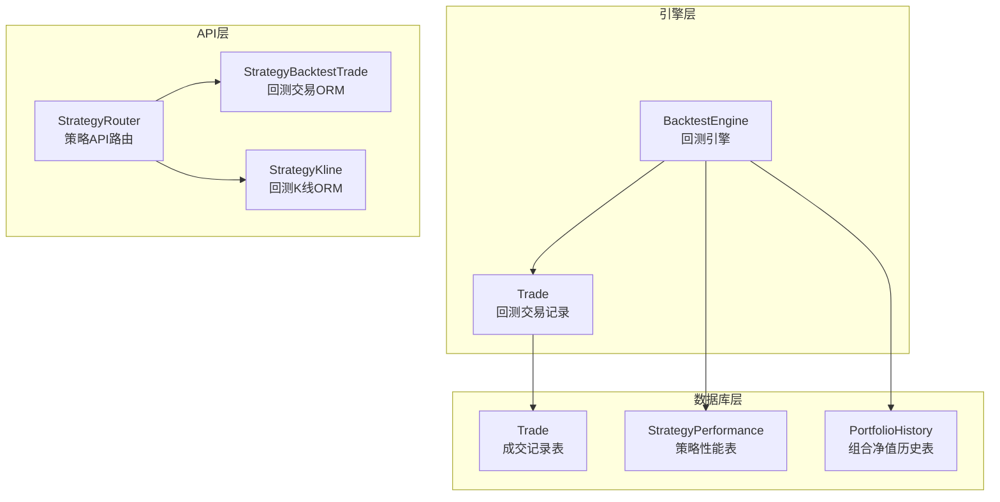
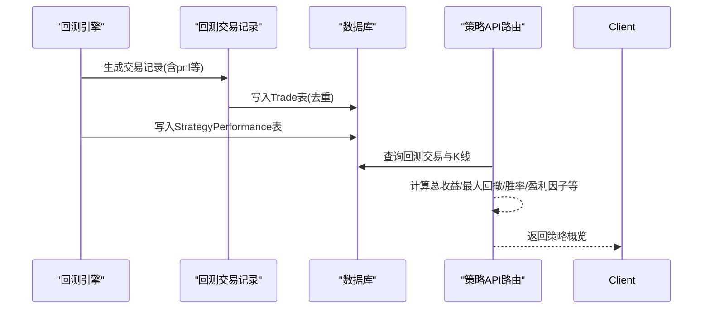
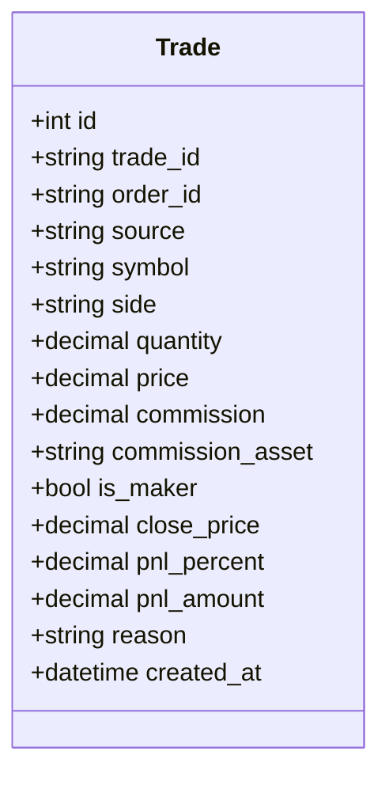
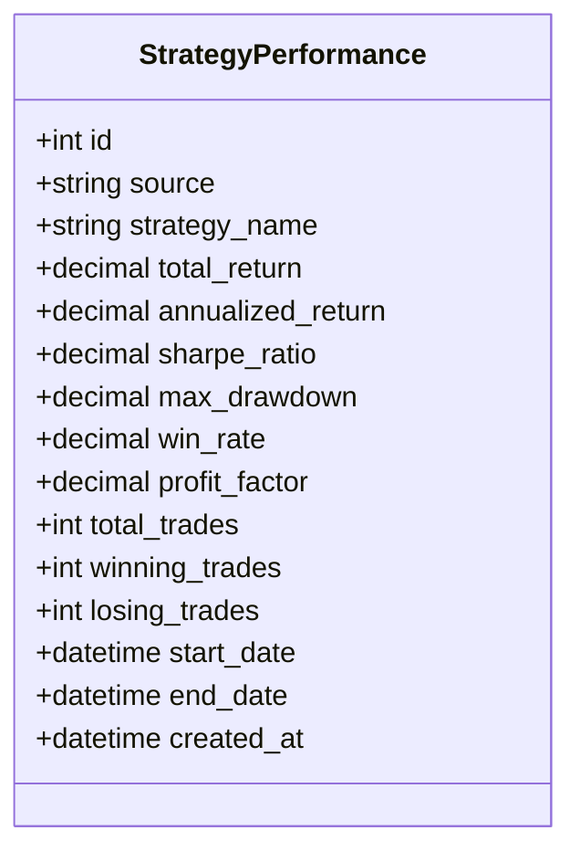
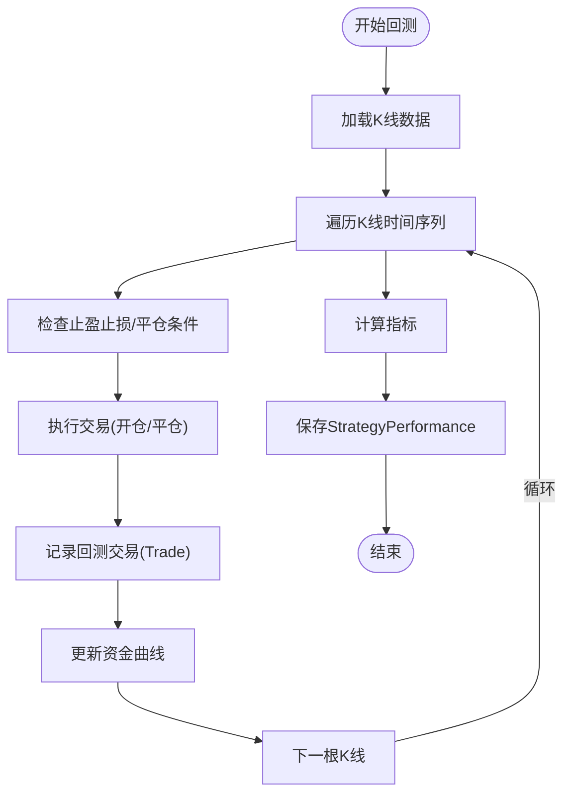
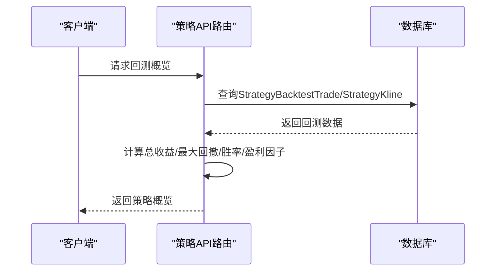
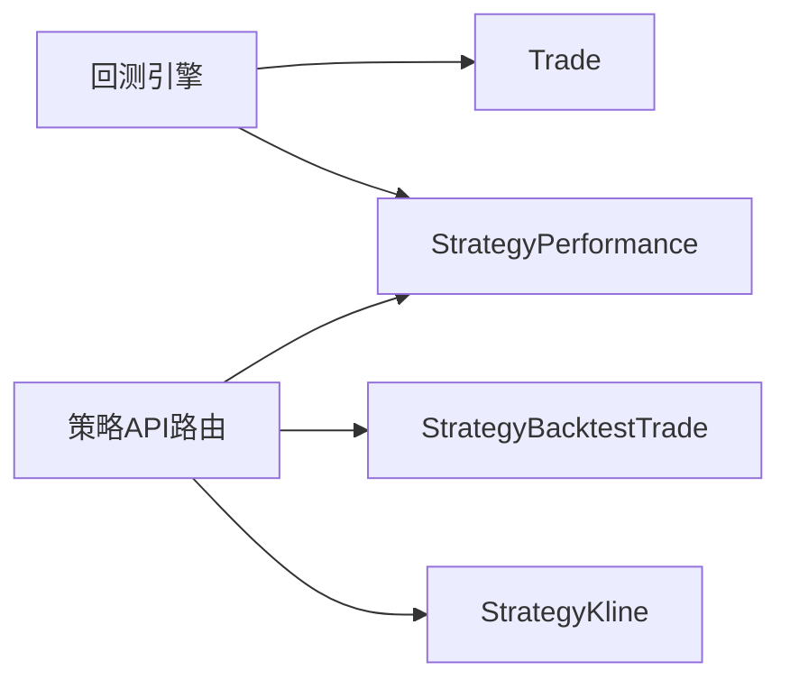

# 成交与性能模型

<cite>
**本文档引用的文件**
- [models.py](file://backpack_quant_trading/database/models.py)
- [backtest.py](file://backpack_quant_trading/engine/backtest.py)
- [strategy.py](file://backpack_quant_trading/api/routers/strategy.py)
- [ETH_1m_live.csv](file://backpack_quant_trading/data/ETH_1m_live.csv)
</cite>

## 目录
1. [简介](#简介)
2. [项目结构](#项目结构)
3. [核心组件](#核心组件)
4. [架构总览](#架构总览)
5. [详细组件分析](#详细组件分析)
6. [依赖关系分析](#依赖关系分析)
7. [性能考量](#性能考量)
8. [故障排查指南](#故障排查指南)
9. [结论](#结论)
10. [附录](#附录)

## 简介
本文件聚焦于两个核心数据模型：成交记录(Trade)与策略性能(StrategyPerformance)，并结合回测引擎与API路由中的指标计算逻辑，系统阐述字段定义、业务含义、计算方法、去重机制、扩展字段用途以及历史数据存储策略。同时提供性能分析查询与指标统计的操作示例路径，帮助读者快速上手。

## 项目结构
围绕成交与性能模型的关键文件与职责如下：
- 数据库模型定义：位于 database/models.py，包含 Trade、StrategyPerformance、PortfolioHistory 等核心表结构及索引。
- 回测引擎：位于 engine/backtest.py，负责生成回测交易记录与计算策略指标。
- API路由：位于 api/routers/strategy.py，提供回测数据查询与概览指标展示。
- 市场数据样例：位于 data/ETH_1m_live.csv，用于理解K线数据格式与回测输入。

图表来源
- [models.py:124-190](file://backpack_quant_trading/database/models.py#L124-L190)
- [backtest.py:48-385](file://backpack_quant_trading/engine/backtest.py#L48-L385)
- [strategy.py:50-106](file://backpack_quant_trading/api/routers/strategy.py#L50-L106)

章节来源
- [models.py:124-190](file://backpack_quant_trading/database/models.py#L124-L190)
- [backtest.py:48-385](file://backpack_quant_trading/engine/backtest.py#L48-L385)
- [strategy.py:50-106](file://backpack_quant_trading/api/routers/strategy.py#L50-L106)

## 核心组件
本节从字段定义、业务含义、扩展字段用途、去重机制与历史数据存储策略五个维度，系统梳理成交记录与策略性能模型。

- 成交记录(Trade)字段定义与业务含义
  - trade_id：成交唯一标识，主键，用于去重判断。
  - order_id：所属订单ID，便于成交与订单关联。
  - source：数据来源，默认“backpack”，用于区分不同数据源。
  - symbol：交易标的，如“ETH-USDT”。
  - side：方向，如“buy”或“sell”。
  - quantity：成交数量。
  - price：成交价格。
  - commission/commission_asset：手续费与手续费资产。
  - is_maker：是否为挂单吃单方（maker），用于区分主动/被动成交。
  - close_price/pnl_percent/pnl_amount/reason：Ostium/回测扩展字段，记录平仓价格、收益百分比、收益金额与原因。
  - created_at：成交时间戳。
  - 索引：基于 symbol、created_at、source 与 order_id、source 的复合索引，提升查询效率。

- 策略性能(StrategyPerformance)字段定义与业务含义
  - strategy_name：策略名称。
  - total_return/annualized_return/sharpe_ratio/max_drawdown/win_rate/profit_factor：策略关键指标。
  - total_trades/winning_trades/losing_trades：交易总数与胜负统计。
  - start_date/end_date：回测起止时间。
  - created_at：记录创建时间。

- Ostium扩展字段用途与回测场景下的特殊处理
  - 在回测场景下，close_price、pnl_percent、pnl_amount、reason等字段由回测引擎在平仓时填充，用于记录每笔已平仓交易的收益与原因。
  - 在实盘/Ostium场景下，这些字段可能来自外部系统或SDK返回，用于与数据库中的Trade记录关联。

- 成交记录去重机制
  - 保存成交时，先以 trade_id 查询是否存在相同记录；若存在则静默跳过，避免重复插入。
  - 同时对过长的 trade_id、order_id 进行截断，防止数据库约束异常。

- 历史数据存储策略
  - 组合净值历史(StrategyPerformance)：记录策略在不同时间点的净值与指标，便于回测报告与可视化。
  - 市场数据样例：CSV格式的K线数据，用于回测输入与验证。

章节来源
- [models.py:124-190](file://backpack_quant_trading/database/models.py#L124-L190)
- [models.py:350-387](file://backpack_quant_trading/database/models.py#L350-L387)

## 架构总览
下图展示了从回测到指标落地的全链路：回测引擎生成交易与指标，Trade表记录每笔成交，StrategyPerformance表汇总策略指标，API路由提供查询接口。

图表来源
- [backtest.py:333-383](file://backpack_quant_trading/engine/backtest.py#L333-L383)
- [models.py:124-190](file://backpack_quant_trading/database/models.py#L124-L190)
- [strategy.py:397-1005](file://backpack_quant_trading/api/routers/strategy.py#L397-L1005)

## 详细组件分析

### 成交记录(Trade)模型
- 字段与索引
  - 主键：id
  - 唯一键：trade_id
  - 复合索引：(symbol, created_at, source)、(order_id, source)
- 业务要点
  - 唯一性约束与去重：通过 trade_id 唯一键与查询判断实现幂等写入。
  - 扩展字段：close_price、pnl_percent、pnl_amount、reason用于回测/实盘收益与原因记录。
  - 时间戳：created_at用于排序与回测时间序列构建。

图表来源
- [models.py:124-151](file://backpack_quant_trading/database/models.py#L124-L151)

章节来源
- [models.py:124-151](file://backpack_quant_trading/database/models.py#L124-L151)
- [models.py:350-387](file://backpack_quant_trading/database/models.py#L350-L387)

### 策略性能(StrategyPerformance)模型
- 字段与用途
  - 策略标识：strategy_name
  - 收益类：total_return、annualized_return
  - 风险类：max_drawdown
  - 风险调整收益：sharpe_ratio
  - 盈利质量：win_rate、profit_factor
  - 统计量：total_trades、winning_trades、losing_trades
  - 时间范围：start_date、end_date
  - 创建时间：created_at

图表来源
- [models.py:171-190](file://backpack_quant_trading/database/models.py#L171-L190)

章节来源
- [models.py:171-190](file://backpack_quant_trading/database/models.py#L171-L190)

### 回测引擎与指标计算
- 回测交易记录(Trade)数据结构
  - 包含 symbol、action、quantity、entry_price、exit_price、entry_time、exit_time、pnl、pnl_percent、commission、reason 等字段，用于记录每笔交易的入场/出场细节与收益。
- 指标计算流程
  - 总收益：最终资金/初始资金-1
  - 年化收益：(1+总收益)^(365/天数)-1
  - 夏普比率：日收益均值×√252/日收益标准差
  - 最大回撤：滚动最高净值回撤的最大百分比
  - 胜率：已平仓交易中盈利交易占比
  - 盈利因子：总盈利/总亏损绝对值
  - 交易统计：总交易、盈利交易、亏损交易

图表来源
- [backtest.py:65-187](file://backpack_quant_trading/engine/backtest.py#L65-L187)
- [backtest.py:333-383](file://backpack_quant_trading/engine/backtest.py#L333-L383)

章节来源
- [backtest.py:333-383](file://backpack_quant_trading/engine/backtest.py#L333-L383)

### API路由中的回测数据与指标
- 回测交易ORM(StrategyBacktestTrade)与K线ORM(StrategyKline)
  - 用于将回测产生的交易与K线持久化，支持后续查询与可视化。
- 概览指标计算
  - 通过回测交易序列计算总收益、最大回撤、胜率、盈利因子等，并与基准策略(如持有)对比，输出年化超额收益等指标。

图表来源
- [strategy.py:397-1005](file://backpack_quant_trading/api/routers/strategy.py#L397-L1005)
- [strategy.py:50-106](file://backpack_quant_trading/api/routers/strategy.py#L50-L106)

章节来源
- [strategy.py:397-1005](file://backpack_quant_trading/api/routers/strategy.py#L397-L1005)
- [strategy.py:50-106](file://backpack_quant_trading/api/routers/strategy.py#L50-L106)

## 依赖关系分析
- Trade与回测引擎
  - 回测引擎生成的交易记录通过 Trade 表落地，其中 close_price、pnl_percent、pnl_amount、reason等字段在平仓时填充。
- StrategyPerformance与回测引擎
  - 回测引擎计算完成后，将指标写入 StrategyPerformance 表，供API路由查询与前端展示。
- API路由与ORM
  - API路由依赖 StrategyBacktestTrade 与 StrategyKline ORM 进行数据读取与持久化。

图表来源
- [backtest.py:333-383](file://backpack_quant_trading/engine/backtest.py#L333-L383)
- [models.py:124-190](file://backpack_quant_trading/database/models.py#L124-L190)
- [strategy.py:50-106](file://backpack_quant_trading/api/routers/strategy.py#L50-L106)

章节来源
- [backtest.py:333-383](file://backpack_quant_trading/engine/backtest.py#L333-L383)
- [models.py:124-190](file://backpack_quant_trading/database/models.py#L124-L190)
- [strategy.py:50-106](file://backpack_quant_trading/api/routers/strategy.py#L50-L106)

## 性能考量
- 去重与幂等写入
  - 通过 trade_id 唯一键与存在性查询实现去重，避免重复插入带来的索引与存储开销。
- 索引设计
  - Trade表的复合索引覆盖 symbol、created_at、source 与 order_id、source，有利于按标的与订单维度的高效查询。
- 指标计算复杂度
  - 夏普比率与最大回撤涉及滚动计算，建议在批量计算时采用向量化与分批处理，避免内存峰值过高。
- 数据规模与存储
  - 回测数据量较大时，建议分批入库与定期归档，结合索引与分区策略提升查询性能。

## 故障排查指南
- 成交重复问题
  - 症状：重复插入或唯一键冲突。
  - 排查：确认 trade_id 是否正确截断与去重逻辑是否生效。
  - 参考路径：[models.py:358-362](file://backpack_quant_trading/database/models.py#L358-L362)
- 指标异常
  - 症状：夏普比率/最大回撤/胜率/盈利因子异常。
  - 排查：检查回测交易是否全部平仓、收益序列是否为空、时间序列是否连续。
  - 参考路径：[backtest.py:333-383](file://backpack_quant_trading/engine/backtest.py#L333-L383)
- API查询无数据
  - 症状：回测概览接口返回空。
  - 排查：确认回测数据是否已导入 StrategyBacktestTrade/StrategyKline，查询条件是否匹配。
  - 参考路径：[strategy.py:397-418](file://backpack_quant_trading/api/routers/strategy.py#L397-L418)

章节来源
- [models.py:358-362](file://backpack_quant_trading/database/models.py#L358-L362)
- [backtest.py:333-383](file://backpack_quant_trading/engine/backtest.py#L333-L383)
- [strategy.py:397-418](file://backpack_quant_trading/api/routers/strategy.py#L397-L418)

## 结论
本文档系统梳理了成交记录(Trade)与策略性能(StrategyPerformance)模型的字段定义、业务含义、扩展字段用途、去重机制与历史数据存储策略，并结合回测引擎与API路由中的指标计算逻辑，给出了完整的数据流与计算流程。通过合理的索引设计、幂等写入与指标计算策略，可有效支撑回测与实盘场景下的高性能数据处理与分析。

## 附录

### 字段定义与业务含义对照表
- Trade表
  - trade_id：成交唯一标识，主键，用于去重。
  - order_id：所属订单ID。
  - source：数据来源。
  - symbol：交易标的。
  - side：方向。
  - quantity：成交数量。
  - price：成交价格。
  - commission/commission_asset：手续费与手续费资产。
  - is_maker：是否为挂单吃单方。
  - close_price/pnl_percent/pnl_amount/reason：回测/实盘收益与原因。
  - created_at：成交时间戳。

- StrategyPerformance表
  - strategy_name：策略名称。
  - total_return/annualized_return/sharpe_ratio/max_drawdown/win_rate/profit_factor：策略关键指标。
  - total_trades/winning_trades/losing_trades：交易统计。
  - start_date/end_date：回测起止时间。
  - created_at：记录创建时间。

章节来源
- [models.py:124-190](file://backpack_quant_trading/database/models.py#L124-L190)

### 操作示例路径
- 回测概览查询
  - 路径：[strategy.py:397-1005](file://backpack_quant_trading/api/routers/strategy.py#L397-L1005)
  - 说明：通过查询回测交易与K线，计算总收益、最大回撤、胜率、盈利因子等指标并返回。

- 回测交易与K线ORM
  - 路径：[strategy.py:50-106](file://backpack_quant_trading/api/routers/strategy.py#L50-L106)
  - 说明：StrategyBacktestTrade与StrategyKline ORM用于回测数据的持久化与查询。

- 市场数据样例
  - 路径：[ETH_1m_live.csv](file://backpack_quant_trading/data/ETH_1m_live.csv)
  - 说明：CSV格式的K线数据，用于回测输入与验证。