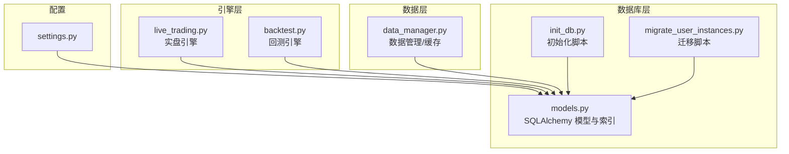
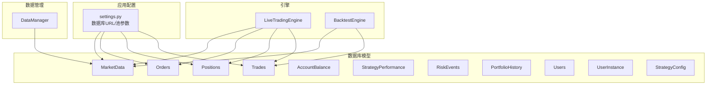
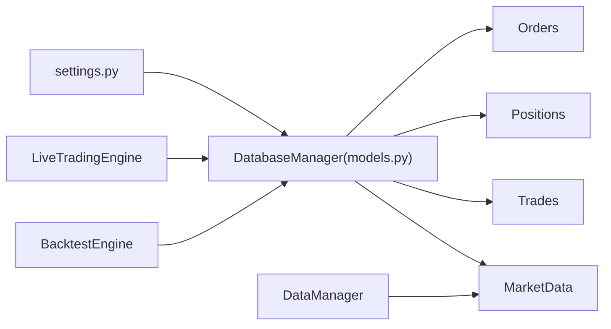

# 核心数据模型

<cite>
**本文档引用的文件**
- [models.py](file://backpack_quant_trading/database/models.py)
- [settings.py](file://backpack_quant_trading/config/settings.py)
- [live_trading.py](file://backpack_quant_trading/engine/live_trading.py)
- [backtest.py](file://backpack_quant_trading/engine/backtest.py)
- [data_manager.py](file://backpack_quant_trading/core/data_manager.py)
- [init_db.py](file://init_db.py)
- [migrate_user_instances.py](file://backpack_quant_trading/database/migrate_user_instances.py)
</cite>

## 目录
1. [简介](#简介)
2. [项目结构](#项目结构)
3. [核心组件](#核心组件)
4. [架构总览](#架构总览)
5. [详细组件分析](#详细组件分析)
6. [依赖分析](#依赖分析)
7. [性能考虑](#性能考虑)
8. [故障排查指南](#故障排查指南)
9. [结论](#结论)
10. [附录](#附录)

## 简介
本文件面向量化交易系统的数据库层，聚焦核心数据模型：MarketData（市场数据）、Order（订单）、Position（仓位）、Trade（成交记录）。我们将从表结构、字段类型与约束、索引设计、业务规则、数据完整性保障、查询模式与性能优化等方面进行系统化说明，并结合实际代码路径给出最佳实践与排障建议。

## 项目结构
围绕数据模型的关键文件分布如下：
- 数据库模型与管理器：database/models.py
- 配置与数据库连接：config/settings.py
- 实盘引擎与数据流：engine/live_trading.py
- 回测引擎与数据流：engine/backtest.py
- 数据管理与缓存：core/data_manager.py
- 数据库初始化与迁移：init_db.py、database/migrate_user_instances.py

图表来源
- [models.py](file://backpack_quant_trading/database/models.py)
- [settings.py](file://backpack_quant_trading/config/settings.py)
- [live_trading.py](file://backpack_quant_trading/engine/live_trading.py)
- [backtest.py](file://backpack_quant_trading/engine/backtest.py)
- [data_manager.py](file://backpack_quant_trading/core/data_manager.py)
- [init_db.py](file://init_db.py)
- [migrate_user_instances.py](file://backpack_quant_trading/database/migrate_user_instances.py)

章节来源
- [models.py](file://backpack_quant_trading/database/models.py)
- [settings.py](file://backpack_quant_trading/config/settings.py)

## 核心组件
本节概述四个核心表及其职责：
- MarketData：存储标准化的K线数据（OHLCV），用于策略计算与回测。
- Order：记录订单生命周期与状态，支持多交易所字段扩展。
- Position：记录当前未平仓的头寸，支持止盈止损与Ostium扩展字段。
- Trade：记录每笔成交明细，支持回测与Ostium扩展字段。

章节来源
- [models.py](file://backpack_quant_trading/database/models.py)

## 架构总览
下图展示数据模型在系统中的角色与交互关系，以及与配置、引擎、数据管理的关系。

图表来源
- [models.py](file://backpack_quant_trading/database/models.py)
- [settings.py](file://backpack_quant_trading/config/settings.py)
- [live_trading.py](file://backpack_quant_trading/engine/live_trading.py)
- [backtest.py](file://backpack_quant_trading/engine/backtest.py)
- [data_manager.py](file://backpack_quant_trading/core/data_manager.py)

## 详细组件分析

### MarketData（市场数据）
- 表名：market_data
- 主键：id（自增）
- 关键字段
  - symbol：字符串，长度20，非空，常用查询维度
  - source：字符串，长度50，非空，用于区分数据来源（如backpack）
  - timestamp：时间戳，非空，用于排序与范围查询
  - open/high/low/close：数值，精度20,8，非空
  - volume：数值，精度20,8，非空
  - created_at：记录入库时间
- 索引
  - idx_symbol_timestamp_source：复合索引，覆盖 symbol、timestamp、source
- 业务规则
  - 采用数值精度20,8确保高精度金融数据存储
  - 通过source字段区分不同数据源，便于多源聚合与回溯
  - created_at用于审计与数据新鲜度追踪
- 数据完整性
  - 所有OHLCV字段非空，避免空值影响技术指标计算
- 查询模式
  - 按symbol+timestamp范围查询K线序列
  - 按symbol+source过滤特定来源
- 性能优化
  - 复合索引支持高频查询
  - 建议按天/小时分区（未在模型中显式声明，可在DDL层实现）

章节来源
- [models.py](file://backpack_quant_trading/database/models.py)

### Orders（订单）
- 表名：orders
- 主键：id（自增）
- 关键字段
  - order_id：字符串，唯一，非空，外部订单号
  - client_order_id：字符串，允许空，用于客户端自定义ID
  - source：字符串，长度50，非空，来源标识
  - symbol：字符串，长度20，非空
  - side/order_type/status：字符串，非空，枚举化字段
  - quantity/price：数值，精度20,8，非空/可空
  - filled_quantity/filled_price/commission/commission_asset：数值/字符串，用于成交与费用记录
  - tx_hash：区块链交易哈希，可空
  - created_at/updated_at：时间戳
- 索引
  - idx_symbol_status_source：按symbol/status/source过滤
  - idx_created_at_source：按时间+来源过滤
- 业务规则
  - order_id唯一，防止重复入库
  - filled_quantity默认0，commission默认0，避免空值参与计算
  - created_at/updated_at用于状态追踪与审计
- 数据完整性
  - 数值字段统一使用Numeric(20,8)，避免浮点误差
  - tx_hash长度限制，防止超长导致的数据库错误
- 查询模式
  - 按symbol/status/source快速筛选未成交/已成交订单
  - 按created_at/source进行批量清理与归档
- 性能优化
  - 复合索引支持高频过滤
  - 建议对status字段建立独立索引以提升状态查询效率

章节来源
- [models.py](file://backpack_quant_trading/database/models.py)

### Positions（仓位）
- 表名：positions
- 主键：id（自增）
- 关键字段
  - source/symbol/side：字符串，非空
  - quantity/entry_price/current_price/unrealized_pnl/unrealized_pnl_percent：数值，精度20,8或10,4
  - stop_loss/take_profit：数值，可空
  - opened_at/updated_at/closed_at：时间戳
  - Ostium扩展字段：trade_index/pair_id/collateral（数值，可空）
- 索引
  - idx_symbol_status_source：按symbol/closed_at/source过滤
  - idx_opened_at_source：按开仓时间+来源过滤
- 业务规则
  - closed_at为空表示当前未平仓；非空表示已平仓
  - quantity/entry_price等字段更新时保持一致性
  - Ostium扩展字段用于特定交易所的仓位管理
- 数据完整性
  - closed_at与未平仓状态保持逻辑一致
  - 数值精度与Orders一致，保证跨表计算准确
- 查询模式
  - 按symbol/closed_at过滤未平仓头寸
  - 按opened_at/source进行历史回溯
- 性能优化
  - 复合索引支持按状态与时间的高效筛选

章节来源
- [models.py](file://backpack_quant_trading/database/models.py)

### Trades（成交记录）
- 表名：trades
- 主键：id（自增）
- 关键字段
  - trade_id：字符串，唯一，非空
  - order_id：字符串，非空
  - source/symbol/side：字符串，非空
  - quantity/price/commission/commission_asset：数值/字符串
  - is_maker：布尔，是否maker
  - Ostium/回测扩展字段：close_price/pnl_percent/pnl_amount/reason（数值/文本，可空）
  - created_at：时间戳
- 索引
  - idx_symbol_created_source：按symbol/created_at/source过滤
  - idx_order_id_source：按order_id/source过滤
- 业务规则
  - trade_id唯一，防止重复入库（入库时先查重再插入）
  - is_maker用于计算maker/taker费用差异
  - 回测扩展字段用于记录平仓价格、盈亏与原因
- 数据完整性
  - trade_id唯一约束，入库前检查避免重复
  - 数值精度与Orders一致
- 查询模式
  - 按symbol/created_at/source进行回测区间查询
  - 按order_id/source快速定位某订单下的所有成交
- 性能优化
  - 复合索引支持高频回测与报表场景

章节来源
- [models.py](file://backpack_quant_trading/database/models.py)

### 关联关系与外键约束
- Orders与Trades
  - 外键：trades.order_id → orders.order_id
  - 语义：一笔订单可对应多笔成交
- Positions与Trades
  - 无直接外键约束（通过业务逻辑保证一致性）
  - 语义：成交驱动仓位变化，未平仓记录由Positions维护
- MarketData与策略/回测
  - 无外键约束
  - 语义：策略/回测通过symbol与timestamp关联K线数据

章节来源
- [models.py](file://backpack_quant_trading/database/models.py)

### 数据验证规则与业务规则
- 数值精度
  - 所有价格/数量/费用字段使用Numeric(20,8)，保证高精度
  - 百分比类字段使用Numeric(10,4)，避免精度丢失
- 空值处理
  - OHLCV字段非空；price/filled_price/closed_at等可空字段明确标注
- 唯一性
  - order_id、trade_id唯一，入库前检查避免重复
- 截断保护
  - 对过长的order_id/trade_id/tx_hash进行截断，防止数据库错误
- 时间戳
  - 支持秒/毫秒时间戳转换，统一为本地时间
- 状态枚举
  - side/type/status使用枚举字符串，保证一致性

章节来源
- [models.py](file://backpack_quant_trading/database/models.py)

### 数据库操作示例与最佳实践
- 初始化与迁移
  - 使用init_db.py重建表结构（注意：会删除旧users表）
  - 使用migrate_user_instances.py单独创建user_instances表
- 保存市场数据
  - 通过DatabaseManager.save_market_data批量入库，使用merge去重
- 保存订单
  - 通过DatabaseManager.save_order入库，自动截断过长字段并去重
- 保存成交
  - 通过DatabaseManager.save_trade入库，先查重再插入
- 保存仓位
  - 通过DatabaseManager.save_position，若同symbol+side+source未平仓存在则更新，否则新建
- 保存组合快照
  - 通过DatabaseManager.save_portfolio_snapshot记录每日净值

章节来源
- [models.py](file://backpack_quant_trading/database/models.py)
- [init_db.py](file://init_db.py)
- [migrate_user_instances.py](file://backpack_quant_trading/database/migrate_user_instances.py)

### 查询模式与性能优化
- 查询模式
  - 按symbol+timestamp范围查询K线（利用idx_symbol_timestamp_source）
  - 按symbol/status/source过滤订单（利用idx_symbol_status_source）
  - 按symbol/created_at/source过滤成交（利用idx_symbol_created_source）
  - 按opened_at/source过滤未平仓（利用idx_opened_at_source）
- 性能优化建议
  - 为高频查询字段建立独立索引（如status、source）
  - 对历史数据进行分区（按天/月），降低扫描范围
  - 使用批量入库与事务合并，减少IO开销
  - 对热点字段建立复合索引，避免回表

章节来源
- [models.py](file://backpack_quant_trading/database/models.py)

## 依赖分析
- 配置依赖
  - settings.py提供数据库URL与连接池参数，供DatabaseManager使用
- 引擎依赖
  - LiveTradingEngine与BacktestEngine通过DatabaseManager访问数据库
  - DataManager负责K线数据的缓存与清洗，间接支撑MarketData
- 数据模型依赖
  - 所有表通过SQLAlchemy声明式基类定义，统一管理

图表来源
- [settings.py](file://backpack_quant_trading/config/settings.py)
- [models.py](file://backpack_quant_trading/database/models.py)
- [live_trading.py](file://backpack_quant_trading/engine/live_trading.py)
- [backtest.py](file://backpack_quant_trading/engine/backtest.py)
- [data_manager.py](file://backpack_quant_trading/core/data_manager.py)

章节来源
- [settings.py](file://backpack_quant_trading/config/settings.py)
- [models.py](file://backpack_quant_trading/database/models.py)
- [live_trading.py](file://backpack_quant_trading/engine/live_trading.py)
- [backtest.py](file://backpack_quant_trading/engine/backtest.py)
- [data_manager.py](file://backpack_quant_trading/core/data_manager.py)

## 性能考虑
- 连接池与并发
  - settings.py提供POOL_SIZE与MAX_OVERFLOW，DatabaseManager中启用pre_ping，提升连接稳定性
- 写入性能
  - 批量入库（save_market_data）使用merge，减少重复写入
  - 成交入库先查重再插入，避免重复写入
- 查询性能
  - 复合索引覆盖高频查询维度
  - 建议对status/source等字段建立独立索引
- 数据清洗
  - DataManager对K线数据进行清洗与去重，减少脏数据对查询的影响

章节来源
- [settings.py](file://backpack_quant_trading/config/settings.py)
- [models.py](file://backpack_quant_trading/database/models.py)
- [data_manager.py](file://backpack_quant_trading/core/data_manager.py)

## 故障排查指南
- 初始化失败
  - init_db.py会删除users表并重建，注意数据丢失风险
  - migrate_user_instances.py仅创建user_instances表，不影响其他数据
- 重复入库
  - Orders/Trades入库前检查唯一性，避免重复
  - 若出现重复，检查order_id/trade_id长度与内容
- 时间戳问题
  - 支持秒/毫秒时间戳，入库前统一转换为本地时间
- 数值精度
  - 所有价格/数量使用Numeric(20,8)，避免浮点误差
- 连接池问题
  - 检查settings.py中的POOL_SIZE/MAX_OVERFLOW，必要时增大
  - 启用pre_ping避免连接失效

章节来源
- [init_db.py](file://init_db.py)
- [migrate_user_instances.py](file://backpack_quant_trading/database/migrate_user_instances.py)
- [models.py](file://backpack_quant_trading/database/models.py)
- [settings.py](file://backpack_quant_trading/config/settings.py)

## 结论
本文档系统梳理了量化交易系统的核心数据模型，明确了MarketData、Order、Position、Trade四张表的结构、索引、业务规则与数据完整性保障机制，并给出了查询模式、性能优化与故障排查的最佳实践。通过合理的索引设计与批量入库策略，可显著提升系统在高并发场景下的稳定性与吞吐能力。

## 附录
- 数据库初始化流程
  - 使用init_db.py重建所有表（谨慎使用）
  - 使用migrate_user_instances.py创建user_instances表
- 配置项参考
  - settings.py中的database_url、POOL_SIZE、MAX_OVERFLOW等

章节来源
- [init_db.py](file://init_db.py)
- [migrate_user_instances.py](file://backpack_quant_trading/database/migrate_user_instances.py)
- [settings.py](file://backpack_quant_trading/config/settings.py)