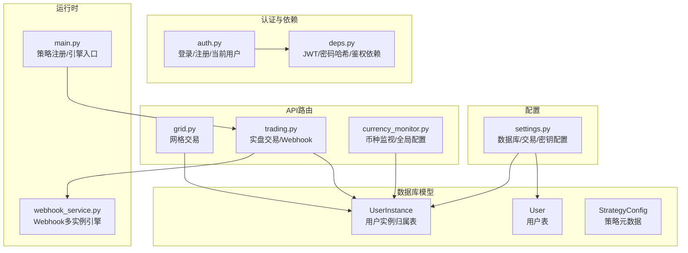
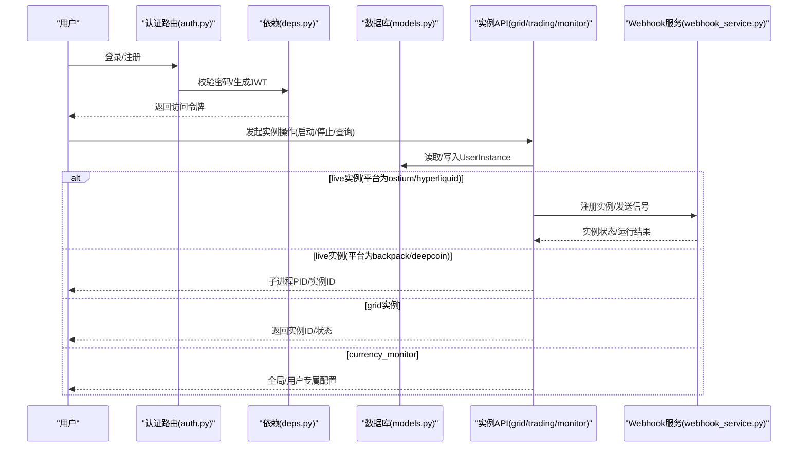
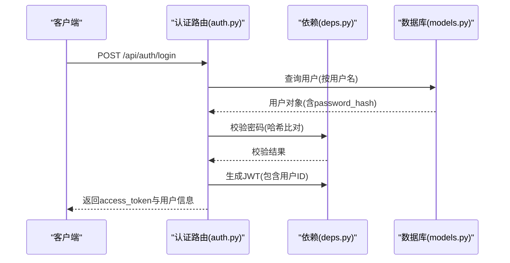
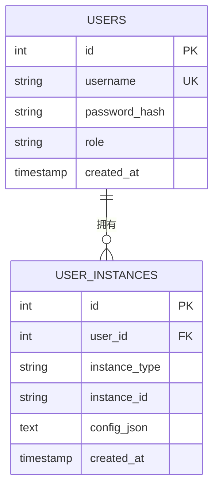
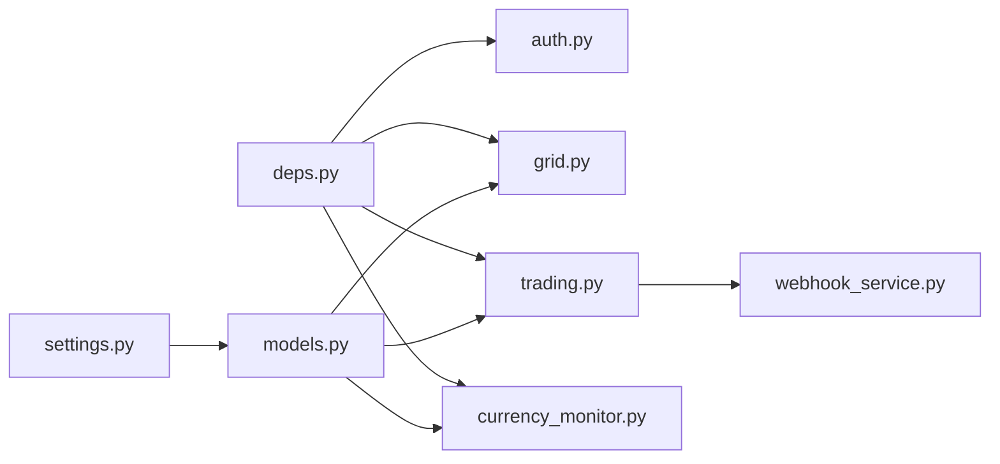

# 用户与实例模型

<cite>
**本文引用的文件**
- [models.py](file://backpack_quant_trading/database/models.py)
- [migrate_user_instances.py](file://backpack_quant_trading/database/migrate_user_instances.py)
- [settings.py](file://backpack_quant_trading/config/settings.py)
- [auth.py](file://backpack_quant_trading/api/routers/auth.py)
- [deps.py](file://backpack_quant_trading/api/deps.py)
- [grid.py](file://backpack_quant_trading/api/routers/grid.py)
- [currency_monitor.py](file://backpack_quant_trading/api/routers/currency_monitor.py)
- [trading.py](file://backpack_quant_trading/api/routers/trading.py)
- [webhook_service.py](file://backpack_quant_trading/webhook_service.py)
- [main.py](file://backpack_quant_trading/main.py)
</cite>

## 目录
1. [简介](#简介)
2. [项目结构](#项目结构)
3. [核心组件](#核心组件)
4. [架构总览](#架构总览)
5. [详细组件分析](#详细组件分析)
6. [依赖关系分析](#依赖关系分析)
7. [性能考量](#性能考量)
8. [故障排查指南](#故障排查指南)
9. [结论](#结论)
10. [附录](#附录)

## 简介
本文件围绕用户(User)与用户实例(UserInstance)模型进行深入文档化，涵盖以下内容：
- User表字段定义与安全设计（username、password_hash、role），以及基于JWT的认证流程与权限控制。
- UserInstance表字段定义与实例隔离机制（instance_type、instance_id、config_json），并说明三类实例类型（live、grid、currency_monitor）及其配置存储策略。
- 用户认证流程、实例权限管理与配置继承机制。
- 提供用户管理、实例创建与配置查询的实际操作示例。
- 区分全局配置与用户专属配置的使用场景。

## 项目结构
本项目采用分层架构，数据库模型位于database/models.py，API路由位于api/routers，配置位于config/settings.py，认证与依赖位于api/deps.py，实例管理通过API路由与Webhook服务协同完成。

图表来源
- [models.py](file://backpack_quant_trading/database/models.py)
- [settings.py](file://backpack_quant_trading/config/settings.py)
- [auth.py](file://backpack_quant_trading/api/routers/auth.py)
- [deps.py](file://backpack_quant_trading/api/deps.py)
- [grid.py](file://backpack_quant_trading/api/routers/grid.py)
- [trading.py](file://backpack_quant_trading/api/routers/trading.py)
- [currency_monitor.py](file://backpack_quant_trading/api/routers/currency_monitor.py)
- [webhook_service.py](file://backpack_quant_trading/webhook_service.py)
- [main.py](file://backpack_quant_trading/main.py)

章节来源
- [models.py](file://backpack_quant_trading/database/models.py)
- [settings.py](file://backpack_quant_trading/config/settings.py)
- [auth.py](file://backpack_quant_trading/api/routers/auth.py)
- [deps.py](file://backpack_quant_trading/api/deps.py)
- [grid.py](file://backpack_quant_trading/api/routers/grid.py)
- [trading.py](file://backpack_quant_trading/api/routers/trading.py)
- [currency_monitor.py](file://backpack_quant_trading/api/routers/currency_monitor.py)
- [webhook_service.py](file://backpack_quant_trading/webhook_service.py)
- [main.py](file://backpack_quant_trading/main.py)

## 核心组件
- 用户(User)：存储用户名、密码哈希与角色，支撑登录认证与权限控制。
- 用户实例(UserInstance)：记录用户与各实例的绑定关系及实例配置JSON，实现实例隔离与配置持久化。
- 认证与依赖(deps)：提供密码哈希、JWT签发与校验、当前用户解析与鉴权依赖。
- API路由：网格交易(grid)、实盘交易(trading)、币种监视(currency_monitor)分别负责不同类型的实例生命周期与配置管理。
- Webhook服务：托管Ostium/Hyperliquid等平台的多实例引擎，配合API路由完成实例注册、运行与注销。

章节来源
- [models.py](file://backpack_quant_trading/database/models.py)
- [deps.py](file://backpack_quant_trading/api/deps.py)
- [auth.py](file://backpack_quant_trading/api/routers/auth.py)
- [grid.py](file://backpack_quant_trading/api/routers/grid.py)
- [trading.py](file://backpack_quant_trading/api/routers/trading.py)
- [currency_monitor.py](file://backpack_quant_trading/api/routers/currency_monitor.py)
- [webhook_service.py](file://backpack_quant_trading/webhook_service.py)

## 架构总览
用户通过认证后，可在不同API路由下创建与管理实例。实例配置通过UserInstance表持久化，其中：
- live：实盘交易实例，支持Webhook与子进程两种运行模式。
- grid：网格交易实例，配置包含交易对、网格参数等。
- currency_monitor：币种监视实例，支持全局共享与用户专属两种配置模式。

图表来源
- [auth.py](file://backpack_quant_trading/api/routers/auth.py)
- [deps.py](file://backpack_quant_trading/api/deps.py)
- [models.py](file://backpack_quant_trading/database/models.py)
- [grid.py](file://backpack_quant_trading/api/routers/grid.py)
- [trading.py](file://backpack_quant_trading/api/routers/trading.py)
- [currency_monitor.py](file://backpack_quant_trading/api/routers/currency_monitor.py)
- [webhook_service.py](file://backpack_quant_trading/webhook_service.py)

## 详细组件分析

### 用户(User)模型与认证流程
- 字段定义
  - id：主键，自增。
  - username：唯一索引，登录凭据。
  - password_hash：存储经哈希后的密码，不保存明文。
  - role：用户角色，默认user；超级用户在首个用户创建时授予。
  - created_at：创建时间。
- 安全设计
  - 密码使用哈希算法存储，登录时进行哈希比对。
  - JWT令牌包含用户ID，过期时间为7天；支持从Header或Cookie读取。
  - 依赖require_user强制登录态，未登录返回401。
- 权限控制
  - 通过role字段区分普通用户与超级用户；当前代码未在路由中显式使用role进行差异化授权，建议在业务路由中增加role校验。

图表来源
- [auth.py](file://backpack_quant_trading/api/routers/auth.py)
- [deps.py](file://backpack_quant_trading/api/deps.py)
- [models.py](file://backpack_quant_trading/database/models.py)

章节来源
- [models.py](file://backpack_quant_trading/database/models.py)
- [auth.py](file://backpack_quant_trading/api/routers/auth.py)
- [deps.py](file://backpack_quant_trading/api/deps.py)

### 用户实例(UserInstance)模型与实例隔离
- 字段定义
  - id：主键，自增。
  - user_id：外键，关联用户。
  - instance_type：实例类型，取值live、grid、currency_monitor。
  - instance_id：实例标识符，唯一索引。
  - config_json：实例配置JSON，仅存储平台、策略、交易对等元数据，严禁存储API Key、私钥等敏感信息。
  - created_at：创建时间。
- 实例隔离与配置管理
  - 每个用户只能看到与自己绑定的实例，API路由在操作前会校验instance_id是否属于当前用户。
  - config_json仅存放非敏感元数据，敏感信息通过运行时参数或环境变量注入。
- 类型分类
  - live：实盘交易实例，支持Webhook与子进程两种模式；可通过平台差异选择运行方式。
  - grid：网格交易实例，配置包含交易对、网格上下限、网格数量、每格投资等。
  - currency_monitor：币种监视实例，支持全局共享与用户专属两种配置；刷新后可从数据库恢复。

图表来源
- [models.py](file://backpack_quant_trading/database/models.py)

章节来源
- [models.py](file://backpack_quant_trading/database/models.py)

### 实例权限管理与配置继承机制
- 权限管理
  - 在停止/查询实例前，API会通过数据库查询当前用户拥有的instance_id集合，若请求的目标不在集合内，则拒绝操作（403）。
- 配置继承
  - live实例：config_json存储平台、策略、交易对等元数据；敏感参数在运行时通过私钥或API Key注入。
  - grid实例：config_json存储交易对与网格参数；实例ID由服务端生成。
  - currency_monitor：支持全局共享配置（singleton键）与用户专属配置；刷新后可从数据库恢复。

章节来源
- [grid.py](file://backpack_quant_trading/api/routers/grid.py)
- [trading.py](file://backpack_quant_trading/api/routers/trading.py)
- [currency_monitor.py](file://backpack_quant_trading/api/routers/currency_monitor.py)
- [models.py](file://backpack_quant_trading/database/models.py)

### 实战操作示例

#### 用户管理
- 注册
  - 请求：POST /api/auth/register
  - 参数：username、password
  - 结果：返回access_token与用户信息；首个注册用户自动成为超级用户。
- 登录
  - 请求：POST /api/auth/login
  - 参数：username、password
  - 结果：返回access_token与用户信息。
- 当前用户
  - 请求：GET /api/auth/me
  - 结果：返回当前用户信息（需携带令牌）。

章节来源
- [auth.py](file://backpack_quant_trading/api/routers/auth.py)
- [deps.py](file://backpack_quant_trading/api/deps.py)

#### 实盘实例(live)创建与管理
- 启动实盘策略
  - 请求：POST /api/trading/launch
  - 参数：platform、strategy、symbol、size、leverage、take_profit、stop_loss、api_key/api_secret/passphrase/private_key
  - 结果：返回instance_id；平台为ostium/hyperliquid时通过Webhook注册，backpack/deepcoin通过子进程运行。
- 停止实盘实例
  - 请求：DELETE /api/trading/instances/{instance_id}
  - 结果：注销实例并清理进程或Webhook状态。
- 查询实例
  - 请求：GET /api/trading/instances
  - 结果：返回当前用户的所有实盘实例（含Webhook恢复状态）。

章节来源
- [trading.py](file://backpack_quant_trading/api/routers/trading.py)
- [webhook_service.py](file://backpack_quant_trading/webhook_service.py)

#### 网格实例(grid)创建与管理
- 启动网格
  - 请求：POST /api/grid/start
  - 参数：exchange、symbol、price_lower、price_upper、grid_count、investment_per_grid、leverage、grid_mode、api_key、secret_key、passphrase、private_key
  - 结果：返回instance_id；同时将配置写入UserInstance。
- 停止单个/全部网格
  - 请求：POST /api/grid/stop/{grid_id} 或 POST /api/grid/stop-all
  - 结果：停止实例并删除UserInstance记录。
- 查询网格状态
  - 请求：GET /api/grid/status
  - 结果：返回当前用户运行中的网格实例。

章节来源
- [grid.py](file://backpack_quant_trading/api/routers/grid.py)
- [models.py](file://backpack_quant_trading/database/models.py)

#### 币种监视实例(currency_monitor)配置
- 启动监视（全局共享）
  - 请求：POST /api/currency_monitor/start
  - 参数：symbols（列表）、timeframes（列表）
  - 结果：启动监视并保存全局配置（singleton键）。
- 停止监视（全局共享）
  - 请求：POST /api/currency_monitor/stop
  - 结果：停止监视并删除全局配置。
- 查询监视状态（全局共享）
  - 请求：GET /api/currency_monitor/status
  - 结果：返回运行状态与告警对列表。
- 1分钟预警配置
  - 请求：POST /api/currency_monitor/minute-alert/start
  - 结果：启动预警并保存全局配置；支持停止与状态查询。

章节来源
- [currency_monitor.py](file://backpack_quant_trading/api/routers/currency_monitor.py)
- [models.py](file://backpack_quant_trading/database/models.py)

### 全局配置与用户专属配置
- 全局配置
  - 适用于所有用户，使用第一个用户ID作为存储键，典型场景为币种监视与1分钟预警。
  - 优点：统一配置、便于跨用户共享；缺点：无法按用户个性化定制。
- 用户专属配置
  - 仅当前用户可见与可编辑，典型场景为币种监视的用户级偏好。
  - 优点：个性化强；缺点：需要为每个用户单独维护。
- 使用建议
  - 对于需要跨用户共享的通用策略（如币种监视），优先使用全局配置。
  - 对于用户个性化需求（如特定用户的告警阈值），使用用户专属配置。

章节来源
- [models.py](file://backpack_quant_trading/database/models.py)
- [currency_monitor.py](file://backpack_quant_trading/api/routers/currency_monitor.py)

## 依赖关系分析
- 数据库模型依赖配置(settings.py)中的数据库连接参数。
- 认证路由依赖依赖模块(deps.py)提供的密码哈希与JWT工具。
- 实例API路由依赖数据库模型(models.py)进行用户与实例的读写。
- 实盘实例在ostium/hyperliquid平台下依赖Webhook服务(webhook_service.py)进行多实例托管。

图表来源
- [settings.py](file://backpack_quant_trading/config/settings.py)
- [models.py](file://backpack_quant_trading/database/models.py)
- [deps.py](file://backpack_quant_trading/api/deps.py)
- [auth.py](file://backpack_quant_trading/api/routers/auth.py)
- [grid.py](file://backpack_quant_trading/api/routers/grid.py)
- [trading.py](file://backpack_quant_trading/api/routers/trading.py)
- [currency_monitor.py](file://backpack_quant_trading/api/routers/currency_monitor.py)
- [webhook_service.py](file://backpack_quant_trading/webhook_service.py)

章节来源
- [settings.py](file://backpack_quant_trading/config/settings.py)
- [models.py](file://backpack_quant_trading/database/models.py)
- [deps.py](file://backpack_quant_trading/api/deps.py)
- [auth.py](file://backpack_quant_trading/api/routers/auth.py)
- [grid.py](file://backpack_quant_trading/api/routers/grid.py)
- [trading.py](file://backpack_quant_trading/api/routers/trading.py)
- [currency_monitor.py](file://backpack_quant_trading/api/routers/currency_monitor.py)
- [webhook_service.py](file://backpack_quant_trading/webhook_service.py)

## 性能考量
- 数据库连接池：配置文件中设置了连接池大小与溢出上限，建议结合并发实例数量调整。
- 实例查询：API路由在操作前会查询当前用户实例ID集合，避免越权访问的同时也带来一次数据库查询开销；建议在高并发场景下考虑缓存策略。
- Webhook实例：多实例引擎共享锁与后台任务，注意资源竞争与内存占用。

## 故障排查指南
- 登录失败
  - 检查用户名是否存在且密码正确；确认JWT密钥与过期时间配置。
- 实例操作403
  - 确认请求的instance_id是否属于当前用户；检查UserInstance表中user_id与instance_id的绑定关系。
- Webhook实例未响应
  - 检查Webhook服务是否启动；确认端口占用与健康状态；核对注册参数与私钥格式。
- 币种监视配置未生效
  - 确认全局配置或用户专属配置是否正确保存；刷新后是否从数据库恢复。

章节来源
- [deps.py](file://backpack_quant_trading/api/deps.py)
- [models.py](file://backpack_quant_trading/database/models.py)
- [trading.py](file://backpack_quant_trading/api/routers/trading.py)
- [currency_monitor.py](file://backpack_quant_trading/api/routers/currency_monitor.py)
- [webhook_service.py](file://backpack_quant_trading/webhook_service.py)

## 结论
本项目通过User与UserInstance模型实现了清晰的用户与实例边界，配合认证与依赖模块保障了安全性与可审计性。实例类型覆盖实盘、网格与币种监视，既满足通用共享场景，又支持用户专属配置。建议在后续版本中增强基于role的细粒度权限控制，并对高并发场景下的实例查询与Webhook资源进行进一步优化。

## 附录
- 数据库迁移：通过迁移脚本创建user_instances表，不删除现有数据，确保平滑升级。
- 策略配置：策略元数据与默认参数存储于strategy_config表，便于统一管理与扩展。

章节来源
- [migrate_user_instances.py](file://backpack_quant_trading/database/migrate_user_instances.py)
- [models.py](file://backpack_quant_trading/database/models.py)
- [main.py](file://backpack_quant_trading/main.py)