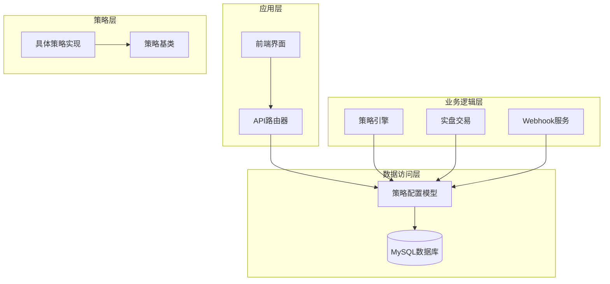
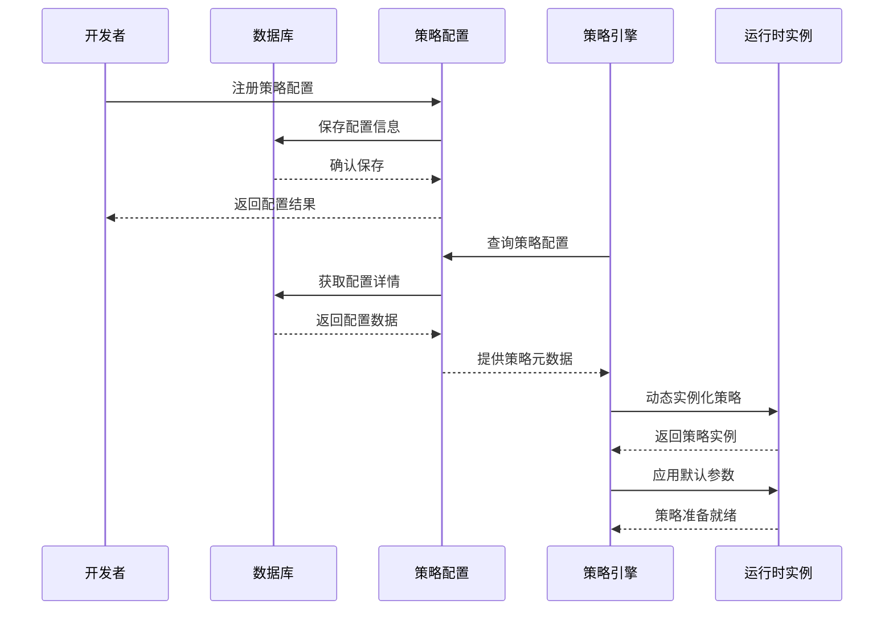
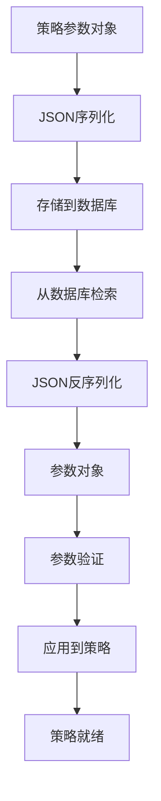
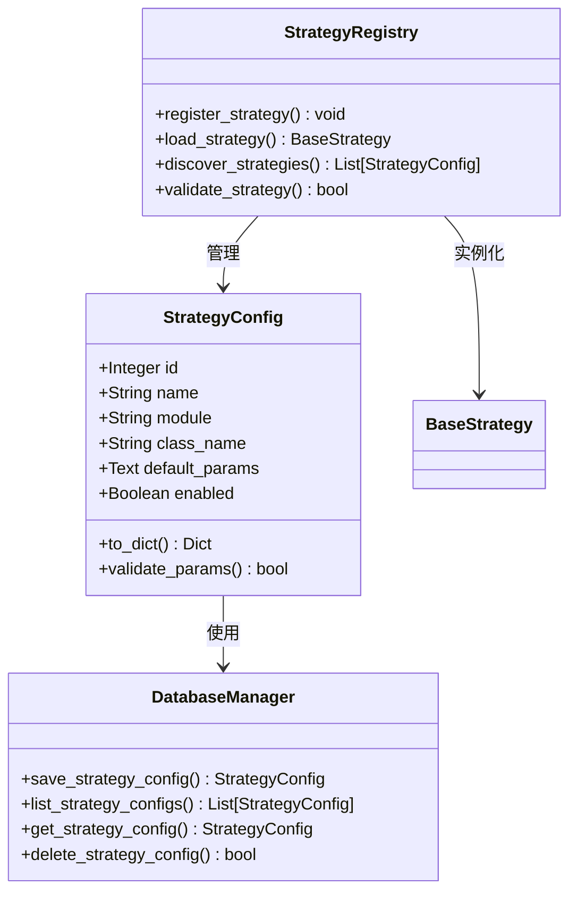
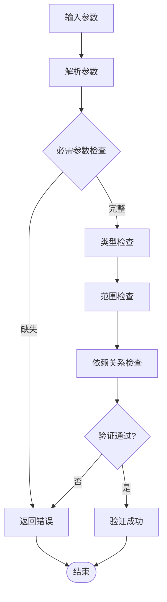
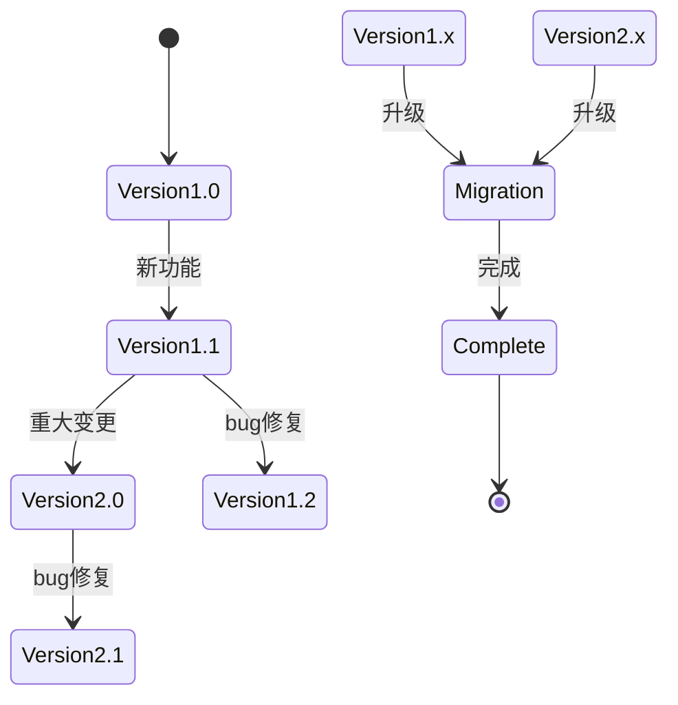
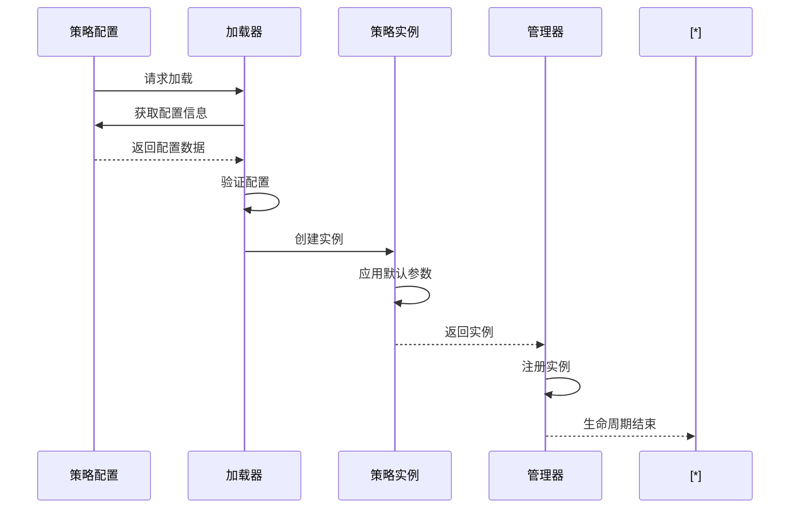
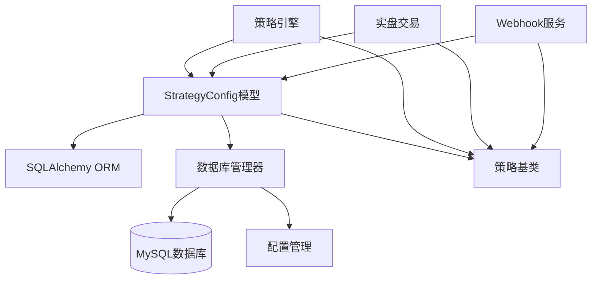

# 策略配置模型

<cite>
**本文档引用的文件**
- [database/models.py](file://backpack_quant_trading/database/models.py)
- [strategy/base.py](file://backpack_quant_trading/strategy/base.py)
- [api/routers/trading.py](file://backpack_quant_trading/api/routers/trading.py)
- [webhook_service.py](file://backpack_quant_trading/webhook_service.py)
- [engine/live_trading.py](file://backpack_quant_trading/engine/live_trading.py)
- [main.py](file://backpack_quant_trading/main.py)
</cite>

## 目录
1. [简介](#简介)
2. [项目结构](#项目结构)
3. [核心组件](#核心组件)
4. [架构概览](#架构概览)
5. [详细组件分析](#详细组件分析)
6. [依赖分析](#依赖分析)
7. [性能考虑](#性能考虑)
8. [故障排除指南](#故障排除指南)
9. [结论](#结论)

## 简介

策略配置模型是量化交易系统的核心基础设施，负责管理策略的元数据、默认参数和运行配置。本文档深入解析StrategyConfig模型的设计理念、数据结构、工作机制以及在整个系统中的作用。

该模型采用ORM映射方式，将策略配置持久化存储在MySQL数据库中，支持动态策略注册、参数管理、版本控制等功能。通过统一的配置管理机制，实现了策略的标准化部署和灵活的参数定制。

## 项目结构

项目采用分层架构设计，策略配置模型位于数据库层，为上层策略引擎、API路由和前端界面提供统一的数据支撑。

**图表来源**
- [database/models.py:254-264](file://backpack_quant_trading/database/models.py#L254-L264)
- [strategy/base.py:41-212](file://backpack_quant_trading/strategy/base.py#L41-L212)

## 核心组件

### StrategyConfig模型定义

StrategyConfig是策略配置的核心数据模型，采用SQLAlchemy ORM映射到数据库表。

| 字段名 | 类型 | 约束 | 描述 |
|--------|------|------|------|
| id | Integer | 主键, 自增 | 策略配置唯一标识符 |
| name | String(50) | 非空, 唯一 | 策略名称，全局唯一标识 |
| module | String(255) | 非空 | 策略模块路径，用于动态导入 |
| class_name | String(255) | 非空 | 策略类名，动态实例化使用 |
| default_params | Text | 可空 | JSON字符串形式的默认参数 |
| enabled | Boolean | 默认True | 策略启用状态 |

### 数据库管理器

DatabaseManager提供了完整的CRUD操作接口，包括策略配置的保存、查询和管理功能。

**章节来源**
- [database/models.py:254-264](file://backpack_quant_trading/database/models.py#L254-L264)
- [database/models.py:685-718](file://backpack_quant_trading/database/models.py#L685-L718)

## 架构概览

策略配置模型在整个系统中扮演着"配置中心"的角色，连接着策略开发、部署和运行的各个环节。

**图表来源**
- [database/models.py:693-718](file://backpack_quant_trading/database/models.py#L693-L718)
- [engine/live_trading.py:588-614](file://backpack_quant_trading/engine/live_trading.py#L588-L614)

## 详细组件分析

### 策略元数据管理

策略元数据管理是StrategyConfig的核心功能，负责维护策略的基本信息和运行参数。

#### 字段定义详解

**name字段**
- 全局唯一性约束，确保每个策略名称的唯一性
- 作为策略的标识符，在系统中广泛使用
- 支持中文命名，便于理解

**module字段**
- 存储策略模块的完整导入路径
- 支持相对路径和绝对路径
- 用于动态模块导入机制

**class_name字段**
- 策略类的完整类名
- 与module配合实现动态类实例化
- 支持复杂的类继承层次

**default_params字段**
- JSON字符串格式存储，默认参数集合
- 支持任意层级的嵌套结构
- 便于序列化和反序列化操作

**enabled字段**
- 控制策略的启用状态
- 支持动态启用/禁用策略
- 影响策略发现和加载过程

#### 参数序列化机制

策略参数采用JSON序列化存储，提供了灵活的数据交换能力：

**图表来源**
- [database/models.py:262](file://backpack_quant_trading/database/models.py#L262)

**章节来源**
- [database/models.py:258-263](file://backpack_quant_trading/database/models.py#L258-L263)

### 策略注册表工作机制

策略注册表是一个集中化的策略管理机制，负责策略的发现、注册和生命周期管理。

#### 动态加载流程

策略动态加载采用"配置驱动"的方式，通过以下步骤实现：

1. **配置检索**：从数据库查询策略配置信息
2. **模块导入**：根据module字段动态导入策略模块
3. **类实例化**：使用class_name创建策略类实例
4. **参数应用**：将default_params应用到策略实例
5. **状态初始化**：设置策略的启用状态

**图表来源**
- [database/models.py:254-264](file://backpack_quant_trading/database/models.py#L254-L264)
- [database/models.py:685-718](file://backpack_quant_trading/database/models.py#L685-L718)

#### 策略发现机制

策略发现机制支持多种发现方式：

**数据库发现**
- 通过查询strategy_config表获取所有策略配置
- 支持过滤条件，如enabled=True
- 提供排序和分页功能

**文件系统发现**
- 扫描策略模块目录
- 自动发现符合命名规范的策略文件
- 支持递归扫描子目录

**动态发现**
- 运行时检测新添加的策略
- 自动注册未注册的策略
- 支持热重载机制

**章节来源**
- [database/models.py:685-691](file://backpack_quant_trading/database/models.py#L685-L691)

### 参数验证规则

策略参数验证确保了参数的完整性和有效性，防止无效配置影响策略运行。

#### 验证规则体系

**必需参数验证**
- 检查必填参数是否存在
- 验证参数类型是否正确
- 确认参数值在合理范围内

**可选参数验证**
- 验证参数的默认值
- 检查参数之间的依赖关系
- 确认参数组合的有效性

**格式验证**
- JSON格式验证
- 数值范围检查
- 字符串长度限制

#### 参数验证流程

**图表来源**
- [strategy/base.py:170-174](file://backpack_quant_trading/strategy/base.py#L170-L174)

**章节来源**
- [strategy/base.py:170-174](file://backpack_quant_trading/strategy/base.py#L170-L174)

### 版本管理策略

版本管理确保了策略配置的演进和兼容性，支持策略的迭代升级。

#### 版本控制机制

**语义化版本**
- 主版本号：重大变更
- 次版本号：功能新增
- 修订号：bug修复

**向后兼容性**
- 保持参数名称的稳定性
- 提供参数迁移脚本
- 支持渐进式升级

**配置迁移**
- 自动检测配置版本
- 执行版本间的配置转换
- 保留用户自定义设置

#### 版本管理流程

### 策略配置与实例运行关系

策略配置模型与策略实例之间建立了紧密的关联关系，确保配置信息能够正确传递到运行时。

#### 生命周期管理

**创建阶段**
- 从数据库加载策略配置
- 验证配置的完整性和有效性
- 动态导入策略模块
- 实例化策略类

**运行阶段**
- 应用默认参数到策略实例
- 监控策略运行状态
- 记录运行时配置变更
- 处理异常情况

**销毁阶段**
- 清理策略资源
- 释放内存占用
- 关闭数据库连接
- 记录销毁原因

**图表来源**
- [engine/live_trading.py:588-614](file://backpack_quant_trading/engine/live_trading.py#L588-L614)

**章节来源**
- [engine/live_trading.py:588-614](file://backpack_quant_trading/engine/live_trading.py#L588-L614)

## 依赖分析

策略配置模型的依赖关系相对简单，主要依赖于数据库层和策略基类。

**图表来源**
- [database/models.py:254-264](file://backpack_quant_trading/database/models.py#L254-L264)
- [strategy/base.py:41-212](file://backpack_quant_trading/strategy/base.py#L41-L212)

### 组件耦合度分析

策略配置模型具有较低的内部耦合度，主要体现在：

**低内聚性**
- 每个字段职责明确
- 方法功能单一
- 数据结构清晰

**低耦合性**
- 与数据库层松耦合
- 与策略引擎解耦
- 与API层分离

**高扩展性**
- 支持动态参数扩展
- 易于添加新字段
- 灵活的配置管理

**章节来源**
- [database/models.py:254-264](file://backpack_quant_trading/database/models.py#L254-L264)

## 性能考虑

策略配置模型在设计时充分考虑了性能因素，采用了多种优化策略。

### 数据库性能优化

**索引策略**
- name字段建立唯一索引，保证查询效率
- enabled字段建立普通索引，支持状态过滤
- 组合索引优化常用查询模式

**查询优化**
- 使用惰性加载避免不必要的数据传输
- 支持批量查询减少数据库往返
- 缓存热点配置数据

### 内存管理

**对象池**
- 复用策略配置对象
- 避免频繁的内存分配
- 支持对象回收机制

**延迟加载**
- 延迟加载默认参数
- 按需解析JSON数据
- 减少内存占用

### 并发处理

**线程安全**
- 数据库连接池支持并发访问
- 配置缓存线程安全
- 锁机制保护共享资源

**异步处理**
- 支持异步配置加载
- 非阻塞数据库操作
- 并发策略实例管理

## 故障排除指南

### 常见问题及解决方案

**配置加载失败**
- 检查数据库连接是否正常
- 验证策略模块路径是否正确
- 确认类名是否存在

**参数验证错误**
- 检查JSON格式是否正确
- 验证参数类型是否匹配
- 确认参数值在有效范围内

**实例化失败**
- 检查策略类的构造函数
- 验证依赖的外部库
- 确认运行时环境

### 调试技巧

**日志记录**
- 记录详细的错误信息
- 跟踪配置加载过程
- 监控性能指标

**监控指标**
- 配置查询响应时间
- 实例化成功率
- 内存使用情况

**诊断工具**
- 配置验证工具
- 实例化测试工具
- 性能分析工具

**章节来源**
- [database/models.py:693-718](file://backpack_quant_trading/database/models.py#L693-L718)

## 结论

策略配置模型作为量化交易系统的核心基础设施，通过精心设计的数据结构和完善的管理机制，为策略的开发、部署和运行提供了强有力的支持。

该模型的主要优势包括：

**统一性**：提供统一的策略配置管理接口
**灵活性**：支持动态策略注册和参数定制
**可靠性**：完善的验证机制和错误处理
**可扩展性**：支持策略的迭代升级和功能扩展

通过持续的优化和完善，策略配置模型将继续为量化交易系统的稳定运行提供坚实的基础。