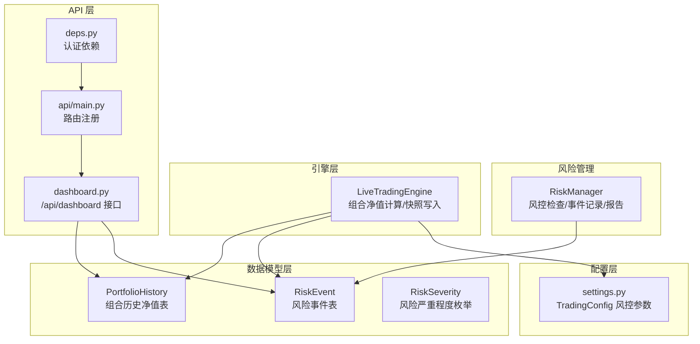
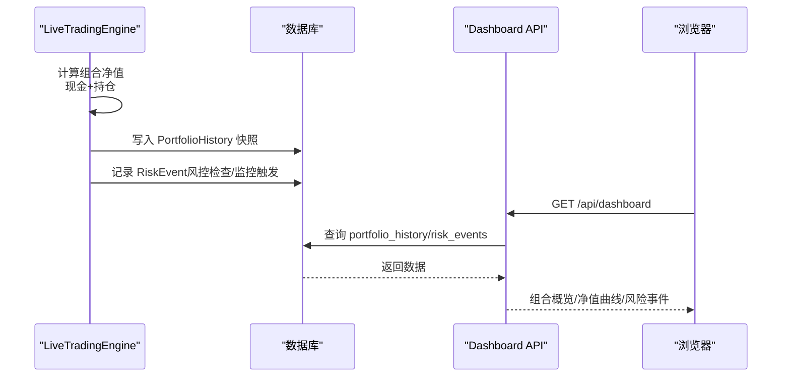
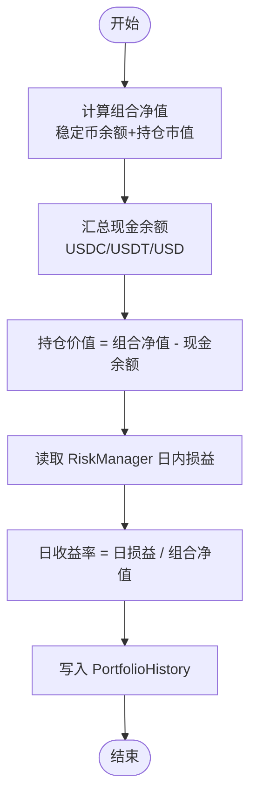
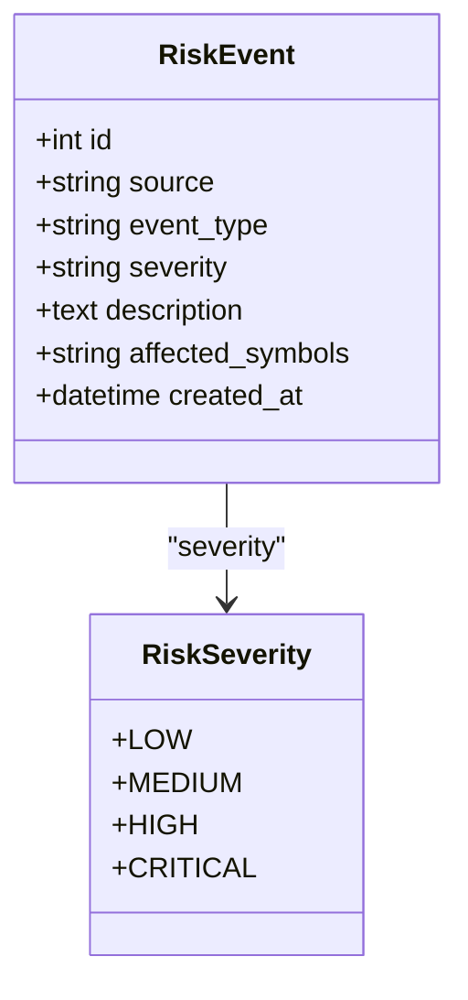
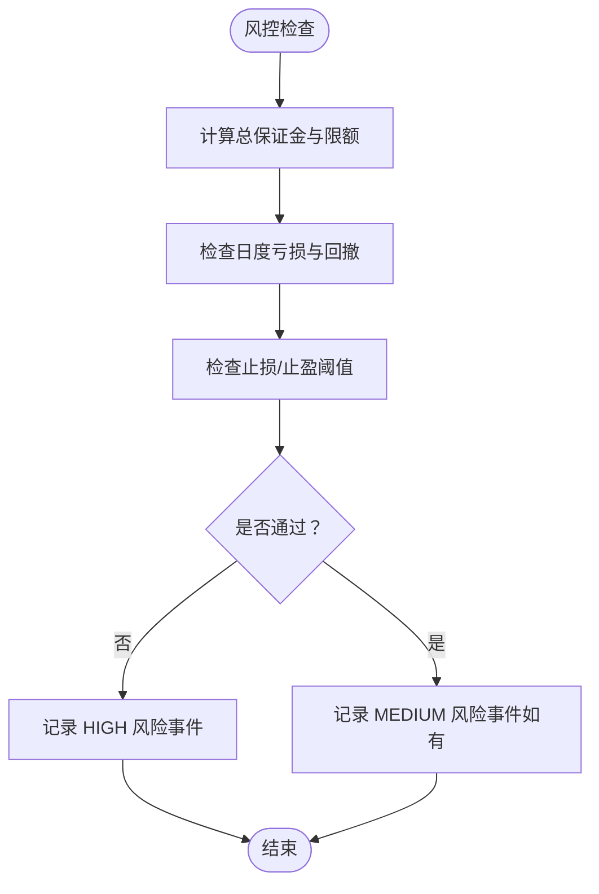
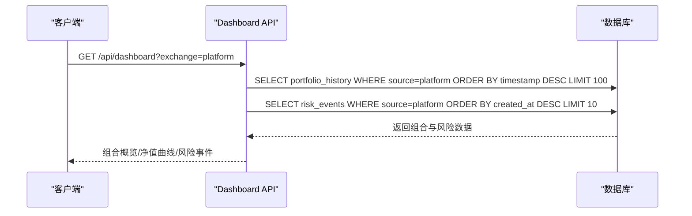
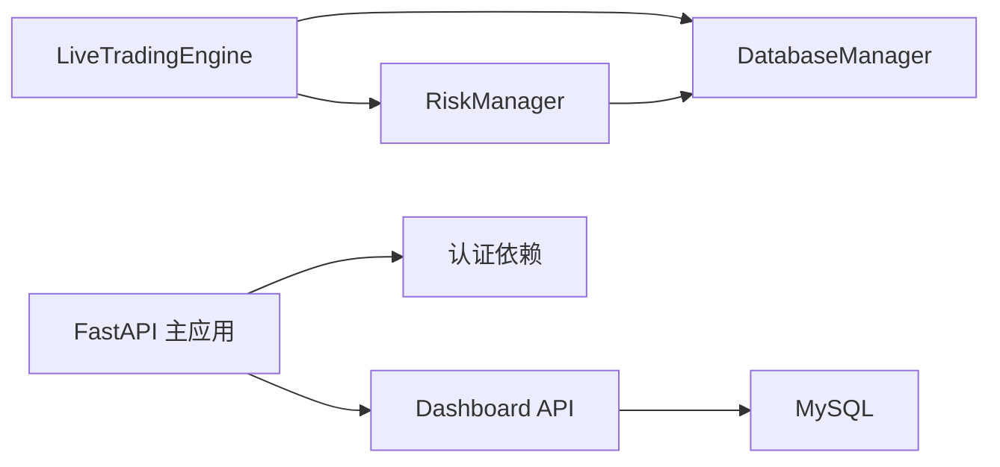

# 组合与风险模型

<cite>
**本文档引用的文件**
- [models.py](file://backpack_quant_trading/database/models.py)
- [risk_manager.py](file://backpack_quant_trading/core/risk_manager.py)
- [settings.py](file://backpack_quant_trading/config/settings.py)
- [dashboard.py](file://backpack_quant_trading/api/routers/dashboard.py)
- [live_trading.py](file://backpack_quant_trading/engine/live_trading.py)
- [main.py](file://backpack_quant_trading/api/main.py)
- [deps.py](file://backpack_quant_trading/api/deps.py)
- [strategy.py](file://backpack_quant_trading/api/routers/strategy.py)
</cite>

## 目录
1. [简介](#简介)
2. [项目结构](#项目结构)
3. [核心组件](#核心组件)
4. [架构总览](#架构总览)
5. [详细组件分析](#详细组件分析)
6. [依赖关系分析](#依赖关系分析)
7. [性能考虑](#性能考虑)
8. [故障排查指南](#故障排查指南)
9. [结论](#结论)
10. [附录](#附录)

## 简介
本文件面向组合历史与风险事件两个核心模型，系统性说明其字段定义、计算逻辑、存储策略、风险分类与严重程度评估、处理流程、告警触发条件，并提供组合监控查询与风险事件分析的实际操作示例。内容严格基于仓库源码，确保技术细节与实现一致。

## 项目结构
围绕组合历史与风险事件的关键文件组织如下：
- 数据模型层：定义 PortfolioHistory 与 RiskEvent 表结构及枚举类型
- 风险管理：RiskManager 提供风控检查、风险事件记录与风险报告生成
- 引擎层：LiveTradingEngine 定期计算组合净值并写入数据库
- API 层：Dashboard 路由提供组合历史与风险事件查询接口
- 配置层：TradingConfig 定义风控阈值与参数

图表来源
- [models.py:38-226](file://backpack_quant_trading/database/models.py#L38-L226)
- [risk_manager.py:48-330](file://backpack_quant_trading/core/risk_manager.py#L48-L330)
- [live_trading.py:2180-2223](file://backpack_quant_trading/engine/live_trading.py#L2180-L2223)
- [dashboard.py:26-131](file://backpack_quant_trading/api/routers/dashboard.py#L26-L131)
- [main.py:36-49](file://backpack_quant_trading/api/main.py#L36-L49)
- [deps.py:44-73](file://backpack_quant_trading/api/deps.py#L44-L73)
- [settings.py:55-65](file://backpack_quant_trading/config/settings.py#L55-L65)

章节来源
- [models.py:38-226](file://backpack_quant_trading/database/models.py#L38-L226)
- [risk_manager.py:48-330](file://backpack_quant_trading/core/risk_manager.py#L48-L330)
- [live_trading.py:2180-2223](file://backpack_quant_trading/engine/live_trading.py#L2180-L2223)
- [dashboard.py:26-131](file://backpack_quant_trading/api/routers/dashboard.py#L26-L131)
- [main.py:36-49](file://backpack_quant_trading/api/main.py#L36-L49)
- [deps.py:44-73](file://backpack_quant_trading/api/deps.py#L44-L73)
- [settings.py:55-65](file://backpack_quant_trading/config/settings.py#L55-L65)

## 核心组件
- PortfolioHistory（组合历史净值表）
  - 字段：timestamp、portfolio_value、cash_balance、position_value、daily_pnl、daily_return
  - 存储策略：每分钟由引擎计算并写入数据库
- RiskEvent（风险事件表）
  - 字段：event_type、severity、description、affected_symbols、created_at
  - 存储策略：风控检查或监控触发时写入数据库
- RiskSeverity（风险严重程度枚举）
  - 分级：LOW、MEDIUM、HIGH、CRITICAL
- RiskManager（风险管理器）
  - 负责风控检查、风险事件记录、风险报告生成
- LiveTradingEngine（实盘引擎）
  - 负责组合净值计算、每日损益统计、风险事件记录与数据库写入

章节来源
- [models.py:192-226](file://backpack_quant_trading/database/models.py#L192-L226)
- [models.py:38-43](file://backpack_quant_trading/database/models.py#L38-L43)
- [risk_manager.py:48-330](file://backpack_quant_trading/core/risk_manager.py#L48-L330)
- [live_trading.py:2180-2223](file://backpack_quant_trading/engine/live_trading.py#L2180-L2223)

## 架构总览
组合历史与风险事件贯穿“引擎计算—数据库持久化—API查询”的闭环，风控参数来源于配置层，最终服务于仪表盘展示与告警触发。

图表来源
- [live_trading.py:2180-2223](file://backpack_quant_trading/engine/live_trading.py#L2180-L2223)
- [dashboard.py:26-131](file://backpack_quant_trading/api/routers/dashboard.py#L26-L131)
- [models.py:192-226](file://backpack_quant_trading/database/models.py#L192-L226)

## 详细组件分析

### 组合历史（PortfolioHistory）模型
- 字段定义与含义
  - timestamp：快照时间
  - portfolio_value：组合总净值（现金余额 + 持仓价值）
  - cash_balance：现金余额（USDC/USDT/USD 等稳定币合计）
  - position_value：持仓价值（portfolio_value - cash_balance）
  - daily_pnl：当日累计盈亏（RiskManager 维护）
  - daily_return：当日收益率（daily_pnl / portfolio_value × 100）

- 计算逻辑与存储策略
  - 组合净值计算：遍历账户稳定币余额与持仓市值求和
  - 现金余额：筛选 USDC/USDT/USD 等稳定币可用余额求和
  - 持仓价值：组合净值 - 现金余额
  - 日内损益：RiskManager 累计，引擎每分钟写入
  - 日收益率：当日损益 / 总净值（若净值为 0 则为 0）

- 数据库写入
  - 引擎每分钟触发一次快照写入，统一转换为浮点数写入数据库

图表来源
- [live_trading.py:2152-2216](file://backpack_quant_trading/engine/live_trading.py#L2152-L2216)
- [risk_manager.py:270-280](file://backpack_quant_trading/core/risk_manager.py#L270-L280)

章节来源
- [models.py:210-226](file://backpack_quant_trading/database/models.py#L210-L226)
- [live_trading.py:2152-2216](file://backpack_quant_trading/engine/live_trading.py#L2152-L2216)
- [risk_manager.py:270-280](file://backpack_quant_trading/core/risk_manager.py#L270-L280)

### 风险事件（RiskEvent）模型
- 字段定义与含义
  - event_type：事件类型（如 order_rejected、risk_warning、position_closed）
  - severity：严重程度（LOW/MEDIUM/HIGH/CRITICAL）
  - description：事件描述（JSON 字符串化）
  - affected_symbols：受影响的交易对（逗号分隔）
  - created_at：事件发生时间

- 风险严重程度评估
  - LOW：一般性提示
  - MEDIUM：中等风险，可能影响交易决策
  - HIGH：高风险，建议暂停交易或降低仓位
  - CRITICAL：严重风险，需立即干预

- 风险事件记录机制
  - 风控检查拒绝订单时记录 HIGH
  - 风控检查警告时记录 MEDIUM
  - 持仓平仓时记录 position_closed
  - 事件写入数据库并带有 source 标识

图表来源
- [models.py:192-208](file://backpack_quant_trading/database/models.py#L192-L208)
- [models.py:38-43](file://backpack_quant_trading/database/models.py#L38-L43)

章节来源
- [models.py:192-208](file://backpack_quant_trading/database/models.py#L192-L208)
- [models.py:38-43](file://backpack_quant_trading/database/models.py#L38-L43)
- [risk_manager.py:302-330](file://backpack_quant_trading/core/risk_manager.py#L302-L330)

### 风控检查与事件处理流程
- 风控检查要点
  - 保证金上限：总保证金 ≤ 账户资金 × MAX_POSITION_SIZE
  - 日度亏损：日度亏损 ≥ MAX_DAILY_LOSS
  - 回撤：当前回撤 ≥ MAX_DRAWDOWN（阈值触发警告）
  - 止损/止盈：根据 STOP_LOSS_PERCENT、TAKE_PROFIT_PERCENT 计算

- 事件记录与严重程度判定
  - 风控检查拒绝：severity=HIGH
  - 风控检查警告：severity=MEDIUM
  - 其他事件：severity 默认 MEDIUM

图表来源
- [risk_manager.py:132-230](file://backpack_quant_trading/core/risk_manager.py#L132-L230)
- [risk_manager.py:302-330](file://backpack_quant_trading/core/risk_manager.py#L302-L330)

章节来源
- [risk_manager.py:132-230](file://backpack_quant_trading/core/risk_manager.py#L132-L230)
- [risk_manager.py:302-330](file://backpack_quant_trading/core/risk_manager.py#L302-L330)

### 风险严重程度分级标准
- LOW：轻微风险或提示信息
- MEDIUM：中等风险，建议关注
- HIGH：高风险，建议暂停交易或降低仓位
- CRITICAL：严重风险，需立即干预

章节来源
- [models.py:38-43](file://backpack_quant_trading/database/models.py#L38-L43)

### 组合监控查询与风险事件分析（API 示例）
- 组合概览与净值曲线
  - 请求：GET /api/dashboard?exchange=platform
  - 返回：最新组合净值、现金余额、当日损益、当日收益、最近100条净值曲线
- 风险事件
  - 请求：GET /api/dashboard?exchange=platform
  - 返回：最近10条风险事件（event_type、severity、description、affected_symbols）

图表来源
- [dashboard.py:26-131](file://backpack_quant_trading/api/routers/dashboard.py#L26-L131)

章节来源
- [dashboard.py:26-131](file://backpack_quant_trading/api/routers/dashboard.py#L26-L131)

### 风控参数与告警触发条件（配置）
- 风控参数（来自 TradingConfig）
  - MAX_POSITION_SIZE：单笔最大仓位比例（账户资金占比）
  - MAX_DAILY_LOSS：单日最大亏损阈值
  - MAX_DRAWDOWN：最大回撤阈值
  - STOP_LOSS_PERCENT：止损阈值（百分比）
  - TAKE_PROFIT_PERCENT：止盈阈值（百分比）
  - LEVERAGE：默认杠杆倍数

- 告警触发条件
  - 保证金超限：总保证金超过限额
  - 日度亏损达限：日度亏损达到阈值
  - 回撤接近上限：当前回撤接近阈值（触发警告）
  - 订单被拒：风控检查拒绝订单（触发 HIGH）

章节来源
- [settings.py:55-65](file://backpack_quant_trading/config/settings.py#L55-L65)
- [risk_manager.py:132-230](file://backpack_quant_trading/core/risk_manager.py#L132-L230)

## 依赖关系分析
- 组件耦合
  - LiveTradingEngine 依赖 RiskManager 进行风控与日度损益统计
  - RiskManager 依赖 DatabaseManager 写入 RiskEvent
  - LiveTradingEngine 依赖 DatabaseManager 写入 PortfolioHistory
  - Dashboard API 依赖数据库查询组合历史与风险事件
- 外部依赖
  - 数据库：MySQL（通过 SQLAlchemy）
  - 认证：JWT 令牌与 Cookie

图表来源
- [live_trading.py:368-370](file://backpack_quant_trading/engine/live_trading.py#L368-L370)
- [risk_manager.py:48-54](file://backpack_quant_trading/core/risk_manager.py#L48-L54)
- [dashboard.py:22-23](file://backpack_quant_trading/api/routers/dashboard.py#L22-L23)
- [main.py:36-49](file://backpack_quant_trading/api/main.py#L36-L49)
- [deps.py:44-73](file://backpack_quant_trading/api/deps.py#L44-L73)

章节来源
- [live_trading.py:368-370](file://backpack_quant_trading/engine/live_trading.py#L368-L370)
- [risk_manager.py:48-54](file://backpack_quant_trading/core/risk_manager.py#L48-L54)
- [dashboard.py:22-23](file://backpack_quant_trading/api/routers/dashboard.py#L22-L23)
- [main.py:36-49](file://backpack_quant_trading/api/main.py#L36-L49)
- [deps.py:44-73](file://backpack_quant_trading/api/deps.py#L44-L73)

## 性能考虑
- 组合净值计算
  - 每分钟一次，成本较低（稳定币余额与持仓市值求和）
- 数据库写入
  - PortfolioHistory 与 RiskEvent 写入频率分别为 1/分钟与按事件触发，避免高频写入
- API 查询
  - Dashboard 限制返回条数（净值100条、风险10条），降低查询负载
- 风控检查
  - 下单前进行风控检查，避免无效下单与重复检查

## 故障排查指南
- 组合净值异常
  - 检查稳定币余额汇总逻辑与持仓市值计算
  - 确认引擎每分钟快照是否正常写入
- 风险事件缺失
  - 检查风控检查是否触发记录（拒绝/警告）
  - 确认 DatabaseManager.save_risk_event 是否调用
- API 查询无数据
  - 检查 exchange 参数与 source 字段匹配
  - 确认数据库连接与表存在

章节来源
- [live_trading.py:2180-2223](file://backpack_quant_trading/engine/live_trading.py#L2180-L2223)
- [risk_manager.py:302-330](file://backpack_quant_trading/core/risk_manager.py#L302-L330)
- [dashboard.py:26-131](file://backpack_quant_trading/api/routers/dashboard.py#L26-L131)

## 结论
PortfolioHistory 与 RiskEvent 模型在本项目中承担着组合净值记录与风险事件沉淀的核心职责。通过风控参数配置与引擎定时快照，实现了稳健的组合监控与风险告警能力。Dashboard API 提供简洁的数据查询入口，便于实时观测与分析。

## 附录
- 实际操作示例（基于 API）
  - 获取组合概览与净值曲线
    - 请求：GET /api/dashboard?exchange=platform
    - 返回：portfolio_value、cash_balance、daily_pnl、daily_return、净值曲线
  - 获取风险事件
    - 请求：GET /api/dashboard?exchange=platform
    - 返回：event_type、severity、description、affected_symbols

章节来源
- [dashboard.py:26-131](file://backpack_quant_trading/api/routers/dashboard.py#L26-L131)