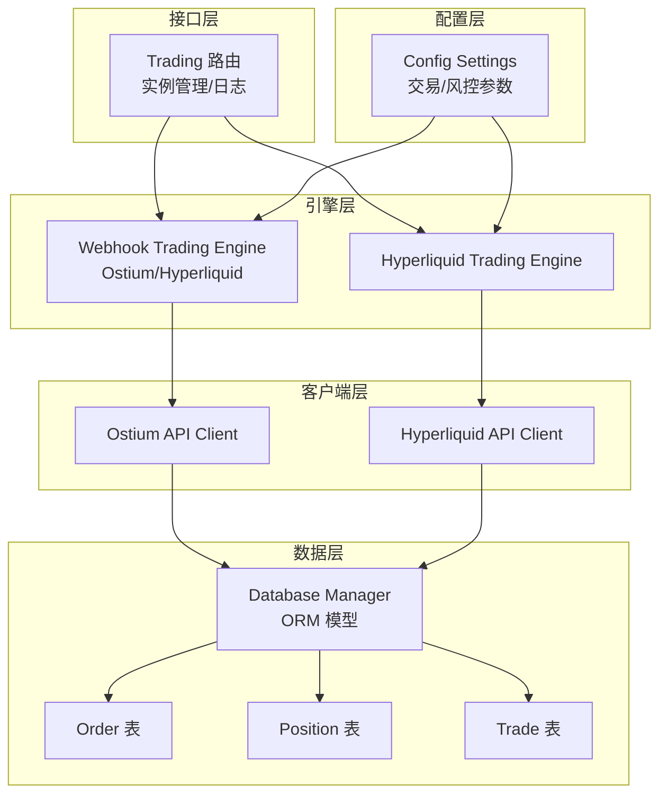
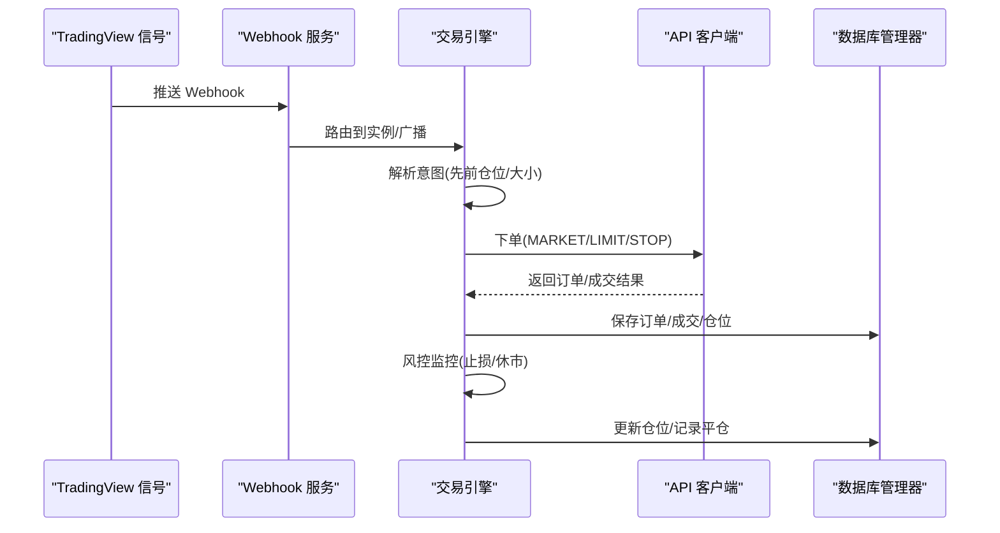
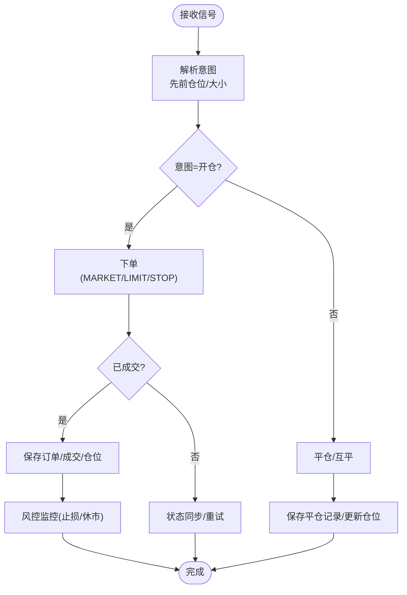
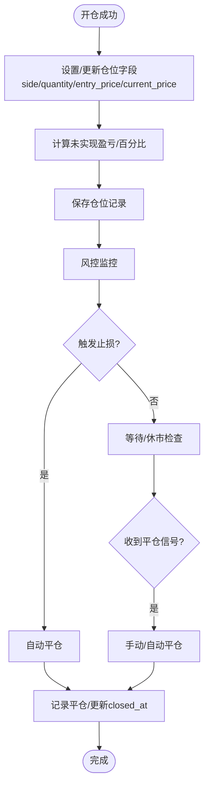
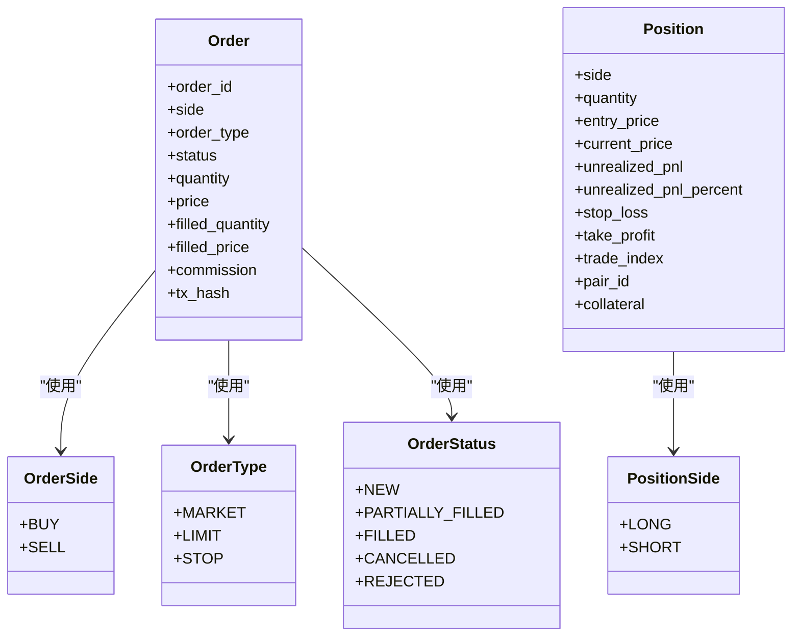
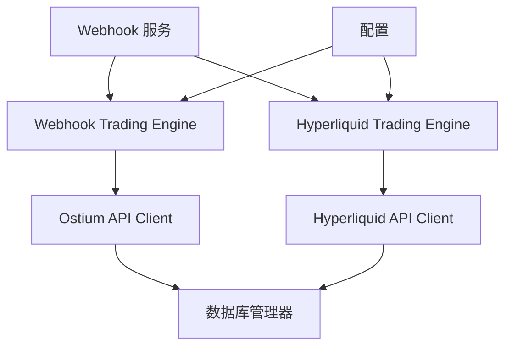

# 订单与仓位模型

<cite>
**本文引用的文件**
- [database/models.py](file://backpack_quant_trading/database/models.py)
- [engine/webhook_trading.py](file://backpack_quant_trading/engine/webhook_trading.py)
- [webhook_service.py](file://backpack_quant_trading/webhook_service.py)
- [core/ostium_client.py](file://backpack_quant_trading/core/ostium_client.py)
- [core/hyperliquid_client.py](file://backpack_quant_trading/core/hyperliquid_client.py)
- [engine/hyperliquid_trading.py](file://backpack_quant_trading/engine/hyperliquid_trading.py)
- [config/settings.py](file://backpack_quant_trading/config/settings.py)
- [api/routers/trading.py](file://backpack_quant_trading/api/routers/trading.py)
</cite>

## 目录
1. [简介](#简介)
2. [项目结构](#项目结构)
3. [核心组件](#核心组件)
4. [架构概览](#架构概览)
5. [详细组件分析](#详细组件分析)
6. [依赖分析](#依赖分析)
7. [性能考虑](#性能考虑)
8. [故障排除指南](#故障排除指南)
9. [结论](#结论)

## 简介
本文档围绕量化交易系统中的订单(Order)与仓位(Position)模型展开，系统性阐述：
- 订单表字段定义与业务含义、数据类型与约束
- 仓位表字段定义与计算逻辑（含未实现盈亏、止盈止损等风控字段）
- 订单状态枚举(OrderStatus)与方向枚举(OrderSide)的使用场景
- 订单生命周期管理、仓位计算公式与风险控制字段的实现细节
- 订单查询、仓位更新与状态同步的实际操作示例

## 项目结构
本项目采用分层架构：
- 数据层：基于 SQLAlchemy 的 ORM 模型与数据库管理器
- 引擎层：Webhook 交易引擎（Ostium/Hyperliquid），负责信号解析、下单、平仓与风控
- 客户端层：Ostium 与 Hyperliquid API 客户端，封装链上/交易所交互
- 配置层：集中式配置管理，包含交易参数与风控阈值
- 接口层：FastAPI 路由，提供实例管理与日志查询等能力

**图表来源**
- [api/routers/trading.py:105-200](file://backpack_quant_trading/api/routers/trading.py#L105-L200)
- [engine/webhook_trading.py:40-90](file://backpack_quant_trading/engine/webhook_trading.py#L40-L90)
- [engine/hyperliquid_trading.py:27-63](file://backpack_quant_trading/engine/hyperliquid_trading.py#L27-L63)
- [core/ostium_client.py:19-80](file://backpack_quant_trading/core/ostium_client.py#L19-L80)
- [core/hyperliquid_client.py:18-63](file://backpack_quant_trading/core/hyperliquid_client.py#L18-L63)
- [database/models.py:65-121](file://backpack_quant_trading/database/models.py#L65-L121)
- [config/settings.py:55-101](file://backpack_quant_trading/config/settings.py#L55-L101)

**章节来源**
- [api/routers/trading.py:105-200](file://backpack_quant_trading/api/routers/trading.py#L105-L200)
- [engine/webhook_trading.py:40-90](file://backpack_quant_trading/engine/webhook_trading.py#L40-L90)
- [engine/hyperliquid_trading.py:27-63](file://backpack_quant_trading/engine/hyperliquid_trading.py#L27-L63)
- [core/ostium_client.py:19-80](file://backpack_quant_trading/core/ostium_client.py#L19-L80)
- [core/hyperliquid_client.py:18-63](file://backpack_quant_trading/core/hyperliquid_client.py#L18-L63)
- [database/models.py:65-121](file://backpack_quant_trading/database/models.py#L65-L121)
- [config/settings.py:55-101](file://backpack_quant_trading/config/settings.py#L55-L101)

## 核心组件
本节聚焦订单与仓位模型的字段定义、枚举类型与数据持久化。

- 订单(Order)表字段
  - order_id：字符串，唯一标识订单（交易所订单号或链上交易哈希）
  - client_order_id：字符串，客户端自定义订单标识
  - side：字符串，买卖方向（buy/sell）
  - order_type：字符串，订单类型（market/limit/stop）
  - quantity：数值，委托数量（精度为 20,8）
  - price：数值，委托价格（市价单可为空）
  - status：字符串，订单状态（new/partially_filled/filled/cancelled/rejected）
  - filled_quantity：数值，已成交数量
  - filled_price：数值，平均成交价格
  - commission：数值，手续费
  - commission_asset：字符串，手续费资产
  - tx_hash：字符串，链上交易哈希（可空）
  - created_at/updated_at：时间戳，创建与更新时间

- 仓位(Position)表字段
  - side：字符串，方向（long/short）
  - quantity：数值，持有数量
  - entry_price：数值，开仓均价
  - current_price：数值，当前价格（可空）
  - unrealized_pnl：数值，未实现盈亏（可空）
  - unrealized_pnl_percent：数值，未实现盈亏百分比（可空）
  - stop_loss：数值，止损价（可空）
  - take_profit：数值，止盈价（可空）
  - trade_index/pair_id/collateral：扩展字段（Ostium），用于链上定位与保证金
  - opened_at/updated_at/closed_at：时间戳，开仓、更新与平仓时间

- 枚举类型
  - OrderSide：BUY/SELL
  - OrderType：MARKET/LIMIT/STOP
  - OrderStatus：NEW/PARTIALLY_FILLED/FILLED/CANCELLED/REJECTED
  - PositionSide：LONG/SHORT

- 数据持久化
  - 订单/成交/仓位保存由数据库管理器统一处理，包含幂等写入、重复防护与类型转换

**章节来源**
- [database/models.py:14-43](file://backpack_quant_trading/database/models.py#L14-L43)
- [database/models.py:65-91](file://backpack_quant_trading/database/models.py#L65-L91)
- [database/models.py:93-121](file://backpack_quant_trading/database/models.py#L93-L121)
- [database/models.py:316-348](file://backpack_quant_trading/database/models.py#L316-L348)
- [database/models.py:389-454](file://backpack_quant_trading/database/models.py#L389-L454)
- [database/models.py:350-387](file://backpack_quant_trading/database/models.py#L350-L387)

## 架构概览
订单与仓位的生命周期贯穿“信号接收—下单—成交—入库—风控—平仓—记录”的闭环。Ostium 与 Hyperliquid 两条路径在引擎层统一抽象，最终落库到数据库。

**图表来源**
- [webhook_service.py:319-443](file://backpack_quant_trading/webhook_service.py#L319-L443)
- [engine/webhook_trading.py:208-294](file://backpack_quant_trading/engine/webhook_trading.py#L208-L294)
- [core/ostium_client.py:399-624](file://backpack_quant_trading/core/ostium_client.py#L399-L624)
- [core/hyperliquid_client.py:158-340](file://backpack_quant_trading/core/hyperliquid_client.py#L158-L340)
- [database/models.py:316-387](file://backpack_quant_trading/database/models.py#L316-L387)

## 详细组件分析

### 订单模型与生命周期
- 字段与类型
  - 数值字段统一使用高精度十进制类型，保证金融计算精度
  - 时间戳字段使用标准日期时间类型
  - 枚举字段以字符串形式存储，便于跨平台一致性

- 生命周期管理
  - 新单：引擎根据信号与风控参数发起下单
  - 成交：客户端返回成交结果，引擎解析并落库
  - 状态同步：引擎定期查询链上/交易所状态，更新订单与成交记录
  - 取消/拒单：根据状态映射更新订单状态

- 业务要点
  - 市价单自动获取价格并带滑点，限价单需提供价格
  - 限价单成交后解析链上事件索引，用于后续平仓定位
  - 重复订单防护：交易哈希截断与去重，避免重复入库

**图表来源**
- [engine/webhook_trading.py:208-294](file://backpack_quant_trading/engine/webhook_trading.py#L208-L294)
- [engine/webhook_trading.py:367-403](file://backpack_quant_trading/engine/webhook_trading.py#L367-L403)
- [engine/webhook_trading.py:427-540](file://backpack_quant_trading/engine/webhook_trading.py#L427-L540)
- [core/ostium_client.py:399-624](file://backpack_quant_trading/core/ostium_client.py#L399-L624)

**章节来源**
- [database/models.py:65-91](file://backpack_quant_trading/database/models.py#L65-L91)
- [database/models.py:316-348](file://backpack_quant_trading/database/models.py#L316-L348)
- [engine/webhook_trading.py:208-294](file://backpack_quant_trading/engine/webhook_trading.py#L208-L294)
- [core/ostium_client.py:399-624](file://backpack_quant_trading/core/ostium_client.py#L399-L624)

### 仓位模型与计算逻辑
- 字段定义
  - side/quantity/entry_price：基础持仓信息
  - current_price/unrealized_pnl/unrealized_pnl_percent：未实现盈亏（可空）
  - stop_loss/take_profit：风控价（可空）
  - trade_index/pair_id/collateral：Ostium 扩展字段，用于链上定位与保证金

- 计算逻辑
  - 未实现盈亏（未实现盈亏百分比）：在引擎侧计算并落库
  - 止损/止盈：引擎根据配置与实时价格触发风控平仓
  - 平仓：根据链上索引或交易对定位，执行 reduce_only 或市价平仓

- 数据一致性
  - 引擎启动与每次执行信号前同步数据库与链上状态
  - 平仓时设置 closed_at 标记已平仓，避免重复平仓

**图表来源**
- [engine/webhook_trading.py:380-400](file://backpack_quant_trading/engine/webhook_trading.py#L380-L400)
- [engine/webhook_trading.py:501-540](file://backpack_quant_trading/engine/webhook_trading.py#L501-L540)
- [database/models.py:389-454](file://backpack_quant_trading/database/models.py#L389-L454)

**章节来源**
- [database/models.py:93-121](file://backpack_quant_trading/database/models.py#L93-L121)
- [engine/webhook_trading.py:380-400](file://backpack_quant_trading/engine/webhook_trading.py#L380-L400)
- [engine/webhook_trading.py:501-540](file://backpack_quant_trading/engine/webhook_trading.py#L501-L540)

### 订单与仓位的枚举与使用场景
- OrderSide：BUY/SELL，用于下单方向与成交方向一致性校验
- OrderType：MARKET/LIMIT/STOP，决定下单参数与价格处理逻辑
- OrderStatus：NEW/PARTIALLY_FILLED/FILLED/CANCELLED/REJECTED，用于状态机与风控决策
- PositionSide：LONG/SHORT，用于方向判断与盈亏计算

**图表来源**
- [database/models.py:14-43](file://backpack_quant_trading/database/models.py#L14-L43)
- [database/models.py:65-121](file://backpack_quant_trading/database/models.py#L65-L121)

**章节来源**
- [database/models.py:14-43](file://backpack_quant_trading/database/models.py#L14-L43)
- [database/models.py:65-121](file://backpack_quant_trading/database/models.py#L65-L121)

### 实际操作示例

- 订单查询
  - 通过数据库管理器查询订单状态与成交明细，支持按 symbol、status、source 等条件过滤
  - 示例路径：[database/models.py:316-348](file://backpack_quant_trading/database/models.py#L316-L348)

- 仓位更新
  - 引擎在开仓/平仓后调用数据库管理器更新仓位状态与时间戳
  - 示例路径：[engine/webhook_trading.py:380-400](file://backpack_quant_trading/engine/webhook_trading.py#L380-L400)、[database/models.py:389-454](file://backpack_quant_trading/database/models.py#L389-L454)

- 状态同步
  - 引擎启动与每次执行信号前同步数据库与链上状态，确保一致性
  - 示例路径：[engine/webhook_trading.py:93-130](file://backpack_quant_trading/engine/webhook_trading.py#L93-L130)

- Webhook 服务集成
  - 通过 Webhook 服务接收 TradingView 信号，路由到具体实例或广播模式
  - 示例路径：[webhook_service.py:319-443](file://backpack_quant_trading/webhook_service.py#L319-L443)

**章节来源**
- [database/models.py:316-348](file://backpack_quant_trading/database/models.py#L316-L348)
- [database/models.py:389-454](file://backpack_quant_trading/database/models.py#L389-L454)
- [engine/webhook_trading.py:93-130](file://backpack_quant_trading/engine/webhook_trading.py#L93-L130)
- [webhook_service.py:319-443](file://backpack_quant_trading/webhook_service.py#L319-L443)

## 依赖分析
- 组件耦合
  - 引擎依赖客户端进行链上/交易所交互，依赖数据库管理器进行持久化
  - Webhook 服务负责路由与签名验证，连接多个引擎实例
  - 配置模块为引擎与客户端提供统一参数

- 外部依赖
  - Ostium SDK：链上交易、事件解析与价格查询
  - Hyperliquid API：签名、下单、查询与杠杆设置
  - SQLAlchemy：ORM 模型与数据库连接池

**图表来源**
- [webhook_service.py:83-241](file://backpack_quant_trading/webhook_service.py#L83-L241)
- [engine/webhook_trading.py:40-90](file://backpack_quant_trading/engine/webhook_trading.py#L40-L90)
- [engine/hyperliquid_trading.py:27-63](file://backpack_quant_trading/engine/hyperliquid_trading.py#L27-L63)
- [core/ostium_client.py:19-80](file://backpack_quant_trading/core/ostium_client.py#L19-L80)
- [core/hyperliquid_client.py:18-63](file://backpack_quant_trading/core/hyperliquid_client.py#L18-L63)
- [config/settings.py:55-101](file://backpack_quant_trading/config/settings.py#L55-L101)

**章节来源**
- [webhook_service.py:83-241](file://backpack_quant_trading/webhook_service.py#L83-L241)
- [engine/webhook_trading.py:40-90](file://backpack_quant_trading/engine/webhook_trading.py#L40-L90)
- [engine/hyperliquid_trading.py:27-63](file://backpack_quant_trading/engine/hyperliquid_trading.py#L27-L63)
- [core/ostium_client.py:19-80](file://backpack_quant_trading/core/ostium_client.py#L19-L80)
- [core/hyperliquid_client.py:18-63](file://backpack_quant_trading/core/hyperliquid_client.py#L18-L63)
- [config/settings.py:55-101](file://backpack_quant_trading/config/settings.py#L55-L101)

## 性能考虑
- 数据库连接池：通过配置参数控制连接池大小与溢出，避免高并发下的连接瓶颈
- 事件解析：优先从链上事件日志解析索引，降低查询成本
- 价格查询：缓存与默认价格回退，减少外部依赖的阻塞
- 异步处理：引擎与客户端广泛使用异步 I/O，提升吞吐量

[本节为通用指导，无需特定文件引用]

## 故障排除指南
- 订单状态异常
  - 检查链上交易哈希与订单状态映射，必要时通过子图查询订单历史
  - 示例路径：[core/ostium_client.py:737-797](file://backpack_quant_trading/core/ostium_client.py#L737-L797)

- 仓位定位失败
  - trade_index/pair_id 缺失时，利用 SDK 容错机制或回查子图
  - 示例路径：[engine/webhook_trading.py:464-477](file://backpack_quant_trading/engine/webhook_trading.py#L464-L477)

- Webhook 签名验证失败
  - 核对密钥配置与请求头签名，确保一致
  - 示例路径：[webhook_service.py:34-45](file://backpack_quant_trading/webhook_service.py#L34-L45)

- Hyperliquid 账户不存在
  - 检查地址大小写与账户初始化状态，按提示进行首次存款或激活
  - 示例路径：[core/hyperliquid_client.py:298-315](file://backpack_quant_trading/core/hyperliquid_client.py#L298-L315)

**章节来源**
- [core/ostium_client.py:737-797](file://backpack_quant_trading/core/ostium_client.py#L737-L797)
- [engine/webhook_trading.py:464-477](file://backpack_quant_trading/engine/webhook_trading.py#L464-L477)
- [webhook_service.py:34-45](file://backpack_quant_trading/webhook_service.py#L34-L45)
- [core/hyperliquid_client.py:298-315](file://backpack_quant_trading/core/hyperliquid_client.py#L298-L315)

## 结论
本文档系统梳理了订单与仓位模型的字段定义、生命周期与风控实现，明确了 Ostium 与 Hyperliquid 两条路径在引擎层的统一抽象与在数据层的一致落库。通过枚举约束、高精度数值存储与异步处理，系统在复杂市场环境中实现了稳健的订单执行与仓位管理。建议在生产环境中结合配置参数与日志监控，持续优化风控阈值与下单策略。