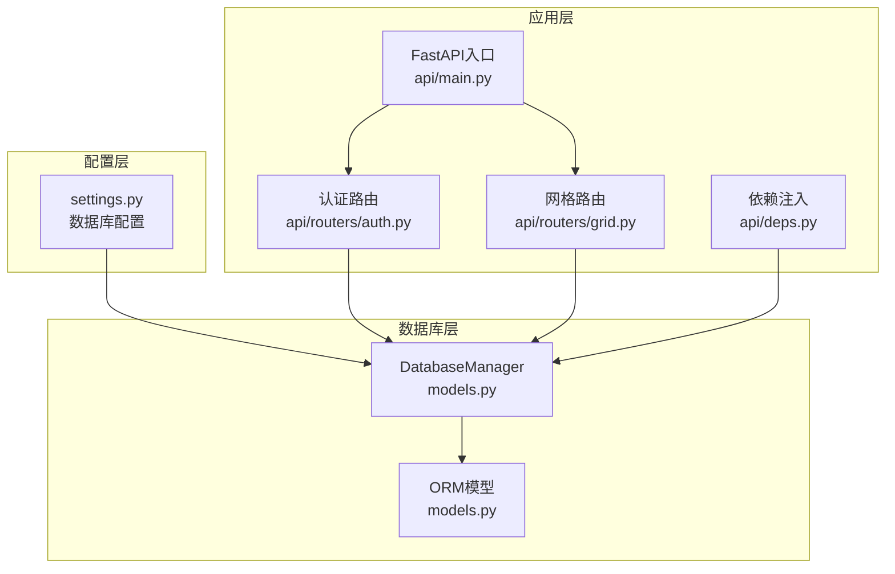
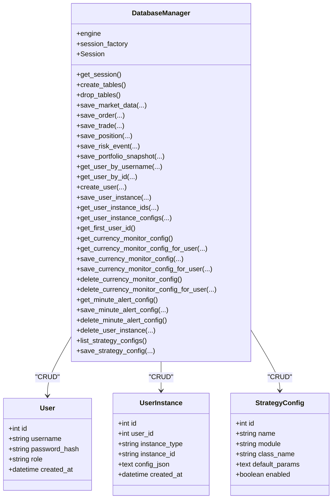
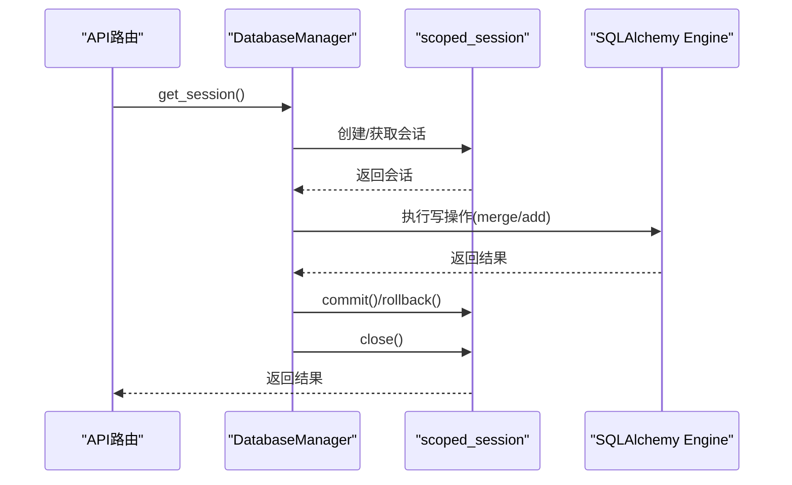
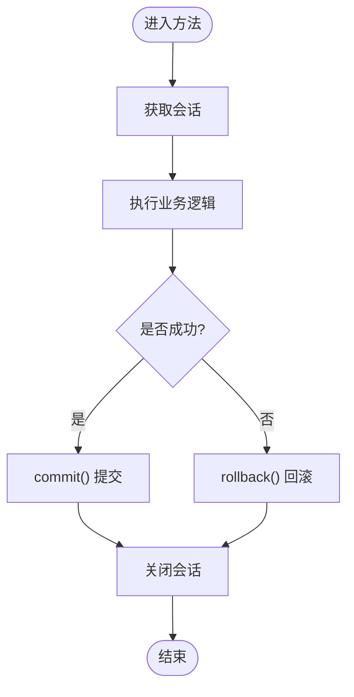
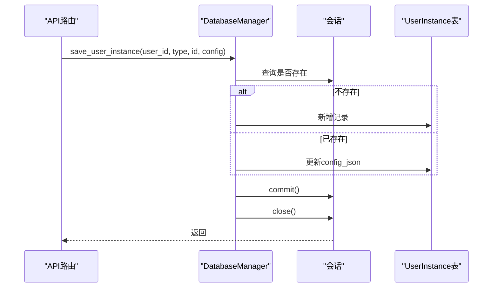
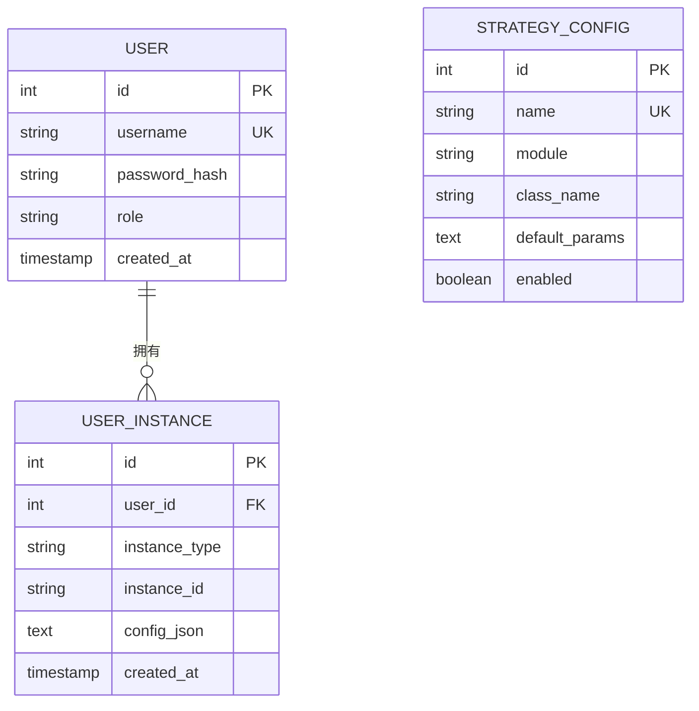
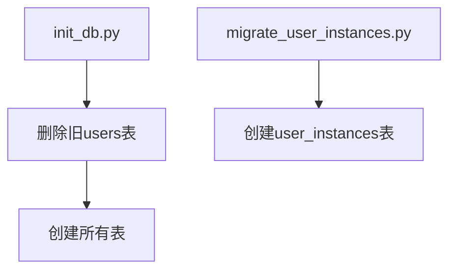
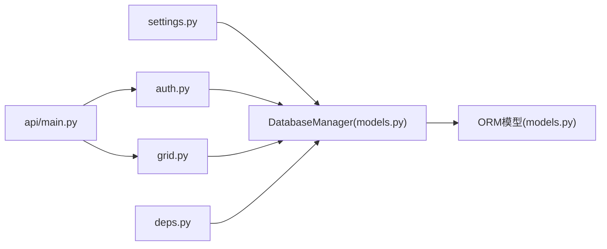

# 数据库管理器

<cite>
**本文档引用的文件**
- [models.py](file://backpack_quant_trading/database/models.py)
- [settings.py](file://backpack_quant_trading/config/settings.py)
- [migrate_user_instances.py](file://backpack_quant_trading/database/migrate_user_instances.py)
- [init_db.py](file://init_db.py)
- [auth.py](file://backpack_quant_trading/api/routers/auth.py)
- [deps.py](file://backpack_quant_trading/api/deps.py)
- [main.py](file://backpack_quant_trading/api/main.py)
- [grid.py](file://backpack_quant_trading/api/routers/grid.py)
</cite>

## 目录
1. [简介](#简介)
2. [项目结构](#项目结构)
3. [核心组件](#核心组件)
4. [架构概览](#架构概览)
5. [详细组件分析](#详细组件分析)
6. [依赖关系分析](#依赖关系分析)
7. [性能考虑](#性能考虑)
8. [故障排查指南](#故障排查指南)
9. [结论](#结论)

## 简介
本文档面向DatabaseManager数据库管理器，提供全面的技术说明，涵盖数据库连接池配置、会话管理机制、事务处理流程，以及核心数据保存方法（如save_user_instance、get_user_instance_ids、save_strategy_config等）的实现原理。同时解释用户实例管理的CRUD操作、配置存储的安全策略与数据一致性保障，并包含数据库初始化流程、连接重试机制与异常处理策略，最后提供性能优化建议与故障排查指南。

## 项目结构
数据库相关代码主要集中在以下位置：
- 数据库模型与管理器：backpack_quant_trading/database/models.py
- 应用配置（数据库连接参数）：backpack_quant_trading/config/settings.py
- 数据库初始化脚本：init_db.py、database/migrate_user_instances.py
- API路由与依赖注入：api/routers/*.py、api/deps.py
- FastAPI应用入口：api/main.py

**图表来源**
- [models.py:267-721](file://backpack_quant_trading/database/models.py#L267-L721)
- [settings.py:44-130](file://backpack_quant_trading/config/settings.py#L44-L130)
- [auth.py:1-79](file://backpack_quant_trading/api/routers/auth.py#L1-L79)
- [grid.py:1-162](file://backpack_quant_trading/api/routers/grid.py#L1-L162)
- [deps.py:1-73](file://backpack_quant_trading/api/deps.py#L1-L73)
- [main.py:1-98](file://backpack_quant_trading/api/main.py#L1-L98)

**章节来源**
- [models.py:1-721](file://backpack_quant_trading/database/models.py#L1-L721)
- [settings.py:1-137](file://backpack_quant_trading/config/settings.py#L1-L137)
- [init_db.py:1-25](file://init_db.py#L1-L25)
- [migrate_user_instances.py:1-15](file://backpack_quant_trading/database/migrate_user_instances.py#L1-L15)
- [auth.py:1-79](file://backpack_quant_trading/api/routers/auth.py#L1-L79)
- [grid.py:1-162](file://backpack_quant_trading/api/routers/grid.py#L1-L162)
- [deps.py:1-73](file://backpack_quant_trading/api/deps.py#L1-L73)
- [main.py:1-98](file://backpack_quant_trading/api/main.py#L1-L98)

## 核心组件
- DatabaseManager：封装SQLAlchemy引擎、会话工厂与scoped_session，提供统一的数据库访问接口。
- ORM模型：MarketData、Order、Position、Trade、AccountBalance、StrategyPerformance、RiskEvent、PortfolioHistory、User、UserInstance、StrategyConfig等。
- 配置系统：通过Config与DatabaseConfig提供数据库连接URL、连接池大小、溢出数量等参数。
- API集成：FastAPI路由通过依赖注入使用DatabaseManager进行用户认证、实例管理与策略配置持久化。

**章节来源**
- [models.py:267-721](file://backpack_quant_trading/database/models.py#L267-L721)
- [settings.py:44-130](file://backpack_quant_trading/config/settings.py#L44-L130)
- [auth.py:1-79](file://backpack_quant_trading/api/routers/auth.py#L1-L79)
- [grid.py:1-162](file://backpack_quant_trading/api/routers/grid.py#L1-L162)
- [deps.py:1-73](file://backpack_quant_trading/api/deps.py#L1-L73)

## 架构概览
DatabaseManager基于SQLAlchemy，采用连接池与scoped_session管理会话生命周期，确保线程安全与资源回收。应用层通过FastAPI路由与依赖注入获取DatabaseManager实例，执行用户认证、实例归属与策略配置的CRUD操作。

**图表来源**
- [models.py:267-721](file://backpack_quant_trading/database/models.py#L267-L721)

## 详细组件分析

### 数据库连接池与会话管理
- 连接池配置
  - 连接池大小：POOL_SIZE
  - 最大溢出：MAX_OVERFLOW
  - 连接健康检查：pool_pre_ping=True
  - 连接URL：由Config.database_url生成，包含主机、端口、用户名、密码与数据库名
- 会话管理
  - 使用sessionmaker绑定engine
  - 使用scoped_session确保线程安全
  - 每次调用get_session()返回独立会话对象
- 事务处理
  - 所有写操作均在try-except块中执行
  - 成功提交commit()，异常时rollback()，最终关闭session()

**图表来源**
- [models.py:270-284](file://backpack_quant_trading/database/models.py#L270-L284)
- [models.py:293-315](file://backpack_quant_trading/database/models.py#L293-L315)
- [models.py:316-349](file://backpack_quant_trading/database/models.py#L316-L349)

**章节来源**
- [models.py:267-284](file://backpack_quant_trading/database/models.py#L267-L284)
- [models.py:293-349](file://backpack_quant_trading/database/models.py#L293-L349)
- [settings.py:44-130](file://backpack_quant_trading/config/settings.py#L44-L130)

### 事务处理流程与异常处理
- 流程要点
  - 获取会话 -> 执行业务逻辑 -> commit或rollback -> 关闭会话
  - 对于重复数据（如trade_id），在写入前进行存在性检查，避免重复插入
  - 对超长字符串（如order_id、tx_hash、trade_id）进行截断，防止数据库约束错误
- 异常处理
  - 捕获异常后立即rollback，确保数据一致性
  - 重新抛出异常，由上层处理（如FastAPI路由转换为HTTP错误）

**图表来源**
- [models.py:350-387](file://backpack_quant_trading/database/models.py#L350-L387)
- [models.py:389-454](file://backpack_quant_trading/database/models.py#L389-L454)

**章节来源**
- [models.py:350-387](file://backpack_quant_trading/database/models.py#L350-L387)
- [models.py:389-454](file://backpack_quant_trading/database/models.py#L389-L454)

### 数据保存方法详解

#### save_user_instance
- 功能：保存用户实例归属（实盘/网格/币种监视），用于按用户隔离与恢复
- 实现要点
  - 查询是否存在相同(user_id, instance_type, instance_id)
  - 不存在则新增，存在则更新config_json
  - 使用add/merge策略确保幂等性
- 安全策略
  - config_json仅存储平台/策略/交易对等元数据，不包含敏感信息
  - 通过用户ID隔离不同用户的实例配置

**图表来源**
- [models.py:540-558](file://backpack_quant_trading/database/models.py#L540-L558)

**章节来源**
- [models.py:540-558](file://backpack_quant_trading/database/models.py#L540-L558)

#### get_user_instance_ids
- 功能：获取某用户某类型的所有instance_id
- 实现：查询UserInstance表，过滤user_id与instance_type，返回instance_id列表

**章节来源**
- [models.py:559-567](file://backpack_quant_trading/database/models.py#L559-L567)

#### save_strategy_config
- 功能：保存或更新策略配置（名称、模块、类名、默认参数）
- 实现：按name查询，不存在则新增，存在则更新字段
- 用途：策略元数据与默认配置持久化

**章节来源**
- [models.py:693-718](file://backpack_quant_trading/database/models.py#L693-L718)

### 用户实例管理的CRUD操作
- 创建：save_user_instance
- 查询：get_user_instance_ids、get_user_instance_configs、get_first_user_id
- 删除：delete_user_instance、delete_currency_monitor_config、delete_currency_monitor_config_for_user、delete_minute_alert_config
- 更新：save_currency_monitor_config、save_currency_monitor_config_for_user、save_minute_alert_config

**图表来源**
- [models.py:239-251](file://backpack_quant_trading/database/models.py#L239-L251)
- [models.py:254-264](file://backpack_quant_trading/database/models.py#L254-L264)

**章节来源**
- [models.py:540-718](file://backpack_quant_trading/database/models.py#L540-L718)

### 配置存储的安全策略与数据一致性
- 安全策略
  - 用户凭据：User表仅存储password_hash，不存储明文密码
  - 实例配置：UserInstance.config_json不存储API Key、私钥等敏感信息
  - 访问控制：API路由依赖require_user，确保登录用户才能操作
- 数据一致性
  - 事务：所有写操作在事务中执行，异常回滚
  - 去重：save_trade对trade_id进行存在性检查，避免重复插入
  - 截断：对超长字段进行截断，防止数据库约束失败

**章节来源**
- [models.py:228-237](file://backpack_quant_trading/database/models.py#L228-L237)
- [models.py:350-387](file://backpack_quant_trading/database/models.py#L350-L387)
- [models.py:540-558](file://backpack_quant_trading/database/models.py#L540-L558)
- [auth.py:1-79](file://backpack_quant_trading/api/routers/auth.py#L1-L79)
- [deps.py:69-73](file://backpack_quant_trading/api/deps.py#L69-L73)

### 数据库初始化流程
- 方式一：init_db.py
  - 删除旧的users表（为修复password_hash长度问题）
  - 重新创建所有表（Base.metadata.create_all）
- 方式二：migrate_user_instances.py
  - 仅创建user_instances表，不删除现有数据

**图表来源**
- [init_db.py:9-24](file://init_db.py#L9-L24)
- [migrate_user_instances.py:8-14](file://backpack_quant_trading/database/migrate_user_instances.py#L8-L14)

**章节来源**
- [init_db.py:1-25](file://init_db.py#L1-L25)
- [migrate_user_instances.py:1-15](file://backpack_quant_trading/database/migrate_user_instances.py#L1-L15)

### 连接重试机制与异常处理策略
- 连接池健康检查：pool_pre_ping=True，自动检测失效连接
- 会话生命周期：每次操作独立获取/关闭会话，避免长时间占用连接
- 异常处理：捕获异常即回滚，确保数据一致性
- API层：FastAPI路由负责将异常转换为HTTP状态码

**章节来源**
- [models.py:270-279](file://backpack_quant_trading/database/models.py#L270-L279)
- [auth.py:33-44](file://backpack_quant_trading/api/routers/auth.py#L33-L44)
- [grid.py:141-150](file://backpack_quant_trading/api/routers/grid.py#L141-L150)

## 依赖关系分析
- DatabaseManager依赖Config.database_url与SQLAlchemy
- API路由通过依赖注入使用DatabaseManager
- 用户认证与实例管理在API层完成，DatabaseManager提供底层数据持久化

**图表来源**
- [settings.py:124-130](file://backpack_quant_trading/config/settings.py#L124-L130)
- [models.py:267-284](file://backpack_quant_trading/database/models.py#L267-L284)
- [auth.py:1-79](file://backpack_quant_trading/api/routers/auth.py#L1-L79)
- [grid.py:1-162](file://backpack_quant_trading/api/routers/grid.py#L1-L162)
- [deps.py:1-73](file://backpack_quant_trading/api/deps.py#L1-L73)
- [main.py:37-49](file://backpack_quant_trading/api/main.py#L37-L49)

**章节来源**
- [settings.py:124-130](file://backpack_quant_trading/config/settings.py#L124-L130)
- [models.py:267-284](file://backpack_quant_trading/database/models.py#L267-L284)
- [auth.py:1-79](file://backpack_quant_trading/api/routers/auth.py#L1-L79)
- [grid.py:1-162](file://backpack_quant_trading/api/routers/grid.py#L1-L162)
- [deps.py:1-73](file://backpack_quant_trading/api/deps.py#L1-L73)
- [main.py:37-49](file://backpack_quant_trading/api/main.py#L37-L49)

## 性能考虑
- 连接池参数
  - POOL_SIZE与MAX_OVERFLOW应结合并发与数据库承载能力调整
  - pool_pre_ping提升连接可用性，减少无效连接导致的失败
- 写入优化
  - 使用merge/add时注意唯一键冲突，避免不必要的UPDATE
  - 对批量写入场景，可考虑分批提交以平衡吞吐与延迟
- 查询优化
  - 为高频查询字段建立索引（如User.username、UserInstance.user_id+instance_type+instance_id）
  - 避免N+1查询，尽量一次性获取所需数据
- 事务粒度
  - 将相关联的写操作放在同一事务中，减少锁竞争
- I/O与序列化
  - Decimal数值类型确保精度，避免浮点误差
  - 对超长字符串进行截断，减少存储与网络传输开销

## 故障排查指南
- 连接失败
  - 检查DB_HOST、DB_PORT、DB_USER、DB_PASSWORD与DB_NAME配置
  - 确认MySQL服务可达，防火墙放行端口
- 表结构不一致
  - 使用init_db.py重建所有表（注意：会删除users表数据）
  - 使用migrate_user_instances.py仅创建user_instances表
- 重复数据或约束错误
  - 检查save_trade对trade_id的去重逻辑
  - 检查save_order/save_trade对超长字段的截断逻辑
- 权限与认证问题
  - 确认JWT密钥与算法配置正确
  - 检查用户角色与实例归属是否匹配

**章节来源**
- [init_db.py:9-24](file://init_db.py#L9-L24)
- [migrate_user_instances.py:8-14](file://backpack_quant_trading/database/migrate_user_instances.py#L8-L14)
- [models.py:350-387](file://backpack_quant_trading/database/models.py#L350-L387)
- [models.py:316-349](file://backpack_quant_trading/database/models.py#L316-L349)
- [auth.py:33-44](file://backpack_quant_trading/api/routers/auth.py#L33-L44)
- [deps.py:28-41](file://backpack_quant_trading/api/deps.py#L28-L41)

## 结论
DatabaseManager提供了稳定、安全且高效的数据库访问能力。通过合理的连接池配置、严格的事务管理与异常处理、以及安全的配置存储策略，系统能够可靠地支撑用户认证、实例管理与策略配置等核心功能。建议在生产环境中根据实际负载调整连接池参数，并持续监控数据库性能与连接状态，确保系统的高可用与高性能。