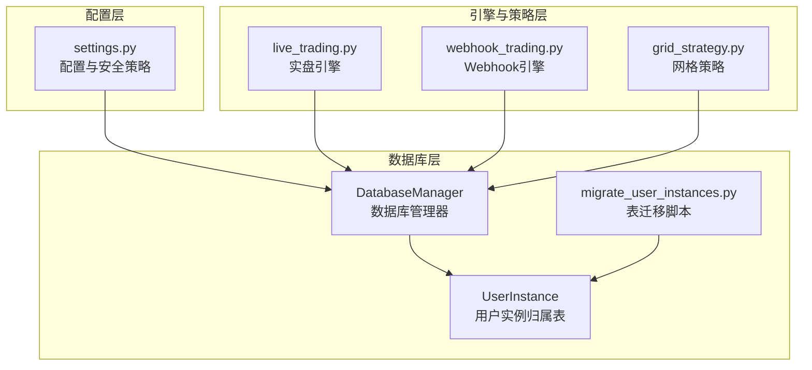
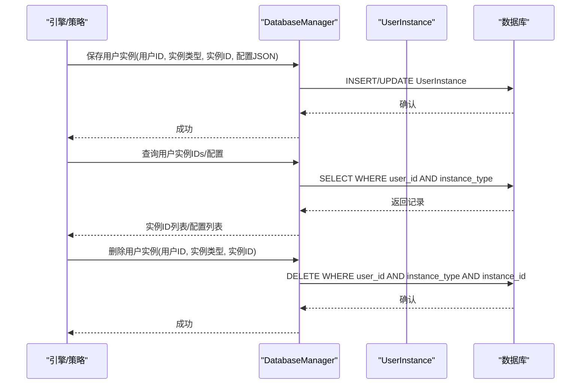
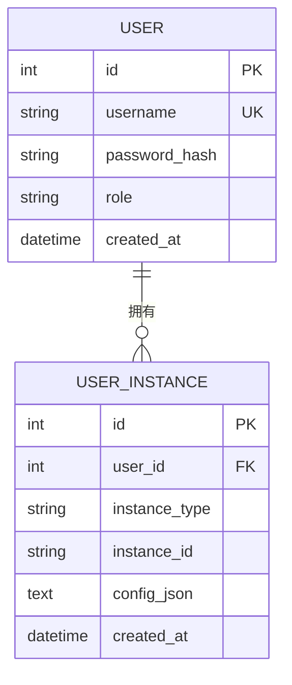
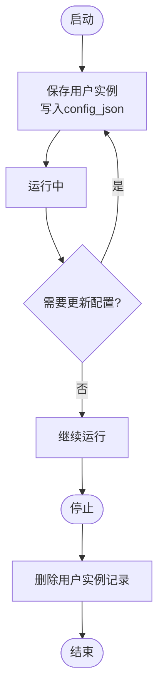
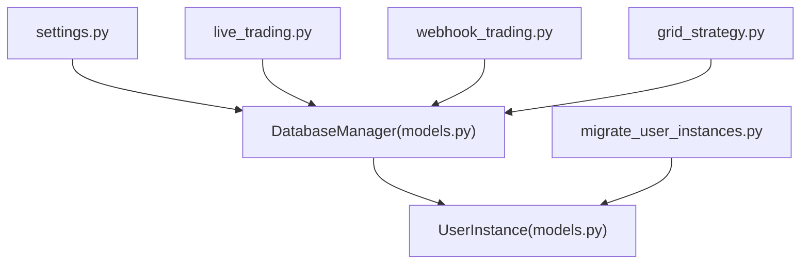

# 用户实例归属表 (UserInstance)

<cite>
**本文引用的文件**
- [models.py](file://backpack_quant_trading/database/models.py)
- [migrate_user_instances.py](file://backpack_quant_trading/database/migrate_user_instances.py)
- [settings.py](file://backpack_quant_trading/config/settings.py)
- [live_trading.py](file://backpack_quant_trading/engine/live_trading.py)
- [webhook_trading.py](file://backpack_quant_trading/engine/webhook_trading.py)
- [grid_strategy.py](file://backpack_quant_trading/strategy/grid_strategy.py)
</cite>

## 目录
1. [简介](#简介)
2. [项目结构](#项目结构)
3. [核心组件](#核心组件)
4. [架构总览](#架构总览)
5. [详细组件分析](#详细组件分析)
6. [依赖分析](#依赖分析)
7. [性能考量](#性能考量)
8. [故障排查指南](#故障排查指南)
9. [结论](#结论)
10. [附录](#附录)

## 简介
本文围绕用户实例归属表(UserInstance)展开，系统性阐述其数据模型设计、用户实例隔离机制、三种实例类型(live实盘、grid网格、currency_monitor币种监视)的差异与用途、instance_id唯一标识符的作用、config_json配置存储的安全性考虑、用户与实例的多对多关系管理、实例生命周期管理、配置同步机制与安全存储策略，并提供实际应用场景与配置示例。

## 项目结构
UserInstance属于数据库层模型，位于数据库模型定义文件中，同时配合数据库迁移脚本创建表结构；配置与安全策略由配置模块提供；引擎与策略模块在运行时通过数据库管理器读写UserInstance记录，实现实例的创建、查询、更新与删除。

**图表来源**
- [models.py](file://backpack_quant_trading/database/models.py)
- [migrate_user_instances.py](file://backpack_quant_trading/database/migrate_user_instances.py)
- [settings.py](file://backpack_quant_trading/config/settings.py)
- [live_trading.py](file://backpack_quant_trading/engine/live_trading.py)
- [webhook_trading.py](file://backpack_quant_trading/engine/webhook_trading.py)
- [grid_strategy.py](file://backpack_quant_trading/strategy/grid_strategy.py)

**章节来源**
- [models.py](file://backpack_quant_trading/database/models.py)
- [migrate_user_instances.py](file://backpack_quant_trading/database/migrate_user_instances.py)
- [settings.py](file://backpack_quant_trading/config/settings.py)

## 核心组件
- UserInstance数据模型：定义用户与实例的关联关系、实例类型(instance_type)、实例唯一标识(instance_id)、配置存储(config_json)及创建时间(created_at)。
- DatabaseManager：封装数据库操作，提供保存用户实例、查询用户实例IDs与配置、删除用户实例等方法。
- 迁移脚本：独立创建user_instances表，保证数据库结构与业务需求一致。
- 配置模块：集中管理数据库连接、交易与风控参数，为UserInstance配置存储提供安全策略依据。

**章节来源**
- [models.py](file://backpack_quant_trading/database/models.py)
- [migrate_user_instances.py](file://backpack_quant_trading/database/migrate_user_instances.py)
- [settings.py](file://backpack_quant_trading/config/settings.py)

## 架构总览
UserInstance贯穿配置、隔离、生命周期与安全存储四个维度：
- 配置：config_json仅存储平台、策略、交易对等元数据，不包含API Key、私钥等敏感信息。
- 隔离：按用户(user_id)与实例类型(instance_type)进行隔离，instance_id作为实例唯一标识，确保多实例并行运行。
- 生命周期：引擎启动时创建/更新UserInstance记录，停止时删除对应记录，实现实例的完整生命周期管理。
- 安全：配置模块集中管理敏感信息，UserInstance仅存储非敏感配置；迁移脚本独立创建表，避免误删现有数据。

**图表来源**
- [models.py](file://backpack_quant_trading/database/models.py)

## 详细组件分析

### 数据模型与字段语义
- 主键id：自增主键，便于内部管理与审计。
- user_id：外键关联用户表，实现用户与实例的多对多关系管理。
- instance_type：实例类型枚举，支持live、grid、currency_monitor三类。
- instance_id：实例唯一标识符，确保同一用户在同一类型下可运行多个实例。
- config_json：存储非敏感配置，如平台、策略、交易对等元数据。
- created_at：记录创建时间，便于审计与生命周期管理。

**图表来源**
- [models.py](file://backpack_quant_trading/database/models.py)

**章节来源**
- [models.py](file://backpack_quant_trading/database/models.py)

### 实例类型与用途
- live实盘：面向实盘交易引擎，负责实时行情订阅、订单执行、持仓与成交记录持久化。
- grid网格：面向网格交易策略，负责在价格区间内自动挂单、跟踪成交、平仓与补仓。
- currency_monitor币种监视：面向币种监视功能，支持全局共享配置或按用户隔离配置。

**章节来源**
- [live_trading.py](file://backpack_quant_trading/engine/live_trading.py)
- [grid_strategy.py](file://backpack_quant_trading/strategy/grid_strategy.py)
- [models.py](file://backpack_quant_trading/database/models.py)

### 实例唯一标识符(instance_id)的作用
- 唯一性：在同一用户与实例类型下，instance_id确保每个实例独立运行。
- 多实例支持：同一用户可同时运行多个同类型实例，彼此隔离。
- 生命周期管理：启动时创建/更新，停止时删除，避免残留记录影响下次启动。

**章节来源**
- [models.py](file://backpack_quant_trading/database/models.py)

### config_json配置存储的安全性考虑
- 仅存储元数据：config_json仅存放platform、strategy、symbol等元数据，绝不存储API Key、私钥等敏感信息。
- 集中式安全策略：敏感信息由配置模块集中管理，避免分散存储带来的泄露风险。
- 迁移脚本独立：迁移脚本独立创建表，不删除现有数据，降低误操作风险。

**章节来源**
- [models.py](file://backpack_quant_trading/database/models.py)
- [settings.py](file://backpack_quant_trading/config/settings.py)
- [migrate_user_instances.py](file://backpack_quant_trading/database/migrate_user_instances.py)

### 用户与实例的多对多关系管理
- 多对多体现：一个用户可拥有多种类型的多个实例；一种实例类型可在不同用户间复用。
- 隔离策略：通过(user_id, instance_type, instance_id)联合索引实现强隔离，避免跨用户/跨类型干扰。
- 查询便捷：提供按用户与类型查询实例ID与配置的方法，便于批量管理。

**章节来源**
- [models.py](file://backpack_quant_trading/database/models.py)

### 实例生命周期管理
- 启动阶段：引擎/策略在初始化时调用保存用户实例方法，写入当前实例的配置。
- 运行阶段：实例在运行期间保持配置与状态同步，必要时更新config_json。
- 停止阶段：引擎/策略在停止时调用删除用户实例方法，清理记录。

**图表来源**
- [models.py](file://backpack_quant_trading/database/models.py)

**章节来源**
- [models.py](file://backpack_quant_trading/database/models.py)

### 配置同步机制
- 全局共享配置：币种监视支持全局共享配置，使用第一个用户ID作为存储键，兼容旧逻辑。
- 按用户隔离配置：支持为特定用户保存独立的币种监视配置，避免全局配置对个别用户的影响。
- 一致性保障：通过数据库事务与唯一索引，确保同一实例在同一时刻仅有一份有效配置。

**章节来源**
- [models.py](file://backpack_quant_trading/database/models.py)

### 安全存储策略
- 敏感信息分离：API Key、私钥等敏感信息不存储在UserInstance的config_json中。
- 配置集中化：通过配置模块集中管理敏感信息，降低泄露面。
- 表结构独立：迁移脚本独立创建表，避免与现有业务表产生耦合。

**章节来源**
- [models.py](file://backpack_quant_trading/database/models.py)
- [settings.py](file://backpack_quant_trading/config/settings.py)
- [migrate_user_instances.py](file://backpack_quant_trading/database/migrate_user_instances.py)

### 实际应用场景与配置示例
- 实盘场景：用户在实盘引擎中配置交易对、杠杆与风控参数，config_json存储平台与策略元数据，不包含敏感信息。
- 网格场景：用户在网格策略中配置价格区间、网格数量与单格投资，config_json存储策略参数与交易对，不包含敏感信息。
- 币种监视场景：用户可选择全局共享或按用户隔离的币种监视配置，config_json存储监视目标与规则。

注意：上述场景中的config_json内容应遵循“仅存储元数据”的原则，不包含API Key、私钥等敏感信息。

**章节来源**
- [live_trading.py](file://backpack_quant_trading/engine/live_trading.py)
- [grid_strategy.py](file://backpack_quant_trading/strategy/grid_strategy.py)
- [models.py](file://backpack_quant_trading/database/models.py)

## 依赖分析
UserInstance依赖DatabaseManager提供的CRUD能力，DatabaseManager依赖配置模块提供的数据库连接信息；迁移脚本独立创建表，不依赖业务逻辑；引擎与策略模块通过DatabaseManager间接依赖UserInstance模型。

**图表来源**
- [models.py](file://backpack_quant_trading/database/models.py)
- [migrate_user_instances.py](file://backpack_quant_trading/database/migrate_user_instances.py)
- [settings.py](file://backpack_quant_trading/config/settings.py)
- [live_trading.py](file://backpack_quant_trading/engine/live_trading.py)
- [webhook_trading.py](file://backpack_quant_trading/engine/webhook_trading.py)
- [grid_strategy.py](file://backpack_quant_trading/strategy/grid_strategy.py)

**章节来源**
- [models.py](file://backpack_quant_trading/database/models.py)
- [migrate_user_instances.py](file://backpack_quant_trading/database/migrate_user_instances.py)
- [settings.py](file://backpack_quant_trading/config/settings.py)

## 性能考量
- 索引优化：UserInstance表对(user_id, instance_type, instance_id)建立复合索引，提升查询与去重效率。
- 事务与幂等：保存用户实例采用INSERT/UPDATE，查询与删除采用精确条件，避免全表扫描。
- 迁移独立：迁移脚本独立创建表，不影响现有业务数据，降低维护成本。

**章节来源**
- [models.py](file://backpack_quant_trading/database/models.py)

## 故障排查指南
- 表不存在：执行迁移脚本创建user_instances表。
- 配置缺失：检查config_json是否为空，确认是否按要求仅存储元数据。
- 实例冲突：检查instance_id是否唯一，避免重复创建导致的冲突。
- 删除失败：确认删除条件(user_id, instance_type, instance_id)是否正确。

**章节来源**
- [migrate_user_instances.py](file://backpack_quant_trading/database/migrate_user_instances.py)
- [models.py](file://backpack_quant_trading/database/models.py)

## 结论
UserInstance通过明确的字段语义、严格的隔离策略与安全存储原则，实现了用户与实例的多对多关系管理。结合生命周期管理与配置同步机制，确保实盘、网格与币种监视三大场景下的稳定运行与安全可控。迁移脚本与配置模块进一步降低了运维复杂度与安全风险。

## 附录
- 迁移脚本：独立创建user_instances表，避免误删现有数据。
- 配置模块：集中管理数据库连接与敏感信息，为UserInstance提供安全策略支撑。

**章节来源**
- [migrate_user_instances.py](file://backpack_quant_trading/database/migrate_user_instances.py)
- [settings.py](file://backpack_quant_trading/config/settings.py)