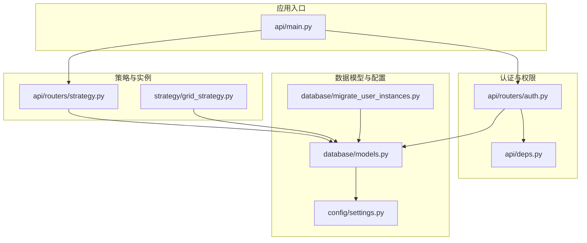
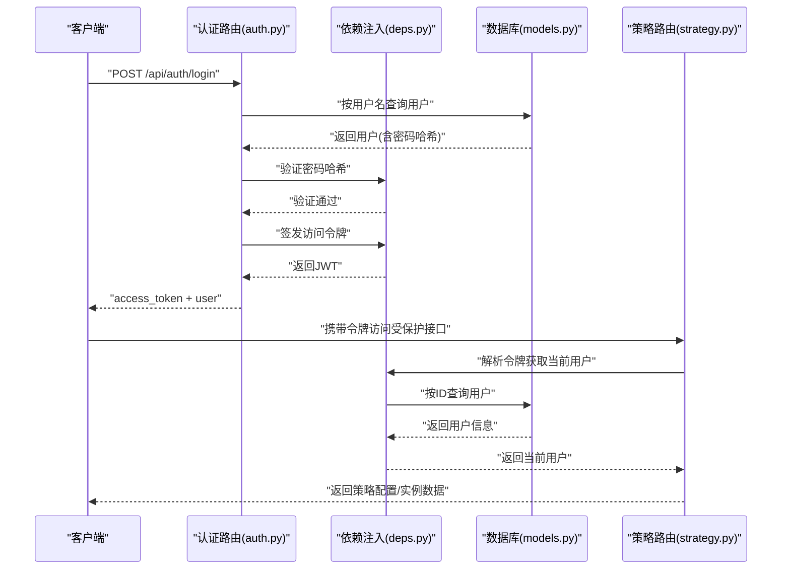
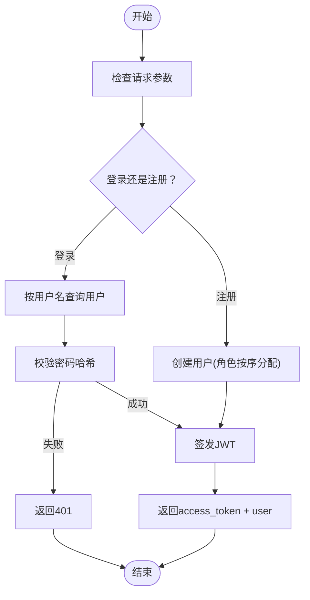
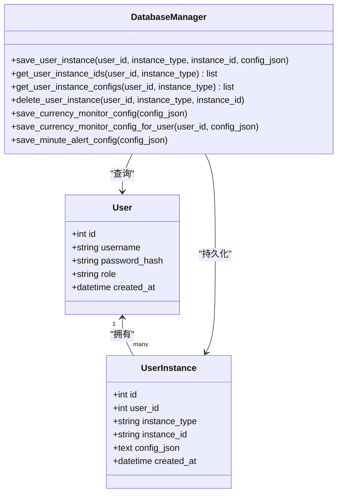
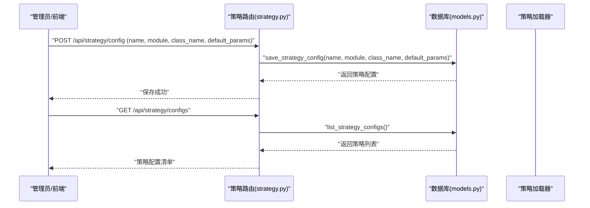
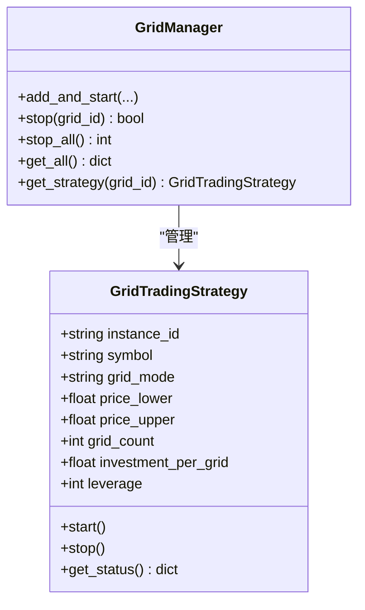
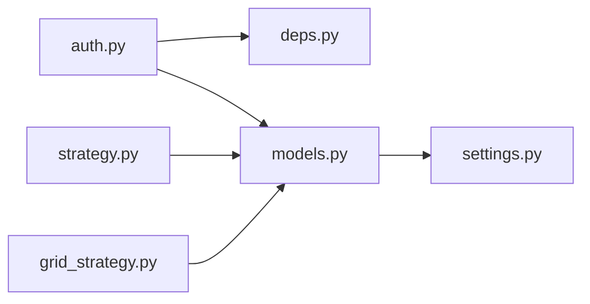

# 用户管理模型

<cite>
**本文引用的文件**
- [models.py](file://backpack_quant_trading/database/models.py)
- [settings.py](file://backpack_quant_trading/config/settings.py)
- [auth.py](file://backpack_quant_trading/api/routers/auth.py)
- [deps.py](file://backpack_quant_trading/api/deps.py)
- [main.py](file://backpack_quant_trading/api/main.py)
- [strategy.py](file://backpack_quant_trading/api/routers/strategy.py)
- [grid_strategy.py](file://backpack_quant_trading/strategy/grid_strategy.py)
- [migrate_user_instances.py](file://backpack_quant_trading/database/migrate_user_instances.py)
</cite>

## 目录
1. [简介](#简介)
2. [项目结构](#项目结构)
3. [核心组件](#核心组件)
4. [架构总览](#架构总览)
5. [详细组件分析](#详细组件分析)
6. [依赖关系分析](#依赖关系分析)
7. [性能考虑](#性能考虑)
8. [故障排除指南](#故障排除指南)
9. [结论](#结论)
10. [附录](#附录)

## 简介
本文件聚焦于用户管理与权限控制相关的数据模型，围绕以下核心实体展开：
- User（用户）：承载登录凭据与角色信息，支撑认证与授权基础。
- UserInstance（用户实例归属）：实现实盘/网格/币种监视等业务实例按用户隔离的持久化与生命周期管理。
- StrategyConfig（策略配置）：统一管理策略元数据与默认参数，支持策略注册、启用/禁用与参数覆盖。

同时，文档阐述：
- 用户角色权限体系与安全机制（认证、令牌、依赖注入与中间件）。
- 用户实例隔离机制与配置管理策略（按用户维度隔离、全局共享配置、实例生命周期）。
- 策略元数据存储与默认参数管理（策略注册、参数序列化与检索）。
- 用户认证流程、权限控制示例与配置管理最佳实践。

## 项目结构
本项目采用分层与功能模块化组织，与用户管理模型直接相关的文件分布如下：
- 数据模型与数据库管理：database/models.py
- 配置中心：config/settings.py
- 认证与权限：api/routers/auth.py、api/deps.py
- 应用入口与路由注册：api/main.py
- 策略相关API：api/routers/strategy.py
- 策略实现与实例管理：strategy/grid_strategy.py
- 用户实例迁移：database/migrate_user_instances.py

**图表来源**
- [main.py:37-48](file://backpack_quant_trading/api/main.py#L37-L48)
- [auth.py:1-79](file://backpack_quant_trading/api/routers/auth.py#L1-L79)
- [deps.py:1-73](file://backpack_quant_trading/api/deps.py#L1-L73)
- [models.py:228-268](file://backpack_quant_trading/database/models.py#L228-L268)
- [settings.py:104-137](file://backpack_quant_trading/config/settings.py#L104-L137)
- [strategy.py:1-1299](file://backpack_quant_trading/api/routers/strategy.py#L1-L1299)
- [grid_strategy.py:1-1508](file://backpack_quant_trading/strategy/grid_strategy.py#L1-L1508)
- [migrate_user_instances.py:1-15](file://backpack_quant_trading/database/migrate_user_instances.py#L1-L15)

**章节来源**
- [main.py:37-48](file://backpack_quant_trading/api/main.py#L37-L48)
- [models.py:228-268](file://backpack_quant_trading/database/models.py#L228-L268)
- [settings.py:104-137](file://backpack_quant_trading/config/settings.py#L104-L137)

## 核心组件
本节对用户管理模型的核心组件进行深入分析，并结合代码路径定位实现细节。

- User（用户）
  - 设计要点：用户名唯一、密码哈希存储、角色字段（user/superuser）、创建时间。
  - 关键实现路径：[User 定义:228-237](file://backpack_quant_trading/database/models.py#L228-L237)、[用户查询与创建:500-538](file://backpack_quant_trading/database/models.py#L500-L538)。
  - 安全要点：密码通过哈希存储，认证流程通过依赖注入与令牌校验完成。

- UserInstance（用户实例归属）
  - 设计要点：按用户隔离实盘/网格/币种监视等实例；实例ID唯一且带索引；配置JSON仅存储非敏感元数据。
  - 关键实现路径：[UserInstance 定义:239-251](file://backpack_quant_trading/database/models.py#L239-L251)、[实例保存与查询:540-575](file://backpack_quant_trading/database/models.py#L540-L575)、[全局/用户级配置保存与删除:608-636](file://backpack_quant_trading/database/models.py#L608-L636)。
  - 隔离机制：通过 user_id + instance_type + instance_id 的复合索引实现强约束，确保实例归属与隔离。

- StrategyConfig（策略配置）
  - 设计要点：策略名称唯一、模块与类名、默认参数（JSON字符串）、启用状态。
  - 关键实现路径：[StrategyConfig 定义:254-264](file://backpack_quant_trading/database/models.py#L254-L264)、[策略配置保存与查询:685-717](file://backpack_quant_trading/database/models.py#L685-L717)。

**章节来源**
- [models.py:228-268](file://backpack_quant_trading/database/models.py#L228-L268)
- [models.py:500-717](file://backpack_quant_trading/database/models.py#L500-L717)

## 架构总览
用户管理与权限控制的整体架构围绕“认证—授权—实例隔离—配置管理”展开，关键交互如下：

**图表来源**
- [auth.py:33-44](file://backpack_quant_trading/api/routers/auth.py#L33-L44)
- [deps.py:44-73](file://backpack_quant_trading/api/deps.py#L44-L73)
- [models.py:500-538](file://backpack_quant_trading/database/models.py#L500-L538)
- [strategy.py:1-1299](file://backpack_quant_trading/api/routers/strategy.py#L1-L1299)

## 详细组件分析

### 用户与认证流程
- 认证流程
  - 登录：客户端提交用户名/密码，服务端查询用户并校验哈希，成功后签发JWT。
  - 注册：首次注册用户自动成为超级用户，后续用户为普通用户；注册成功同样签发JWT。
  - 当前用户：通过依赖注入从令牌解析用户信息，未登录返回401。
- 安全机制
  - 密码哈希：使用 Werkzeug 生成与校验哈希。
  - 令牌：HS256算法，7天有效期，支持Bearer与Cookie两种方式。
  - 依赖注入：统一从Header或Cookie提取令牌，解码后查询用户。

**图表来源**
- [auth.py:33-68](file://backpack_quant_trading/api/routers/auth.py#L33-L68)
- [deps.py:20-42](file://backpack_quant_trading/api/deps.py#L20-L42)

**章节来源**
- [auth.py:1-79](file://backpack_quant_trading/api/routers/auth.py#L1-L79)
- [deps.py:1-73](file://backpack_quant_trading/api/deps.py#L1-L73)

### 用户实例隔离机制
- 隔离模型
  - 每个用户拥有独立的实例集合，实例类型包括 live、grid、currency_monitor 等。
  - 实例ID唯一，配置JSON仅存储平台、策略、交易对等元数据，严禁存储API Key、私钥等敏感信息。
- 生命周期管理
  - 保存：首次保存创建，后续更新仅更新配置JSON。
  - 查询：按用户与类型查询实例ID列表或实例ID+配置对。
  - 删除：停止实例时清理用户实例归属记录。
- 全局共享配置
  - 对于币种监视与分钟预警等全局配置，采用“首个用户ID作为键”的策略，兼容旧逻辑。

**图表来源**
- [models.py:228-268](file://backpack_quant_trading/database/models.py#L228-L268)
- [models.py:540-636](file://backpack_quant_trading/database/models.py#L540-L636)

**章节来源**
- [models.py:239-251](file://backpack_quant_trading/database/models.py#L239-L251)
- [models.py:540-636](file://backpack_quant_trading/database/models.py#L540-L636)

### 策略元数据与默认参数管理
- 元数据模型
  - 策略名称唯一，模块与类名指向具体策略实现，default_params以JSON字符串存储默认参数，enabled控制启停。
- 管理流程
  - 列表：查询所有策略配置。
  - 保存：若同名策略存在则更新模块、类名与默认参数，否则新增并启用。
- 使用场景
  - 前端展示策略矩阵与默认参数，后端按策略名称检索并实例化具体策略类。

**图表来源**
- [models.py:685-717](file://backpack_quant_trading/database/models.py#L685-L717)
- [strategy.py:1-1299](file://backpack_quant_trading/api/routers/strategy.py#L1-L1299)

**章节来源**
- [models.py:254-264](file://backpack_quant_trading/database/models.py#L254-L264)
- [models.py:685-717](file://backpack_quant_trading/database/models.py#L685-L717)

### 网格策略与实例ID关联
- 网格策略通过实例ID区分不同运行实例，支持多网格并行运行。
- 实例ID生成规则：若未显式传入，采用“symbol_grid_mode”的组合；也可通过外部传入保证唯一性。
- 多网格管理器负责线程与事件循环管理，确保每个网格实例独立运行与停止。

**图表来源**
- [grid_strategy.py:38-1508](file://backpack_quant_trading/strategy/grid_strategy.py#L38-L1508)

**章节来源**
- [grid_strategy.py:1366-1508](file://backpack_quant_trading/strategy/grid_strategy.py#L1366-L1508)

## 依赖关系分析
- 组件耦合
  - 认证路由依赖依赖注入模块与数据库管理器；数据库管理器同时服务于用户、实例与策略配置。
  - 策略路由依赖数据库管理器进行策略配置与实例查询。
  - 网格策略依赖数据库管理器进行实例归属与配置读取。
- 外部依赖
  - 数据库连接通过配置中心统一提供；策略配置与实例配置均持久化至MySQL。
- 循环依赖
  - 未发现循环依赖；认证、策略与网格模块通过数据库管理器间接耦合。

**图表来源**
- [auth.py:1-79](file://backpack_quant_trading/api/routers/auth.py#L1-L79)
- [deps.py:1-73](file://backpack_quant_trading/api/deps.py#L1-L73)
- [models.py:228-268](file://backpack_quant_trading/database/models.py#L228-L268)
- [settings.py:104-137](file://backpack_quant_trading/config/settings.py#L104-L137)
- [strategy.py:1-1299](file://backpack_quant_trading/api/routers/strategy.py#L1-L1299)
- [grid_strategy.py:1-1508](file://backpack_quant_trading/strategy/grid_strategy.py#L1-L1508)

**章节来源**
- [main.py:37-48](file://backpack_quant_trading/api/main.py#L37-L48)
- [models.py:228-268](file://backpack_quant_trading/database/models.py#L228-L268)

## 性能考虑
- 数据库连接池
  - 通过配置中心设置连接池大小与溢出，降低连接竞争与抖动。
- 查询索引
  - UserInstance 对 user_id、instance_type、instance_id 建立复合索引，保障按用户隔离查询效率。
- 令牌与哈希
  - HS256算法与合理有效期平衡安全性与性能；密码哈希采用Werkzeug，兼顾强度与速度。
- 实例管理
  - 多网格管理器使用线程与事件循环分离，避免阻塞；停止时有序取消任务与关闭连接，减少资源泄漏。

[本节为通用指导，无需特定文件引用]

## 故障排除指南
- 认证失败
  - 确认用户名存在且密码哈希匹配；检查令牌签名与有效期；确认前端携带正确的Authorization或Cookie。
  - 参考路径：[登录与注册:33-68](file://backpack_quant_trading/api/routers/auth.py#L33-L68)、[令牌解析:44-73](file://backpack_quant_trading/api/deps.py#L44-L73)。
- 用户实例查询异常
  - 检查 user_id 与 instance_type 是否正确；确认实例是否已创建；必要时执行迁移脚本创建表。
  - 参考路径：[UserInstance 定义与方法:239-251](file://backpack_quant_trading/database/models.py#L239-L251)、[迁移脚本:1-15](file://backpack_quant_trading/database/migrate_user_instances.py#L1-L15)。
- 策略配置保存失败
  - 确认策略名称唯一；default_params 为合法JSON字符串；检查数据库连接与事务回滚。
  - 参考路径：[策略配置保存:692-717](file://backpack_quant_trading/database/models.py#L692-L717)。

**章节来源**
- [auth.py:33-68](file://backpack_quant_trading/api/routers/auth.py#L33-L68)
- [deps.py:44-73](file://backpack_quant_trading/api/deps.py#L44-L73)
- [models.py:239-251](file://backpack_quant_trading/database/models.py#L239-L251)
- [migrate_user_instances.py:1-15](file://backpack_quant_trading/database/migrate_user_instances.py#L1-L15)
- [models.py:692-717](file://backpack_quant_trading/database/models.py#L692-L717)

## 结论
本文件系统梳理了用户管理与权限控制的数据模型与实现，明确了：
- User/Role 为基础认证单元，配合JWT实现无状态认证。
- UserInstance 提供强隔离的实例归属与生命周期管理，确保实盘/网格/币种监视等业务按用户维度独立运行。
- StrategyConfig 统一管理策略元数据与默认参数，支撑策略注册与参数覆盖。
- 通过依赖注入与路由中间件，形成清晰的认证与授权链路。
建议在生产环境中：
- 严格遵守配置中心的安全设置，避免硬编码敏感信息。
- 对实例配置JSON进行白名单校验，杜绝敏感字段写入。
- 定期审计策略配置与实例归属，确保合规与可追溯。

[本节为总结性内容，无需特定文件引用]

## 附录
- 配置中心关键项
  - 数据库连接：主机、端口、用户、密码、库名、连接池参数。
  - 令牌密钥与有效期：生产环境务必替换默认密钥。
- 最佳实践
  - 用户注册：首次注册自动提升为超级用户，后续注册为普通用户。
  - 实例隔离：实例ID与类型组合唯一，配置JSON仅存储元数据。
  - 策略管理：策略名称唯一，default_params为JSON字符串，启用状态可随时切换。

**章节来源**
- [settings.py:44-137](file://backpack_quant_trading/config/settings.py#L44-L137)
- [auth.py:47-68](file://backpack_quant_trading/api/routers/auth.py#L47-L68)
- [models.py:239-264](file://backpack_quant_trading/database/models.py#L239-L264)