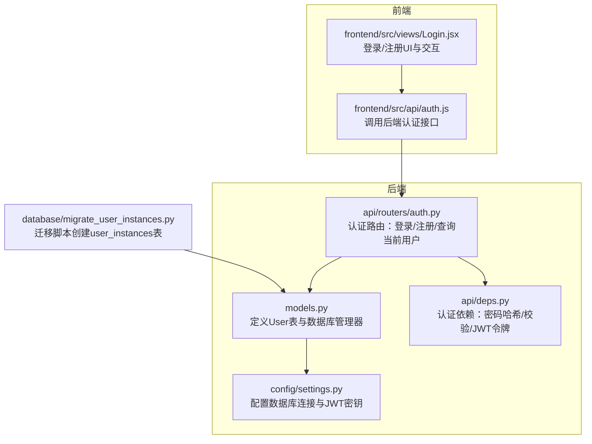
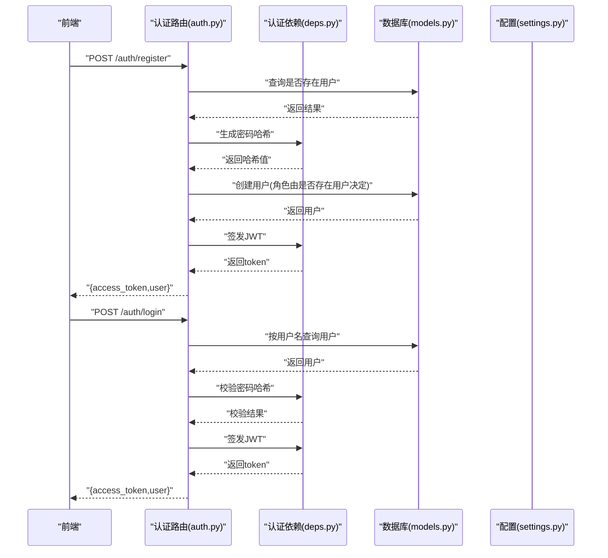
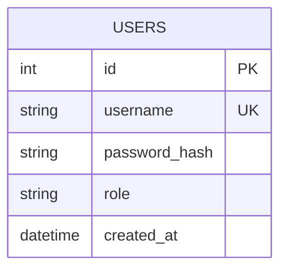
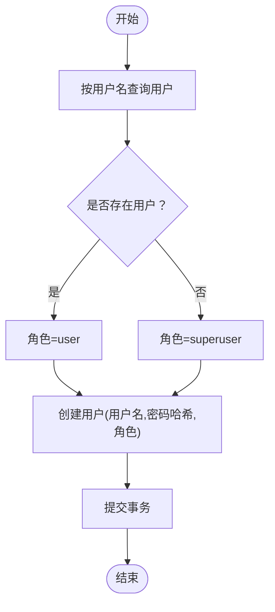
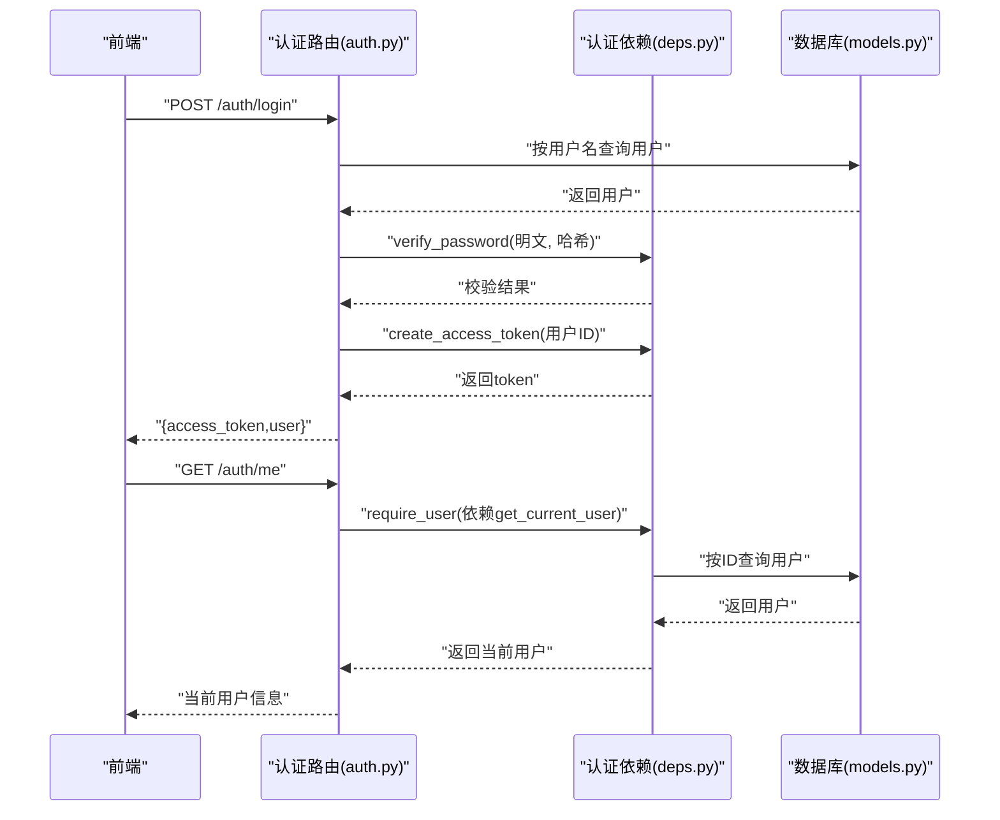
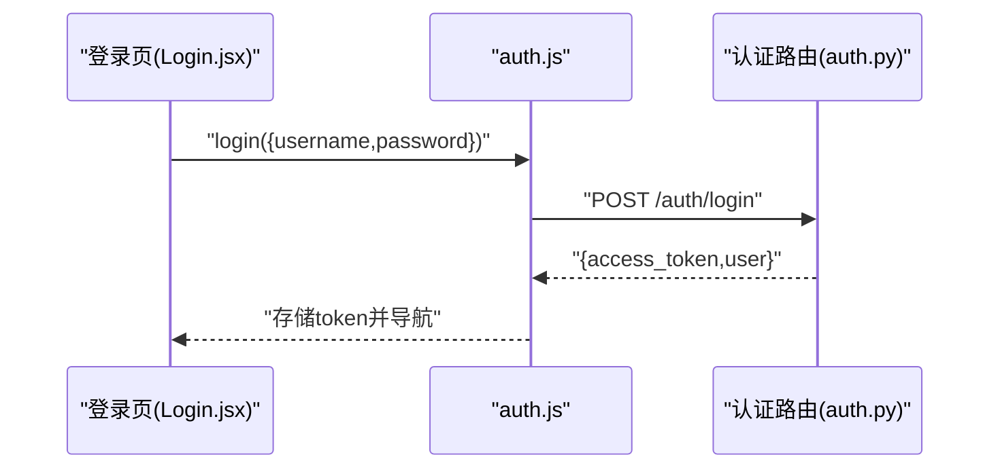
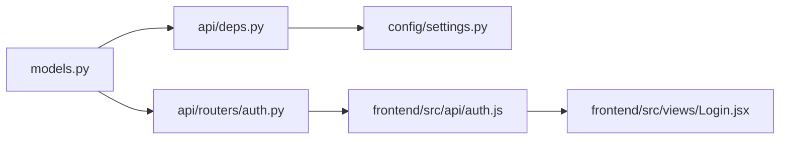

# 用户表 (User)

<cite>
**本文引用的文件**
- [models.py](file://backpack_quant_trading/database/models.py)
- [auth.py](file://backpack_quant_trading/api/routers/auth.py)
- [deps.py](file://backpack_quant_trading/api/deps.py)
- [settings.py](file://backpack_quant_trading/config/settings.py)
- [auth.js](file://backpack_quant_trading/frontend/src/api/auth.js)
- [Login.jsx](file://backpack_quant_trading/frontend/src/views/Login.jsx)
- [migrate_user_instances.py](file://backpack_quant_trading/database/migrate_user_instances.py)
</cite>

## 目录
1. [简介](#简介)
2. [项目结构](#项目结构)
3. [核心组件](#核心组件)
4. [架构总览](#架构总览)
5. [详细组件分析](#详细组件分析)
6. [依赖分析](#依赖分析)
7. [性能考虑](#性能考虑)
8. [故障排除指南](#故障排除指南)
9. [结论](#结论)
10. [附录](#附录)

## 简介
本文件为用户表(User)的完整数据模型文档，涵盖字段定义、数据类型与约束、唯一性与安全机制、角色权限体系、时间戳自动填充以及完整的用户创建流程、认证验证过程与权限控制示例。同时提供最佳实践与安全注意事项，帮助开发者与运维人员正确理解与使用用户表。

## 项目结构
用户表位于数据库层的ORM模型中，配合FastAPI认证路由与依赖注入模块共同完成用户生命周期管理与权限控制。

图表来源
- [models.py:228-237](file://backpack_quant_trading/database/models.py#L228-L237)
- [auth.py:1-79](file://backpack_quant_trading/api/routers/auth.py#L1-L79)
- [deps.py:1-73](file://backpack_quant_trading/api/deps.py#L1-L73)
- [settings.py:104-137](file://backpack_quant_trading/config/settings.py#L104-L137)
- [auth.js:1-7](file://backpack_quant_trading/frontend/src/api/auth.js#L1-L7)
- [Login.jsx:1-253](file://backpack_quant_trading/frontend/src/views/Login.jsx#L1-L253)
- [migrate_user_instances.py:1-15](file://backpack_quant_trading/database/migrate_user_instances.py#L1-L15)

章节来源
- [models.py:228-237](file://backpack_quant_trading/database/models.py#L228-L237)
- [auth.py:1-79](file://backpack_quant_trading/api/routers/auth.py#L1-L79)
- [deps.py:1-73](file://backpack_quant_trading/api/deps.py#L1-L73)
- [settings.py:104-137](file://backpack_quant_trading/config/settings.py#L104-L137)
- [auth.js:1-7](file://backpack_quant_trading/frontend/src/api/auth.js#L1-L7)
- [Login.jsx:1-253](file://backpack_quant_trading/frontend/src/views/Login.jsx#L1-L253)
- [migrate_user_instances.py:1-15](file://backpack_quant_trading/database/migrate_user_instances.py#L1-L15)

## 核心组件
- 用户表(User)：存储用户身份、密码哈希、角色与创建时间戳。
- 数据库管理器(DatabaseManager)：提供用户查询、创建与会话管理。
- 认证路由(auth.py)：提供登录、注册、查询当前用户接口。
- 认证依赖(deps.py)：提供密码哈希生成、密码校验、JWT令牌签发与解析。
- 配置(settings.py)：提供数据库连接URL与JWT密钥配置。
- 前端接口(auth.js)与登录页(Login.jsx)：负责调用后端接口与展示登录/注册流程。

章节来源
- [models.py:228-237](file://backpack_quant_trading/database/models.py#L228-L237)
- [models.py:500-538](file://backpack_quant_trading/database/models.py#L500-L538)
- [auth.py:1-79](file://backpack_quant_trading/api/routers/auth.py#L1-L79)
- [deps.py:1-73](file://backpack_quant_trading/api/deps.py#L1-L73)
- [settings.py:104-137](file://backpack_quant_trading/config/settings.py#L104-L137)
- [auth.js:1-7](file://backpack_quant_trading/frontend/src/api/auth.js#L1-L7)
- [Login.jsx:1-253](file://backpack_quant_trading/frontend/src/views/Login.jsx#L1-L253)

## 架构总览
用户表在系统中的职责与交互如下：
- 字段与约束：username唯一、password_hash存储哈希、role枚举(user/superuser)、created_at自动填充。
- 安全机制：密码以哈希形式存储；JWT令牌用于会话持久化；首次注册自动赋予超级用户角色。
- 流程：注册时根据是否存在用户决定角色；登录时校验密码哈希并签发JWT；后续请求通过依赖注入解析令牌获取当前用户。

图表来源
- [auth.py:33-68](file://backpack_quant_trading/api/routers/auth.py#L33-L68)
- [deps.py:20-33](file://backpack_quant_trading/api/deps.py#L20-L33)
- [models.py:500-538](file://backpack_quant_trading/database/models.py#L500-L538)
- [settings.py:124-130](file://backpack_quant_trading/config/settings.py#L124-L130)

## 详细组件分析

### 用户表数据模型
- 表名：users
- 字段定义与约束
  - id：整型主键，自增。
  - username：字符串，长度上限50，唯一且非空，并建立索引以提升查询效率。
  - password_hash：字符串，长度上限255，非空，存储经过哈希算法处理的密码。
  - role：字符串，长度上限20，非空，默认为"user"，支持"user"与"superuser"两种角色。
  - created_at：日期时间，非空，默认为当前时间，用于记录用户创建时间。
- 时间戳自动填充
  - created_at默认使用当前时间，无需应用层显式赋值。
- 唯一性约束
  - username字段具有唯一性约束，防止重复用户名。
- 角色权限体系
  - user：普通用户，具备基本功能权限。
  - superuser：超级用户，具备系统级管理权限（具体权限取决于上层业务控制）。
- 安全存储机制
  - 密码以哈希形式存储，不存储明文密码；登录时通过哈希校验进行认证。

图表来源
- [models.py:228-237](file://backpack_quant_trading/database/models.py#L228-L237)

章节来源
- [models.py:228-237](file://backpack_quant_trading/database/models.py#L228-L237)

### 数据库管理器与用户操作
- 查询用户
  - 按用户名查询：get_user_by_username(username)
  - 按用户ID查询：get_user_by_id(user_id)
- 创建用户
  - create_user(username, password_hash, role='user')
- 会话管理
  - get_session()：获取数据库会话，用于事务与查询。
- 自动时间戳
  - created_at默认使用当前时间，无需手动设置。

图表来源
- [models.py:500-538](file://backpack_quant_trading/database/models.py#L500-L538)
- [auth.py:57-62](file://backpack_quant_trading/api/routers/auth.py#L57-L62)

章节来源
- [models.py:500-538](file://backpack_quant_trading/database/models.py#L500-L538)
- [auth.py:47-68](file://backpack_quant_trading/api/routers/auth.py#L47-L68)

### 认证与权限控制流程
- 登录流程
  - 前端提交用户名与密码。
  - 后端按用户名查询用户，若不存在或密码哈希校验失败则返回401。
  - 成功后签发JWT令牌并返回用户信息。
- 注册流程
  - 校验用户名与密码非空。
  - 查询是否存在用户，若存在则返回400。
  - 根据是否存在用户决定角色：无用户时为"superuser"，否则为"user"。
  - 使用哈希算法生成密码哈希并创建用户，随后签发JWT。
- 权限控制
  - 通过依赖注入解析JWT，获取当前用户ID并查询用户信息。
  - 未登录时拒绝访问，返回401。

图表来源
- [auth.py:33-73](file://backpack_quant_trading/api/routers/auth.py#L33-L73)
- [deps.py:44-73](file://backpack_quant_trading/api/deps.py#L44-L73)
- [models.py:500-538](file://backpack_quant_trading/database/models.py#L500-L538)

章节来源
- [auth.py:33-73](file://backpack_quant_trading/api/routers/auth.py#L33-L73)
- [deps.py:44-73](file://backpack_quant_trading/api/deps.py#L44-L73)
- [models.py:500-538](file://backpack_quant_trading/database/models.py#L500-L538)

### 前端集成与交互
- 接口调用
  - 登录/注册：通过auth.js封装的请求函数调用后端接口。
- 用户体验
  - 登录页提供用户名、密码输入与记住我选项。
  - 成功后将JWT存储到本地并跳转至首页。
- 安全注意
  - 前端不应存储敏感信息；令牌有效期需合理配置。

图表来源
- [Login.jsx:25-69](file://backpack_quant_trading/frontend/src/views/Login.jsx#L25-L69)
- [auth.js:3-4](file://backpack_quant_trading/frontend/src/api/auth.js#L3-L4)
- [auth.py:33-44](file://backpack_quant_trading/api/routers/auth.py#L33-L44)

章节来源
- [Login.jsx:25-69](file://backpack_quant_trading/frontend/src/views/Login.jsx#L25-L69)
- [auth.js:1-7](file://backpack_quant_trading/frontend/src/api/auth.js#L1-L7)
- [auth.py:33-44](file://backpack_quant_trading/api/routers/auth.py#L33-L44)

### 迁移与表结构
- user_instances表迁移脚本用于创建用户实例归属表，不影响用户表结构。
- 用户表结构独立于迁移脚本，直接由models.py定义。

章节来源
- [migrate_user_instances.py:1-15](file://backpack_quant_trading/database/migrate_user_instances.py#L1-L15)
- [models.py:228-237](file://backpack_quant_trading/database/models.py#L228-L237)

## 依赖分析
- 用户表依赖
  - models.py：定义User表与DatabaseManager。
  - auth.py：使用DatabaseManager与认证依赖进行用户操作。
  - deps.py：提供密码哈希、校验与JWT令牌处理。
  - settings.py：提供数据库连接URL与JWT密钥配置。
  - 前端auth.js与Login.jsx：调用后端接口完成用户交互。
- 外部依赖
  - SQL Alchemy：ORM框架，用于定义表结构与查询。
  - FastAPI：Web框架，提供路由与依赖注入。
  - PyJWT：JWT令牌处理。
  - Werkzeug Security：密码哈希生成与校验。

图表来源
- [models.py:228-237](file://backpack_quant_trading/database/models.py#L228-L237)
- [auth.py:1-79](file://backpack_quant_trading/api/routers/auth.py#L1-L79)
- [deps.py:1-73](file://backpack_quant_trading/api/deps.py#L1-L73)
- [settings.py:104-137](file://backpack_quant_trading/config/settings.py#L104-L137)
- [auth.js:1-7](file://backpack_quant_trading/frontend/src/api/auth.js#L1-L7)
- [Login.jsx:1-253](file://backpack_quant_trading/frontend/src/views/Login.jsx#L1-L253)

章节来源
- [models.py:228-237](file://backpack_quant_trading/database/models.py#L228-L237)
- [auth.py:1-79](file://backpack_quant_trading/api/routers/auth.py#L1-L79)
- [deps.py:1-73](file://backpack_quant_trading/api/deps.py#L1-L73)
- [settings.py:104-137](file://backpack_quant_trading/config/settings.py#L104-L137)
- [auth.js:1-7](file://backpack_quant_trading/frontend/src/api/auth.js#L1-L7)
- [Login.jsx:1-253](file://backpack_quant_trading/frontend/src/views/Login.jsx#L1-L253)

## 性能考虑
- 索引优化
  - username字段建立唯一索引，提升查询与去重效率。
- 时间戳处理
  - created_at默认使用当前时间，减少应用层计算开销。
- 会话与连接池
  - DatabaseManager使用连接池配置，提高并发访问性能。
- 建议
  - 在高并发场景下，建议对频繁查询的字段增加合适索引。
  - 控制JWT有效期，平衡安全性与用户体验。

## 故障排除指南
- 用户名重复
  - 现象：注册时报用户名已存在。
  - 处理：更换用户名或联系管理员。
- 密码错误
  - 现象：登录时报用户名或密码错误。
  - 处理：确认密码大小写与特殊字符；检查键盘布局。
- 未登录访问
  - 现象：访问需要登录的接口返回401。
  - 处理：重新登录获取有效令牌；检查令牌是否过期。
- 数据库连接问题
  - 现象：无法连接数据库。
  - 处理：检查配置文件中的数据库连接URL与凭据；确认网络连通性。
- JWT密钥问题
  - 现象：令牌解析失败。
  - 处理：确认JWT密钥与算法配置一致；生产环境务必替换默认密钥。

章节来源
- [auth.py:49-53](file://backpack_quant_trading/api/routers/auth.py#L49-L53)
- [deps.py:36-41](file://backpack_quant_trading/api/deps.py#L36-L41)
- [settings.py:124-130](file://backpack_quant_trading/config/settings.py#L124-L130)

## 结论
用户表(User)通过唯一用户名、哈希密码存储与角色权限体系，构建了安全可靠的用户身份管理基础。结合FastAPI认证路由与依赖注入，实现了完整的用户创建、登录与权限控制流程。遵循本文的最佳实践与安全注意事项，可确保系统的安全性与稳定性。

## 附录
- 最佳实践
  - 生产环境必须设置强JWT密钥与HTTPS。
  - 定期轮换JWT密钥，避免泄露。
  - 对密码进行复杂度要求与定期重置策略。
  - 限制登录尝试次数，启用账户锁定机制。
  - 定期审计用户行为与权限变更。
- 安全注意事项
  - 不在前端存储敏感信息（如私钥、API密钥）。
  - 严格区分用户与超级用户权限，最小权限原则。
  - 定期备份数据库，确保数据可恢复。
  - 监控异常登录与权限滥用行为。